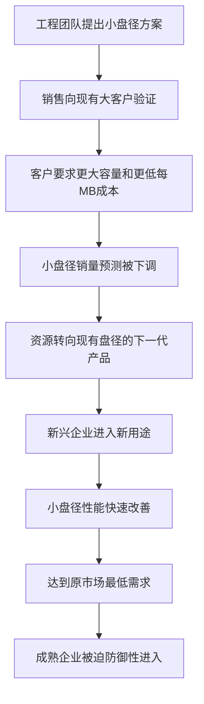
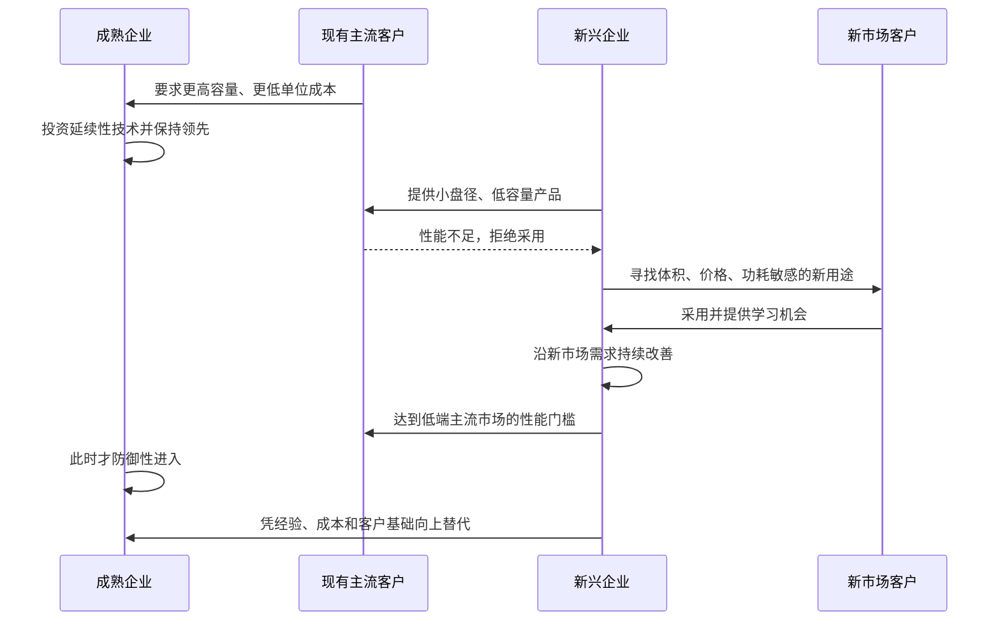

> 章节：第一章“大企业为什么会失败？——从硬盘驱动器行业获得的启示” 
> 作者：克莱顿·克里斯坦森（Clayton M. Christensen） 
> 笔记目标：按原书顺序还原硬盘行业证据、概念区分与因果推理，完整解释图表、计算方法、假设和适用边界。

## 一、本章要回答的问题

本章追问的不是“落后企业为什么失败”，而是一个更难的问题：**为什么积极创新、技术能力强、认真听取客户意见的行业领导者，会在某些技术变革中反复失败？**

作者选择硬盘驱动器行业作为商业研究中的“果蝇”。果蝇世代短，遗传学家能迅速观察多轮变化；硬盘行业也具有类似优势：技术、产品结构、市场和企业在短时间内反复出现、成长和衰退。研究者可以先从一轮变化中提出解释，再用后续多轮变化检验它，而不必等待几十年。

本章的核心反常现象是：

> 领先企业因认真服务现有客户、投资客户下一代所需产品而成功；它们后来又因同样的做法而失败。

这句话不能被简化成“不要听客户”。真正要区分的是：

- 当技术沿现有客户重视的性能轨道改善时，客户导向会帮助企业成功。
- 当技术在主流指标上暂时较差、却为另一类客户提供新价值时，只听现有客户会使企业错过新市场。

作者的论证路径如下：

原章没有形式化的定理或固定算法。它主要使用历史比较、增长轨道和最佳拟合线建立经验性解释。本笔记加入的公式，是对原书图表和数量关系的展开，不应被误读成作者声称的自然定律。

## 二、硬盘驱动器的工作原理

### 2.1 为什么先讲硬件原理

要判断一项创新究竟提高了原有性能，还是改变了市场评价方式，必须先知道硬盘由什么组成、性能从哪里来。否则，“磁头创新”“产品结构创新”和“盘径缩小”只是一串名称，无法解释它们为何对企业产生不同影响。
> **原书图示**：标准硬盘驱动器的主要元件
标准机械硬盘主要包括：

- **磁盘盘片**：铝或玻璃基底，表面覆盖磁性材料，用磁化方向保存信息。
- **读写磁头**：悬浮在盘面上方的微型电磁器件，负责改变或感知局部磁化状态。
- **传动臂与驱动电机**：把磁头移动到目标磁道。
- **旋转电机**：让盘片高速旋转，使目标扇区经过磁头。
- **控制电路**：协调寻道、旋转、编码、纠错以及与计算机之间的数据交换。
- **密封外壳与空气过滤系统**：减少灰尘对极小磁头间隙的破坏。

### 2.2 写入与读取的直觉过程

写入时，控制器让电流以不同方向通过磁头线圈，使磁头磁极变化；盘面经过磁头下方时，局部磁畴被磁化为不同方向。系统把这些可区分的磁化状态编码成二进制信息。

读取时，盘面磁场随磁畴经过磁头而改变，引起磁通量变化，并在读出线圈中产生微弱电信号。控制电路把信号放大、判决和解码，恢复为比特序列。

读取过程可用法拉第电磁感应定律帮助理解：

$$
e=-N\frac{d\Phi}{dt}
$$

其中：

- $e$ 是线圈中的感应电动势；
- $N$ 是线圈匝数；
- $\Phi$ 是穿过单匝线圈的磁通量；
- $d\Phi/dt$ 表示磁通量随时间的变化率；
- 负号来自楞次定律，表示感应电流总是反抗造成磁通变化的原因。

盘片旋转使不同磁畴快速经过磁头，$\Phi$ 随时间变化，于是产生可检测信号。这个公式只说明传统感应式读取的物理直觉；现代磁阻磁头通过电阻随磁场变化来读出信号，机理不完全相同。

### 2.3 关键性能指标

本章反复使用以下指标：

- **总容量**：一块硬盘可保存的数据总量。
- **磁录密度**：单位盘面面积可保存的数据量，常以 Mbpsi，即每平方英寸兆比特表示。
- **存取时间**：定位磁道、等待扇区转到磁头下方并开始传输所需时间。
- **每兆字节成本**：总价格除以容量，衡量单位存储的经济性。
- **体积、重量、功耗与耐用性**：在大型机市场早期不占主导，却在台式机、便携式计算机等新市场极其重要。

粗略地说，磁录密度可拆成沿磁道方向的线密度和单位半径上的磁道密度：

$$
D_a\approx D_bD_t
$$

其中 $D_a$ 是面密度，$D_b$ 是每英寸磁道长度上的比特数，$D_t$ 是每英寸半径上的磁道数。进一步忽略伺服区、格式化、纠错和保留空间后，容量可近似写成：

$$
C\approx n\pi(r_o^2-r_i^2)D_a\eta
$$

这里 $n$ 是可记录盘面数，$r_o$、$r_i$ 是数据区外、内半径，$\eta$ 是把物理面积折算为可用容量的效率系数。该式解释了为什么更小盘径会降低单盘容量，却可能通过更高面密度、多盘片和编码改进逐步追上。它只是工程近似，不能替代具体产品规格。

## 三、最早的硬盘驱动器的出现

### 3.1 RAMAC 与基本架构

IBM 圣何塞研究实验室在 1952 至 1956 年间研制出最早的硬盘驱动器 RAMAC。它体积接近大型冰箱，装有 50 个直径 24 英寸的盘片，却只能存储约 5MB 数据。
> **原书图示**：IBM研制的第一个硬盘驱动器
IBM 后续还推出可移动磁盘、软盘和温切斯特硬盘等关键设计。重要的不只是产品本身，而是这些创新形成了行业对“硬盘是什么、应提高什么性能”的共同认识。

### 3.2 从企业内部部件到独立产业

IBM 最初为自己的计算机生产硬盘。产业随后分化出三类供给方式：

| 方式 | 含义 | 典型客户关系 |
|---|---|---|
| 垂直一体化 | 计算机厂商为自家系统设计、生产硬盘 | 内部配套市场 |
| PCM | 插接兼容设备商以较低价格销售 IBM 兼容或增强产品 | 直接争夺 IBM 客户 |
| OEM | 独立硬盘企业向多家非一体化计算机厂商供货 | 外部原始设备市场 |

1976 年，行业产值约 10 亿美元，其中专业化生产约占 50%，PCM 与 OEM 各约占 25%。到 20 世纪 80 年代中期，PCM 衰退，OEM 约占全球产量的四分之三。市场结构从“计算机厂商自制部件”逐渐转向专业化供应。

### 3.3 高增长与高淘汰率

到 1995 年，行业产值增至约 180 亿美元，但企业死亡率极高：

- 1976 年领先的 17 家企业中，到 1995 年除 IBM 外，其余 16 家的硬盘业务都已失败或被收购。
- 此后又有 129 家企业进入，其中 109 家也已失败。
- 存活到 1996 年的厂商中，除 IBM、富士通、日立和 NEC 外，其他都是 1976 年以后进入者。

这些数字提出了初始解释：也许技术变化太快，企业只要稍慢一步就会被淘汰。作者随后把这一猜想称为“科技泥流假设”，并用数据检验它。

### 3.4 复合增长率怎样计算

若某指标从初值 $X_0$ 经 $n$ 期增长到 $X_n$，假设每期按相同比例 $g$ 复合变化，则：

$$
X_n=X_0(1+g)^n
$$

两边除以 $X_0$，再取 $n$ 次方根：

$$
1+g=\left(\frac{X_n}{X_0}\right)^{1/n}
$$

因此复合增长率为：

$$
g=\left(\frac{X_n}{X_0}\right)^{1/n}-1
$$

原书称硬盘面密度长期平均每年提高约 35%，并列出从 1967 年每平方英寸 50kb，到 1973 年 1.7Mb、1981 年 12Mb、1995 年 1100Mb 的若干节点。端点是不同年份的行业观察值，直接用任意两个端点计算未必严格等于作者基于完整数据所得的趋势率。

硬盘体积变化更容易复核。最小的 20MB 硬盘从 1978 年约 800 立方英寸缩小到 1993 年约 1.4 立方英寸，共 15 年：

$$
g=\left(\frac{1.4}{800}\right)^{1/15}-1\approx-34.5\%
$$

即体积平均每年约缩小 35%，与原书描述一致。这里的负号表示下降；若说“缩小率”，通常报告其绝对值。

### 3.5 经验曲线及其推导
> **原书图示**：硬盘驱动器价格经验曲线
经验曲线描述累计产出增加时单位成本下降的经验关系。常用形式为：

$$
C(Q)=C_0\left(\frac{Q}{Q_0}\right)^b
$$

其中：

- $Q$ 是累计产出，本图用累计生产的太字节数衡量；
- $C(Q)$ 是每兆字节经币值调整后的价格；
- $Q_0$、$C_0$ 是基准累计产出和基准成本；
- $b<0$ 是经验曲线指数。

若累计产出翻倍，即 $Q=2Q_0$，则：

$$
\frac{C(2Q_0)}{C_0}=2^b
$$

图 1.3 的“53% 斜率”准确含义是**进步比率为 53%**：累计太字节数每翻一倍，每兆字节价格降到此前的 53%，而不是只下降 53 个百分点。于是：

$$
2^b=0.53
$$

$$
b=\frac{\ln0.53}{\ln2}\approx-0.916
$$

若累计产出连续翻倍 $k$ 次，则：

$$
C_k=C_0(0.53)^k
$$

例如翻倍 4 次，成本约剩：

$$
(0.53)^4\approx0.079
$$

即约为初始成本的 7.9%。原书还指出，每兆字节价格连续 20 多年每季度约下降 5%。若每季度同比例下降，年度价格系数为：

$$
0.95^4\approx0.8145
$$

即一年约下降 $1-0.8145=18.55\%$。

经验曲线是观察到的相关关系，不是“产量本身自动制造低成本”的定理。规模经济、工艺学习、良率提高、产品设计、供应链议价和技术进步都会同时影响成本；价格还受竞争强度和利润率影响。因果分析不能只看曲线斜率。

## 四、技术变革的影响

### 4.1 科技泥流假设

**定义：**科技泥流假设认为，企业处在永不停息的技术变化上，必须持续快速前进；一旦跟不上技术速度，就会被淘汰。

它很直观，也符合硬盘行业的高淘汰率。但一个解释不能只“听起来合理”，还要回答：失败企业是否真的在技术开发上系统落后？最困难、最快的技术变化是否真的最容易击败领导者？

### 4.2 作者怎样检验假设

作者收集了 1975 至 1994 年全球硬盘企业每年推出产品的技术和性能规格，主要资料来自《磁盘/趋势报告》。数据库允许研究者：

1. 识别每轮技术变化由谁率先开发和商业化；
2. 追踪技术在企业之间传播的过程；
3. 比较成熟企业与新兴企业的进入时间和产品性能；
4. 衡量技术对容量、速度、面密度等指标的影响；
5. 检查“技术难度”与“企业失败”是否一致出现。

结果否定了科技泥流假设：成熟企业在许多最复杂、最昂贵的技术变化中反而领先；真正使它们失败的，常是技术上较简单、初期性能较低的结构变化。因此，变化速度和工程难度不是根本解释。

### 4.3 性能改善轨道

**严格定义：**性能改善轨道是某一技术或市场在一个可比较的性能指标上，随时间变化形成的方向与速度。

例如，微处理器可用运行频率近似比较。英特尔处理器从 1979 年 8088 的 8MHz 增至 1994 年奔腾的 133MHz，历时 15 年：

$$
g=\left(\frac{133}{8}\right)^{1/15}-1\approx20.6\%
$$

这与原书所述每年约 20% 相符。

礼来公司的胰岛素杂质从 1925 年约 50000ppm 降至 1980 年约 10ppm，历时 55 年。这里“改善”意味着杂质减少，因此年下降率 $d$ 满足：

$$
10=50000(1-d)^{55}
$$

$$
d=1-\left(\frac{10}{50000}\right)^{1/55}\approx14.36\%
$$

这解释了原书“年改善约 14%”的含义。ppm 是百万分之一；50000ppm 相当于约 5%，10ppm 相当于 0.001%。

### 4.4 为什么“笔记本电脑是否优于大型机”没有单一答案

只有评价维度相同时，“更好”才有严格含义。大型机可能在吞吐量、集中管理和可靠性上更强，笔记本可能在体积、价格、能耗和个人便利性上更好。二者面对不同任务，不能压缩为一条绝对性能排名。

这推动作者区分两类变化：

- **延续性技术**：沿主流客户已经重视的性能维度继续改善。
- **破坏性技术**：重新定义性能组合，在原主流维度上初期较差，却在新客户重视的维度上更好。

### 4.5 “成熟企业”和“新兴企业”是相对定义

**成熟企业**是在被研究技术出现前已在行业中建立地位，并在上一代主导技术上领先的企业。**新兴企业**是在该轮技术变化发生时才进入行业的企业。

这不是永久身份。同一家企业在刚进入 8 英寸硬盘市场时是新兴企业；当 5.25 英寸硬盘出现时，它已经是成熟企业。相对定义避免把结果归因于某些企业天生“创新”、另一些企业天生“保守”。

## 五、延续性技术变革

### 5.1 延续性不等于渐进性

**严格定义：**延续性技术提高主流市场一直重视的产品性能，使产品沿既有价值轨道前进。

它既可以是微小改进，也可以是突破性创新：

| 工程变化 | 若继续提高主流指标 | 分类 |
|---|---|---|
| 改善铁氧体颗粒、加工精度 | 提高面密度 | 渐进且延续性 |
| 薄膜磁头、磁阻磁头 | 大幅提高面密度 | 突破且延续性 |
| 14 英寸温切斯特结构 | 延续面密度与容量轨道 | 结构突破但仍属延续性 |

因此，“突破性”回答技术变化有多大，“延续性”回答它服务哪种价值轨道。两者不是同一分类轴。

### 5.2 磁头与盘片技术的 S 曲线
> **原书图示**：新读写磁头技术对磁录密度改善轨道的影响
图 1.4 展示铁氧体、薄膜和磁阻磁头技术先后接力，使面密度沿同一方向提高。单项技术常呈 S 形：早期原理尚未掌握，改善慢；中期知识积累，改善加速；后期接近物理或经济极限，边际改善变慢。

可用逻辑斯蒂函数表达理想化 S 曲线：

$$
P(t)=\frac{K}{1+e^{-r(t-t_0)}}
$$

其中 $P(t)$ 是性能，$K$ 是该技术路径的近似上限，$r$ 是改善速度，$t_0$ 是增长最快的拐点。对时间求导：

$$
\frac{dP}{dt}=rP\left(1-\frac{P}{K}\right)
$$

当 $P$ 很小时，知识不足使绝对改进有限；当 $P$ 接近 $K$ 时，因子 $1-P/K$ 接近 0，改善再次放缓；中间阶段增长最快。

该公式是理解工具，不是原书对图 1.4 的拟合结果。真实技术上限可能因材料、工艺或架构改变而移动，数据也未必严格呈对称 S 形。

铁氧体技术通过精细研磨、尺寸控制和更均匀的氧化颗粒，使面密度从 1976 年约 1Mbpsi 增至 1989 年约 20Mbpsi，随后趋缓。薄膜技术接上原轨道，磁阻技术又继续或加快该轨道。技术发生非连续跳跃，但客户获得的仍是同一维度上的更多性能。

### 5.3 温切斯特结构仍是延续性创新
> **原书图示**：温切斯特结构对14英寸硬盘磁录密度的延续性影响
图 1.5 比较可移动磁盘组与 14 英寸温切斯特硬盘。温切斯特是一种产品结构变化，却继续提升原市场重视的磁录密度。因此，不能看到“结构创新”就自动判断为破坏性。

嵌入式伺服、运行长度限制编码（原文 OCR 写作 HLL，通常称 RLL）、部分响应最大似然技术（PRML）、更高转速电机和嵌入式接口也具有相同战略作用：工程方法不同，但都延续客户所要求的性能改善。

### 5.4 为什么成熟企业在延续性技术中领先

薄膜盘片和磁头需要长期研发、大量资金、精密制造和既有客户支持。成熟企业拥有：

- 从主流客户那里获得的明确需求；
- 能负担多年开发的现金流；
- 材料、工艺、测试和制造知识；
- 可把高性能产品商业化的渠道和品牌。

薄膜磁头、薄膜盘片和后来的磁阻磁头都由 IBM、数据控制、DEC、希捷、昆腾等大型企业率先推进。1982 至 1986 年约 60 家新进入者中，只有 4 家试图把薄膜磁头作为首款产品优势，而且都商业失败。新兴企业通常先用成熟铁氧体技术建立业务，再考虑升级。

### 5.5 图 1.6 如何支持结论
> **原书图示**：成熟企业在延续性技术变革中的领先地位
图 1.6 分别统计采用薄膜盘片、薄膜磁头、14 英寸温切斯特结构和 RLL 记录码的企业数量。深色部分代表成熟企业，浅色部分代表新兴企业。各图虽然对应不同难度、元件和结构，却呈现一致模式：成熟企业在早期采用者中占主导。

这构成对科技泥流假设的反证：如果失败源于成熟企业普遍保守、厌恶风险或缺乏技术能力，它们不应在昂贵而困难的延续性技术中持续领先。

## 六、在破坏性技术创新来临时遭遇失败

### 6.1 破坏性技术的严格含义

在本章语境中，破坏性技术具有以下结构：

1. 初期在主流客户最重视的指标上更差，不能满足现有用途。
2. 它在另一组属性上更有价值，如更小、更轻、更便宜或更省电。
3. 新市场或新用途愿意采用它，并允许厂商持续改进。
4. 技术改善最终使它满足更高端市场，进而进入原领导者的市场。

它的战略影响不来自工程复杂性。硬盘行业中最关键的破坏性创新，往往只是用成熟元件组成更小、更简单的产品结构。

### 6.2 1981 年 8 英寸与 5.25 英寸硬盘对比
> **原书图示**：5.25英寸温切斯特硬盘的破坏性属性
原书表 1.1 的数据如下：

| 属性 | 8 英寸硬盘，微型计算机市场 | 5.25 英寸硬盘，台式计算机市场 |
|---|---:|---:|
| 容量 | 60MB | 10MB |
| 体积 | 566 立方英寸 | 150 立方英寸 |
| 重量 | 21 磅 | 6 磅 |
| 存取时间 | 30 毫秒 | 160 毫秒 |
| 每兆字节成本 | 50 美元 | 200 美元 |
| 单位成本 | 3000 美元 | 2000 美元 |

从微型计算机客户的标准看，5.25 英寸硬盘明显更差：

- 8 英寸容量是它的 $60/10=6$ 倍；
- 5.25 英寸存取时间是 $160/30\approx5.33$ 倍，即慢得多；
- 5.25 英寸每 MB 成本是 $200/50=4$ 倍。

但在新市场重视的属性上，结论相反：

- 5.25 英寸体积只有 $150/566\approx26.5\%$；
- 重量只有 $6/21\approx28.6\%$；
- 整机价格低 $1000$ 美元，约低三分之一。

因此，“产品更好还是更差”取决于客户任务。大型或微型计算机重视容量、速度和单位容量成本；早期台式机更在意产品能否装进机箱、整机是否买得起。破坏性来自价值维度改变，而非所有指标同时改善。

### 6.3 图 1.7：市场需求与技术供给的交叉
> **原书图示**：硬盘容量需求与供给的交汇轨线
图 1.7 的纵轴是硬盘容量，采用对数刻度；横轴是年份。实线表示各类中等价位计算机标准配置所选择的容量，作为市场需求轨道；虚线表示每年上市的某种盘径硬盘的平均容量，作为技术供给轨道。

对数纵轴很重要。若容量按固定百分比复合增长：

$$
C(t)=C_0(1+g)^t
$$

两边取自然对数：

$$
\ln C(t)=\ln C_0+t\ln(1+g)
$$

于是指数增长在半对数图上变成直线，斜率 $\beta=\ln(1+g)$，反推增长率：

$$
g=e^\beta-1
$$

这就是图中直线斜率可以代表年增长率的原因。

### 6.4 14 英寸到 8 英寸：第一轮完整破坏

1974 年，中等价位大型机标准配置约需 130MB，随后需求每年增长约 15%；14 英寸硬盘供给却每年增长约 22%，并逐渐进入科学计算机和超级计算机等更高端市场。

1978 至 1980 年，Shugart Associates、Micropolis、Priam、昆腾等新兴企业推出 10MB 至 40MB 的 8 英寸硬盘。大型机客户要求约 300MB 至 400MB，当然拒绝这些产品。新兴企业转而服务王安、DEC、Data General、Prime、惠普等微型计算机厂商，因为 14 英寸硬盘对这些机器太大、太贵。

微型计算机容量需求约每年增长 25%，8 英寸硬盘供给却以超过 40% 的速度改善。供给相对需求的比例每年乘以：

$$
\frac{1+40\%}{1+25\%}=\frac{1.40}{1.25}=1.12
$$

四年后，相对比例约变为：

$$
1.12^4\approx1.57
$$

即相对于微型机需求，供给能力提高约 57%。当 8 英寸硬盘在自身市场持续接受延续性改进后，它逐渐达到低端大型机的容量要求，同时每 MB 成本降到 14 英寸产品以下，并凭更小机械尺寸获得振动控制等优势。三四年内，它开始向上进入大型机市场。

若把供给和需求分别写成：

$$
S(t)=S_0(1+g_s)^t,\qquad R(t)=R_0(1+g_r)^t
$$

其中 $S_0<R_0$，交点满足 $S(t^*)=R(t^*)$。推导得到：

$$
t^*=\frac{\ln(R_0/S_0)}{\ln((1+g_s)/(1+g_r))}
$$

有限正交点要求 $g_s>g_r$。公式揭示“初期不够好，后来足够好”的条件，但现实中容量之外还有价格、可靠性、接口和渠道等门槛，不能只靠一个交点预测市场替代年份。

### 6.5 成熟企业为何失败

14 英寸厂商中约三分之二从未推出 8 英寸产品，另三分之一平均晚约两年。最终，独立 OEM 市场中的 14 英寸厂商全部退出。

证据不支持“它们不会做”：

- 8 英寸产品主要使用现成元件，技术并不更复杂。
- 成熟企业后来推出的 8 英寸产品，容量、面密度、存取时间和每 MB 价格与新兴企业相当。
- 1979 至 1983 年，两类企业改善关键性能的速度相近。

真正差异在于**何时决定商业化、为谁商业化**。新兴企业没有大型机客户和高端利润需要保护，只能寻找新用途；成熟企业面对明确要求更大容量、更低每 MB 成本的优质客户，把资源继续投向 14 英寸产品是合理选择。

### 6.6 结论的边界

“14 英寸厂商全部失败”主要适用于独立 OEM 厂商。IBM 等垂直一体化企业拥有内部市场，能缓冲外部变化；但 IBM 也通过圣何塞、罗切斯特和日本藤泽等相对独立机构分别服务高端、中端和台式机市场。这提示后文的组织解法：不同市场可能需要不同资源环境。

作者还对比了光刻机研究。其他行业中新兴企业可能从外部市场带入先进知识，确实在工程性能上领先；硬盘案例中的创业者多来自原有企业，没有同样的外部技术优势。因此，“商业化时机而非技术能力”是本案例的解释，不能无条件推广到所有行业。

## 七、受制于客户

### 7.1 “受制”不是客户故意误导

成熟厂商访问大型机客户，客户如实表示不需要容量更低的 8 英寸硬盘，而需要更大容量和更低单位成本。企业据此配置资源，在当时完全合理。

问题在于，客户只能清楚表达自己现有任务的下一步需求，不能代表尚未形成的新市场。销售预测、利润目标和预算审批又会放大大客户的声音，使没有订单的小项目持续失去优先级。

这里的“客户权力”通过资源分配流程发挥作用，不等于客户直接命令企业。企业越擅长筛除没有客户、利润低、规模小的方案，越可能在延续性创新中高效，也越难给破坏性方案成长空间。

### 7.2 实线与虚线不能混淆

图 1.7 中：

- 实线 A 至 E 表示不同计算机市场中，中等价位标准配置所选择的容量趋势。
- 虚线表示各盘径每年上市产品的平均容量趋势。

实线不是人类使用存储的物理极限，而是在当时价格、软件、用途和可供产品条件下的**显示性选择**。虚线也不是某项技术的理论极限，而是当年实际上市产品的未加权平均值。把二者当成精确自然规律，会夸大图表的预测能力。

## 八、5.25 英寸硬盘的出现

### 8.1 从不符合微型机需求到创造台式机市场

1980 年，希捷推出 5MB 和 10MB 的 5.25 英寸硬盘；当时微型计算机厂商需要 40MB 至 60MB，因此没有兴趣。希捷、Miniscribe、Computer Memories 等企业只得寻找其他用途，最后主要进入台式个人电脑。

这不是先预测出一个庞大市场再执行计划。1980 年没人知道有多少人会为台式机购买硬盘，早期厂商向各种可能客户销售，在反复尝试中发现并共同创造应用场景。

### 8.2 两次增长浪潮

5.25 英寸硬盘经历两次不同增长：

1. **新市场增长**：台式机看重尺寸和整机可负担性，采用原市场不需要的产品。
2. **向上替代增长**：产品容量每年约提高 50%，快于台式机需求约 25% 的增速，供给轨道与微型机、低端大型机需求轨道相交，开始替代更大盘径。

供给相对需求每年的倍率为：

$$
\frac{1.50}{1.25}=1.20
$$

十年累计倍率为：

$$
1.20^{10}\approx6.19
$$

这不表示容量本身一定增长 6.19 倍，而表示在恒定增长率假设下，供给相对于台式机需求的容量裕量扩大约 6.19 倍。

成熟 8 英寸厂商平均晚约两年进入；到 1985 年，只有一半推出 5.25 英寸产品。四家主要 8 英寸厂商中，只有 Micropolis 成为重要的 5.25 英寸供应商。

### 8.3 为什么“两年”可能致命

两年差距不只等于少卖两年产品。早期市场尚未定型，进入者同时学习：

- 谁是真正客户；
- 哪些属性值得优化；
- 可接受的价格和可靠性；
- 如何制造、销售和提供服务；
- 新业务怎样形成低成本结构。

后来者等市场明确后才进入，面对的是已积累产品、客户和流程知识的竞争者。因此，在未知市场中的时间价值主要表现为学习，而不只是短期份额。

## 九、模式的重复：3.5 英寸硬盘的出现

### 9.1 Rodime、康诺与便携式计算机

Rodime 于 1984 年率先研制 3.5 英寸硬盘，但市场真正起量是在康诺 1987 年推出产品后。康诺通过电子元件替代部分机械功能、用微码替代部分电子功能，使硬盘更小、更轻、更耐用。

康诺第一年收入达 1.13 亿美元，几乎全部来自曾投资 3000 万美元的康柏。产品主要进入便携式、膝上型和小型台式机。客户愿意接受较低容量和较高每 MB 成本，以换取轻量、耐用、低功耗和小体积。

### 9.2 希捷并非没有看到技术

希捷工程团队早在 1985 年就做出 3.5 英寸样机，并让销售人员向 IBM 等现有台式机客户征求意见。这些客户需要 40MB 至 60MB，样机约 20MB、成本更高，因而反应冷淡。项目销量预测被下调，管理层转而支持市场更大、收入更高的下一代 5.25 英寸产品。

这是一条关键证据链：

1. 技术已被企业看到并做出样机，排除“信息完全缺失”。
2. 现有客户按自身任务合理拒绝，排除“客户判断失真”。
3. 管理层比较市场规模和收入后取消项目，符合成熟企业财务逻辑。
4. 新市场由康诺与便携式计算机客户共同建立，说明缺的是合适的验证场所。

希捷没有问错产品问题，而是问错了客户。让台式机客户评价便携式计算机部件，等于用旧价值网络筛选新价值网络。

### 9.3 防御性进入与自我实现的蚕食

希捷到 1988 年才推出 3.5 英寸硬盘，此时该盘径容量轨道已经与台式机需求相交，行业累计销售约 7.5 亿美元。到 1991 年，希捷的 3.5 英寸产品仍几乎不卖给便携式计算机厂商，许多产品加装框架后装入原为 5.25 英寸硬盘设计的台式机。

这说明希捷是为防守旧市场而进入，而非为发展新市场而进入。常见解释“企业怕新产品蚕食旧产品”在此并不充分：早期便携式市场与台式机市场不同，新产品本可新增业务；企业等待到新技术进入旧市场后才行动，蚕食才真正发生，于是担忧变成自我实现预言。

到 1988 年，成熟 5.25 英寸厂商中只有约 35% 推出 3.5 英寸产品。它们后来产品的工程性能并不差，进一步支持“资源配置与市场选择障碍”而非“研发能力障碍”。

## 十、Prairietek、康诺与 2.5 英寸硬盘

### 10.1 为什么 2.5 英寸不是同样的破坏

Prairietek 于 1989 年推出 2.5 英寸硬盘，几乎获得当时约 3000 万美元的全部市场；康诺 1990 年初进入，到年底取得约 95% 份额，Prairietek 于 1991 年底破产。其他 3.5 英寸厂商也迅速跟进。

表面上看，这仍是盘径缩小，为什么成熟企业这次成功？因为技术分类必须相对于客户价值，而不能只看物理尺寸。

康诺及其竞争者的现有客户已经是东芝、Zenith、夏普等膝上型计算机厂商。这些客户正需要更小、更轻、更耐用、低功耗的硬盘。2.5 英寸虽然容量较低，却沿着便携式计算机客户重视的轨道改善。因此，对该价值网络而言，它是**延续性技术**，成熟企业自然愿意跟随客户投入。

### 10.2 1.8 英寸再次构成破坏

1992 年出现的 1.8 英寸硬盘却首先进入便携式心脏监护装置，而不是计算机市场。到 1995 年，约 1.3 亿美元的 1.8 英寸市场中，新兴企业占 98%。它再次为一个原有客户不重视的新用途提供价值，因而具有破坏性特征。

### 10.3 图 1.8 的重复模式
> **原书图示**：新兴企业对破坏性技术的主导地位
图 1.8 比较 8、5.25、3.5 和 1.8 英寸硬盘出现后最初几年中，成熟企业与新进入企业的数量。新兴企业在破坏性盘径早期占明显优势：8 英寸推出两年后，约三分之二生产商为新兴企业；5.25 英寸推出两年后，这一比例约为 80%；1.8 英寸也呈相似格局。

该图统计企业数量，不等于收入、利润或存活概率；新兴企业中也有大量失败者。它支持的是“谁更早参与破坏性市场”，不是“新兴企业必然成功”。Prairietek 的失败正好提醒：率先进入能提供学习机会，却不保证最终胜出。

## 十一、小结

### 11.1 本章发现的三种模式

**第一，破坏性创新往往技术简单。**它用成熟元件形成新结构，在原市场关键指标上较差，却让此前因体积、价格或功耗而无法实现的新应用成为可能。

**第二，复杂突破不一定具有破坏性。**薄膜磁头、磁阻磁头、PRML 等先进技术继续提高主流客户重视的容量和面密度，属于延续性创新。成熟企业有客户、资金和能力，往往领先。

**第三，成熟企业的优势和劣势来自同一机制。**客户推动企业向更高性能、更高利润市场移动，使它在延续性创新中强大，却缺乏向下观察、进入小市场和寻找新用途的动力。

### 11.2 竞争过程的完整因果链

### 11.3 本章尚未完全回答的问题

第一章证明了“不会研发”不足以解释失败，并把原因指向客户与市场选择，但还没有细拆组织内部怎样把客户需求转成预算、毛利率和项目优先级。第二章将用“价值网”等概念继续解释这一机制。

## 十二、附件 1.1：图 1.7 的数据和方法

### 12.1 两类数据源

市场需求数据来自《数据资源》：它逐年列出各计算机厂商每种型号的标准配置，包括 RAM、硬盘、价格和出厂年份，并按大型机、微型或中型机、台式机、便携式或膝上型机、笔记本等分类。

硬盘供给数据来自《磁盘/趋势报告》：它记录每年上市的各盘径硬盘规格。作者对某盘径当年全部上市产品的容量取未加权平均值。

截至 1993 年，1.8 英寸硬盘尚未用于手提电脑，所以该潜在计算机市场不存在可观察数据。这一点体现了新市场研究的困难：没有交易，也就没有历史序列可供外推。

### 12.2 市场需求轨道怎样构造

对每一年、每类计算机，作者按价格和硬盘容量排列所有型号，选取中等价位型号的标准配置，再对整个时间序列拟合趋势线。图 1.7 用实线表示这些最佳拟合线。

之所以把标准配置容量解释为市场“要求”，是因为市场上同时存在容量更高的产品；中等价位机器没有选到技术上限，说明该容量更接近用户在当时成本和用途下愿意购买的水平。

但“要求”应理解为显示性选择，不是最低物理需求。标准配置还会受厂商捆绑、软件生态、价格策略和产品分档影响。

### 12.3 技术供给轨道怎样构造

作者对每年上市的某盘径硬盘容量取未加权平均，再拟合时间趋势，用虚线表示。未加权意味着每款型号权重相同，不按销量加权：一款几乎无人购买的高容量型号，与畅销型号对平均值影响相同。因此虚线衡量的是“当年产品目录提供了什么”，而不是“市场实际购买的平均容量”。

### 12.4 最佳拟合线的数学含义

由于容量近似指数增长且图使用对数纵轴，可拟合：

$$
\ln C_t=\alpha+\beta t+\varepsilon_t
$$

其中：

- $C_t$ 是第 $t$ 年容量；
- $\alpha$ 是对数容量截距；
- $\beta$ 是对数容量随时间的趋势斜率；
- $\varepsilon_t$ 是实际数据偏离趋势的误差。

普通最小二乘选择 $\alpha$、$\beta$，使残差平方和最小：

$$
\min_{\alpha,\beta}\sum_{t=1}^{n}(\ln C_t-\alpha-\beta t)^2
$$

对参数求一阶条件可得斜率：

$$
\hat\beta=
\frac{\sum_{t=1}^{n}(t-\bar t)(\ln C_t-\overline{\ln C})}
{\sum_{t=1}^{n}(t-\bar t)^2}
$$

截距为：

$$
\hat\alpha=\overline{\ln C}-\hat\beta\bar t
$$

再由 $\beta=\ln(1+g)$ 得年复合增长率：

$$
\hat g=e^{\hat\beta}-1
$$

推导依据是让残差平方和分别对 $\alpha$、$\beta$ 的偏导为零。原书附件只说明使用最佳拟合线，没有给出上述回归公式；这里是对其常见计算方法的补充。

### 12.5 方法假设与局限

1. **趋势近似稳定。**直线假设对数容量按近似固定速度增长；技术跳跃可能使斜率分段变化。
2. **产品平均能代表技术供给。**未加权平均会受型号数量和极端产品影响。
3. **中等价位标准配置能代表需求。**它忽略同类市场内部从低端到高端的宽区间。
4. **容量足以代表竞争。**体积、可靠性、功耗、接口、价格等也会决定采用。
5. **相关轨道不自动证明因果。**轨道交叉显示进入条件，却不能单独证明客户资源分配导致企业失败；作者还依赖企业访谈、进入时间和产品性能比较来补强机制。

边际最高容量通常远高于图中的平均或中值，低端容量也远低于趋势线。图 1.7 是为了显示行业基本方向而压缩了分布，不能把线附近的交点当成精确替代时刻。

## 十三、易混淆概念与常见误解

### 13.1 “技术越先进，越可能颠覆领导者”

错误。最先进的薄膜和磁阻技术属于延续性创新，成熟企业反而领先；较简单的小盘径结构才引发破坏。战略分类取决于价值轨道，不取决于实验室难度。

### 13.2 “盘径缩小天然是破坏性创新”

错误。3.5 英寸到 2.5 英寸对便携式计算机客户是延续性变化，因为客户本来就需要更小、更轻、低功耗；1.8 英寸最初进入心脏监护设备，则形成新价值网络。技术必须相对于具体市场分类。

### 13.3 “成熟企业失败是因为没有发现技术”

错误。希捷很早已有 3.5 英寸样机。问题发生在客户验证、销量预测和商业化资源配置阶段，而非单纯研发阶段。

### 13.4 “认真听客户总是错误的”

错误。在绝大多数延续性创新中，客户需求帮助成熟企业集中资源并保持领先。危险的是只让现有客户评价为另一类用途设计的产品。

### 13.5 “先进入新市场就一定成功”

错误。Prairietek 率先进入 2.5 英寸市场却很快失败。早期进入提供学习和塑造市场的机会，不消除执行、资金、竞争和技术风险。

### 13.6 “性能轨道交叉就会立刻替代”

错误。达到容量门槛只是必要条件之一。切换还受价格、可靠性、渠道、品牌、兼容性、认证和客户迁移成本影响。

## 十四、作者方法的有效性、局限与替代解释

### 14.1 为什么这种方法有效

- 同一行业出现多轮盘径变化，提供重复检验，而不是依赖一个著名案例。
- 延续性与破坏性技术共享行业背景，可以减少宏观环境差异的干扰。
- 产品规格、进入时间、企业身份和访谈相互印证，不只依赖管理者回忆。
- 理论同时解释成熟企业为何成功和为何失败，比“企业变得愚蠢”更有约束力。

### 14.2 作者排除或削弱了哪些解释

| 替代解释 | 反证或不足 |
|---|---|
| 技术变化太快 | 成熟企业在多项快速、复杂延续性创新中领先 |
| 企业保守、害怕风险 | 它们投入巨资开发薄膜、磁阻等高风险技术 |
| 缺乏工程能力 | 后发推出的小盘径产品性能与新兴企业相当 |
| 单纯担心自我蚕食 | 新技术早期服务不同市场，本可不直接蚕食 |
| 新兴企业技术更强 | 硬盘创业团队多来自原行业，使用现成元件 |

### 14.3 尚不能完全排除的局限

- 案例研究不能像随机实验那样排除所有混杂因素。
- 企业被归类为成熟或新兴后，规模、资金、治理和激励仍可能共同影响结果。
- 失败企业资料可能不如成功企业完整，存在选择偏差。
- 图表按企业数量而非销量、利润或存活率统计，不能直接估计成功概率。
- “破坏性”具有事后识别风险，应在事前明确初始市场、性能缺口和向上移动条件。
- 硬盘是模块化程度高、性能量化清晰的部件产业；在监管强、服务不可分割或网络效应显著的行业，轨道机制可能不同。

### 14.4 可配合使用的分析工具

- **技术 S 曲线**：判断单项技术是否接近性能上限，但不能单独判断市场破坏性。
- **价值链和产业结构分析**：解释利润、渠道和供应商权力。
- **实物期权思维**：在市场未知时用小额分阶段投资保留选择权。
- **组织双元理论**：讨论成熟业务的利用与新业务的探索怎样并存。
- **客户任务分析**：识别新客户为何愿意用主流性能更差的产品。

这些工具补充而非替代本章框架。第一章最独特的贡献，是把技术轨道、客户价值和企业身份放进同一个历史过程中观察。

## 十五、本章知识结构总览

| 层次 | 核心结论 | 证据 |
|---|---|---|
| 工程层 | 技术变化有元件、结构和编码等多种形式 | 磁头、盘片、温切斯特、RLL、PRML |
| 性能层 | 突破程度与破坏性不是同一回事 | 薄膜和磁阻技术复杂但属延续性 |
| 市场层 | 不同市场重视不同属性，并有不同需求增速 | 大型机、微型机、台式机、便携式计算机 |
| 竞争层 | 小盘径先在新市场成长，再沿性能轨道向上进入 | 14→8→5.25→3.5 英寸 |
| 组织层 | 现有客户通过资源配置使成熟企业继续向上 | 希捷 3.5 英寸样机与客户反馈 |
| 方法层 | 供需轨道来自不同数据源和拟合方法 | 附件 1.1 的实线、虚线构造 |

本章最终把开头的问题改写得更精确：**成熟企业并非不善于创新，而是不善于把资源投向现有客户尚不需要、规模尚小、评价维度不同的新市场。**它们在延续性轨道上越优秀，越容易向更高性能和更高利润移动；新兴企业则因为无处可退，被迫寻找低端或全新用途，并在其中建立向上进入的能力。

这不是宿命。它首先是一项诊断：当新方案在主流指标上较差，却在体积、价格、便利性或其他维度上开启新用途时，不能只把它交给现有客户和现有财务标准评判。下一章将继续解释，企业所在的价值网怎样把这些市场信号转化为稳定的资源分配模式。
