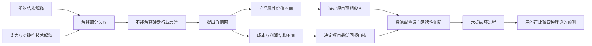
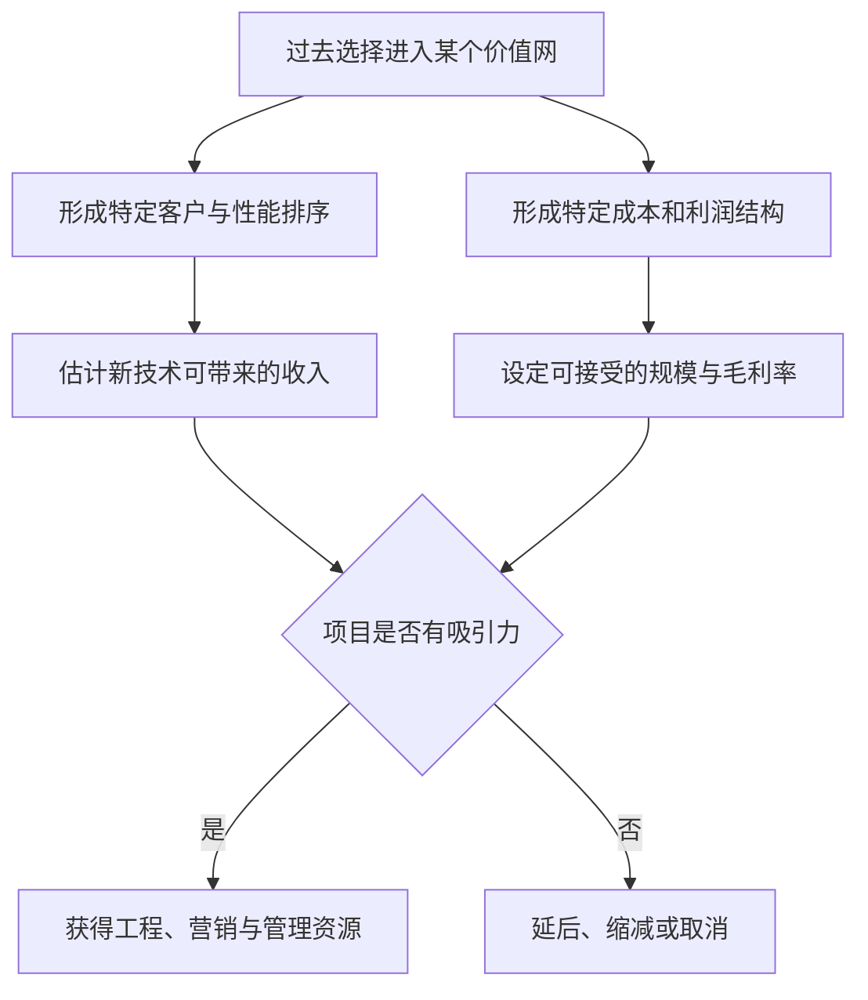
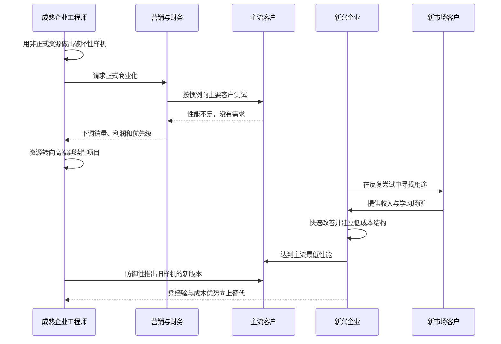

> 章节：第二章“价值网和创新推动力” 
> 作者：克莱顿·克里斯坦森（Clayton M. Christensen） 
> 笔记目标：按原书小节顺序还原价值网理论的提出、证据、六步决策过程与闪存检验，并说明概念、公式、假设和适用边界。

## 一、本章的问题与论证路线

第一章已经排除一个简单解释：硬盘行业领导者并不是普遍缺乏技术能力。它们能够率先完成薄膜磁头、磁阻磁头等复杂的延续性创新，却会错过技术相对简单的小盘径硬盘。第二章因此追问：**如果失败不主要来自技术难度，那么是什么使优秀企业把资源持续投向某些创新，却冷落另一些创新？**

作者先评估两类已有解释：组织结构不适应、既有能力被新技术摧毁；然后提出第三种解释，即**价值网理论**。本章的推理链是：

本章没有给出数学定理，也没有把六个步骤写成可机械执行的算法。它建立的是一个经验性因果框架：企业所在环境如何塑造价值判断，价值判断又如何塑造资源分配。笔记中的公式用于展开原书的特征回归、毛利率、S 曲线和轨道交点，不代表这些关系在任何行业都必然成立。

## 二、从组织和管理上解释为什么企业会遭遇失败

### 2.1 组织结构解释要解决什么问题

一种传统解释认为，失败源于官僚主义、风险规避或组织惰性。亨德森和克拉克给出了更严格的版本：企业组织结构往往对应产品结构，因而擅长在既有组件边界内改进，却可能阻碍需要跨团队重新连接的结构创新。

**产品结构**是组件如何分工、连接并共同实现系统功能的方式。**组件创新**改变某个局部部件的核心设计，接口和整体关系基本不变；**结构创新**则改变组件之间的连接方式，即使每个组件本身并不新。

### 2.2 为什么组织结构会映射到产品结构

研发组织通常按 CPU、存储器、接口、电源等组件分组。只要产品接口稳定，各组可以独立优化，分工会提高效率；若新架构要求原来彼此少沟通的团队高频协作，旧沟通渠道就可能漏掉关键依赖。

特雷西·基德在《新机器的灵魂》中记录了一个形象案例：通用数据公司的汤姆·韦斯特拆开 DEC 的计算机后，仿佛从产品内部看到了 DEC 的组织结构图。直觉是：谁负责什么、谁与谁沟通，会被固化进产品模块和接口。

这可以概括为双向关系：

$$
\text{组织分工}\longrightarrow\text{设计沟通模式}\longrightarrow\text{产品结构}
$$

$$
\text{产品结构变化}\longrightarrow\text{新的沟通需求}\longrightarrow\text{原组织摩擦}
$$

这不是可计算公式，而是因果示意。它解释了为什么“把最优秀的人放进旧组织”仍可能失败，也说明独立团队为何有时有用。

### 2.3 解释力与边界

组织结构理论能解释跨组件协作失灵，却无法充分解释硬盘行业：成熟企业曾成功引入温切斯特结构、薄膜磁头等重大的组件和结构创新，却在能用现成元件实现的 8 英寸、5.25 英寸硬盘上失败。如果结构变化本身就是根因，这种成功与失败分布不应如此稳定地跟随客户市场。

## 三、能力和突破性技术可能是一种解释

### 3.1 渐进式与突破性创新

另一种理论按新技术相对于企业知识基础的距离分类：

- **渐进式创新**：利用并扩展企业已经积累的技术知识、设备和技能。
- **突破性创新**：要求与既有经验显著不同的知识体系，可能使原技能和资产贬值。

这里的“突破性”描述能力断裂程度，不等于本书的“破坏性”。前者问“企业会不会做”，后者问“新方案在哪个价值网产生价值、企业是否愿意商业化”。

| 比较维度 | 渐进/突破 | 延续/破坏 |
|---|---|---|
| 关注对象 | 知识与技术能力变化 | 市场价值与商业化轨道 |
| 核心问题 | 是否沿用既有能力 | 是否满足现有价值网 |
| 典型结果 | 能力增强或能力摧毁 | 服务主流市场或从新价值网进入 |
| 是否必然对应 | 否 | 否 |

### 3.2 路径依赖与能力积累

克拉克认为，企业能力来自历史上反复选择“解决哪些问题、忽略哪些问题”。汽车行业早期选择汽油动力，就使后续工程师持续积累内燃机知识，而不是蒸汽或电力知识。能力具有路径依赖：

$$
K_{t+1}=K_t+L(P_t)
$$

其中 $K_t$ 表示时点 $t$ 的知识存量，$P_t$ 表示当期选择解决的问题，$L(P_t)$ 表示解决该问题带来的学习。公式只是直觉模型：今天的问题选择会改变明天擅长的问题。

塔什曼和安德森的研究进一步指出：若新技术提升既有能力的价值，成熟企业受益；若新技术摧毁既有能力，新兴企业更有优势。原书还引述研究说明，许多技术进步并非只来自最初突破。例如硬盘面密度改善约一半来自新组件技术，另一半来自既有组件和系统设计的持续优化。

### 3.3 硬盘行业为何构成反例

成熟企业引领了许多会废弃旧知识和资产的延续性创新，却错过技术简单的破坏性创新。技术属于组件还是结构、渐进还是突破，风险大小和开发周期，都与领导者是否成功没有紧密对应关系。

更能解释数据的规律是：

- 客户需要某项创新时，成熟企业会投入资金、人才，甚至收购外部能力来完成它。
- 客户不需要某项创新时，即使样机简单且已在内部完成，也难以获得商业化资源。

能力是完成创新的约束，却未必是决定企业是否投入的首要约束。会做与愿意做必须分开。

## 四、价值网和对导致失败因素的新看法

### 4.1 价值网的严格定义

**价值网**是企业识别客户需求、解决问题、回应竞争、确定产品价值并争取利润的商业环境。它不仅包括上下游企业，还包括一套共同的：

- 终端用途与客户任务；
- 产品性能优先级；
- 价格和利润水平；
- 成本结构与服务方式；
- 供应商、集成商、渠道和竞争者关系；
- 市场规模、增长率和开发周期预期。

价值网要解决的理论问题是：为什么同一项技术在一家企业眼中没有意义，在另一家企业眼中却是良机？答案不是双方看到不同的物理技术，而是它们用不同的价值尺度和经济结构评价技术。

### 4.2 价值网、价值链与市场的区别

**价值链**通常描述一家企业内部从研发、生产到销售服务的活动；**市场**通常指一组具有相近需求的买方；**价值网**范围更广，强调多层产品结构中的供应商、集成商、终端用途，以及各参与者共享的性能和成本逻辑。

价值网也受到多西“技术范式”概念影响。技术范式是基于特定科学原理解决一类技术问题的共同方式，它规定“进步”意味着什么。价值网在此基础上增加商业层：同一种技术属性在终端应用中究竟值多少钱。

### 4.3 从价值判断到资源分配

企业过去选择的市场决定它怎样理解技术的经济价值；预期回报又决定资源倾向：

因此，成熟企业在延续性创新中领先、在破坏性创新中落后，不必假定它们忽然变笨。它们只是在当前价值网内理性地比较项目。

## 五、价值网反映了产品结构

### 5.1 产品系统的嵌套结构
> **原书图示**：产品结构的嵌套式或细分系统
图 2.1 从企业管理信息系统逐层向下分解：

1. 管理信息系统包含大型计算机、外设、软件、机房和远程终端。
2. 大型计算机包含 CPU、内存、终端、控制器和硬盘等。
3. 硬盘包含电机、驱动器、轴承、盘片、磁头和控制器。
4. 盘片又包含铝基底、磁性材料、黏合剂、磨料、润滑剂和涂层。

产品是“系统中的系统”。组件性能必须服务上层系统，上层系统最终又服务终端任务。硬盘容量为何有价值，不能只在硬盘层回答，还要看它装入哪种计算机、计算机用于什么工作。

### 5.2 从产品嵌套到企业网络

如果所有层次由 IBM 之类的垂直一体化企业内部生产，图中主要是产品层级；当组件由不同公司交易，产品层级同时变成商业网络：磁头厂卖给硬盘厂，硬盘厂卖给计算机厂，计算机厂再向企业信息系统客户交付。

成熟产业往往专业化程度更高，每个方框背后都有一组竞争者。价值不由单个组件独立决定，而由它在上层系统中的作用以及交易关系共同决定。

## 六、价值的衡量标准

### 6.1 平行价值网
> **原书图示**：三种价值网结构
图 2.2 对比三类计算应用：企业管理信息系统、便携式个人电脑、计算机辅助设计。它们都可能使用硬盘、磁头、RAM 和软件，但性能排序不同：

- 大型机价值网更重视容量、速度和可靠性。
- 便携式计算机更重视耐用性、低功耗、轻薄和小体积。
- CAD 工作站重视图形计算、显示性能和专业软件配合。

同一组件进入不同终端用途，就可能属于平行价值网。价值网的边界在很大程度上由独特的属性排序界定。

### 6.2 特征回归要解决什么问题

仅说“便携客户更重视体积”过于定性。作者利用 1976 至 1989 年数千款硬盘的价格和规格做特征回归，也称享乐价格回归，以估计市场对容量、体积等属性隐含支付了多少价格。

设第 $i$ 款硬盘价格为 $P_i$，具有 $K$ 个属性 $x_{i1},\ldots,x_{iK}$，线性模型为：

$$
P_i=\alpha+\sum_{k=1}^{K}\beta_kx_{ik}+\varepsilon_i
$$

其中：

- $\alpha$ 是不由所列属性解释的基准价格；
- $x_{ik}$ 是容量、体积、存取时间、可靠性等属性；
- $\beta_k$ 是控制其他属性后，第 $k$ 项属性增加一个单位对应的价格变化，即“影子价格”；
- $\varepsilon_i$ 是品牌、渠道、测量误差和遗漏属性等未解释部分。

若以矩阵表示全部样本：

$$
\mathbf y=\mathbf X\boldsymbol\beta+\boldsymbol\varepsilon
$$

普通最小二乘选择 $\hat{\boldsymbol\beta}$ 使残差平方和最小：

$$
S(\boldsymbol\beta)=(\mathbf y-\mathbf X\boldsymbol\beta)^T(\mathbf y-\mathbf X\boldsymbol\beta)
$$

对 $\boldsymbol\beta$ 求导并令其为零：

$$
\frac{\partial S}{\partial\boldsymbol\beta}
=-2\mathbf X^T(\mathbf y-\mathbf X\boldsymbol\beta)=0
$$

得到正规方程：

$$
\mathbf X^T\mathbf X\hat{\boldsymbol\beta}=\mathbf X^T\mathbf y
$$

若 $\mathbf X^T\mathbf X$ 可逆，即属性不存在完全线性相关，则：

$$
\hat{\boldsymbol\beta}=(\mathbf X^T\mathbf X)^{-1}\mathbf X^T\mathbf y
$$

这一步把“价格与某属性同时变化”变成“在控制其他已观测属性后，该属性的边际价格”。

### 6.3 图 2.3 的结果怎样解释
> **原书图示**：不同价值网评估属性价值的差异
1988 年，容量每增加 1MB 的估计影子价格分别为：

| 价值网 | 每增加 1MB 的影子价格 |
|---|---:|
| 大型计算机 | 1.65 美元 |
| 微型计算机 | 1.50 美元 |
| 台式计算机 | 1.45 美元 |
| 便携式计算机 | 1.17 美元 |

例如在模型局部线性成立时，大型机价值网增加 10MB 对应的价格增量约为：

$$
10\times1.65=16.50\text{ 美元}
$$

图中横轴表示每减少 1 立方英寸体积的影子价格。便携式和台式机市场愿意为缩小体积付正溢价，大型机和微型机市场则接近零或为负。也就是说，5.25 英寸、3.5 英寸产品不是“所有市场都更好”，而是在新价值网中把过去不值钱的属性变成了价值。

### 6.4 特征回归的假设与边界

要把 $\beta_k$ 解释为可靠的边际价值，至少依赖：

1. 价格与属性关系在所选函数形式下近似成立；
2. 误差项满足 $E(\varepsilon\mid X)=0$，即遗漏因素不同时系统影响属性和价格；
3. 属性有足够独立变化，不存在完全共线；
4. 不同产品、年份和价值网经过恰当控制，价格可比较；
5. 市场价格能反映边际供需，而非只由厂商策略或短缺决定。

影子价格不是对单个消费者直接询问的愿付价格，也不自动证明因果。品牌、质量、销量选择和技术代际若遗漏，估计会偏。它的价值在于把“不同价值网有不同排序”转化为可观察证据。

## 七、成本结构和价值网

### 7.1 价值网不仅决定产品价值

大型机业务需要高研发支出、低产量定制生产、直接销售队伍和现场维修网络。为了覆盖这些费用，大型机厂商及其 14 英寸硬盘供应商通常需要约 50% 至 60% 毛利率。

便携式计算机厂商更多采购成熟组件，在低劳动力成本地区批量组装标准产品，通过零售或邮购销售，约 15% 至 20% 毛利率即可盈利。

### 7.2 毛利率的严格定义与数值直觉

设收入为 $R$，销售成本为 $C$，毛利润为 $G=R-C$，毛利率为：

$$
m=\frac{G}{R}=\frac{R-C}{R}=1-\frac{C}{R}
$$

因此给定目标毛利率 $m$，允许的销售成本为：

$$
C=R(1-m)
$$

若产品售价 100 美元：

- 60% 毛利率只允许 40 美元销售成本；
- 40% 毛利率允许 60 美元销售成本；
- 20% 毛利率允许 80 美元销售成本。

但高毛利价值网通常还承担更高研发、销售和服务费用。毛利率不等于净利率，也不能脱离运营费用比较。

### 7.3 图 2.4 的利润结构

图 2.4 显示价值网内上下游毛利率大致匹配：

| 价值网 | 计算机厂商典型毛利率 | 相应硬盘供应商典型毛利率 |
|---|---:|---:|
| 大型机 / 14 英寸硬盘 | 约 56% | 约 60% |
| 微型机 / 8 英寸硬盘 | 约 40% | 约 40% |
| 台式机 / 5.25 英寸硬盘 | 约 25% | 约 25% |

当前 OCR 素材没有单独提取图 2.4，原文件在此处错放了图 2.3；上表依据正文给出的图 2.4 数值重建。核心不是精确百分点，而是不同价值网要求不同经营模型。

### 7.4 为什么低端机会对高端企业不“盈利”

高端企业看到一个只能承受 20% 毛利率的小市场时，不能简单把现有成本结构搬过去。其销售、研发和服务体系可能已经按 60% 毛利设计。即使低端市场本身能盈利，对原组织也可能达不到项目门槛。

因此，项目吸引力取决于：

$$
\text{项目吸引力}=f(\text{属性价值},\text{市场规模},\text{毛利率},\text{既有成本结构})
$$

这是概念表达而非估值公式。它说明技术机会并非具有脱离企业环境的固定价值。

## 八、技术 S 形曲线和价值网

### 8.1 常规 S 曲线
> **原书图示**：常规技术S形曲线
技术 S 曲线假设，性能 $P$ 随时间或工程投入 $E$ 经历慢、快、慢三个阶段。可用逻辑斯蒂函数近似：

$$
P(E)=\frac{K}{1+e^{-r(E-E_0)}}
$$

其中 $K$ 是技术路径的近似上限，$r$ 是学习速度，$E_0$ 是拐点位置。其一阶导数为：

$$
P'(E)=rP\left(1-\frac{P}{K}\right)
$$

再次求导：

$$
P''(E)=rP'(E)\left(1-\frac{2P}{K}\right)
$$

因为 $r>0$ 且增长阶段 $P'(E)>0$，二阶导数符号由 $1-2P/K$ 决定：

- 当 $P<K/2$ 时，$P''(E)>0$，改善速度加快；
- 当 $P=K/2$ 时，$P''(E)=0$，达到拐点；
- 当 $P>K/2$ 时，$P''(E)<0$，改善速度下降并趋近上限。

实际技术未必服从对称逻辑斯蒂曲线，$K$ 也可能因新材料或设计改变。公式用于解释拐点和曲率，不是原书数据的唯一拟合形式。

### 8.2 S 曲线适合解释延续性技术

传统战略建议是：识别旧曲线趋缓，提前投资下一条曲线，在交汇处完成技术转换。硬盘行业领导者正是这样从铁氧体磁头转向薄膜、再转向磁阻磁头，甚至提前十年以上投入。

这类曲线的纵轴始终是同一价值网重视的指标，例如磁录密度。旧技术和新技术虽不同，却在同一赛道竞赛。因此，研发投入、技术扫描、长期规划、联盟和合资可以帮助完成延续性转换。

### 8.3 破坏性技术为什么不能画在同一纵轴

破坏性技术初期的核心价值可能是小体积、低功耗和耐用性，而成熟市场看重容量、速度和每 MB 成本。把两者压到同一个“性能”纵轴，会把不同价值网的价值定义混为一谈。
> **原书图示**：破坏性技术S形曲线
图 2.6 用两个面板表示：技术 2 先在市场 B 沿自身指标成长；达到市场 A 的最低要求后，才进入市场 A。正确问题不是“新旧技术的 S 曲线何时相交”，而是“新技术供给何时达到另一价值网的需求门槛”。

设新技术供给和市场 A 的最低需求分别为：

$$
S(t)=S_0(1+g_s)^t
$$

$$
R_A(t)=R_0(1+g_r)^t
$$

若 $S_0<R_0$ 且 $g_s>g_r$，令两者相等：

$$
S_0(1+g_s)^{t^*}=R_0(1+g_r)^{t^*}
$$

整理并取对数：

$$
t^*=\frac{\ln(R_0/S_0)}{\ln((1+g_s)/(1+g_r))}
$$

这说明跨价值网进入取决于初始差距和相对增速，而不是旧技术是否到达物理极限。公式假设单一性能指标、固定增长率和明确阈值；现实还受价格、可靠性、渠道、法规和切换成本影响。

## 九、管理决策过程和破坏性技术变革

### 9.1 六步模式的证据来源

作者采访了 80 多名成熟与新兴硬盘企业管理者，回溯技术开发、样机、客户反馈、预算与商业化决策。结果发现，破坏性技术通常不是没被发明，而是在正式资源竞争中停滞。

价值网决定客户问题、可用预算、成本结构、竞争规模和增长要求。管理者只做“对企业有意义”的事，而“有意义”由当前价值网界定。下面六步是描述性过程，不是企业应照做的算法。

## 十、步骤 1：破坏性技术首先在成熟企业研制成功

破坏性结构往往由成熟企业工程师用非正式、未正式批准的资源先做出样机，因为它们可使用现成组件，工程难度不高。

- 希捷工程师 1985 年已做出约 80 台 3.5 英寸样机，是行业第二家掌握该产品的企业。
- 数据控制和 Memorex 的工程师也曾在市场首款 8 英寸硬盘出现近两年前完成内部设计。

这一步排除了“成熟企业完全看不见技术”和“技术能力不足”。但样机成功只证明技术可行，不代表组织愿意承担商业化。

## 十一、步骤 2：市场营销人员收集主要客户反馈

### 11.1 正确流程为何给出错误战略信号

营销人员按成熟产品的成功方法，把样机交给当前最重要客户评估。希捷向 IBM PC 部门和 XT、AT 台式机厂商展示 3.5 英寸硬盘。这些客户已为 5.25 英寸硬盘预留槽位，需要 40MB、60MB 容量，当然不愿采用容量更低的新产品。

反馈导致：销量预测悲观；简单低性能产品的预期利润率较低；财务人员也反对项目。高层于是搁置 3.5 英寸计划，恰逢便携式计算机市场开始采用该产品。

问题不是客户回答错误，而是抽样框错误。现有销售渠道最容易接触现有客户，却不容易找到尚未形成的新价值网。合适的“贝塔测试点”应是重视小体积、低功耗的便携客户。

### 11.2 资源竞争的数字例子

希捷成功产品 ST412 年销售额曾达 3 亿美元。管理者希望找到下一款同等规模产品，而 3.5 英寸项目预测销售额不到 5000 万美元，且不符合利润要求。在有限资源下，后者很难胜出。

即使高层正式批准，日常资源仍可能被抽走。数据控制的 8 英寸项目工程师不断被调去解决重要 14 英寸客户的问题；昆腾和 Micropolis 的 5.25 英寸项目也因此延期。正式预算不等于真实优先级。

## 十二、步骤 3：成熟企业加快延续性技术开发

### 12.1 为什么这是理性选择

延续性项目已有客户、需求和大市场，风险相对低，还能支撑增长与利润目标。希捷预计 1987 年 60 至 100MB 的 5.25 英寸市场销售额约 5000 万美元，毛利率可达 35% 至 40%；其畅销 20MB 产品毛利率只有 25% 至 30%。向高端推出 ST251 比进入不确定的 3.5 英寸市场更有吸引力。

若同为 5000 万美元收入：

- 40% 毛利率产生毛利润 $5000\times40\%=2000$ 万美元；
- 25% 毛利率产生毛利润 $5000\times25\%=1250$ 万美元。

差额 750 万美元尚未考虑开发风险。财务模型自然偏向高端项目。

### 12.2 领先企业没有停止创新

搁置 3.5 英寸后，希捷快速推出 5.25 英寸新型号。1985、1986、1987 年新型号数量分别相当于上一年市场同类总数的 57%、78%、115%，并采用薄膜盘片、音圈电机、RLL 和 SCSI 等复杂技术。

这再次说明失败不是懒惰或风险规避。企业极具进取性，只是进取方向由当前客户和利润结构指向价值网上方。

## 十三、步骤 4：新企业出现，新市场在尝试中成形

康诺由希捷和 Miniscribe 前员工创立；Micropolis 创始人来自 Pertec；Shugart 和昆腾创始人来自 Memorex。成熟企业内部受挫的工程师把技术和经验带到新组织。

新企业同样无法说服成熟计算机厂商，只能寻找新客户。微型机、台式机和便携式计算机市场并非一开始就清晰：

- Micropolis 成立时，桌边微型机和文字处理器市场尚未出现。
- 希捷成立比 IBM PC 推出早两年，个人电脑仍像爱好者玩具。
- 康诺开业时，便携式计算机规模仍不确定。

创业企业没有精确市场战略，基本上卖给任何愿意购买的人，在试错中发现用途。其优势不是更会预测，而是组织规模和生存压力允许它为小市场学习。

## 十四、步骤 5：新兴企业向高端市场转移

### 14.1 动机不对称

新企业在新价值网站稳后，通过采用成熟企业开发的延续性组件，以约每年 50% 的速度提高容量。高端市场具有更大收入和更高毛利，对它们极具吸引力；低端市场对成熟企业却太小、利润太低。

这种不对称可表示为：

$$
\text{新兴企业看高端}=\text{增长机会}
$$

$$
\text{成熟企业看低端}=\text{利润稀释与资源分散}
$$

它不是数学恒等式，而是战略动机对比。攻击者愿意向上，防守者不愿向下，使竞争长期呈单向流动。

### 14.2 “足够好”之后的属性翻转

当容量和速度达到成熟客户最低需求，小体积与简单结构又带来价格、速度、可靠性等优势。过去被拒绝的产品不再需要客户牺牲核心功能。

希捷从台式机市场向小型机、工作站和大型机移动；随后康诺和昆腾又以 3.5 英寸硬盘从下方夺走希捷的台式机业务。昨日的破坏者进入成熟价值网后，也会形成同样的上移逻辑。

## 十五、步骤 6：成熟企业维护客户基础时慢了一步

当小盘径产品达到主流要求，成熟企业重新拿出旧样机并防御性上市。此时技术已不再对主流客户“性能不足”，但新兴企业已积累设计、制造、客户和低成本结构。

成熟企业通常只能用新结构替换自己旧产品，难以进入最初的新市场：

- 1991 年希捷 3.5 英寸硬盘几乎不卖给便携式电脑厂商，仍装入台式机，有些还带 5.25 英寸安装框。
- 数据控制晚近三年推出 8 英寸产品，在微型机市场份额从未超过 1%，产品仍主要卖给原大型机客户。
- Miniscribe、昆腾和 Micropolis 也只能保住部分原业务。

攻击者能以低毛利盈利，防守者背负高成本结构，价格战对后者更残酷。结果并非新产品创造新增市场，而是成熟企业用它蚕食自己的旧产品。

### 15.1 如何正确理解“密切关注客户”

客户常是延续性创新的优秀向导，因为他们能清楚表达下一代需求；他们却不会引导供应商服务自己无法使用的新产品。结论不是停止倾听，而是分别识别：

- 当前客户能验证哪些问题；
- 哪些属性必须由新用途、新客户来验证；
- 当前销售渠道是否覆盖潜在采用者。

## 十六、闪存和价值网

### 16.1 为什么闪存是一次实时检验

前面的硬盘案例都是历史回顾，容易受到事后解释影响。闪存正在兴起，作者可让组织、能力、S 曲线和价值网四种理论在结果明朗前提出不同预测。

闪存是断电后仍能保存数据的固态半导体存储。与硬盘相比：

| 属性 | 闪存早期表现 | 战略含义 |
|---|---|---|
| 功耗 | 不到同容量硬盘的 5% | 适合电池供电设备 |
| 耐冲击 | 无运动部件，更耐用 | 适合移动和工业环境 |
| 每容量成本 | 为硬盘的 5 至 50 倍 | 不适合主流大容量存储 |
| 写入寿命 | 约 10 万次 | 弱于可重写数百万次的硬盘 |

闪存首先进入电话、心脏监护仪、调制解调器和工业机器人，因为硬盘太大、太脆弱、耗电过高。座式闪存收入从 1987 年的零增长到 1994 年约 13 亿美元。

### 16.2 闪存卡市场

20 世纪 90 年代初，多颗闪存芯片、控制器和接口被封装成信用卡大小的闪存卡，理论上可像硬盘一样提供大容量存储。市场从 1993 年 4500 万美元增至 1994 年 8000 万美元，当时预测 1996 年达 2.3 亿美元。

问题由此变成：闪存会不会进入硬盘核心市场？若会，硬盘领导者能否把已有能力转化为市场领导地位？

## 十七、能力观点

闪存的半导体基础不同于硬盘的磁学与机械学，但昆腾、希捷、西部数据已在硬盘控制器、高速缓存和定制集成电路设计上积累经验。两类产品的商业流程也相似：设计产品、外购核心元件、设计接口控制电路、自行或委托装配、再销售。

因此能力理论预测：拥有集成电路设计经验的硬盘企业应能进入闪存，长期外包电子设计者更困难。早期事实支持“能做”：

- 希捷 1993 年收购 Sundisk 25% 股权，与其共同设计芯片和闪存卡，三菱生产芯片，韩国 Anam 装配，希捷销售。
- 昆腾与 Silicon Storage Technology 合作，伙伴负责芯片设计，合同商生产和装配。

能力观点能预测技术开发难度，却还不能回答企业会投入多少资源、在哪个市场销售以及是否长期坚持。

## 十八、组织结构框架

闪存相对硬盘采用全新产品架构和基本技术理念，属于亨德森和克拉克意义上的结构或突破变化。组织结构理论预计，成熟企业若不建立相对独立机构，将因旧沟通方式和流程受挫。

希捷和昆腾确实借助独立机构和外部伙伴做出竞争性产品，这说明组织设计对“做出产品”有解释力。但产品完成不等于建立市场领导地位，仍需比较价值网理论的预测。

## 十九、技术 S 形曲线

### 19.1 拐点检验

S 曲线理论常认为，当成熟技术经过拐点，二阶导数为负，即单位工程投入带来的改善下降时，替代技术威胁增强。
> **原书图示**：新硬盘驱动器磁录密度的改善
图 2.7 以累计工程量为横轴、磁录密度为纵轴。到 1995 年，磁记录改善不仅未放缓，反而加速，即观察区间更接近：

$$
\frac{dP}{dE}>0,\qquad\frac{d^2P}{dE^2}>0
$$

因此传统 S 曲线会认为磁存储尚未衰竭，闪存短期不应因磁技术达到极限而替代它。

### 19.2 为什么这可能问错问题

破坏性技术不必等成熟技术衰退。它可在另一价值网独立成长，再达到主流市场的足够性能。磁记录继续高速改善与闪存在低容量、低功耗市场增长可以同时发生。旧技术是否过拐点，并不是跨价值网破坏的必要条件。

## 二十、价值网框架带来的启示

### 20.1 四种理论的不同预测

| 理论 | 关键问题 | 对硬盘企业进入闪存的预测 |
|---|---|---|
| 能力观点 | 是否具备半导体和控制电路知识 | 有经验者应较顺利开发 |
| 组织结构 | 是否建立适合新架构的独立协作方式 | 独立机构可提升开发成功率 |
| S 曲线 | 磁存储是否接近改善极限 | 尚未过拐点，替代威胁有限 |
| 价值网 | 闪存是否在现有客户、毛利和规模体系中有价值 | 即使会做，也可能不持续投入并取得领导地位 |

前三者主要解释技术能否开发，价值网进一步预测资源承诺与商业结果。

### 20.2 闪存轨道仍在另一价值网
> **原书图示**：硬盘容量与闪存卡容量的对比
图 2.8 比较 1992 至 1995 年闪存卡、1.8 英寸和 2.5 英寸硬盘容量，以及笔记本电脑需求。1995 年笔记本低端约需 350MB，闪存容量不足且每 MB 成本最高可高出约 50 倍。低功耗和耐用性对台式机没有足够溢价，闪存无法在希捷、昆腾的主要价值网盈利。

闪存真正的市场是掌上电脑、电子书写板、收银机、数码相机等。价值网理论据此预测：硬盘企业会优先争夺主流硬盘业务，而不是领导闪存卡市场。

### 20.3 120 美元成本底线与低容量切入

当时观察者认为硬盘存在约 120 美元的整机最低成本，来自电机、磁头、盘片、外壳和装配等必要部件。硬盘降低每 MB 成本的主要方法是在这个固定框架内增加容量。

可用简化成本模型表示：

$$
C_{HDD}(q)=F_H+v_Hq
$$

$$
C_{flash}(q)=F_F+v_Fq
$$

其中 $q$ 是容量，$F_H$ 是硬盘较高的固定部件成本，$v_H$ 是较低的单位容量成本；闪存早期 $F_F$ 较低，但 $v_F$ 较高。成本交点满足：

$$
F_H+v_Hq^*=F_F+v_Fq^*
$$

因此：

$$
q^*=\frac{F_H-F_F}{v_F-v_H}
$$

当 $q<q^*$，低固定成本的闪存可能更便宜；当 $q>q^*$，硬盘的单位容量优势占主导。这解释了闪存为何先进入 10 至 40MB 等低容量用途，而不是直接挑战 350MB 笔记本市场。

该模型假设线性变动成本和固定技术参数，现实中良率、芯片制程、规模、接口和价格竞争会移动交点。当时曾预测 1997 年 40MB 闪存卡与 40MB 硬盘价格接近，这是条件性预测，不是永恒阈值。

### 20.4 结果与预测

1995 年，昆腾和希捷在闪存卡市场份额都不到 1%，随后退出。希捷保留 Sundisk，后更名 SanDisk，的少数股权，但没有因此获得闪存市场领导地位。

这支持价值网的增量解释力：企业具有技术能力、建立独立安排并成功开发产品，仍可能因市场规模、利润率和客户不符合主业务要求而撤资。技术可行性是必要条件，却不是商业承诺的充分条件。

## 二十一、价值网体系对创新的意义

原书最后提出五项建议。它们是全章证据的归纳，不是五条彼此孤立的口号。

### 21.1 建议一：环境决定企业能集中什么资源

价值网通过性能定义和成本结构，影响企业克服技术、组织障碍的能力。只要现有客户重视某项创新，企业可能投入巨资学习或购买能力；若新技术只在低毛利新市场有价值，即使工程简单也难获资源。

实践判断应同时列出：客户属性排序、项目可获得价格、目标毛利率、销售服务模式、市场规模和增长要求，而不是只评估技术路线图。

### 21.2 建议二：商业化成功取决于满足哪个价值网

成熟企业擅长解决已知参与者的已知需求，不论创新是组件还是结构、渐进还是突破。破坏性项目的难点是价值和用途在当前标准下不明确。

因此，看到样机不能问“现有大客户买吗”就结束，还要问“哪个客户因不同属性而愿意最早采用”。技术测试与市场测试必须选择匹配的价值网。

### 21.3 建议三：平行轨道可能在未来交汇

设新技术供给增速为 $g_s$，目标市场需求增速为 $g_r$：

- 若 $g_s\approx g_r$ 且初始差距不变，新技术可能长期留在原价值网。
- 若 $g_s>g_r$，供给可能跨越目标市场门槛，价值网边界随之减弱。
- 若关键属性永远不能满足，容量交叉也不会自动带来替代。

管理者不能把“今天不满足需求”推断成“永远不会满足”，也不能把所有低性能技术都当成未来威胁。需要持续监测初始差距、相对斜率和多属性门槛。

### 21.4 建议四：新兴企业的冲击优势来自新价值网

破坏性创新常是简单产品结构重组，在成熟价值网不创造价值。成熟企业若要领导商业化，必须进入或建立真正重视这些属性的价值网。

“进入”不只是推出 SKU，还包括接受较小市场、较低毛利、不同渠道和成本结构。成熟企业最大的障碍常是缺乏意愿，而非缺乏技术。

### 21.5 建议五：冲击者优势本质上是战略与成本灵活性

新兴企业更容易：

- 把小市场视为重要增长；
- 在用途未知时反复试错；
- 建立低毛利仍可盈利的成本结构；
- 从新价值网向成熟价值网进攻。

因此，冲击者优势不应神秘化为创业者天生更聪明。它来自规模、客户、成本和生存约束不同。成熟企业的关键任务是为新业务创造相容环境，而不是要求主业务违背自身经济逻辑。

## 二十二、六步过程的整体复盘

每一步单独看都合理：工程师先试验，营销问大客户，财务比较收益，管理层服务高价值市场，新企业寻找任何订单。破坏结果来自这些理性动作在不同价值网之间累积，而不是某一步出现明显失职。

## 二十三、易混淆概念与常见误解

### 23.1 价值网就是供应链

不对。供应链强调实物流和交易关系；价值网还包括终端用途、属性排序、价格、利润率、成本结构和增长预期。相同供应商可同时服务不同价值网。

### 23.2 突破性技术必然是破坏性技术

不对。薄膜磁头技术突破很大，但提高当前客户需要的面密度，属于延续性创新；小盘径硬盘使用现成组件，却改变了价值网。

### 23.3 企业会做出样机，就能赢得市场

不对。样机证明技术可行，商业成功还需要持续资源、合适客户、渠道、成本结构和学习周期。希捷与昆腾开发出闪存产品仍退出市场。

### 23.4 S 曲线能预测所有技术替代

不对。它适合比较同一性能指标上的延续性路线。破坏性技术可能在不同纵轴上发展，不必等待成熟技术衰退。

### 23.5 客户是失败的罪魁祸首

不对。客户准确表达自己的任务。错误在于供应商把现有客户当成所有潜在客户，并让当前价值网垄断新业务评价标准。

### 23.6 新兴企业都具有冲击者优势

不对。优势只在新价值网与破坏性路径上出现；在资金密集、客户明确的延续性创新中，成熟企业通常更强。大量创业企业同样失败。

### 23.7 建立独立部门就解决问题

不对。独立组织可能解决沟通和流程问题；若仍按母公司市场规模、毛利率和客户标准考核，价值网冲突依然存在。

## 二十四、作者方法为何有效，又有什么局限

### 24.1 有效之处

1. **比较竞争性解释。**作者没有直接宣布价值网正确，而是先说明组织、能力理论能解释什么，再用硬盘反例指出缺口。
2. **多种证据互证。**产品数据、特征回归、利润结构、80 多名管理者访谈和企业结果共同支持资源分配机制。
3. **既解释成功也解释失败。**同一价值网逻辑解释成熟企业为何善于延续性创新，又为何忽视破坏性创新。
4. **使用实时案例。**闪存让理论在结果完全确定前作预测，降低纯事后叙事风险。

### 24.2 局限

1. **访谈存在回忆偏差。**管理者可能在失败后把决策合理化。
2. **特征回归依赖模型。**遗漏品牌、质量和时间效应会影响影子价格。
3. **价值网边界有主观性。**划分太细可解释一切，划分太粗又失去差异，需要用客户任务、属性价格和成本结构共同验证。
4. **框架可能低估权力因素。**专利、平台控制、标准、法规、资本市场和供应短缺也会决定进入结果。
5. **闪存结论有时代边界。**1990 年代容量、寿命和成本关系后来显著变化，当时失败不表示硬盘企业在任何时期都不能进入固态存储。
6. **市场成功不只取决于资源意愿。**执行质量、渠道、生态、品牌和时机仍然重要。

### 24.3 可补充的替代工具

- 用组织结构理论检查新任务需要哪些跨团队沟通。
- 用能力理论识别必须自建、合作或收购的知识。
- 用 S 曲线判断同一指标上的技术成熟度。
- 用实物期权进行小额分阶段投资，避免未知市场要求一次性精确预测。
- 用客户任务分析寻找最早重视新属性的用途。
- 用平台、网络效应和法规分析价值网理论未重点处理的外部约束。

价值网不是替代所有理论，而是补上“技术做得出来以后，为什么仍得不到资源”这一层。

## 二十五、面向实践的分析模板

面对一项可能的破坏性创新，可按以下顺序提问：

1. **画产品嵌套图。**新技术是哪个系统的组件，最终服务什么任务？
2. **划分价值网。**不同客户怎样排序容量、速度、尺寸、功耗、便利性和价格？
3. **估算属性价值。**能否通过交易数据、选择实验或访谈行为估计边际愿付价格？
4. **比较成本结构。**目标市场允许的毛利率、渠道和服务成本与主业务是否兼容？
5. **分开能力和意愿。**企业是不会做，还是会做但项目过不了资源门槛？
6. **选择测试客户。**现有销售团队接触的人是否真正重视新方案的优势？
7. **跟踪供需轨道。**新技术在关键属性上的改善速度能否跨越其他价值网门槛？
8. **检查动机不对称。**新兴企业为何愿意进入，而成熟企业为何不愿向下？
9. **设计组织环境。**需要共享哪些能力，又必须隔离哪些客户、利润率和预算标准？
10. **写出反证条件。**什么证据会说明新技术不会向上进入，或价值网划分本身错误？

## 二十六、本章总结

第二章把第一章的历史模式推进为资源分配理论。组织结构会影响协作，能力积累会影响技术难度，S 曲线会影响同一赛道的技术转换；但它们都不能单独解释为什么成熟硬盘企业能完成最复杂的技术，却错过简单的小盘径产品。

价值网给出的答案是：企业不是在真空中评价创新。终端用途决定产品属性价值，属性价值与服务方式形成成本和毛利结构，二者共同决定项目的预期回报。现有客户需要的延续性项目因市场明确、利润高而持续得到资源；破坏性样机即使在企业内部率先完成，也会在客户验证、销量预测和日常资源竞争中失速。

六步过程最重要的启示是：**失败可以由一连串局部正确的决定组成。**真正的管理挑战不是让员工更努力预测，而是识别新技术在哪个价值网首先有意义，并为它配置能把小市场、低毛利和探索学习视为合理任务的组织环境。
