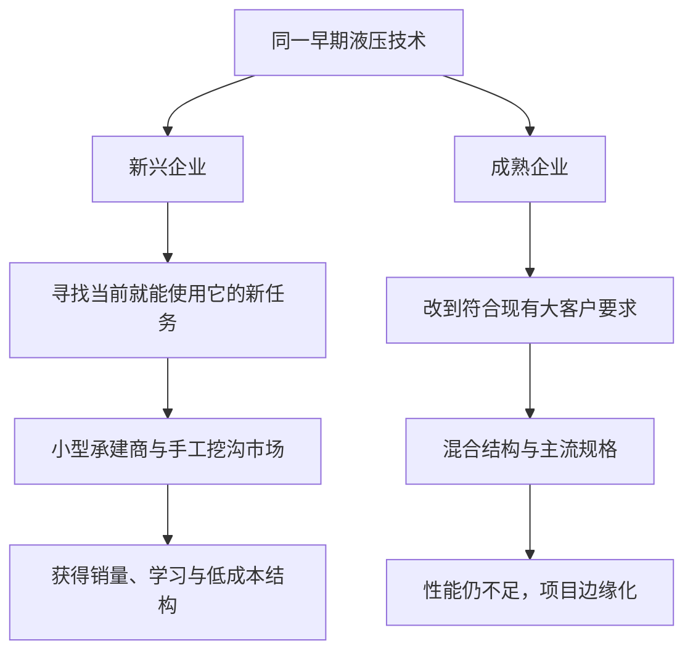

> 章节：第三章“机械挖掘机行业的破坏性技术变革” 
> 作者：克莱顿·克里斯坦森（Clayton M. Christensen） 
> 笔记目标：按原书顺序还原液压技术从边缘用途进入主流挖掘市场的全过程，解释技术原理、价值网、性能轨道、企业选择和理论边界。

## 一、本章的问题、作用与结论

前两章的理论主要来自变化快速的硬盘行业。第三章换到技术节奏缓慢、产品庞大、客户专业的机械挖掘机行业，检验同一机制能否跨行业成立。这是在测试理论的**外部效度**：如果价值网框架只能解释电子产品，它就可能只是行业特例。

本章提出的问题是：**为什么成熟挖掘机厂商成功完成了蒸汽到汽油、柴油、电动等困难的技术转换，却几乎全被看似简单的液压技术淘汰？**

作者的答案与硬盘案例一致：

1. 汽油等技术沿主流承建商重视的容量、工作半径、速度和成本轨道改善，是延续性创新，成熟企业得到客户和资源支持。
2. 早期液压设备容量小、工作半径短，主流客户无法使用，却能以机动、精确、低损伤的方式替代住宅工地的手工挖沟。
3. 新兴企业在这个新价值网积累设计、制造、渠道和客户经验，液压性能又比主流需求增长得更快。
4. 当液压设备“足够好”时，主流市场的选择标准从容量和半径转向可靠性与安全，缆索厂商才发现原有优势已经过度。

液压技术从边缘市场进入主流用了约 20 年，远慢于硬盘的几年，但因果顺序几乎相同。这说明破坏性不是“突然发生”的同义词。

本章没有形式化定理或固定算法。下面的液压公式、增长率和轨道交点，是对作者工程事实与图表的完整展开。

## 二、在延续性技术变革中的领导地位

### 2.1 蒸汽铲土机的基本结构

威廉·史密斯·奥蒂斯于 1837 年发明蒸汽铲土机。中央锅炉把蒸汽送到机器各处的小型蒸汽机，再通过滑轮、滚筒和缆索操纵铲斗。早期设备安装在铁轨上，用于铁路和运河工程。
> **原书图示**：Osgood General公司制造的缆控机械铲土机
缆控系统的直觉是：发动机转动卷筒，卷筒收放钢索，钢索经滑轮改变方向，对吊杆和铲斗施加拉力。铲斗插入土体时主要依靠铲斗自重，钢索擅长“拉”，却不能像液压缸那样直接把斗齿主动压入土中。

### 2.2 蒸汽到汽油：突破性但延续性的创新

20 世纪 20 年代初，汽油内燃机替代蒸汽机。变化同时涉及：

- 动力原理从蒸汽膨胀变为燃料在气缸内燃烧；
- 多个分散蒸汽机变为单台发动机；
- 传动改用齿轮、离合器、卷筒和制动器；
- 整机结构和控制方式随之重构。

按能力或产品结构分类，这是一项突破性创新；按市场作用分类，它却是延续性创新，因为它让主流承建商挖得更快、更安全、成本更低，继续改善既有指标。

在最大的 35 家蒸汽铲土机厂商中，23 家完成汽油动力转换，成功率为：

$$
\frac{23}{35}\times100\%\approx65.7\%
$$
> **原书图示**：汽油动力缆索铲土机制造商
图 3.2 中成熟企业主导汽油技术，少数新企业同时进入。这反驳了“大企业因保守而无法应对突破技术”的笼统说法。

### 2.3 企业规模与资源边界

原书指出，这种成功主要属于最大的 25 家企业；7 家小型蒸汽厂商中只有 1 家存活，成功率约：

$$
\frac{1}{7}\times100\%\approx14.3\%
$$

这说明价值网解释不能排除资源约束。延续性创新若研发昂贵、依赖专利或稀缺人才，小企业即使有客户需求也可能做不到。客户意愿影响资源方向，企业规模影响可投入资源总量，两者共同作用。

### 2.4 后续延续性变化

从约 1928 年起，成熟企业继续从汽油转向柴油和电动机。二战后又采用弧形吊杆，使设备伸得更远、使用更大铲斗并能更灵活地向下挖。成熟厂商均积极参与。

承建商也会成为延续性创新来源。芝加哥地区的 Page 公司为运河施工于 1903 年发明拉铲挖土机，后来用于巴拿马运河。这与“领先用户”现象一致：客户在自己的高要求场景先改造产品，再推动供应商商业化。

关键边界是，客户通常擅长提出**现有任务上的改进**，不一定会提出为另一类客户设计的破坏性用途。

## 三、破坏性液压技术的影响

二战后至 20 世纪 60 年代末，柴油机仍提供动力，但控制铲斗的方式从钢索逐渐转为液压。

20 世纪 50 年代约有 30 家成熟缆索设备厂商，到 70 年代只有英斯利、凯林、小巨人和林克贝特 4 家成为可持续竞争的液压挖掘机厂商，比例约为：

$$
\frac{4}{30}\times100\%\approx13.3\%
$$

另一些企业退守大型露天矿、海上平台和巨型起重机等高端缆索细分市场。多数企业破产，主流市场转由 J.I. Case、John Deere、Drott、Ford、JCB、Poclain、国际收割机、卡特彼勒、O&K、Demag、Liebherr、小松和日立等新进入者主导。

这些比例来自不同规模、年代和样本口径，不能直接作严格统计检验；它们的作用是展示反差：同一批成熟企业能应对技术更突破的汽油转换，却很少完成液压商业转换。

## 四、机械挖掘机市场所要求的性能

### 4.1 三类主流市场

挖掘机主要用于挖洞、挖沟，原书区分三个市场：

| 市场 | 典型任务 | 1945 年平均铲斗容量 |
|---|---|---:|
| 下水道和管道 | 挖长而相对狭窄的沟渠 | 约 1 立方码 |
| 普通挖掘 | 地下室、运河和一般土木工程 | 约 2.5 立方码 |
| 露天采矿 | 大规模剥离和采掘 | 约 5 立方码 |

承建商主要按铲斗容量和工作半径评价设备。半径决定能挖多远、多深，容量决定单次搬运多少土。

### 4.2 为什么铲斗容量只是代理指标

更接近真实生产率的指标是每分钟搬运土方量。可近似写成：

$$
Q=V_b\cdot n\cdot\eta
$$

其中：

- $Q$ 是每分钟实际搬运体积；
- $V_b$ 是额定铲斗容量；
- $n$ 是每分钟工作循环次数；
- $\eta$ 是装满系数，表示每次实际装载占额定容量的比例。

但 $n$ 和 $\eta$ 强烈依赖操作员技术、土壤硬度、含水量、挖掘深度和机器布置。历史资料很难统一控制这些变量，因此作者使用较易比较的铲斗容量作为性能代理。

这意味着图 3.3 测量的是“可提供的单斗规模”，不是完整生产率。液压设备可能通过更精确、更快的循环弥补部分容量不足，单指标会低估它的某些价值。

### 4.3 主流需求为何只增长约 4%

三个市场的平均容量约每年增长 4%。若初始需求为 $D_0$，经过 $t$ 年：

$$
D(t)=D_0(1.04)^t
$$

例如 20 年后：

$$
\frac{D(20)}{D_0}=1.04^{20}\approx2.19
$$

即需求约为原来的 2.19 倍。增长不能无限加快，因为大型设备必须运输进出工地，还受道路、桥梁、施工空间、项目规模和资金约束。终端应用系统限制了客户能吸收的性能。

## 五、液压挖掘机的出现和改善轨道

### 5.1 液压系统如何工作

JCB 于 1947 年率先开发液压挖掘机，Henry、Sherman 和 HOPTO 等企业随后进入。液压系统利用泵加压液体，通过阀门把压力送入液压缸，推动活塞和铲斗。

在忽略摩擦和压降时，液压缸推力为：

$$
F=pA
$$

其中 $F$ 是推力，$p$ 是液体压力，$A$ 是活塞有效面积。液体体积流量 $q$ 与活塞速度 $v$ 的关系为：

$$
q=Av
$$

理想液压功率为：

$$
P=pq=Fv
$$

第一式说明提高压力或活塞面积可增加挖掘力；第二式说明要让大活塞快速运动，需要更大泵流量；第三式说明力与速度不能脱离发动机功率同时无限增加。

真实系统还要乘总效率 $\eta_h<1$：

$$
P_{out}=\eta_hpq
$$

早期泵、密封件、软管和阀门能承受的压力有限，泄漏和磨损严重，因此液压缸的力量、容量和工作半径都受限。这是早期产品只有小铲斗的工程原因。

### 5.2 早期产品为什么不能服务主流市场

早期反铲挖土机安装在工业或农用牵引车后部，铲斗约 0.25 立方码，工作半径约 6 英尺，只能旋转 180 度；最佳缆索设备可旋转 360 度，下水道客户又需要约 1 至 4 立方码。

换算到公制：

$$
0.25\text{ yd}^3\approx0.25\times0.7646=0.191\text{ m}^3
$$

$$
6\text{ ft}\approx6\times0.3048=1.83\text{ m}
$$

这不是主流客户“缺乏远见”。产品确实不能完成他们的工作。

### 5.3 新价值网：替代手工而非大型机器

新兴企业把液压反铲作为牵引车附件，卖给 Ford、J.I. Case、John Deere、国际收割机和 Massey Ferguson 等牵引车厂商。小型住宅承建商用它挖街道水管、下水道到房屋地基之间的窄沟。

过去这些工作主要靠人工，因为大型履带式缆索机器进场昂贵、笨重且不够精确。液压反铲不到一小时即可完成一栋房屋的沟槽，在二战和朝鲜战争后的住宅建设繁荣中迅速获得需求。

其客户、渠道和指标都与缆索市场不同：

- 客户是小型民用建筑承建商，而非大型土木、管道或采矿承建商；
- 产品常随牵引车销售，依赖经销商，而非大型设备直销渠道；
- 评价重点是铲斗宽度、牵引车速度、机动性、狭窄空间作业和不破坏草皮。
> **原书图示**：谢尔曼产品公司的液压反铲挖土机
图 3.4 展示的“山猫”宣传重点不是搬运更多土，而是进入狭窄区域并减少地面损伤。性能排序的差异构成价值网边界。

### 5.4 图 3.3：供给轨道怎样向上穿越需求
> **原书图示**：液压技术对机械挖掘机市场的破坏性影响
图 3.3 的纵轴采用对数刻度。虚线是民用建筑、下水道与管道、普通挖掘等市场购买的平均铲斗容量，实线是液压工程师能实现的最大容量。

液压最大容量的关键节点为：

| 年份 | 最大铲斗容量 |
|---|---:|
| 1947 年前后 | 0.25 立方码 |
| 1955 年 | 3/8，即 0.375 立方码 |
| 1960 年 | 0.5 立方码 |
| 1965 年 | 2 立方码 |
| 1974 年 | 10 立方码 |

若只用 1947 年 0.25 与 1974 年 10 这两个端点，27 年复合增长率为：

$$
g_s=\left(\frac{10}{0.25}\right)^{1/27}-1
=40^{1/27}-1\approx14.65\%
$$

这只是端点近似，真实轨道分阶段变化，但明显高于市场需求约 4%。供给相对需求每年的倍率约为：

$$
\frac{1+g_s}{1+g_d}
=\frac{1.1465}{1.04}\approx1.1024
$$

20 年累计相对倍率为：

$$
1.1024^{20}\approx7.04
$$

含义不是液压一定替代，而是在固定增速近似下，液压容量相对客户需求扩大约 7 倍，足以依次穿越更高市场门槛。

若技术供给和目标市场需求分别为：

$$
S(t)=S_0(1+g_s)^t
$$

$$
D(t)=D_0(1+g_d)^t
$$

令交点 $S(t^*)=D(t^*)$：

$$
S_0(1+g_s)^{t^*}=D_0(1+g_d)^{t^*}
$$

两边整理并取对数：

$$
t^*=\frac{\ln(D_0/S_0)}
{\ln((1+g_s)/(1+g_d))}
$$

只有初始供给低于需求且 $g_s>g_d$ 时，才存在有限的正交点。公式假设增长率恒定、容量足以代表采用、达到平均线就会进入；现实还取决于工作半径、可靠性、渠道、价格和客户切换，因此只能解释方向，不能精确预测年份。

1954 年，Demag 又推出可在履带基座上旋转 360 度的液压样机，消除了进入普通挖掘市场的一项重要结构障碍。

## 六、成熟挖掘机制造商为应对液压技术采取的措施

### 6.1 比塞洛斯-伊利并没有忽视液压

比塞洛斯-伊利在 1950 年收购密尔沃基液压公司，距早期反铲出现仅约两年；1951 年推出 Hydrohoe。这说明成熟企业看见并取得了技术。

Hydrohoe 是混合结构：两个液压缸分别负责把铲斗插入土中和拉向驾驶室，传统缆索装置负责抬升。原因并非工程师被旧范式束缚，而是当时纯液压力量和半径无法满足公司主流客户，钢索是达到目标规格的可行补偿。

混合技术像早期同时装蒸汽机与船帆的远洋船：旧技术为尚未成熟的新技术提供可靠性和性能保障。它可能是合理过渡方案，也可能把新技术强行拉回旧评价体系。

### 6.2 营销定位暴露了价值网选择
> **原书图示**：比塞洛斯-伊利公司的Hydrohoe
Sherman 把反铲宣传为狭窄场所、草皮友好的机器；比塞洛斯-伊利却把 Hydrohoe 定义成“拖铲挖土机”，广告放在开阔工地，强调满载土方，目标仍是普通挖掘承建商。

它没有把液压产品放到认可当前优势的新价值网，而是改造技术以适应现有价值网。即使持续十余年提高容量和半径，Hydrohoe 对主流客户仍不够好，商业上失败，公司最终回到盈利的缆索产品。

### 6.3 失败发生时，财务表现仍很好

1948 至 1961 年，比塞洛斯-伊利几乎是唯一推出液压挖掘机的缆索厂商；其他企业专注服务现有客户并获得丰厚利润。比塞洛斯-伊利和 Northwest 的利润直到 1966 年前还连创新高，此时液压轨道已接近或进入下水道、管道市场。

这说明财务报表是滞后指标。破坏者先在另一市场成长，不会立刻减少主流企业收入；等收入受冲击时，对手已完成多年学习。

### 6.4 新兴企业主导，成熟企业多做混合产品

1947 至 1965 年，共有 23 家企业凭液压产品进入机械挖掘市场。图 3.6 显示，活跃液压厂商几乎一直由新企业主导。
> **原书图示**：液压挖掘机制造商，1948至1965年
20 世纪 60 年代，部分缆索厂商加入液压元件，但多为混合机：液压缸闭合铲斗，钢索仍负责伸展和提升。这些设计很有创造性，也确实提高主流产品性能，因此属于液压技术的**延续性应用**，而不是进入早期液压新市场。

同一种底层技术可同时具有两种战略作用：

- 装在缆索主机上，帮助现有客户提高性能，是延续性创新；
- 形成小型牵引车反铲，替代手工挖沟，是破坏性创新。

因此，不能把“液压”这个技术标签本身等同于破坏性。

### 6.5 两种战略选择

新兴企业问：“现阶段液压技术已经能为谁创造价值？”于是寻找小型工地。

成熟企业问：“怎样把液压改到足以满足现有客户？”于是把它纳入原有容量和半径轨道。

液压最终达到主流要求，但推动它进步的是先在新市场建立商业平台的企业。只有英斯利、凯林、小巨人和林克贝特四家缆索厂商较晚建立可持续液压产品线。

卡特彼勒在 1972 年才进入液压挖掘机，却应视为该市场的新进入者：它此前生产推土机、刮土机和平地机，在缆索挖掘机时代没有进入挖掘市场。这再次说明“成熟/新兴”必须相对于具体产品市场定义。

## 七、在缆索和液压之间作出选择

### 7.1 性能过度满足后，竞争标准改变

液压容量达到下水道和管道市场需求后，缆索与液压都能完成基本任务。即使缆索工作半径和拉举力至今仍可能更强，额外性能也不再影响购买。

可把客户对容量 $x$ 的效用简化为带饱和点的函数：

$$
U_x(x)=
\begin{cases}
ax, & x<x_{min}\\
ax_{min}+b(x-x_{min}), & x\ge x_{min}
\end{cases}
$$

其中：

- $x_{min}$ 是完成任务所需最低容量；
- $a>0$ 是未达标时容量的高边际价值；
- $b\ge0$ 是达标后边际价值，且通常 $b\ll a$。

当两种设备都超过 $x_{min}$，容量差异的效用贡献很小，可靠性、安全、维护和价格便主导选择。该分段函数是解释“足够好”的模型，不是原书估计结果。真实效用可能平滑变化，也可能因项目类型有多个阈值。

### 7.2 可靠性与安全为何成为新标准

缆索在重载时可能突然断裂，威胁操作员生命；液压系统没有承担同样拉举任务的长钢索，故障风险更低。当液压也能完成挖掘，承建商迅速采用更安全、可靠的方案。

下水道和管道承建商在 20 世纪 60 年代初率先采用，普通挖掘承建商在 60 年代末跟进。竞争基础由“容量和半径是否够大”转向“能否更可靠、安全地完成任务”。

这与产品竞争常见顺序一致：先满足功能，再比较可靠性、便利性和价格。但顺序不是普适定律；采矿等极端场景仍可能长期把容量和半径放在首位。

## 八、液压技术崛起的结果和影响

### 8.1 成熟企业内部当时并没有明显失灵

事后看来，厂商似乎应设立面向小型承建商的液压部门。但在 20 世纪 50 年代：

- 主流客户确实不能使用 0.25 立方码、6 英尺半径的产品；
- 至少 20 家缆索厂商激烈争夺当前客户；
- 忽视客户下一代需求会立刻损害现有业务；
- 早期反铲市场小且不确定；
- 改进大型缆索机更可能带来可见利润。

所以失败不是因为管理层懒惰、傲慢或无法开发液压。最优秀的企业一旦液压能帮助现有客户，便积极采用液压元件。问题是它们等待技术在自己的价值网有意义，而那时新兴企业已积累不可逆优势。

### 8.2 创新者窘境的严格表述

成熟企业同时面对两项责任：

$$
\text{保护当前业务}=\text{满足现有客户并赢得当期竞争}
$$

$$
\text{建立未来业务}=\text{投资当前客户不能使用的小市场}
$$

在资源有限、考核偏向近期收入时，第一项责任具有明确客户、规模和回报，第二项只有技术可能性。这不是简单的决策错误，而是两套合理目标的结构冲突。

更努力、更多投资、更精确规划和更认真听客户，在延续性创新中有效；若仍由原价值网决定方向，这些措施只会让企业更快地沿错误方向优化。

## 九、作者如何用本章检验理论

### 9.1 为什么选择挖掘机行业

它与硬盘差异巨大：机械而非电子、产品寿命长、客户专业、变化持续约 20 年。若仍出现“成熟企业引领延续性创新、在破坏性创新中失败”的模式，理论的适用范围就更可信。

### 9.2 论证中的关键反事实

作者不是只观察“液压企业成功”，还检查几种替代解释：

| 替代解释 | 本章证据 |
|---|---|
| 成熟企业不会应对突破技术 | 23 家大型厂商完成蒸汽到汽油转换 |
| 它们没有看到液压 | 比塞洛斯-伊利很早收购液压企业并销售十余年 |
| 工程师只会旧结构 | Hydrohoe 混合结构是为满足客户规格的现实选择 |
| 管理不善导致失败 | 主流企业利润持续创纪录，且积极服务客户 |
| 液压立即优于缆索 | 早期容量、半径和旋转范围显著不足 |
| 新兴企业准确预测大市场 | 它们先找到可用的小任务，再逐步形成市场 |

这些反事实让“价值网和资源方向”比“技术无能”更符合观察。

### 9.3 方法局限

1. **历史资料选择偏差。**失败厂商记录可能不完整，成功者故事更易保存。
2. **样本口径不同。**35 家大型蒸汽厂商、30 家缆索厂商和 23 家液压进入者并非同一统计总体。
3. **性能代理有限。**最大铲斗容量不等于平均产品，也不等于每分钟生产率。
4. **端点增长率简化。**液压容量并非每年稳定增长 14.65%，而是受泵、密封和结构突破影响的分段轨道。
5. **需求并非外生。**住宅繁荣、道路物流、经销渠道、施工规范和安全意识都改变采用速度。
6. **因果不能完全实验验证。**企业无法被随机分配到不同价值网，结论依赖历史比较和过程证据。
7. **高端退守也是策略。**部分缆索厂商在采矿和起重领域生存，说明破坏不必消灭旧技术，而可能把它推向专业高端。

### 9.4 可补充的分析视角

- **能力理论**：解释泵、密封、批量制造知识何时成为障碍。
- **组织双元理论**：讨论独立小业务如何与成熟主业并存。
- **实物期权**：用小额投资保留液压学习权，而非立即大规模承诺。
- **领先用户法**：区分现有主流客户的延续性需求与边缘用户的新任务。
- **全生命周期成本**：综合采购价、故障、维护、停机和安全事故，而不只比较容量。

## 十、易混淆概念与常见误解

### 10.1 液压技术天然具有破坏性

不对。液压元件用于改善大型缆索机时是延续性创新；形成小型反铲并进入手工挖沟市场时才具有破坏性。分类取决于用途和价值网。

### 10.2 突破性创新比简单创新更危险

不对。汽油动力在技术和结构上更突破，却由成熟企业主导；早期液压反铲更简单，却改变市场进入路径。

### 10.3 混合产品一定是错误路线

不对。混合结构能降低新技术不成熟阶段的风险，也可能是合理过渡。Hydrohoe 的问题是它只为旧客户补齐性能，没有在新市场积累纯液压能力。

### 10.4 客户误导了企业

客户没有错误判断自己的任务。真正的问题是企业只询问主流客户，没有寻找会珍视液压当前属性的小型承建商。

### 10.5 破坏一定快速发生

不对。液压侵入用了约 20 年。速度取决于技术改善、需求增速、设备寿命、渠道和切换成本；慢速破坏仍可具有决定性。

### 10.6 技术超过需求后，旧技术立即消失

不对。缆索设备在超大半径、超大载荷的采矿和起重场景仍有价值。旧技术可能退出主流而保留高端利基。

### 10.7 财务表现良好代表威胁尚远

不对。破坏者先在另一价值网获得收入，成熟企业早期报表不受影响。比塞洛斯-伊利和 Northwest 利润创新高时，液压轨道已逼近主流。

## 十一、面向实际工作的分析模板

1. **区分技术幅度与市场作用。**它是突破还是渐进？又是延续还是破坏？分别回答。
2. **列出终端任务。**不同客户真正要挖什么、搬什么、在何种空间工作？
3. **选择性能指标。**区分代理指标与真实生产率，注明操作员和环境影响。
4. **寻找非消费场景。**新技术是否能替代手工、完全不做或昂贵过度方案？
5. **比较属性排序。**早期客户是否更重视尺寸、机动性、精确度或低损伤？
6. **画供给与需求轨道。**估计初始差距、相对增速和多属性门槛。
7. **检查渠道。**新客户是否通过不同经销、服务和融资方式购买？
8. **分辨混合方案目的。**它是在新市场降低风险，还是只把新技术强行塞进旧规格？
9. **监测竞争基础。**核心功能满足后，可靠性、安全、便利或价格是否开始主导？
10. **设计反证。**哪些关键性能永远无法达标，哪些高端场景会长期保留旧技术？

## 十二、本章总结

第三章证明，破坏性创新框架不依赖电子行业的高速变化。挖掘机厂商能完成蒸汽到汽油、柴油、电动和弧形吊杆等复杂延续性变化，说明它们并不保守，也不缺技术能力；它们错过液压，是因为早期液压对现有客户确实无用。

新兴企业没有一开始就战胜缆索机，而是用小型反铲替代手工挖沟，在住宅施工的新价值网中学习。随着泵、密封和结构改善，液压铲斗容量增长快于主流需求，依次进入管道和普通挖掘市场。当容量与半径都足够时，缆索的额外性能失去价值，可靠性和安全成为新的购买标准。

本章最重要的认识是：**成熟企业不是因为做了明显错误的事而失败，而是因为它们把正确的管理方法用在了不匹配的创新情境中。**只服务当前最重要的客户，会把资源合理地投向延续性改善；要应对破坏性创新，还必须找到当前就重视新属性的客户和任务，让新业务在适合它的价值网里成长。
