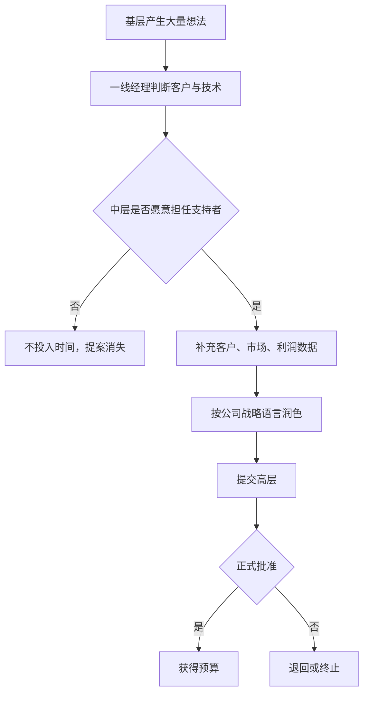
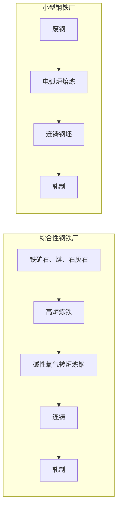
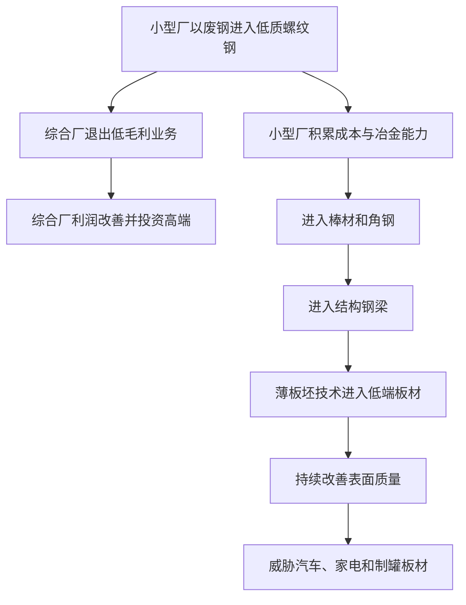

> 章节：第四章“回不去的低端市场” 
> 作者：克莱顿·克里斯坦森（Clayton M. Christensen） 
> 笔记目标：按原书顺序解释企业为何容易向高端移动却难以返回低端，并用硬盘与钢铁行业还原资源分配、成本结构和破坏性进入的完整因果链。

## 一、本章要解决的问题

前三章已经说明，企业所在的价值网会定义客户看重的性能、可接受的成本和利润率。第四章进一步追问：**既然价值网并非封闭边界，为什么企业能轻易跨入高端价值网，却很难进入低端价值网？**

作者把这种非对称性称为“左上牵引力”：在性能与市场层级的示意图上，企业不断提高性能、进入利润更高的市场，仿佛被左上角的磁石吸引。这里的“左上”是战略隐喻，不是严格坐标定理；关键含义是**向更高性能、更大客户和更高毛利率移动**。

本章的核心结论是：

> 高端迁移通常同时符合客户需求、利润增长、职业激励和竞争逻辑；低端迁移却要求企业接受更小市场、更低毛利、未知客户，并重建成本结构。因此，向上容易、向下困难并非管理者缺少远见，而是运行良好的资源分配体系产生的系统结果。

作者依次使用：

1. 希捷产品线向高容量市场迁移；
2. 硬盘价值网的毛利率与市场规模；
3. 高层决策模型和鲍尔的组织筛选模型；
4. 1.8 英寸硬盘的实时案例；
5. 客户与供应商同步上移；
6. 小型钢铁厂从螺纹钢向板材进攻；
7. 薄板坯连铸再次冲击板材市场；

来证明同一机制。原章没有形式化定理或算法，笔记中的公式用于展开财务比较、项目筛选和数量证据。

## 二、硬盘驱动器行业的“左上方向大迁移”

### 2.1 图 4.1 怎样阅读
> **原书图示**：希捷公司产品向高端市场迁移
图 4.1 的纵轴是容量，采用对数刻度；横轴是年份。每条竖线表示希捷当年产品线从最低容量到最高容量的范围，黑色方块表示容量中值。两条虚线分别近似台式计算机和中档计算机市场所需容量。

1983 至 1985 年，希捷产品中值贴近台式机需求。1987 至 1989 年，3.5 英寸硬盘从低端进入台式机市场。希捷并未主要留在低端正面迎战，而是继续供应部分台式机产品，同时把资源重心移向文件服务器、工程工作站等中端计算机。到 1993 年，产品线中值明显接近更高价值网。

图中的竖线很重要：企业不是一夜之间完全退出旧市场，而是产品组合逐步上移。战略迁移首先表现为新产品、销售注意力和研发资源的重心变化，旧产品可能继续销售一段时间。

### 2.2 为什么破坏者也会向上移动

每一代小盘径厂商在新市场站稳后，都不满足于初始价值网。技术改善使容量达到更高市场要求，而高端收入和毛利又更有吸引力，于是破坏者向上进攻。

这构成循环：14 英寸厂商被 8 英寸冲击，8 英寸厂商又被 5.25 英寸冲击，希捷作为 5.25 英寸破坏者成长后，再被 3.5 英寸厂商从下方攻击。**破坏者是一种相对位置，不是企业永久身份。**

### 2.3 “撤退”为什么在当时很合理

面对低端攻击，成熟企业通常有三种选择：

- 降价、降成本，与新企业争夺低毛利市场；
- 同时维持上下两个市场，承担组织复杂性；
- 向上服务更高要求、愿意付更多钱的客户。

第三种方案有现成客户、较高价格和增长空间，最容易通过预算审核。它在短期甚至中期会改善财务表现，却把低端入口让给新企业。

## 三、价值网和典型的成本结构

### 3.1 非对称流动的经济基础

价值网不仅定义性能，还要求一套研发、销售、服务和行政结构。企业在某价值网成功后，会把人员、流程和费用调整到服务该市场。维持主流竞争所需的成本很难迅速删除，因此提高利润最直接的方法不是向下削价，而是向上获得更高毛利。

设收入为 $R$，销售成本为 $C$，毛利润为 $G$，毛利率为 $m$：

$$
G=R-C
$$

$$
m=\frac{G}{R}=1-\frac{C}{R}
$$

若一家 8 英寸厂商的组织需要约 40% 毛利率维持竞争，而低端市场只能提供 25%，则每 100 美元收入的毛利润从 40 美元降为 25 美元。除非同步重构研发、销售和管理费用，否则多卖低端产品可能增加收入却降低利润。

### 3.2 图 4.2 的市场与毛利差异
> **原书图示**：成熟硬盘企业对高端市场和低端市场的看法
图 4.2 比较两个时点：

- 1981 年，5.25 英寸硬盘面向台式机，毛利率约 25%；8 英寸面向微型机，约 40%；14 英寸面向大型机，约 60%。
- 1986 年，3.5 英寸便携式市场约 22%；5.25 英寸台式机约 25%；8 英寸和 14 英寸的微型机、大型机市场约 40%。

高端市场不仅利润率高，通常规模也更大。对需要 40% 毛利的 8 英寸厂商来说：

- 向下进入只能提供 25% 毛利的市场，要面对已按 25% 建立成本结构的竞争者；
- 向上进入可提供约 60% 毛利的市场，自己的 40% 成本结构反而具有潜在优势。

资源自然向上流动。

### 3.3 容量的影子价格

第二章的特征回归表明，高端市场愿为同样增加 1MB 容量支付更高价格。若容量影子价格为 $\beta_C$，容量增加 $\Delta C$，控制其他属性后估计价格增量为：

$$
\Delta P\approx\beta_C\Delta C
$$

当高端的 $\beta_C$ 更大，同样的工程改进可产生更高收入。管理者选择高端，不只是追逐抽象“高级感”，而是在选择单位技术投入价值更高的市场。

该线性关系只在回归样本和局部范围内近似成立；容量过度满足后，边际愿付价格会下降。

### 3.4 成本结构具有路径依赖

企业进入高端后，为满足客户会增加研发、质量、直销、现场服务和行政投入。短期看这些成本支撑高毛利业务，长期却提高向下移动的门槛：

$$
F_{t+1}=F_t+I_{high}-D_t
$$

其中 $F_t$ 是支持高端业务的固定成本，$I_{high}$ 是新增高端投入，$D_t$ 是折旧、裁撤等成本消退。若高端投入长期大于成本消退，组织的盈亏平衡规模和目标毛利会不断提高。

这只是路径依赖的概念模型，不表示所有费用都不可逆。困难在于削减某项成本常会同时破坏现有客户需要的能力。

### 3.5 零售业中的同一模式

原书引用麦克奈尔对零售业的描述：创新者以低运营成本和低价进入，随后扩大品类、改善门店、提高质量并获得尊重；资本投入和运营成本随之上升，企业逐渐成熟，最终给下一代低成本创新者留下攻击空间。

这说明左上牵引力不依赖硬盘技术。只要高端带来更高价格、声誉和增长，而服务高端又会抬高成本，循环就可能出现。

## 四、资源分配和向上迁移

### 4.1 两种资源分配模型

**自上而下模型**认为，高层比较所有项目，选择符合战略且投资回报率最高的方案。它把高层视为完整信息下的总设计师。

**鲍尔模型**认为，创新提案多由基层提出，中层先筛选、修改和包装，只有少数项目进入高层视野。高层作最终批准，但“哪些选项可供批准”早已由组织下层决定。

资源分配不只是年度预算。工程师今天解决哪个问题、销售人员拜访哪个客户、中层花时间完善哪个商业计划，都是微观资源决策。

### 4.2 中层管理者为何偏爱可预测市场

支持成功项目能提升职业地位，错误判断市场则可能造成产品、产能、营销和渠道的全面损失。技术探索失败常可解释为学习，市场判断失败却更容易被视为管理错误。

因此，中层会优先选择：

- 已有客户明确要求；
- 市场规模可量化；
- 毛利率符合公司标准；
- 能支持销售与增长目标；
- 高层容易理解和批准。

这不是员工自私的简单道德问题。管理者同时保护企业和自己的职业，所用标准正是公司训练他们使用的标准。

### 4.3 两个竞争提案

原书构造同一周提交的两个项目。

**高端项目**：开发容量更大、速度更快的硬盘。工作站市场每年采购超过 6 亿美元，潜在客户急于拿样机，竞争对手遇到技术困难，预计使用现有工厂可实现约 35% 毛利率。

**低端项目**：开发更小、更慢、容量更低且便宜的硬盘。可能用于传真机或打印机，但客户不知道用途；当前软件需要约 270MB，新产品近期达不到；价格和利润也不明确。

若用期望净现值表示项目比较：

$$
E(NPV)=-I_0+\sum_{t=1}^{T}\frac{E(CF_t)}{(1+r)^t}
$$

其中：

- $I_0$ 是初始投资；
- $CF_t$ 是第 $t$ 期现金流；
- $r$ 是要求回报率；
- $T$ 是评估期限。

进一步把现金流状态展开：

$$
E(CF_t)=\sum_{s=1}^{S}p_sCF_{t,s}
$$

高端项目有客户、市场和价格数据，可以估计 $p_s$ 与 $CF_{t,s}$；低端项目连用途都未知，数字只能来自假设。企业若要求可审计的正 NPV，低端项目会天然处于劣势。

这并不说明传统 NPV 错误，而是它不善于评价信息尚不存在、学习本身具有期权价值的项目。可补充使用分阶段投资和实物期权，而不是伪造精确长期预测。

### 4.4 系统为何会主动淘汰破坏性提案

项目获得资金的概率可概念化为多阶段乘积：

$$
P(\text{获资})=
P(S_1)P(S_2\mid S_1)\cdots P(S_n\mid S_1,\ldots,S_{n-1})
$$

每一阶段分别可能是工程支持、客户验证、中层担保、财务审核和高层批准。破坏性项目在客户、规模、利润等多关都较弱，即使每关只略处劣势，最终存活概率也会大幅降低。

高层口头宣布“重视破坏性创新”并不能自动改变各层员工的成功标准。若销售人员仍按当年销售额考核、产品经理仍按毛利率排序，他们会合理地把时间转回主流业务。

### 4.5 良好体系的悖论

任何不系统响应客户需求的企业都难以生存，所以筛除无客户、无利润项目本身是一项组织成就。创新者的窘境在于：同一个过滤器既保护成熟业务，也过滤掉早期破坏性机会。

解决方向不是关闭过滤器，让所有想法都获资，而是为性质不同的项目建立不同的选择环境和成功标准。

## 五、案例：1.8 英寸硬盘驱动器

### 5.1 企业已经理解了理论

作者在 1992 年把研究结果分享给硬盘管理者。到 1993 年，每家领先厂商都已开发 1.8 英寸产品，准备在市场出现时推出。最大厂商甚至做出第四代样机，每代容量都更高。

这是一项重要检验：如果问题只是不理解破坏性创新，知道理论并完成技术开发后，企业应能解决问题。但事实并非如此。

### 5.2 “市场不存在”与实际新用途

行业报告估计：

| 年份 | 1.8 英寸硬盘市场规模或预测 |
|---|---:|
| 1993 年 | 4000 万美元 |
| 1994 年 | 8000 万美元 |
| 1995 年 | 1.4 亿美元 |

那位 CEO 认为预测错误：产品已列入目录 18 个月，却无人购买，公司只是太超前。

一个月后，作者从曾在本田研发工作的学生处得知，本田导航系统使用小巧、耐用、活动部件很少的 1.8 英寸硬盘，但大型硬盘厂商不供货，只能从科罗拉多一家创业公司购买。

两种说法并不真正矛盾：

- 对大厂计算机行业销售体系而言，没有足以完成指标的市场；
- 对汽车导航这一新价值网而言，已经存在愿意购买的客户。

“市场不存在”往往意味着“按本组织的客户、规模和利润标准，市场不值得服务”。

### 5.3 为什么 CEO 决心仍无法转化为收入

一家收入数十亿美元的企业不会把 8000 万美元低端市场视为增长答案。销售人员给汽车厂送样机，既不能完成年度指标，也无法利用其计算机客户关系和专业知识。物流、生产、售后和管理关注也不会自动跟上。

可用增长影响说明规模错配。若公司收入为 50 亿美元，8000 万美元市场即使全部拿下，对收入贡献也只有：

$$
\frac{0.8}{50}\times100\%=1.6\%
$$

若只能取得 25% 市场份额，贡献为 2000 万美元，仅占：

$$
\frac{0.2}{50}\times100\%=0.4\%
$$

这是示意计算，原书明确说企业收入数据并非真实值。它说明为什么对创业公司足以改变命运的市场，对大企业几乎不可见。

### 5.4 案例的严格结论

技术能力、CEO 意愿和产品目录都不是充分条件。要完成商业化，还需要销售、渠道、预算、生产和考核共同推进。企业受制于客户，也受制于价值网内生的财务结构与文化。

## 六、价值网和市场可预见性

### 6.1 客户同步上移造成集体盲区

供应商的客户若也向高端迁移，供应商可能感觉不到自己正在移动，因为熟悉的客户和竞争者都在身边。

8 英寸硬盘厂商 Priam、昆腾和 Shugart 的核心客户 DEC、Prime、Data General、王安和 Nixdorf 都向大型机用户市场提升性能，没有成功进入台式机。供应商因此也缺少来自客户的 5.25 英寸需求。

14 英寸厂商的客户 Univac、Burroughs、NCR、ICL、西门子和 Amdahl 同样没有进入微型机市场，于是供应商错过 8 英寸机会。

这是一种共同演化：

$$
\text{客户向上}\Rightarrow\text{组件需求向上}
\Rightarrow\text{供应商投资向上}
$$

因果链并非不可逆，但如果销售、预测和研发都围绕同一客户群，它会非常稳定。

### 6.2 向下移动的三重障碍

1. **高端市场利润率更高。**资源投入可得到更高可见回报。
2. **客户也在向上。**最可信的需求信号持续要求更高性能。
3. **低端需要不同成本结构。**简单降价会损害利润，重构组织又困难。

这三者让破坏性提案在内部竞争中持续输给高端提案。优秀企业甚至会建立系统方法，主动淘汰降低利润率的新产品。

### 6.3 低端竞争真空

当成熟企业集体上移，被放弃的客户仍有任务和预算，于是低端形成竞争真空。拥有更低成本结构、性能恰好够用的新企业可以进入。它们随后改善产品，再向成熟企业的新位置追赶。

钢铁行业提供了更大规模、流程密集型的同构案例。

## 七、综合性钢铁企业的“左上角”移动

### 7.1 两种炼钢体系

**综合性钢铁厂**把铁矿石、煤和石灰石经高炉、碱性氧气转炉转为钢水，再连铸、轧制成品，流程完整、规模巨大。

**小型钢铁厂**用电弧炉熔化废钢，连铸为钢坯，再轧制成螺纹钢、棒材、梁或板材。其规模不足综合厂的十分之一，且避免焦化、高炉等前端流程。

两者可用简化流程表示：

### 7.2 1995 年的成本和资本差异

| 指标 | 高效小型钢铁厂 | 高效综合性钢铁厂 |
|---|---:|---:|
| 每吨工时 | 0.6 小时 | 2.3 小时 |
| 一般完全成本 | 约低 15% | 基准 |
| 建设总投资 | 约 4 亿美元 | 约 60 亿美元 |

综合厂每吨工时是小型厂的：

$$
\frac{2.3}{0.6}\approx3.83\text{ 倍}
$$

小型厂工时少约：

$$
1-\frac{0.6}{2.3}\approx73.9\%
$$

总建设投资相差 $60/4=15$ 倍，但综合厂产能也更大。按每吨产能归一化后，原书给出的资本成本约高 4 倍。不能把总投资 15 倍误写成单位产能成本 15 倍。

小型厂北美份额从 1965 年的 0，上升至 1975 年 19%、1985 年 32%、1995 年 40%，并主导螺纹钢、钢条和结构钢梁。

### 7.3 为什么“管理保守”解释不充分

世界上管理优秀的日本、欧洲、韩国综合厂同样没有率先采用小型厂技术。美国综合厂也并非无所作为：USX 员工从 1980 年 9.3 万人降至 1991 年不足 2.3 万人，减少至少：

$$
1-\frac{2.3}{9.3}\approx75.3\%
$$

它投资 2 亿多美元现代化，把每吨工时从超过 9 小时降到不足 3 小时，至少降低三分之二。但这些努力优化的是传统综合流程。

这与硬盘案例相同：成熟企业非常积极，只是资源流向当前价值网中的延续性改善。

### 7.4 螺纹钢：被主动让出的立足市场

早期小型厂使用成分不稳定的废钢，冶金质量和一致性差，只能生产质量要求最低的螺纹钢。螺纹钢利润率低、商品化强、客户忠诚度低，谁便宜就向谁买。综合厂几乎迫不及待退出。

小型厂成本结构不同：折旧低、研发少、销售主要靠电话、管理费用低，因而在低价下仍能盈利。

同一市场在两类企业眼中的价值相反：

$$
\text{综合厂：螺纹钢}=\text{利润最低、应退出}
$$

$$
\text{小型厂：螺纹钢}=\text{可生存的起点}
$$

### 7.5 从螺纹钢逐级向上
> **原书图示**：破坏性小型钢铁厂技术的发展轨迹
图 4.3 中，小型厂质量轨道依次穿越：螺纹钢、其他钢条和棒材、结构钢、板材。

到 1980 年，小型厂占螺纹钢市场约 90%，占钢条、棒材和角钢约 30%。后者当时恰是综合厂产品线中利润最低的部分，综合厂再次退出。到 80 年代中期，该市场几乎全归小型厂。

随后纽柯、Chaparral 建厂生产结构钢梁。USX 于 1992 年关闭南芝加哥结构钢厂；伯利恒作为最后一家重要综合性结构钢生产商，于 1995 年关闭最后工厂。

破坏者并非横跨所有市场一次取胜，而是每进入一层，就把该层变成成熟企业新的“最低利润业务”，诱使后者继续上移。

### 7.6 退出低端为何提高综合厂利润

80 年代，综合厂削减成本、退出低毛利钢条和梁，专注汽车、家电和金属罐所需的高表面质量板材。客户愿付溢价，而且当时小型厂尚不能生产。

最先进板材轧制厂约需 20 亿美元，构成小型厂难以承担的资本壁垒。综合厂的高端投资因此非常合理。

伯利恒市值从 1986 年 1.75 亿美元升至 1989 年 24 亿美元，倍率约：

$$
\frac{24}{1.75}\approx13.71
$$

三年增长率若按复合计算：

$$
g=\left(\frac{24}{1.75}\right)^{1/3}-1\approx139.3\%
$$

这是市值而非营业利润，受预期和市场估值影响。它仍能说明投资者强烈奖励向高端聚焦。公司投入约 13 亿美元改善研发、厂房和设备，也获得媒体和客户赞誉。

短期财务好转与长期战略脆弱可以同时存在。破坏性威胁最危险的阶段，往往正是成熟企业因退出低端而利润改善的阶段。

## 八、小型钢铁厂薄板坯连铸技术

### 8.1 薄板坯连铸解决什么问题

传统板材流程把较厚钢锭或板坯冷却，之后重新加热并多次轧薄。1987 年，德国设备供应商 Schloemann-Siemag 宣布薄板坯连铸技术：钢水连续形成长而薄的热板坯，无须完全冷却和重新加热即可进入轧机。

传统流程：

$$
\text{钢水}\rightarrow\text{厚板坯}\rightarrow\text{冷却}\rightarrow
\text{再加热}\rightarrow\text{多道轧制}
$$

薄板坯流程：

$$
\text{钢水}\rightarrow\text{薄板坯连铸}\rightarrow\text{热送直轧}
$$

减少冷却、再加热和轧制道次，可降低设备、能源、时间和物料搬运成本。

### 8.2 资本与成本优势

具有竞争力的薄板坯连铸厂建设费用不到 2.5 亿美元，原书称约为传统板材钢厂资本成本的十分之一，也远低于约 20 亿美元的先进传统板材轧制设施。薄板坯流程还可使板材总制造成本至少下降约 20%。

若传统单位成本为 100，降低 20% 后：

$$
C_{thin}=100(1-20\%)=80
$$

成本优势只有在产品满足目标市场最低质量要求时才能转化为竞争优势。

### 8.3 为什么综合厂评估后仍拒绝

早期薄板坯表面不够平滑、无瑕，不能服务汽车、家电和金属罐客户，只适合涵洞、管道、活动房屋面板等价格敏感、表面要求低的产品。它正好瞄准综合厂板材业务中利润最低、商品化最强的一端。

伯利恒和 USX 在 1987 至 1988 年认真评估约 1.5 亿美元的薄板坯投资，最终放弃，改投约 2.5 亿美元传统厚板坯连铸机，以留住主流客户和提高利润。

这不是看不见技术，也不是没有资本，而是两个项目在当前价值网中的回报不同：

| 方案 | 客户 | 初期质量 | 利润与战略意义 |
|---|---|---|---|
| 薄板坯 | 低端建筑板材 | 主流不接受 | 低利润、可能稀释现有业务 |
| 厚板坯改进 | 汽车、家电、制罐 | 满足高标准 | 保护大客户与高毛利 |

### 8.4 纽柯为何作出相反决策

纽柯没有高利润板材客户需要保护，成本结构又来自产业低端。它于 1989 年在印第安纳州 Crawfordsville 建成首家薄板坯连铸厂，1992 年在阿肯色州 Hickman 建第二家；1995 年两厂产能均提高 80%。到 1996 年，分析师估计纽柯已占北美板材市场约 7%。

综合厂仍不担忧，因为纽柯集中在最低利润、最商品化的板材。但纽柯正在改善表面质量，准备争夺更高利润市场。这与小型厂此前从螺纹钢上移的模式完全相同。

### 8.5 钢铁案例的完整循环

良好管理并未停止发挥作用：综合厂积极投资、服务最优客户、提高质量、创造纪录利润。恰恰因为这些行为不断推动它们上移，才把一层层市场留给破坏者。

## 九、前三个行业的共同解释

硬盘、挖掘机和钢铁在技术、节奏和资本密集度上差异巨大，却表现出共同结构：

| 行业 | 早期破坏性方案 | 初始市场 | 成熟企业上移方向 |
|---|---|---|---|
| 硬盘 | 更小盘径、低容量 | 新一代较小计算机 | 更大容量、更高端计算机 |
| 挖掘机 | 小容量液压反铲 | 小型住宅挖沟、替代手工 | 更大缆索设备、普通挖掘与采矿 |
| 钢铁 | 废钢电弧炉小型厂 | 低质螺纹钢 | 高质量结构钢和板材 |

证据不支持把失败一般性归因于技术范式僵化、“非我发明”综合征、能力不足或科技泥流。只要主流客户需要，成熟企业能够集中资本、供应商、人才和技术完成渐进或突破项目。

真正重复出现的是资源分配程序：倾听客户、跟踪竞争者、投资高性能和高利润产品。这些程序在延续性创新中创造成功，却摒弃低性能、低毛利、小市场的破坏性项目。

## 十、从第一部分通向第二部分的五项原则

第四章结尾总结第一部分，并引出后续管理方案。

### 10.1 原则一：资源依赖性

运行良好的企业中，客户通过收入和利润信号有效控制资源分配。应对方法不是命令主组织忽视客户，而是把项目放进真正需要破坏性产品的客户环境。

### 10.2 原则二：小市场不能满足大企业增长需求

大组织会忽略对小组织足够重要的收入。应让规模足够小的机构承担项目，使小机会能影响其增长与人员成就。

### 10.3 原则三：新市场不可预知

破坏性技术的最终用途难以提前分析，失败是学习过程。应低成本试验、发现市场、修正再尝试，而非要求一次性准确预测。

### 10.4 原则四：组织能力存在于流程和价值观

优秀员工不等于组织适合新任务。成熟业务的流程和价值观会优先高质量、大规模、高毛利项目。可共享母公司的资源，但要隔离不相容的流程与评价标准。

### 10.5 原则五：技术供给不等于市场需求

在主流市场看来性能不足的属性，可能正是新市场的价值来源。应寻找重视小巧、简单、便宜或便利的市场，而非先把产品强行改成主流延续性方案。

五项原则与本章机制一一对应：

| 本章障碍 | 后续管理方向 |
|---|---|
| 当前客户不需要 | 寻找有需求的新客户 |
| 市场太小 | 交给小机构 |
| 用途不明确 | 用低成本试错发现 |
| 流程和价值观排斥 | 组织隔离并选择性共享资源 |
| 主流性能不足 | 发展重视新属性的市场 |

## 十一、公式、论证的假设与边界

### 11.1 毛利率不是项目价值的全部

高毛利项目可能需要更高固定成本、资本和风险；低毛利项目也可能周转快、现金流好。完整判断至少要结合净利润、资本回报和现金流：

$$
ROIC=\frac{NOPAT}{Invested\ Capital}
$$

其中 $NOPAT$ 是税后经营利润，$Invested\ Capital$ 是投入资本。小型钢铁厂毛利未必更高，却因资本少、周转和成本优势获得竞争力。

### 11.2 NPV 会低估学习期权

传统 NPV 若把初始商业计划固定，会忽略试验后改变市场、产品或退出的权利。可把小额试点看成期权：先支付试验成本 $I_{test}$ 获取信息，只有结果良好才投入 $I_{scale}$。

简化决策价值为：

$$
V_{stage}=-I_{test}+p\max(V_{success}-I_{scale},0)
$$

其中 $p$ 是试验后成功状态概率，$\max$ 表示失败时可以不扩张。它说明可退出性限制下行损失。真实期权估值还涉及信息质量、时间、竞争和贴现，不能只靠该简式决策。

### 11.3 “左上牵引力”不是不可抗法则

企业可以通过自治机构、不同考核、收购后保持独立、低成本渠道等方式进入低端。该框架描述默认组织为何上移，不是说任何成熟企业都注定失败。

### 11.4 钢铁质量不是单一指标

图 4.3 把冶金质量、表面质量、强度和一致性压成一条轨道，便于说明市场顺序。实际产品要同时满足成分、尺寸、表面、韧性、焊接性和认证，进入某市场需要多属性共同达标。

## 十二、易混淆概念与常见误解

### 12.1 低端市场等于低价市场

不完全正确。低端还包含性能要求、客户任务、渠道和成本结构。单纯降价销售同一高成本产品，不会自动形成可持续低端业务。

### 12.2 企业退出低端就是战略错误

从单期利润和竞争角度看，退出可能非常正确。危险在于没有让另一组织同时学习低端技术，导致未来无处可守。

### 12.3 高层理解理论即可改变结果

1.8 英寸案例证明不够。高层决心会被销售指标、中层筛选、客户关系和利润门槛逐层稀释。

### 12.4 破坏者会永远保持低成本

不一定。破坏者向上后也会增加功能、服务和成本，最终可能被下一代低端进入者攻击。

### 12.5 综合性钢铁厂没有投资小型厂是因为无能

证据不支持一般化结论。它们大幅提高传统流程效率，也认真评估薄板坯技术；只是主流客户、利润和现有投资使传统高端项目更合理。

### 12.6 市场份额下降时利润一定同步下降

不对。综合厂退出低利润品类时份额下降，利润和市值反而上升。财务改善可能掩盖未来进入路径被切断。

### 12.7 破坏性技术最终一定占领全部市场

不对。技术若无法达到关键质量、法规或成本门槛，就可能停留在初始市场；旧技术也可能保留高端利基。

## 十三、作者方法为何有效，又有什么局限

### 13.1 有效之处

1. **跨行业重复。**硬盘、挖掘机、钢铁的速度与技术完全不同，却出现同一资源迁移模式。
2. **过程证据。**不仅观察谁胜谁败，还追踪项目怎样被提出、筛选、投资和撤回。
3. **实时反例。**1.8 英寸案例显示，即使企业知道理论并拥有样机，组织仍可能不行动。
4. **竞争性解释。**成熟企业在主流技术上的高效率削弱了“懒惰、无能”的一般解释。
5. **财务反常。**企业在失去低端时利润改善，说明短期指标与长期竞争位置可能背离。

### 13.2 局限

1. 历史案例存在事后分类和幸存者偏差。
2. 鲍尔模型强调中层筛选，但董事会、资本市场、工会、监管和供应链也影响资源。
3. 行业图表使用平均容量、质量轨道和毛利率，压缩了企业间异质性。
4. 钢铁份额变化还受进口、贸易政策、能源价格和宏观周期影响。
5. 1.8 英寸市场预测与匿名企业数据部分为估计，不能当作精确统计样本。
6. “向上”未必总有更大市场；奢侈品、专业设备等行业可能高端规模较小。
7. 成本结构可以通过数字渠道、外包和自动化改变，并非永久刚性。

## 十四、面向实践的分析模板

1. **画产品组合轨迹。**按年份标出最低、最高和中位性能，观察资源重心是否上移。
2. **分解价值网经济性。**比较各层市场规模、售价、毛利、固定成本、渠道和服务要求。
3. **追踪真实资源分配。**除预算外，记录工程时间、客户访问、样机、产能和管理关注。
4. **检查中层筛选。**哪些提案从未到达高层，支持失败项目会承担什么职业风险？
5. **识别客户共同上移。**供应商与核心客户是否一起远离新出现的低端用途？
6. **寻找竞争真空。**哪些客户被认为利润太低、要求太简单或不值得服务？
7. **区分总市场与组织相关市场。**市场存在，不代表它足以影响当前销售体系。
8. **计算规模匹配。**机会对母公司、事业部和小团队分别能贡献多少增长？
9. **使用分阶段投资。**把学习价值纳入决策，预设扩大、转向和停止条件。
10. **监测破坏者上移。**不要只看当前份额，要看质量、成本和客户门槛的距离。

## 十五、本章总结

第四章揭示了破坏性竞争中最稳定的方向性力量：成熟企业会被客户、利润和职业激励推向高端。希捷退出台式机重心、硬盘厂追求更高容量、综合钢铁厂放弃螺纹钢和结构钢、转投优质板材，都是当时合理且常常受到资本市场奖励的选择。

低端市场之所以难回，不只是产品价格低，而是它要求不同客户、渠道、规模、毛利和成本结构。高层即使识别威胁并完成样机，组织中的许多微观决策仍会把资源转回大客户和高利润项目。低端由此形成竞争真空，新企业获得立足点，再逐步向上。

本章最重要的结论不是“不要进入高端”，而是：**不能期待服务高端价值网的同一套资源分配体系，自发培育一个会降低利润、市场很小且客户未知的低端业务。**要同时保护当前业务和建立未来业务，必须给破坏性项目匹配不同的客户环境、规模、成本结构、流程和成功标准。后续章节将围绕五项原则展开这些管理方法。
