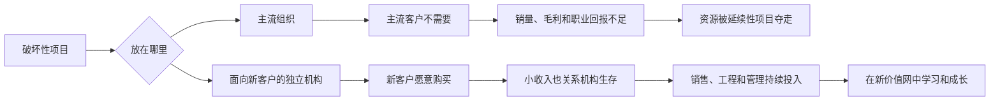

> 章节：第五章“把开发破坏性技术的职责赋予存在客户需求的机构” 
> 作者：克莱顿·克里斯坦森（Clayton M. Christensen） 
> 笔记目标：按原书小节顺序解释资源依赖理论、独立机构的作用与边界，并还原硬盘、计算机、零售和打印机案例的完整因果链。

## 一、本章的问题与核心答案

第一部分解释了优秀企业为何失败；第五章开始回答“该怎样管理”。本章聚焦第一项原则：**在运行良好的企业里，客户和投资者通过提供生存资源，实际控制了资源分配方向。**

管理者面对破坏性技术有两种选择：

1. 在主流组织内反复说服员工：即使现有客户不要、利润更低、市场更小，也必须投入。
2. 建立面向真正需要新技术之客户的独立机构，让客户需求、收入和生存压力自然把资源拉向新业务。

作者认为第二种方式成功概率高得多。独立的意义不只是物理距离，而是让新业务拥有独立的客户、损益责任、成本结构、渠道、考核和资源优先级。

原章没有数学定理或固定算法。下文公式用于严格展开资源筛选、库存回报和组织经济性。

## 二、资源依赖理论：谁真正决定企业方向

### 2.1 要解决什么问题

管理者名义上批准战略和预算，为什么已获高层支持的破坏性项目仍会缺少工程、销售和管理资源？资源依赖理论把分析单位从“高层意志”转向“组织赖以生存的外部资源”。

### 2.2 严格定义与直觉

**资源依赖理论**认为，组织的行动自由受向它提供关键资源的外部实体约束。商业企业主要依靠客户提供收入、投资者提供资本；只有持续满足这些主体的要求，企业才能生存。

可将企业第 $t$ 期可用资源简化为：

$$
R_{t+1}=R_t+Revenue_t+Capital_t-Cost_t
$$

其中 $R_t$ 是资源存量，$Revenue_t$ 是客户收入，$Capital_t$ 是投资者投入，$Cost_t$ 是经营消耗。若企业长期提供客户不买、投资者不支持的产品，新增资源不足，组织会收缩或退出。

这不是精确企业财务模型，而是“外部认可如何转化为组织生存”的直觉表达。

### 2.3 进化类比及其边界

长期竞争会选择出最能满足客户和投资者的人员、流程与价值观。成功企业因而不是偶然客户导向，而是被环境筛选成客户导向。

但企业不等于无意识生物，管理者能选择客户、拆分组织、收购能力并设计激励。进化类比说明默认力量强大，不表示管理者只能象征性存在。本章的解法正是**改变新业务所处的选择环境**。

### 2.4 两种应对方式

在主流组织内强推项目，相当于要求员工长期违背收入、利润和职业标准；创建独立机构，则让新客户成为该机构的关键资源提供者。前者对抗资源依赖，后者利用资源依赖。

独立机构不是目的。若新部门仍由主流销售团队服务、按母公司毛利率和收入规模考核，它仍然受旧价值网控制。

## 三、创新和资源分配

### 3.1 创新与资源分配是一枚硬币的两面

创意只有获得人员、资金、设备、销售时间和管理关注，才可能成为创新。可把项目 $j$ 的实际投入写成：

$$
I_j=F_j+H_j+E_j+S_j+A_j
$$

其中 $F$ 是资金，$H$ 是人力，$E$ 是设备，$S$ 是销售支持，$A$ 是管理注意力。任何关键项长期接近零，项目都可能停滞。因此企业最终推出什么，最真实地反映了资源分配，而不是战略口号。

### 3.2 为什么良好流程会淘汰破坏性项目

优秀企业会系统淘汰客户不需要的方案，把资源投向可销售、可盈利的项目。这是成熟业务成功的必要条件，却让早期破坏性项目在以下方面同时处于劣势：

- 现有客户明确拒绝；
- 市场规模小或未知；
- 毛利率低于公司门槛；
- 销售渠道不熟悉新客户；
- 支持项目的职业回报不确定。

### 3.3 资源分配不是一次高层决策

高层看到的是中层筛选后的提案集合。即使批准，日后仍有无数资源决策：优秀工程师先解决哪个问题、销售人员拜访谁、设备先给哪个产品、管理会议讨论什么。

若项目要连续通过 $n$ 个资源关卡，成功概率为：

$$
P(\text{持续获资})=\prod_{i=1}^{n}P(S_i\mid S_1,\ldots,S_{i-1})
$$

即使每关通过率均为 80%，经过 8 关后也只有：

$$
0.8^8\approx16.8\%
$$

这解释了高层批准为何不足以保证结果。公式假设阶段可区分，并非用于估计真实概率。

### 3.4 职业激励如何传递客户力量

支持大获成功的项目有利于晋升；误判市场、导致产品和产能投资失败，会严重损害职业。中层自然优先支持有客户、有利润的项目。客户不需要直接参与预算会，也能通过收入预期和个人激励影响资源。

## 四、开发破坏性硬盘技术的三种路径

硬盘行业有三个少见的成功转换：昆腾和数据控制通过独立机构利用资源依赖；Micropolis 在母公司内部强制转型，与旧力量对抗。第三例证明内部转型并非逻辑上不可能，却显示其代价和不可复制性。

## 五、昆腾公司和 Plus 开发公司

### 5.1 背景与组织设计

昆腾曾是 8 英寸硬盘领导者，却晚 4 年推出 5.25 英寸产品，业务被从低端侵蚀。1984 年，几名员工发现可插入 IBM XT/AT 扩展槽的 3.5 英寸超薄“硬卡”机会，客户是个人电脑用户而非昆腾的微型机 OEM。

昆腾没有让他们离职，而是成立 Plus Development：

- 昆腾提供资金并持股 80%；
- Plus 自负盈亏、自主招聘完整管理团队；
- 自主设计、以自身品牌营销；
- 生产外包给日本松下寿电子工业公司；
- 直接面对个人电脑新客户。

关键不是持股比例，而是 Plus 的收入、客户和生存均来自新市场。

### 5.2 从替补业务到重塑母公司

Plus 的 Hardcard 收入弥补了昆腾 8 英寸产品衰退。到 1987 年，昆腾原 8 英寸和 5.25 英寸销售基本消失，昆腾收购 Plus 剩余 20%，关闭旧公司，并让 Plus 高管领导重组后的企业。

随后昆腾把 3.5 英寸产品卖给苹果等 OEM，再以延续性组件创新进入工作站，并顺利从 3.5 英寸转向对现有便携客户而言属延续性的 2.5 英寸。到 1994 年，昆腾成为全球销量最大的硬盘厂商。

### 5.3 为什么这个设计有效

Plus 没有被要求在低毛利新市场证明对昆腾大客户的价值；个人电脑用户的购买会直接改善其损益。母公司提供资金，独立机构提供匹配的价值观与流程，形成“资源共享、选择环境分离”。

## 六、俄克拉何马的数据控制公司

数据控制 1965 至 1982 年长期占据 14 英寸 OEM 市场 55% 至 62%，却晚三年进入 8 英寸市场。总部的 8 英寸工程师不断被抽去解决重要 14 英寸客户问题。

希捷 1980 年推出 5.25 英寸产品两年后，数据控制在俄克拉何马城设立专门机构。目标是既不完全脱离总部工程文化，又让团队远离主流客户。

虽然错过最佳时机，它仍取得高容量 5.25 英寸市场约 20% 份额并盈利。案例说明：

- 地理隔离本身不是魔法；
- 隔离的战略作用是减少主流客户日常问题对资源的截流；
- 仍可共享母公司的工程知识、资本和供应关系。

## 七、Micropolis：管理层强力主导的转变

### 7.1 内部转型如何发生

Micropolis 是 8 英寸先驱。1982 年，创始人兼 CEO 斯图尔特·梅本决定转向 5.25 英寸，并把最优秀工程师安排到新项目。公司原想兼顾下一代 8 英寸，但旧客户持续拉走资源。

梅本回忆，18 个月内几乎耗尽全部时间和精力，才保证 5.25 英寸项目获得资源。到 1984 年，公司失去微型机竞争力，撤回 8 英寸产品；新项目则成功。

### 7.2 图 5.1 的含义
> **原书图示**：Micropolis公司的技术转变和市场地位
图中两条容量轨道并非平滑接续：8 英寸产品从约 20MB 上升至近 200MB，5.25 英寸则从约 35MB 的较低起点重新增长。转换要求离开所有重要旧客户，用完全不同的台式机客户收入弥补损失。

这不是在同一客户群内更换技术，而是同时更换产品、市场和收入来源。

### 7.3 为什么不能把它当默认方案

CEO 持续亲自干预能暂时压过组织筛选，但代价高、依赖个人权威，且无法长期覆盖每个微观决策。公司也没能同时保持两代领先。

Micropolis 到 1993 年才推出 3.5 英寸产品，此时容量已超过 1GB，可以卖给现有客户。这时 3.5 英寸对它已成为延续性产品，再次印证主流组织会在客户产生需求后自然投入。

## 八、破坏性技术和资源依赖理论

希捷早期开发 3.5 英寸样机、比塞洛斯-伊利率先开发 Hydrohoe，都未把产品成功带入新价值网。高层决定开发，不等于组织产生寻找新客户所需的推动力。

管理者并非无能为力。他们可以像昆腾、数据控制那样设计一个新的资源依赖关系：让独立机构必须找到重视新产品的客户才能生存。与其要求整个主组织逆流而行，不如改变新业务面对的环境。

可将组织选择概括为：

| 方式 | 优点 | 主要风险 |
|---|---|---|
| 主组织内部强推 | 共享资源最充分 | 旧客户与利润标准持续夺取资源 |
| 独立机构 | 新客户和新经济性可主导决策 | 重复职能、知识隔离、母子冲突 |
| 外部少数股权 | 风险有限、保留观察窗口 | 缺乏经营控制，难形成自身能力 |
| 收购后整合 | 快速获得能力和市场 | 被母公司流程同化 |

## 九、数字设备公司、IBM 和个人电脑

### 9.1 计算机市场的连续破坏

大型机客户不需要早期微型机，利润率和市场也更小，于是 DEC、Data General、Prime、王安等新企业建立微型机市场。后来台式个人电脑又以同样方式冲击微型机；便携式计算机再冲击台式机。

破坏者成熟后会成为下一轮在位者。组织身份由当前价值网决定，而非企业历史标签。

### 9.2 DEC 四次失败的含义

DEC 从 1983 至 1995 年四次推出个人电脑，又四次退出。它不缺进取心和技术，问题是四次均在母公司内进行。超高速 Alpha 微处理器、大型计算机等高性能项目更容易获得资源。

即使 90 年代设个人电脑部门，其毛利率和收入增长标准仍未脱离主公司。名义独立不等于经济独立。

### 9.3 IBM 前五年为何成功

IBM 在远离纽约总部的佛罗里达成立独立个人电脑机构：

- 可向任何供应商采购组件；
- 可使用自己的销售渠道；
- 建立与个人电脑相符的成本结构；
- 按个人电脑市场的速度与标准竞争。

后来加强个人电脑部门与主体机构的联系，可能是盈利能力和份额恶化的重要原因。两种成本结构和盈利模式很难在单一流程中和平共处。

结论不是所有多业务企业都必须拆分，而是当客户、毛利、开发节奏和渠道冲突时，需要足够自治。

## 十、克雷斯吉、伍尔沃思与折扣零售

### 10.1 折扣零售为何是破坏性技术

20 世纪 50 年代的折扣店服务少、选择有限，却以低 20% 至 40% 的价格销售消费者已熟悉的全国品牌耐用品。它服务传统零售商不重视的年轻蓝领家庭，并以低成本、自助和快速周转建立不同盈利模式。

这里“技术”是广义的价值交付流程，不是机器发明。

### 10.2 三种盈利模式及完整推导
> **原书图示**：三种零售商盈利模式
设平均库存成本为 $I$，按成本口径计算的加价率为 $u$，年库存周转率为 $T$。每轮毛利润为 $uI$，一年完成 $T$ 轮，库存投资回报率近似为：

$$
ROI_{inventory}=uT
$$

表 5.1 给出：

| 零售类型 | 一般加价率 | 年周转率 | 库存投资回报率 |
|---|---:|---:|---:|
| 百货店 | 40% | 4 | $40\%\times4=160\%$ |
| 量贩店 | 36% | 4 | $36\%\times4=144\%$ |
| 折扣店 | 20% | 8 | $20\%\times8=160\%$ |

这里原书把商品成本基础上的加价率称作一般毛利率。严格说，加价率与按销售额计算的毛利率不同。若成本为 100、加价 40%，售价为 140，则销售额毛利率为：

$$
m=\frac{140-100}{140}=28.57\%
$$

库存回报简式还忽略租金、人工、损耗、应付账款和季节波动，但足以说明低毛利可由高周转补偿。

### 10.3 折扣市场快速增长
> **原书图示**：折扣零售商市场份额增长
折扣店先从五金、小家电、行李等“自我销售”的品牌耐用品进入，再上移至家具和服装。1960 至 1966 年，其同类商品销售份额从约 10% 升至近 40%。

### 10.4 凯马特与伍尔科的组织差异

克雷斯吉和伍尔沃思分别于 1962 年成立凯马特和伍尔科，相差不到三个月。十年后，凯马特销售近 35 亿美元；伍尔科约 9 亿美元且亏损。

克雷斯吉选择彻底转型：1959 年任命哈里·卡宁安，以发展折扣零售为唯一使命；重建管理团队；1961 年停止新建量贩店，并计划每年关闭约 10% 旧店。

伍尔沃思则要求同一管理体系同时改善量贩店和建立折扣业务，并继续开旧式门店。两种文化和盈利模式在同一机构争夺资源。

### 10.5 合并怎样把伍尔科拉回旧模式

伍尔科最初相对独立，后来与伍尔沃思按地区合并采购、物流和管理，以提高效率。共享资源看似合理，却把传统价值观重新注入折扣业务。
> **原书图示**：组织整合对伍尔科盈利模式的影响
伍尔科加价率升至约 33%，周转率从 7 次降到 4 次，逐渐接近伍尔沃思 35% 加价、4 次周转的传统模式。按简式：

$$
33\%\times4=132\%
$$

既失去折扣价格与高周转，又未获得传统店完整优势。伍尔科于 1982 年关闭最后门店。

案例说明，整合带来的采购协同不一定大于价值观污染。共享什么、隔离什么必须由任务决定。

## 十一、“自杀以求生存”：惠普激光与喷墨打印机

### 11.1 为什么喷墨是破坏性技术

喷墨早期比激光打印慢、分辨率低、单页成本高，但机器小、售价低、单机毛利也低。它不适合激光部门追求的高速、联网、多字体、双面和复杂图形市场，却足以服务学生、教师和个人非联网用户。

### 11.2 惠普的组织设计

惠普没有在爱达荷州博伊西激光打印部门内部发展喷墨，而是在华盛顿州温哥华建立完全独立部门，让两者竞争。激光部门持续向高端，喷墨部门服务个人桌面市场。
> **原书图示**：喷墨和激光打印机的速度改善轨线
图 5.4 显示 1983 至 1995 年激光打印速度约从每分钟 8 页升至 24 页，喷墨从接近 0 升至约 9 页。喷墨始终较慢，但关键不是赶超激光，而是越过个人用户的“足够好”门槛。

若客户最低速度需求为 $d(t)$，采用条件可简化为：

$$
s_{inkjet}(t)\ge d(t)
$$

一旦成立，低价格、小体积等属性可主导选择。该阈值模型忽略打印质量、耗材和可靠性，只用于解释轨道交汇。

### 11.3 自我蚕食为何是正确结果

喷墨可能夺走部分激光客户，甚至压缩激光高端市场。但如果惠普不让自己的喷墨部门蚕食，佳能等竞争者也会做。企业可以让激光业务在高端继续获利，同时让喷墨业务争夺未来大众市场。

“自杀以求生存”不是故意毁掉盈利业务，而是接受业务组合内部竞争，让资本和能力留在公司体系内。独立部门之间仍需由公司层管理品牌、技术共享和资本，但不能因保护旧业务而压制新业务。

## 十二、跨案例比较：独立机构究竟改变了什么

| 案例 | 组织选择 | 结果 | 关键机制 |
|---|---|---|---|
| 昆腾 / Plus | 独立损益、客户与团队 | 重塑昆腾并成为全球领导者 | 新客户直接控制资源 |
| 数据控制俄城 | 远离总部主流客户 | 获高容量 5.25 英寸约 20% 份额 | 减少资源被旧项目截流 |
| Micropolis | 母公司内部强制转型 | 成功但 CEO 耗尽精力 | 持续个人干预对抗系统 |
| DEC 个人电脑 | 名义部门，仍用母公司标准 | 四进四退 | 经济与价值观未独立 |
| IBM PC | 独立采购、渠道和成本结构 | 初期成功 | 按 PC 价值网规则运行 |
| 凯马特 | 新团队并退出旧模式 | 长期成功一段时期 | 组织使命完全转向折扣 |
| 伍尔科 | 与传统业务重新整合 | 失败并关闭 | 旧盈利模式同化新业务 |
| 惠普喷墨 | 与激光部门独立竞争 | 建立喷墨领导地位 | 允许自我蚕食 |

独立机构发挥作用的必要内容通常包括：

- 直接服务新客户；
- 规模与新市场匹配；
- 自己的损益和毛利目标；
- 自主销售、渠道与产品路线；
- 能保护日常资源不被主流紧急事项抽走；
- 可选择性使用母公司资本、品牌、技术和供应链。

## 十三、概念边界与常见误解

### 13.1 “客户控制资源”意味着管理者无用

不对。管理者难以命令旧系统长期违背生存逻辑，却可以选择服务对象、设计组织边界和配置资本。

### 13.2 任何创新都应成立独立公司

不对。延续性创新应利用主组织客户、流程和规模。只有客户、成本、利润、渠道或节奏存在强冲突时，分离才值得付出重复职能和协调成本。

### 13.3 地理分离就等于战略独立

不对。DEC 的个人电脑部门说明，若仍按母公司毛利和增长标准考核，换办公室没有意义。

### 13.4 独立机构不能共享母公司资源

不对。Plus 使用昆腾资本，IBM PC 使用企业品牌，惠普两部门可共享技术基础。应隔离不相容的流程和价值观，而非切断一切联系。

### 13.5 内部强推绝不可能成功

不对。Micropolis 成功，但需要 CEO 18 个月持续干预，并牺牲旧业务。它是高代价例外，不是可规模化常规方案。

### 13.6 蚕食现有业务一定有害

不对。若替代不可避免，不自我蚕食通常意味着被别人蚕食。需要比较整体企业价值，而非单部门收入。

### 13.7 低毛利等于低回报

不对。折扣店以高周转获得与百货店相近的库存回报。必须同时看毛利、周转、资本需求和费用结构。

## 十四、作者方法为何有效，又有什么局限

### 14.1 有效之处

1. 用成功和失败配对，而非只研究赢家。
2. 覆盖硬盘、计算机、零售、打印机，增强跨行业解释力。
3. 区分技术开发成功与商业化成功，定位资源流程。
4. Micropolis 作为反例说明理论不是绝对决定论。
5. 零售周转数据把“不同盈利模式”量化。

### 14.2 局限

1. 案例研究不能像随机实验完全排除管理质量、时机和竞争差异。
2. 成功案例可能有选择偏差，大量独立机构同样会失败。
3. “独立”包含多个变量，难确定客户、领导者、地理还是成本结构贡献最大。
4. 历史结局不代表企业后来持续成功，例如凯马特之后仍衰落。
5. 库存回报简式忽略营业费用、融资和现金周期。
6. 内部竞争可能重复投资、损害品牌或造成渠道冲突。
7. 强监管、重大安全风险或高固定资本行业不易建立完整独立机构。

### 14.3 替代与补充方法

- **自治事业部**：不必法律分拆，但独立损益、客户和指标。
- **内部创业基金**：按学习里程碑分阶段拨款，避免与主业务 NPV 直接比较。
- **收购后保持独立**：获取新价值网，同时防止流程同化。
- **外部合资**：共享风险和能力，但需明确控制权与资源承诺。
- **双元组织**：公司层共享资源，业务层分别探索和利用。

## 十五、实践中的组织设计步骤

1. **判断创新类型。**现有重要客户是否需要它？若需要，优先放在主组织。
2. **寻找首批真实客户。**谁现在就重视低价、小巧、便利等属性？
3. **比较经济模型。**新旧业务的价格、毛利、周转、渠道和市场规模是否冲突？
4. **确定自治程度。**冲突越深，越需要独立损益、销售和产品决策。
5. **选择共享资源。**共享资本、品牌或技术，但防止主流紧急项目抽调核心人员。
6. **设置匹配指标。**用学习速度、真实复购、单位经济性和新客户增长，而非母公司绝对收入考核早期业务。
7. **允许自我蚕食。**以公司整体未来价值判断，不用旧部门利益否决。
8. **设计整合条件。**只有客户、成本和流程趋同后才考虑合并；过早整合会复制伍尔科问题。
9. **写明停止条件。**独立不等于无限补贴，关键假设被证伪时应转向或退出。

## 十六、本章总结

第五章把“客户控制资源”从失败原因转化为管理杠杆。成熟组织不投资破坏性项目，并非只因管理者没远见，而是客户、利润、职业激励和日常流程共同把资源拉向主流业务。

昆腾、数据控制、IBM、凯马特和惠普的共同做法，是把新业务放入真正需要它的价值网，使小市场和低毛利不再是缺陷，而成为机构赖以生存的机会。DEC 和伍尔科则说明，名义上的新部门如果仍服从母公司的客户、成本和盈利标准，独立只是形式。

本章最重要的结论是：**不要试图只靠意志让主流组织长期做它认为不合理的事；应让破坏性业务面对一组能使正确行为自然获得资源的客户和经济条件。**独立机构不是万能答案，却是客户、盈利模式和流程发生根本冲突时，最可复制的组织解法。
