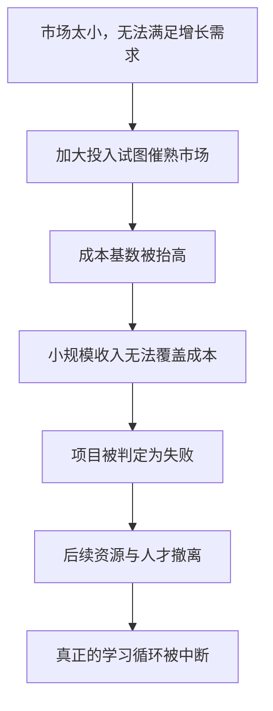

> 章节：第六章“如何使机构与市场的规模相匹配” 
> 作者：克莱顿·克里斯坦森（Clayton M. Christensen） 
> 笔记目标：按原书小节顺序还原“何时必须领先、为什么大企业进不了小市场、怎样用组织规模匹配市场规模”的完整论证，解释统计口径、公式推导、案例证据与适用边界。

## 一、本章的问题与主张

第五章解决了“把破坏性项目放在谁的客户面前”，第六章解决第二项原则：**小市场不能满足大企业的增长需求**，并回答一个更具体的战略问题：面对破坏性技术，企业究竟必须抢先，还是可以等待观望？

本章的中心主张是：

> 在破坏性技术的商业化中，管理者必须成为领先者而非追随者；要做到这一点，就必须把项目交给规模与目标市场相匹配的机构。

这个主张由两个可分别检验的发现支撑：

1. **领先的重要性取决于创新类型。**在延续性技术中，领先者相对追随者没有明显长期优势；在破坏性技术中，早期进入带来巨大回报。
2. **企业越大越难早期进入。**增长型企业每年需要的新增收入以绝对金额计算，而新兴市场初期规模太小，无法对大企业产生可见影响。

两者合起来构成一个尖锐的矛盾：**最需要早进入的时候，正是市场对大企业最没有吸引力的时候。**

作者提出的解法不是激励口号，而是**组织规模与市场规模匹配**：让一个小到会为小订单欢呼的机构承担项目，并把它制度化，即使母公司仍在高速增长。

本章没有形式化定理，主要使用行业统计（表 6.1）、技术领先性比较（图 6.1、6.2）和三组案例研究。下文的公式用于严格展开增长算术、估值敏感性、成功率比较和产品周期追赶。

## 二、先锋企业是否真的时刻作好了准备

### 2.1 问题从哪里来

创新管理中有一个长期争论：应当做技术领先者，还是做快速追随者？

- **先发优势**论认为，早进入可获得学习曲线、客户关系、标准制定权和渠道锁定。
- **等待策略**论认为，让先锋承担技术和市场风险，等不确定性下降后再以更强资源进入更划算。

管理界流行一句反讽：“你总能认出哪些是先锋企业，它们就是那些身上插满箭的企业。”原书译文作“它们就是那些时刻准备着的企业”，其反讽含义相同：先行者往往付出代价。

### 2.2 为什么这个争论长期没有结论

因为两派都在寻找一个**无条件**答案，而正确答案是**有条件**的。作者的方法论贡献在于：不问“领先是否重要”，而问“在哪一类技术变革中领先重要”。

这与前几章的分析方式一致：把“技术”按其在价值网中的作用分类，再分别检验。硬盘行业同时包含大量延续性创新和少数破坏性创新，且有完整产品数据，因此可以在同一行业内做对照，避免用不同行业比较造成的混杂。

严格地说，作者要检验的是一个**交互作用**假设：

$$
\text{领先的价值}=f(\text{创新类型})
$$

即领先与绩效之间的关系，随创新类型改变符号或强度。若只做“领先与否”对绩效的主效应回归，两类相反的效应会互相抵消，得出“领先无关紧要”的错误结论。

## 三、引领延续性技术变革可能并不具有决定性的意义

### 3.1 检验对象：薄膜磁头

作者选择薄膜读写磁头作为检验案例，理由是它足够“重要”，从而构成对领先假设的严格检验：

- 它改变了磁录密度的改善速度，属于分水岭技术；
- 研发投入约 1 亿美元，周期 5 至 10 年；
- 只有领先的成熟企业负担得起；
- 当时商业媒体普遍猜测，谁在这项技术上落后，谁就会被淘汰。

如果“延续性技术必须领先”成立，这里应当出现最明显的证据。

### 3.2 图 6.1：企业选择的转换时点差异极大
> **原书图示**：薄膜技术相对于铁氧技术的性能所能达到的磁录密度
图 6.1 的纵轴是磁录密度（Mbpsi，对数刻度），横轴是年份。每家企业对应一条线段：

- **线段底端**：该企业在推出薄膜磁头产品之前，用铁氧体技术达到的最大磁录密度；
- **线段顶端**：该企业首款薄膜磁头产品达到的磁录密度。

关键读数：

| 企业 | 角色 | 转换时的大致密度水平 |
|---|---|---|
| IBM | 最早采用者 | 约 3 Mbpsi 时转换 |
| 梅莫雷克斯、存储技术 | 早期采用者 | 与 IBM 相近的早期阶段 |
| 惠普、Micropolis、昆腾、希捷 | 中期采用者 | 密度已显著更高时转换 |
| 富士、日立、东芝、数字设备 | 后期采用者 | 把铁氧体推到接近 IBM 转换点约 10 倍的密度后才转换 |

也就是说，后进入者并没有“被迫落后”，而是选择继续榨取旧技术潜力。原书指出，富士和日立在转换前把铁氧体磁头性能提高到接近 IBM 首次采用薄膜时的近 10 倍。

这本身就说明一件重要的事：**同一条延续性轨道可以有多条实现路径。**新组件技术只是提高性能的方式之一，改进现有材料、工艺、编码和系统设计同样能推进轨道。

### 3.3 图 6.2：先后顺序与最终技术地位无关
> **原书图示**：采用薄膜技术的顺序与1989年最高性能型号磁录密度的关系
图 6.2 是一张散点图：

- **横轴**：企业采用薄膜磁头的先后顺序（1 = 最早，15 = 最后）；
- **纵轴**：1989 年该企业最先进型号的磁录密度排名（1 = 最高，15 = 最低），括号内为具体密度值。

若存在学习优势，散点应从左上向右下倾斜（早采用者排名靠前）。实际分布如下：

| 企业 | 采用顺序 | 1989 年密度排名 | 密度值 |
|---|---:|---:|---:|
| IBM | 1 | 4 | 62 |
| 梅莫雷克斯 | 2 | 12 | 30 |
| 存储技术 | 早期 | 14 | 25 |
| 日本电气 | 3 | 5 | 58 |
| 数据控制 | 4 | 6 | 53 |
| Rodime | 5 | 9 | 45 |
| 惠普 | 7 | 1 | 75 |
| Micropolis | 8 | 2 | 72 |
| 昆腾 | 9 | 10 | 44 |
| 希捷 | 11 | 13 | 27 |
| 东芝 | 12 | 8 | 47 |
| 日立 | 14 | 3 | 64 |
| 数字设备 | 14 | 7 | 57 |
| 富士通 | 15 | 6 | 50 |

最早采用的 IBM 排名第 4，第二个采用的梅莫雷克斯排到第 12；而排名第 1、第 2 的惠普与 Micropolis 属于中期采用者，排名第 3 的日立几乎是最后一批。散点近似随机分布，看不出明显斜率。

结论：在薄膜磁头这项延续性创新中，**领先者既未获得市场份额优势，也未积累可持续的技术学习优势。**硬盘行业其他延续性技术也呈现类似模式。

### 3.4 例外条件：“刀锋”行业

作者没有把结论绝对化，并通过金·克拉克的意见给出边界条件：在**竞争基础单一且不容犯错**的行业中，延续性技术的领先仍然生死攸关。

**刀锋行业的定义**：产品竞争几乎只由一个性能维度决定，客户没有其他替代性选择理由。

典型例子是照相平版印刷光刻机（PLA）：客户是集成电路厂商，它们必须获得最窄线宽才能保持自身竞争力。因此光刻机厂商一旦线宽落后，就无人购买，只能失败。

反例是国家现金出纳机公司（NCR）从机电向电子技术的转变：NCR 采用很晚，1980 年代初甚至有整整一年电子出纳机销售额几乎归零，但凭借强大的现场服务和安装能力争取了时间，再依靠品牌与销售服务迅速夺回份额。

由此可提炼一条判断规则：

$$
\text{延续性领先的重要性}\propto\frac{1}{\text{竞争基础的维度数量}}
$$

这是定性关系而非可计算公式。含义是：**市场越复杂、生存方式越多元，延续性技术领先就越不关键；竞争维度越单一，领先越接近必需。**

### 3.5 需要避免的误读

原书明确设了一个防线：这并不意味着长期在性能或成本上落后的企业也能生存。作者的准确表述是——**没有证据表明，在延续性创新中领先能带来相对于追随者的明显且长期的竞争优势**。原因是复杂产品有多条改进路径，采用新组件只是其中之一；在等待新方法成熟的同时，仍可用无数其他途径扩展传统技术性能。

## 四、在破坏性技术中处于领先地位能创造巨大的价值

### 4.1 核心结论与量化幅度

与延续性技术相反，破坏性技术中的领先具有决定性意义：

> 在新一代破坏性硬盘出现后**两年内**进入其所创造的新价值网的企业，成功概率是两年后才进入者的**6 倍多**。

这一倍数来自后文的 37% 与 6%：

$$
\frac{37\%}{6\%}\approx6.2
$$

### 4.2 样本构成与口径

1976 至 1994 年，共有 **83 家**企业进入美国硬盘行业：

- **48 家**独立创业企业（多由风险资本支持，创始人多来自行业内其他企业）；
- **35 家**多元化企业（如梅莫雷克斯、Ampex、3M、施乐）。

样本口径需要注意：数据包含所有曾设计过、或据了解宣称设计过硬盘的企业，**不论其是否真正销售过产品**，且未对企业类型作偏向性取舍。这一“宽口径”减少了幸存者偏差，但也意味着分母中包含大量从未真正经营的企业。

作者还给出两个操作性定义，使分类可复现：

- **新技术（未经检验的技术）**：该技术在全球首次被用于量产销售的产品后不足两年；或虽已超过两年，但使用过它的硬盘厂商不足 20%。
- **新兴市场（新价值网）**：首个硬盘被应用于该级别计算机的时间不足或等于两年；超过两年即算成熟市场。

这两个定义把“领先/追随”从主观判断变成可操作的时间阈值。**两年**是人为设定的分界，属于该研究的具体假设，换用一年或三年可能改变边缘案例的归类。

### 4.3 表 6.1：两个维度的进入策略矩阵
> **原书图示**：至少有一年实现1亿美元收入的硬盘驱动器企业
表 6.1 用两个维度划分进入策略：

- **纵轴（技术策略）**：初始产品只使用经检验技术（下方），还是使用一种或多种新组件技术（上方）；
- **横轴（市场策略）**：进入成熟价值网（左侧），还是进入新兴价值网（右侧）。

换一种说法：上方两格是“进入时积极引领延续性技术”的企业，右侧两格是“进入时创建新价值网”的企业。右侧包含所有试图建立新价值网的企业，即便该价值网最终没有形成重要市场（如可移动磁盘模块）。

各列含义：

- **成功**：至少有一年收入达到 1 亿美元，即使日后破产也计入；
- **失败**：收入从未超过 1 亿美元且已退出行业；
- **无定论**：1994 年仍在经营但收入从未达到 1 亿美元；
- **成功率**：成功企业数 ÷ 该格企业总数。

#### 象限一：新技术 + 成熟市场

| 企业类型 | 成功 | 失败 | 无定论 | 合计 | 成功率 | 累计销售额（百万美元） |
|---|---:|---:|---:|---:|---:|---:|
| 创业型 | 0 | 7 | 3 | 10 | 0% | 235.3 |
| 相关技术 | 0 | 1 | 0 | 1 | 0% | — |
| 相关市场 | 0 | 3 | 0 | 3 | 0% | 1.4 |
| 前向综合 | 0 | 1 | 0 | 1 | 0% | — |
| **合计** | **0** | **12** | **3** | **15** | **0%** | **236.7** |

#### 象限二：新技术 + 新兴市场

| 企业类型 | 成功 | 失败 | 无定论 | 合计 | 成功率 | 累计销售额（百万美元） |
|---|---:|---:|---:|---:|---:|---:|
| 创业型 | 3 | 4 | 1 | 8 | 37% | 16 379.3 |
| **合计** | **3** | **4** | **1** | **8** | **37%** | **16 379.3** |

#### 象限三：经检验技术 + 成熟市场

| 企业类型 | 成功 | 失败 | 无定论 | 合计 | 成功率 | 累计销售额（百万美元） |
|---|---:|---:|---:|---:|---:|---:|
| 创业型 | 3 | 11 | 3 | 17 | 18% | 2 485.7 |
| 相关技术 | 0 | 4 | 0 | 4 | 0% | 191.6 |
| 相关市场 | 0 | 12 | 0 | 12 | 0% | 361.2 |
| 前向综合 | 0 | 3 | 0 | 3 | 0% | 17.7 |
| **合计** | **3** | **30** | **3** | **36** | **8%** | **3 056.2** |

#### 象限四：经检验技术 + 新兴市场

| 企业类型 | 成功 | 失败 | 无定论 | 合计 | 成功率 | 累计销售额（百万美元） |
|---|---:|---:|---:|---:|---:|---:|
| 创业型 | 4 | 2 | 7 | 13 | 31% | 32 043.7 |
| 相关技术 | 4 | 0 | 2 | 6 | 67% | 11 461.0 |
| 相关市场 | 1 | 0 | 4 | 5 | 20% | 2 239.0 |
| **合计** | **9** | **2** | **13** | **24** | **36%** | **45 743.7** |

#### 按市场策略汇总

| 市场策略 | 成功 | 失败 | 无定论 | 合计 | 成功率 | 累计销售额（百万美元） |
|---|---:|---:|---:|---:|---:|---:|
| 进入成熟市场 | 3 | 42 | 6 | 51 | 6% | 3 292.9 |
| 进入新兴市场 | 12 | 6 | 14 | 32 | 37% | 62 123.0 |

### 4.4 从表格中推导出的四个结论

**结论一：市场策略远比技术策略重要。**

进入成熟市场者的成功率：

$$
\frac{3}{51}\approx5.9\%\approx6\%
$$

进入新兴市场者的成功率：

$$
\frac{12}{32}=37.5\%\approx37\%
$$

**结论二：引领延续性技术反而略微不利。**

上半部分（进入时引领新组件技术）合计 $15+8=23$ 家，成功 $0+3=3$ 家：

$$
\frac{3}{23}\approx13.0\%
$$

下半部分（使用经检验技术）合计 $36+24=60$ 家，成功 $3+9=12$ 家：

$$
\frac{12}{60}=20\%
$$

即追随者 20% > 领先者 13%。**最肥沃的土壤是右下象限：用成熟可靠的技术去开辟新市场。**

**结论三：企业出身不重要，进入位置才重要。**

新兴市场中，创业型企业成功率 $7/21\approx33\%$，相关技术企业 $4/6\approx67\%$，相关市场企业 $1/5=20\%$。多元化大企业进入新兴市场同样可以成功——真正区分成败的不是组织形式，而是**是否率先推出破坏性产品并为其创造市场**。

**结论四：收入差距远大于成功率差距。**

累计收入对比：

$$
620\text{ 亿美元（新兴市场）}\quad\text{对}\quad33\text{ 亿美元（成熟市场）}
$$

倍数为：

$$
\frac{62\,123}{3\,292.9}\approx18.9\approx20\text{ 倍}
$$

单家企业平均收入：

$$
\bar R_{\text{成熟}}=\frac{3\,292.9}{51}\approx64.6\text{ 百万美元}
$$

$$
\bar R_{\text{新兴}}=\frac{62\,123}{32}\approx1\,941\text{ 百万美元}\approx19\text{ 亿美元}
$$

两者相差约 30 倍。这说明进入新兴市场不仅提高成功概率，还大幅提高成功时的规模。

### 4.5 风险互换：这是本章最深刻的洞察之一

作者对左侧企业的判断是：它们用**市场风险**换取了**竞争风险**。

- **市场风险**：新兴市场可能中途夭折，永远长不大（如可移动磁盘模块市场长期低迷）。
- **竞争风险**：进入已确立的成熟市场，需要与拥有客户、渠道、成本优势的在位者正面竞争。

数据表明这次互换是亏本的：市场风险看起来更吓人，因为不确定；竞争风险看起来更可控，因为可测量。但可测量不等于更小。

用期望值语言表述，若成功概率为 $p$、成功时收入为 $V$，则期望收入为：

$$
E(R)=pV
$$

代入两组数据：

$$
E(R)_{\text{新兴}}\approx0.375\times V_{\text{新兴}},\qquad
E(R)_{\text{成熟}}\approx0.059\times V_{\text{成熟}}
$$

由于 $V_{\text{新兴}}$ 同样更大，两个因子同向叠加。这解释了为何平均收入差距（30 倍）大于成功率差距（6 倍）。

该计算是对已实现结果的事后描述，不是事前概率估计。它假设行业结构与样本期一致，不能直接外推到其他行业或时期。

### 4.6 对风险投资的推论

原书在脚注中给出一个实用推论：计划把突破性（本质上是延续性）技术商业化的创业企业，成功概率远低于用成熟技术去破坏现有行业（提供更简单、更可靠、更便捷产品）的创业企业。

原因在本书框架内是自洽的：成熟企业总能调动资源追赶延续性技术突破，因此创业公司在此战场上没有结构性优势；而在破坏性提案上，成熟企业面临巨大的内部阻力，创业公司才拥有真正的保护带。

## 五、企业规模和破坏性技术变革中的领先地位

### 5.1 矛盾的完整形态

前四章已经说明成熟企业受制于客户和资源分配流程。本节补上另一个独立约束：**规模本身**。

企业越大越成功，就越难为早期进入新兴市场找到理由——而证据恰恰表明，早期进入至关重要。

### 5.2 为什么管理者必须追求增长

原书列出四条理由，每条都指向真实的组织约束：

1. **股价对增长率高度敏感。**股价代表市场对未来盈利流的贴现现值，其水平受**预期增长率变化**影响。
2. **股票期权的激励价值依赖股价上涨。**股价停滞时，期权失去吸引力，留人成本上升。
3. **增长为优秀员工提供晋升空间。**企业停止增长时，最有潜力的未来领导者会因看不到机会而流失。
4. **增长型企业更容易为新产品和流程技术争取投资。**

### 5.3 股价公式的完整推导

原书脚注给出金融分析师常用的简式：

$$
P=\frac{D}{C-G}
$$

其中 $P$ 为每股股价，$D$ 为每股股息，$C$ 为企业资本成本，$G$ 为预计长期增长率。

**推导过程**：设下一期股息为 $D$，其后每期按 $G$ 增长，以 $C$ 为折现率，则：

$$
P=\sum_{t=1}^{\infty}\frac{D(1+G)^{t-1}}{(1+C)^{t}}
$$

提出公因子 $\dfrac{D}{1+C}$：

$$
P=\frac{D}{1+C}\sum_{t=0}^{\infty}\left(\frac{1+G}{1+C}\right)^{t}
$$

这是首项为 1、公比为 $q=\dfrac{1+G}{1+C}$ 的无穷等比级数。当 $|q|<1$（即 $C>G$）时收敛于 $\dfrac{1}{1-q}$：

$$
\sum_{t=0}^{\infty}q^{t}=\frac{1}{1-\frac{1+G}{1+C}}=\frac{1+C}{(1+C)-(1+G)}=\frac{1+C}{C-G}
$$

代回：

$$
P=\frac{D}{1+C}\cdot\frac{1+C}{C-G}=\frac{D}{C-G}
$$

**符号与假设逐项说明**：

| 符号 | 含义 | 关键假设 |
|---|---|---|
| $D$ | 下一期每股股息 | 股息可代表可分配盈利 |
| $C$ | 资本成本（折现率） | 恒定不变，且 $C>G$ |
| $G$ | 长期增长率 | 永续恒定 |
| $P$ | 每股理论价格 | 无套利、无摩擦市场 |

**增长率变化的敏感性**：对 $G$ 求偏导：

$$
\frac{\partial P}{\partial G}=\frac{D}{(C-G)^{2}}>0
$$

分母是平方项，说明当 $G$ 接近 $C$ 时，价格对增长预期的敏感度**急剧放大**。

**数值演算**：设 $D=1$、$C=12\%$。

- 若 $G=8\%$：$P=\dfrac{1}{0.12-0.08}=25$
- 若预期下调至 $G=6\%$：$P=\dfrac{1}{0.12-0.06}\approx16.7$

价格下跌：

$$
\frac{25-16.7}{25}\approx33\%
$$

即增长预期仅下调 2 个百分点，股价可跌三分之一，而此时公司收入和利润仍在增长。这正是原书想说明的机制：**增长率放缓本身就是惩罚，即使绝对业绩仍在改善。**

**适用边界（重要）**：该公式要求 $C>G$，否则级数发散、公式失去意义。因此正文举例中的“20% 增长率”不能直接代入永续模型——20% 的增长在现实中只能维持有限年限。这提示我们：简式适用于**成熟期的稳定增长**，用于高增长企业时必须改用多阶段模型（先高增长若干年，再进入永续阶段）。原书在正文中只是借它说明“预期变化影响股价”的定性道理，而非精确估值。

### 5.4 增长算术：为什么小市场对大企业无效

设企业当前收入为 $R$，目标增长率为 $g$，则第一年所需新增收入为：

$$
\Delta R_1=gR
$$

第二年基数变为 $R(1+g)$，所需新增收入为：

$$
\Delta R_2=gR(1+g)
$$

推广到第 $n$ 年：

$$
\Delta R_n=gR(1+g)^{n-1}
$$

**原书的数值对照**（$g=20\%$）：

| 企业规模 | 第一年需新增 | 第二年需新增 |
|---|---:|---:|
| 4 亿美元 | $0.2\times4=0.8$ 亿美元 | $0.8\times1.2=0.96$ 亿美元 |
| 40 亿美元 | $0.2\times40=8$ 亿美元 | $8\times1.2=9.6$ 亿美元 |

关键在于：**新兴市场的初期总规模，往往连大企业单年增长需求的零头都不到。**破坏性技术催生的新市场，没有一个在诞生初期能达到 8 亿美元。

我们可以定义一个“规模匹配比”来量化这一问题：

$$
\lambda=\frac{S_{\text{新市场总规模}}}{gR}
$$

其中 $S$ 是新兴市场当年总规模。$\lambda$ 的含义是：**即使全部拿下该市场，能满足当年增长需求的比例。**

- 对 4 亿美元企业、市场规模 4000 万美元：$\lambda=\dfrac{0.4}{0.8}=50\%$ ——足以引起高度重视。
- 对 40 亿美元企业、同一市场：$\lambda=\dfrac{0.4}{8}=5\%$ ——几乎不可见。

同一个市场、同一项技术，对两家企业的战略含义完全不同。这解释了为什么“说服大企业重视小市场”在结构上极其困难：它不是认知问题，而是算术问题。

### 5.5 三种应对策略

作者列出管理者实际采用的三种办法：

1. **改变新兴市场的增长率**，把它催熟到足以影响大企业的收入轨道；
2. **等待市场“发展到一定规模”**，待定位清晰后再进入；
3. **把商业化职责交给足够小的机构**，使其从一开始就会被这项业务的收入、利润和小额订单显著影响。

作者的判断是：前两种问题很多，第三种虽有缺陷，但证据显示最为可行。接下来三个案例研究分别检验这三条路径。这种“先穷举备选方案再逐一证伪”的结构，使结论不是断言，而是比较的结果。

## 六、案例研究：推动新兴市场的增长率

### 6.1 苹果早期的正确做法（对照组）

在分析牛顿失败之前，必须先看苹果自己的成功史，它构成了最有力的内部对照：

| 产品 | 年份 | 销量 | 性质 |
|---|---|---|---|
| Apple I | 1976 | 200 台（售价 666 美元） | 功能有限，撤市 |
| Apple II | 1977 | 上市头两年 43 000 台 | 大获成功，奠定行业地位 |

关键在于 Apple I 的失败**没有造成财务危机**：研发开支不高，而苹果与其客户都从中学到了如何使用台式计算机。这正是低成本试错的价值——失败的成本被控制在可以承受的范围内，而学习被保留了下来。1980 年苹果借 Apple II 成功上市。

原书还列出苹果更长的试错序列：Apple I 失败 → Apple II 平淡 → Apple II+ 成功 → Apple III 因质量问题被弃 → Lisa 失败 → 前两代 Macintosh 举步维艰 → 第三代 Macintosh 才最终确立用户友好标准。**市场是制造商与消费者共同发现的过程，需要时间。**

### 6.2 牛顿：同样的时机，不同的规模

推出 Apple II 十年后，苹果已成长为市值约 50 亿美元的企业，每年需要大幅增加收入。1990 年代初 PDA 市场显现潜力，而“用户友好与便捷”正是苹果的设计强项——机会看似完美契合。

苹果的做法是**主动出击、加速催熟**：

- 投入数百万美元开发牛顿；
- 进行公司史上最大规模的市场研究，用跟踪调研小组和调查确定产品特色；
- CEO 约翰·斯卡利将其列为个人首选项目，大规模推广以确保资源。

结果：1993—1994 两年卖出 **14 万台**，被普遍视为灾难。技术上手写识别令人失望，无线通信推高成本；更关键的是，**首年销售额只占苹果总收入约 1%**。

### 6.3 用同一把尺子重新衡量

作者做了一个非常有说服力的换算：牛顿进入 PDA 市场的时机，与 Apple II 进入台式机市场的时机类似。按创造市场型破坏性产品的标准衡量：

$$
\frac{140\,000}{43\,000}\approx3.3
$$

**牛顿头两年销量是 Apple II 的三倍多。**

1979 年，43 000 台对当时规模尚小的苹果是重大胜利，足以支撑上市；1994 年，14 万台对已成行业巨头的苹果只能算失败。

我们可以用 $\lambda$ 指标验证这一落差。设牛顿单价约 700 美元，两年收入约：

$$
140\,000\times700\approx0.98\text{ 亿美元}
$$

而 50 亿美元的苹果若要维持 20% 增长，单年就需要 10 亿美元新增收入：

$$
\lambda\approx\frac{0.5}{10}\approx5\%
$$

（此处单价为便于说明的估算，用于展示量级关系。）同一份成绩单，在不同规模的组织里得到完全相反的评价。

### 6.4 失败的真正机制

作者指出，牛顿的根本问题**不是管理不当**，而是“小市场不能满足大机构的短期增长需求”。这一约束通过三个具体机制致命地起作用：

**机制一：错误假设消费者知道自己要什么。**牛顿用大规模市场研究来确定特色，等于假定用户已经了解一个尚不存在的产品类别的需求。破坏性技术恰恰让此前不可能的事变为可能，因此制造商和消费者都还不知道该怎么用、为什么用、哪些特色最终会被重视。

**机制二：被迫扮演延续性技术领先者。**为了交付“用户认为自己想要的东西”，苹果不得不在一个新兴产业里巨额投资当时最先进的移动数据通信和手写识别技术。回看表 6.1，这正是最凶险的左上象限打法——**在新兴市场同时承担新技术风险**。风险投资界的经验法则也印证这点：企业不应同时在两个市场对两种技术进行创新。

**机制三：巨额投入摧毁了盈利能力。**新兴市场规模小，参与其中的机构**必须能以较小规模实现盈利**。这一点至关重要，因为被视为盈利和成功的项目，才能继续从母公司和资本市场吸引资金与人才；被认定失败的项目则很难再获资源。苹果为加速市场形成而投入巨资，使牛顿无法获得有吸引力的回报率，于是被贴上失败标签。

这里存在一个自我强化的陷阱：

**结论**：新兴市场的增长率主要由客户发现自身用途的速度决定，投入更多资金不一定能按比例加速这一过程；但投入更多资金一定会提高盈亏平衡门槛。

## 七、案例研究：等到市场发展到一定规模时再进入

### 7.1 这条路径为何有迷惑性

等待策略确实偶有成功，IBM 于 1981 年进入台式个人电脑市场就是范例。但作者指出这个逻辑“颇具迷惑性，而且最终可能引火烧身”，原因是：

> 创造了新市场的企业通常也培养出了与这些市场要求密切吻合的能力，而这些能力是后来者难以成功复制的。

这是一个重要的理论推进：**先发优势的实质不是时间本身，而是时间里长出来的能力。**这些能力嵌在流程与组织节奏中，无法靠事后砸钱补齐。

### 7.2 案例一：Priam 与产品开发节奏

事实链条：

| 时间 | 事件 |
|---|---|
| 1978 | Priam 进入微型计算机领域，成为 8 英寸硬盘领先厂商 |
| — | 形成**每两年**推出一款新产品的能力，与其客户（微型机厂商）的两年周期一致 |
| 1980 | 希捷向新兴台式机市场推出首款 5.25 英寸硬盘，速度更慢、具破坏性 |
| 1983 | 希捷等企业形成**每年**推出一款新产品的能力 |
| 1982 | Priam 推出首款 5.25 英寸硬盘，但仍沿用两年周期 |
| 1990 | Priam 关门歇业 |

**关键洞察**：能力不只是“能不能造出这个产品”，还包括“以什么节奏迭代”。Priam 造得出 5.25 英寸硬盘，却造不出台式机市场所需的开发节奏。它从未拿到台式机厂商的大订单，因为新产品始终赶不上对方的设计周期。

**节奏差距的数学推导**：

设两家企业每代产品的性能改善倍数同为 $k$，A 企业开发周期 $T_A$ 年，B 企业为 $T_B$ 年。经过 $t$ 年后，各自性能为：

$$
P_A(t)=P_{A0}\,k^{\,t/T_A},\qquad P_B(t)=P_{B0}\,k^{\,t/T_B}
$$

两者比值：

$$
\frac{P_B(t)}{P_A(t)}=\frac{P_{B0}}{P_{A0}}\,k^{\,t\left(\frac{1}{T_B}-\frac{1}{T_A}\right)}
$$

代入希捷（$T_B=1$）与 Priam（$T_A=2$）：

$$
\frac{P_B(t)}{P_A(t)}=\frac{P_{B0}}{P_{A0}}\,k^{\,t/2}
$$

令比值为 1，求追平时间：

$$
t^{*}=\frac{2\ln\left(P_{A0}/P_{B0}\right)}{\ln k}
$$

**数值演算**：假设 Priam 初始性能是希捷的 3 倍（$P_{A0}/P_{B0}=3$），每代改善 1.6 倍（$k=1.6$）：

$$
t^{*}=\frac{2\ln 3}{\ln 1.6}=\frac{2\times1.0986}{0.4700}\approx4.7\text{ 年}
$$

即约 4.7 年后性能差距被完全抹平。若 Priam 也能把周期缩到 1 年（指数项归零），差距将永远不会自行消失。

**这个推导说明了什么**：即使初始性能领先 3 倍，只要迭代节奏慢一倍，几年内优势就会归零。而节奏是由客户结构和组织流程决定的——它比性能指标更难改变。这也解释了为什么“等市场成熟再进入”常常失败：等待期间，先行者积累的不是产品参数，而是难以复制的运转方式。

**成立条件与边界**：该推导假设两家企业每代改善倍数相同、周期稳定、性能可用单一指标衡量。现实中新进入者可能因技术跃迁获得更大的 $k$，也可能因工艺不成熟而更小；客户还会因兼容性、认证和切换成本延迟采购。

### 7.3 案例二：希捷与 3.5 英寸硬盘

| 时间 | 事件 |
|---|---|
| 1984 | 希捷成为业内第二家成功开发 3.5 英寸硬盘的企业 |
| 1985 秋 | 在世界计算机分销商展览会展示 10MB 样机 |
| 1986 年底 | 仍未推出。CEO 艾伦·舒加特解释：“截至目前，这个市场还不够大” |
| 1987 | 市场销售额已达 **16 亿美元**、“发展到一定规模”后，希捷才推出产品 |
| 1991 | 已销售大量 3.5 英寸硬盘，但对便携式计算机厂商销量几乎为零 |

结果是：希捷所有型号全部销往台式机市场，以防御姿态蚕食自家 5.25 英寸硬盘销量——**它进入的是产品，而不是市场。**

### 7.4 康诺为什么赢：流程顺序的重新设计

康诺率先把 3.5 英寸硬盘卖进便携式计算机市场并保持领先。其高管的描述极具概括力：

> 从 OEM 硬盘产业诞生起，产品研发一直依次是：设计硬盘 → 生产硬盘 → 销售硬盘。我们改变了顺序：**先销售 → 再设计 → 最后生产。**

这不是口号，而是一整套配套能力：为便携式计算机市场的主要客户提供**客户定制服务**，并相应重构市场营销、工程管理和制造流程。

另一位康诺联合创始人的评价一针见血：“希捷公司从未弄清楚应该怎样在便携式计算机市场销售硬盘驱动器。它们从未发现其中的窍门。”

用第二章的语言说：康诺改变的是**价值网内的运作方式**，而不只是产品规格。等待者能买到零件、能仿制产品，却买不到这套已经与客户咬合的流程。

## 八、案例研究：让小机构去利用小机遇

### 8.1 为什么组织的“情绪”是硬约束

作者先给出一个常被低估的组织现实：

> 每一种创新都是艰难的。但当项目实施机构内的大多数人员都在不断询问为什么要开展这个项目时，难度将被无限扩大。

只有同时满足三个条件的项目才能得到组织内在的支持：

1. 能解决重要客户的需求；
2. 能对机构的盈利和增长产生有利影响；
3. 参与其中能提升有能力员工的职业前景。

不具备这些特点时，管理者必须花费巨大精力解释项目为何需要资源，因而无法有效管理项目；最优秀的员工不愿参与；一旦情况恶化，被视为无关紧要的项目**首先被取消或推迟**。

反过来，当所有参与者都认为项目对机构未来至关重要时，遇到不可避免的低于预期、意外困难和进度延迟时，机构**更有可能想办法调集资源解决问题**。

这就把“组织规模匹配”从管理技巧提升为结构性要求：与其不断说服大机构里的每个人“这个小项目未来可能很重要”，不如让一个**会为这个机遇欢欣鼓舞**的小机构去做。实现方式有两种：建立独立分拆机构，或收购一家与破坏性市场规模相匹配的小企业。

### 8.2 案例一：数据控制公司的俄克拉何马城团队

第五章已从“远离主流客户”角度分析过这个案例，本章补上**规模匹配**这一维度。公司经理的原话是全书最生动的注脚之一：

> “我们需要一个能为 **5 万美元**的订单而欢呼雀跃的机构。在明尼阿波利斯（通过在大型计算机市场销售 14 英寸硬盘为公司贡献了近 **10 亿美元**收入），你至少需要拿到 **100 万美元**的订单才能引起别人的注意。”

订单可见性阈值相差：

$$
\frac{100\,\text{万}}{5\,\text{万}}=20\text{ 倍}
$$

而相对总收入的占比差距更为悬殊。一笔 5 万美元订单占 10 亿美元收入的比例为：

$$
\frac{5\times10^{4}}{10^{9}}=0.005\%
$$

在这样的分母下，任何早期破坏性业务的订单在报表上都近似于零。**注意力是稀缺资源，而注意力的分配遵循相对比例而非绝对金额。**这正是“同一件事在小机构里是大事、在大机构里是噪声”的量化表达。

结果：俄克拉何马城项目取得巨大成功，获得高容量 5.25 英寸市场约 20% 份额。

### 8.3 案例二：艾伦-布拉德利的收购式匹配

**行业背景（前置知识）**：电机控制器是机电设备，运行原理类似家用电灯开关但规模大得多，用于控制大型电机并在电压超负荷、电流猛增时保护电机。客户是机床、起重机制造商和 HVAC（采暖、通风与空调）系统承建商。在复杂系统中，电机与控制器通过机电继电器开关连接，按特定顺序和条件启停。由于所控设备价值高、故障成本高，控制器必须结实耐用、能开闭几百万次、防震防尘。

**破坏性技术的到来**：

| 时间 | 事件 |
|---|---|
| 1968 | 创业企业莫迪康开始销售电子可编程电机控制器 |
| 随后 | 德州仪器跟进推出电子控制器 |
| — | 早期电子控制器在恶劣环境下耐用性不如重型机电产品，主流机床厂商和 HVAC 承建商不采用 |
| — | 主流客户几乎不需要可编程功能，因为性能指标由主流制造商确立 |
| — | 莫迪康与德州仪器被迫开辟新市场：**工厂自动化**，客户是福特、通用汽车等设备使用者，而非制造商 |

注意这里的破坏性结构与硬盘、挖掘机完全一致：**新技术在主流指标（耐用性）上更差，却提供了主流客户当时不需要的新属性（可编程），因而只能去服务一批全新的客户。**

**五家在位者的不同命运**：机电控制器五大厂商为艾伦-布拉德利、Square D、卡特拉-汉莫、通用电气、西屋电气。只有艾伦-布拉德利保住了领先地位。

艾伦-布拉德利的做法：

| 时间 | 行动 |
|---|---|
| 1969（莫迪康进入后一年） | 收购信息仪器公司（密歇根州安娜堡的可编程控制器初创企业）**25% 股份** |
| 1970 | 收购邦克-拉莫公司新成立的可编程电子控制器及新兴市场部门 |
| 之后 | 将两者合并为一个部门，**运转流程完全独立于密尔沃基的主流机电业务** |
| 结果 | 仅落后莫迪康两年进入，数年内确立领先地位，同时保住传统机电优势，并转型为工厂自动化电子控制器主要供应商 |

其余四家由**主流机电部门**管理电子控制器业务，而机电客户起初并不需要电子产品，因此都未能获得足够份额，要么退出、要么地位每况愈下。

**最反直觉的一点**：从技术能力看，通用电气和西屋电气在微电子领域的专业能力**远高于**毫无微电子系统化应用经验的艾伦-布拉德利。结果却相反。

这构成对能力理论的又一次严格反证：

$$
\text{技术能力强}\nRightarrow\text{破坏性变革中胜出}
$$

决定胜负的是组织安排——是否让新业务在独立的流程和客户环境中成长，并允许它蚕食内部的机电业务（艾伦-布拉德利确实让电子产品蚕食了机电控制器业务）。

### 8.4 案例三：强生的制度化小机构

强生把这一做法制度化：总收入超过 200 亿美元，旗下却汇聚 **160 家独立运作的企业**，既有麦克尼尔、杨森制药这样的大公司，也有年收入不到 **2000 万美元**的小公司。

其战略是**专门收购规模非常小的企业**来开发破坏性产品，成功应对了内窥镜外科设备和可抛式隐形眼镜等挑战。

用 $\lambda$ 指标看强生的设计智慧：一个 2000 万美元收入的子公司，面对 500 万美元的新市场机会时：

$$
\lambda=\frac{500\,\text{万}}{0.2\times2000\,\text{万}}=\frac{500}{400}=125\%
$$

这项机会足以让该子公司的年度增长目标全部达成——它是头等大事。而对 200 亿美元的母公司整体而言，同一机会的 $\lambda$ 约为：

$$
\frac{500\,\text{万}}{0.2\times200\,\text{亿}}=\frac{5\times10^{6}}{4\times10^{9}}=0.125\%
$$

相差 1000 倍。**这就是“让小机构去利用小机遇”的全部数学含义。**

强生的做法还揭示了一个制度设计要点：这不是一次性的应急措施，而是**常规机制**——正如本章开头所说，即便主体企业仍处在增长时期，也要保持这样的组织结构。

## 九、原书小结

作者的总结分为三层：

**第一层：领先与否要分类讨论。**追求增长和竞争优势的管理者**不必在业务的各个方面都争当领先者**。大量证据表明，在延续性变革中，专注扩展传统技术性能、在新延续性技术出现时充当追随者的企业，也能保持领先地位和竞争优势。

**第二层：破坏性技术中领先具有决定性。**在破坏性技术刚出现时率先进入新兴市场的企业将获得巨大回报，并建立明显的先发优势。引领破坏性商业化的硬盘厂商，增长率远高于追随者。

**第三层：领先的前提是组织规模匹配。**大型增长导向企业除受当前消费者影响外，还必须面对“小市场无法解决大机构短期增长需求”这一难题。由破坏性技术催生的市场初期规模都很小、第一笔订单都是小订单，培育这些市场的企业所建立的成本结构必须**使企业能以很小的规模实现盈利**。

因此必须把商业开发职责交给小型机构，让它们把这些项目视为**通往增长与成功的必经之路**，而不是主流业务之外可有可无的鸡肋。

作者最后保持了学术上的谦逊：这种提法并不新鲜，许多管理学者也认为小型化和独立性在创新中具备优势。第五、六章的贡献在于说明**在哪些情况下**适宜采取这一策略——即把一个笼统的经验建议，变成了有条件、有机制、有证据的理论。

## 十、易混淆概念与常见误解

### 10.1 “先发优势总是存在”

不对。表 6.1 与图 6.2 显示，在延续性技术中先发几乎没有可持续优势。先发优势的存在与否取决于创新类型和竞争基础的复杂度。

### 10.2 “领先就是指技术领先”

不对。本章区分了两种领先：**技术领先**（率先采用新组件技术，表 6.1 的上半部）与**市场领先**（率先进入新价值网，表 6.1 的右半部）。数据显示前者成功率 13%、后者 37%。混淆两者会导致企业把资源投向最危险的左上象限。

### 10.3 “小市场只是暂时小，说服高层重视即可”

不对。牛顿案例证明，即使 CEO 把项目列为个人首选、投入巨资，$\lambda$ 过低这一算术事实也不会改变。这是结构问题，不是决心问题。

### 10.4 “加大投入可以催熟新兴市场”

不对。新市场的成形依赖消费者与制造商共同发现用途，需要时间。加大投入不一定按比例加速发现，却一定抬高盈亏平衡点，反而更快把项目推向“失败”标签。

### 10.5 “等市场清晰后凭资源优势进入即可”

不对。Priam 与希捷说明，等待期内先行者积累的是开发节奏、销售方式和客户定制流程等**嵌入组织的能力**，后来者难以复制。等待换来的信息，可能不如失去的能力值钱。

### 10.6 “新兴市场风险大，成熟市场更安全”

不对。这是用市场风险换竞争风险的错误交易。数据显示进入成熟市场的成功率仅 6%，平均收入 6450 万美元；进入新兴市场分别为 37% 和 19 亿美元。**不确定不等于高风险，确定也不等于低风险。**

### 10.7 “小机构就是把人减少”

不对。规模匹配的本质是让**收入、利润和订单量级**与市场相称，从而使该机构的成功标准与新业务的现实一致。若小团队仍按母公司的绝对收入目标考核，规模匹配就没有发生。

### 10.8 “必须自建小机构”

不对。艾伦-布拉德利与强生说明，**收购**与市场规模匹配的小企业同样有效，有时更快。关键是收购后保持流程独立，而非并入主流部门（对比第五章伍尔科的反例）。

## 十一、作者方法的有效性、局限与替代方案

### 11.1 方法为什么有效

1. **同一行业内做对照。**在硬盘行业内部同时检验延续性与破坏性两类创新，控制了行业环境这一混杂因素。
2. **操作性定义可复现。**“两年”阈值、“20% 采用率”标准把主观的领先/追随判断变成可核查的分类。
3. **二维矩阵分离了两种领先。**技术策略与市场策略正交划分，使原本纠缠的效应可分别测量。
4. **同时报告成功率与收入规模。**成功率反映概率，累计与平均收入反映幅度，两者结合避免只看其一造成的误判。
5. **三条备选路径逐一检验。**结论来自比较，而非单点主张。
6. **反证充分。**通用电气、西屋电气技术能力更强却失败，构成对能力解释的直接反驳。

### 11.2 局限

1. **成功的定义单一。**以“至少一年收入 1 亿美元”为门槛，忽略利润率、投资回报和存活时长；表中明确包含“即使日后破产也计入成功”的企业。
2. **“无定论”类别占比不小。**新兴市场组 32 家中有 14 家无定论，若这些企业最终失败，37% 的成功率会显著下降。
3. **阈值选择的敏感性。**两年、20%、1 亿美元均为人为设定，未见稳健性检验。
4. **样本口径宽。**包含从未真正销售产品的企业，可能稀释成熟市场组的分母。
5. **累计收入受少数巨头主导。**620 亿美元中可能有很大比例来自个别成功企业，平均值不代表典型企业。
6. **相关不等于因果。**能进入新兴市场的企业，可能本身就具备某些未观测的特质（如更强的创业团队、更灵活的资本结构）。
7. **单一行业外推有限。**硬盘行业模块化程度高、性能易量化；在强监管、高认证成本或强网络效应的行业，早期进入的价值可能不同。
8. **幸存者叙事风险。**康诺、艾伦-布拉德利等成功案例是事后选出的，同样做法的失败者未被系统统计。

### 11.3 替代与补充方案

- **多阶段增长估值模型**：替代 $P=D/(C-G)$，处理高增长期与永续期的差异。
- **实物期权与阶段性投资**：把早期市场投入视为购买信息的期权，避免一次性大额承诺（牛顿的反面）。
- **内部创业与员工挽留机制**：昆腾对 Plus 的做法（第五章）可与本章的规模匹配结合使用。
- **合资与少数股权**：以有限投入获得新价值网的观察窗口，但需注意第五章指出的“少数股权不是有效应对方式”。
- **双元组织（ambidexterity）**：公司层共享资源，业务层分设探索与利用单元。
- **分部门差异化考核**：对新业务采用学习里程碑、单位经济性和客户留存指标，而非绝对收入。

## 十二、面向实践的分析模板

1. **判断创新类型。**这是延续性还是破坏性？现有主流客户是否需要它？
2. **判断竞争基础维度。**所在市场是单一维度的“刀锋”行业，还是多维度复杂市场？前者延续性领先也很关键。
3. **计算规模匹配比。**估算 $\lambda=\dfrac{S}{gR}$：新市场规模能满足本组织当年增长需求的百分之几？
4. **反推所需机构规模。**若希望 $\lambda\ge50\%$，则承担机构的收入规模应满足 $R\le\dfrac{2S}{g}$。
5. **检查双重风险。**是否同时在做新技术与新市场？若是，考虑用成熟技术进入新市场（右下象限）。
6. **设定小规模盈利目标。**该业务能否在很小规模下实现盈利？盈亏平衡点是否被前期巨额投入抬高？
7. **设计低成本试错。**能否像 Apple I 那样，把失败成本控制在可承受范围，同时保留学习？
8. **评估节奏能力。**目标市场要求的产品迭代周期是多少？本组织当前周期是多少？用 $t^{*}$ 公式估算追赶或被追赶的时间。
9. **选择组织形式。**自建分拆、收购小企业还是内部自治单元？收购后能否保持流程独立？
10. **制度化而非一次性。**是否建立了持续产生小机构的机制（如强生模式），而不是每次危机才临时应对？
11. **写明反证条件。**什么证据会表明这个新兴市场不会长大，或本组织不应参与？

## 十三、本章总结

第六章把“要不要抢先”这个看似二选一的战略问题，拆解成两个可分别验证的命题，并给出一个组织层面的解法。

**第一个命题**：领先的价值取决于创新类型。薄膜磁头的证据（图 6.1、6.2）表明，在延续性技术中先行者没有可持续优势——富士、日立把旧技术推到近 10 倍性能后才转换，最终排名毫不逊色。唯一例外是竞争基础单一的“刀锋”行业。而表 6.1 的 83 家企业数据表明，在破坏性技术中，早期进入者的成功率是晚进入者的约 6 倍（37% 对 6%），平均收入约 30 倍（19 亿对 6450 万美元）。左侧企业用市场风险换竞争风险，是一笔亏本买卖。

**第二个命题**：企业规模构成独立于客户之外的第二重约束。增长算术 $\Delta R=gR$ 意味着，40 亿美元企业维持 20% 增长需要单年 8 亿美元新增收入，而任何新兴市场初期都达不到这个量级。加上股价对增长预期的高度敏感（$\partial P/\partial G=D/(C-G)^2$），管理者在结构上无法认真对待小市场。

**解法**：三条路径中，催熟市场（牛顿）会抬高盈亏平衡点并中断学习循环；等待成熟（Priam、希捷）会失去嵌入组织的节奏与销售能力；只有**让规模匹配的小机构承担项目**（数据控制俄城、艾伦-布拉德利、强生）被证据支持。其数学本质是提高 $\lambda=\dfrac{S}{gR}$——既然分子 $S$ 由市场决定，就只能缩小分母中的 $R$。

本章最值得记住的一句话是：**不要试图让小机遇去满足大机构的胃口，而要让机构的胃口小到能被这个机遇填满。**这不是降低雄心，而是承认注意力、盈利门槛和成功标准都按相对比例运作——同一笔 5 万美元订单，在一个机构里是庆功理由，在另一个机构里连报表上的舍入误差都算不上。
