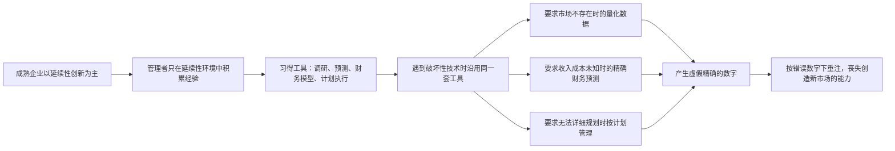
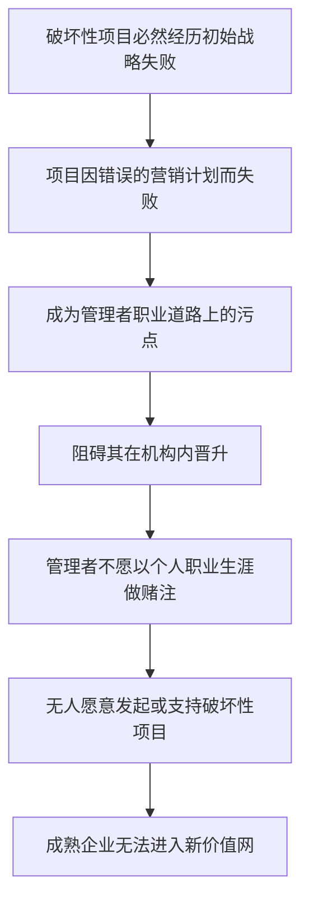

> 章节：第七章“发现新的新兴市场”<br>
> 作者：克莱顿·克里斯坦森（Clayton M. Christensen）<br>
> 笔记目标：按原书小节顺序还原“为什么新兴市场不可预测、错误预测如何毁掉好项目、应当用什么方法替代传统规划”的完整论证，解释预测误差口径、案例数据、公式推导与适用边界。

## 一、本章的问题与核心命题

### 1.1 问题从哪里来

第六章证明：在破坏性技术中必须率先进入新兴市场，成功率相差约 6 倍。但这立刻引出一个尖锐的实操问题：

> 如果新兴市场根本不存在，企业凭什么决定进入？凭什么说服投委会？凭什么做预算？

第七章正面回答这个问题，给出的答案在字面上就很反常识：

> **你无法对尚不存在的市场进行分析——供应商和消费者应一道来探索这些未知市场。**

作者进一步强化了措辞：破坏性技术的市场应用领域**不仅是未知的（unknown），还是不可知的（unknowable）**。

### 1.2 两个词的严格区分

这个区分是全章的理论基石，必须讲清楚：

| 概念 | 严格定义 | 应对方式 |
|---|---|---|
| **未知（unknown）** | 信息客观存在，只是我们尚未掌握 | 增加调研投入即可获得 |
| **不可知（unknowable）** | 信息尚未产生，因为决定它的行为还没发生 | 只能通过行动创造信息 |

新兴市场属于第二类：客户自己都还不知道会怎么用这个产品，因此**再多的市场调研也问不出答案**——你要问的那个"答案"此刻还不存在于任何人的头脑中。

这解释了为什么加大调研力度不但无效，还可能有害：它会产生一个看似精确、实则虚构的数字，并诱导企业按这个数字下重注。

### 1.3 由此推出的核心命题

$$
\text{破坏性创新的战略与计划}=\textbf{学习和发现的计划},\quad\text{而非}\ \textbf{执行的计划}
$$

作者强调这一点"非常重要"，理由是：**自认为通晓市场未来的管理者所采取的规划和投资策略，与承认市场充满不确定性的管理者所采取的策略，存在根本不同。**同样一笔钱，前者用来建单一大产线，后者用来建模块化小产能；前者把特性做死，后者留可拆改接口。

### 1.4 管理者为何会犯这个错误：经验的结构性偏差

作者指出了一个容易被忽略的成因——**优秀管理者的创新经验几乎全部来自延续性技术**，因为成熟企业开发的大多数技术在本质上都是延续性的。

按定义，延续性创新针对的是**能基本掌握消费者需求的已知市场**。在这种环境下，有计划地研究评估、开发和营销不仅可行，而且是成功关键。

于是形成一个偏差链条：



原书对营销职能的批评尤为具体：**大多数市场营销人员在大学里和工作岗位上被反复灌输"要倾听消费者的意见"，但几乎没有人接受过"如何发现尚不存在的市场"的理论或实践培训。**

这是一种能力上的**不对称**：企业在"服务已知客户"上极其专业，在"发现未知客户"上近乎空白。而后者恰恰是破坏性创新唯一需要的能力。

### 1.5 本章的论证结构

作者用三组证据依次论证，且证据的性质逐层递进：

1. **统计证据**（硬盘行业）：专业预测机构对延续性市场的预测误差在 7%~8% 以内，对破坏性市场的误差高达 265%、550%——证明这不是能力问题，而是可预测性问题。
2. **失败案例**（惠普 Kittyhawk）：一个技术上完全成功、按最佳实践执行的项目，因为"相信自己的预测"而彻底失败。
3. **成功案例**（本田、英特尔）：两家公司的初始理念都是错的，却因保留了转向的资源而成功——证明关键不在"预测对"，而在"错得起"。

## 二、对延续性技术和破坏性技术市场的预测

### 2.1 为什么用《磁盘/趋势报告》做检验对象

要证明"破坏性市场不可预测"，最有力的方式不是找一个预测失败的例子，而是找一个**在同等条件下对另一类市场预测得极准**的机构。这样才能排除"预测者水平不行"这一竞争性解释。

《磁盘/趋势报告》（Disk/Trend Report，加州山景城）正是理想对象，其数据质量在商业研究中极为罕见：

- 逐年列举**全球所有企业**自 1975 年起上市的**每一种**硬盘型号；
- 记录每种型号的首次上市时间、性能规格、所用组件技术；
- 全球每一家生产商都主动提供销售型号及客户购买类型的数据；
- 编辑整理后得出各细分市场规模，并公布市场份额（同时防止泄漏专有数据）；
- 每版都公布上一年各细分市场的实际销量与销售额，并对每类产品**未来 4 年**作展望。

因为厂商认为这份报告极有价值，所以持续贡献专有数据——这形成了良性循环，使数据完整度远超一般行业。更关键的是：**拥有 20 年行业数据，读者可以用后来的历史去检验当年的预测**，这是一个天然的预测准确性实验室。

### 2.2 图 7.1 的构造与读法
> **原书图示**：首款新型硬盘驱动器上市后的前4年：延续性技术与破坏性技术的比较
图 7.1 比较的是：每种新型硬盘上市后**前 4 年的预测销售总量**与**同期实际销售总量**。

为便于横向比较，作者做了归一化处理：

- **预测柱**统一定为 **100**（图中标为"销售量指数"）；
- **实际柱**表示为相对于预测的百分比。

五种被预测的硬盘按创新类型分为两组：

| 硬盘类型 | 创新类型 | 判定依据 |
|---|---|---|
| 2.5 英寸 | 延续性 | 与上一代销往**同一个价值网** |
| 14 英寸温切斯特 | 延续性 | 与上一代销往**同一个价值网** |
| 5.25 英寸 | 破坏性 | 推动了**新价值网**产生 |
| 3.5 英寸 | 破坏性 | 推动了**新价值网**产生 |
| 1.8 英寸 | 破坏性 | 推动了**新价值网**产生 |

（原书注明：《磁盘/趋势报告》没有单独发布对 8 英寸硬盘的预测。）

### 2.3 结果：两类市场的预测精度差了一个数量级

| 硬盘类型 | 创新类型 | 预测误差 | 方向 |
|---|---|---:|---|
| 2.5 英寸 | 延续性 | **8% 以内** | — |
| 14 英寸温切斯特 | 延续性 | **7% 以内** | — |
| 5.25 英寸 | 破坏性 | **265%** | 实际远超预测 |
| 3.5 英寸 | 破坏性 | **35%** | 实际超出预测 |
| 1.8 英寸 | 破坏性 | **550%** | 预测远超实际 |

### 2.4 误差口径的严格辨析（关键但易被忽略）

原书这三个百分比使用了**不同的比较基准**，若不辨清会误读图表。让我们严格定义。设预测值为 $F$、实际值为 $A$：

**定义一：以预测为基准的比率**

$$
r=\frac{A}{F}
$$

**定义二：以实际为基准的超预测倍数**

$$
r'=\frac{F}{A}
$$

对照图中柱高：

- **5.25 英寸**：实际柱约为 265，预测柱为 100，即 $r=2.65$。含义是**实际销量是预测的 2.65 倍**——严重**低估**。
- **1.8 英寸**：实际柱约为 15，预测柱为 100。若按 $r'-1=5.5$（即 550%）理解，则 $r'=6.5$，$A=100/6.5\approx15.4$，与图中柱高吻合。含义是**预测比实际高出 550%**——严重**高估**。
- **3.5 英寸**：原书标注 35%，并注明"实际上是个非常接近的值"，即三个破坏性预测中误差最小的一个。

**为什么必须辨清**：因为**两个方向相反的错误无法用同一个修正系数补救**。如果误差总是低估，企业只需把预测乘以一个安全系数；但 5.25 英寸低估、1.8 英寸高估，说明误差**没有系统性方向**，因而**不可校正**。这比"预测不准"严重得多——它意味着你连错误的方向都不知道。

**用对数比率获得对称度量**：为使正负偏差可比较，可采用

$$
\varepsilon=\ln\frac{A}{F}
$$

该度量的优点是对称：低估 2 倍与高估 2 倍的绝对值相同（$\ln 2$ 与 $-\ln 2$）。代入各值：

| 硬盘类型 | $r=A/F$ | $\varepsilon=\ln r$ |
|---|---:|---:|
| 14 英寸温切斯特 | 1.07 | $+0.068$ |
| 2.5 英寸 | 1.08 | $+0.077$ |
| 3.5 英寸 | 1.35 | $+0.300$ |
| 5.25 英寸 | 2.65 | $+0.975$ |
| 1.8 英寸 | 0.154 | $-1.871$ |

延续性技术的 $|\varepsilon|$ 均小于 0.08，破坏性技术的 $|\varepsilon|$ 最高达 1.87——相差**超过 20 倍**。并且符号有正有负，印证了误差无方向性。

### 2.5 根本原因：方法本身没错，是前提失效了

这是本节最重要的推论。原书明确指出：《磁盘/趋势报告》的工作人员**采用完全相同的方法**预测两类技术：

- 采访主要客户；
- 咨询行业专家；
- 进行趋势分析；
- 建立经济模型。

同样的团队、同样的方法、同样的数据渠道，对延续性技术准确，对破坏性技术"遭遇了重大的失败"。

这构成了一个近乎实验设计的对照：**方法被控制为常量，唯一的变量是创新类型。**因此结论只能是——问题不在方法，而在方法的**适用前提**。

**形式化说明前提失效的机制**：传统预测的本质是从已知客户集合外推：

$$
\hat{D}_{t+k}=f\big(D_{t},D_{t-1},\ldots;\ \mathcal{C}_{t}\big)
$$

其中 $D$ 为需求，$\mathcal{C}_t$ 为当前客户集合，$f$ 为外推函数（趋势分析、访谈加权、经济模型等）。

该式成立的**关键假设**是**客户集合的稳定性**：

$$
\mathcal{C}_{t+k}\approx\mathcal{C}_{t}
$$

- **延续性技术**：未来买家就是今天的买家，假设成立，因此 $f$ 有效，误差落在 7%~8%。
- **破坏性技术**：新价值网意味着

$$
\mathcal{C}_{t+k}\cap\mathcal{C}_{t}\approx\varnothing
$$

即未来的买家**不在**今天被访谈的名单里。此时无论访谈多少现有客户、建多精细的模型，都是在对错误的总体做抽样——这是**抽样框错误**，而非抽样误差，增加样本量完全无法改善。

原书用最典型的一例点明这一点：**1.8 英寸硬盘是第一代主要应用领域不在计算机市场的硬盘驱动器**——而《磁盘/趋势报告》的全部数据来源都是计算机行业的厂商与客户。它对 1.8 英寸的预测误差最大（550%），恰恰因为真正的市场（如便携式心脏监护装置）根本不在其观测范围内。

### 2.6 边界与局限

诚实地看，这组证据也有其限度：

1. 样本仅 5 个预测对象，其中延续性 2 个、破坏性 3 个，统计功效有限。
2. 3.5 英寸误差 35%，虽远大于延续性的 7%~8%，但绝对水平尚可接受，说明破坏性预测并非**必然**离谱。
3. 4 年预测窗口是特定选择；若窗口更短或更长，误差幅度会变化。
4. 结论适用于"预测新兴市场规模"，不能推广为"任何关于破坏性技术的判断都不可靠"——例如技术改善轨道的可预测性就相对较高（见第一、三章）。

## 三、为惠普公司的 1.3 英寸 Kittyhawk 硬盘驱动器寻找市场

这是全书最富教育意义的失败案例之一，因为它**几乎每一步都符合教科书的最佳实践**，却彻底失败。

### 3.1 背景与目标设定

| 项目 | 数据 |
|---|---|
| 时间 | 1991 年 |
| 部门 | 惠普磁盘存储部（DMD），爱达荷州博伊西 |
| DMD 收入 | 约 **6 亿美元** |
| 惠普母公司市值 | 约 **200 亿美元** |
| 产品 | 1.3 英寸、20MB 硬盘，代号 Kittyhawk |
| 高管要求 | **3 年内收入达 1.5 亿美元** |

对惠普而言这是突破性尝试：此前 DMD 做过的最小硬盘是 3.5 英寸，而且惠普"几乎是行业中最后一个推出 3.5 英寸硬盘的公司"。**Kittyhawk 是惠普首次尝试引领破坏性技术。**

**用第六章的框架审视这个目标**：1.5 亿美元相对于 DMD 的 6 亿美元收入，占比

$$
\frac{1.5}{6}=25\%
$$

即要求这个全新项目在 3 年内贡献相当于部门现有收入四分之一的增量。按初始定价 250 美元计算，所需年销量为

$$
\frac{1.5\times10^{8}}{250}=600{,}000\ \text{台}
$$

这个目标本身就把项目推向了"必须押注一个大市场"的位置——**第六章的规模匹配问题，在这里成为第七章预测灾难的起点。**两章的机制在此交汇：正因为机构太大，项目才不敢做小；正因为不敢做小，才必须相信一个宏大的预测。

### 3.2 惠普做对了什么（这才是案例的价值所在）

必须强调：Kittyhawk 团队的做法在延续性创新的标准下**近乎完美**：

1. **找到了看似完美的目标市场**：便携式掌上电脑（PDA）市场正在兴起。
2. **做了市场预测**，结论是能达成收入目标。
3. **聘请专业市场研究公司**验证，对方进一步证实市场潜力巨大。
4. **与行业顶级客户深度共创**：与摩托罗拉、AT&T、IBM、苹果、微软、英特尔、NCR 及若干创业公司高管建立良好关系；这些企业都在 PDA 上投入巨资。
5. **双向设计耦合**：许多客户产品设计中能看到 Kittyhawk 的影子，而 Kittyhawk 的设计也反映了这些客户经充分市场调研得出的需求。
6. **技术执行到位**：12 个月完成开发；首款 20MB，一年后推出 40MB。
> **原书图示**：惠普的Kittyhawk硬盘驱动器
7. **针对目标市场需求做了专门设计**：为满足 PDA 和电子笔记本的耐用性要求，加装**碰撞传感器**（功能相当于汽车气囊碰撞传感器），使产品从 **3 英尺**高处落到水泥地面也不丢数据。
8. 初始定价 **250 美元/件**。

**这份清单是全章最重要的反直觉证据**：如果失败源于调研不够、客户不够高端、技术不过关或执行不力，那么补救办法很明确。但惠普这些都做到了极致，仍然失败——说明问题出在**方法论的适用性**，而不是执行质量。

### 3.3 实际发生了什么

**第一层意外：目标市场没有出现。**PDA 市场未能长大，苹果牛顿及其他竞品销量均低于预期（与第六章的牛顿案例互为印证）。前两年 Kittyhawk 只实现预计销量的一小部分。

作者在此插入了一个极具穿透力的对比：

> 创业型企业和风险投资家可能会对这个销售量感到满意，但对于惠普公司的管理层来说，这个销售量远远低于预期，而且根本无法满足 DMD 对于增长和扩大市场份额的需求。

**同一份销售数据，在不同规模的组织里得到相反评价**——这与第六章牛顿（14 万台，是 Apple II 的 3.3 倍，却被判失败）的逻辑完全一致。

**第二层意外：真实需求来自完全没预料到的地方。**贡献销量最大的应用领域**根本不在计算机行业**：

- 日语便携式文字处理器
- 迷你现金出纳机
- 电子摄影机
- 工业用扫描器

原书特别注明：**这些应用领域均未出现在 Kittyhawk 的原始市场营销计划中。**

**第三层意外：真正的破坏性市场姗姗来迟，却已无力承接。**在上市两周年前夕，大型游戏机系统生产商前来询问：能否以更低价格生产另一型号？如可以则计划大量采购。他们坦言——**在过去两年一直在关注 Kittyhawk，"花了好长时间才弄清楚这么小的存储设备的用途"。**

这句话是全章的点睛之笔：它直接证明了"不可知"命题——**连潜在客户自己都需要两年才想明白该怎么用这个产品。**任何在产品上市前进行的调研，都不可能从这些客户口中问出答案，因为答案当时在他们脑中也不存在。

### 3.4 致命的定位错配：Kittyhawk 其实是一次延续性创新

作者给出了一个精妙的重新分类，这是理解失败根源的关键：

> 从很大程度上说，惠普公司设计的 Kittyhawk 硬盘驱动器是对移动计算机技术的一次**延续性创新**。

论据是：在移动计算领域看重的多数指标上——体积小、重量轻、能耗低、耐用性好——Kittyhawk 相对此前的 2.5 英寸和 1.8 英寸硬盘做了**非连续性的延续性改进**。唯一的缺陷是容量（惠普在这方面"走了极端"）。

而最终真正涌现的订单属于**真正的破坏性产品**，其需求参数完全不同：

| 参数 | Kittyhawk 实际设计 | 破坏性市场需要 | 差距 |
|---|---:|---:|---:|
| 单价 | 250 美元 | 约 50 美元 | **5 倍** |
| 容量 | 20MB / 40MB | 10MB 最理想 | 过剩 2~4 倍 |
| 功能 | 碰撞传感器等高端特性 | 功能有限即可 | 过度设计 |
| 结构 | 高端组件、复杂结构 | 简单、通用 | 成本结构错配 |

这里出现了一个**双重悖论**：

1. 惠普以为自己在做破坏性创新（这是它首次尝试引领破坏性技术），实际做的是延续性创新（沿移动计算的既有属性轨道极致优化）。
2. 它为一个不存在的高端市场做了过度设计，因而恰恰无法服务真正出现的低端破坏性市场。

结果：由于已为 PDA 目标投入大量资金，管理层"已经失去了耐心，而且也没有资金来重新设计一种更为简单的、一般化的 1.3 英寸硬盘"。**1994 年底，惠普撤回 Kittyhawk。**

### 3.5 项目经理的复盘：本章最重要的一段自述

惠普项目经理事后承认，最严重的错误是：

> **想当然地认为他们对市场的预测是正确的，而不是假定预测是错误的。**

具体体现在两处不可逆的承诺：

1. 按 PDA 销量预测**大举投资生产能力建设**；
2. 在详尽调研后**融入了他们认为至关重要的设计特点**（如碰撞传感器）。

他们的反思是：这样的规划和投资是延续性技术变革中的成功关键，但**对 Kittyhawk 这样的破坏性产品并不适用**。

若有机会重来，他们会：

- 先假定"**无论是他们自己或其他任何人，都无法确定消费者想要什么，或者产品销量能达到多少**"；
- 采取**更具探索性、更加灵活**的产品设计和生产能力投资方法；
- 在市场上摸着石头过河，**预留足够资源**，以备根据所学重新调整方向。

这三条正是后文"发现驱动型规划"的实践版本。

### 3.6 量化推导：为什么"模块化产能"优于"单一大产线"

原书指出，惠普与生产伙伴西铁城公司投入大量资金建设并安装了一条**高度自动化的单一生产线**，其前提假设是 PDA 客户的销量预测正确；若假设"没有人知道 PDA 能卖多少"，就应当建设**小型产能模块**，以便随关键事件验证假设而增减产量。

这个建议可以严格证明其合理性。**建立模型**：

设总产能投资为 $I$。

- **方案 A（单一大产线）**：期初一次性投入 $I$，享受规模经济。
- **方案 B（模块化）**：期初只投入 $I/n$（$n$ 为模块数），待需求验证后再投入其余部分；但因失去规模经济，后续扩产的单位成本上升，惩罚系数为 $\delta>0$。

设需求兑现（即预测正确、需要全部产能）的概率为 $p$。

**方案 A 的期望成本**：无论需求是否兑现，$I$ 都已沉没：

$$
E[C_A]=I
$$

**方案 B 的期望成本**：期初必付 $I/n$；仅在需求兑现时（概率 $p$）追加剩余产能 $I-I/n$，且需支付惩罚：

$$
E[C_B]=\frac{I}{n}+p\left(I-\frac{I}{n}\right)(1+\delta)
$$

**求模块化占优的条件** $E[C_B]<E[C_A]$：

$$
\frac{I}{n}+p\left(I-\frac{I}{n}\right)(1+\delta)<I
$$

两边同除以 $I$，并令 $m=\dfrac{1}{n}$（$0<m<1$）：

$$
m+p(1-m)(1+\delta)<1
$$

移项：

$$
p(1-m)(1+\delta)<1-m
$$

因 $1-m>0$，两边同除以 $(1-m)$：

$$
p(1+\delta)<1
$$

得到**判定条件**：

$$
\boxed{\ p<\frac{1}{1+\delta}\ }
$$

**结论的含义**：这个条件极其干净——它**与模块数 $n$ 无关**，只取决于两个量：预测兑现的概率 $p$ 与失去规模经济的成本惩罚 $\delta$。

**数值演算**：

| 规模惩罚 $\delta$ | 阈值 $\dfrac{1}{1+\delta}$ | 解读 |
|---:|---:|---|
| 10% | 90.9% | 除非九成把握，否则应模块化 |
| 20% | 83.3% | 除非八成以上把握，否则应模块化 |
| 50% | 66.7% | 除非三分之二把握，否则应模块化 |
| 100% | 50.0% | 除非把握过半，否则应模块化 |

以 $\delta=20\%$ 为例：只有当管理层对预测的信心**超过 83%** 时，单一大产线才更划算。而对一个尚不存在的市场，任何超过 83% 的信心都是幻觉。**惠普的错误因此在数学上是可判定的，而不只是事后诸葛。**

**符号与假设逐项说明**：

| 符号 | 含义 | 依赖的假设 |
|---|---|---|
| $I$ | 达到目标产能的总投资 | 两方案最终产能相同 |
| $n$ | 模块数量 | 产能可分割且模块可独立运行 |
| $m=1/n$ | 期初承诺比例 | — |
| $p$ | 预测兑现概率 | 二值化简化：需求要么全兑现要么不需要 |
| $\delta$ | 失去规模经济的成本惩罚率 | 惩罚与规模呈线性关系 |

**适用边界**：

1. 模型把需求简化为"全有或全无"两态；现实中需求是连续分布，需改用积分形式 $E[C]=\int C(q)f(q)\,dq$。
2. 忽略了时间价值与延迟扩产的**机会成本**——若市场爆发而产能跟不上，可能丧失先发优势（这与第六章的领先价值相冲突，需权衡）。
3. 假设模块化技术上可行；某些工艺（如晶圆厂、高炉）存在最小经济规模，无法任意分割。
4. 未计入模块化带来的管理复杂度与协调成本。

即便有这些简化，核心洞察依然稳健：**不确定性越高，越应把大额不可逆承诺拆成一串小额可逆承诺。**

## 四、本田公司对北美摩托车行业的冲击

### 4.1 两个版本的历史：叙事陷阱

作者用一个精彩的对比开场。本田征服北美摩托车市场的经历，**经常被引用为清晰的战略思维与积极统一的战略执行完美结合的范例**：

> 本田主动采取基于经验曲线的生产战略——降低价格、增加产量、大幅削减成本、进一步降价、进一步削减成本，建立不可动摇的低成本制造优势；然后凭此向高端市场转移，最终将几乎所有知名摩托车制造商淘汰出局，连硕果仅存的哈雷和宝马也大伤元气。同时把生产优势与合理的产品设计、极具创意的广告和覆盖极广的分销零售网结合起来。

**但当时任业务经理的本田员工讲述的是完全不同的版本。**

这个对比本身就是一个重要的方法论警示：**成功的事后叙事天然会被整理成"深思熟虑的战略"，因为这样才符合读者对因果的期待。**真实过程中的偶然、误判和被动调整会在复述中被系统性地抹掉。管理者若照着这类整理过的故事学习，学到的是幻象。

### 4.2 真实过程的完整时间线

| 时间 | 事件 |
|---|---|
| 战后 | 日本一贫如洗，本田成长为小型耐用摩托车供应商 |
| — | 主要客户：拥堵城市地区的经销商和零售商，用于向本地消费者运送小体积货物 |
| — | 在小型高效发动机设计上积累大量经验 |
| 1949 | 日本市场年销 **1 200 辆** |
| 1959 | 日本市场年销 **285 000 辆** |
| 1959 | 高管欲利用低劳动力成本出口北美 |
| — | 研究表明：美国摩托车主要作**长途交通工具**，对体积、功率、速度要求特别高 |
| — | 工程师专为北美设计快速大功率摩托车 |
| 1959 | 派 **3 名员工**赴洛杉矶推销大功率摩托车 |

日本市场的增长幅度为：

$$
\frac{285{,}000}{1{,}200}=237.5\ \text{倍}
$$

对应 10 年间的复合增长率：

$$
g=\left(237.5\right)^{1/10}-1=e^{\frac{\ln 237.5}{10}}-1=e^{0.5470}-1\approx72.8\%
$$

这说明本田在国内是一家极其成功、增长惊人的公司——**它带着真实的成功经验和真实的能力进入北美，却依然完全判断错了市场。**这排除了"本田当时还不成熟"的解释。

### 4.3 灾难性的开局

三名员工为节省生活成本合租一间公寓，每人带一辆"超级幼兽"（Super Cub）以节省市内交通费——**这个纯粹出于节约的细节，后来决定了公司的命运。**

初期营销极不顺利：

- 除成本外，产品**无法提供任何性能优势**；
- 大多数摩托车经销商拒绝接受未经市场检验的产品；
- 好不容易说服少数经销商、卖出几百辆，却带来灾难性后果。

技术失败的原因值得注意：本田的发动机设计适用于城市短途配送，**并不适用于需要长时间高速行驶的公路摩托车**。长时间高速行驶导致：

- 发动机裂开、漏油；
- 离合器严重磨损。

**日本与洛杉矶之间空运包换摩托车的费用几乎拖垮了整个公司。**

这里有一个深刻的技术教训：**能力是任务特定的。**本田在"小型高效发动机"上的世界级能力，在"长时间高负荷运转"这一不同任务上完全不适用。这与第八章将讨论的"能力存在于流程与价值观中"一脉相承。

### 4.4 转机：一次纯粹偶然的发现

| 步骤 | 事件 |
|---|---|
| 1 | 北美业务主管**川崎喜八郎**因烦闷，某周六骑"超级幼兽"到洛杉矶东部山林兜风 |
| 2 | 在泥路上骑行后**感觉神清气爽**，几周后再次前往 |
| 3 | 邀请两位同事一同骑"超级幼兽"到野外 |
| 4 | **邻居和路人主动询问**在哪儿能买到这种可爱的小摩托车 |
| 5 | 三人提出帮忙从日本特别订购 |
| 6 | 这种摩托车后来被广泛称为**越野轻型摩托车** |

请注意这个发现的性质：**它不是任何调研、规划或战略推演的产物。**它源于三个人为省钱而骑的通勤车，在一次纯属排遣情绪的兜风中被旁观者看见。任何事前的市场研究方法论都不可能捕捉到它。

这正是"不可知"的具象化：这个市场在被创造出来之前，**在物理上不存在于任何数据源中**。

### 4.5 组织的抵抗：错过西尔斯

即便信号已经出现，本田仍然抵抗了很久：

> 有一次，一名**西尔斯公司**的采购员希望能够为公司的**户外动力设备部门**订购"超级幼兽"，但**本田公司忽视了此次机遇**，并希望继续专注于销售大型大功率越野摩托车，这个战略仍然没有取得成功。

这个细节极其重要，它揭示了**发现新市场的障碍不只是认知，还有承诺**：

- 认知上，公司已有"小车受欢迎"的信号；
- 但组织已在大型摩托车战略上投入了资源、声誉和心力；
- 于是主动送上门的大客户（西尔斯）被忽视。

注意西尔斯是从**户外动力设备部门**（而非摩托车部门）来采购的——这本身就是一个强烈的价值网信号：新市场的买家会从你意想不到的部门、以你意想不到的用途找上门来。而正因为它不符合既有分类，才更容易被忽略。

### 4.6 战略转向与新价值网的建立

最终，越来越多的人希望拥有自己的小型"超级幼兽"与朋友在野外飙车——这与本田美国团队最初预计的市场**截然不同**。经过"一番唇枪舌剑的内部辩论"，洛杉矶团队说服了日本的高级管理层。

> 尽管公司的大型摩托车战略注定将以失败告终，但本田公司**意外地发现了一个截然不同的好机遇**，并由此创造了一个全新的市场领域。

**转向后的新挑战——渠道**：小型摩托车战略正式采纳后，洛杉矶团队发现说服经销商销售"超级幼兽"比说服他们卖大型摩托车**难得多**，因为**当时市场上没有一家零售商在销售这种类型的产品**。最终他们说服了几家**体育用品经销商**——注意，不是摩托车经销商。

这是价值网理论的又一次印证：新价值网需要**新渠道**，而新渠道往往在旧行业分类之外。

**广告的偶然性**：本田当时没有资金进行周密的广告宣传。转机是——

- 一名 UCLA 学生与朋友在野外飙车时想到一句广告语"本田好生活"（英文原句为 "You meet the nicest people on a Honda"，此为背景补充）；
- 他把这句话用在广告课程论文里；
- 受老师鼓舞，将理念卖给一家广告机构；
- 广告机构说服本田采用，并为本田赢得一项广告大奖。

作者随即给出了必要的平衡：**这些偶然事件的背后，是真正世界级的设计工艺和制造执行系统**，正是有了这个坚实后盾，本田才能不断提高质量、增加产量、降低售价。

**这个平衡非常重要，不能误读为"运气就够了"**：偶然性决定了**方向**（做什么市场），能力决定了**能否兑现**（做成什么样）。缺任何一个都不成。

### 4.7 破坏性的判定与后续上移

本田的 50cc 摩托车对北美市场是一种**破坏性技术**，判定依据完全符合本书标准：

> 本田消费者在作出购买决定时所依据的**产品属性排序**，决定了本田建立的价值网**完全有别于**哈雷、宝马等传统厂商竞争的成熟价值网。

随后是熟悉的上移路径：从低成本耐用摩托车起步，**1970 至 1988 年推出一系列发动机功率更强大的摩托车**，向高端转移——"采用的战略让人联想到本书前几章提到的硬盘驱动器、钢铁、挖掘机和零售业新兴企业对高端市场的冲击"。

### 4.8 哈雷的反击为何失败：渠道价值网的锁定

哈雷的应对及其失败，为第二章的价值网理论提供了一个新维度的证据：

| 时间 | 哈雷的行动 | 结果 |
|---|---|---|
| 60 年代末—70 年代初 | 收购意大利 Aeromecchania 的小发动机（150~300cc）生产线，扩展低端 | — |
| — | 试图通过北美经销商网络销售 | **经销商施加阻力** |
| 70 年代初 | 放弃小型摩托车生产线，重新聚焦高端 | 战略性撤退 |

**关键在于失败原因**：原书明确指出，**本田在小发动机摩托车上的生产能力明显高于哈雷**，但导致哈雷未能在小型摩托车价值网建立优势的**主要原因还是在于哈雷经销商网络所施加的阻力**。

经销商抵制的两个理由：

1. 高端摩托车销售的**利润率高得多**；
2. 许多经销商认为小型摩托车会**损害哈雷在核心消费者心目中的地位**。

作者由此把第二章的发现推进了一步：

> 第二章曾提到，在一个特定的价值网内，硬盘企业和其计算机生产商客户各自发展了非常相似的经济模式或成本结构，从而决定了它们判定哪些业务最有利可图的方式。**我们在这里又看到了同一种现象。**在价值网内，哈雷经销商的经济模式导致它们经常会与哈雷一起看好同一种业务。**它们共存于同一个价值网，因而不管是哈雷还是其经销商都很难从底部退出这一价值网。**

这是一个重要的理论扩展：**价值网的锁定不仅来自客户，也来自渠道。**即使制造商本身想向下走，其分销体系的利润结构也会形成同等强度的阻力。哈雷的撤退"让人联想到希捷在硬盘市场的重新定位，以及缆索挖掘机企业和综合性钢铁厂向高端市场的战略性撤退"——第四章的"左上牵引力"在此再次出现，且驱动力来自渠道。

### 4.9 本田自己的预测同样离谱

作者最后补上一记：本田对北美市场潜在规模的预测同样与实际相差甚远。

| 时点 | 市场规模 | 年增长率 | 本田的目标/结果 |
|---|---:|---:|---|
| 1959（预测） | 55 万辆/年 | 5% | 计划抢占 10% 份额 |
| 1975（实际） | **500 万辆/年** | **16%** | 大部分应用领域不在预测范围内 |

**数值演算**：若按 1959 年的预测（55 万辆、年增 5%），16 年后市场应为：

$$
550{,}000\times(1.05)^{16}
$$

计算指数项：$\ln 1.05=0.04879$，乘以 16 得 $0.7806$，故 $(1.05)^{16}=e^{0.7806}\approx2.183$。

$$
550{,}000\times2.183\approx1{,}200{,}000\ \text{辆}
$$

而实际为 500 万辆，是预测轨迹的：

$$
\frac{5{,}000{,}000}{1{,}200{,}000}\approx4.2\ \text{倍}
$$

实际的 16 年平均复合增长率为：

$$
g=\left(\frac{5{,}000{,}000}{550{,}000}\right)^{1/16}-1=\left(9.09\right)^{1/16}-1
$$

$\ln 9.09=2.207$，除以 16 得 $0.1379$，故 $g=e^{0.1379}-1\approx14.8\%$——约为预测值 5% 的 **3 倍**。

**这个演算的意义**：本田是这个市场的**创造者**，拥有最完整的一手信息，尚且把规模低估了 4 倍多、增长率低估了 3 倍。这有力地说明：**预测误差不是信息不足造成的，而是新市场本身的性质造成的。**连创造市场的人都算不准，遑论旁观者。

## 五、英特尔公司是如何发现微处理器市场的

### 5.1 传奇转型的背景

| 时间 | 事件 |
|---|---|
| 1969 | 英特尔成立，开创性地用 MOS 技术生产**世界上第一个 DRAM 集成电路** |
| 1978—1986 | 在日本半导体厂商猛烈冲击下**逐渐丧失 DRAM 领先优势** |
| — | 从二线 DRAM 企业成功转型为**全球最大微处理器生产商** |
| 1995 | 已发展为世界上利润最高的大型企业之一 |

问题是：英特尔是如何做到的？

### 5.2 微处理器的诞生：一次合同的副产品

原始微处理器是英特尔**按照与一家日本计算器生产商签订的合同开发计划**做出来的。项目结束时：

- 按合同条款，**专利权归这家日本厂商所有**；
- 英特尔的**工程团队**（注意：不是高管）劝说公司高管把专利权买回来；
- 英特尔当时**并没有为这种新型微处理器制订明确的市场开发战略**；
- 做法是：**只是将芯片卖给任何能用到这种产品的人**。

最后这一条与本田早期"卖给任何愿意购买其产品的人"（第二章）以及第一代 5.25 英寸硬盘厂商的做法完全一致。**这不是缺乏战略，而是在不可知条件下唯一合理的战略。**

### 5.3 微处理器为何是破坏性技术

原书给出明确判定：

> 虽然今天微处理器无疑是一种主流产品，但它在刚刚出现时还是一种破坏性技术。相对于大型计算机复杂的逻辑电路（在 20 世纪 60 年代相当于计算机的中央处理器），**微处理器的功能非常有限**。但微处理器**体积小、结构简单，而且能以较低的价格实现逻辑和计算操作，而这在以前是不可能实现的**。

完全符合破坏性技术的标准形态：主流指标（功能/性能）更差 + 新属性（小、简单、便宜）+ **使此前不可能的应用成为可能**。

### 5.4 关键机制：资源分配流程自动完成了战略转型

这是本节最具理论价值的部分，也是全书对"资源分配决定战略"这一命题最纯粹的证明。

事实链条：

1. 70 年代 DRAM 市场竞争日趋激烈，英特尔 **DRAM 收入的利润率开始下滑**；
2. 微处理器产品**竞争压力相对较小**，利润率持续强劲增长；
3. 英特尔的产能分配体系规则是：**按照每种产品类型实现的毛利率大小来按比例分配产能**；
4. 于是该体系**"悄无声息地"**开始将投资资本和生产能力从 DRAM 转移到微处理器；
5. **"在这一过程中，管理层的决策并没有发挥明显的作用。"**
6. 更具讽刺意味的是：**即使在资源分配流程逐渐将资源退出 DRAM 时，英特尔高级管理层仍为 DRAM 产品倾注了大量时间和精力。**

第 5、6 两点合起来构成了对传统战略观的直接反驳：**公司的实际战略由资源分配规则决定，而非由高管的注意力决定。**高管在开会讨论 DRAM，而公司在事实上变成一家微处理器公司。

### 5.5 产能分配规则的形式化与最优性证明

英特尔的分配规则可以精确建模，这有助于理解它为何会自动产生战略转移。

**问题设定**：设有 $k$ 种产品，产品 $i$ 的单位毛利为 $m_i$，市场需求上限为 $d_i$，总产能为 $K$。分配量为 $q_i$。目标是最大化总毛利：

$$
\max_{q_1,\ldots,q_k}\ \sum_{i=1}^{k}m_iq_i
$$

$$
\text{s.t.}\quad \sum_{i=1}^{k}q_i\le K,\qquad 0\le q_i\le d_i
$$

**贪心算法**：

```text
将产品按 m_i 从大到小排序
remaining = K
for i in 排序后的产品列表:
    q_i = min(remaining, d_i)
    remaining = remaining - q_i
    if remaining == 0: break
```

**最优性证明（交换论证）**：设存在最优解 $q^{*}$ 不满足贪心性质，即存在产品 $a,b$ 满足 $m_a>m_b$、$q^{*}_a<d_a$ 且 $q^{*}_b>0$。构造新解：把 $\epsilon=\min(d_a-q^{*}_a,\ q^{*}_b)>0$ 的产能从 $b$ 转移给 $a$：

$$
q'_a=q^{*}_a+\epsilon,\qquad q'_b=q^{*}_b-\epsilon
$$

新解仍满足所有约束（总量不变、上下界不破），而目标函数变化为：

$$
\Delta=m_a\epsilon-m_b\epsilon=(m_a-m_b)\epsilon>0
$$

这与 $q^{*}$ 的最优性矛盾。故最优解必然满足贪心性质。证毕。

**关键推论**：该规则**局部最优且完全理性**——它在每一期都最大化当期毛利。正因为它无可指摘，才没有任何人有理由质疑它。而它产生的战略后果（退出 DRAM、转向微处理器）是**涌现的**，不是任何人决策的。

**这个机制的双面性**（本书的核心张力在此显露得最清楚）：

| 情形 | 毛利率排序指向 | 结果 |
|---|---|---|
| 英特尔（本例） | 微处理器毛利更高 | **幸运**：自动转向了正确的新业务 |
| 硬盘/钢铁/挖掘机（前几章） | 高端产品毛利更高 | **不幸**：自动放弃了低端破坏性市场 |

**同一条规则，因新业务恰好落在毛利率的高端还是低端，导致截然相反的命运。**这正是原书那句"给英特尔公司带来了好运"的深意——英特尔的成功在这一点上带有运气成分，不能作为通用方法照搬。绝大多数破坏性技术的毛利率**低于**主流业务，此时同一规则会把它们扼杀。

**适用边界**：该模型假设产能同质可自由调配、毛利率外生给定、无跨产品协同或学习效应、无长期战略价值项。现实中若某低毛利产品具有战略期权价值（如占据未来大市场的入口），纯毛利率排序会系统性低估它。

### 5.6 即便如此，英特尔仍然看不清应用领域

原书用两个具体事实说明，连英特尔这样敏锐的管理层也无法预知微处理器的主要应用：

**事实一**：联合创始人兼董事会主席**戈登·摩尔**回忆，IBM 选择英特尔 **8088** 微处理器作为新型个人电脑的"大脑"，在英特尔内部被视为一个**"设计上的小胜利"**。

——这是 PC 时代最重要的商业决定之一，当时被评价为"小胜利"。

**事实二**：即便在 IBM 个人电脑取得巨大成功**之后**，英特尔内部在预测下一代 **286** 芯片的潜在应用领域时，**也没有把个人电脑列入预测的销售额最大的 50 种应用清单**。

第二个事实比第一个更惊人：它说明**即使新市场已经用事实证明了自己，组织的预测体系仍可能识别不出它**。这不再是"事前不可知"，而是"事后仍看不见"——预测框架本身的盲区。

原书的总结冷峻而准确：

> 现在回想起来，将微处理器应用到个人电脑上实在是一件水到渠成的事，但在激烈的竞争中，即便是像英特尔这样敏锐的管理层也无法预知，在微处理器可能出现的多种应用领域中，究竟哪种会成为最重要、能实现最大销售额和利润的应用领域。

**"现在回想起来水到渠成"** 正是**后见之明偏差**（hindsight bias）的教科书定义：事件发生后，人们会觉得它本来就是可预见的。这种偏差会让管理者高估自己预测下一个新市场的能力——这是本章最需要警惕的认知陷阱。

## 六、成熟企业面临的不可预见性和向下游市场移动的难度

### 6.1 一条可依赖的法则

面对规划困难，一些管理者的本能反应是**更加努力地工作、更加合理地规划**。作者指出这"与破坏性技术的特性背道而驰"，并给出一条**确定性的法则**：

> 在所有有关破坏性技术的不确定因素中，管理者总是可以遵循这样一条法则，即：**专家的预测总是错误的。**

以及由此得出的**重要推论**：

> 由于破坏性技术市场具有不可预测性，**企业在最初进入这些市场时所采取的战略通常都是错误的。**

这个推论看似消极，实则是本章最有建设性的部分——因为它把管理任务从"如何预测对"转换为"如何在必然预测错的前提下仍然成功"。这是完全不同的问题，有完全不同的解法。

### 6.2 悖论：既然战略必错，为何进入者反而更成功？

作者立即提出了自己理论的内部张力——这是严谨论证的标志：

> 这一陈述与表 6.1 中的发现（进入新兴价值网的企业 **37%** 与进入当前价值网的企业 **6%** 取得成功的事后概率之间存在极大差异）到底在多大程度上相互吻合？**如果市场不能预先进行预测，那么计划开发这些市场的企业如何才能取得更大的成功呢？**

这个问题的答案就是接下来两节的内容（失败的理念 vs 失败的业务）。此处先记住问题的形式：

$$
\text{初始战略必错}\ +\ \text{进入者成功率反而高}\ \Rightarrow\ \text{成功必然不依赖初始战略的正确性}
$$

### 6.3 管理者为什么不相信这个数据

作者报告了一个真实的观察：当他把表 6.1 的矩阵展示给管理者时，他们"都特别惊讶于取得成功的数量和概率方面的差异"，但——

> **管理者都不认为这些结果适用于他们自己的情况。**这些发现违背了人们对创造新市场的直观感受——创造新市场是一种真正有风险的行为。

### 6.4 认知科学解释：特沃斯基与卡尼曼的风险感知偏差

原书在脚注中给出了极有价值的理论支撑。**阿莫斯·特沃斯基**和**丹尼尔·卡尼曼**的研究表明：

> 人们通常会把**他们不了解的事物的风险性放大**（不管它们的内在风险到底有多大），并将**他们确实了解的事物的风险性缩小**（同样不管它们的内在风险到底有多小）。

应用到本问题上，形成一个双向错配：

| 对象 | 内在风险（客观） | 感知风险（主观） | 偏差方向 |
|---|---|---|---|
| 创造新市场 | 较低（成功率 37%） | **高**（因为不了解尚不存在的市场） | 高估 |
| 投资延续性技术 | 较高（成功率 6%） | **低**（因为了解市场需求） | 低估 |

**严格表述**：设客观风险为 $R$，感知风险为 $\hat{R}$，熟悉度为 $f$，则偏差可写作：

$$
\hat{R}=R\cdot\phi(f),\qquad \phi'(f)<0
$$

即感知风险是客观风险乘以一个**随熟悉度递减**的放大因子。当 $f$ 很低时 $\phi(f)>1$（放大），当 $f$ 很高时 $\phi(f)<1$（缩小）。

（此式为帮助理解而作的形式化表达，非原书公式。）

**这个洞察的实践价值**：它告诉我们，**管理者对新市场的抗拒不是理性计算的结果，而是认知偏差的产物。**因此，用更多数据说服他们往往无效——因为数据不改变熟悉度。有效的做法是**降低进入的代价**，使抗拒不再具有决定性（这正是后文"学习计划"的思路）。

## 七、失败的理念与失败的业务之间的比较

### 7.1 本章最关键的区分

作者用一句话解开了 6.2 节的悖论：

> **在理念的失败和企业的失败之间存在一个巨大的差异。**

| 概念 | 严格定义 | 性质 | 应对 |
|---|---|---|---|
| **失败的理念** | 关于"谁是客户、如何使用、市场多大"的具体假设被证伪 | **不可避免、且必要** | 快速廉价地暴露它 |
| **失败的业务** | 组织耗尽资源或信用，无法再进行下一次尝试 | **可避免、且致命** | 保留转向能力 |

**核心命题**：破坏性创新的成功，不在于避免理念失败（那不可能），而在于**防止理念失败升级为业务失败**。

### 7.2 用三个案例做对照检验

作者立即用本章的三个案例验证这一区分，形成一个完美的对照组：

| 企业 | 初始理念 | 是否失败 | 资源是否耗尽 | 最终结果 |
|---|---|---|---|---|
| **英特尔** | 关于微处理器应用领域的许多理念都是错的 | 是 | **否**——"并没有集中所有的资源来固执地坚持错误的市场营销计划" | **成功**：多次从一开始便犯错，但"最后都得以安然度过" |
| **本田** | 认为北美需要大型大功率摩托车 | 是 | **否**——"并没有倾其所有来实施大型摩托车战略" | **成功**：能在市场真正出现后**大举投资正确的战略** |
| **惠普 Kittyhawk** | 认为主要市场是 PDA | 是 | **是**——"坚信自己已经找到了正确的战略，斥巨资进行产品设计和生产能力的开发" | **失败**：当终极应用领域终于浮出水面时，**已经没有资源来抓住这次机遇** |

**这三行构成了一个近乎实验设计的对照**：三家公司的初始理念**全部错误**（变量被控制为常量），唯一的差异是**是否把资源全部押在初始理念上**，而结果截然相反。

这就严格回答了 6.2 节的悖论：**进入新兴市场的企业成功率高，不是因为它们预测得准，而是因为进入新兴市场的正确姿势本身就包含"允许犯错"。**

### 7.3 创业研究的佐证

原书引用研究结论：

> 绝大多数成功的新兴企业都在开始实施最初的计划、并了解到哪些计划行之有效、哪些只是纸上谈兵时，**放弃了最初的商业战略**。

并给出判定成功的真正标准：

> 成功企业与失败企业的主要差别通常**并不在于它们最初的战略有多么完美**。在初始阶段分析什么是正确的战略，**其实并不是取得成功的必要条件**；更重要的是**保留足够的资源**（或是与值得信赖的支持者或投资者建立良好的关系），这样，新业务项目便能在**第二次或第三次尝试**中找到正确的方向。

以及失败的定义：

> **那些在能够调转航向、转而采用可行的战略之前便用尽了资源或信用度的项目，就是失败的项目。**

请注意这个定义的精确性：失败不是"方向错了"，而是"在能改正之前就没资源了"。

### 7.4 量化推导：为什么"多次尝试"优于"一次重注"

原书"第二次或第三次尝试"的说法可以严格量化，这个推导能让直觉变成可计算的决策依据。

**建立模型**：设每次尝试独立成功的概率为 $q$，每次尝试消耗资源 $c$，总可用资源为 $B$。则可进行的尝试次数为：

$$
n=\left\lfloor\frac{B}{c}\right\rfloor
$$

各次尝试独立时，**至少成功一次**的概率为 1 减去全部失败的概率：

$$
P(\text{成功})=1-(1-q)^{n}
$$

**数值演算**（取 $q=0.3$，即单次尝试成功率仅三成）：

| 尝试次数 $n$ | 计算 | 成功概率 |
|---:|---|---:|
| 1 | $1-0.7^{1}$ | **30.0%** |
| 2 | $1-0.7^{2}=1-0.49$ | **51.0%** |
| 3 | $1-0.7^{3}=1-0.343$ | **65.7%** |
| 4 | $1-0.7^{4}=1-0.2401$ | **76.0%** |

**关键对比**：假设把全部预算 $3c$ 押在**一次**尝试上。即使这能把单次成功率从 30% **提升到 50%**（这是很慷慨的假设——更多资源用于一个错误方向往往并不提高成功率），结果仍然是：

$$
50\%\ <\ 65.7\%
$$

**一次大注（50%）不如三次小注（65.7%）。**

**推广**：设集中投入能把成功率提升到 $q_{\text{集中}}$，则分散优于集中的条件为：

$$
1-(1-q)^{n}>q_{\text{集中}}
$$

即

$$
q_{\text{集中}}<1-(1-q)^{n}
$$

**假设与边界**（必须说明，否则会误用）：

1. **独立性假设**：各次尝试相互独立。现实中往往**更好**——前一次失败提供的信息会提高后一次的 $q$（贝叶斯更新），使多次尝试的优势被**低估**。
2. **成功率不随投入显著提升**：若某领域投入与成功率强相关（如需要跨越硬性技术门槛的项目），集中投入可能更优。
3. **无时间窗口约束**：若市场窗口短暂，多次串行尝试可能来不及——这与第六章的先发优势形成张力，需权衡。
4. **每次尝试成本相同**：现实中后续尝试因复用资产可能更便宜（进一步利好分散）。
5. 忽略了失败的**声誉成本**——这正是下一节的主题。

**回看惠普**：Kittyhawk 团队把资源投在一次尝试上（$n=1$），且该次尝试的方向恰好是错的。当正确方向（游戏机市场）浮现时，$B$ 已耗尽，$n_{\text{剩余}}=0$，成功概率归零。**这不是运气不好，而是结构上注定的。**

## 八、失败的理念与失败的管理者之间的比较

### 8.1 从组织层面下沉到个人层面

第七节说的是"业务应当留有余地"，但即使公司层面有余地，**个人层面往往没有**。这是一个更难解决的障碍。

> 在大多数企业里，**管理者个人没有资本进行反复尝试**，以寻求正确的战略。**不管是对还是错**，大多数机构的管理者都认为他们不能失败。

注意"不管是对还是错"这个限定——作者不评判这种感知是否符合公司的正式政策，因为**感知本身就足以改变行为**。

### 8.2 阻力形成的完整链条



原书的结论是：

> 由于**失败是为破坏性技术寻找新市场的必经之路**，管理者不能或者不愿拿他们的个人职业生涯来做赌注的事实也构成了一股强大的阻力，妨碍了成熟企业进入由这些技术创造的价值网。

**这里存在一个结构性冲突**：

$$
\text{组织需要}:\ \text{允许试错} \qquad\text{vs}\qquad \text{个人需要}:\ \text{避免失败}
$$

只要个人考核不改变，组织层面的"鼓励创新"就是空话。

### 8.3 鲍尔的研究与本书发现的互证

作者引用约瑟夫·鲍尔关于一家主要化工企业资源分配流程的经典研究：

> **"来自市场的压力使犯错的概率和成本都有所降低。"**

这句话初读晦涩，含义是：当有明确的市场需求（即客户已经明确表达需要什么）时，做错事的概率下降，而且即使做错，代价也较小——因为需求真实存在，方向大体正确。反之，没有市场压力指引时，犯错概率与代价都高。

作者指出这与硬盘行业的发现"基本一致"，并给出对称的两句话：

| 条件 | 企业行为 |
|---|---|
| **能够确认创新需求**（延续性技术） | 知名领先企业能够**长期投入巨额风险资金**，开发市场或客户所要求的**任何**技术 |
| **无法确定创新需求**（破坏性技术） | 成熟企业**甚至无法开展技术上较为简单的项目**来对这种创新进行商业化推广 |

这个对比再次排除了"能力不足"和"风险厌恶"的解释：能投巨资做难项目的企业，做不了简单项目——差别只在于需求是否确定。

### 8.4 由此解释进入策略的分布

原书用这个机制解释表 6.1 中的一个数字：

> 这也就是为什么 **65% 的进入硬盘驱动器行业的企业都试图进入成熟市场而非新兴市场**的原因。

**核对**：按表 6.1，进入成熟市场 51 家、新兴市场 32 家，总计 83 家：

$$
\frac{51}{83}\approx61.4\%
$$

与正文的 65% 略有出入（可能因统计口径或版本差异），但结论方向一致：**近三分之二的进入者选择了成功率仅 6% 的成熟市场，而非成功率 37% 的新兴市场。**

这是一个集体性的非理性选择，而其成因恰恰是**个体层面的理性**：对个人而言，在成熟市场失败是"可解释的失败"，在新兴市场失败是"愚蠢的赌博"。

原书的收尾一针见血：

> 发现新兴市场的过程**必将是一个与失败为伍的过程**，大多数决策者都发现，他们很难下定决心去支持一个可能会因为没有市场而最终失败的项目。

## 九、学习计划与实施计划的比较

这是全章的方法论落脚点，给出了替代传统规划的完整方案。

### 9.1 两类计划的严格区分

| 维度 | 实施计划（延续性技术） | 学习计划（破坏性技术） |
|---|---|---|
| **顺序** | 计划**先于**行动 | **必须在制订详尽计划前采取行动** |
| **对预测的态度** | 预测应当准确 | 预测必然错误 |
| **客户意见** | 非常可靠 | 无法回答尚不存在的用途 |
| **计划的目的** | 指导执行、协调资源 | **获取信息、消除不确定性** |
| **成功路径** | 认真规划、积极实施 | 边行动边学习、准备转向 |
| **衡量标准** | 实际 vs 计划的差距 | 关键假设是否被验证或证伪 |

原书表述：

> 在延续性技术创新中，**认真规划、积极实施是通往成功的阳光大道**。但在破坏性技术变革中，**必须在制订详尽计划前采取行动**。由于对市场需求或市场规模知之甚少，**计划必须服务于一个非常不同的目的，它们必须是学习计划，而不是实施计划。**

### 9.2 学习计划的核心操作：信息优先级排序

作者给出了具体做法：

> 在开展破坏性业务时，**时刻铭记市场应用领域是不可知的**，管理人员就能判断出哪些是寻找新市场的最重要的信息，并能对信息的重要性进行**排序**。项目和业务计划应反映出这些优先顺序，这样，**在需要投入大量资本、时间和资金时，就能拼凑出关键的信息片断，或解决重要的不确定因素。**

**形式化这个排序规则**：设项目依赖假设集合 $\{H_1,\ldots,H_k\}$，其中假设 $H_i$：

- 为假的概率为 $P(\neg H_i)$；
- 若在大额投入**之后**才发现为假，损失为 $L_i$；
- 提前验证它的成本为 $c_i$。

则验证优先级可定义为：

$$
\text{Priority}_i=\frac{P(\neg H_i)\cdot L_i}{c_i}
$$

**含义**：优先验证那些**最可能错、错了代价最大、而验证又最便宜**的假设。

**代入 Kittyhawk**：

| 假设 | $P(\neg H)$ | $L$（错了的损失） | $c$（验证成本） | 优先级 |
|---|---|---|---|---|
| PDA 市场会长大 | 高（新市场） | 极大（全部产能+设计） | 低（可小批量试探） | **极高** |
| 客户需要碰撞传感器 | 中 | 大（推高成本） | 低（可选配测试） | 高 |
| 20MB 是合适容量 | 高 | 大（错失低端） | 低（可做多规格） | 高 |
| 技术上能做出 1.3 英寸硬盘 | 低（惠普有把握） | 中 | 高（须实做） | 低 |

惠普恰恰把 12 个月和大量资源投在了**优先级最低**的假设（技术可行性）上，而把优先级最高的市场假设当作已知条件。这是资源配置的完全倒置。

### 9.3 发现驱动型规划

**严格定义**：

> **发现驱动型规划要求管理者提出一些假设，并根据这些假设来制订业务计划或设定业务目标。**

它与传统规划的根本区别在于：传统计划把预测当作**输入条件**，发现驱动型计划把预测当作**待验证的假设**，并要求明确写出"要让这个计划成立，什么必须为真"。

**原书给出的两个具体反事实推演**（这是理解该方法的最佳材料）：

**推演一：产能投资**

| 实际做法 | 隐含假设 | 若改用发现驱动型 |
|---|---|---|
| 惠普与西铁城投入大量资金建设**高度自动化的单一生产线** | 假设"PDA 目标消费者对 Kittyhawk 的销量预测是正确的" | 若假设"**没有人知道** PDA 能卖多少"，则应建设**小型产能模块**，以便在关键事件验证假设真伪时**保持、增加或降低产量** |

（其数学依据已在 3.6 节严格证明：当 $p<\dfrac{1}{1+\delta}$ 时模块化必然占优。）

**推演二：产品设计**

| 实际做法 | 隐含假设 | 若改用发现驱动型 |
|---|---|---|
| 采用**高端组件和复杂产品结构**，大幅提高售价 | 假设"主要应用领域是对耐用性要求高的 PDA" | 应创造**模块化设计**，使产品可随市场验证而**重新配置或去掉某些特色**，以应对不同市场和价格需求 |

原书总结这一方法的核心价值：

> 发现驱动型规划将迫使项目团队**在投入导致事情无法挽回的巨额资金前对市场假设进行测试**。

关键词是"**无法挽回**"（irreversible）。方法的本质是：**推迟不可逆承诺，直到不确定性下降。**

### 9.4 传统管理体系的反作用：为什么会漏掉"意外的成功"

这是本节最微妙也最有洞察力的部分。作者指出，**目标管理**（MBO）和**例外管理**这两项基本管理原理，因其引导注意力的方式，**经常阻碍了对新市场的发现**：

> 一般来说，在性能未能达到计划要求时，这些体系会鼓励管理层填补计划性能与实际性能之间的缺口。也就是说，**这些体系专注于出乎意料的失败**。

**问题在于**：

> 但本田公司在北美摩托车市场的经历表明，**破坏性技术市场经常会伴随着始料未及的成功而出现，而这方面的许多规划体系并没有引起高级管理层的关注。**

**用偏差方向来理解**：设实际结果 $A$ 与计划 $F$ 的偏差为 $\Delta=A-F$。

| 偏差 | 传统体系的反应 | 破坏性信号 |
|---|---|---|
| $\Delta<0$（意外失败） | **触发警报**、分析原因、制订补救 | 通常无关 |
| $\Delta>0$（意外成功） | 视为好消息，**不触发任何调查** | **恰恰是新市场的信号** |

传统管理体系是一个**单边过滤器**：它只对负偏差敏感。而破坏性市场的出现表现为**正偏差**——某个没人重视的产品在某个没人预期的地方卖得意外地好。

**回看三个案例，全部符合这一模式**：

- **本田**：为省钱骑的通勤车意外受欢迎——这不是任何计划中的指标；
- **英特尔**：微处理器毛利率意外走高——被产能分配规则自动响应，但高管仍在关注 DRAM；
- **惠普**：日语文字处理器、迷你收银机、电子摄影机、工业扫描器的意外订单——**未出现在原始营销计划中**，因而在体系内无处归类。

作者给出的应对方法极为具体：

> 这样的发现经常伴随着**观察人们如何使用产品**，而不是**听取人们表示他们将如何使用产品**而出现。

$$
\text{观察行为（behavior）}\ \succ\ \text{询问意图（stated intention）}
$$

原因很清楚：意图受限于人的想象力，而行为受限于现实。对于"不可知"的用途，人们说不出来，但**会做出来**。

### 9.5 Intuit 的例证：意外成功如何被正确捕获

原书在脚注中给出一个完整的正面案例（第九章详述）：

| 步骤 | 事件 |
|---|---|
| 1 | Intuit 发现，许多购买 **Quicken** 个人财务管理软件的顾客是**小型企业** |
| 2 | 它们购买的目的实际上是**给公司记账**——这是 Intuit **没有预料到**的应用领域 |
| 3 | Intuit **调整产品功能**，使软件更符合小企业需求 |
| 4 | 推出 **QuickBooks** |
| 5 | 推出后**两年内**抢占小企业会计软件市场**超过 70%** 的份额 |

这个案例是 9.4 节原则的完美示范：Intuit 观察到的是**行为异常**（个人理财软件被企业购买），而非客户陈述的需求。若只做用户访谈问"你需要什么功能"，个人用户不会说出企业记账需求。

### 9.6 不可知营销：概念的严格定义

作者为这套方法命名：

> 我将这种发现破坏性技术新兴市场的方法命名为"**不可知营销**"（agnostic marketing）。

**定义**：根据这种方法进行市场营销必须遵循这样一个明确的假设——

> **没有人**——不论是我们，还是我们的消费者——**能够在真正使用之前了解破坏性产品是否能够投入使用、怎样使用，或者使用量有多大。**

**"不可知"（agnostic）一词的精确含义**：这里借用了认识论术语，指的**不是"不知道"（ignorant），而是"主张此事在当前无法被知晓"**。二者的行动含义完全不同：

| 立场 | 主张 | 行动 |
|---|---|---|
| 无知（ignorant） | 我不知道，但答案存在 | 去调研、去问专家 |
| 不可知（agnostic） | 现在**无人能知**，答案尚未产生 | 去行动、去创造信息 |

这正是 1.2 节"未知 vs 不可知"区分的收束。**不可知营销之所以叫"营销"，是因为它仍是一套系统方法，只是把"获取答案"的手段从"询问"换成了"投放并观察"。**

### 9.7 与第六章的衔接：为什么不能等别人先试

作者预判了一种自然的反应并予以否定：

> 一些面临这种不确定性的管理人员更倾向于**在其他公司切实找到相关市场之后再行进入**。但考虑到**破坏性技术的领先者能够建立起巨大的先发优势**，面临破坏性技术创新的管理者应**走出实验室和跟踪调研小组调研，利用发现驱动型方法进入市场，直接了解有关新消费者和新应用领域的知识。**

这段话把第六、七两章严密地扣在一起，形成完整的行动逻辑：

$$
\underbrace{\text{必须早进入}}_{\text{第六章：先发优势 37\% vs 6\%}}\ +\ \underbrace{\text{但无法预知市场}}_{\text{第七章：不可知}}\ \Rightarrow\ \underbrace{\text{以学习为目的低成本进入}}_{\text{发现驱动型规划}}
$$

**"走出实验室和跟踪调研小组"**这一表述值得特别注意：它同时否定了两种常见的替代方案——

- **实验室**：代表技术导向，以为把产品做得更好就能找到市场（惠普的错误）；
- **跟踪调研小组**（focus group）：代表市场导向，以为问得更细就能找到需求（同样是惠普的错误）。

两者都是在**室内**寻找答案，而答案只存在于**市场中的真实使用行为**里。

## 十、三个案例的交叉比较

把本章三个案例并置，可以看到极其清晰的因果结构：

| 维度 | 惠普 Kittyhawk | 本田 | 英特尔 |
|---|---|---|---|
| **初始理念** | PDA 是主市场 | 北美要大功率公路摩托 | 微处理器无明确市场 |
| **理念是否错误** | 是 | 是 | 部分（无理念也就无所谓对错） |
| **调研质量** | 极高（专业机构+顶级客户共创） | 有（研究了美国用途） | 几乎没有 |
| **初始承诺规模** | **极大**（单一自动化产线+高端设计） | 小（3 人+合租公寓） | 小（卖给任何人） |
| **发现真实市场的途径** | 客户主动上门（已太晚） | 偶然骑行被路人看见 | 毛利率信号自动引导 |
| **发现时的剩余资源** | **无** | 有 | 有 |
| **是否有能力转向** | 否 | 是 | 是（自动完成） |
| **结果** | 1994 年撤回 | 创造并主导新市场 | 成为全球最大微处理器厂商 |

**从这张表可以读出的核心规律**：

1. **调研质量与成功无关**——惠普调研最好，结果最差。
2. **初始承诺规模与成功负相关**——承诺越小，存活越久，越可能等到真实市场。
3. **发现途径全部是"非计划"的**——三家公司的真实市场都不是通过正式流程找到的。
4. **决定成败的唯一变量是"发现时是否还有资源"**。

用一个不等式概括本章的实践含义：

$$
\text{成功}\ \Longleftrightarrow\ \text{真实市场浮现的时刻}\ <\ \text{资源耗尽的时刻}
$$

管理的任务因此变成两条：**加快左边**（用低成本试探加速发现）、**推迟右边**（用小额分期承诺延长跑道）。惠普两条都做反了。

## 十一、易混淆概念与常见误解

### 11.1 “不可预测就是不能规划”

不对。作者反对的是**实施计划**，而非一切计划。发现驱动型规划要求更严谨的思考——必须显式列出假设、排定验证优先级、设计验证方式。它比拍脑袋预测**更需要纪律**，只是纪律用在了不同的地方。

### 11.2 “只要调研做得够好就能预测新市场”

不对。惠普请了专业市场研究公司，与摩托罗拉、AT&T、IBM、苹果、微软、英特尔、NCR 的高管深度共创，结果误差最大。原因是**抽样框错误**：被访者不是未来的客户。增加样本量无法修正抽样框错误。

### 11.3 “预测总是偏保守，乘个系数就行”

不对。图 7.1 显示 5.25 英寸被严重**低估**（实际是预测的 2.65 倍），1.8 英寸被严重**高估**（预测是实际的 6.5 倍）。**误差没有系统性方向**，任何固定修正系数都会在一半情况下加剧错误。

### 11.4 “本田和英特尔的成功是靠运气，不可学习”

只对了一半。可学习的部分是**结构**而非**运气**：两家公司都**没有把资源押在初始理念上**，因而当运气来临时**接得住**。惠普同样可能遇到好运（游戏机厂商确实找上门了），但接不住。**运气是随机的，接住运气的能力是可设计的。**

### 11.5 “英特尔的毛利率分配规则值得照搬”

危险。该规则在英特尔奏效，是因为微处理器的毛利率**恰好高于** DRAM。而绝大多数破坏性技术的毛利率**低于**主流业务（见第四章），此时同一规则会自动扼杀它们。**同一条规则在不同情境下产生相反后果**，照搬前必须先判断新业务落在毛利率光谱的哪一端。

### 11.6 “学习计划意味着可以不设目标、随便试”

不对。学习计划有明确的产出要求：**识别关键假设、排定优先级、设计低成本验证、设定继续或转向的判据**。它比实施计划更需要显式思考，因为无法依赖既有惯例。

### 11.7 “Kittyhawk 失败是因为技术不行”

不对。技术完全按计划完成（12 个月，20MB→40MB，抗 3 英尺跌落）。失败源于**为错误市场做了正确产品**，且**在发现真实市场时已无资源重做**。

### 11.8 “把 Kittyhawk 降价卖给游戏机厂商就行了”

不可行。250 美元 vs 50 美元的差距不是定价问题，而是**成本结构问题**——高端组件和复杂结构已经固化在设计里。真正需要的是"更为简单的、一般化的 1.3 英寸硬盘"，即**重新设计**。而这需要资源，资源已经耗尽。这印证了 9.3 节"模块化设计"建议的价值。

### 11.9 “意外的成功不需要管理关注”

恰恰相反。传统管理体系只对**意外失败**报警，而破坏性市场的信号是**意外成功**。本田的转机、Intuit 的 QuickBooks、惠普收到的日语文字处理器订单，全部是正偏差。**应当为正偏差也建立复核机制。**

## 十二、方法的有效性、局限与替代方案

### 12.1 论证为何有力

1. **控制变量的自然实验**：《磁盘/趋势报告》用**同一团队、同一方法**预测两类技术，误差相差一个数量级，排除了"预测者能力不足"的解释。
2. **反面案例极强**：惠普按最佳实践做到极致仍失败，排除了"执行不力"的解释。
3. **对照组设计**：三个案例的初始理念**全部错误**，唯一差异是资源承诺方式，结果截然不同——近乎实验设计。
4. **正面案例来自不同行业**：摩托车（消费品）、微处理器（半导体）、硬盘（部件），跨行业增强外部效度。
5. **理论自洽**：主动提出并回答了"战略必错为何进入者反而成功"的内部张力（6.2 节）。
6. **有认知科学支撑**：特沃斯基与卡尼曼的风险感知偏差解释了管理者为何拒绝接受数据。
7. **有可操作的替代方案**：不停留于批评，给出发现驱动型规划与不可知营销。

### 12.2 局限

1. **预测样本小**：图 7.1 只有 5 个对象（2 延续性、3 破坏性），统计功效有限。
2. **案例选择偏差**：本田与英特尔是著名成功者，同样"保留资源、允许试错"却仍失败的公司未被系统统计。保留资源是成功的**必要条件**，本章证据不足以说明它是**充分条件**。
3. **"专家的预测总是错误的"表述过强**：3.5 英寸误差 35%，虽大但并非离谱；这是启发式法则而非严格规律。
4. **回溯访谈的可靠性**：本田员工的"真实版本"同样是事后回忆，可能矫枉过正——从"过度理性化"摆向"过度偶然化"。真相可能在两者之间。
5. **"资源耗尽"缺乏可操作阈值**：多少算"足够资源"？原书未给出判据，实践中难以事前判断。
6. **与第六章存在张力**：第六章强调必须早进入以获先发优势，本章强调分期试错；若市场窗口短暂，两者会冲突，原书未充分讨论如何权衡。
7. **组织成本未计**：模块化产能、模块化设计、多次尝试都会增加协调成本与复杂度，这些在模型中被忽略。
8. **时代局限**：案例集中于 1959—1994 年。数字时代的 A/B 测试、灰度发布、云弹性产能大幅降低了试错成本，使"发现驱动"更易实施，但也可能催生"过度试错、缺乏长期承诺"的新问题。

### 12.3 替代与补充方案

| 方法 | 与本章的关系 | 适用场景 |
|---|---|---|
| **实物期权定价** | 为"保留转向能力"提供严格估值 | 需量化不确定性价值时 |
| **精益创业 / MVP** | 本章思想的现代工程化版本 | 软件、消费互联网 |
| **A/B 测试与灰度发布** | 大幅降低试错成本 | 数字产品 |
| **领先用户法（von Hippel）** | 补充"观察行为"的具体技法 | 有活跃改装用户的市场 |
| **待完成工作理论（JTBD）** | 作者后期发展，聚焦"用户雇佣产品完成什么任务" | 定义新市场边界 |
| **情景规划（Scenario Planning）** | 用多情景替代单点预测 | 宏观不确定性高的长周期决策 |
| **贝叶斯序贯决策** | 为"边学边投"提供数学框架 | 可量化先验与似然时 |
| **公司风险投资（CVC）** | 用少数股权观察新价值网 | 需注意第五章指出的局限 |

## 十三、面向实践的分析模板

**第一步：判定不确定性类型**

1. 未来客户是否就是今天的客户？若否，则任何基于现有客户的预测都无效。
2. 这个用途在物理上是否已经存在？还是必须被创造出来？
3. 判定结论：**未知（可调研）** 还是 **不可知（须行动）**？

**第二步：显式列出假设**

4. 写出"要让这个计划成立，什么必须为真"——市场规模、客户身份、可接受价格、关键功能、渠道。
5. 对每条假设标注 $P(\neg H)$、$L$、$c$，按 $\dfrac{P(\neg H)\cdot L}{c}$ 排序。
6. 检查：**投入最大的环节，是否对应优先级最高的假设？**（惠普在此完全倒置。）

**第三步：设计可逆的承诺**

7. 估计规模惩罚 $\delta$，计算模块化阈值 $\dfrac{1}{1+\delta}$。
8. 诚实评估对预测的信心 $p$。若 $p<\dfrac{1}{1+\delta}$，**必须**采用模块化产能。
9. 产品设计是否模块化？能否随市场反馈**增减特性**而不重做？
10. 定价与成本结构是否锁死？能否覆盖低端价格点？

**第四步：保留跑道**

11. 单次尝试成本 $c$ 是多少？总预算 $B$ 能支持几次尝试 $n=\lfloor B/c\rfloor$？
12. 计算 $1-(1-q)^{n}$，与"一次重注"的成功率比较。
13. 明确写下：**第二次、第三次尝试的资源从哪里来？**

**第五步：建立发现机制**

14. 是否有观察真实使用行为的渠道（而非仅访谈）？
15. 是否为**意外的成功**建立了复核机制，而不只是为意外失败报警？
16. 谁在监测"非目标客户的异常订单"？（惠普的日语文字处理器订单本应是最高级别的信号。）

**第六步：处理个人激励**

17. 项目负责人若因初始理念被证伪而"失败"，职业后果是什么？
18. 能否把考核标准从"是否达成收入目标"改为"是否高效消除了关键不确定性"？
19. 是否明确区分了"**理念失败**"（应奖励快速证伪）与"**业务失败**"（应问责资源挥霍）？

**第七步：设定判据**

20. 什么证据出现时**加倍投入**？什么证据出现时**转向**？什么证据出现时**停止**？
21. 这些判据是否**事先**写下并达成共识？

## 十四、本章总结

第七章解决了第六章遗留的实操难题：既然必须率先进入新兴市场，而新兴市场又无法预测，企业该怎么办？

**第一层：确立不可知命题。**新兴市场的应用领域不仅**未知**，而且**不可知**——因为决定它的使用行为尚未发生。《磁盘/趋势报告》用同一套方法预测两类技术，延续性误差 7%~8%，破坏性误差 265%、550%，且方向相反、无法用系数修正。根本原因是传统预测隐含"客户集合稳定"（$\mathcal{C}_{t+k}\approx\mathcal{C}_t$）的假设，而破坏性技术恰恰使 $\mathcal{C}_{t+k}\cap\mathcal{C}_t\approx\varnothing$，构成**抽样框错误**而非抽样误差。

**第二层：证明高质量执行救不了错误方法。**惠普 Kittyhawk 请专业机构调研、与七家顶级客户共创、12 个月完成技术开发、按目标市场加装碰撞传感器——每一步都是延续性创新的最佳实践，结果彻底失败。真实需求来自日语文字处理器、迷你收银机、电子摄影机、工业扫描器，以及两年后才想明白用途的游戏机厂商（要 50 美元、10MB）。而此时 250 美元的高端设计已无法调整，资源也已耗尽。

**第三层：揭示成功的真实机制。**本田带着日本市场 10 年 237.5 倍增长的成功经验进入北美，理念完全错误（大功率公路摩托），甚至忽视了主动上门的西尔斯；英特尔连自家 286 芯片的前 50 大应用清单里都没列入个人电脑。但两者都**没有把资源押在初始理念上**，因而在真实市场浮现时**接得住**。三个案例的初始理念全部错误，唯一的差异是资源承诺方式——这构成了近乎实验设计的对照。

**第四层：给出替代方法。**核心是区分**失败的理念**（不可避免且必要）与**失败的业务**（可避免且致命）：

$$
\text{成功}\ \Longleftrightarrow\ \text{真实市场浮现的时刻}\ <\ \text{资源耗尽的时刻}
$$

由此推出三条可计算的操作原则：

- **模块化产能**：当且仅当 $p<\dfrac{1}{1+\delta}$ 时占优。取 $\delta=20\%$，则信心低于 83% 就必须模块化——对不存在的市场，没有人配拥有 83% 的信心。
- **多次小注优于一次重注**：$q=0.3$ 时，三次尝试成功率 65.7%，远高于把预算集中到一次即便能提升至 50% 的水平。
- **优先验证最贵的假设**：按 $\dfrac{P(\neg H)\cdot L}{c}$ 排序，而惠普把资源投在了优先级最低的技术可行性上。

**最后一层：识别体系性盲区。**目标管理与例外管理只对**意外失败**报警，而破坏性市场的信号是**意外成功**——本田的通勤车、Intuit 的企业用户、惠普的日语文字处理器订单都是正偏差。因此必须**观察人们如何使用产品，而不是听取人们表示他们将如何使用产品**。

本章最值得记住的一句话是作者对"不可知营销"的界定：**没有人——不论是我们，还是我们的消费者——能够在真正使用之前了解破坏性产品是否能够投入使用、怎样使用，或者使用量有多大。**承认这一点不是放弃管理，而是把管理的对象从"预测的精度"转向"犯错的成本"。
