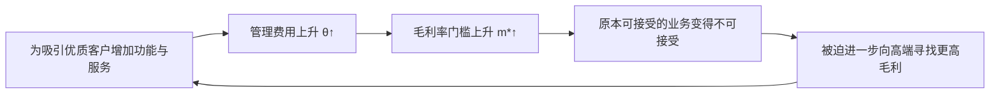
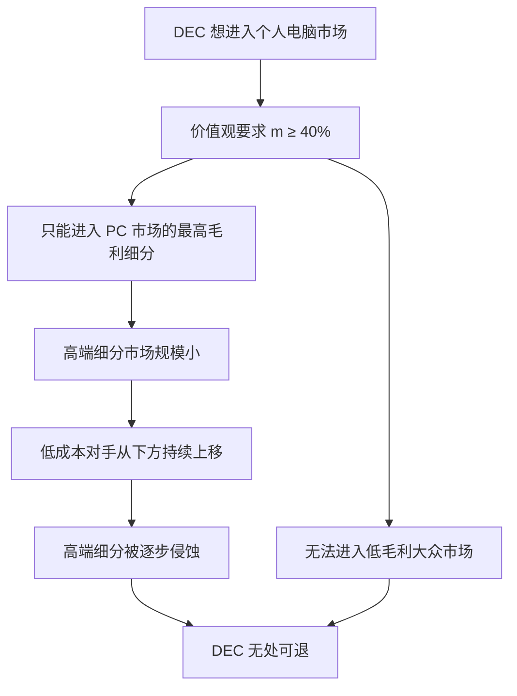

> 章节：第八章“如何评估机构的能力与缺陷”<br>
> 作者：克莱顿·克里斯坦森（Clayton M. Christensen）<br>
> 笔记目标：按原书小节顺序还原 RPV 框架的完整逻辑，解释资源、流程、价值观三者的严格定义与演化规律，推导收购整合与组织设计的判定规则，并说明适用边界。

## 一、本章的问题与定位

### 1.1 问题从哪里来

第五、六、七章给出了三条经验性建议：把破坏性项目交给存在客户需求的机构（第五章）、让机构规模与市场规模匹配（第六章）、用学习计划代替实施计划（第七章）。

但这些都是**经验观察**——作者反复看到"成功应对破坏性技术的企业，往往都为破坏性机遇专门创立了规模相当的独立机构"，却还没有解释**为什么必须如此**。

本章的目标由作者明确点出：

> 本章的目标是阐述第五章、第六章和第七章所提到的**经验主义观察背后所隐含的理论**。

因此第八章在全书结构中是**理论收束章**：它把前三章的操作建议提升为一个统一的解释框架。

### 1.2 一个普遍的管理盲区

作者从一个日常场景切入。管理者安排人员做创新项目时，会本能地把**任务要求**与**候选人能力**做匹配，考察其知识、判断力、技能、洞察力、精力，以及价值观（员工在行动中取舍所遵循的标准）。

> 事实上，衡量管理者的能力的标准就是他或她是否能够根据不同的任务安排合适的人员，并对其加以培训。

问题在于下一步被跳过了：

> 不幸的是，有些管理者**并不会审慎地考量他们所在的机构是否具备成功完成任务的能力**。他们通常认为，只要项目的每位参与者都具备足够的个人能力，那么他们所在的机构也具备同样的能力。**但情况却往往正好相反。**

作者给出了一个思想实验式的断言：

> 我们可以挑选两组**具备相同个人能力**的员工，将他们安排在**两个不同的机构**中，他们的工作表现**很可能会截然不同**。

**这个思想实验是全章的逻辑起点**。它的结构是标准的控制变量法：把"人的能力"固定为常量，只改变"机构"，若结果不同，则必然存在一个独立于人的变量。作者给它命名：

> 这是因为**机构本身也具有独立于机构内部人员或其他资源的能力**。

由此推出管理者需要的第二项技巧：

$$
\underbrace{\text{选择、培训、激励员工}}_{\text{使能者胜任}}\ +\ \underbrace{\text{选择、创建、筹备适合的机构}}_{\text{使能者适得其所}}
$$

### 1.3 为什么需要重新定义"核心能力"

作者指出，"核心能力"（普拉哈拉德与哈默尔，《哈佛商业评论》1990）这一概念虽广受关注，但在实践中：

> 大多数管理者都发现这个概念**非常模糊**，各式各样的创新提案都会引用某些假定的"能力"，对"能力"一词的解读较为混乱。

**问题的实质**：如果"能力"可以被任意指认，它就成了一个**不可证伪**的概念——任何项目都能声称自己符合某项核心能力，任何失败也都能归因于某项能力缺失。这样的概念无法指导决策。

因此本章要做的是**给"能力"一个可操作、可检验的分解**，使管理者能回答一个具体问题：**我的机构究竟能不能干成这件事？**

## 二、机构能力框架（RPV）

### 2.1 框架的严格表述

作者提出：

> 机构的能力往往受到三类因素的影响：**资源（Resources）、流程（Processes）以及价值观（Values）**。

这就是 **RPV 框架**。当被问及"我的机构可能成功实施哪一种类型的创新"时，管理者可以分别就这三类因素分析解答。

可以把机构能力理解为一个函数：

$$
\text{机构能力}=f(R,P,V)
$$

其中三者**不可互相替代**。这一点极为关键——大量管理实践的失败，正源于试图用资源（最容易获取的那一项）弥补流程或价值观的缺失。

### 2.2 三者的直觉对照

在展开之前，先建立一个直觉图景：

| 要素 | 直觉类比 | 回答什么问题 |
|---|---|---|
| **资源** | 食材、厨具、厨师 | 我**有没有**做这件事的东西？ |
| **流程** | 菜谱、厨房动线、协作方式 | 我**会不会**用这些东西做出成品？ |
| **价值观** | 这家餐厅决定做什么菜、不做什么菜的标准 | 我**愿不愿意**做这件事？ |

三个问题必须依次问完。多数管理者只问了第一个。

## 三、资源

### 3.1 定义与范围

> 资源是影响机构能力的三类因素中**最为直观**的一个，这其中包括人员、设备、技术、产品设计、品牌、信息、现金以及与供应商、分销商和客户的关系等。

### 3.2 资源的本质属性

作者给出了资源区别于另外两者的关键特征：

> 资源通常都表现为**事物或资产的形态**——它们可以被**使用或闲置、被购买或出售、可贬值也可升值**。与"流程"与"价值观"相比，资源**更易于在不同机构间实现转移**。

把这些属性整理为一张表，可以看到资源的"可操作性"极高：

| 属性 | 资源的表现 |
|---|---|
| 形态 | 事物/资产，可清点 |
| 可交易性 | 可买卖 |
| 可转移性 | **高**——可在机构间移动 |
| 可计量性 | 高——可入账、可估值 |
| 状态 | 可使用、可闲置、可增值、可贬值 |

正因为可清点、可交易，资源成为管理者**最先想到也最容易调整**的杠杆。

### 3.3 资源的解释力边界

作者随即设限：

> 在评估机构是否有能力成功实施变革时，管理者要做的第一件事就是确认资源配备情况，但**对资源配备的分析数据并不足以代表一个机构的真正实力**。

并再次使用控制变量论证：

> 我们可以试着为两个不同的机构配备**相同的资源**，最后这两个机构可能会利用这些资源创造出**截然不同的成果**。

原因是：

> 将机构能力转化为增值产品和服务的过程是由该机构的**流程和价值观**来决定的。

**形式化这个关系**：资源是**投入**，流程是**转换函数**，价值观是**选择哪些转换值得进行**的规则：

$$
\text{产出}=P\big(R\ \big|\ V\ \text{所允许的项目集合}\big)
$$

即：先由价值观 $V$ 筛选出哪些项目可以进入，再由流程 $P$ 决定资源 $R$ 如何被转化。资源丰富但 $V$ 排斥、或 $P$ 不匹配，产出依然为零。

这解释了一个反复出现的现象：**资源最雄厚的在位企业，在破坏性创新上产出为零。**

## 四、流程

### 4.1 定义

> 在员工将资源投入（人员、设备、技术、产品设计、品牌、信息、能源以及现金）**转化为产品或更大价值的服务**的过程中，机构也随之创造了价值。在实现这些转化的过程中，人们所采取的**互动、协调、沟通和决策的模式**就是流程。

注意定义的落点是"**模式**"——不是文档，不是制度手册，而是人们实际的互动方式。

### 4.2 流程的范围远超"生产流程"

> 流程不仅包括制造过程，还包括实现**产品开发、采购、市场研究、预算、规划、员工发展和补偿，以及资源分配**的过程。

这个清单值得逐项对照前几章——**前几章反复指认的"元凶"全在其中**：

| 流程类型 | 在前几章中的角色 |
|---|---|
| 市场研究 | 第七章：向错误客户群调研（惠普 Kittyhawk） |
| 预算与规划 | 第七章：要求不存在的市场提供量化数据 |
| **资源分配** | 第四、五章：中层筛选、按毛利率排序（英特尔） |
| 员工补偿 | 第七章：个人职业风险抑制破坏性提案 |

**这正是本章"收束前几章"的体现**：前几章观察到的种种阻力，在这里被统一归类为"流程"。

### 4.3 流程的三种形态

作者按"可见度"把流程分为三类，这个分类对诊断极其重要：

| 形态 | 特征 | 可见度 | 改变难度 |
|---|---|---|---|
| **正式流程** | 有明确定义、清晰记录、被自觉遵循 | 高 | 相对低 |
| **非正式流程** | 随时间形成的习惯性工作程序，"这就是我们工作的方式" | 中 | 较高 |
| **文化性流程** | 长久被证明有效，以至于**不自觉地遵守**，构成机构文化的一部分 | **低** | **极高** |

> 无论流程是正式的、非正式的，或是根植于文化，**都决定着机构如何将上述投入转变为更有价值的东西**。

**诊断上的含义**：一个机构画在纸上的流程图只是冰山一角。真正阻碍变革的往往是**没人写下来、也没人意识到**的那部分。这解释了为什么"流程再造"项目常常改了文档却改不了行为。

### 4.4 核心命题：能力即缺陷

这是本章最重要的单个论断：

> 流程的定义或演变实际上都是为了**解决特定的任务**。这就意味着，当管理者在执行任务时，如果使用了专为该任务设定的流程，那么他通常能有效地完成使命。但是，如果把看上去同等有效的相似流程应用于**不同任务**时，这个流程就可能显得**缓慢、死板且效率低下**。

由此得出：

> **如果某个流程定义了完成某项特定任务的能力，那就等于同时也定义了无法完成其他任务的能力。**

**严格表述**：设流程 $P$ 是针对任务 $T_0$ 优化的。定义任务距离 $d(T,T_0)$，则流程在任务 $T$ 上的效能 $E$ 满足：

$$
E(P,T)=E_{\max}\cdot g\big(d(T,T_0)\big),\qquad g(0)=1,\ g'<0
$$

即：**流程效能在其设计任务上取最大值，并随任务偏离而单调下降。**

这不是"流程质量不高"，而是**优化本身的代价**——针对某目标的优化必然以牺牲其他目标为代价。这在工程上称为"没有免费午餐"，在组织上就是"核心能力即核心刚性"。

作者在脚注中明确引用了这一渊源：多萝西·莱昂纳德-巴顿《核心能力与核心僵化：新产品研发管理中的矛盾》（《战略管理期刊》1992 年第 13 期，111–125 页），并称"莱昂纳德教授在这方面的著作为后来的许多相关研究奠定了基础"。同时引用维克汉姆·斯金纳的《聚焦工厂》（HBR 1974）——聚焦带来效能，也带来局限。

### 4.5 流程的内在保守性

作者揭示了一个结构性困境：

> 从本质上看，管理面临的其中一个困境就是，**流程的建立是为了让员工持续不断地重复完成任务**。为了保持这种连续性，就意味着**不要去改变流程**——如果一定要改变，也必须在严格的程序控制下进行。这就意味着**机构用以创造价值的机制从本质上说是排斥变化的**。

这是一个深刻的悖论：

$$
\underbrace{\text{流程存在的意义}}_{\text{保证一致性、可重复}}\ \Longrightarrow\ \underbrace{\text{流程的固有属性}}_{\text{抗拒改变}}
$$

**流程不是"碰巧"僵化的，僵化就是它的功能。**一个容易改变的流程根本不成其为流程——它无法保证重复执行的一致性。因此"让流程更灵活"这一诉求本身就是自相矛盾的。

### 4.6 最关键的流程往往最不显眼

这是极具实操价值的一节：

> 评估机构的能力或缺陷的一些最关键流程往往**并不是那些显而易见的增值流程**（如物流、开发、制造和客服等），而是那些能够**左右投资决策的辅助流程或后台流程**。

具体清单（呼应第七章）：

- 市场研究的常规操作方式；
- 分析结果如何体现在财务预测上；
- 计划和预算的制订；
- 数据的计算方式。

> **这些典型的固定流程正是许多机构在应对变革时最为欠缺能力的地方。**

**为什么后台流程最难改**：因为它们是**跨部门的公共基础设施**。改一条产线只影响一个部门；改预算编制规则，则影响全公司所有部门的行为与考核。前者是局部手术，后者是全身麻醉。

## 五、价值观

### 5.1 定义：不是道德，而是优先级标准

作者首先澄清概念，避免与常见用法混淆：

> 企业的价值观就是在**确定决策优先级时所遵循的标准**。

他承认有道德意义上的价值观（强生的"确保患者健康"、美国铝业的"厂房安全"），但明确指出：

> 但在**资源-流程-价值观（RPV）框架**中，价值观有**更广泛的意义**。一个机构的价值观指的是**员工作出优先决策时所依据的标准**——他们以此来判断**一份订单是否有吸引力，某个客户是否比另外一个客户更重要，某个新产品理念是否具有吸引力**等。

**易混淆点辨析**（这是本章最容易误读的地方）：

| 常见理解 | RPV 框架中的定义 |
|---|---|
| 企业文化宣言、墙上的标语 | 员工**实际**用来排序的标准 |
| 道德准则、行为规范 | 判断"什么值得做、什么不值得做"的**决策规则** |
| 高层的价值主张 | **各级员工**日常取舍的隐含依据 |

作者特别强调这是**全员**层面的：

> 在高管层面，这些决定往往表现为是否投资新产品、服务和流程；对**销售人员**来说，则体现在**每天现场决定将哪些产品推荐给客户，哪些产品不作重点推介**。

这一点至关重要：即使 CEO 批准了一个破坏性项目，只要销售员的价值观（由提成结构塑造）不变，他每天仍会优先推荐高毛利产品。**价值观分布在成千上万个日常微决策中，无法靠一纸命令改变。**

### 5.2 价值观的双面性

> 一个企业变得越大越复杂，就越需要高级管理人员来培训各级员工，使他们学会**遵照企业的战略方向和业务模式来自主确定决策的优先级别**。事实上，**良好管理的一个关键衡量标准就在于，是否在机构内部普及了这种清晰、统一的价值观。**

（此处引用彼得斯与沃特曼《追求卓越》。）

然后是转折：

> 但也正是这种**清晰、统一、广为员工所接受**的价值观**界定了这个机构所无法参与的业务范围**。

与流程完全同构的悖论再次出现：

$$
\text{价值观越清晰统一}\ \Longrightarrow\ \text{管理越有效}\ \Longrightarrow\ \text{排斥范围越明确}
$$

**管理得越好的公司，其价值观过滤器越锋利，也就越彻底地排除破坏性机会。**这正是全书标题"创新者的窘境"在组织层面的精确表达。

### 5.3 成本结构如何决定价值观：毛利率过滤器的推导

作者给出了核心机制：

> 一家企业的价值观势必会**反映出它的成本结构和业务模式**，因为这些因素决定了员工必须遵循什么样的规则才能使企业实现赢利。

并给出具体例子：

> 假如一家企业的管理成本结构决定了这家企业**必须实现 40% 的毛利率**，那么从中将演化出一种强大的价值观，或者说是**决策规则**，鼓励中层管理人员**扼杀掉那些无法实现 40% 毛利率的业务构想**。这就意味着，这样的机构**无法成功地实施针对低端市场的商业化项目**。而与此同时，另一家机构的价值观（由完全不同的成本结构所决定）则可能推动**同一类项目**的成功。

**严格推导毛利率门槛的来源**：

设：

- $R$ = 收入
- $C$ = 销货成本
- $O$ = 管理与运营费用（研发、销售、行政、服务等）
- $m = \dfrac{R-C}{R}$ = 毛利率
- $\theta = \dfrac{O}{R}$ = 费用率
- $\pi$ = 营业利润率

则：

$$
\pi=\frac{R-C-O}{R}=\frac{R-C}{R}-\frac{O}{R}=m-\theta
$$

若企业要求营业利润率不低于目标 $\pi^{*}$，则：

$$
m-\theta\ \ge\ \pi^{*}
$$

$$
\boxed{\ m\ \ge\ \pi^{*}+\theta\ \equiv\ m^{*}\ }
$$

**结论**：毛利率门槛 $m^{*}$ 由两部分构成——目标利润率 $\pi^{*}$ 与费用率 $\theta$。

**这个推导的三个推论**：

1. **门槛不是任性设定的**。$m^{*}$ 是维持企业存续的**客观要求**，中层扼杀低毛利项目是理性的、正确的。
2. **服务高端会推高 $\theta$**，从而推高 $m^{*}$（见 5.4 节）。
3. **不同企业的 $m^{*}$ 不同**，因此**同一个项目在 A 公司是"垃圾"，在 B 公司是"金矿"**——这正是破坏性企业能够存在的根本原因。

**数值演算**：设两家企业面对同一个毛利率 30% 的低端机会。

| 企业 | $\theta$ | $\pi^{*}$ | $m^{*}=\pi^{*}+\theta$ | 30% 毛利项目 |
|---|---:|---:|---:|---|
| 在位大企业 | 30% | 10% | **40%** | $30\%<40\%$ → **拒绝** |
| 破坏性新企业 | 15% | 10% | **25%** | $30\%>25\%$ → **接受** |

两家企业都在**理性最大化利润**，结论却相反。**这不是谁更有远见的问题，而是成本结构不同导致的必然分歧。**

### 5.4 价值观演变规律一：毛利率门槛单调上升

作者指出价值观"至少会在两个方面以**可预见**的方式进行演变"。

**第一个方面**：

> 当企业为产品和服务添加新的特色和功能，以便在能够实现溢价的市场吸引更优质的客户时，**管理费用也随之大幅增长**。结果是，在某些阶段非常具有吸引力的毛利率在随后的阶段**可能会丧失其吸引力**。

用上一节的公式表达这个动态：

$$
\text{向高端移动}\ \Rightarrow\ \theta\uparrow\ \Rightarrow\ m^{*}=\pi^{*}+\theta\uparrow
$$

**这形成一个自我强化的棘轮**：



**丰田案例的完整轨迹**（作者给出的最佳示例）：

| 阶段 | 车型 | 市场定位 |
|---|---|---|
| 进入北美 | **珂罗娜（Corona）** | 低端 |
| 低端拥挤（尼桑、本田、马自达进入，毛利率大幅下滑） | — | — |
| 向上转移 | 卡罗拉 → 凯美瑞 → 普瑞维亚 → 亚洲龙 → **雷克萨斯** | 逐级向上 |

> 通过转战高端市场，丰田公司因此维持了较高的毛利率。**在这个过程中，丰田公司不得不增加了运营成本**来设计、制造和支持这一级别的轿车。**成本结构发生改变之后，低端市场的利润变得形同鸡肋，丰田公司于是逐渐降低了对低端市场的关注度。**

**纽柯案例**（呼应第四章）：

> 随着对其产品类型的定位不断上调——从**螺纹钢**到**角钢**，到**结构钢梁**，最后到**板材**，其管理重心也在不断转移，最终决定**放弃其早期赖以生存的螺纹钢产品**。

**这里揭示了一个深刻的规律**：纽柯自己曾是破坏者，靠低成本从螺纹钢起家；当它上移后，**它自己也变成了会放弃低端的在位者**。破坏不是一次性事件，而是**循环**——今天的破坏者就是明天的被破坏者。第四章的"左上牵引力"在此获得了组织层面的微观解释：**牵引力的载体正是不断上移的 $m^{*}$。**

### 5.5 价值观演变规律二：规模门槛单调上升

**第二个方面**：

> 因为一家企业的股价反映了其预计赢利流的贴现现值，绝大多数管理者所承受的压力不仅仅是来自于**维持增长趋势**，还来自于要**保持增长的速度**。

原书数值（呼应第六章）：

$$
\Delta R=g\cdot R
$$

| 企业市值 | 增长率 $g$ | 所需新增收入 $\Delta R$ |
|---:|---:|---:|
| 4 000 万美元 | 25% | **1 000 万美元** |
| 400 亿美元 | 25% | **100 亿美元** |

规模比：

$$
\frac{400\times10^{8}}{4\times10^{7}}=1000\ \text{倍}
$$

所需新增收入同样相差 1000 倍。

> 这两家企业为完成各自的增长目标所需把握的**市场机遇的规模是截然不同的**……**使小企业欢欣鼓舞的市场机遇，对大企业来说可能就形同鸡肋。**

作者给出了本章最精炼的一句诊断：

> 成功所带来的效应实则是苦乐参半，当企业不断发展壮大时，它们也**基本丧失了进入小型新兴市场的能力**。这种能力的缺失**并不是由于企业内部的资源发生改变而造成的**——一般说来，这类企业往往坐拥庞大资源。**问题的关键在于其价值观发生了改变。**

**这句话精确地把第六章的现象归因到了本章的框架上**：不是 $R$ 变了（资源反而更多了），是 $V$ 变了。

### 5.6 对并购的推论

> 为了节省开支，企业高管和华尔街的金融家们积极促成大企业的合并。但他们也需要考虑这一行为对**合并后的企业价值体系**所产生的影响。虽然合并后的机构可能有能力向创新活动**投入更多的资源**，但是它们的商业机构却可能**丧失对（除特大机遇以外的）其他所有机遇的兴趣**。**巨大的规模反倒实实在在地成为了创新管理的绊脚石。**

并给出实例：

> 从很多方面来看，**惠普公司就是意识到了这个问题，才决定将自己拆分成两家公司。**

**这是 RPV 框架的一个非平凡预测**：合并提升 $R$，却同时抬高 $V$ 的规模门槛。若并购的目的是增强创新能力，结果可能适得其反。这个预测与"规模经济"的直觉相反，因而具有真正的信息量。

## 六、流程与价值观的关系，以及如何成功应对延续性技术与破坏性技术

### 6.1 硬盘行业的判决性数据

作者用一组极端数据检验 RPV 框架：

> 让我们回忆一下在硬盘驱动器行业发展史中出现（经过我们的确认）的 **116 项新技术**。

| 类型 | 数量 | 领先企业的表现 |
|---|---:|---|
| **延续性技术** | **111 项** | 引领开发与推广的都是原有技术领域的领头羊，**成功率 100%** |
| **破坏性创新** | **5 项** | **没有一家行业领先企业能够继续稳坐鳌头，"击球成功率"为零** |

作者对 111 项延续性技术的性质作了说明：其中"有一部分属于渐进式改善，而其他的（例如**磁阻磁头**）技术则代表了产品性能的**非连续性跳跃式提升**"——即难度跨度极大，从最简单到最困难都包含在内。

对 5 项破坏性创新的说明同样关键：

> 相比主流市场使用的硬盘驱动器，这些破坏性硬盘驱动器的**尺寸更小、速度更慢、容量更低**。这些破坏性产品**都没有涉及任何新技术**。

### 6.2 这个反差有多不可能是巧合：统计推断

100% 与 0% 的反差极其罕见，值得做严格的统计检验。

**检验一：二项式近似**

设零假设 $H_0$：企业能否领先与技术类型**无关**，领先概率恒为总体比例。

总体领先率：

$$
\hat{p}=\frac{111}{116}\approx0.9569
$$

则"5 项破坏性技术全部失败"的概率为：

$$
P=(1-\hat{p})^{5}=\left(\frac{5}{116}\right)^{5}=(0.043103)^{5}
$$

逐步计算：

$$
(0.043103)^{2}=1.8579\times10^{-3}
$$

$$
(0.043103)^{3}=8.0083\times10^{-5}
$$

$$
(0.043103)^{4}=3.4519\times10^{-6}
$$

$$
(0.043103)^{5}\approx1.49\times10^{-7}
$$

约为**一千五百万分之一**。

**检验二：费希尔精确检验（更严格）**

构造 2×2 列联表：

| | 领先 | 未领先 | 合计 |
|---|---:|---:|---:|
| 延续性 | 111 | 0 | 111 |
| 破坏性 | 0 | 5 | 5 |
| 合计 | 111 | 5 | 116 |

在零假设下，5 个"未领先"的位置是从 116 项技术中**随机选取**的。它们**恰好全部落在**那 5 项破坏性技术上的概率为：

$$
p=\frac{1}{\dbinom{116}{5}}
$$

计算组合数：

$$
\dbinom{116}{5}=\frac{116\times115\times114\times113\times112}{5\times4\times3\times2\times1}
$$

分子逐步计算：

$$
116\times115=13{,}340
$$

$$
13{,}340\times114=1{,}520{,}760
$$

$$
1{,}520{,}760\times113=171{,}845{,}880
$$

$$
171{,}845{,}880\times112=19{,}246{,}738{,}560
$$

除以 $120$：

$$
\dbinom{116}{5}=160{,}389{,}488
$$

故：

$$
p=\frac{1}{160{,}389{,}488}\approx6.2\times10^{-9}
$$

**约为十六亿分之一。**这是**完全分离**（perfect separation）的情形，统计上几乎不可能由随机产生。

**假设与边界说明**：

1. 该检验假设 116 项技术相互**独立**。现实中同一家企业跨多项技术，存在相关性，会**高估**显著性。
2. "领先"的判定由作者作出，存在分类主观性。
3. 破坏性技术仅 5 项，样本极小；虽然完全分离本身信息量很大，但对**效应量**的估计仍不稳健。
4. 这是**观察性**数据而非随机实验，只能确立强关联，因果解释仍依赖机制论证（即下一节）。

即便如此，$10^{-7}\sim10^{-9}$ 量级的 $p$ 值足以排除"巧合"这一竞争性解释，从而迫使我们寻找机制。

### 6.3 RPV 框架给出的解释

作者用框架逐项解释这个反差：

**延续性技术为何 100% 成功——因为 P 和 V 都匹配：**

> 行业领先企业**不断地**开发和推出延续性创新技术。月复一月，年复一年……最后，这些领先企业的**技术潜力评估和客户需求调查流程**都越来越偏向于延续性技术。按照本章的说法，这些机构培养了企业开展此类活动的能力，而且**这种能力已经根植于企业的流程中**。

> 对延续性技术的投资也**符合领先企业的价值观**，因为向高端客户提供更好的产品本来就可以实现更高的利润率。

**破坏性技术为何 0% 成功——因为 P 和 V 都不匹配：**

> 破坏性创新的产生总是**间歇性**的，以至于**没有哪家企业能专门为其制订出一套程序化的流程**。

> 此外，由于破坏性产品往往**单价较低，不受最优质客户的青睐，相应的利润率也就比较低**，从而**与领先企业的价值观背道而驰**。

**结论句**（本章最凝练的表述）：

> 领先的硬盘驱动器企业所拥有的**资源**（包括人力、资金以及技术资源）**能够保证它们在延续性技术和破坏性技术创新上双管齐下**，但这些企业的**流程和价值观**却决定了它们**无法成功地进行破坏性技术创新**。

用框架语言写成：

$$
R\ \checkmark\quad P\ \times\quad V\ \times\ \Longrightarrow\ \text{能力}=0
$$

**为什么破坏性创新"无法形成流程"值得单独强调**：流程的形成需要**重复**（4.5 节：流程存在的意义就是让员工重复完成任务）。而破坏性创新在硬盘行业 20 余年间只出现 5 次，平均约 4 年一次。**低频事件在结构上无法沉淀为流程**——这不是管理者不努力，而是流程形成机制的前提（重复）不成立。

### 6.4 小企业的镜像优势

作者随即把框架反过来用，解释为什么小企业能赢：

> 事实上，具有市场破坏性的小企业**更有能力**抢占新兴成长市场……虽然创业型企业**缺少资源**，但这**并不重要**：

| 要素 | 创业企业的状况 | 效果 |
|---|---|---|
| **资源** | 匮乏 | 劣势，但不致命 |
| **价值观** | "为小市场量身打造"，成本结构能包容更低利润率 | **优势** |
| **流程** | 市场研究和资源分配流程"允许管理者**凭直觉行事**，而不是必须根据用 PowerPoint 呈现的严谨的研究和分析结果来作出决策" | **优势** |

"凭直觉行事 vs PowerPoint 严谨分析"这一对比直接呼应第七章：**当市场不可知时，要求严谨分析等于要求虚构数据**。缺少这套流程反而是优势。

作者随后加了一句意味深长的评论：

> 所有这些优势叠加起来，可能会带来绝好良机，**但也有可能预示着灾难的来临**——结果如何，将取决于**你的看法**（即你站在哪一方）。

**同一组织特征，对新进入者是机会，对在位者是威胁。**RPV 框架因此是"对称"的：它同时解释了谁会赢、谁会输。

### 6.5 对管理者的要求

> 对于面临变革或创新需求的管理者来说，他们所要做的**不止是根据任务需求正确分配资源**，还要**确保获得这些资源的机构有能力获得成功**——而在进行评估时，管理者必须**仔细分析机构的流程和价值观是否和任务相匹配**。

## 七、能力的转移

### 7.1 能力重心随时间迁移

这是本章的动态理论，解释了能力**如何**从可变becomes不可变。

> 在机构的**初创阶段**，大多数工作的开展得益于它的**员工资源**。几个关键人员的加入或离开都可能对其成功产生深远的影响。但随着时间的推移，机构的能力轨迹**逐渐转向其流程和价值观**。

形成机制：

| 要素 | 如何形成 |
|---|---|
| **流程** | "在员工们**通力合作成功解决重复出现的任务**的过程中，流程开始被确定下来" |
| **价值观** | "随着**商业模式的形成**，哪些类型的业务将成为发展的重点逐渐明确，价值观也将得以建立" |

注意两个前提词：流程需要"**重复出现**"的任务，价值观需要"**商业模式形成**"。二者都需要时间与稳定性。

### 7.2 迁移路径与灵活性递减

作者给出完整路径：

> 决定机构能力和缺陷的最为有力的因素会随着时间的推移而不断发生变动——**从资源变为可预见的、有意识的流程和价值观，然后再转化为文化**。

$$
\text{资源}\ \longrightarrow\ \text{流程与价值观}\ \longrightarrow\ \text{文化}
$$

沿这条路径，两个属性单调变化：

$$
\text{可见度}:\ \text{资源}>\text{流程}>\text{价值观}>\text{文化}
$$

$$
\text{可改变性}:\ \text{资源}>\text{流程}>\text{价值观}>\text{文化}
$$

作者的结论：

> 只要机构一直面临**同类型的问题**……那么管理这家机构就会相对较为简单。但是，由于这些因素**也决定了该机构在哪些方面会受到限制**，因此当机构面临的问题**发生变化**时，这些流程和价值观就会成为机构成功应对这些问题的**阻力**。

> 当机构的能力主要体现在**人员**身上时，通过改革来解决新问题会**相对简单**；但当能力开始**根植于流程和价值观**，尤其是当能力已成为**机构文化**的一部分时，改变可能会**异常困难**。

**这给出了一个重要的时间维度洞察**：同一家公司在不同生命阶段，对变革的抵抗力完全不同。年轻公司改起来容易，因为能力还在人身上；成熟公司改起来极难，因为能力已沉入文化。**因此变革窗口是随时间关闭的。**

### 7.3 反面案例：Avid 科技——只有资源，没有流程

| 项目 | 数据 |
|---|---|
| 业务 | 电视数据编辑系统 |
| 技术价值 | 使视频编辑不再是沉闷的工作，深受消费者喜爱 |
| 股价（1993 年上市） | **16 美元/股** |
| 股价（1995 年年中） | **49 美元/股** |

涨幅：

$$
\frac{49}{16}\approx3.06\ \text{倍}，\quad\text{即上涨}\ \frac{49-16}{16}\approx206\%
$$

**然后崩塌**：

> 但当 Avid 公司面对日趋饱和的市场、逐渐增加的库存和应收账款，以及日益激烈的竞争时，便渐渐暴露出了**产品单一**的缺陷。虽然它的产品受到消费者的热捧，但 Avid 公司**缺乏有效的流程来不断推陈出新，无法控制产品的质量、交付以及售后服务**，最终公司的业务一落千丈，股票也惨遭抛售。

作者的一般化诊断：

> 很多刚成立不久的企业最开始都能凭借热门产品成功上市，股价一路飙升，但最后却以惨败收场。其中一个原因就是，它们最初的成功是建立在**资源**（一起创业的工程师们）基础之上，但他们**未能建立起能够助其不断推出热门产品的流程**。

$$
R\ \checkmark\quad P\ \times\ \Longrightarrow\ \text{一次性成功，无法持续}
$$

### 7.4 正面案例：麦肯锡——流程与价值观独立于人

> 麦肯锡公司建立了强有力的流程和价值观，因此，**无论其员工被分配到哪个项目团队都能工作得井然有序**。每年都有**上千名 MBA 毕业生**新加入这家公司，每年也有**同等数量的员工离职**。但是麦肯锡公司仍然能够**年复一年地高质量完成工作**，这是因为它的核心能力**根植于流程和价值观中，而不是仅仅依赖它的资源**。

**这是最纯粹的实证**：人员几乎**完全轮换**（这是一个近乎理想的自然实验——把 $R$ 大幅扰动），产出质量却稳定。因此能力必然不在 $R$ 中，而在 $P$ 与 $V$ 中。

**但作者立即指出同一枚硬币的另一面**：

> 但我发现麦肯锡公司的这些**能力同样也构成了它的缺陷**。麦肯锡公司**严格的分析和数据驱动型流程**有助于它在**成熟、相对稳定的市场**为其客户创造价值，但在**日新月异的科技市场**面对飞速成长的公司时，就**不那么容易建立起强大的客户基础**了。

这再次验证 4.4 节的"能力即缺陷"定理，并且呼应第七章：**数据驱动型流程在不可知市场中失效**。

### 7.5 创始人的作用与文化的凝固

作者描述了流程与价值观的**起源**：

> 在企业流程和价值观的形成阶段，**创始人的行为和态度具有深远的影响**。创始人往往强烈要求员工按照既定的方式通力合作……同样会将他们对机构优先发展计划的观点强加给员工。

关键在于**验证机制**：

> 当然如果创始人的方法有缺陷，企业可能会遭遇失败。但如果这些方法**行之有效**，员工将会一起**亲身体验到**创始人解决问题的方法和制订决策的标准到底有多有效。这样**随着他们成功地运用这些方法来共同解决常规任务，流程便被确定下来**。同样，如果该企业根据创始人的标准来决定资源使用的优先次序，并**成功实现了经济效益**，那么该企业的价值观便会开始凝聚。

**这里的逻辑链条值得注意**：流程与价值观之所以牢固，正因为它们是**被成功反复验证过的**。它们不是任意习惯，而是**有效性的沉淀**。这解释了为什么改变它们如此困难——你要求人们放弃的是他们**亲身验证过有效**的东西。

**从流程到文化的临界点**：

> 随着成功企业日趋成熟，员工逐渐认为他们已经接受的优先次序……**就是正确的工作方法**。一旦企业成员开始**根据假设，而不是主观判断**来选择工作方式和决策标准，那么这些流程和价值观就将**构成企业的文化**。

（引用埃德加·沙因《机构文化和领导力》。）

**"根据假设（assumption）而非主观判断（conscious decision）"是文化的精确定义**：当一件事不再被作为选项讨论，而是被默认为理所当然时，它就成了文化。

文化的双面性同样清晰：

> 随着企业的规模从几人发展到几百、几千人，要让所有员工在需要做什么和如何做的问题上达成一致……这都是个严峻的挑战。在这些情况下，**企业文化就成为一个强大的管理工具**，能够促使员工**自主行动**，并确保他们保持行动的**统一**。

强大的管理工具，同时也是最难改变的枷锁。

## 八、案例：数字设备公司是否有能力在个人电脑市场取得成功

这是本章的综合诊断案例，也是对"核心能力"模糊概念最有力的反驳。

### 8.1 问题的提出

> 数字设备公司（DEC）是 20 世纪 60~80 年代一家非常成功的**微型计算机**生产商。我们可能要**忍不住断言**：当个人电脑市场在 20 世纪 80 年代初逐渐形成时，数字设备公司的"核心能力"就是**制造计算机**。**但如果情况真是这样，数字设备公司又是因何折戟沉沙的呢？**

**这个反问是全章方法论的核心示范**：如果"核心能力 = 制造计算机"，那么 DEC 应该能造个人电脑（个人电脑显然是计算机，而且更简单）。事实相反，说明这个"能力"定义是**错的**——它太粗糙，无法区分能与不能。RPV 框架的价值就在于提供更精细的分解。

### 8.2 逐项诊断

**资源（R）：完全具备 ✓**

> 很明显，数字设备公司**绝对具备**在个人电脑市场获得成功所需的资源。数字设备公司的工程师们一直就在设计**比个人电脑更为复杂**的计算机。数字设备公司拥有**充裕的资金、强大的品牌和尖端的技术**。

注意"比个人电脑更为复杂"——这排除了"技术难度不够"的解释。DEC 的工程能力**过剩**而非不足。

**流程（P）：完全不匹配 ✗**

作者做了严格的流程对比：

| 流程环节 | DEC 的微型计算机流程 | 个人电脑业务所需流程 |
|---|---|---|
| **组件来源** | 机构**内部**设计大量关键组件 | 将最具成本效应的组件**外包**给全球最好的供应商 |
| **架构** | 组装成**具有自主知识产权**的配置 | 采用**模块化**组件 |
| **设计周期** | **2~3 年** | **6~12 个月** |
| **制造方式** | 大多数组件**批量生产和装配** | **大规模装配生产线** |
| **销售渠道** | **直接销往各大公司的工程部门** | 由**零售商**卖给消费者和企业用户 |

设计周期的差距最为直观：

$$
\frac{2\sim3\ \text{年}}{6\sim12\ \text{个月}}=2\sim6\ \text{倍}
$$

作者的结论精确对应 4.4 节的定理：

> 虽然数字设备公司的**员工完全具备**设计、制造和销售个人电脑并实现赢利的能力，但是他们**所在的机构却缺乏这种能力**，因为机构的流程设计和演化是为了很好地完成**其他任务**。**而使得数字设备公司在一项业务上大获成功的那个流程恰恰就是使它在其他业务领域无所作为的根本原因。**

**"员工具备 vs 机构不具备"**——这正是 1.2 节思想实验的真实版本。

**价值观（V）：明确排斥 ✗**

> 由于在微型计算机领域取得成功所需要的管理成本，数字设备公司已经为此建立了一套**主导价值观**：**"如果毛利率达到 50% 以上，就是一单好生意；如果毛利率低于 40%，就没必要再去做了。"**

用 5.3 节的公式反推 DEC 的成本结构：

$$
m^{*}=\pi^{*}+\theta\approx40\%
$$

若 DEC 目标营业利润率 $\pi^{*}\approx10\%$，则其费用率 $\theta\approx30\%$——这与"微型计算机领域取得成功所需要的管理成本"（自主研发大量组件、直销队伍、客户工程支持）完全吻合。

**这个价值观是理性的**：

> **管理层必须确保所有的员工优先完成符合这一标准的项目，否则公司就赚不到钱。**

**由此产生的致命循环**：

> 由于个人电脑的利润率较低，"不符合"数字设备公司的价值观，因此在资源分配流程中，符合公司标准的高性能微型计算机业务便在个人电脑之前**优先获得了资源**。在数字设备公司内部，**任何想要进入个人电脑业务领域的尝试都必须定位在个人电脑市场利润率最高的一级**——因为只有在这些级别的市场上所获得的收益率才能为公司的价值观所接受。

**但这个"唯一可行的定位"恰恰是必输的定位**：

> 但由于第四章所提及的模式——**低成本商业模式的竞争者都有向高端市场转移的强烈倾向**，数字设备公司的价值观使得该公司最后**丧失了追求成功策略的能力**。

**完整推演这个死局**：



**这就是"创新者的窘境"在单个企业内部的完整机制展示**：DEC 的每一步都符合其价值观，每一步都是理性的，合起来却通向失败。

### 8.3 结论与出路

> 正如我们在第五章所看到的那样，数字设备公司**可以通过"另建"一个机构**，针对个人电脑市场的市场规则**量身打造合适的流程和价值观**。但是位于马萨诸塞州梅纳德的公司总部所具备的**超凡能力**使得公司在微型计算机业务上取得了巨大的成功，**但同时也使得公司无法在个人电脑领域再立新功**。

**"超凡能力"与"无法再立新功"并列于同一句话中**——这是本章主题最凝练的表达。

## 九、创造新能力应对变革

### 9.1 人与组织的根本差异

> 如果认为某位员工无法完成指定的任务，那么管理者就会**另觅人手**，或者认真**培训**该员工。培训通常都是有效的，因为**一个人有能力掌握多种技能**。

对比：

> 尽管时下流行的"变革管理"和"重建计划"产生了许多理念，**流程并不像资源那样"灵活"或者是"可培训的"，价值观更是如此。**

作者给出两个不可兼得的例子：

| 一种能力 | 与之互斥的能力 |
|---|---|
| 擅长**外包**组件的流程 | 在**内部开发和生产**组件的能力 |
| 导致优先开发**高利润率**产品的价值观 | 重点开发**低利润率**产品 |

由此得出一个重要推论：

> 这就是为什么**目标专注的企业往往强于目标不够专注的企业**：它们的流程和价值观与需要完成的任务**紧密匹配**。

**这与"多元化摊薄能力"的直觉一致，但给出了更精确的机制**：不是精力被分散，而是同一套 $P$ 和 $V$ 无法同时对两类任务最优。

### 9.2 三种创造新能力的路径

> 如果管理者确定机构的能力不适应新的任务，那他们就可以选择采取以下的**三种方法**来创造新的能力：

1. **收购**另一家流程和价值观与新任务极为匹配的公司；
2. **试图改变**当前机构的流程和价值观；
3. **成立一个独立的机构**，在这个机构内针对新问题开发出一套新的流程和价值观。

接下来三节分别评估这三条路径。**作者的编排本身就是论证**：先讲收购（可行但常被做错）、再讲内部改造（最难、成功率最低）、最后讲分支机构（针对破坏性变革的正解）。

## 十、通过收购来壮大能力

### 10.1 收购前必须回答的问题

> 收购方的管理者首先应该自问：**"是什么真正创造了这种让我急于斥资购买的价值？我是因为它的资源（人员、产品、技术、市场定位等）才觉得这个价格合理吗？或者其价值很大一部分在于其流程和价值观？"**

这个问题把收购标的的价值拆成两部分：

$$
V_{\text{target}}=V_R+V_{PV}
$$

- $V_R$：资源价值（人员、产品、技术、客户群、品牌）
- $V_{PV}$：流程与价值观价值（独特的工作和决策方式）

### 10.2 整合决策规则的推导

作者给出的规则是：

> 如果被收购公司的**流程和价值观**是其获得成功的真正驱动力，那么收购方的管理者**千万不能试图将其合并到新的母公司中**。合并会使许多被收购公司的流程和价值观**化为乌有**，因为它的管理人员必须采用收购方的经营方式，他们的创新建议也要按照收购公司的决策标准来进行评估。

> 另一方面，如果公司的**资源**是收购的主要目的，那么将其**并入母公司自然无可厚非**。

**形式化推导**：设整合可获得协同价值 $S$（成本削减、渠道共享、规模效应），但会摧毁 $V_{PV}$。

**方案一：整合**

$$
V_{\text{整合}}=V_R+S
$$

**方案二：保持独立**（母公司向其注入资源）

$$
V_{\text{独立}}=V_R+V_{PV}
$$

**整合优于独立当且仅当**：

$$
V_R+S>V_R+V_{PV}
$$

$$
\boxed{\ S>V_{PV}\ }
$$

**判定规则**：**当且仅当协同价值大于被收购方流程与价值观的价值时，才应整合。**

**这个规则的实践含义极强**：华尔街分析师推动整合的理由是 $S$（成本协同）可测算，而 $V_{PV}$ 不可测算。于是决策系统性地偏向整合——**因为看不见的东西在财务模型里等于零**。作者的原话正是：

> 看来财务分析师一般对**资源的价值**有着良好的直觉，但对于**流程的价值**的直觉却不尽然。

### 10.3 反面案例一：IBM 收购罗尔姆

| 时间 | 事件 |
|---|---|
| 1984 | IBM 收购罗尔姆（Rolm）公司 |
| — | "罗尔姆公司资源库里有的东西，IBM 公司**都有**" |
| — | 罗尔姆成功的真正原因是**开发 PBX 产品和为 PBX 产品寻找新市场的流程** |
| 1987 | IBM 决定将罗尔姆**全面整合**到自己的企业结构当中 |
| 结果 | **业务一落千丈** |

用推导的规则判定：$V_R\approx0$（IBM 全都有），价值几乎全在 $V_{PV}$。因此 $S>V_{PV}$ 极难成立，**整合必然摧毁价值**。

作者还给出了价值观冲突的具体数字：

> 对于一家只热衷于 **18% 的经营利润率**的计算机企业来说，要想让它的高管改变价值观，开始对**经营利润率低于 10%** 的产品产生兴趣并优先考虑此类产品的开发计划，**无异于痴人说梦**。

差距：

$$
18\%-10\%=8\ \text{个百分点}
$$

按 5.3 节的公式，IBM 的 $m^{*}=\pi^{*}+\theta$ 中 $\pi^{*}=18\%$，而罗尔姆产品能提供的 $\pi<10\%$。**在 IBM 的价值观下，罗尔姆的每一个项目都会被中层正确地否决。**

### 10.4 反面案例二：戴姆勒-克莱斯勒

| 项目 | 内容 |
|---|---|
| 时间 | 20 世纪 90 年代末 |
| 克莱斯勒的资源 | "与竞争对手相比，克莱斯勒公司的**特色资源少之又少**" |
| 克莱斯勒的真正价值 | **流程**——"快速、极具创意的**产品设计流程**，以及对**子系统供应商的业务整合流程**" |
| 华尔街的压力 | "不断向管理层施压，要求这两家公司**合并，以削减成本**" |
| 作者的判断 | "两家公司一旦合并，克莱斯勒公司的许多关键流程就将**受到损害**，而正是这些流程才是当初收购克莱斯勒公司的**价值所在**" |
| 结果（截至 2000 年 2 月成稿时） | "曾经屈服于投资委员的游说……如今也同样**站在了悬崖边上**" |

同样是 $V_R$ 小、$V_{PV}$ 大的结构，同样选择了整合，同样走向失败。**两个独立案例验证同一规则。**

### 10.5 正面案例一：思科的差别化整合策略

思科的做法是本节最精彩的对照，因为它**同时使用了两种策略**，而且用得都对：

| 时期/对象 | 标的特征 | 思科的做法 | RPV 判定 |
|---|---|---|---|
| 1993—1997 年 | 成立**不到两年**的小公司，"市场价值主要是体现在它们的**资源**上——特别是工程师和产品等资源" | **完全整合**：用"界定明确、详尽周密的流程"将资源"完全融入到母公司的流程和体系中"，并"精心发展了一套方法，能够使被收购公司的工程师与思科公司的员工和谐共处" | $V_{PV}\approx0$（公司太年轻，流程尚未形成）→ 整合正确 |
| 1996 年收购 StrataCom | 更大、更成熟的机构 | **保持独立**，"并向其注入了大量的资源，以帮助它更快速地成长" | $V_{PV}$ 大 → 独立正确 |

作者特别指出思科整合小公司时的做法：

> 在相互融合的过程中，思科公司还**舍弃了随着收购出现的所有不成熟的流程和价值观**，因为这些流程和价值观**并不是思科公司收购的目的**。

**这体现了 7.1 节的动态理论**：成立不到两年的公司，能力还在 $R$（人）上，尚未沉入 $P$ 和 $V$。因此整合不会摧毁什么。**思科的收购策略实质上是在利用"能力迁移"的时间窗口。**

### 10.6 正面案例二：强生的三次破坏性布局

> 强生公司**至少利用了三次收购机会**，在一波非常重要的破坏性技术浪潮中成功确立起了市场地位。

| 业务 | 来源 | 做法 | 结果 |
|---|---|---|---|
| 可抛型隐形眼镜 | 收购小企业 | 保持独立 + 注入资源 | 发展成**价值数十亿美元**的业务 |
| 内窥镜手术 | 收购小企业 | 同上 | 同上 |
| 血糖仪 | 收购小企业 | 同上 | 同上 |

这与第六章强生"160 家独立运作企业"的组织设计完全一致——**第六章讲的是规模匹配，本章讲的是流程与价值观匹配，两者是同一套安排的两个侧面。**

### 10.7 时机的代价：朗讯与北电

> 朗讯科技公司和北电集团公司也采取了相似的策略，成功地把握了基于**分组交换技术的路由器**，从而颠覆了传统的电路交换设备。**但它们的收购行动晚了一步。**

| 收购方 | 标的 | 代价 |
|---|---|---|
| 朗讯科技 | 恒升通信（Ascend Communications） | "付出了**极为高昂的代价**" |
| 北电集团 | 海湾网络（Bay Networks） | 同上 |

原因：

> 因为这两家公司**已经与规模更大的思科公司一道创建了新的市场应用领域——数据网络**，而且即将取得语音网络的重大突破。

**这引出一个重要的动态推论**：收购是有效的能力获取手段，但**其成本随时间急剧上升**。当破坏性技术尚在边缘时，标的便宜；当它已经证明自己时，价格已包含全部预期价值。

$$
\text{收购成本}\ \propto\ \text{破坏性技术已被验证的程度}
$$

结合第六章的先发优势结论，可得：**收购必须早于市场共识，否则只是用高价买回本可自建的位置。**

## 十一、在内部创造新能力

### 11.1 成功率极低

> **不幸的是，那些尝试在成熟机构部门内部开发新能力的企业也鲜有胜绩。**

### 11.2 为什么"加大资源投入"无效

> 用**加大资源投入力度**的方法来改变现有机构的能力是一种**非常直接**的做法。企业可以雇用新型人才、购买新技术、募集资金，可以收购产品线、品牌和信息。**但这些资源几乎总是被生搬硬套到基本上一成不变的流程中，因而，结果也不会发生什么改变。**

**这是 RPV 框架最重要的实践警示**：资源是唯一可以"买"的要素，因此管理者本能地用它来解决问题。但如果瓶颈在 $P$ 或 $V$，增加 $R$ 毫无作用。

### 11.3 判决性对照：丰田 vs 通用汽车

这是本章最有力的一组数据对比：

| 企业 | 做法 | 投入 | 结果 |
|---|---|---|---|
| **丰田**（70—80 年代） | 在**研发、生产和供应链等流程**上创新，"**并没有大举投资**诸如先进的制造技术或信息处理技术等资源" | 主要是流程创新 | **颠覆了全球汽车行业** |
| **通用汽车** | 投入巨资**改善资源**——"使用电脑自动化设备来降低生产成本，提高产品质量" | **近 600 亿美元** | "由于仍然沿用了**陈旧的流程**，公司的绩效**并没有得到明显的改观**" |

**这个对照近乎完美的实验设计**：一方大幅提升 $R$ 而不动 $P$，另一方改造 $P$ 而不大动 $R$，结果与"资源决定论"相反。

600 亿美元的投入换来"没有明显改观"，其含义是：

$$
\frac{\partial(\text{绩效})}{\partial R}\bigg|_{P\ \text{不变}}\approx0
$$

**在流程不变的前提下，资源投入的边际效果接近于零。**

作者的结论：

> 其主要原因就在于**机构的流程和价值观才是企业最基本的能力**。流程和价值观决定了企业将如何**整合资源**（企业可以购买和出售、使用和放弃许多资源）以创造价值。

### 11.4 改变流程为何极难：两个原因

**原因一：机构界限的锁定作用**

> 确定机构的界限通常是**为了促进当前流程的运作**，这些界限能够**防止**打破机构界限的新流程的建立。

即：部门墙不是流程的障碍，**部门墙就是流程本身的一部分**。现有流程之所以高效，正是因为界限划分与它匹配。

**解决方案——重量级团队**：

> 当新的挑战要求**不同的人员或团队以不同于他们习惯的方式进行协作**时……管理者就需要**从现有机构中抽调出相关人员，并围绕新团队划定一个新的界限**。新团队的界限有助于**新合作模式的产生**，并将最终形成**新的流程**——即能够将投入转化为产出的新能力。

（引用威尔莱特与克拉克《革命性产品研发》。）

**重量级团队的严格定义**（作者在脚注中给出，非常重要）：

> 他们对重量级团队的定义是，为实现特定使命而**共处一地**的团队成员。每名团队成员的职责**不是去代表他们所在的职能部门**，而是要**承担起总经理的角色**——即他们要为**整个项目的成功**负责，要积极参与其他职能部门的团队成员的决策过程，并与他们通力合作。在合作开展项目的过程中，他们会**找到新的互动、协作及决策方式，并最终形成新的流程或新的能力**。

四个要件缺一不可：

1. **共处一地**（物理上打破原界限）
2. **不代表原部门**（切断旧忠诚）
3. **承担总经理角色**（对整体而非局部负责）
4. **参与彼此决策**（产生新的协作模式）

**重量级团队的本质是"流程孵化器"**：它不是为了提高效率，而是为了让新的互动方式有机会出现并固化。

**原因二：管理者不愿放弃现有流程**

> 有时候管理者**并不想放弃**现有的流程——原有的工作方法**能很好地解决它们在设计之初所针对的问题**。

> 资源很灵活，可以应用到各种环境中；**流程和价值观从本质上来说却是固定的，其存在的价值就在于让人们以固定的方式反复完成同一项任务。流程就意味着"不可改变"。**

### 11.5 时机：必须在危机之前

> 当破坏性变化出现在人们的视野中时，管理者需要**在主流机构受到影响之前**，发展出相应的能力来应对变革。换句话说，他们需要**在可能导致原有机构发生翻天覆地的变化的危机真正到来之前**，成立一个新的机构来应对新挑战。

**这是一个反直觉但严密的推论**：危机通常被认为是变革的契机（"不改就死"）。但作者指出，等到危机来临时，主流机构本身已陷入动荡，此时既无余力也无资源孵化新能力。**变革必须在还"不需要"变革的时候进行。**

这与 7.2 节的动态理论一致：能力越往文化沉淀，改变越难；而危机通常发生在企业最成熟的阶段。

### 11.6 两套流程无法共存

> 由于流程的本质都是**针对具体的任务**，因此我们**不可能用同一个流程来开展两种截然不同的工作**。

作者用第七章的例子作证：

| 流程 | 用在原任务上 | 用在另一任务上 |
|---|---|---|
| 面向成熟市场的市场研究与计划流程 | 有效 | "**根本无法**引导企业进入不确定的新兴市场" |
| 凭直觉进入新兴市场的流程 | 有效 | "一旦被应用到成熟的现有业务领域则**与自杀无异**" |

> 如果企业需要**同时开展这两类业务**，那就需要建立**两套完全不同的流程**。而**在同一个机构内应用两套从本质上完全不同且相互对立的流程，几乎是不可能完成的任务**。

**这就是"必须创建不同团队"的根本理由**——不是管理偏好，而是逻辑必然。

## 十二、通过分支机构创造新能力

### 12.1 何时需要分支机构：严格的触发条件

作者没有笼统地推荐分拆，而是给出了**精确的触发条件**：

> **当一家企业主流机构的价值观致使其无法将资源集中投入到创新项目时**，就需要成立独立的机构来完成这一使命。

具体展开为两个条件：

> **当应对破坏性技术威胁要求企业采用不同的成本结构才能实现赢利、保持竞争力时**，或者**在当前机遇的规模无法满足主流机构对成长的需求时**，那么此时**也只能是此时**，成立分支机构就该成为解决方案的一部分了。

$$
\text{需要分支机构}\iff\underbrace{m_{\text{新}}<m^{*}_{\text{主流}}}_{\text{成本结构冲突}}\ \ \text{或}\ \ \underbrace{S_{\text{新市场}}\ll g\cdot R_{\text{主流}}}_{\text{规模不匹配}}
$$

**"也只能是此时"这一限定极为重要**——它防止把分拆当作万能药。若价值观并不冲突（延续性创新），分拆只会损失规模与协同。

### 12.2 独立性的本质：不是形式，而是资源分配

这是本节最锐利的洞察：

> 分支机构需要享有多大程度的独立性呢？**最基本的要求是，分支机构的项目不能被迫去和主流机构的项目争夺资源。**机构的价值观是制订优先决策所依据的标准，因此和企业的主流价值观不一致的项目往往最不可能受到重视。

> **独立机构是否在形式上实现了独立其实并不重要，真正重要的是它是否独立于常规资源分配流程。**

**这一句话解释了第五章中所有的成败对比**：

| 案例 | 形式独立 | 独立于资源分配流程 | 结果 |
|---|---|---|---|
| 昆腾 / Plus | 是 | **是**（自负盈亏） | 成功 |
| IBM PC（初期） | 是 | **是**（自主采购、渠道、成本结构） | 成功 |
| DEC 个人电脑部门 | 是 | **否**（仍用母公司毛利率与增长标准） | 失败 |
| 伍尔科 | 初期是 | **否**（后与伍尔沃思合并采购物流） | 失败 |

**第五章的四个案例，用本章的一句判据即可全部解释。**这正是第八章作为"理论收束章"的价值。

### 12.3 CEO 参与的必要性

> 在对这一问题的研究中，我们**还从来没有发现有哪一家企业能够在没有首席执行官参与的情况下，成功应对颠覆其主流价值观的变革**，究其原因正是流程和价值观的力量，**尤其是常规资源分配流程的运行逻辑**。

> **只有首席执行官**能保证新机构顺利得到所需要的资源，并不受干扰地创建适合应对新挑战的流程和价值观。

**为什么必须是 CEO**：资源分配流程是**跨部门的**，只有 CEO 位于所有部门之上，能够对抗它。任何低于 CEO 的层级都嵌在这个流程之中，无法豁免于它。

**并附加一条警告**：

> 如果首席执行官**仅仅把成立分支机构视为一种摆脱破坏性创新威胁的工具**，那么几乎可以肯定的是，**等待他们的将是失败的命运**。

> **我们目前还没有发现这一法则有失效的时候。**

"摆脱"（getting it off my agenda）与"承担"的区别在于注意力。分拆若被用作"眼不见为净"的手段，恰恰剥夺了新机构最需要的 CEO 保护。

### 12.4 图 8.1：两轴四象限框架
> **原书图示**：使创新的要求与机构的能力相匹配
这是本章的**决策工具**，需要逐轴解释。

**四条轴的含义**：

| 轴 | 位置 | 含义 | 性质 |
|---|---|---|---|
| **左轴（纵）** | 下=原流程，上=新流程 | **与机构流程的匹配度** | **问题**：现有流程能否胜任？ |
| **底轴（横）** | 右=匹配度高（延续性），左=匹配度低（破坏性） | **与机构价值观的匹配能力** | **问题**：价值观会否给予优先级？ |
| **右轴（纵）** | 下=职能机构，中=轻量级团队，上=重量级团队 | **开发团队的结构** | **答案**：对左轴问题的应对 |
| **顶轴（横）** | 右=由主流机构负责，左=要求成立独立机构 | **主要商业结构的定位** | **答案**：对底轴问题的应对 |

如原图注所述：**左轴和底轴是管理者要提出的两个问题，右轴和顶轴分别是对应的合理应对之策。**

**框架的使用算法**：

```text
输入：一个创新项目
步骤 1（左轴）：现有流程能否有效完成新任务？
    能  → 职能机构 / 轻量级团队
    不能 → 重量级团队
步骤 2（底轴）：主流机构的价值观是否会给予该项目优先级？
    会（延续性） → 留在主流机构内部
    不会（破坏性） → 成立独立机构
输出：由步骤 1 和步骤 2 组合决定的组织形态（A/B/C/D 四象限之一）
```

**注意这两个问题是正交的**——必须分别回答，不能合并。这正是框架的价值：它把一个模糊的"要不要分拆"问题，拆成两个可独立判断的具体问题。

### 12.5 四个象限的详解

#### A 区：新流程 + 延续性（重量级团队 + 主流机构内部）

> A 部分表示管理者面对的是一次**技术性突破**，但该项创新**仍属于延续性技术变革**——这符合机构的价值观。但这也表明，机构需要去解决不同类型的问题，因而需要在团队和个人之间**建立新型互动和合作关系**。管理者需要**建立一支重量级开发团队**来应对新任务，不过这个项目**可以在母公司内部进行**。

**实例**：

| 企业 | 项目 | 效果 |
|---|---|---|
| 克莱斯勒、礼来、美敦力 | 产品开发 | "以**超乎想象的速度**缩短产品开发周期" |
| IBM 硬盘驱动器部门 | 整合组件设计 | "将所使用组件的性能**提高 50%**" |
| **微软** | **开发和启动互联网浏览器** | 位于 A 区**角落**（极端位置） |

作者对微软案例的评述值得细读：

> 这代表了一种**非同凡响、难度极高的管理成就**，要求不同的微软员工以不同于以往的新模式在公司内部实现协同合作。**但这对微软公司来说属于一种延续性技术**，客户需要这种产品，而这种产品也**强化了公司的整体商业模式**。因此，**不需要另成立一个完全不同的机构**来实施这一项目。

**这个判断展示了框架的辨别力**：互联网浏览器直觉上像是"颠覆性"的，但对微软而言它**强化**而非削弱既有商业模式（Windows 生态），故属延续性。**破坏性是相对于具体企业而言的**（见 12.7 节）。

#### B 区：原流程 + 延续性（轻量级团队 + 主流机构内部）

> B 区表示，当项目**符合企业的流程和价值观**时，一个**轻量级开发团队**便足以取得成功。在这样的团队中，管理者需要在主流机构内部实现**跨部门合作**（即跨越职能部门的界限进行合作）。

**这是绝大多数日常项目所处的区域**——不需要任何特殊组织安排。

#### C 区：新流程 + 破坏性（重量级团队 + 独立机构）

> C 区表示，处于该区域的管理者面对的是**与机构现有流程与价值观并不匹配的破坏性技术变革**。要确保这类项目的成功，管理者需要**创建自主经营的机构，并专门成立重量级开发团队**来应对这一挑战。

**这是本书前七章讨论的所有破坏性案例所在的区域。**

**实例一：康柏的互联网直销**

| 时间 | 事件 |
|---|---|
| 1999 年 | 康柏开始通过互联网向客户直接销售电脑，以更有效地与戴尔竞争 |
| **数周之内** | **零售商的强烈抗议**迫使康柏放弃这一策略 |
| 原因 | "这种营销模式**完全颠覆了康柏公司及其零售商的价值观或赢利模式**" |
| 作者的建议 | "解决这一冲突的**唯一办法**就是成立一家**独立的分公司**……为了缓解这种对立情绪，康柏公司甚至可以**重新注册一个品牌**" |

注意"**及其零售商**"——价值观冲突不只在公司内部，还延伸到渠道（呼应第七章哈雷经销商的抵制）。

**实例二：沃尔玛的在线零售**

作者用这个案例展示框架如何**推翻直觉**：

> **有人曾经指出**，沃尔玛公司通过在硅谷创建一家独立的机构来管理它的在线零售业务实则是个**鲁莽之举**，因为这家分支机构**无法利用沃尔玛公司卓越的物流管理流程和基础设施**。**但根据图 8.1 的规律，我认为这是个明智的举措。**

理由是流程本身不同：

| | 传统运营模式 | 在线零售 |
|---|---|---|
| 物流方式 | 通过**卡车货运**运送货物到门店 | 从库存中**取出客户订购的货品**，用**小包裹**投递到各个地点 |

> 这项业务**不仅颠覆了沃尔玛公司的价值观，还需要创建自己的物流流程**。因此，这项业务的确应该由分支机构来独立开展。

**这个案例展示了框架的判别力**：反对者只看到"沃尔玛物流很强"（资源与流程的**声誉**），框架则追问"这套流程是为哪个任务优化的"（4.4 节的定理）。答案是：为**门店补货**优化的流程，不适用于**单件包裹配送**。

#### D 区：原流程 + 破坏性（独立机构，但可共用流程）

> 对于 D 区所代表的项目，它们的**产品或服务虽然与主流机构类似**，但需要通过一个**完全不同的管理成本较低的业务模式**来进行销售。

**实例：沃尔玛旗下的山姆会员店**

> 事实上，这些项目可以采用与母公司**类似的物流管理流程**，但其**预算、管理以及损益责任则完全不同**。

**D 区是最容易被忽略的象限**：它说明"独立"与"新流程"是两回事。有些业务需要独立的**损益与价值观**，却可以共享母公司的**流程与基础设施**。这为"选择性隔离"提供了精确指导——**隔离价值观，共享流程。**

### 12.6 组织工具的对应关系

作者给出了清晰的工具—目的映射：

| 组织形式 | 作用 |
|---|---|
| **职能型团队 / 轻量级团队** | **拓展现有能力**的有效途径 |
| **重量级团队** | **创造新流程**的有力工具 |
| **分支机构** | **打造新型价值观**的工具 |

并批评了实践中的两种极端：

> **不幸的是，大多数企业都采用了一样的组织策略**——无视项目的规模和性质，**统统以轻量级团队来实施项目**。在少数几家接受了"重量级团队行为准则"的企业中，也有不少企业**试图将旗下所有的开发团队都配置成重量级团队**。

> **理想的状况是，每一家企业都应根据每一个项目对流程和价值观的具体要求，来量身打造团队结构和机构定位。**

**"一刀切"无论切向哪一边都是错的**——因为四个象限需要四种不同的安排。

### 12.7 破坏性的相对性

本章以一个重要的理论澄清收尾：

> 从很多方面来说，**破坏性技术模型是一种相对理论**，因为一项技术对**这家企业**来说可能属于破坏性技术，但对**另一家企业**则可能具有延续性影响。

**两组对照实例**：

| 领域 | 对谁是延续性 | 对谁是破坏性 | 原因 |
|---|---|---|---|
| **互联网销售电脑** | **戴尔**（以电话销售起家）——"互联网销售只是沿着已有的结构模式给戴尔公司带来**更大的利润**" | **康柏、惠普、IBM**——"将会给企业带来**强烈的破坏性影响**" | 是否与既有渠道模式冲突 |
| **在线证券交易** | **Ameritrade、嘉信理财**（折扣券商，大部分订单通过电话处理）——"不过是使它们**更加有效地降低了成本**，甚至**强化**了它们原有的服务能力" | **美林证券**（靠佣金维生的全服务券商）——"代表了一种**巨大的破坏性威胁**" | 是否与既有收入模式冲突 |

**这一澄清的方法论意义极大**：它意味着**不存在"破坏性技术清单"**。任何声称"某某技术是破坏性技术"的说法都不完整——必须补上"**对谁而言**"。判定必须逐企业进行，依据是该技术与**该企业**的 $P$ 和 $V$ 是否冲突。

$$
\text{破坏性}=\text{技术}\times\text{企业的}\ P\ \text{与}\ V
$$

## 十三、原书小结

作者的总结给出了两个必须依次提出的问题：

> 当机构遭遇变革时，管理者**首先**必须要确定他们是否具备成功所需的**资源**。然后，他们需要**再问一个不同的问题：机构是否具备能成功所需的流程和价值观？**

并指出第二个问题为何被系统性遗漏：

> 对于大多数管理者来说，他们**都不会本能地询问第二个问题**，因为他们的工作流程和员工在决策时所依赖的价值观**一直以来都运转得非常良好**。

**这句话点出了盲区的根源**：正因为 $P$ 和 $V$ 一直运转良好，它们才是不可见的。**人只会注意到失灵的东西。**

作者提出的自检问题：

> 机构惯有的**工作流程**是否适合于解决这一新问题？机构的**价值观**是否会将这一新提议置于优先发展的位置，还是会将其搁置？

以及对否定答案的态度：

> **如果对以上问题的答案都是否定的也没有关系。解决问题的关键步骤就是理解问题。**在上述问题上**抱有一厢情愿的想法**将会使负责开发和实施创新项目的团队遭遇重重困难，**陷入相互猜忌的泥沼**，并最终以失败收场。

最后是全章的点题之句：

> 对于成熟企业来说，**创新之所以总是看起来困难重重，其原因就在于它们聘用了能力很强的人，并将设计初衷与他们肩负的使命不相匹配的流程和价值观强加给他们。**

> 在我们所处的这个日新月异的时代，应对变革的能力已成为事关企业成败的关键一环，**确保能者适得其所**亦是企业肩负的一项重要责任。

**"能者适得其所"（enabling capable people to succeed）与开篇的"使能者胜任"形成呼应**，完成了全章的结构闭环。

## 十四、易混淆概念与常见误解

### 14.1 "核心能力"就是"我们擅长做的事"

不对。这种表述**不可证伪**，因而无用。DEC 案例证明："擅长制造计算机"无法解释为何造不了个人电脑。RPV 框架要求把"擅长"分解为**具体的流程**（设计周期、组件来源、渠道）和**具体的价值观**（毛利率门槛），才能得出可操作的判断。

### 14.2 "有钱有人就能做成"

不对。DEC 拥有充裕资金、强大品牌、尖端技术、能设计更复杂计算机的工程师，仍然失败。通用汽车投入近 600 亿美元改善资源，绩效无明显改观。**在 $P$ 或 $V$ 不匹配时，$\dfrac{\partial(\text{绩效})}{\partial R}\approx0$。**

### 14.3 价值观 = 企业文化宣言

不对。RPV 中的价值观是**员工实际用来排序的决策标准**，典型表现为毛利率门槛、最小订单规模、客户优先级。它写在提成方案和预算规则里，而不是写在墙上。

### 14.4 流程 = 写在文档里的制度

不对。作者明确区分正式、非正式、文化性三类流程，且**最难改变、最具决定性的往往是不成文的那部分**。只改文档不改行为，等于没改。

### 14.5 "破坏性技术"是技术本身的属性

不对。12.7 节明确指出这是**相对理论**。同一项互联网销售，对戴尔是延续性，对康柏是破坏性；同一项在线交易，对嘉信是延续性，对美林是破坏性。**必须问"对谁而言"。**

### 14.6 收购能力就是把公司买下来

不对。若价值在 $V_{PV}$ 中，整合会摧毁它（IBM/罗尔姆、戴姆勒-克莱斯勒）。正确规则是 $S>V_{PV}$ 才整合，否则应保持独立并注入资源（思科/StrataCom、强生）。

### 14.7 分拆是应对创新的通用做法

不对。作者的限定是"**也只能是此时**"——仅当成本结构冲突或规模不匹配时。延续性创新应留在主流机构（微软浏览器位于 A 区）。滥用分拆会损失协同并重复建设。

### 14.8 设立了独立子公司就叫独立

不对。判据是"**是否独立于常规资源分配流程**"，而非法律或地理形式。DEC 的个人电脑部门形式独立，却沿用母公司毛利率与增长标准，因而实质不独立。

### 14.9 危机能倒逼变革

不对（至少不可依赖）。11.5 节指出，必须**在危机到来之前**孵化新能力。危机发生时主流机构自身动荡，反而最缺乏孵化新流程的余力。

### 14.10 重量级团队就是"抽调精英组成攻坚组"

不完整。四个要件缺一不可：共处一地、不代表原部门、承担总经理角色、参与彼此决策。若成员仍代表原部门利益并向原上级汇报，就仍是轻量级团队，不会产生新流程。

### 14.11 能力可以像技能一样培训

不对。作者明确对比："一个人有能力掌握多种技能"，但"流程并不像资源那样灵活或可培训的，价值观更是如此"。**人可塑，组织不可塑**——这正是需要"另建机构"的根本原因。

## 十五、方法的有效性、局限与替代方案

### 15.1 论证为何有力

1. **控制变量思想实验**：相同的人在不同机构表现不同 → 必然存在独立于人的变量。
2. **判决性统计**：116 项技术中 111:0 与 0:5 的完全分离，费希尔精确检验 $p\approx6.2\times10^{-9}$，排除巧合。
3. **麦肯锡的自然实验**：人员近乎完全轮换（$R$ 被大幅扰动），产出稳定 → 能力不在 $R$。
4. **丰田/通用的对照**：一方改 $P$ 不大动 $R$，一方投 600 亿于 $R$ 不改 $P$，结果与资源决定论相反。
5. **反例的诊断力**：Avid（有 $R$ 无 $P$）、DEC（有 $R$ 无 $P$ 无 $V$）分别验证不同要素缺失的后果。
6. **同一企业内的正反对照**：思科对小公司整合、对 StrataCom 保持独立，两种相反做法都成功 → 证明规则本身（而非某种做法）才是关键。
7. **框架统一解释前几章**：第五章四个案例可由"是否独立于资源分配流程"一句判据全部解释。
8. **可证伪的预测**：例如"没有 CEO 参与则无法成功应对颠覆主流价值观的变革"是强断言，可被单一反例推翻。

### 15.2 局限

1. **"流程"与"价值观"的边界不够清晰**。资源分配流程既是流程，其判据（毛利率门槛）又是价值观。二者在实践中难以完全分离。
2. **RPV 有事后解释的风险**。任何失败都可归因于"流程或价值观不匹配"，若无事前的独立测量，框架有滑向不可证伪的危险——这恰是作者批评"核心能力"的同一问题。
3. **统计样本的独立性存疑**。116 项技术分布在有限数量的企业上，独立性假设被违反，真实 $p$ 值应高于计算值。
4. **"击球成功率为零"依赖分类判断**。何为"领先"、何为"破坏性"由作者判定，存在主观性。
5. **案例多为回溯性**。Avid、DEC、罗尔姆均为已知结局后的解释，存在后见之明偏差。
6. **CEO 必要性的断言过强**。"从来没有发现例外"是对已观察样本的陈述，样本本身可能有选择偏差（成功的无 CEO 案例可能因规模小而未被研究）。
7. **未量化"多大程度的独立"**。除"独立于资源分配流程"外，缺乏可操作的独立性刻度。
8. **忽略了外部约束**。监管、工会、供应链锁定、平台生态等也会限制能力，框架未涵盖。
9. **时代局限**。成稿于 2000 年 2 月，案例集中于制造业与早期互联网。云计算、平台化、敏捷组织等大幅降低了流程重构成本，可能改变部分结论的强度。
10. **成功的分拆同样会失败**。作者主要展示成功案例，未系统统计"正确分拆但仍失败"的比例——分拆是必要条件，未必是充分条件。

### 15.3 替代与补充理论

| 理论 | 与 RPV 的关系 | 补充之处 |
|---|---|---|
| **动态能力（Teece）** | 关注能力如何被重构 | 提供 RPV 缺乏的"变革能力"维度 |
| **组织双元性（O'Reilly & Tushman）** | 探索与利用如何共存 | 讨论 RPV 未细化的共存机制 |
| **核心刚性（Leonard-Barton）** | 作者直接引用 | 更早提出"能力即缺陷" |
| **组织生态学** | 强调惯性与选择 | 解释为何多数组织无法转型 |
| **资源基础观（RBV）** | 强调资源的稀缺性与不可模仿 | 与 RPV 的"资源易转移"论断存在张力，值得对照 |
| **康威定律** | 系统结构映射组织沟通结构 | 为"流程与界限"提供工程学证据 |
| **待完成工作理论（JTBD）** | 作者后期发展 | 补充"任务"这一侧的定义精度 |

**特别值得注意的是与 RBV 的张力**：资源基础观认为可持续竞争优势来自**难以模仿的资源**，而 RPV 认为资源"更易于在不同机构间实现转移"，优势实际来自 $P$ 与 $V$。二者对"资源"的定义宽窄不同——RBV 的"资源"包含 RPV 的 $P$ 和 $V$。理解这一点可避免概念混淆。

## 十六、面向实践的分析模板

**第一步：分解"能力"**

1. 完成这项任务需要哪些**资源**？我们有吗？缺的能否购买或雇用？
2. 完成这项任务需要哪些**互动、协调、沟通和决策模式**？现有流程是为什么任务优化的？两者距离多远？
3. 完成这项任务需要什么样的**优先级标准**？现有的毛利率门槛、最小订单规模、客户优先级会怎样对待它？

**第二步：诊断流程匹配度（图 8.1 左轴）**

4. 列出新任务要求的**人员组合**与**协作节奏**，与现有部门界限对照。
5. 检查**后台流程**：市场研究方式、财务预测口径、预算编制规则、数据计算方法——它们能否处理这个项目？
6. 区分正式流程、非正式流程与文化性流程，判断阻力主要来自哪一层。

**第三步：诊断价值观匹配度（图 8.1 底轴）**

7. 计算本机构的门槛：$m^{*}=\pi^{*}+\theta$。新业务的预期毛利率能否越过？
8. 计算规模门槛：$\Delta R=g\cdot R$。新市场规模 $S$ 相对于 $\Delta R$ 是多少？
9. 走访一线销售与中层：**他们**会把这个项目排在第几位？为什么？

**第四步：选择组织形态**

10. 按两轴答案定位到 A/B/C/D 象限。
11. 需要新流程 → 组建**重量级团队**（确认四要件：共处一地、不代表原部门、总经理角色、参与彼此决策）。
12. 价值观冲突 → 成立**独立机构**，并确认其**独立于常规资源分配流程**。
13. D 区情形 → 隔离损益与价值观，**共享**流程与基础设施。

**第五步：若选择收购**

14. 拆分标的价值：$V_R$ 与 $V_{PV}$ 各占多少？
15. 估算整合协同 $S$。判定：$S>V_{PV}$ 才整合，否则保持独立并注入资源。
16. 检查时机：该技术是否已被市场验证？若已验证，价格是否已包含全部预期价值？

**第六步：治理安排**

17. CEO 是否亲自参与并保护新机构的资源供给？
18. CEO 的动机是"承担"还是"摆脱"？（后者近乎必然失败。）
19. 是否在危机到来**之前**启动？

**第七步：设定判据与复核**

20. 新机构的考核指标是否与其任务匹配（而非沿用母公司标准）？
21. 何时、以什么条件考虑与主流机构整合？（过早整合 = 伍尔科/罗尔姆的重演。）
22. 这项技术对**本企业**是破坏性还是延续性？对**竞争对手**呢？（相对性检查。）

## 十七、本章总结

第八章是全书的**理论收束章**，它把前七章的经验观察提升为一个统一框架。

**核心贡献：把"能力"分解为三个可独立诊断的层次。**

$$
\text{机构能力}=f(\underbrace{R}_{\text{有没有}},\ \underbrace{P}_{\text{会不会}},\ \underbrace{V}_{\text{愿不愿}})
$$

三者不可互相替代，且沿 $R\to P\to V$ 方向，**可见度递减、可转移性递减、可改变性递减**。

**两个对称的悖论构成全章骨架：**

| 要素 | 存在的意义 | 必然的代价 |
|---|---|---|
| **流程** | 让员工**重复**完成任务，保证一致性 | 因此**排斥变化**；针对 $T_0$ 优化即意味着在 $T\ne T_0$ 上失效 |
| **价值观** | 让全员**自主**作出一致的优先级判断 | 因此**界定了机构无法参与的业务范围** |

**判决性证据**：硬盘行业 116 项技术中，111 项延续性技术在位者成功率 **100%**，5 项破坏性技术成功率 **0%**。费希尔精确检验给出 $p=1/\binom{116}{5}\approx6.2\times10^{-9}$，排除巧合。解释是 $R\ \checkmark、P\ \times、V\ \times$——**资源充足，但流程无法为四年一遇的低频事件沉淀，价值观则主动排斥低毛利项目。**

**关键推导**：

- **毛利率过滤器**：$m^{*}=\pi^{*}+\theta$。服务高端推高 $\theta$，从而推高 $m^{*}$，形成向上移动的棘轮（丰田 Corona→Lexus、纽柯螺纹钢→板材）。DEC 的"50% 好、40% 以下不做"由此得到解释，并直接导致它只能进入 PC 市场最高毛利细分——一个必输的位置。
- **规模门槛**：$\Delta R=g\cdot R$。4 000 万与 400 亿美元的企业，同为 25% 增长，所需新增收入相差 1000 倍。**大企业丧失进入小市场的能力，原因不在 $R$（资源反而更多），而在 $V$。**
- **收购整合规则**：$S>V_{PV}$ 才应整合。IBM/罗尔姆（$V_R\approx0$ 却整合）与戴姆勒-克莱斯勒（$V_{PV}$ 大却屈从于成本协同压力）是反例；思科对不足两岁的公司整合、对 StrataCom 保持独立，是同一规则的两种正确应用。

**最有力的对照**：丰田靠改造 $P$ 颠覆全球汽车业，通用汽车投入近 600 亿美元于 $R$ 而"绩效并没有得到明显的改观"——**在流程不变的前提下，资源投入的边际效果接近于零。**

**图 8.1 的实践价值**在于把"要不要分拆"这个模糊问题拆成两个正交的具体问题：现有**流程**能否胜任（决定团队结构：职能/轻量级/重量级）、现有**价值观**会否给予优先级（决定机构定位：内部/独立）。四个象限对应四种安排，而"大多数企业统统用轻量级团队"或"全部改成重量级团队"都是错的。

**两条最容易被忽略的判据**：

1. **独立性的实质是"独立于常规资源分配流程"，而非法律或地理形式。**这一句可解释第五章全部四个案例的成败。
2. **破坏性是相对的。**同一项互联网销售，对戴尔是延续性、对康柏是破坏性；同一项在线交易，对嘉信是延续性、对美林是破坏性。**不存在通用的"破坏性技术清单"。**

**本章最值得记住的一句话**是作者对成熟企业创新困境的最终诊断：

> 对于成熟企业来说，创新之所以总是看起来困难重重，其原因就在于它们**聘用了能力很强的人，并将设计初衷与他们肩负的使命不相匹配的流程和价值观强加给他们**。

问题从来不是"人不行"，而是**把对的人放进了为别的任务而生的机器里**。管理者的责任因此是双重的：既要使能者胜任，更要使能者**适得其所**。
