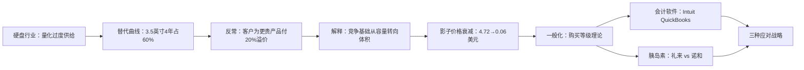
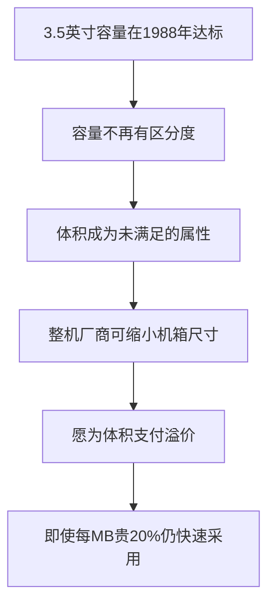

> 章节：第九章“产品性能、市场需求和生命周期” 
> 作者：克莱顿·克里斯坦森（Clayton M. Christensen） 
> 笔记目标：按原书小节顺序还原“性能过度供给如何驱动竞争基础迁移与产品生命周期演进”的完整逻辑，推导替代曲线、影子价格衰减与可靠性阈值，并说明三种应对战略的条件与边界。

## 一、本章的问题与核心命题

### 1.1 问题从哪里来

前八章反复出现一张图：技术供给轨线与市场需求轨线**相交**。前面的章节用它解释**领先企业为何陨落**——交点之后，破坏性技术从价值网下方切入。

第九章追问一个此前未答的问题：

> **交点之后，究竟发生了什么？为什么客户会突然改变选择标准？**

作者给出的答案是一个此前未曾言明的中间机制：

> 在性能过度供给给破坏性技术带来威胁或机遇时，**还会导致产品市场的竞争基础发生根本性变化**。消费者选择产品或服务时所遵循的**各种标准的排序将发生变化**，从而标志着产品生命周期从一个阶段过渡到另一个阶段。

**核心命题**（本章最重要的一句）：

> **企业提供的性能轨线和市场要求的性能轨线的交汇，是引发产品生命周期从一个阶段过渡到另一个阶段的根本原因。**

### 1.2 这个命题为何重要

市场营销文献长期描述"产品生命周期"（导入期、成长期、成熟期、衰退期）以及竞争基础的迁移，但通常把它当作**时间的函数**——好像产品自然会"变老"。

作者提出的是**因果机制**：生命周期阶段的转换不是时间导致的，而是**两条轨线相对位置变化**导致的。这带来一个决定性的推论：

$$
\text{阶段转换}\ \Longleftrightarrow\ S(t)\ \text{越过}\ D(t)
$$

因此它**可预测、可测量、甚至可干预**（见第十节的战略 3）。这把描述性的生命周期理论变成了**可操作的战略工具**：

> 轨线图能够有效地说明，**行业的竞争态势和竞争基础可能会随着时间的推移发生怎样的改变**。

### 1.3 严格定义：性能过度供给

**定义**：设某属性上市场要求的性能为 $D(t)$，技术能够提供的性能为 $S(t)$。若存在 $t^{*}$ 使得

$$
S(t)>D(t),\qquad \forall t>t^{*}
$$

则称在 $t>t^{*}$ 时该属性发生**性能过度供给**（performance oversupply）。

**发生的必要条件**是斜率条件：

$$
\frac{dS}{dt}>\frac{dD}{dt}
$$

**直觉含义**：不是产品变差了，而是**产品好过了头**——好到客户已经用不上、也不愿再为之付钱的程度。

**关键澄清**：过度供给是**逐属性**判定的，不是整体判定。一个产品可能在容量上过度供给、同时在体积上供给不足。正是这种**不同属性的饱和时点不同**，造就了竞争基础的依次迁移。

### 1.4 本章的论证路径

作者的编排延续全书惯例：先在硬盘行业精确量化，再跨行业验证。

## 二、性能过度供给和竞争基础的变化

### 2.1 图 9.1：过度供给的量化
> **原书图示**：硬盘容量的性能过度供给
图 9.1 截自图 1.7 的一部分，给出了精确读数：

> 到 **1988 年**，普通 **3.5 英寸**硬盘的容量终于**达到**了主流台式个人电脑市场所要求的容量水平，而那时普通 **5.25 英寸**硬盘的容量已经比主流台式计算机市场所要求的容量**超出了近 300%**。

**量化过度供给幅度**：定义过度供给率

$$
\text{Over}(t)=\frac{S(t)-D(t)}{D(t)}
$$

对 1988 年的 5.25 英寸硬盘：

$$
\text{Over}=300\%\ \Longrightarrow\ \frac{S}{D}=1+3.0=4.0
$$

即**供给容量是市场所需的 4 倍**。

**这一刻的战略意义**：

> 也就在当时，自台式计算机市场出现以来，计算机生产商**首次有了另一个购买选择**，因为 5.25 英寸硬盘和 3.5 英寸硬盘**都能提供足够的容量**。

"**都能提供足够的容量**"是关键短语。在此之前，容量是**约束性**指标——只有 5.25 英寸够用，客户别无选择。1988 年之后，容量**不再具有区分度**，选择权第一次真正打开。

### 2.2 图 9.2：替代曲线与费雪-普赖模型的完整推导
> **原书图示**：3.5英寸硬盘在台式计算机市场的替代过程
#### 2.2.1 纵轴的定义

原书说明：

> 图中的**纵轴衡量的是售出的新、旧技术产品所占的比重**。

这是技术替代研究的标准形式——**优势比（odds ratio）**。设新技术市场份额为 $f$，则纵轴为：

$$
R=\frac{f}{1-f}=\frac{\text{新技术销量}}{\text{旧技术销量}}
$$

反解得份额：

$$
f=\frac{R}{1+R}
$$

#### 2.2.2 用原书三个读数验证

| 年份 | 纵轴读数 $R$ | 换算份额 $f=\dfrac{R}{1+R}$ | 原书表述 |
|---:|---:|---:|---|
| 1985 | 0.007 | $\dfrac{0.007}{1.007}=0.6951\%$ | "不到 1%（**.0069**）" ✓ |
| 1987 | 0.20 | $\dfrac{0.20}{1.20}=16.67\%$ | "**16.7%** 为 3.5 英寸硬盘" ✓ |
| 1989 | 1.5 | $\dfrac{1.5}{2.5}=60\%$ | "占据了硬盘销售量的半壁江山（**60%**）" ✓ |

**三个读数全部精确吻合**，证实纵轴确为优势比。

#### 2.2.3 为什么要用优势比作纵轴：费雪-普赖模型的推导

**问题**：技术替代过程呈 S 形曲线，直接画份额 $f$ 是一条弯曲的曲线，难以外推。有没有办法把它拉直？

**建模假设**（费雪-普赖替代模型）：替代速率正比于**已完成替代的部分**与**尚未替代的部分**之积：

$$
\frac{df}{dt}=\alpha f(1-f)
$$

**假设的直觉依据**：

- 正比于 $f$：已采用者越多，示范效应、配套生态、供应规模越强；
- 正比于 $1-f$：剩余可替代空间越大，增长余地越大；
- $\alpha$：替代速度常数，反映技术优势与转换阻力的综合。

**求解**（分离变量法）：

$$
\frac{df}{f(1-f)}=\alpha\,dt
$$

对左侧做部分分式分解：

$$
\frac{1}{f(1-f)}=\frac{1}{f}+\frac{1}{1-f}
$$

（验证：$\dfrac{1}{f}+\dfrac{1}{1-f}=\dfrac{(1-f)+f}{f(1-f)}=\dfrac{1}{f(1-f)}$ ✓）

两边积分：

$$
\int\left(\frac{1}{f}+\frac{1}{1-f}\right)df=\int\alpha\,dt
$$

$$
\ln f-\ln(1-f)=\alpha t+C
$$

即：

$$
\boxed{\ \ln\frac{f}{1-f}=\alpha t+C\ }
$$

**结论**：

$$
\ln R=\alpha t+C\qquad\text{或}\qquad R=e^{\alpha t+C}
$$

**这就是纵轴取优势比、且用对数刻度的原因**：在半对数坐标下，S 形替代过程被**拉成一条直线**，斜率即为替代速度 $\alpha$。这使得替代进程可以线性外推——这是图 9.2 的全部技术含义。

#### 2.2.4 从数据反推替代速度

由 $\ln R_2-\ln R_1=\alpha(t_2-t_1)$ 得：

$$
\alpha=\frac{\ln(R_2/R_1)}{t_2-t_1}
$$

| 区间 | 计算 | $\alpha$（每年） |
|---|---|---:|
| 1985→1987 | $\dfrac{\ln(0.20/0.007)}{2}=\dfrac{\ln 28.571}{2}=\dfrac{3.3524}{2}$ | **1.676** |
| 1987→1989 | $\dfrac{\ln(1.5/0.20)}{2}=\dfrac{\ln 7.5}{2}=\dfrac{2.0149}{2}$ | **1.007** |
| 1985→1989（整体） | $\dfrac{\ln(1.5/0.007)}{4}=\dfrac{\ln 214.29}{4}=\dfrac{5.3674}{4}$ | **1.342** |

**读数解释**：

1. $\alpha\approx1.0\sim1.7$ 意味着优势比**每年增长 $e^{1.0}\approx2.7$ 到 $e^{1.7}\approx5.5$ 倍**——替代极快。
2. 前段斜率（1.676）大于后段（1.007），说明实际替代比纯费雪-普赖模型**略微减速**。可能原因：早期基数极小时增长率天然偏高，以及后期剩余的旧技术用户切换成本更高。
3. **模型不完美，但足以刻画量级与方向**——这正是模型的正确用法。

#### 2.2.5 替代半程点的推算

份额达到 50% 时 $R=1$，即 $\ln R=0$。用 1987 年（$R=0.20$）与后段 $\alpha=1.007$ 外推：

$$
\Delta t=\frac{\ln(1/0.20)}{1.007}=\frac{1.6094}{1.007}\approx1.60\ \text{年}
$$

即约 **1988 年年中**越过 50%。这与图 9.1"1988 年 3.5 英寸容量达标"**在时间上高度吻合**——**容量达标的那一刻，正是替代过半的那一刻**。

**这个吻合本身就是本章命题的实证**：不是价格、不是营销，而是**性能门槛被跨越**这一事件触发了替代。

### 2.3 关键反常：客户为更贵的产品买单

作者在此设置了一个**判决性的反常现象**，用以排除最自然的竞争性解释。

**标准经济学猜测**：

> 一种标准的经济学猜测，可能是 3.5 英寸硬盘结构代表了一种**更具成本效益**的结构。如果两种产品之间不再具有明显的差异（都能提供足够的容量），**价格竞争将会加剧**。

**但事实完全相反**：

> **但这显然不是当前的情况。**的确，计算机生产商如果要使用 3.5 英寸硬盘的话，平均需要为每兆字节容量支付 **20% 的溢价**，但它们**仍然对这种产品趋之若鹜**。而且，计算机生产商在自身的产品市场面临**激烈的价格竞争**时，**仍然倾向于使用更为昂贵的硬盘驱动器**。

**这个反常极具论证力量**，因为它同时排除了两种解释：

| 被排除的解释 | 反证 |
|---|---|
| 新技术因更便宜而获胜 | 3.5 英寸**贵 20%** |
| 客户不在乎成本 | 客户自身正处于**激烈价格竞争**中 |

既然不是价格，那必然是**价值维度本身改变了**。

### 2.4 解释：竞争基础的迁移

> **性能过度供给引发了竞争基础的变化。**一旦对容量的需求得到满足，**其他属性（这些属性的性能尚不能满足市场的需求）的价值便开始显现**，硬盘驱动器生产商也会开始针对这些属性来将它们的产品与其他产品区别开。

**形式化表述**：轨线图纵轴所衡量的"最重要属性"发生了替换。

> 从理论上说，这意味着……图表的纵轴所衡量的**最重要的属性发生了变化**，而产品性能的**新轨线**（相对于市场需求）已经成形。

（原文此处标注为"图 8.1 等图表"，按上下文应指图 1.7 一类的**轨线图**；图 8.1 是第八章的 RPV 框架图。这应为排印或 OCR 讹误，不影响论证。）

**具体到台式机市场**：

> 在 1986 至 1988 年的台式个人电脑市场，相对于其他特征，硬盘驱动器的**体积**成为一项越来越重要的属性。体积更小的 3.5 英寸硬盘使得计算机生产商能够**减小计算机的尺寸或者计算机在桌面所占的空间**。例如，在 IBM 公司，较大的 **XT/AT** 电脑让位于体积要小得多的新一代 **PS1/PS2** 计算机。

**因果链完整还原**：

**注意价值传导的层级**：硬盘的体积本身对最终用户没有意义，它的价值来自**上一层系统**（整机可以做小），再来自**再上一层**（桌面空间）。这正是第二章"价值网嵌套"理论的应用——**属性的价值必须在终端应用系统中定义**。

### 2.5 影子价格的衰减：过度供给的直接测量

这是本章最精确的量化证据。作者用第二章介绍的**特征回归分析法**（享乐价格回归）测量了"体积"这一属性的边际价值。

**回顾影子价格的定义**：在控制其他属性后，属性 $x_i$ 每变动一个单位对应的价格变化：

$$
\beta_i=\frac{\partial P}{\partial x_i}
$$

**测量结果**：

| 年份 | 每减少 1 立方英寸体积的影子价格 |
|---:|---:|
| 1986 | **4.72 美元** |
| 1989 | **0.06 美元** |

**衰减幅度计算**：

$$
\frac{0.06}{4.72}=0.012712
$$

即三年内**降至原来的 1.27%**，或者说下降了 **98.7%**。

**折算为年衰减率**：

$$
r=\left(\frac{0.06}{4.72}\right)^{1/3}-1
$$

$$
=e^{\frac{\ln 0.012712}{3}}-1=e^{\frac{-4.3651}{3}}-1=e^{-1.4550}-1
$$

$$
=0.2334-1=-76.66\%\ \text{每年}
$$

**每年下跌约 77%**——这是一个极其陡峭的崩塌。

**为什么会崩塌得这么快？**原书给出机制：

> 有一段时间，小型硬盘驱动器的产量无法满足市场的需求，台式计算机生产商会继续支付高溢价……但是，**一旦计算机生产商在新一代台式计算机的配置中采用了体积更小的硬盘驱动器，它们对体积甚至还要更小的硬盘驱动器的需求也将达到饱和。**

**关键在于"离散跳变"**：整机厂商一旦完成机箱重新设计（XT/AT → PS1/PS2），体积需求就**一次性满足**了。再小的硬盘不会让机箱进一步缩小，因为约束已转移到其他部件。因此影子价格不是缓慢下降，而是**在设计换代完成时断崖式归零**。

**一般规律**（作者的概括）：

> 一旦某项特定属性达到了所要求的性能水平，消费者便**不会再像以前那样愿意为该项属性的持续改善支付溢价**，这表明消费者对这项属性的需求已经得到满足。因此，性能过度供给导致竞争基础发生转变，而消费者用来选择产品的标准也**转移到市场需求尚未得到满足的属性上**。

**形式化这个规律**：

$$
\beta_i\begin{cases}
\gg0, & x_i<d_i\quad(\text{供给不足，属性稀缺})\\[4pt]
\approx0, & x_i\ge d_i\quad(\text{供给饱和，属性冗余})
\end{cases}
$$

其中 $d_i$ 是属性 $i$ 的市场满足阈值。

**这个分段函数是本章所有结论的数学核心**——它同时解释了：为何客户愿为体积付溢价（体积未饱和）、为何不愿为容量付溢价（容量已饱和）、为何最终陷入价格战（所有属性都饱和）。

### 2.6 图 9.3：纵轴的连续重定义
> **原书图示**：台式个人电脑市场竞争基础的演变
> 图 9.3 总结了台式个人电脑市场似乎已经发生的情况，图中**纵轴所衡量的属性不断发生变化**。

**完整的迁移序列**：

| 阶段 | 竞争基础（纵轴属性） | 触发下一阶段的事件 |
|---:|---|---|
| 1 | **容量** | 容量过度供给（1988 年） |
| 2 | **体积** | 体积过度供给（约 1989 年，影子价格降至 0.06 美元） |
| 3 | **可靠性**（抗震性、MTBF） | MTBF 接近 100 万小时时影子价格趋零 |
| 4 | **价格** | 毛利率降至 **12% 以下** |

原书表述：

> 容量属性方面发生的性能过度供给引发了纵轴的第一次重新定义，即从容量过渡到体积。当这一项新属性的性能足以满足市场需求时，纵轴对性能定义再次发生了改变，以反映市场对**可靠性**的需求。因此，相比其他竞争产品，能够提供**超强抗震性和有竞争力的平均故障间隔时间（MTBF）**的产品一度享有很高的溢价。但当平均故障间隔时间的值**接近 100 万小时**的时候，市场给予平均故障间隔时间每变动 100 小时的影子价格**接近为零**……之后……是激烈的价格竞争，在某些情况下，**毛利率会降至 12% 以下**。

### 2.7 为什么 MTBF 达到 100 万小时后溢价归零：可靠性推导

这是一个可以严格证明的论断，值得完整推导。

**MTBF 的定义**：平均无故障工作时间（Mean Time Between Failures）。原书脚注给出了行业惯例的直观解释：

> 平均故障间隔时间为 100 万小时意味着，如果 **100 万台**电脑同时打开，并同时运行 **1 小时**，其中**一台**电脑的硬盘驱动器将在第一个小时发生故障。

**验证这个解释**：在指数分布假设下，故障率为

$$
\lambda=\frac{1}{\text{MTBF}}=\frac{1}{10^{6}}\ \text{每小时}
$$

$n=10^{6}$ 台设备运行 1 小时的期望故障数：

$$
E[\text{故障数}]=n\lambda t=10^{6}\times10^{-6}\times1=1\ \text{台}\quad\checkmark
$$

**可靠度函数**（指数分布）：

$$
R(t)=e^{-\lambda t}
$$

**计算一年（8760 小时）的可靠度**：

$$
R(8760)=e^{-8760/10^{6}}=e^{-0.00876}=0.9912783
$$

对应**年故障概率**：

$$
1-R=0.008722=\mathbf{0.87\%}
$$

**现在计算 MTBF 增加 100 小时的效果**（即从 1 000 000 → 1 000 100）：

$$
R'(8760)=e^{-8760/1{,}000{,}100}=e^{-0.00875912}=0.9912791
$$

**可靠度提升量**：

$$
\Delta R=0.9912791-0.9912783=8.7\times10^{-7}
$$

即年故障概率仅改善 **0.000087 个百分点**。

**结论**：客户在一年中感知到的差异是**百万分之一量级**——**完全不可察觉**。因此愿付溢价必然趋近于零：

$$
\beta_{\text{MTBF}}=\frac{\partial P}{\partial\text{MTBF}}\approx0
$$

**这个推导的价值在于**：它证明"影子价格归零"**不是客户非理性**，而是**边际效用真的消失了**。工程师还能继续改进 MTBF，但改进量已落在人类可感知的阈值之下。

**推广的一般原理**：

$$
\text{属性饱和}\ \Longleftrightarrow\ \frac{\partial(\text{客户可感知效用})}{\partial(\text{属性})}\approx0
$$

**注意假设与边界**：

1. 指数分布假设意味着**恒定故障率**（无早期失效、无磨损期）。真实硬盘呈"浴盆曲线"，早期与末期故障率更高。
2. MTBF 是**统计量**，对单个用户而言故障是二值事件，感知与期望值可能不同。
3. 若使用场景变化（如数据中心成千上万块盘并行运行），$n$ 变大，同样的 MTBF 会产生可观的总故障数——**此时可靠性可能重新成为竞争基础**。这提示：饱和是**相对于使用场景**的，场景变化可使已饱和属性重新稀缺。

## 三、产品何时演变为商品

### 3.1 商品化的严格判据

作者给出了一个精确的定义：

> 当不断改变的竞争基础终于变动完毕时，也就是说，当**不止一种产品能够完全满足市场对每种属性或性能方面的需求时**，产品也就演变成了特定市场部门中的一种**商品**。

**形式化**：设属性集合为 $\{1,2,\ldots,n\}$，产品 $j$ 在属性 $i$ 上的表现为 $x_{ij}$，市场阈值为 $d_i$。则市场发生商品化当且仅当：

$$
\exists\ j\ne k,\quad \forall i:\ x_{ij}\ge d_i\ \wedge\ x_{ik}\ge d_i
$$

即**至少两个产品在所有属性上都达标**。

**此时差异化为何失效**：产品价差由影子价格加总给出

$$
\Delta P=\sum_{i=1}^{n}\beta_i\,\Delta x_i
$$

由 2.5 节的分段函数，所有属性都饱和意味着所有 $\beta_i\approx0$，因此：

$$
\Delta P\approx0
$$

**无论产品之间还有多大的技术差异，都无法转化为价格差异。**

### 3.2 销售人员的抱怨与它的真正含义

作者用一个生动场景说明这一点：

> 顾问、经理和研究人员经常能听到在价格谈判中铩羽而归的销售人员满腹牢骚地抱怨说：**"这些人还以为我们的产品只是一种商品呢。难道他们看不出我们的产品要比其他产品要好上许多倍吗？"**

作者的解释极为精准：

> 实际上，这可能是因为在竞争对手向市场提供的产品中，**相互之间仍然存在差异**。但是，当**产品特色和功能已经超出市场需求时，差异化也就失去了意义**。

**这里有一个至关重要的辨析**：

| 说法 | 是否成立 |
|---|---|
| "我们的产品客观上更好" | **成立**（技术差异真实存在） |
| "因此客户应该多付钱" | **不成立**（差异落在饱和区，$\beta\approx0$） |

**"更好"与"更值钱"是两回事。**只有落在**未饱和属性**上的"更好"才值钱。这是本章对产品经理最直接的忠告。

### 3.3 商品化的相对性

作者补充了一个重要的观察：

> 大约到了 1988 年，5.25 英寸硬盘已经演变成了台式计算机市场上的一种**价格驱动型商品**，而当时 3.5 英寸硬盘仍然享有溢价。此外，即便是作为台式计算机领域的一种商品，5.25 英寸硬盘当时在**更高端市场**的定价相对于 8 英寸硬盘**仍存在较高的溢价**。

**商品化是"市场部门 × 属性"的函数，不是产品的绝对属性**：

$$
\text{某产品是否为商品}=g(\text{市场部门},\ \text{该部门的}\ d_i\ \text{向量})
$$

同一块 5.25 英寸硬盘，在台式机市场是商品（因为该市场 $d_{\text{容量}}$ 低，早已被越过），在更高端市场仍有溢价（因为该市场 $d_{\text{容量}}$ 高，尚未越过）。

**这直接解释了第四章的"左上牵引力"**：

> 正如第四章所述，这也解释了为什么**成熟企业总是会采取积极的高端战略**。

企业向高端移动，本质上是**逃离已商品化的市场部门，寻找属性仍然稀缺的部门**。第四章从成本结构角度解释了这一行为，第九章从**属性稀缺性**角度给出了互补的解释——两者是同一枚硬币的两面。

## 四、性能过度供给和产品竞争的演变

作者把硬盘行业的发现与既有的市场营销理论对接，说明这不是行业特例。

### 4.1 购买等级（Buying Hierarchy）

由旧金山的**温德米尔联合公司**（Windermere Associates）提出，将产品演变划分为四个阶段：

$$
\text{功能性}\ \longrightarrow\ \text{可靠性}\ \longrightarrow\ \text{便捷性}\ \longrightarrow\ \text{价格}
$$

**逐阶段的逻辑**（原书完整论证）：

| 阶段 | 触发条件 | 竞争基础 | 谁享溢价 |
|---|---|---|---|
| 1 | 没有产品能满足功能需求 | **功能性** | 性能最强者 |
| 2 | "两种或两种以上的产品能够很好地满足市场对功能性的需求" | **可靠性** | "销售最可靠产品的最可靠供货商" |
| 3 | "两个或两个以上的供货商……具备了提供超出市场需求的可靠性" | **便捷性** | "为消费者提供便捷产品和服务的供货商" |
| 4 | "多家供货商都能提供一系列能够完全满足市场需求的便捷产品和服务" | **价格** | 无人享溢价 |

**每一次转换的触发条件都是同一个**：

> **推动购买等级从一个阶段向另一个阶段转变的因素就是性能过度供给。**

**形式化为一个"最小索引"规则**：

按购买等级排序属性 $i=1$（功能性）、$2$（可靠性）、$3$（便捷性）、$4$（价格）。当前竞争基础为：

$$
k=\min\{\,i\ :\ s_i<d_i\,\}
$$

即**第一个尚未被满足的属性**。当 $i=1,2,3$ 全部满足时，$k=4$，只剩价格竞争——这与第三节的商品化判据完全等价。

**这个规则的实践价值**：它把"我们现在该在什么维度上竞争"从一个直觉判断，变成了一个**可检查的清单**——依次检查每个属性是否已被市场吸收，第一个未被吸收的就是当前战场。

**一个重要的补充观察**：

> 有时（例如在硬盘驱动器市场）市场可能会**同时围绕几个不同的功能层面**展开竞争。

即"功能性"本身可能是多维的（容量、速度、体积……），需要在其内部再做一次排序。硬盘市场的容量→体积→可靠性迁移，正是"功能性内部细分"与"购买等级"叠加的结果。

### 4.2 摩尔的《跨越鸿沟》：同一逻辑的用户视角

> 杰弗里·摩尔在他所著的《跨越鸿沟》（*Crossing the Chasm*）一书中介绍了另外一种有关行业演变的实用概念。这一概念有着**类似的基本逻辑**，但是从**用户**而不是**产品**的角度来阐述。

**两种视角的对应关系**：

| 摩尔的用户阶段 | 该阶段的选择依据 | 对应购买等级 |
|---|---|---|
| 创新者、早期采用者 | "**只根据产品的功能性**来选择产品"，"性能最好的产品能够享受较高的溢价" | 功能性 |
| 早期大多数 | 供货商"开始解决……对**可靠性**的需求"，市场"大幅扩展" | 可靠性 |
| 晚期大多数 | "可靠性问题得到解决，创新和竞争的基础转向**便捷性**" | 便捷性 |

**摩尔模式的基本命题**（作者的概括）：

> 技术发展到一定阶段，**市场对某种特定性能层面的需求将得到满足**。

**两个理论的关系**：购买等级从**产品属性**侧描述，摩尔从**用户构成**侧描述，但**驱动力相同**——都是某一属性被满足后，需求向下一属性转移。作者用它们互相印证，说明性能过度供给是一个**跨理论、跨行业**的普遍机制。

### 4.3 与破坏性技术的连接

> 竞争基础的这一演变模式——从功能性到可靠性和便捷性，最后到价格——曾经发生在目前已讨论过的许多市场中。实际上，**破坏性技术的一个基本特征就是它预示了竞争基础即将发生改变。**

**这是一个重要的诊断信号**：破坏性技术的出现，不只是一个竞争威胁，更是一个**市场即将进入下一生命周期阶段的先行指标**。看到破坏性产品出现，就应当预期竞争基础即将迁移。

## 五、破坏性技术的其他普遍特征

作者提出两条可供管理者利用的规律：

> 首先，破坏性产品**在主流市场几乎没有价值的属性通常成为它们在新兴市场最大的卖点**；其次，相比成熟产品，破坏性产品一般**更简单、更便宜，也更可靠、更便捷**。

并说明其价值：

> **即便破坏性技术特定的市场应用领域是无法预知的**，管理者仍然可以利用以下两条规律。

**这一限定极其重要**：它承接第七章的"不可知"命题。第七章说市场应用**不可预知**，本章说虽然应用不可知，但**技术的属性特征是可知的**。这为在不确定中行动提供了立足点：

$$
\underbrace{\text{市场应用}}_{\text{不可知}}\quad\text{vs}\quad\underbrace{\text{属性组合与演化方向}}_{\text{可知}}
$$

## 六、规律一：破坏性技术的劣势就是其优势

### 6.1 核心论断

> 在性能过度供给、产品生产周期和破坏性技术出现的相互作用下，**破坏性技术在主流市场几乎没有价值的属性恰好构成了它们在新市场的价值**。

**这不是文字游戏，而是有严格结构的**：破坏性技术的属性向量 $\mathbf{x}$ 在两个市场被赋予**完全不同的权重**：

$$
V_{\text{主流}}=\sum_i w_i^{\text{主流}}x_i\quad\text{（低）},\qquad
V_{\text{新兴}}=\sum_i w_i^{\text{新兴}}x_i\quad\text{（高）}
$$

同一个 $\mathbf{x}$，因 $\mathbf{w}$ 不同而价值迥异。**"劣势"与"优势"描述的是同一组物理属性。**

### 6.2 成功者与失败者的分野

作者做了一组极为清晰的对照。

**成功者：接受属性、寻找市场**

> 成功地进行了破坏性创新的企业最初会**想当然地认为，破坏性技术的特征和能力都是合理的**，并且会努力**为这项新技术寻找或创造一个看重或能接受这些属性的新市场**。

| 企业 | 属性 | 找到的市场 |
|---|---|---|
| 康诺外部设备 | 小型化 | 便携式计算机 |
| 杰西博、J.I. 凯斯 | 小型铲斗、牵引车机动性 | 民用建筑承建商 |
| 纽柯 | 薄板连铸板材 | "**不计较表面瑕疵**"的市场 |

**失败者：接受市场、改造属性**

> 被这些破坏性技术拖垮的企业认为，**成熟市场的需求才是正道**，而且**并不打算在这些技术足以满足主流市场的需求之前进行市场推广活动**。

| 企业 | 做错的事 | 本应问的问题 |
|---|---|---|
| 希捷 | 把 3.5 英寸硬盘"送到 IBM 公司进行评估" | "哪个市场最终会需要一种体积更小、容量更低的硬盘驱动器" |
| 比塞洛斯-伊利（1951 收购 Hydrohoe） | "为 Hydrohoe 装配了缆索、滑轮、离合器和绞车"，卖给普通挖掘承建商 | "哪个市场实际上会需要一种只能挖掘窄沟的步行式挖掘机" |
| 美国钢铁（评估薄板连铸） | "想当然地认为，市场需要质量最高的表面抛光"，转投传统连铸机 | "对表面外观要求较低的低价板材市场在哪儿" |

作者对失败模式的一句话总结：

> **他们用开发延续性技术的思维来发展破坏性技术。**

### 6.3 挑战性质的误判

这是本节最凝练的诊断：

> 面临破坏性技术创新的成熟企业通常将**技术性挑战**看做是它们面临的首要发展挑战，即改善破坏性技术，使其足以满足**已知市场**的需求。与之相比，在对破坏性技术的商业开发中做得最成功的企业是那些将**市场营销挑战**（构建或发现一个新市场，其中的产品竞争主要围绕着产品的破坏性属性展开）视为它们面临的主要发展挑战的企业。

**两种问题设定的对比**：

| | 成熟企业的设定 | 成功者的设定 |
|---|---|---|
| 视为何种挑战 | **技术挑战** | **市场营销挑战** |
| 固定量 | 市场（已知市场的需求） | 技术（当前属性） |
| 求解量 | 技术（改造到达标） | 市场（寻找匹配的客户） |
| 隐含假设 | 市场需求是唯一正确的标准 | 属性组合是给定的合理事实 |
| 时间消耗 | 在实验室中等待 | 在市场中学习 |

**这两种设定在数学上是"固定谁、求解谁"的差异**，但在结果上是成败之别。

### 6.4 索尼案例：晶体管收音机的完整故事

作者在脚注中给出了一个堪称典范的案例（由索尼已退休的生产与技术副董事长谢尔顿·韦林格转述）：

| 步骤 | 事件 |
|---|---|
| 1947 | AT&T 工程师发明晶体管技术 |
| 50 年代初 | 索尼董事长**盛田昭夫**赴纽约，住进"市内一家便宜的旅馆" |
| — | AT&T "不太愿意进行谈判"，盛田**多次拜访**请求出售专利 |
| — | 诚意打动对方，专利转让文件签署 |
| 会后 | AT&T 官员问索尼打算如何使用这项专利 |
| — | 盛田："**我们打算生产小型收音机**" |
| — | 官员不解："**为什么会有人想要小型收音机呢？**" |
| — | 盛田："**那我们走着瞧。**" |
| 几个月后 | 索尼在美国推出第一款便携式晶体管收音机 |

**早期产品的客观劣势**（作者如实列出）：

> 按照主流市场衡量收音机性能的主要指标，这些早期晶体管收音机的质量**实在太差**，不但保真度很低，而且**静电干扰也比当时占主导地位的真空管台式收音机大很多**。

**关键的战略选择**：

> 盛田并没有选择**继续在实验室里研发晶体管收音机，直到它的性能足以参与主要市场的竞争**（**这是大多数领先电子企业在开发晶体管技术时所采取的战略**），而是主动去**寻找看重晶体管技术业已存在的属性的市场**——便携式个人收音机市场。

**结局**：

> 不出意料的是，**没有一家领先的台式收音机生产商最后发展为便携式收音机的主要生产商**，而且它们之后都被淘汰出收音机市场。

**这个案例的特殊价值**：括号中那句"这是大多数领先电子企业所采取的战略"表明，**在位者并非没有拿到晶体管技术**——它们拿到了，而且投入研发了，只是选择了"在实验室里等到够好"。**同样的技术、同样的时间，不同的问题设定，导致相反的结局。**这是对 6.3 节论断最有力的实证。

### 6.5 作者的告诫

> 如果历史可以提供任何指导，相比从一开始就积极发展破坏性技术特性的企业，那些**只在实验室里研究破坏性技术，等到符合主流市场的需求之后才对这种技术进行改善的企业，将无法复制前者的成功**。

> 相对于将破坏性技术看做是一种**实验室挑战**，而非**市场营销挑战**的企业，积极发展破坏性技术的企业通过**建立商业基础，然后进军高端市场**，最终将**更加有效地解决主流市场的需求**。

**注意最后半句的反讽**：想直接服务主流市场的企业**服务不了**主流市场；先去服务边缘市场的企业**最终更好地**服务了主流市场。这与第六章"进入新兴市场者成功率 37%、进入成熟市场者 6%"的统计完全一致——**绕道是更快的路**。

## 七、规律二：破坏性技术通常更简单、更便宜、更可靠、更便捷

### 7.1 为什么这四个词能同时成立

初看这四个特征像是矛盾的——更便宜怎么会更可靠？解释在于**结构简单性**：

$$
\text{结构更简单}\ \Longrightarrow\ \begin{cases}
\text{零部件更少}\ \Rightarrow\ \text{更便宜}\\
\text{故障点更少}\ \Rightarrow\ \text{更可靠}\\
\text{操作更少}\ \Rightarrow\ \text{更便捷}
\end{cases}
$$

**这也解释了为什么破坏性技术能在购买等级中"跳级"获胜**：它在功能性上刚刚够用（$s_1\ge d_1$），但在可靠性、便捷性上**明显更优**——而这些恰恰是购买等级中的下一战场。

### 7.2 液压挖掘机的验证

作者用第三章的案例演示：

> 一旦液压挖掘机的铲斗具备了处理 **2~4 立方码**土方的能力（**超过了主流市场对性能的要求**），承建商便很快地开始采用这些产品，**即使缆索挖掘机每铲能够推动更多的土方**。由于**两种技术所提供的铲斗容量均超出了他们的要求**，承建商将更倾向于选择**更加可靠**的技术——液压技术。

**这与 2.3 节硬盘的反常现象结构完全相同**：

| | 硬盘（1988） | 挖掘机（1960s） |
|---|---|---|
| 旧技术在主属性上 | 5.25 英寸容量更大（超出 300%） | 缆索每铲土方更多 |
| 新技术在主属性上 | 3.5 英寸刚好够用 | 液压刚好够用（2~4 立方码） |
| 客户仍选新技术 | 是（还多付 20%） | 是 |
| 真实原因 | 体积（未饱和属性） | 可靠性/安全（未饱和属性） |

**两个相隔几十年、完全不同的行业，机制完全一致**——这是对理论普遍性的有力支持。

### 7.3 成熟企业为何总是"做得太好"

> 由于成熟企业**特别倾向于开发高性能、高利润的产品和市场**，它们发现自己经常是在**首款破坏性产品中加入了过多的特色和功能**，而且要想防止这一趋势的发生**可谓是困难重重**。

**惠普 Kittyhawk 的复盘**（呼应第七章）：

> 由于**无法设计一种真正简单、价廉的产品**，Kittyhawk 项目的参与者将这种硬盘驱动器的容量**发展到了这项技术的极限**，并在产品中加入了一定的抗震和低能耗功能，**使其具备了作为一种延续性产品的竞争力**。当市场真正的大规模应用领域，即**价格低廉、结构简单、功能单一的 10MB 硬盘**开始出现时，惠普公司的产品**并不具备足够的破坏性**来抓住这一轮变革所带来的机遇。

**"并不具备足够的破坏性"（not disruptive enough）是一个极富启发的表述**——它把"破坏性"当作一种**需要刻意保持的产品特质**，而不是自然状态。在位企业的重力会不断把产品往上拉，必须主动对抗。

**苹果牛顿同理**：

> 苹果公司在开发牛顿 PDA 产品时也犯了同样的错误，即**没有在一开始就瞄准简单性和可靠性**。

**这条规律给产品设计的直接启示**：破坏性产品的设计目标是**"足够好"（good enough）而非"最好"**。用第八章的语言说，这与成熟组织的价值观直接冲突——这正是需要独立机构的又一理由。

## 八、发生在会计软件市场的性能过度供给

### 8.1 Quicken：从"观察"而非"询问"中获得便捷性

> Quicken 软件因为**使用简单、便捷**，从而主导了个人财务软件市场。Quicken 的绝大多数用户**无须阅读使用说明手册**，只需要购买软件，在电脑上启动程序，然后就可以开始使用。

**方法论上的关键**（直接呼应第七章 9.4 节）：

> Quicken 软件的开发者通过**观察用户如何使用产品**，而不是**询问用户或"专家"需要什么**来提高软件使用的便捷性……通过观察用户在使用产品的过程中可能会在哪些地方碰到困难或感到迷惑，开发者把精力主要放在了**如何不断地使产品变得更简单、更方便**上，以期为消费者提供**包含足够的功能，而不是超强功能**的产品。

$$
\text{观察行为}\ \succ\ \text{询问意图}
$$

$$
\text{足够的功能（enough）}\ \succ\ \text{超强功能（more）}
$$

### 8.2 QuickBooks：三个洞察

> 不太为人所知的一个事实是，Intuit 公司占据了北美**小型企业会计软件市场 70% 的份额**。作为一家**较晚进入这一市场的新兴企业**，Intuit 公司是通过推出 QuickBooks 软件实现这一目标的。

**三个启示**（原书原文）：

| # | 洞察 | 揭示的过度供给 |
|---|---|---|
| 1 | 现有软件"在**注册会计师的密切指导下**开发"，要求使用者具备基本会计知识（借贷、资产、负债），每项分录记录两次以提供审计追踪 | **专业性过度** |
| 2 | 现有软件"面面俱到地提供了一系列**复杂的报告和分析数据**"，且"每升级一次，数据就会变得更加复杂和专业"，因为开发者"希望提供更多的功能，并以此将他们的产品与其他产品区别开" | **功能过度**（且是差异化竞赛驱动的） |
| 3 | "**85% 的美国企业规模都很小**，而且**雇不起会计师**"，账目由业主或家人记录；这些人"**不需要，也不理解**主流会计软件提供的大多数条目和报告"，"**不知道审计追踪是什么**" | **用户与设计假设严重错配** |

**注意第 2 点的因果**：功能膨胀不是偶然，而是**差异化竞争的必然产物**——每家厂商都想通过加功能来区别于对手。这正是第三节所说的"当产品特色已超出市场需求时，差异化失去意义"的**生成机制**。

### 8.3 斯科特·库克的推断

> Intuit 公司的创始人斯科特·库克推测，这些小企业大都是由**业主自己来经营**。他们在经营企业时更多是依靠**自己的直觉和对所从事业务的第一手知识**，而不是包含在会计报告中的信息。

**由此得出的战略判断**：

> 库克认为，小型企业会计软件的生产商**过度满足了这一市场所要求的功能**，因此为破坏性软件技术（即**提供足够而不是超强的功能，并且使用更加简单、便捷**）的兴起**创造了机遇**。

**结果**：

> Intuit 公司具有市场破坏性的 QuickBooks 软件将产品**竞争的基础从功能性转变为便捷性**，并在产品推出**两年后占据了 70% 的市场份额**。实际上，到 **1995 年**，QuickBooks 在 Intuit 公司的收入中所占的比重**已经超过了 Quicken**。

### 8.4 复式记账的例子：功能冗余的完美标本

作者在脚注中给出了一个精彩的观察：

> 即便是计算机通常不会在加减运算中犯错，市场上的**每一种会计软件包仍然继续使用复式簿记会计系统**——最早由**威尼斯商人**发明，目的是为了**查找记账过程中发生的运算错误**。Intuit 公司可以通过**去掉不需要的产品功能**来极大地简化它的产品。

**这个例子的逻辑结构值得单独提炼**：

**一般化的诊断问题**：**这个功能当初是为了解决什么问题？那个问题今天还存在吗？**

这是识别功能过度供给的最锐利的一把刀——它揭示了一类特殊的过度供给：**不是性能超出需求，而是需求本身已经消失，功能却还在**。

### 8.5 在位者的反应：又一次向上逃逸

> 可以预见的是，在面对 Intuit 公司的冲击时，成熟小型企业会计软件生产商的反应就是**继续推出功能更强大的软件包，以进一步向高端市场转移**。这些软件主要针对特定的市场部门，目标消费者是更高端市场上对信息系统的要求更高的高端用户。

**结局**（三大供应商，1992 年各约 30% 份额，合计约 90%）：

| 供应商 | 结局 |
|---|---|
| 第一家 | **已经破产** |
| 第二家 | **业务正在萎缩** |
| 第三家 | 推出简化产品应对，但"**只在市场占据了很小一部分份额**" |

**注意第三家的教训**：它**做对了方向**（推出简化产品），却仍然失败。这印证了第六章的先发优势结论——**在破坏性变革中，方向正确但时机太晚，仍然无效**。

## 九、发生在胰岛素产品生命周期中的性能过度供给

这是全章最富戏剧性的案例，因为它展示了**十亿美元级的技术奇迹如何被市场无视**。

### 9.1 纯度：五十年的单维改善轨道

| 年份 | 杂质含量 | 事件 |
|---:|---:|---|
| 1922 | — | 4 名多伦多研究人员首次从动物胰脏提取胰岛素并成功注射 |
| 1925 | **50 000 ppm** | 起点 |
| 1950 | **10 000 ppm** | — |
| 1980 | **10 ppm** | 礼来"不断投资和不懈努力"的成果 |

**分段改善率计算**（ppm 为百万分之一，越低越好，故为衰减率）：

$$
r=\left(\frac{\text{末值}}{\text{初值}}\right)^{1/n}-1
$$

| 区间 | 年数 | 计算 | 年衰减率 |
|---|---:|---|---:|
| 1925→1950 | 25 | $(10\,000/50\,000)^{1/25}-1=0.2^{0.04}-1$ | **−6.23%** |
| 1950→1980 | 30 | $(10/10\,000)^{1/30}-1=0.001^{1/30}-1$ | **−20.57%** |
| 1925→1980（全程） | 55 | $(10/50\,000)^{1/55}-1$ | **−14.35%** |

（全程 14.35% 与第一章推算的 14.36% 一致，互为验证。）

**一个极具启发的发现**：**后 30 年的改善速度（20.57%/年）是前 25 年（6.23%/年）的 3.3 倍**——纯度改善在**加速**。

而与此同时，市场需求早已饱和。这正是性能过度供给的教科书式图景：

$$
\frac{dS}{dt}\ \text{加速}\qquad\text{而}\qquad\frac{dD}{dt}\approx0
$$

### 9.2 优泌林：技术上完美，商业上失败

**动机**（一个**真实但极小**的需求）：

> 尽管纯度得到极大的改善，但动物胰岛素仍与人类胰岛素存在**细微的差别**，这也导致**少数**糖尿病病人的免疫系统对动物胰岛素产生了免疫力。

**投入**：

| 项目 | 数据 |
|---|---|
| 合作方 | 1978 年与**基因泰克**签订协议 |
| 技术路线 | 基因重组细菌产生与人类相同的胰岛素蛋白 |
| 纯度 | **100%** |
| 投入 | 20 世纪 80 年代初，**近 10 亿美元** |
| 定价 | 比动物萃取胰岛素高 **25%** |
| 历史地位 | "**生物科技行业推出的第一种作用于人体的商业规模产品**" |

**结果**：

> 但市场对这一技术奇迹的反应却**不那么热烈**。礼来公司发现它**很难延续优泌林对动物胰岛素享有的溢价**，优泌林的销售量增长率也**出人意料的低**。

**礼来研究员的自述**（本章最精辟的一句现场证词）：

> **"现在回想起来，市场并没有对猪胰岛素非常不满意。实际上，猪胰岛素还非常受市场的欢迎。"**

**作者的诊断**：

> 礼来公司花费了**巨额资金**，投入了**巨大的公司资源**，到头来却**过度满足了市场对产品纯度的需求**。而优泌林则成为**又一个市场并没有给予溢价的差异化产品**，因为它**所提供的性能超出了市场的需求**。

用 2.5 节的公式表达：

$$
\Delta P=\beta_{\text{纯度}}\cdot\Delta x_{\text{纯度}},\qquad \beta_{\text{纯度}}\approx0\ \Longrightarrow\ \Delta P\approx0
$$

**投入 10 亿美元，买到了一个 $\beta\approx0$ 的属性改进。**

**公平的补充**（作者在脚注中给出，体现了论证的严谨）：

> 虽然礼来公司的优泌林胰岛素无法实现溢价，但企业的投资**还是获得了回报**。优泌林使得礼来公司**免遭胰脏供应短缺**（由红色肉类消费下降所导致）可能带来的影响，并且使礼来公司在**生物工程制药的批量生产**方面获得了非常宝贵的经验，并以此建立了资产基础。

**这一补充很重要**：它说明投资的**战略价值**与**溢价能力**是两回事。优泌林作为"供应链保险"和"能力建设"是成功的，作为"差异化溢价来源"是失败的。评价一项投资必须明确**评价维度**。

### 9.3 诺和笔：在未饱和属性上取胜

**对比对象**："一家来自丹麦的**规模更小**的胰岛素生产商——诺和公司"。

**传统注射流程**（原书完整描述，值得逐步列出，因为**繁琐本身就是论证**）：

1. 携带独立注射器；
2. 针头插入装有胰岛素的玻璃药水瓶；
3. 拔出柱塞将胰岛素抽入注射器（**抽入量应比实际用量稍高**）；
4. 针头朝上握住注射器**轻弹几次**，挤出附着在针筒壁上的气泡；
5. **对第二种慢效类型胰岛素重复上述操作**；
6. 推入柱塞挤出剩余气泡（**不可避免地挤出一些胰岛素**）；
7. 注射。

> 这一过程通常要持续 **1~2 分钟**。

**诺和笔流程**：

1. 笔芯内含**好几周用量**的胰岛素（通常是快效与慢效的混合液）；
2. 转动小剂量选择环，选择剂量；
3. 针头插入皮下；
4. 按下注射键。

> 完成整个过程**只需不到 10 秒钟**。

**量化便捷性的价值**：取传统 90 秒、诺和笔 10 秒，每日注射 4 次计算，年节省时间：

$$
(90-10)\ \text{秒}\times4\ \text{次/天}\times365\ \text{天}=116\,800\ \text{秒}
$$

$$
=\frac{116\,800}{3600}\approx\mathbf{32.4\ \text{小时/年}}
$$

**每年为患者节省超过一个昼夜的时间**，还不计繁琐操作带来的心理负担与出错风险（气泡、剂量偏差）。

**商业结果**：

> 与礼来公司苦苦维持优泌林所享有的溢价不同，诺和笔**很轻易地延续了每单位胰岛素 30% 的溢价**。到 20 世纪 80 年代，受诺和笔和预混合胰岛素笔芯取得成功的推动，诺和公司在**全球胰岛素市场上所占的份额大幅上升，并且实现了赢利**。

### 9.4 两家公司的判决性对照

这组对照是全书中"性能过度供给"最清晰的实证：

| 维度 | 礼来 · 优泌林 | 诺和 · 诺和笔 |
|---|---|---|
| 改进的属性 | **纯度**（已饱和） | **便捷性**（未饱和） |
| 技术难度 | 极高（基因重组，行业首创） | 中等（机械工程改进） |
| 投入 | **近 10 亿美元** | 显著更少 |
| 定价溢价 | 25% | 30% |
| 溢价能否维持 | **"很难延续"** | **"很轻易地延续"** |
| 销量表现 | "增长率出人意料的低" | 份额大幅上升并赢利 |
| 企业规模 | 全球领先 | "规模更小" |

**作者的结论**：

> 礼来公司和诺和公司的经验进一步证明，**性能超出市场需求的产品将被迫接受与商品同等的价格，而重新定义了竞争基础的破坏性产品则可以获得溢价。**

**最反直觉的一点**：**技术难度与商业回报呈负相关**。投入更少、技术更简单的诺和笔，获得了更高且更稳固的溢价。原因不在努力程度，而在**改进落在了 $\beta>0$ 还是 $\beta\approx0$ 的属性上**。

### 9.5 课堂讨论：为什么"显而易见"的错误会发生

作者记述了他在哈佛商学院讲授这个案例的经历，这是本章最具认识论价值的部分。

**第一轮反应（学生的常见判断）**：

> 绝大多数学生都会**抨击礼来公司竟然遗漏了如此明显的信息**……他们宣称，组织几个简单的跟踪调研小组，询问病人和医生是否需要纯度更高的胰岛素将给予礼来公司足够的信息指导。

**第二轮反转（"思维更缜密的学生"提出，且"这种情况总是一再发生"）**：

作者提出的问诊链条，逐层揭示了调研为何注定失效：

| 提问 | 答案 | 后果 |
|---|---|---|
| 礼来咨询的医生中，谁的意见最受重视？ | **内分泌学家**——主攻糖尿病治疗，且是胰岛素行业**主要客户** | 样本被最专业者主导 |
| 哪些病人最可能听取这些专家的方案？ | 病情**最罕见、最严重**、对猪胰岛素**免疫力最强**的患者 | 患者样本被极端案例主导 |
| 那么主要消费者会建议什么？ | **继续提高纯度** | 调研必然给出错误结论 |

**作者的结论**：

> **主要消费者的权力和影响的确是导致企业的产品开发过度满足主流市场需求的一个主要原因。**

**这正是第一章"受制于客户"命题的微观机制**：企业没有不听客户，恰恰是**太认真地听了最重要的客户**。而最重要的客户，按定义就是需求最极端的客户。

$$
\text{最重要的客户}\ \ne\ \text{典型客户}
$$

**第三层洞察：连问题本身都不会被提出**

> 而且，思维缜密的学生发现，**大多数营销经理甚至不会去问**"纯度为 100% 的人工胰岛素是否可能超出市场需求"这个问题。对于一家建立了根深蒂固的文化体系的成功企业来说，**50 多年来，更高的纯度就是"更好的产品"的终极定义**。推出更高纯度的胰岛素一直都是礼来公司维持竞争优势的**主要模式**。更高的纯度一直是企业销售人员在向医生推销自己的产品时**屡试不爽的法宝**。

> 在这家公司的发展史上，**什么能导致它基于企业文化作出的假设突然发生变化**，并促使它的管理人员开始**询问之前从来不需要作出回答的问题**呢？

**这一段与第八章完美衔接**：第八章指出"当企业成员开始根据**假设**而非主观判断来选择决策标准时，流程与价值观就构成了文化"。礼来的"纯度 = 更好"经过 50 多年验证，已经沉淀为**文化层面的假设**——它不再是一个被讨论的选项，而是**思考的前提**。

**因此无法通过更好的调研来纠正**：调研只能回答被提出的问题，而问题本身已经被文化排除在外。

### 9.6 推广到英特尔：作者的自我警示

作者在脚注中把这个逻辑对准了当时最成功的公司：

> 英特尔公司就总是在性能表现图的纵轴上衡量它生产的微处理器的**速度**。英特尔总是**假设**市场需求速度更快的微处理器……当然，一些尖端客户要求指令处理速度达 200MHz、400MHz 和 800MHz 的芯片。**但主流市场的需求如何呢？英特尔新型微处理器的速度和成本是否可能会在不远的将来过度满足市场需求呢？**

> 如果技术过度供给可能发生，那么英特尔公司的**上万名员工**怎样才能预测这一切将在何时发生，并**接受情况已经发生改变的事实**，以**完全改变它们的产品开发模式**呢？

> **发现技术过度供给已经不易，对此采取一些应对措施更是难上加难。**

**注意这里的两难被分为两层**：

$$
\underbrace{\text{发现过度供给}}_{\text{认知问题：文化假设阻碍提问}}\ +\ \underbrace{\text{采取应对措施}}_{\text{组织问题：上万人的模式转换}}
$$

第一层是本章的主题，第二层是第五、六、八章的主题。**两层都必须解决，缺一不可。**

## 十、控制产品竞争的演变

### 10.1 图 9.4：过度供给模型与三种战略
> **原书图示**：性能过度供给模型与竞争基础的演变
**模型结构**：

> 这个模型描绘了一个**多级市场**，其中**市场要求的性能改善轨线较技术人员所能提供的改善轨线更浅一些**。因此，每一级市场的发展都会经历一个演变周期，其中周期的不同发展阶段是以**产品选择的基础发生转变**为标志的。

图中每一级市场（低端、中端、高端）内部都标注了购买等级的四阶段循环：**功能性 → 可靠性 → 便捷性 → 价格**。

> 在本章提到的每一个案例中，**预示着竞争基础将发生改变、即将进入产品生命周期下一个阶段的产品都是破坏性产品。**

### 10.2 战略 1：向上逃逸

> **第一项一般性选择**（即图中的战略 1，**也是本书探讨的各行业最常用的战略**）就是将**延续性技术的轨线提升到市场的更高级别**，从而在更简单、更便捷，或是更便宜的破坏性方法出现时**最终选择放弃更低端的消费者**。

**这是第四章"左上牵引力"的战略表述**。它是**默认路径**——不需要任何刻意决策，组织的资源分配流程会自动导向它。

**成立条件**：高端市场必须**存在且足够大**，且企业能持续维持高端所需的成本结构。

**失败模式**：当高端空间耗尽时无路可退（第四章综合钢铁厂的结局）。

### 10.3 战略 2：紧跟需求，不向上移

> **第二种选择**……就是在一个**特定的市场级别**，时刻与消费者的需求保持步调一致，从而**紧跟每一轮竞争基础的变革浪潮**。

**作者的判断**：

> 从历史经验来看，这一点**似乎难以做到**（所有的原因已在前面的章节中进行了阐述）。

**难以做到的原因**（综合前几章）：毛利率门槛会随成本结构上升（第八章）、增长压力要求更大市场（第六章）、客户与资源分配流程持续拉动向上（第四、五章）。**留在原地需要对抗全部这些力量。**

**康柏的尝试**：

> 在个人电脑行业，随着台式计算机的功能性足以满足较低级别市场的需求，诸如**戴尔公司和捷威 2000 公司**等新进新兴企业开始进入这一市场，并提出了**以购买和使用的便捷性为中心内容的价值主张**。面对新兴企业的冲击，康柏公司的应对之举是**积极实施第二种方法**，即根据更低级别市场的需求生产出**功能适度的低价计算机系列产品**，以**竭力抑制企业进入高端市场的趋势**。

注意"**竭力抑制**"这个措辞——它准确地表明战略 2 是**逆流而上**的，需要持续用力对抗组织的自然倾向。

也请注意戴尔与捷威的价值主张是"**购买和使用的便捷性**"——正是购买等级中功能性之后的下一阶段。**新进入者精确地在新战场上开战**。

### 10.4 战略 3：抬高需求曲线的斜率

这是最精巧、也最需要严格论证的一种战略。

> **第三种战略**……就是**利用市场营销计划来加深市场轨线的坡度**，使消费者的需求能够**跟上技术人员所能提供的性能改善速度**。

**理论依据**（作者给出的完整推理）：

> 由于发生这些变化趋势的一个**必要条件**，就是**技术轨线的坡度要大于市场轨线的坡度**，因此，当**两条轨线平行时**，性能过度供给以及产品生命周期从一个阶段过渡到另一个阶段便**不会发生，或者至少会延迟发生**。

**严格表述**：设

$$
S(t)=S_0e^{g_st},\qquad D(t)=D_0e^{g_dt}
$$

则供需比为：

$$
\frac{S(t)}{D(t)}=\frac{S_0}{D_0}e^{(g_s-g_d)t}
$$

**三种情形**：

| 条件 | 供需比行为 | 结果 |
|---|---|---|
| $g_s>g_d$ | 指数发散 | **过度供给必然发生**（本书各行业的常态） |
| $g_s=g_d$ | **恒定** $=S_0/D_0$ | **过度供给不再扩大**，生命周期阶段转换被冻结 |
| $g_s<g_d$ | 收敛并反转 | 供给反而追不上需求 |

**战略 3 的本质就是把 $g_d$ 拉高到等于 $g_s$。**

### 10.5 微软-英特尔-硬盘的三位一体

> 一些计算机行业的分析人士认为，**微软公司、英特尔公司和硬盘驱动器企业非常有效地执行了最后一种战略**。微软公司利用其行业主导地位成功地研制并营销了**需要占用巨大硬盘驱动器内存，且需要速度更快的微处理器来运行的软件包**。微软公司最终**提高了消费者要求的功能改善轨线的坡度，并使之与微软公司技术人员提供的功能改善坡度平行**。

**用 Excel 的数据量化验证这一战略**：

| 版本 | 年份 | 所需硬盘容量 |
|---|---:|---:|
| Excel 1.2 | 1987 | **1.2 MB** |
| Excel 5.0 | 1995 | **32 MB** |

**计算需求侧增长率 $g_d$**（8 年）：

$$
g_d=\left(\frac{32}{1.2}\right)^{1/8}-1=\left(26.667\right)^{1/8}-1
$$

$$
=e^{\frac{\ln 26.667}{8}}-1=e^{\frac{3.2834}{8}}-1=e^{0.41043}-1
$$

$$
=1.5075-1=\mathbf{50.75\%\ \text{每年}}
$$

**对照供给侧增长率 $g_s$**：第一章给出，1980—1990 年新型 5.25 英寸硬盘容量以**每年约 50%** 的速度增长。

**结论**：

$$
g_d\approx50.75\%\qquad\text{vs}\qquad g_s\approx50\%
$$

$$
\boxed{\ g_d\approx g_s\ }
$$

**两条曲线几乎完全平行。**这是对战略 3 最精确的量化验证——软件对存储的需求增速，与硬盘容量的供给增速几乎分毫不差。

**这个吻合度令人震惊**：它意味着无论这是有意设计还是产业协同演化的结果，效果都等同于**精确地把需求曲线锁定在供给曲线上**。

### 10.6 图 9.5：战略 3 的效果
> **原书图示**：更新至1996年的硬盘驱动器轨线图
> 图 9.5 描绘了这一战略的影响……需要注意的是，**中等价位的台式和笔记本电脑部门所要求的容量轨线在 20 世纪 90 年代出现上扬**，并最终**与 3.5 英寸和 2.5 英寸硬盘生产商开辟的容量改善轨线平行**。

**观察到的后果**（三条，全部是战略 3 成功的证据）：

| 现象 | 原因 |
|---|---|
| "这些市场在近几年**并没有发生性能过度供给**的情况" | $g_d=g_s$，供需比恒定 |
| "**2.5 英寸硬盘仍然被困在笔记本电脑市场**，因为台式计算机市场所要求的容量**增速实在太快**" | 需求跑得太快，小盘径追不上，**无法向上入侵** |
| "**3.5 英寸硬盘在台式计算机市场上的地位仍然非常稳固**，而 **1.8 英寸硬盘也没能在笔记本电脑市场得到广泛应用**" | 同上 |

**受益者**：

> 在这种情况下，**产品定位最接近市场高端的企业**（例如**希捷公司和 IBM 公司**）**获利最为丰厚**，因为在没有出现技术过度供给的情况下，产品生命周期不同阶段的转变**在高端市场受到了抑制**。

**这是一个极其重要的洞察**：战略 3 不只是防守，它**主动关闭了破坏者向上入侵的通道**。如果需求增长得足够快，低端产品永远达不到高端门槛——**破坏的必要条件（$g_s>g_d$）被人为消除了**。

### 10.7 战略 3 的脆弱性

作者随即指出这一战略并非永久有效：

> 微软、英特尔和希捷公司成功地创造了市场需求，并使市场需求轨线与其技术人员所能提供的功能轨线始终保持平行，**但目前还不清楚它们的成功还能持续多久。**

**质疑的依据**：

> 一些行业观察家认为，如果微软公司的研发团队**注意观察一般用户是如何使用 Excel 软件的**话，他们就会发现 **Excel 所提供的功能已经大大超出了主流市场的需求**。

**并给出了具体的破坏性威胁预测**：

> 如果情况确实如此，这将为破坏性技术——**从互联网上选择小型应用程序，然后在简单的互联网工具而不是功能齐全的计算机上使用这些小程序**——创造一个**从价值网的下方冲击这一市场**的机遇。

**这段预测写于 2000 年前后**，描述的正是后来的**云端轻应用/浏览器化/SaaS** 路线。作为一个**事前**作出的、可证伪的预测，它为理论提供了不同于回溯案例的证据类型。

**为什么战略 3 终究脆弱**：它要求需求端能**持续**吸收供给端的改善。而"注意观察一般用户如何使用"（第七章的方法）会发现，真实使用早已落后于名义需求——**厂商推动的需求增长与用户的真实需求之间会累积出缺口**，而这个缺口就是破坏者的入口。

## 十一、正确的战略和错误的战略

### 11.1 没有唯一正解

> 在图 9.4 描述的三种战略中，哪一个是最佳战略呢？本项研究发现，有明显的证据表明**没有所谓的最佳战略，着力采取任何一种战略都有可能取得成功**。

**三种战略各有成功范例**：

| 战略 | 成功范例 | 关键条件 |
|---|---|---|
| **战略 1**（向上逃逸） | **惠普激光喷射打印机**，"实现了巨大的利润" | "在这个案例中，第一种战略也是一种**安全的战略**，因为惠普公司正在**用具有破坏性的喷墨打印技术来冲击自己的市场领先地位**" |
| **战略 2**（紧跟需求） | **康柏** | 需持续对抗向上的组织惯性 |
| **战略 3**（抬高需求斜率） | **英特尔、微软、硬盘生产商的三位一体** | 需要产业主导地位与生态协同 |

**惠普案例的注解极为关键**：战略 1（向上逃逸）之所以"安全"，是因为惠普**同时**用喷墨部门占据了自己撤出的低端（第五章的"自杀以求生存"）。**孤立地执行战略 1 是危险的；配合自我破坏则是安全的。**

这提示三种战略**并非互斥**，可以组合使用。

### 11.2 成功者的共同特征

> 这些成功的战略实施者都有一个共同的特点，那就是**不管是有意识的还是出于本能，他们都深刻理解了消费者的需求曲线和技术人员的供给曲线**。到目前为止，**理解这些曲线是他们获得成功的关键**。

$$
\text{战略选择的前提}=\text{准确理解}\ D(t)\ \text{与}\ S(t)
$$

**选哪条路可以不同，但必须先看清地图。**三种战略的差异在于应对方式，共性在于**都基于对两条曲线的正确认知**。

### 11.3 全章的收束警告

> 但**能够长期做到这一点的企业屈指可数**。**大多数运行良好的企业都会不自觉地向坐标图的左上角方向移动**，从而导致自己身陷竞争基础发生改变的漩涡，并招致破坏性技术从价值网下方发起的攻击。

**"不自觉地"（unwittingly）是关键词**——这与第四、五、八章完全一致：向上移动不是一个被决策的战略，而是**资源分配流程、毛利率门槛与客户压力共同作用下的默认漂移**。

**因此本章的实践含义是**：战略 2 和战略 3 需要**持续的、有意识的努力**才能维持；一旦放松，组织会自动退回战略 1。

## 十二、跨案例比较

把本章四个主要案例并置，可以看到高度一致的结构：

| 维度 | 硬盘（3.5 英寸） | 会计软件（QuickBooks） | 胰岛素（诺和笔） | 挖掘机（液压） |
|---|---|---|---|---|
| **已饱和属性** | 容量 | 功能/专业性 | 纯度 | 铲斗容量 |
| **饱和的证据** | 5.25 英寸超出需求 300% | 85% 小企业"不需要也不理解" | "市场并没有对猪胰岛素非常不满意" | 2~4 立方码已超要求 |
| **新竞争基础** | 体积 → 可靠性 | 便捷性 | 便捷性 | 可靠性/安全 |
| **在位者的错误投资** | 继续做大容量 | 继续加功能、向上转移 | 10 亿美元做 100% 纯度 | 继续做大铲斗 |
| **溢价结果** | 新品贵 20% 仍热销 | QuickBooks 两年 70% 份额 | 优泌林溢价难维持；诺和笔 30% 溢价稳固 | 液压快速替代 |
| **在位者结局** | 5.25 英寸商品化 | 一家破产、一家萎缩、一家份额很小 | 礼来失去溢价 | 缆索厂商出局 |

**四个案例、四个行业、跨越数十年，机制完全同构。**这是本章理论普遍性的最强证据。

**并可提炼出一个统一的诊断公式**：

$$
\text{破坏性机会}=\exists\,i:\ \underbrace{s_i\gg d_i}_{\text{在位者过度投入的属性}}\ \wedge\ \exists\,j:\ \underbrace{s_j<d_j}_{\text{无人服务的属性}}
$$

**同时满足这两个条件，就是破坏性创新的窗口。**

## 十三、易混淆概念与常见误解

### 13.1 "性能过度供给 = 产品做得太好，是浪费"

不完全对。过度供给是**相对于特定市场部门**而言的。5.25 英寸硬盘对台式机市场过度供给，对高端市场仍有溢价。优泌林对普通患者过度供给，对免疫患者仍有价值。**判断必须绑定市场部门。**

### 13.2 "客户不愿为改进付钱是因为不识货"

不对。MTBF 推导证明，从 100 万小时再增加 100 小时，一年的可靠度只提升 $8.7\times10^{-7}$——**客户感知不到的差异不是差异**。$\beta\approx0$ 反映的是真实边际效用消失，不是客户非理性。

### 13.3 "新技术替代旧技术是因为更便宜"

不对。3.5 英寸硬盘每兆字节**贵 20%**，客户在自身激烈价格竞争中仍抢购。替代的原因是**价值维度改变**，不是成本优势。

### 13.4 "商品化意味着产品之间没有差异了"

不对。作者明确指出差异**仍然存在**，只是"当产品特色和功能已经超出市场需求时，**差异化也就失去了意义**"。**有差异 ≠ 差异值钱。**

### 13.5 "购买等级是固定的时间顺序"

不完全对。它是**由过度供给触发**的条件序列，不是时钟驱动的。若某属性长期无法满足（如安全、医疗合规），该阶段可能持续极久甚至永不推进。此外，若使用场景变化（如数据中心规模化使可靠性重新稀缺），已过阶段可能**回退**。

### 13.6 "礼来应该做几个焦点小组就能避免错误"

这正是作者课堂上被推翻的第一轮判断。三层障碍：**受访医生是最专业的内分泌学家**、**其患者是最极端的病例**、**最根本的是"纯度=更好"已成文化假设，问题本身不会被提出**。调研只能回答被提出的问题。

### 13.7 "破坏性产品应该尽快加强功能以进入主流"

危险。惠普 Kittyhawk 与苹果牛顿的失败正在于此——"**并不具备足够的破坏性**"。破坏性产品的设计目标是**"足够好"而非"最好"**，加功能会同时抬高成本与价格，反而错过真正的低端市场。

### 13.8 "战略 3（拉高需求）是最优解"

不对。作者明确说"**没有所谓的最佳战略**"。战略 3 需要产业主导地位，且作者当场指出其脆弱性（Excel 功能已超需求）。它推迟破坏，不能消除破坏。

### 13.9 "十亿美元的技术突破一定有商业价值"

不对。优泌林是"生物科技行业推出的第一种作用于人体的商业规模产品"，技术上完全成功，却"很难延续溢价"。**技术成功与商业成功的判据不同**：前者看能否实现，后者看 $\beta$ 是否大于零。

### 13.10 "复式记账被简化说明传统方法是错的"

不对。复式记账在人工计算时代**正确地**解决了查错问题。它变成冗余不是因为它错了，而是因为**它要解决的问题消失了**（计算机不会算错）。这提示一类特殊的过度供给：**需求消失而功能留存**。

## 十四、方法的有效性、局限与替代方案

### 14.1 论证为何有力

1. **判决性反常**：客户为贵 20% 的产品买单，同时排除了"成本优势"与"客户不在乎钱"两种解释。
2. **精确的量化测量**：影子价格 4.72 → 0.06 美元，给出了"属性饱和"的直接测量，而非定性描述。
3. **模型与数据吻合**：图 9.2 的三个读数（0.695%/16.67%/60%）完全符合优势比定义，替代半程点（1988 年年中）与容量达标时点（1988 年）吻合。
4. **可推导的机制**：MTBF 溢价归零可由指数可靠度模型严格推出，不依赖事后解释。
5. **跨行业同构**：硬盘、会计软件、胰岛素、挖掘机四个案例结构完全一致。
6. **与既有理论对接**：购买等级（Windermere）与摩尔《跨越鸿沟》独立提出，却指向同一机制。
7. **量化验证战略 3**：Excel 需求增速 50.75% 与硬盘供给增速约 50% 几乎相等，为"拉平曲线"提供了硬数据。
8. **可证伪的事前预测**：对"互联网小程序 + 简单终端"冲击的预测写于 2000 年前后，是事前而非事后。
9. **自我警示的严谨**：作者把同一逻辑对准当时最成功的英特尔，而非只用它解释失败者。
10. **公允的补充**：明确指出优泌林虽无溢价，但带来供应链保障与生物制造能力。

### 14.2 局限

1. **"市场需求轨线"难以独立测量**。$D(t)$ 通常由中位机型配置反推（第一章附件 1.1），带有循环论证风险——用实际购买推断需求，再用需求解释实际购买。
2. **影子价格依赖回归设定**。4.72 与 0.06 两个数字来自享乐价格模型，遗漏变量（品牌、时期、技术代际）会影响估计。
3. **购买等级的普适性存疑**。四阶段顺序在安全攸关、监管密集或强网络效应行业可能不成立（如药品的可靠性永远优先于便捷性）。
4. **"属性"的划分带有主观性**。容量、体积、可靠性、便捷性的边界并非天然给定，划分方式会影响结论。
5. **替代曲线拟合不完美**。$\alpha$ 在前后两段分别为 1.676 与 1.007，费雪-普赖模型只是近似。
6. **案例为回溯性选择**。QuickBooks、诺和笔均为已知成功者，未系统统计"同样瞄准便捷性却失败"的案例。
7. **时代局限**。写于 2000 年前后，未涵盖平台经济、网络效应、数据飞轮等使属性饱和逻辑复杂化的机制（例如网络效应可能使"更多用户"这一属性永不饱和）。
8. **战略 3 的伦理与可持续性未充分讨论**。人为抬高需求（软件膨胀）在多大程度上创造真实价值，作者未展开。
9. **未讨论属性"复活"的条件**。数据中心规模化使 MTBF 重新重要，即已饱和属性可能因场景变化而重新稀缺，本章未涉及。

### 14.3 替代与补充理论

| 理论 | 与本章的关系 | 补充之处 |
|---|---|---|
| **Kano 模型** | 把属性分为基本型、期望型、兴奋型 | 提供属性分类的另一维度；"基本型"对应已饱和 |
| **待完成工作（JTBD）** | 作者后期发展 | 从"属性"转向"任务"，避免属性划分的主观性 |
| **蓝海战略（价值曲线）** | 剔除-减少-增加-创造 | "剔除/减少"对应删去过度供给属性 |
| **享乐价格模型** | 本章的测量工具 | 提供 $\beta_i$ 的计量方法与检验 |
| **费雪-普赖替代模型** | 本章图 9.2 的理论基础 | 提供替代速度的预测方法 |
| **技术接受生命周期（摩尔）** | 作者直接引用 | 用户侧视角 |
| **可靠性工程** | MTBF 推导的基础 | 提供感知阈值的量化方法 |
| **精益/MVP** | "足够好"原则的工程化 | 操作层面的实现路径 |

## 十五、面向实践的分析模板

**第一步：分解属性并定位饱和点**

1. 列出客户实际用于比较产品的**全部属性**（不是你认为重要的，而是客户实际比较的）。
2. 对每个属性 $i$，估计市场阈值 $d_i$ 与当前供给 $s_i$。
3. 标记：$s_i\ge d_i$ 为**已饱和**，$s_i<d_i$ 为**未饱和**。

**第二步：测量影子价格**

4. 用交易数据做享乐价格回归，估计各属性的 $\beta_i$。
5. 观察 $\beta_i$ 的**时间趋势**——下降中的 $\beta_i$ 是饱和的先行指标（如 4.72 → 0.06）。
6. 若无法回归，用替代信号：客户是否还会为该属性的提升更换供应商？销售是否还用它作卖点？

**第三步：判定当前竞争基础**

7. 按购买等级排序，找出 $k=\min\{i:s_i<d_i\}$。
8. 检查：**我们的研发投入是否集中在第 $k$ 个属性上？**若集中在已饱和属性，即为优泌林式错误。
9. 检查商品化风险：是否 $\forall i:s_i\ge d_i$？若是，价格战已不可避免。

**第四步：识别文化假设**

10. 问："我们公司 50 年来对'更好的产品'的定义是什么？"
11. 问："**这个定义还成立吗？**"（礼来的纯度、英特尔的速度）
12. 问："我们的核心功能当初是为了解决什么问题？**那个问题今天还存在吗？**"（复式记账）
13. 警惕：最重要的客户 ≠ 典型客户。检查调研样本是否被极端用户主导。

**第五步：比较两条曲线的斜率**

14. 估计 $g_s$（技术供给增速）与 $g_d$（市场需求增速）。
15. 若 $g_s>g_d$：过度供给必然发生，估算交点时间 $t^{*}$。
16. 若 $g_s\approx g_d$：暂时安全，但需警惕名义需求与真实使用的缺口。

**第六步：选择战略**

17. **战略 1**（向上）：高端空间是否足够？是否同时安排了自我破坏（惠普喷墨模式）？
18. **战略 2**（守位）：是否有能力持续对抗向上的组织惯性（第四、八章的力量）？
19. **战略 3**（拉高需求）：是否具备生态主导地位？用户真实使用是否跟得上名义需求？
20. 三者可组合，不必二选一。

**第七步：若要做破坏性产品**

21. 目标是**"足够好"而非"最好"**——抵抗加功能的冲动。
22. 把挑战定义为**市场营销挑战**（找到看重当前属性的客户），而非**技术挑战**（改造到达标）。
23. 用**观察行为**而非**询问意图**来发现便捷性痛点（Quicken 方法）。
24. 检查：产品是否**足够破坏**？价格与复杂度是否已被抬到无法服务真正的低端市场？

**第八步：设定复核机制**

25. 定期重测 $\beta_i$，捕捉饱和时点。
26. 为**意外的成功**建立复核（第七章）——新属性的价值常先在非目标客户处显现。
27. 监测：是否有产品在我们"看不上"的属性上正在快速改善？

## 十六、本章总结

第九章补上了全书因果链中缺失的一环：**轨线相交之后发生了什么。**

**核心命题**：技术供给轨线与市场需求轨线的交汇，是产品生命周期阶段转换的**根本原因**。这把描述性的生命周期理论转化为**可测量、可预测、可干预**的战略工具。

**机制的数学核心**是影子价格的分段行为：

$$
\beta_i\approx\begin{cases}
\text{显著为正}, & x_i<d_i\\
0, & x_i\ge d_i
\end{cases}
$$

由此推出全章所有结论：为何客户愿为贵 20% 的 3.5 英寸硬盘付钱（体积未饱和）、为何 MTBF 溢价归零（增加 100 小时只改变 $8.7\times10^{-7}$ 的年可靠度）、为何 10 亿美元的优泌林换不来溢价（纯度已饱和）、为何所有属性饱和后必然商品化（$\Delta P=\sum\beta_i\Delta x_i\approx0$）。

**三个完整推导**：

- **费雪-普赖替代模型**：由 $\frac{df}{dt}=\alpha f(1-f)$ 经部分分式积分得 $\ln\frac{f}{1-f}=\alpha t+C$，解释了图 9.2 为何以优势比为纵轴——它把 S 形替代拉成直线。三个读数（0.007/0.20/1.5）换算份额为 0.695%/16.67%/60%，与原书完全吻合；替代半程点约 1988 年年中，恰与容量达标时点重合。
- **可靠性阈值**：由 $R(t)=e^{-\lambda t}$ 证明 MTBF 从 100 万增至 100.01 万小时，年可靠度仅提升 $8.7\times10^{-7}$——**溢价归零不是客户非理性，而是边际效用真的消失了**。
- **斜率条件**：由 $\frac{S}{D}=\frac{S_0}{D_0}e^{(g_s-g_d)t}$ 证明，$g_s=g_d$ 时过度供给冻结。Excel 需求增速 **50.75%/年**与硬盘容量供给增速**约 50%/年**几乎完全相等，为战略 3 提供了精确的量化验证。

**四个跨行业案例结构同构**：硬盘的容量、会计软件的功能、胰岛素的纯度、挖掘机的铲斗容量——在位者都在**已饱和的属性上继续巨额投入**，破坏者都在**未饱和的属性上以更低成本取胜**。礼来与诺和的对照最为锐利：**技术难度与商业回报呈负相关**，投入更少、技术更简单的诺和笔获得了更稳固的 30% 溢价。

**最深刻的一层**在课堂讨论中：礼来的错误无法通过更好的调研纠正，因为障碍有三层——受访者是最专业的内分泌学家、其患者是最极端的病例、而"纯度 = 更好"经 50 多年验证已沉淀为**文化假设**，**问题本身不会被提出**。这与第八章的"文化 = 根据假设而非判断行事"精确衔接。

**三种应对战略无优劣之分**（向上逃逸、紧跟需求、拉高需求斜率），成功者的共同点只有一个：**深刻理解需求曲线与供给曲线**。而全章的收尾警告是——

> **大多数运行良好的企业都会不自觉地向坐标图的左上角方向移动。**

"不自觉地"意味着：留在原地或拉平曲线都需要**持续的、有意识的努力**；一旦放松，组织的资源分配流程会自动把企业推向高端，直至无路可退。

**本章最值得记住的一句话**是那位礼来研究员的反思：

> **"现在回想起来，市场并没有对猪胰岛素非常不满意。"**

十亿美元买来的教训是：**在客户已经满意的地方继续努力，努力本身不产生价值。**
