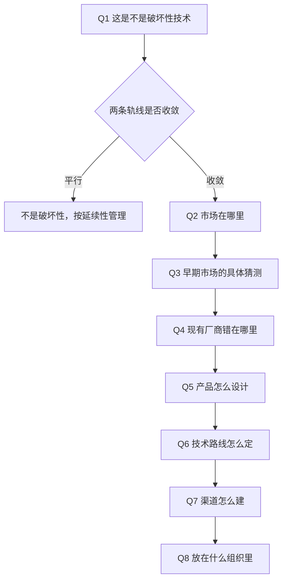
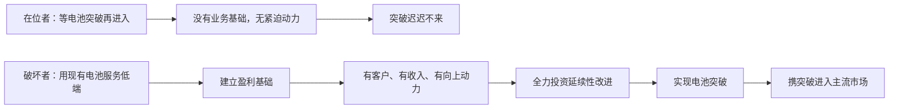

> 章节：第十章“管理破坏性技术变革：案例研究” 
> 作者：克莱顿·克里斯坦森（Clayton M. Christensen） 
> 笔记目标：按原书小节顺序还原“如何把全书原则用于一个真实待决问题”的完整思维流程，推导轨线交汇条件与电池增重的物理约束，并说明每一步的判据、假设与边界。

## 一、本章的性质与读法

### 1.1 这一章与前九章的根本不同

前九章是**理论建构**：从现象出发，提炼机制，验证边界。第十章是**理论应用**——作者把自己置于一个具体角色中，演示前九章的原则如何转化为一连串可执行的决策。

作者对本章目的作了极其克制的界定，这段声明必须逐字理解：

> 我撰写本章的目的**显然不是为了提供应对这一特定挑战的任何所谓的正确答案**，也**不是为了预测电动汽车是否可能，或者如何才能取得商业上的成功**。相反，我的目标就是为了表明，在一个熟悉但充满挑战的环境下，管理者怎样才能**通过提出一系列问题**（一旦提出了这些问题，可能会引出一个合理且实用的答案）来**发展他们看待类似问题的思维方式**。

**三重否定 + 一重肯定**，界定得极清楚：

| 本章**不是** | 本章**是** |
|---|---|
| 电动汽车的正确答案 | 一套**提问的顺序** |
| 对电动汽车前景的预测 | 一种**看待问题的思维方式** |
| 可照搬的方案 | 可迁移的**分析框架** |

**为什么这个界定如此重要**：如果把本章读作"作者预测电动汽车会成功/失败"，那么以今天的后见之明去评判其预测准确度，就完全错失了本章的价值。本章真正的可检验之处是：**这套问题序列是否完备？每个问题的判据是否可操作？**

### 1.2 为什么选电动汽车作载体

作者选择的载体具备几个理想属性：

1. **当时未决**——成书时结局未定，因此不可能是事后编排的故事（对比前九章的回溯案例）。
2. **争议极大**——"当前最让人头疼的创新项目"，专家意见严重分歧，正好检验框架能否在噪声中给出判断。
3. **熟悉**——读者对汽车有直觉，不需要行业前置知识。
4. **有外部干预**——加州法令的存在，使"技术是否真有破坏性"与"是否被强制要求做"这两个问题必须分开，这本身就是一次概念辨析的练习。

### 1.3 开篇的立场重申

> 能力不足、官僚作风、傲慢自大、管理队伍老化、规划不合理和投资短视**显然是导致许多企业最终失败的主要原因**。但我们已经知道，**即使是最优秀的管理者也会受到某些法则的制约**，而且这些法则会加大破坏性创新的难度。当优秀的管理者**不能理解，或者试图抗拒**这些法则的力量时，他们领导下的企业距离失败也就为期不远了。

**注意这里的措辞极为审慎**：作者**不否认**传统解释的有效性（"显然是主要原因"），只是指出它们**不足以解释本书关注的那一类失败**。这与第一章的立场完全一致——全书从未主张"管理不善不重要"，而是主张"还存在另一类失败，其成因是良好管理本身"。

### 1.4 全章的问题序列

作者的推进顺序本身就是方法论，可先建立全局视图：

**这个序列的顺序不可交换**：必须先判定性质（Q1），才能确定市场方向（Q2、Q3）；必须先有市场方向，才能定产品与技术（Q5、Q6）；渠道由市场决定（Q7）；组织形态由前面所有答案共同决定（Q8）。**先做组织设计再找市场，是常见的错误顺序。**

## 二、我们怎样才能判断出某项技术是否具有破坏性

### 2.1 背景与外部约束

| 时间 | 事件 |
|---|---|
| 20 世纪初 | 电动汽车在争夺主导汽车设计形式的竞争中**输给汽油动力汽车** |
| 此后 | "一直徘徊在传统汽车市场的**边缘**" |
| 20 世纪 70 年代 | 因"降低城市空气污染的特性"，研究迅速升温 |
| — | 加州空气资源管理委员会（**CARB**）强制规定：从 **1998** 年起，在加州销售汽车的厂商需确保电动汽车销量至少达到其加州总销量的 **2%**，否则**取消在加州销售汽车的资格** |
| 1996 | 因厂商反对，实施时间**推迟到 2002 年**（厂商理由："考虑到它们设计的电动车的性能和成本，市场对电动汽车的需求几乎为零"） |

### 2.2 第一个问题必须与法令切割

作者提出的首问是：

> 我们认为电动汽车获得成功的概率有多大？也就是说，**除了加州的强制性法令外**，电动汽车是否能对汽油动力汽车生产商构成**真正的破坏性威胁**？这是否是企业实现赢利增长的**一个机遇**？

**"除了加州的强制性法令外"是本节的方法论关键**。它把两个必须分开的问题分离：

| 问题 | 性质 | 答案影响什么 |
|---|---|---|
| 我们**被要求**做电动汽车吗？ | 合规问题 | 最低合规投入 |
| 电动汽车**本身**是破坏性技术吗？ | 战略问题 | 是否值得建立真实业务 |

**混淆二者的后果极其严重**：若只按合规逻辑行事，企业会用最小成本应付法令（做出难卖的车、游说推迟），从而**在真正的破坏来临时毫无准备**。反之，若误把政策红利当作真实需求，则会在补贴退坡时崩塌。

作者后文明确采取了这个立场：

> 我将强迫我的机构**凭借自己的能力和智慧来求得生存**，而不是依赖于**变化不定的补贴**，或是加利福尼亚州的法规（**并不是按照经济规律来制定**）来发展我的业务。

### 2.3 判定工具：轨线图

> 要回答这些问题，我需要**绘制一张市场要求的性能改善轨线，并将其与技术能够提供的性能改善轨线进行比较**……据我所了解，**这些图表是用来判断破坏性技术的最佳方法**。

这直接调用第一章（图 1.7）与第九章（图 9.5）的工具。**判定破坏性不靠定性直觉，靠两条曲线的相对位置与相对斜率。**

### 2.4 第一步：测量市场需求——观察而非询问

> 为了评估市场需求，应该**认真观察消费者实际上是如何使用产品的**，而不仅仅是听他们描述是如何使用产品的。相比组织访谈或跟踪调研小组来收集信息，**观察消费者实际如何使用产品能够提供更多更可靠的信息**。

这是第七章方法论（"观察行为 ≻ 询问意图"）与第九章 Quicken 案例的直接应用。

**观察得出的三项主流需求**（并与电动汽车当前能力对照）：

| 属性 | 主流市场需求 | 电动汽车当前能力 | 差距 |
|---|---|---|---|
| **续驶里程** | 125～150 英里 | 50～80 英里 | 不足约 **1.6～3 倍** |
| **加速性能** | 0→60 英里/小时 需 **10 秒**内 | 需将近 **20 秒** | 慢 **约 1 倍** |
| **车型选择** | "希望能够拥有很多种选择" | 初期产量小，无法提供同等选择 | 明显不足 |

**注意加速需求的判据不是偏好，而是安全**：

> 汽车驾驶者似乎需要能在 10 秒之内将时速从 0 提升至 60 英里的汽车（**在高速路入口坡道行驶时，只有达到这个加速度才能安全地并入高速行驶的车流**）。

这是一个**功能性硬约束**，不是"客户喜欢快车"。这个区分很重要——硬约束不可通过营销说服绕过，只能通过换市场（不需要上高速的场景）绕过。

**阶段结论**：

> 根据**几乎所有对功能性的定义**……电动汽车所能提供的功能**都逊色于**汽油动力汽车。

### 2.5 关键澄清：性能差 ≠ 破坏性

这是本节最重要的概念辨析，也是最常被误读之处：

> **但这一信息并不足以说明电动汽车具有破坏性产品的特性**，只有在我们发现电动汽车的**性能改善曲线**表明其在日后**有可能会发展为部分主流市场上具有竞争力的产品**时，我们才能说电动汽车是一种破坏性产品。

**严格表述破坏性的两个条件**：

$$
\text{破坏性}\iff\underbrace{S(0)<D(0)}_{\text{条件一：当前性能不足}}\ \wedge\ \underbrace{g_s>g_d}_{\text{条件二：改善更快}}
$$

**缺任一条件的后果**：

| 情形 | 判定 | 含义 |
|---|---|---|
| $S(0)\ge D(0)$ | **不是破坏性** | 直接可用于主流市场，属延续性或新的高端产品 |
| $S(0)<D(0)$ 且 $g_s\le g_d$ | **不是破坏性** | "如果这两条轨线是**平行**的，那么电动汽车就**不太可能成为主流市场上的一分子**" |
| $S(0)<D(0)$ 且 $g_s>g_d$ | **是破坏性** | "这种技术就**真的会给市场带来破坏性威胁**" |

**这个辨析排除了一个极普遍的误解**：很多人把"便宜的次品"都称作破坏性创新。按此判据，**一个永远追不上主流需求的低端产品不是破坏性技术，它只是低端产品。**

### 2.6 第二步：比较斜率
> **原书图示**：电动汽车与汽油动力汽车的性能轨线
**图 10.1 给出的两个斜率**：

| 轨线 | 年改善率 | 原因 |
|---|---:|---|
| **市场需求** | **不到 1%** | "**交通法规**对动力更加强大的汽车的使用施加了限制"，且"**人口、经济和地理**等因素也将普通驾驶者行驶英里数的增幅限制在每年不到 1%" |
| **电动汽车技术** | **2%～4%** | — |

**斜率比**：

$$
\frac{g_s}{g_d}=\frac{2\%\sim4\%}{1\%}=2\sim4\ \text{倍}
$$

**条件二成立**，因此：

> 这表明，如果技术的发展势头得以延续，电动汽车的市场地位**可能确实能得到提升**，也就是说虽然电动汽车目前还无法参与主流市场的竞争，但**日后还是有可能在主流市场占据一席之地**。

**注意市场需求斜率低的原因值得单独品味**：它不是"客户不想要更好的车"，而是**外部系统约束**（法规限速、通勤距离受地理与经济结构限制）。这与第三章挖掘机市场"物流限制铲斗容量增长"、第九章"整机换代后体积需求饱和"是同一类机制——**终端应用系统给需求增长设了天花板**。

### 2.7 结论与动机的重新表述

作者对自己判断依据的表述极为清晰：

> 作为一名汽车企业的主管，我之所以对电动汽车的未来感到担忧**并不是因为投资环境友好型技术符合政治上的需要**，而是因为**电动汽车具有破坏性技术的特性**。

**三条判据齐备**：

$$
\underbrace{\text{无法进入主流市场}}_{S(0)<D(0)}\ +\ \underbrace{\text{属性与主流价值网大相径庭}}_{\text{新价值网存在}}\ +\ \underbrace{g_s>g_d}_{\text{轨线收敛}}
$$

### 2.8 轨线交汇时点的完整推导

原书在脚注中给出了两个具体预测：

> 如果当前的性能改善速度得以延续，我们预计，到 **2015 年**，电动汽车的续驶里程将最终与主流市场要求的平均续驶里程交汇；到 **2020 年**，电动汽车的加速时间将与主流市场的需求交汇。

**这个预测可以严格复现。**

**建立模型**：设

$$
S(t)=S_0(1+g_s)^t,\qquad D(t)=D_0(1+g_d)^t
$$

交汇条件 $S(t^{*})=D(t^{*})$：

$$
S_0(1+g_s)^{t^{*}}=D_0(1+g_d)^{t^{*}}
$$

两边同除 $S_0(1+g_d)^{t^{*}}$：

$$
\left(\frac{1+g_s}{1+g_d}\right)^{t^{*}}=\frac{D_0}{S_0}
$$

取自然对数：

$$
t^{*}\ln\!\left(\frac{1+g_s}{1+g_d}\right)=\ln\!\frac{D_0}{S_0}
$$

$$
\boxed{\ t^{*}=\frac{\ln(D_0/S_0)}{\ln\!\big((1+g_s)/(1+g_d)\big)}\ }
$$

**符号与假设逐项说明**：

| 符号 | 含义 | 依赖的假设 |
|---|---|---|
| $S_0$ | 基准年技术供给性能 | 可用单一指标代表 |
| $D_0$ | 基准年市场要求性能 | 需求可用中位使用行为刻画 |
| $g_s$ | 技术改善年率 | **恒定**（历史速率延续） |
| $g_d$ | 需求增长年率 | **恒定** |
| $t^{*}$ | 交汇所需年数 | 越过阈值即可进入（忽略其他属性） |

**存在有限正解的条件**：$S_0<D_0$（分子为正）且 $g_s>g_d$（分母为正）。这正好就是 2.5 节的破坏性两条件——**公式本身就编码了判据**。

**数值验证**（取基准年 1995）：

**续驶里程**，$D_0=125$ 英里、$g_d=1\%$、$g_s=4\%$，反解需要的 $S_0$：

$$
S_0=\frac{125}{(1.04/1.01)^{20}}=\frac{125}{e^{20\times0.029270}}=\frac{125}{e^{0.5854}}\approx69.6\ \text{英里}
$$

$69.6$ 英里**恰落在原书给出的 50～80 英里区间内**。代入验证：

$$
t^{*}=\frac{\ln(125/70)}{\ln(1.04/1.01)}=\frac{0.5798}{0.02927}\approx19.8\ \text{年}\ \Rightarrow\ \mathbf{2015\ \text{年}}\quad\checkmark
$$

**加速时间**，从 20 秒改善到 10 秒（需求侧 $g_d\approx0$，因法规限制）：

$$
t^{*}=\frac{\ln(20/10)}{\ln(1+g_s)}=\frac{0.6931}{\ln(1+g_s)}
$$

令 $t^{*}=25$（1995→2020），反解：

$$
\ln(1+g_s)=\frac{0.6931}{25}=0.02772\ \Rightarrow\ g_s\approx2.8\%
$$

$2.8\%$ **同样落在原书给出的 2%～4% 区间内** $\checkmark$

**两个预测都可由公开参数复现**，说明图 10.1 的预测不是随意标注。

### 2.9 敏感性分析：这个预测有多稳健

诚实地看，$t^{*}$ 对参数极其敏感。以续驶里程为例：

| 情形 | $D_0$ | $S_0$ | $g_s$ | $t^{*}$（年） | 交汇年份 |
|---|---:|---:|---:|---:|---:|
| 乐观 | 125 | 80 | 4% | 15.2 | **2010** |
| 原书基准 | 125 | 70 | 4% | 19.8 | **2015** |
| 中值 | 140 | 65 | 3% | 39.1 | **2034** |
| 保守 | 150 | 50 | 4% | 37.5 | **2033** |
| 最保守 | 125 | 80 | 2% | 45.3 | **2040** |

**跨度从 2010 到 2040，长达 30 年。**

**这暴露了模型的根本局限**：$t^{*}$ 中的分母 $\ln((1+g_s)/(1+g_d))$ 是两个小数之差，**微小的斜率误差会被极度放大**。当 $g_s\to g_d$ 时，$t^{*}\to\infty$。

**因此正确的用法是**：

| 用途 | 是否可靠 |
|---|---|
| 判断**方向**（会不会收敛） | **可靠**——只取决于 $g_s>g_d$ 的符号 |
| 判断**排序**（哪个属性先交汇） | **较可靠** |
| 预测**具体年份** | **不可靠**——置信区间可达数十年 |

作者本人对此有清醒认识，脚注中明确说：

> 当然，这**并不是说未来就一定能够延续过去实现的历史性能改善速度**，技术人员**很有可能会遇到不可跨越的技术障碍**。

### 2.10 一个精妙的博弈观察

作者随即补上一句极有洞察力的话：

> 但我们所能确定的是，**推动破坏性技术人员找到能够跨越这些障碍的方法的动力**，与**阻碍成熟汽车生产商转战低端市场的阻力**几乎一样大。

**这是一个对称性论断**，值得展开：

$$
\underbrace{\text{破坏者突破技术障碍的动力}}_{\text{生存压力驱动}}\ \approx\ \underbrace{\text{在位者向下移动的阻力}}_{\text{价值观与资源分配驱动}}
$$

**含义**：即使技术障碍真实存在，也不能据此判断破坏不会发生——因为**攻方有极强动力去破解它，而守方有同样强的力量阻止自己去准备**。两股力量都由组织结构决定，不由技术难度决定。

这实际上把第八章的 RPV 框架用在了**预测**上：不是问"技术能不能突破"，而是问"**谁有动力去突破**"。

### 2.11 对专家意见的处理

这是本节方法论上最精彩的部分。

**专家意见一：性能永远追不上**

> 行业专家在比较两种技术的性能轨线后可能会坚持认为，电动汽车的性能**将永远无法达到汽油动力汽车达到的高度**。**他们的观点可能是正确的**，但回想一下硬盘驱动器行业专家的经历，他们只是**对错误的问题提出了正确的答案**。

**"对错误的问题给出了正确的答案"**是全章最锋利的一句话。它精确地指出了专家失效的机制：

| 专家在回答的问题 | 应该回答的问题 |
|---|---|
| 电动汽车能否**超越**汽油车？ | 电动汽车能否**达到某个细分市场的最低门槛**？ |
| 在**主流指标**上比较 | 在**新价值网的指标**上比较 |

第一个问题的答案很可能是"不能"，且这个答案是**正确的**——但它与破坏性无关。破坏从不要求新技术在旧指标上超越旧技术（第九章：液压挖掘机的铲斗至今不如缆索，5.25 英寸容量至今不如更大盘径）。

**专家意见二：必须等电池突破**

> 许多专家断言，**如果电池技术无法取得重大技术突破，电动汽车市场将永远无法形成足够的规模**。这样的观点可谓是不胜枚举，但**我并不会就此退缩**。

**作者的反驳依据**：

> 如果电动汽车被看做是**成熟市场价值网中的一种延续性技术**，那这些专家的观点**无疑是正确的**。但因为**专家在预测破坏性技术的性质和市场规模时总是与实际情况相差甚远**，因此我强烈质疑这些专家的疑虑是否合理。

**这个反驳的结构值得学习**：作者不说专家错了，而是指出**专家的结论有一个隐含前提**（把电动汽车当作延续性技术来评估）。在该前提下结论正确；换掉前提，结论失效。

**并保持了应有的谦逊**：

> ……**虽然我对自己的结论也不是很确定**。

### 2.12 现有厂商的立场作为佐证

作者引用福特电动汽车项目主管约翰·R·华莱士（1995 年 6 月 28 日 CARB 研讨会）：

> "**漫步者（Ranger）电动汽车**的销量大概能达到 **3 万辆**，车中配备的**铅酸电池**能使汽车续驶 **50 英里**……1998 年版电动汽车的销售形式将会很严峻，即将推出的产品将**无法达到消费者对续驶里程、成本或实用性的期望**。"

作者的类比：

> 考虑到电动汽车当前在这些参数方面的表现，**在主流汽车市场销售电动汽车的难度，相当于 1980 年在大型计算机市场销售 5.25 英寸硬盘的难度**。

**这个类比是全章的锚点**——它把一个陌生问题映射到一个已知结局的问题上。1980 年在大型机市场卖 5.25 英寸硬盘确实不可能；但这**丝毫不意味着** 5.25 英寸硬盘没有前途，只意味着**卖错了市场**。

## 三、电动汽车的市场到底在哪儿

确定性质后，作者转向市场营销战略，并调用三条原则。

### 3.1 原则一：主流市场不是答案（资源依赖 + 小市场原则）

> 首先，我承认，电动汽车在初始阶段**并不能应用于主流应用领域**……尽管对于市场到底在哪儿，我们尚无头绪，但我们所能确定的一件事就是，**这个市场不在成熟汽车市场**。

**一个非常有价值的推论**：

> 具有讽刺意味的是，我认为，由于**资源依赖理论**和"**小市场无法解决大企业的增长或赢利需求**"的原则，大多数汽车生产商都将**非常短视地将注意力全部集中在主流市场上**。因此，在寻找消费者的过程中，**我不会去效仿其他汽车生产商**，因为我认为，他们的**直觉和能力都用在了错误的目标上**。

**这一步是"用理论预测竞争对手行为"**：既然第五、六章的原则是普遍的，那么它们**同样约束着所有竞争对手**。因此可以预判——所有主流厂商都会往主流市场挤。这意味着：

$$
\text{主流市场}=\text{最拥挤且最不可能成功之地}
$$

$$
\text{边缘市场}=\text{无人竞争且唯一可能成功之地}
$$

**理论在这里从"解释工具"升级为"竞争情报工具"。**

### 3.2 原则一的推论：错误定位的普遍性

作者在脚注中给出了一组极有力的归纳：

> 不管创新的本质是延续性还是破坏性，值得注意的是，**好的企业都会本能地不断尝试将创新的目标转向当前的消费者基础**。

| 行业 | 企业 | 错误做法 |
|---|---|---|
| 机械挖掘机 | 比塞洛斯-伊利 | Hydrohoe 液压技术，"试图利用这一新产品来服务于**主流挖掘承建商**" |
| 摩托车 | 哈雷 | "试图通过**自己的经销商网络**推广它的低端品牌摩托车" |
| 汽车 | 克莱斯勒 | "在**小型货车**中配备了多块电池" |
| 计算机 | IBM | RISC 芯片"试图将 RISC 芯片运用到**主流的微型计算机产品**中" |

**IBM RISC 案例的完整过程**（引自福格森与莫里斯《计算机战争》）：

| 步骤 | 事件 |
|---|---|
| 1 | RISC **由 IBM 发明**，发明人用 RISC 芯片组装的计算机速度"**令人吃惊**" |
| 2 | IBM 投入"大量的时间、金钱和人力"，试图把 RISC 用于主流微型计算机 |
| 3 | 这"要求设计者对 RISC 芯片的设计作出**许多让步**"，方案**未取得成功** |
| 4 | RISC 团队几名核心成员**心灰意冷地离开 IBM** |
| 5 | 他们在 **MIPS** 与 **Sun** 的 RISC 业务创建中发挥关键作用 |
| 6 | MIPS 与 Sun 成功，因为"**接受了这种产品本来的属性**，并且发现了一个重视这些属性的市场——**工程工作站**" |
| 7 | IBM 失败，因为"**力图改变这项技术的属性，以使其适应已经建立的市场的需求**" |
| 8 | 有意思的是，IBM **后来通过推出自己的工程工作站**，终于成功构建了 RISC 芯片业务 |

**第 7、8 两步的对照是整个脚注的价值所在**：同一家公司、同一项技术，**改造技术去适配旧市场 → 失败；接受技术去寻找新市场 → 成功**。这与第九章 6.3 节"技术挑战 vs 市场营销挑战"的区分完全一致，且是**同一企业内的对照实验**。

### 3.3 先发的必要性

> 我的任务是**尽快找到一个能使用电动汽车的市场**，因为**率先进入破坏性技术市场的企业发展的能力要明显高于后来进入这一市场的企业**。

调用第六章的统计结论（37% vs 6%）。并给出完整路径：

> 在抢滩破坏性技术市场，并在这一市场**建立起一个能实现赢利的业务基础**后，企业将**全力投资相关的延续性创新**，并能非常成功地**面向主流市场逐级提高破坏性技术的市场定位**。

$$
\text{占据边缘市场}\ \to\ \text{建立盈利基础}\ \to\ \text{延续性改进}\ \to\ \text{逐级上移}
$$

**并明确否定了等待策略**：

> 迟迟进入破坏性技术市场（例如**等待实验室的研发人员开发出具有突破性的电池技术**）是管理者**遭遇阻力最小的一条道路**。但事实证明，这一战略**很难成为破坏性创新取得成功的一条可行的道路**。

**"遭遇阻力最小的道路"**这一表述精准——等待之所以流行，正因为它在组织内部**最容易被批准**（不需要动资源、不需要承担失败风险、听起来很审慎）。**组织阻力最小的路径通常不是战略最优的路径**，这是全书反复出现的主题。

### 3.4 劣势即优势：寻找什么样的客户

> 正如历史不断向我们展示的那样，**使得破坏性技术在主流市场不具竞争力的属性，实际上正是新兴价值网所注重的属性**。

| 案例 | 主流市场的"劣势" | 新市场的"优势" |
|---|---|---|
| 5.25 英寸硬盘 | 体积小 → 无法在大型机使用 | 体积小 → 正好符合台式机要求 |
| 早期液压挖掘机 | 铲斗小、半径短 → 无法满足普通挖掘 | 精确挖掘狭长沟渠 → 大受民用建筑承建商欢迎 |

**由此得出的搜索指令**（本节最反直觉的一句）：

> 尽管听起来有些奇怪，但我将引导我的市场营销人员去寻找那些潜在的购车需求尚未得到开发的购车者，也就是那些**需要加速时间相对较慢、续驶里程不超过 100 英里的汽车**的购车者。

**注意这个指令的形式**：它不是"寻找愿意将就的客户"，而是"**寻找把这些属性视为正面价值的客户**"。二者的区别是根本性的——前者永远是在卖次品，后者是在卖对的产品。

### 3.5 原则二：市场研究无效（第七章）

> 没有人能通过市场研究了解到电动汽车的早期市场到底在哪儿。我可能会**聘用顾问，但我能确定的唯一一件事就是，他们的发现将是错误的**。

**原因的严格表述**：

> 消费者自己也无法告诉我们他们是否需要电动汽车，或者他们可能会如何使用电动汽车，因为**在消费者发现他们将如何使用电动汽车的同时，我们也将发现这种产品的使用方式**——就像本田公司的"超级幼兽"摩托车打开了一个不曾预料到的新型应用领域。

**"在消费者发现的同时我们也发现"**——这是第七章"不可知（unknowable）"概念最精炼的表述：信息不是藏在客户脑中等待被问出，而是**在使用过程中被双方共同创造出来**。

**唯一有效的信息来源**：

> 市场唯一有价值的信息就是，通过**真正进入到市场**，通过**测试和探索**，通过**反复尝试**，通过**向真正愿意掏腰包的实际消费者销售实际的产品**，我们能够从中得到些什么。

**"真正愿意掏腰包"**是关键限定——问卷上的意向、焦点小组的赞许都不算数，**只有真实付费才是有效信号**。

**并顺带处理了政府补贴的影响**：

> 政府强制性指令可能会**影响，而不是解决**发现市场的问题。

补贴会**污染信号**：在补贴下发生的购买行为，无法区分"客户真的需要"与"客户在占便宜"。因此依赖补贴的企业**学不到真实的市场信息**。

### 3.6 原则三：学习计划而非实施计划（第七章）

> 我的创业计划必须是一个**学习的计划**，而不是一个**实施预先制订的战略的计划**。

> 尽管我们将竭尽所能地在首次尝试中就利用正确的产品和正确的战略来开发正确的市场，但**在实现业务计划最初设定的目标的过程中，很有可能会出现一个更好的业务发展方向**。因此，我必须**为错误作好准备**，并**尽快了解什么才是正确的发展道路**。

**并直接援引两个反面教训**：

> 我不能像**苹果公司在牛顿 PDA 项目**或是**惠普公司在 Kittyhawk 项目**中所做的那样，**将我所有的资源，或是我的机构所有的信誉孤注一掷地全部投入到首次尝试中**。我们需要**保存实力**，以备在**第二次或第三次尝试**中找到正确的市场。

这是第七章 7.4 节"多次小注优于一次重注"的直接应用：

$$
P(\text{成功})=1-(1-q)^{n},\qquad n=\left\lfloor\frac{B}{c}\right\rfloor
$$

**三条原则构成完整的市场营销战略基石**：

| 原则 | 来源章节 | 操作含义 |
|---|---|---|
| 一、市场不在主流 | 第五、六章 | 不效仿竞争对手，去边缘找客户 |
| 二、市场无法研究 | 第七章 | 靠真实销售试探，不靠调研 |
| 三、计划用于学习 | 第七章 | 分期投入，保留转向资源 |

## 四、潜在的市场：一些推测

作者明确标注这是**推测**，并给出了两个候选市场。

### 4.1 候选一：给青少年买车的父母

> 我的一名学生建议说，**中学生的父母**可能会成为电动汽车的一个潜在的巨大市场，因为他们会为他们的孩子购买汽车往返于**学校、朋友家和学校活动的地点**。

**为什么这个场景把劣势变成优势**：

| 电动汽车属性 | 在主流市场 | 在此场景 |
|---|---|---|
| 加速慢 | 安全隐患（无法并入高速） | **正是父母想要的**（防止孩子飙车） |
| 续驶里程短 | 无法长途 | **正是父母想要的**（限制活动半径） |
| 结构简单 | 功能不足 | **可靠、易维护、便宜** |

原书表述：

> 考虑到孩子们的基本交通需求，这些父母可能会认为电动汽车**简单的产品结构、较慢的加速时间和有限的行驶里程**是这些青少年汽车的**非常理想的属性**——特别是如果汽车的外形符合青少年的审美习惯的话。

**"非常理想的属性"（highly desirable attributes）**——这不是妥协，而是**同一物理属性在不同权重体系下的价值反转**（第九章 6.1 节）。

**并给出了发现方法的提示**：

> 倘若采用了正确的市场营销方法，谁知道最终会产生什么样的结果？**早期的本田公司的市场营销人员就是骑着本田摩托车遇到了他们未来的消费者。**

呼应第七章：本田的市场不是调研出来的，是三个人骑车兜风时被路人看见的。

### 4.2 候选二：南亚城市的出租车与小包裹送货车

> 另一个可能发展为电动汽车早期市场的应用领域可能是**南亚一些城市的出租车或小包裹送货车**。

**匹配理由**：

| 城市特征 | 对电动汽车的含义 |
|---|---|
| "还在不断发展，日益**拥堵、嘈杂，且污染状况十分严重**" | 环保与静音成为**正价值** |
| "曼谷每天的交通拥堵状况都非常严重，汽车的**时速永远达不到 30 英里**" | 加速与最高速度**不构成约束** |
| "电动汽车**被堵在路上时并不会消耗电池的电力**" | **劣势直接转为优势** |
| "小型汽车便于**操作和停车**" | 进一步加分 |

**"堵车时不耗电"这一点尤其精彩**——它是内燃机的固有缺陷（怠速耗油）与电动机的固有优势（静止零消耗）的直接对比。在自由流动的公路上这个差异无关紧要，**在极端拥堵的城市里它变成了核心价值**。

**可以粗略量化**：若车辆有 50% 的时间处于怠速状态，内燃机在这段时间内的燃料消耗全部是浪费，而电动车消耗约为零。这意味着在此场景下，两种技术的**有效能耗差距**远大于标称工况下的差距。

### 4.3 作者对这些推测的定性

> 不管这些或其他类似的市场理念**最终是否可行**，它们至少**都符合破坏性技术出现和发展的规律**。

**这句话界定了推测的价值**：这些猜测的意义**不在于猜对**，而在于**演示了合格猜测的形态**——即"寻找一个把当前劣势视为优势的场景"。用第七章的语言说，它们是**待验证的假设**，而非结论。

## 五、今天的汽车企业应如何销售电动汽车

作者用真实的行业言论作为反面对照。

### 5.1 克莱斯勒的方案

引用克莱斯勒区域销售部销售总经理**威廉·格劳布**（1995 年 6 月 28 日 CARB 研讨会）：

> 克莱斯勒公司计划在 1998 年及时推出一款**全新的小型电动货车**。在认真研究**专门建设一个汽车平台**和**对现有平台进行修改**两种方案后，现在看来对我们来说，选择**利用电动平台生产小型货车**显然是最佳的选择。我们的经验表明，**车队**可能将是销售电动汽车的最好机遇……我们面临的问题**不在于创造具有吸引力的一揽子计划**。新型小型货车就是一个有吸引力的计划。**真正的问题是这种汽车并不具备足够的能量存储能力。**

**注意最后一句的问题定义**："真正的问题是**能量存储能力不足**"——这是把挑战定义为**技术挑战**（第九章 6.3 节的失败模式）。

### 5.2 定位错误导致的连锁后果

> 为了在主流市场销售电动汽车，克莱斯勒公司必须为新型小型电动货车配备**重达 1600 磅的电池**，这当然会**增加电动货车的加速时间，缩短行驶里程，并增加制动距离**，而且这三项指标均**低于任何一种汽油动力汽车**。

**这里可以做一个物理推导，说明为什么"堆电池"是自我挫败的。**

#### 5.2.1 加速性能的退化

设整车原质量 $m$，电池增重 $\Delta m$。在驱动力 $F$ 不变时，由牛顿第二定律：

$$
a=\frac{F}{m}\ \longrightarrow\ a'=\frac{F}{m+\Delta m}
$$

加速时间与加速度成反比，故：

$$
\frac{t'}{t}=\frac{a}{a'}=\frac{m+\Delta m}{m}=1+\frac{\Delta m}{m}
$$

**代入数值**：设小型货车整备质量约 4000 磅，$\Delta m=1600$ 磅：

$$
\frac{\Delta m}{m}=\frac{1600}{4000}=40\%
$$

$$
\frac{t'}{t}=1.40
$$

**加速时间延长 40%**。若原本 0→60 需 12 秒，加电池后需约 16.8 秒。

#### 5.2.2 制动距离的退化

**这里需要小心**：在理想干摩擦模型下，制动距离

$$
d=\frac{v^{2}}{2\mu g}
$$

**与质量无关**（因为摩擦力 $\mu mg$ 与惯性 $m$ 同比例增长）。那么原书说的"增加制动距离"从何而来？

真实机制在于**能量耗散能力的限制**。制动需要把动能全部转化为热：

$$
E_k=\frac{1}{2}mv^{2}
$$

质量增加 40%，需耗散的能量也增加 40%：

$$
\frac{E_k'}{E_k}=\frac{m+\Delta m}{m}=1.40
$$

制动系统的热容量与散热能力是按原设计质量确定的，超出后会出现**制动衰退**（brake fade），实际摩擦系数 $\mu$ 下降，从而 $d$ 增大。此外轮胎负荷超出最优区间也会使有效 $\mu$ 下降。

**这个辨析很重要**：不加区分地说"更重的车刹车距离更长"在理想模型下是错的；正确的机制是**能量耗散超出系统设计裕度**。

#### 5.2.3 续驶里程的自我挫败：递减收益的严格推导

这是本节最有价值的推导，它揭示了"堆电池"路线的**结构性天花板**。

**建模**：设

- $m_b$：电池质量
- $E=k\,m_b$：电池总能量（与电池质量成正比，$k$ 为比能量）
- $e=e_0+c\,m_b$：每英里能耗（$e_0$ 为空载基础能耗；$c\,m_b$ 为电池自重带来的额外滚阻与加速能耗）

则续驶里程为：

$$
R(m_b)=\frac{E}{e}=\frac{k\,m_b}{e_0+c\,m_b}
$$

**求边际收益**（对 $m_b$ 求导，用商法则）：

$$
\frac{dR}{dm_b}=\frac{k(e_0+c\,m_b)-k\,m_b\cdot c}{(e_0+c\,m_b)^{2}}=\frac{k\,e_0}{(e_0+c\,m_b)^{2}}>0
$$

**导数恒正但分母随 $m_b$ 平方增长**，故边际收益**单调递减**。

**求极限**（$m_b\to\infty$）：

$$
\lim_{m_b\to\infty}R(m_b)=\lim_{m_b\to\infty}\frac{k\,m_b}{e_0+c\,m_b}=\frac{k}{c}
$$

$$
\boxed{\ R_{\max}=\frac{k}{c}\ }
$$

**结论：无论装多少电池，续驶里程都存在一个由"比能量 $k$"与"每单位电池质量带来的额外能耗 $c$"之比决定的硬上限。**

**数值演示**（取 $k=1$、$e_0=1$、$c=0.004$，单位任意）：

| 电池质量 $m_b$ | 续驶里程 $R$ | 相对上一行的增益 | 占上限比例 |
|---:|---:|---:|---:|
| 100 | 71.4 | — | 28.6% |
| 200 | 111.1 | +55.6% | 44.4% |
| 400 | 153.8 | +38.5% | 61.5% |
| 800 | 190.5 | +23.8% | 76.2% |
| 1600 | 216.2 | +13.5% | 86.5% |
| 3200 | 231.9 | **+7.2%** | 92.8% |
| $\to\infty$ | **250.0** | — | 100% |

**电池从 1600 翻倍到 3200，里程只增加 7.2%。**

**这个推导的战略含义极其重要**：

1. **它解释了为什么厂商会索求"电池技术突破"**——因为在既有 $k$ 下，堆量的路已走到尽头，只能靠提高 $k$（比能量）来抬高天花板。厂商的诉求在**其自身路线内是完全理性的**。
2. **但它也揭示了这条路线是自我设限的**——之所以需要突破，是因为**选择了必须满足主流里程要求这一目标**。若换一个只需 50 英里的市场，现有 $k$ 完全够用。

$$
\underbrace{\text{必须达到 150 英里}}_{\text{延续性目标}}\ \Rightarrow\ \underbrace{\text{必须堆电池}}_{\text{陷入递减收益}}\ \Rightarrow\ \underbrace{\text{必须等电池突破}}_{\text{无限期推迟}}
$$

**目标的选择，而非技术的极限，决定了是否需要突破。**

**模型的假设与边界**：

| 假设 | 现实偏离 |
|---|---|
| 电池能量与质量严格成正比 | 封装、热管理有固定开销 |
| 额外能耗与电池质量线性相关 | 高速时空气阻力占主导，与质量无关 |
| 忽略结构加强带来的连锁增重 | 实际存在"增重螺旋"，会使情况**更差** |
| 忽略再生制动回收 | 城市工况下可部分缓解 |
| $k$、$c$ 恒定 | 技术进步会同时改变两者 |

即便有这些简化，**存在渐近上限**这一定性结论是稳健的。

### 5.3 成本对比与市场的必然反应

> 由于克莱斯勒公司对电动汽车的市场定位，**行业分析人士很自然地会按照主流价值网最看重的指标来比较**小型电动货车与小型汽油动力货车。

| 产品 | 预期成本 |
|---|---:|
| 克莱斯勒小型**电动**货车 | **10 万美元** |
| 小型**汽油动力**货车 | **2.2 万美元** |

成本倍数：

$$
\frac{100\,000}{22\,000}\approx4.55\ \text{倍}
$$

> **任何有理性的人都不会考虑购买克莱斯勒公司的电动汽车产品。**

**注意"很自然地"三个字**：一旦你把产品放进主流货架，**比较框架就自动由主流价值网决定**，你无法要求客户换一套标准来看你。**定位决定了比较维度，比较维度决定了结论。**

### 5.4 克莱斯勒的结论"无疑是正确的"

格劳布的进一步表述：

> 市场之所以能够获得发展就是因为消费者希望拥有优质的产品。**没有哪位销售人员能在主流市场上推销边缘产品**，并且抱有建立可持续的消费者基础的希望。销售人员不能强迫消费者购买他们不想要的产品，**政府法令并不能作用于由消费者驱动的自由市场经济**。要在市场上为电动汽车找到一个应用领域，电动汽车就必须发展成**能与今天的汽油动力汽车相媲美的高品质产品**。

**作者的评价极为微妙，必须准确理解**：

> **考虑到市场营销人员看待这一挑战的方式，克莱斯勒公司的结论无疑是正确的。**在破坏性技术发展的初期，**主流消费者从来都不会选择使用破坏性产品**。

**作者没有说克莱斯勒错了**，而是说：**在其给定的前提下，推理完全正确**。错的是**前提**——"必须在主流市场销售"。

这与第九章礼来案例、第八章 DEC 案例的结构完全相同：**每一步推理都对，前提错了，于是结论正确地导向失败。**

### 5.5 关键澄清：数据是定位的产物，不是技术的属性

作者在脚注中给出了本节最重要的一句方法论提醒：

> 需要指出的重要一点就是，克莱斯勒公司公布的有关小型电动货车的这些统计数据是**由该公司在市场上推广这种破坏性技术的方式决定的**；这些数据**并不是电动汽车本身具备的属性**。电动汽车设计本来的用途是**各种轻型应用领域**。例如，**通用汽车公司设计的一款电动汽车的续驶里程就达到了 100 英里**。

**对照**：

| | 克莱斯勒（改装小型货车） | 通用（专门设计） |
|---|---|---|
| 定位 | 主流货车市场 | 轻型应用 |
| 结果 | 1600 磅电池、10 万美元、性能全面劣于燃油车 | **续驶 100 英里** |

**同一时期、同一技术水平，因定位不同而呈现完全不同的"客观数据"。**这是对"用数据说话"的一个深刻警示：**数据从来不是中立的，它是设计选择的函数。**

$$
\text{观测到的性能}=f(\text{技术},\ \textbf{定位选择})
$$

## 六、我们应采取什么样的产品技术和经销策略

这是一个过渡小节，引出接下来三个子战略：产品开发、技术战略、经销战略。

## 七、破坏性创新的产品开发

### 7.1 鸡生蛋问题

> 指导我们的工程师设计我们的第一款电动汽车将是一个不小的挑战，因为这里牵扯到一个经典的**有关鸡生蛋还是蛋生鸡的问题**：**没有市场就无法获得足够的或者是可靠的消费者信息；没有能够满足消费者需求的产品就不会有市场。**在这样一种真空状态下，我们怎样才能设计好产品呢？

$$
\text{可靠的客户信息}\xleftarrow{\text{需要}}\text{市场存在}\xleftarrow{\text{需要}}\text{合适的产品}\xleftarrow{\text{需要}}\text{可靠的客户信息}
$$

**循环依赖**。这正是第七章"不可知"命题的工程版本。

**作者的破局思路**：既然无法从客户处获得信息，就从**产业演化规律**中获得设计原则。

### 7.2 依据第九章：性能过度供给已在汽车业发生

> 最具指导价值的是**第九章**的内容，因为这一章指出，**竞争的基础会随着产品生产周期的变化而发生改变**，而变化周期本身则是受到**性能过度供给**的推动。

**判定汽车业是否已过度供给**：

> 汽车**车身和发动机的尺寸**、将**时速从 0 提升至 60 英里所需的时间**，以及消费者**应对过多选择的能力**都面临许多**实际的限制**。因此，我们几乎可以断定，产品竞争和消费者选择的基础将**从这些功能性指标转向其他属性，例如可靠性和便捷性**。

**这正是第九章购买等级的推进**：

$$
\text{功能性（已饱和）}\ \longrightarrow\ \text{可靠性 · 便捷性（未饱和）}
$$

### 7.3 历史验证：北美市场的新进入者靠什么取胜

> 这一趋势也从**过去 30 年间大多数成功进入北美市场的新兴企业**的身上得到了验证；这些新兴企业之所以能获得成功**并不是因为它们推出了具有超强功能的产品**，而是因为它们**参与竞争的基础是可靠性和便捷性**。

**丰田的完整轨迹**（与第八、九章的例子互相印证）：

| 阶段 | 产品 | 竞争基础 | 留下的空隙 |
|---|---|---|---|
| 进入 | **珂罗娜**（"功能简洁、性能可靠"） | 可靠性 | — |
| 上移 | 凯美瑞、普瑞维亚、**雷克萨斯**（"特色更加鲜明和功能性更强"） | 功能性 | **低端竞争真空** |
| 后继者 | **通用土星**、**韩国现代** | 土星："为消费者的购车和用车体验提供**一条龙式的可靠、便捷的服务**" | — |
| 再上移 | 土星"很快也将转战高端市场" | — | **又一个新的竞争真空** |

作者的观察：

> 从而为**更新的新兴企业**进入低端市场，提供**更简单、更便捷**的交通服务创造了一个**新的竞争真空**。

**这是"左上牵引力"的循环再现**：每一代破坏者上移后，都会为下一代破坏者腾出位置。**破坏不是一次性事件，而是一个持续运转的机制。**

### 7.4 破坏性技术的共同形态

> 相比之前的产品，本书探讨过的**每一种**破坏性技术的**体积都要更小、结构更为简单、使用更为方便**。**每一种**破坏性技术最初的应用领域都是**更加注重简单性和便捷性的新型价值网**。

**本书内的验证清单**：

| 领域 | 破坏性产品 | 相对于 |
|---|---|---|
| 存储 | 体积更小、结构更简单的硬盘 | 更大盘径 |
| 计算 | 台式与便携式计算机 | 大型机、微型机 |
| 工程机械 | 液压反铲挖土机 | 缆索挖掘机 |
| 钢铁 | 小型钢铁厂 | 综合性钢铁厂 |
| 医疗 | 胰岛素注射笔 | 注射器 |

**脚注中的扩展清单**（本书未展开但符合同一模式）：

> 台式复印机、外科缝合器、便携式晶体管收音机和电视机、螺旋扫描录像机、微波炉、气泡喷墨打印机。

并指出共同结局：

> 后来，不论是在它们最初的市场还是在主流市场上，这些破坏性技术都**占据了主导地位**，而且这其中的**每一种技术最初都是以简单性和便捷性作为主要的价值主张**。

**十余个跨行业案例支持同一形态**，这为下面的设计原则提供了归纳基础。

### 7.5 三条设计准则

#### 准则一：简单、可靠、便捷

> 这种汽车必须具有**简单、可靠和便捷**的特性。例如，这可能意味着，我们一个长期的技术目标就是，**利用较为普遍的供电服务来寻找一种给电池快速充电的方法**。

**注意这个技术目标的选择逻辑**：不是"提高电池能量密度"（那是延续性目标，服务于里程），而是"**用普通电源快速充电**"（便捷性目标）。**目标属性的选择，直接决定了研发方向。**

#### 准则二：可低成本快速改型的产品平台

> 由于**没有人知道产品的最终市场在哪儿**，或者市场将最终如何使用这种产品，因此，我们必须设计出一个能够**以较低的成本迅速对产品的特色、功能和外形进行变更**的产品平台。

**并给出具体操作**：

> 尽管我们可能会**首先以这个市场为目标**（青少年市场），但**事实很有可能证明我们最初的想法是错误的**。因此，我们应该**尽快推出第一款车型，并将这种车型小规模地投放市场**——**一旦得到市场的反馈，我们仍然拥有足够的预算来开发正确的车型**。

**这是第七章"模块化 + 分期承诺"原则的产品化**。回忆第七章推导的模块化判定条件：

$$
p<\frac{1}{1+\delta}
$$

其中 $p$ 是预测兑现概率、$\delta$ 是失去规模经济的成本惩罚。对一个**完全未知**的市场，$p$ 极低，因此**模块化平台几乎必然占优**。

#### 准则三：低价格点，但可接受更高使用成本

> 我们必须确定一个**较低的价格点**。采用了破坏性技术的产品的**标价通常应该低于主流市场上使用的产品，但它们的使用成本则通常要更高一些**。

**两个历史验证**：

| 案例 | 单价 | 单位使用成本 |
|---|---|---|
| 小盘径硬盘 | **更低**（"符合个人电脑生产商对**总体价格点**的要求"） | **更高**（"单位容量价格通常要高于体积更大的硬盘"） |
| 早期液压挖掘机 | **更低**（"价格要低于成熟的缆索挖掘机"） | **更高**（"每小时挖掘每立方码土方的总成本则要高得多"） |

**推论到电动汽车**：

> 即使**每英里行驶成本要更高一些**，但我们的电动汽车的**标价必须低于汽油动力汽车的普遍价格**。

**为什么是标价而非总拥有成本**：

> **从历史数据来看，消费者一直在为便捷性支付更高的溢价。**

**这一准则的深层逻辑**：破坏性产品服务的是**此前无法消费该产品的客户**（非消费者）。对他们而言，约束是**购买门槛**（能不能买得起），而非使用效率。降低门槛才能打开市场；使用成本的劣势由新客户的价值排序所吸收。

$$
\text{关键约束}=\text{准入价格}\quad\text{而非}\quad\text{单位效率}
$$

**这也直接反驳了 5.3 节克莱斯勒的 10 万美元定价**——它在准入价格上完全违反了这条准则。

## 八、破坏性创新的技术战略

### 8.1 核心原则：不得依赖技术突破

> 在通往成功的道路上，我们的技术规划**并不能要求这一项目取得任何技术上的突破**，这一点**至关重要**。

**历史依据**：

> 从历史上看，破坏性技术**一直不涉及新技术**；相反，构成破坏性技术的各个组件所采用的都是**经过验证的技术**，破坏性技术只是**将这些组件组合成一种全新的产品结构**，并且为消费者提供了一些他们**之前从未体验过的新属性**。

**严格表述**：

$$
\text{破坏性创新}=\underbrace{\text{成熟组件}}_{\text{已验证}}+\underbrace{\text{新的产品结构}}_{\text{重新组合}}\ \Rightarrow\ \underbrace{\text{新的属性组合}}_{\text{服务新价值网}}
$$

**这与第六章表 6.1 的统计完全一致**：用**成熟技术**进入**新市场**（右下象限）成功率最高（36%），而用**新技术**进入市场的成功率反而更低（13%）。

**为什么依赖技术突破是致命的**：它把项目的成败押在一个**不可控、无时间表**的外部事件上。在等待期间，组织的耐心、预算与人才都会流失（第七章 Kittyhawk 的教训）。

### 8.2 主流厂商的立场

**福特·约翰·R·华莱士**：

> 当前的困境就是，**今天的电池并不能满足这些消费需求**。任何熟悉当前的电池技术的人员都会告诉你，**电动汽车还没有为它的黄金时期作好准备**。预计将在 1998 年上市的所有的电池都无法达到消费者要求的 **100 英里**的续航里程。**对于续航里程和成本问题，唯一的解决方案就是改善电池技术。**为了确保电动汽车能够取得商业上的成功，我们应**集中我们的资源来开发电池技术**。

**克莱斯勒·威廉·格劳布**：

> 即将投入使用的**先进铅酸电池**给电动汽车提供的能量**还不到两加仑汽油的燃料存储容量**，这就像是**每天开着"燃油不足"指示灯还在闪烁的汽车离开家门**。换句话说，**电池技术还没有作好准备。**

**"每天开着燃油不足指示灯出门"是一个非常生动的比喻**——但请注意，它只在**你必须像开燃油车一样使用这辆车**的前提下成立。在一个每天行驶不超过 30 英里、夜间可充电的场景里，这个比喻完全失效。

### 8.3 作者的诊断：需求是定位的产物

> 这些企业之所以将**电池技术的突破视为电动汽车通往商业化成功道路上的一个重大瓶颈**，是因为这些企业的管理人员**将他们的注意力和对产品的定位都放在了主流市场**。

**具体到两家公司**：

| 企业 | 主流定位 | 由此产生的技术要求 |
|---|---|---|
| 克莱斯勒 | 小型电动货车 | 需承载货物 + 主流里程 → 巨量电池 |
| 福特 | 电动漫步者 | 皮卡 + 主流里程 → 同上 |

**关键论断**：

> 考虑到这一市场定位，它们**要求本质上属于破坏性技术的电动汽车产生延续性技术的影响**。**它们要求电池技术取得突破，因为它们选择将电动汽车视为一种延续性技术。**

**因果方向必须看清**：

$$
\underbrace{\text{选择主流定位}}_{\text{原因}}\ \Rightarrow\ \underbrace{\text{必须满足主流性能}}_{\text{导出的约束}}\ \Rightarrow\ \underbrace{\text{必须等电池突破}}_{\text{结论}}
$$

**"必须等突破"不是技术事实，而是定位选择的推论。**结合 5.2.3 节的递减收益推导，这一点在数学上也成立：只有当目标里程设定在 $k/c$ 附近或之上时，才必须提高 $k$。

**反向推论**：

> 如果企业的管理人员选择**利用或遵守破坏性技术的基本原理，并创造一个能将电动汽车的劣势转化为优势的市场**，那么他们领导下的企业**可能就不会对电池技术的突破提出要求**。

### 8.4 一个反直觉的预测：谁将实现电池突破

作者给出了本章最具预测性的论断：

> 那么电池技术的进步最终将由哪些企业来创造呢？参考历史记录，我们就能得出以下结论：最终成功地实现电池技术突破，并将电动汽车的续航里程提高到 150 英里的企业，将是那些**率先利用经过检验的技术创造了一个新价值网，然后通过发展所需要的延续性技术将产品推向更具吸引力的高端市场的企业**。

**推理依据**：

> 我们的发现是，**管理良好的企业通常都具有向上移动的倾向，却很难实现向下流动**。因此，这表明，**最有动力力争实现电池技术突破的实际上是破坏性创新者**。他们在试图进入规模更大、利润更丰厚的主流市场之前，**已经为电动汽车构建了一个低端市场**。

**这个论断的结构极为精巧**：

**核心洞察**：**延续性改进的动力来自"已经有一个想要向上移动的业务"，而不是来自"想要进入一个还没进入的市场"。**在位者缺的不是资源，而是**位置**——他们站在市场之外，因而没有向上的阶梯可爬。

$$
\text{延续性突破的动力}\ \propto\ \text{已建立的低端业务基础}
$$

## 九、破坏性创新的经销战略

### 9.1 核心命题

> **破坏性产品重新定义主要经销渠道几乎已成为一个定律**，因为**经销商所遵从的经济学原理（他们获取利润的方式）与生产商一样，在很大程度上是由主流价值网决定的**。

**这是第二章价值网理论向渠道侧的延伸**：渠道不是中立的管道，而是**价值网的组成部分**，有自己的成本结构与盈利模式。

### 9.2 三个历史验证

| 案例 | 旧渠道 | 旧渠道的经济基础 | 新渠道 |
|---|---|---|---|
| **索尼**（便携晶体管收音机/电视） | 家电和百货店 | "**销售支持和现场服务网络成本高昂**"（销售真空管家电的必要条件） | **销量导向型、低成本折扣零售商** |
| **本田**（小型摩托车） | 主流摩托车经销商 | 高端摩托车利润率高 | **体育用品零售商** |
| **哈雷**（收购的意大利小型摩托车） | 自有经销商网络 | 同上 | **失败**——"经销商拒绝销售" |

**哈雷失败原因的精确表述**：

> 哈雷公司收购的意大利品牌（小型摩托车）的**形象和经济价值并不符合经销商网络对市场的定位**。

注意有两重不匹配：**形象**（品牌调性）与**经济价值**（利润模型）。后者往往更具决定性。

### 9.3 经济学解释

> 破坏性技术和新的经销渠道之所以经常步调一致，还是由于**经济方面的原因**。正如第四章提到的**克雷斯吉公司和伍尔沃思公司**的发展史所表明的那样，零售商和经销商的**赢利模式通常非常明确**。

**三种典型的渠道盈利模式**：

| 模式 | 特征 | 第五章的对应 |
|---|---|---|
| 高毛利低周转 | "主要销售**利润率较高的高价产品**，这样即便销售量较低仍能实现赢利" | 百货店：加价 40%、周转 4 次 |
| 低毛利高周转 | "主要销售**利润率非常低**……但能通过**较高的产品销售量**来实现赢利" | 折扣店：加价 20%、周转 8 次 |
| 服务型 | "通过为已经售出的产品**提供售后服务**来获取利润" | 现场服务网络 |

（第五章曾推导：库存投资回报率 $\text{ROI}=u\times T$，三种模式可达到相近的回报，但**路径完全不同**。）

**结论**：

> 由于破坏性技术**并不符合成熟企业提高赢利的经营模式**，因此**也不符合成熟企业的经销商的营销模式**。

**渠道冲突不是态度问题，是算术问题**——一款低价、低毛利、无需现场服务的产品，放进按高毛利+服务收入设计的渠道里，经销商每卖一台都在损害自己的单位经济性。

### 9.4 由此确立的战略前提

> 因此，我为我的电动汽车项目设置了一个**基本的战略前提**，即**需要为电动汽车寻找或创造新的经销网络**。**除非有确凿的证据证明我的想法是错误的**，否则我敢保证汽油动力汽车的主流经销商**都不会像我们这样，将具有市场破坏性的电动汽车视为取得成功的关键要素**。

**注意"除非有确凿的证据证明我的想法是错误的"这一表述**——这是把"需要新渠道"设为**默认假设**（null hypothesis），要求反方举证。这是第七章"发现驱动型规划"的正确用法：**先明确写下假设，并规定推翻它需要什么证据。**

## 十、什么样的机构最适合进行破坏性创新

### 10.1 为什么组织问题必须最后回答、也必须回答

> 在将电动汽车看做是一种潜在的破坏性技术，为寻找潜在的市场设定一个较为现实的方向，并为产品的设计、技术和经销网络确定战略参数**之后**，作为项目经理，我将把我下一步的工作重心转移到**机构建设**上来。

**顺序的重要性**：组织形态是**由前面所有答案推导出来的**，不是预先选定的。

**为什么它不可省略**：

> 创造一个有利于项目发展的机构环境**至关重要**，因为**不管高级管理层是否公开表示支持这一项目，成熟企业内合理的资源分配流程总是会使破坏性技术无法得到赖以生存的资源**。

**"不管高级管理层是否公开表示支持"**——这直接呼应第七章 DEC 四进四退、第五章的资源分配机制：**高层意志无法穿透资源分配流程**。

## 十一、设立一个独立的分支机构

### 11.1 依据与先例

> 正如我们在第五章对**资源依赖理论**的探讨中所看到的那样，成功地在破坏性技术变革中建立了市场优势地位的成熟企业，一般都是那些**从母公司分拆出一个独立、自主经营的机构**的企业。

**五个先例**：昆腾、数据控制、IBM 个人电脑部门、艾伦-布拉德利、惠普。

**成功的共同点**：

> 这些企业都设立了**成败维系于破坏性技术能否取得商业化成功的独立机构**。也就是说，这些企业**在新兴价值网内成立了一个专门的机构**。

**"成败维系于"（whose fortunes depended on）是关键判据**——不是"设了一个部门"，而是"**这个组织的生死取决于这项业务是否成功**"。

### 11.2 独立机构的四重作用

作者逐条论证了独立机构解决什么问题。

#### 作用一：让资源依赖为我所用

> 在一个独立的机构中，我最好的员工能**集中精力开发电动汽车**，而不会**不断分神去帮助当前客户（作为我们当前收入的主要来源）解决他们面临的棘手问题**。另一方面，**来自我们自己的消费者的需求也将有助于我们专注于开发自己的项目，并为项目的发展提供动力和支持**。

**注意这是"利用"而非"对抗"**（第五章的核心思想）：不是要摆脱客户的影响力，而是**换一批客户**，让客户压力指向正确方向。

$$
\text{主组织内}:\ \text{客户压力}\ \to\ \text{拉走资源}
$$

$$
\text{独立机构内}:\ \text{客户压力}\ \to\ \text{推动项目}
$$

#### 作用二：让小市场变得重要（第六章）

> 在未来很多年内，电动汽车市场的规模将会很小，因此**不太可能为主要汽车生产商损益表上的收入或收益作出太大的贡献**。由于预计这些企业的高层管理人员不会优先关注，或将资源优先提供给电动汽车项目，因此，**公司内最优秀的管理人员和工程师也就不太可能会愿意加入我们的项目**，因为他们会不可避免地将我们的项目视为**一个对公司财务无足轻重的项目**。为了确保他们在公司内的发展前途，他们会很自然地**更倾向于参与主要项目，而不是边缘项目**。

**这里揭示了一条常被忽略的传导链**：

**规模问题最终变成了人才问题**——这是第六章规模匹配原则的一个重要延伸。

**独立机构如何切断这条链**：

> 在这项新业务开展的早期，订单数量可能**只是寥寥数百，而不是数以万计**。如果我们非常幸运地获得了一些收益的话，也几乎可以肯定收益的规模会比较小。**在一个独立的小型机构，这些较小的收益就能够激发员工的能量与热情。而在主流机构，这样的小收益只会引发对是否应开展这项业务的质疑。**

作者补上一句极实际的话：

> 我希望**我所在机构的消费者**能够回答这一问题——即我们是否应开展这项业务。作为项目经理，我**不希望把宝贵的时间和精力花费在不断地向主流机构的效率分析师解释这项业务存在的意义上**。

**让市场而非内部评审来裁决项目的存废**——这既节省了管理精力，也保证了裁决依据的正确性。

#### 作用三：让全员相信项目是必经之路

> 创新的过程总是**充满各种困难和不确定性**。有鉴于此，我总是希望能够确保……**项目的每一位参与者都认为机构必须走这条道路才能实现更高的增长率和更大的利润**。

**为什么这至关重要**（呼应第六章 8.1 节）：

> 如果大家普遍认为我的项目就是在沿着这样一条道路发展，那么**在发生不可避免的问题时**，我确信机构将与我一道**采取一切必要的举措来解决问题**。另一方面，如果公司内的关键性人物认为我的项目对机构的增长和赢利**无足轻重**，或者（**甚至更糟**）认为会**对公司的赢利产生不利的影响**，那么，**即使这项技术很简单，这个项目也不会取得成功**。

**"即使这项技术很简单"**——再次强调技术难度不是决定因素。

**两条路径的比较**：

> 我可以采取两种方式来应对这一挑战：我可以**努力说服主流机构的每一个人**，使他们完全确信破坏性技术是可以实现赢利的；或者我可以**创建一个规模足够小、成本结构较为合理的机构，而且机构内的每一个人都认为我的项目是通往成功的必经之路**。**两种方法都在管理上面临挑战，但后一种方法显然要容易处理得多。**

$$
\underbrace{\text{改变几千人的信念}}_{\text{极难}}\quad\text{vs}\quad\underbrace{\text{建立一个几十人的新组织}}_{\text{较易}}
$$

#### 作用四：培养对失败的正确态度

> 在小型独立机构，我可能**更容易培养对待失败的正确态度**。我首次进入市场的尝试**可能不会取得成功**，因此，我需要**灵活变通地看待失败，但只允许小范围的失败**，这样我们就能在**信誉不受损**的情况下重新起步。

**关键限定："只允许小范围的失败"**——不是无限容忍失败，而是**把失败的规模控制在可以重来的范围内**。这正是第七章"失败的理念 vs 失败的业务"的区分。

**为什么主流机构无法培养这种态度**（一个非常深刻的解释）：

> 一般来说，要求主流机构更加容忍风险和失败所面临的问题是，**我们在投资延续性创新时，我们通常无法面对市场营销上的失败**（这种情况非常普遍）。主流机构通常会直接参与市场营销活动，以期在**主要由已知的消费者（他们的需求是可以通过调研得出的）构成的现有市场**中推广延续性技术创新。**在首次尝试中遭遇失败并不是这些流程的一个内在属性，延续性创新的风险可以通过认真地规划和协同实施来加以避免。**

**这个论证极其精彩**：

| | 延续性创新 | 破坏性创新 |
|---|---|---|
| 市场是否已知 | **是** | **否** |
| 失败是否可避免 | **可以**（靠规划与执行） | **不可以**（是流程的内在属性） |
| 因此对失败的正确态度 | **不应容忍**（失败=没做好） | **必须容忍**（失败=正在学习） |

**主流机构"不容忍失败"是完全正确的**——在其任务域内，失败确实意味着执行不力。要求它改变这一态度，等于要求它在主业上降低标准。**因此正确的做法不是改变态度，而是建立一个适用不同态度的独立组织。**

这与第八章"两套流程无法在同一机构共存"是同一结论的不同侧面。

### 11.3 财务约束的精妙设计

> 最后，我**并不希望我领导的机构拥有太多的财富和资产**。

**双向约束**：

| 要避免的压力 | 后果 |
|---|---|
| 来自母公司的**巨额利润要求** | "这将迫使我们**徒劳地寻找一个能即刻产生较大利润的大市场**"（即回到主流市场的错误） |
| **资金过于充裕** | 缺乏尽快找到真实客户的紧迫感 |

**要保留的压力**：

> 我希望他们**时刻处于另一种压力之下**——即要**找到某种方式、某些消费者群体，来尽快使我们这个小机构实现现金净流入**。我们需要一个**强大的动力**，来推动我们**通过反复尝试加快对新市场的培育进程**。

**这是一个非常高明的设计**：

$$
\text{正确的压力}=\text{尽快实现现金净流入（小额即可）}
$$

$$
\text{错误的压力}=\text{尽快实现大额利润}
$$

**两者的区别在于分子而非分母**：前者要求**尽快找到愿意付费的真实客户**（学习导向），后者要求**尽快找到大市场**（规模导向）。前者驱动探索，后者驱动回归主流。

**这也解释了为什么"钱太多"是有害的**：充裕资金会推迟"必须有人付费"这一时刻的到来，而这个时刻正是唯一可靠的市场信号（3.5 节："真正愿意掏腰包"）。

### 11.4 重要的反向警告：不可滥用分拆

作者在此设置了一个必要的制动：

> 当然，不容置疑地要求成立一家独立的分公司也会**带来一个危险**，那就是一些管理者可能会**矫枉过正，不分青红皂白地实施这一补救措施，将专案工作小组和分公司看做是一个万能的解决方案——一种包治百病的超级特效阿司匹林**。

**严格的适用条件**：

> **现实情况是，成立分公司只有在面临破坏性技术创新时才是一个适宜的步骤。**有大量证据表明，**大型主流机构在开发和实施延续性创新方面能够表现得极富创造力。**

**并给出了判据**：

> 换句话说，**创新到底具有多大的市场破坏性，将非常清楚地表明主流机构的创新项目可能会在何时取得成功，预计可能会在何时遭遇失败。**

$$
\text{组织形态的选择}=f(\text{创新的破坏性程度})
$$

**这与第八章图 8.1 完全一致**——分拆是四个象限中**两个**象限的答案，不是全部。

### 11.5 最终组织形态：独立机构 + 重量级团队

> 电动汽车**不仅是唯一一项破坏性技术，而且还涉及大量的结构性重置**——**不仅是产品本身需要进行重新配置，而且整个价值链都需要进行重新配置**。从**采购到经销**，与跟踪调研小组的互动也要与之前的互动形式区别开来。

**因此**：

> 我需要在一个**独立于母公司的机构**内，将我的项目**当做一个重量级团队**来进行管理。

**用第八章图 8.1 的框架定位**（原文此处标注为"图 5.6"，按内容应指第八章的四象限框架图，当为排印或 OCR 讹误）：

| 轴 | 判断 | 结论 |
|---|---|---|
| **流程匹配度**（左轴） | 需要全新的采购、开发、渠道协作方式 → **新流程** | **重量级团队** |
| **价值观匹配度**（底轴） | 低价、低毛利、小市场 → **匹配度低，具有破坏性** | **独立机构** |

$$
\text{新流程}+\text{破坏性}\ \Longrightarrow\ \textbf{C 区}:\ \text{独立机构}+\text{重量级团队}
$$

**这正是第八章 C 区的标准答案**，与康柏互联网直销、沃尔玛在线零售属同一象限。

### 11.6 全章最后一句：诚实的界定

> 这个机构的组织结构**不能确保我们的电动汽车项目取得成功**，但这个结构至少能**确保我的团队在一个尊重而不是违背破坏性创新原理的环境下开展工作**。

**这句话是全章基调的完美收束**，也呼应了开篇的目的声明：

| 组织设计**不能**保证 | 组织设计**能够**保证 |
|---|---|
| 项目成功 | 团队在**不违背规律**的环境中工作 |
| 找到正确的市场 | 有**机会**找到正确的市场 |
| 消除不确定性 | 不因**自设障碍**而失败 |

**这是"必要条件而非充分条件"的清醒表述**——与第五章"独立机构不是万能药"、第七章"保留资源是必要条件"完全一致。全书从未承诺方法论能保证成功，只承诺它能**移除本可避免的失败原因**。

## 十二、全章问题清单汇总

把作者的八个问题及其判据整理成表，这是本章最可迁移的产出：

| # | 问题 | 判据 | 依据章节 |
|---:|---|---|---|
| 1 | 这是破坏性技术吗？ | $S_0<D_0$ **且** $g_s>g_d$ | 第一、九章 |
| 2 | 主流市场需求是多少？ | **观察使用行为**，非询问意图 | 第七、九章 |
| 3 | 早期市场在哪？ | 寻找把**当前劣势视为优势**的客户 | 第二、七章 |
| 4 | 如何找到它？ | 真实销售试探，非市场研究 | 第七章 |
| 5 | 产品怎么设计？ | 简单/可靠/便捷 + 可改型平台 + **低标价** | 第九章 |
| 6 | 技术路线怎么定？ | **不得依赖技术突破**，用成熟组件重组 | 第六章 |
| 7 | 渠道怎么建？ | **默认需要新渠道**，除非有反证 | 第二、四章 |
| 8 | 组织怎么放？ | 独立机构 + 重量级团队（C 区） | 第五、六、八章 |

**这张表是全书的操作化总结**——第十章的真正价值在于此，而不在于电动汽车的结论。

## 十三、易混淆概念与常见误解

### 13.1 "性能比主流差就是破坏性技术"

不对。2.5 节明确：性能不足只是**条件一**，还需**条件二** $g_s>g_d$。一个永远追不上主流需求的低端产品**不是破坏性技术**，它只是低端产品。

### 13.2 "作者在预测电动汽车会成功"

不对。开篇明确否认："不是为了预测电动汽车是否可能，或者如何才能取得商业上的成功"。本章检验的是**提问方式**，不是结论。

### 13.3 "专家说做不到，所以不用担心"

危险。2.11 节指出专家可能"**对错误的问题提出了正确的答案**"——他们回答的是"能否超越主流"，而破坏性只需"达到某细分市场的门槛"。

### 13.4 "克莱斯勒的数据证明电动汽车不行"

不对。脚注明确：这些数据"**由该公司在市场上推广这种破坏性技术的方式决定**，并不是电动汽车本身具备的属性"。同期通用设计的电动车续驶达 **100 英里**。**数据是定位选择的函数。**

### 13.5 "必须等电池技术突破"

这是**定位的推论，不是技术事实**。5.2.3 节的推导表明，只有当目标里程逼近渐近上限 $k/c$ 时才必须提高 $k$。换一个只需 50 英里的市场，现有技术完全够用。

### 13.6 "堆更多电池就能解决里程问题"

不对。$R(m_b)=\dfrac{k\,m_b}{e_0+c\,m_b}$ 存在渐近上限 $k/c$。数值演示显示电池从 1600 翻倍到 3200，里程仅增加 **7.2%**。这是**结构性天花板**，不是工程努力不足。

### 13.7 "政府法令能帮助新技术起步"

有限且可能有害。3.5 节指出补贴"**影响而不是解决**发现市场的问题"——它**污染需求信号**，使企业无法区分真实需求与套利行为。作者选择"凭自己的能力和智慧求得生存"。

### 13.8 "分拆是应对创新的通用做法"

不对。11.4 节明确警告不可"矫枉过正"，"成立分公司**只有在面临破坏性技术创新时**才是一个适宜的步骤"，且"大型主流机构在**延续性创新**方面能够表现得极富创造力"。

### 13.9 "独立机构应该资金充裕"

不对。11.3 节指出"**并不希望我领导的机构拥有太多的财富和资产**"——充裕资金会推迟"必须有人付费"的时刻，而这是唯一可靠的市场信号。正确的压力是"**尽快实现现金净流入**"，而非"尽快实现大额利润"。

### 13.10 "主流机构应该学会容忍失败"

不完全对。11.2 节的论证表明，在延续性创新中"**失败并不是这些流程的内在属性**"，失败确实意味着执行不力。要求主流机构容忍失败等于要求它降低主业标准。**正确做法是建立适用不同标准的独立组织。**

### 13.11 "破坏性产品应该总拥有成本更低"

不对。7.5 节的两个历史验证显示：小盘径硬盘**每 MB 更贵**、早期液压挖掘机**每立方码成本更高**。关键约束是**准入价格**（标价），不是使用效率。

## 十四、方法的有效性、局限与替代方案

### 14.1 论证为何有力

1. **前瞻而非回溯**：写于结局未定之时，排除了事后编排的可能。
2. **判据可操作**：破坏性判定归结为两个可测条件（$S_0<D_0$、$g_s>g_d$），不依赖主观感觉。
3. **预测可复现**：2015/2020 两个交汇年份可由公开参数用交叉公式算出，且反解的参数落在原书给出的区间内。
4. **用理论预测对手**：3.1 节由资源依赖与小市场原则推断出所有主流厂商都会挤向主流市场——这是**可证伪的行为预测**，并被同期言论证实。
5. **同一企业内的对照**：IBM RISC 案例中，"改造技术适配旧市场"失败、"接受技术寻找新市场"成功，控制了企业能力这一变量。
6. **区分数据与定位**：明确指出克莱斯勒的不利数据是定位的产物，并用通用的 100 英里作反证。
7. **设置反向制动**：主动警告不可滥用分拆，避免框架被简化为教条。
8. **诚实的界定**：结尾明确组织设计"不能确保成功"，只能确保不违背规律。

### 14.2 局限

1. **轨线预测极不稳健**。敏感性分析显示交汇年份跨度可达 2010—2040，因为 $t^{*}$ 的分母是两个小数之差。作者虽在脚注中承认技术障碍的可能，但正文的 2015/2020 表述仍显得比模型所能支撑的更确定。
2. **市场猜测未经验证**。青少年用车与南亚出租车两个猜测均无数据支持，作者也仅称之为"推测"。后来的实际路径（高端切入 + 电池能量密度大幅提升）与两个猜测都不同。
3. **单一属性简化**。模型用续驶里程和加速时间代表"功能性"，忽略了充电基础设施、残值、维修网络等系统性约束——而这些恰恰是后来的关键变量。
4. **忽略互补品与网络效应**。充电网络具有强网络效应，其部署速度可能比车辆性能更决定采用曲线，本章框架未涵盖。
5. **低估了政策的长期塑造力**。作者把法令视为需要隔离的干扰项，但长期、稳定、全球协调的政策可能真实地改变 $D(t)$ 本身（如排放标准使燃油车成本上升）。
6. **"从低端进入"未必是唯一路径**。历史上电动汽车的实际突破更接近**高端切入**（高性能、高价位车型建立品牌与规模，再向下渗透），这与本章的低端预设不符——这提示破坏性框架描述的是**一类**路径而非全部路径。
7. **电池递减收益模型的参数未知**。5.2.3 节的推导定性可靠，但 $k$、$c$ 的真实值会随技术进步变化，$k/c$ 上限并非固定。
8. **组织建议的成功率未量化**。独立机构是必要条件，但本章（与第五章一样）未统计"正确分拆却仍失败"的比例。

### 14.3 替代与补充理论

| 理论 | 与本章的关系 | 补充之处 |
|---|---|---|
| **实物期权** | 为"分期投入、保留转向"提供估值 | 量化学习期权的价值 |
| **技术接受曲线 / 网络效应** | 本章未涵盖 | 解释充电基础设施等互补品的作用 |
| **主导设计理论（Utterback）** | 本章脚注提及"需要时间与反复尝试才能实现主导设计" | 解释产业标准如何收敛 |
| **待完成工作（JTBD）** | 作者后期发展 | 用"任务"替代"属性"，避免属性划分的主观性 |
| **情景规划** | 应对 $t^{*}$ 的巨大不确定性 | 用多情景替代单点预测 |
| **产业政策与制度分析** | 本章刻意隔离 | 解释长期政策如何改变需求曲线本身 |
| **平台与生态战略** | 本章未涵盖 | 解释高端切入路径为何也可能成立 |

## 十五、面向实践的分析模板

**第一步：判定性质（对应 Q1）**

1. 选定**可测量的功能性指标**（客户实际用来做决定的，不是你认为重要的）。
2. 通过**观察使用行为**测出 $D_0$，通过产品规格测出 $S_0$。确认 $S_0<D_0$。
3. 估计 $g_s$ 与 $g_d$，确认 $g_s>g_d$。**两条都满足才是破坏性技术。**
4. 用 $t^{*}=\dfrac{\ln(D_0/S_0)}{\ln((1+g_s)/(1+g_d))}$ 估算交汇时点，但**只信方向与排序，不信具体年份**。
5. 做敏感性分析：列出乐观/基准/保守三组参数，给出年份区间。

**第二步：切割合规与战略**

6. 明确区分"我们被要求做吗"与"这本身是不是机会"。
7. 若有补贴或强制，设计**独立于补贴的存活路径**——补贴会污染需求信号。

**第三步：定位市场（对应 Q2、Q3）**

8. 列出新技术在主流市场的**全部劣势**。
9. 对每条劣势问：**谁会把它当作优点？**（慢 → 给孩子开；里程短 → 城市通勤；堵车不耗电 → 极端拥堵城市）
10. 预判竞争对手：按资源依赖与小市场原则，他们大概率都会挤向主流市场——**避开那里**。
11. 不做大规模市场研究；设计**最小规模的真实销售试验**，只认真实付费。

**第四步：产品与技术（对应 Q5、Q6）**

12. 设计准则：简单、可靠、便捷。
13. 平台必须**可低成本快速改型**——因为第一个市场假设很可能是错的。
14. 定价：**标价必须低于主流产品**，可以接受更高的使用成本。
15. 技术路线**不得依赖任何未实现的突破**。若你的方案"需要 X 突破才可行"，请重新检查是不是定位错了。
16. 检查递减收益：你是否在用堆量的方式逼近某个物理上限？

**第五步：渠道（对应 Q7）**

17. 默认假设：**需要新渠道**。
18. 检查现有渠道的盈利模式（高毛利低周转 / 低毛利高周转 / 服务型），判断新产品是否与之冲突。
19. 明确写下：什么证据能推翻"需要新渠道"这一假设。

**第六步：组织（对应 Q8）**

20. 用第八章图 8.1 定位：需要新流程吗？价值观匹配吗？
21. 若属 C 区：**独立机构 + 重量级团队**。
22. 确认独立性的实质——**是否独立于常规资源分配流程**，而非法律或地理形式。
23. 确认该机构的**成败真正维系于**这项业务。
24. 设定正确的财务压力：**尽快现金净流入（小额即可）**，而非尽快大额利润。
25. 不要给太多钱。
26. 明确失败政策：**允许小范围失败，不允许一次性押上全部信誉**。

**第七步：复核**

27. 我是否把挑战定义成了**技术挑战**？（若是，改回市场营销挑战。）
28. 我是否在要求破坏性技术产生延续性影响？
29. 我的产品是否**足够破坏**——还是已被加功能加到了主流价格带？
30. 若第一次尝试失败，我还剩几次机会？

## 十六、本章总结

第十章把全书九章的原则压缩成**一条可执行的提问链**，并用电动汽车这一当时未决的问题做了完整演示。

**第一环：判定性质。**破坏性需同时满足 $S_0<D_0$（当前性能不足）与 $g_s>g_d$（改善更快）。电动汽车两条都满足：里程 50~80 对 125~150 英里、加速 20 秒对 10 秒；而技术改善 2%~4%/年 对需求增长 <1%/年。用交叉公式 $t^{*}=\frac{\ln(D_0/S_0)}{\ln((1+g_s)/(1+g_d))}$ 可精确复现原书的 2015（里程，取 $S_0\approx70$、$g_s=4\%$）与 2020（加速，取 $g_s\approx2.8\%$）两个预测——两组反解参数都落在原书给出的区间内。但敏感性分析显示交汇年份跨度可达 2010—2040，**该公式只能可靠地判断方向，不能可靠地预测年份**。

**第二环：识破"必须等技术突破"的循环。**通过建立 $R(m_b)=\frac{k\,m_b}{e_0+c\,m_b}$ 并求极限，可证明堆电池的续驶里程存在**渐近上限 $k/c$**：电池从 1600 翻倍到 3200，里程只增加 **7.2%**。这在数学上解释了厂商为何索求电池突破——**但也揭示这个需求是"必须满足主流里程"这一定位选择的推论，而非技术事实**。克莱斯勒 1600 磅电池、10 万美元（燃油版 4.55 倍）的方案，其不利数据"由推广方式决定，并不是电动汽车本身的属性"——同期通用设计的电动车续驶达 100 英里。

**第三环：三个失败模式的统一诊断。**比塞洛斯-伊利的 Hydrohoe、哈雷的意大利小摩托、克莱斯勒的电动小货车、IBM 的 RISC——都是"**把破坏性技术塞进现有客户基础**"。IBM RISC 案例尤其有力：同一家公司，改造技术适配旧市场则失败，后来接受技术属性推出工程工作站则成功。**变量只有定位，能力被控制为常量。**

**第四环：八个问题及其判据**（见第十二节汇总表），其顺序不可交换：性质 → 市场 → 产品/技术 → 渠道 → 组织。**先做组织设计再找市场是常见的错误顺序。**

**最精妙的两个论断**：

1. **谁将实现电池突破？**——是**破坏者**而非在位者。因为延续性改进的动力来自"已经有一个想向上移动的业务"，而在位者站在市场之外，没有阶梯可爬。
2. **为什么主流机构不该学会容忍失败？**——因为在延续性创新中"失败并不是这些流程的内在属性"，失败确实意味着执行不力。要求它容忍失败等于要求它降低主业标准。**正确做法不是改变态度，而是建立适用不同标准的独立组织。**

**全章最诚实、也最重要的一句话是结尾**：

> 这个机构的组织结构**不能确保**我们的电动汽车项目取得成功，但这个结构至少能确保我的团队**在一个尊重而不是违背破坏性创新原理的环境下开展工作**。

这与开篇"不提供正确答案、只演示提问方式"首尾呼应。全书从未承诺方法论能带来成功——它承诺的是**移除那些本可避免的失败原因**。剩下的不确定性，属于市场本身，任何框架都无法代劳。
