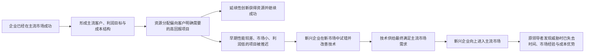
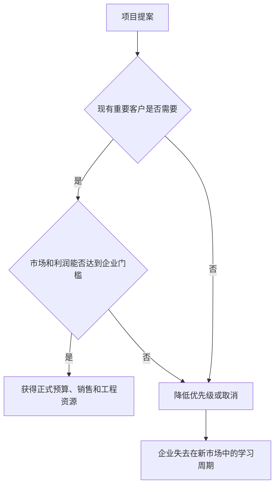
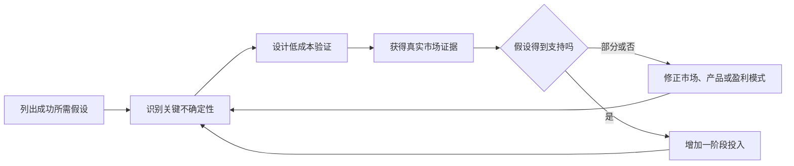

> 书名：《创新者的窘境》 
> 作者：克莱顿·克里斯坦森（Clayton M. Christensen） 
> 范围：引言，从开篇问题到“破坏性创新正发生在哪些领域” 
> 阅读目标：还原作者从反常案例到失败框架、再到五项管理原则的完整推理链，并说明概念的条件、边界与实践含义。

## 一、引言试图回答什么问题

本书从一个违反管理常识的现象出发：**为什么一些管理良好、积极创新、认真听取客户意见、严格追求投资回报的行业领导者，反而会在某些技术与市场变化中失去领先地位？**

作者刻意排除了几类常见但解释力不足的答案：官僚主义、傲慢、管理层老化、规划失误、投资短视、能力或资源匮乏以及单纯运气不好。它们当然可能导致企业失败，但不能解释本书最关心的那类失败，因为这些企业在作出关键决策时往往正处于管理声誉的顶峰，而且它们遵循的恰恰是公认的良好管理原则。

引言的中心命题可以概括为：

> 面对延续性创新时，倾听主流客户、追求更高利润率并把资源投向可量化的优质机会，通常是正确的；面对破坏性创新时，同一套做法却会系统性地过滤掉企业未来必须参与的机会。因此，问题不一定是管理者没有做好管理，而可能是管理方法与创新情境不匹配。

这不是一句“成功导致自满”的道德训诫。作者要建立的是一种因果解释：

所谓“创新者的窘境”，正是管理者同时面对两种都合理、却互相冲突的责任：一方面必须服务当前最重要的客户并维持当期增长和利润，另一方面又必须给当前客户不需要、短期收益也不理想的新业务留下成长空间。

## 二、反常失败：问题从哪里来

### 2.1 西尔斯：最受赞誉时已经埋下失败种子

西尔斯曾是美国零售业的管理典范，率先发展供应链管理、自有品牌、目录零售和信用卡销售，黄金时期销售额超过全美零售总额的 2%。然而，它后来错过了折扣零售和家居中心，也未能守住自己率先建立的信用卡优势。

这个案例的重要性不只是“巨头也会衰落”，而在于时间关系：西尔斯忽视新零售模式的时期，恰好也是它因管理卓越而广受赞誉的时期。事后把失败归因于傲慢很容易，却无法回答一个更严格的问题：**为什么当时看起来正确、并能支撑既有业务成功的流程，没有识别和支持后来改变行业的新模式？**

### 2.2 计算机行业：失败模式在一代代市场之间重复

计算机行业呈现出连续的市场交替：

| 原有领导者 | 它擅长的市场 | 随后错过的市场 |
|---|---|---|
| IBM 等大型计算机厂商 | 大型计算机 | 微型计算机 |
| DEC、Data General、Prime、王安等 | 微型计算机 | 台式个人电脑 |
| 苹果和 IBM | 台式个人电脑 | 早期便携式计算机 |
| 既有计算机厂商 | 传统计算机 | 工程工作站，新兴企业包括 Apollo、Sun、SGI |

DEC 尤其具有代表性。1986 年，它还被描述为高速前进、令竞争对手难以阻挡的优秀企业；几年后，它却因未能及时应对低利润率的个人电脑和工作站而被迫重组。关键决策同样发生在企业被视为管理典范之时。

这种代际重复说明，不能只用某一家公司的个性、某一届管理层的失误或某项技术能力缺失来解释。更可能存在一种跨企业、跨代际的结构性机制。

### 2.3 跨行业证据：并非电子行业特例

作者继续列举不同技术基础和变化速度下的相似现象：

- 施乐长期统治大型复印室使用的普通纸复印机市场，却错过小型台式复印机。
- 小型钢铁厂逐步取得北美约 40% 的钢铁市场以及几乎全部钢条、棒材和结构钢市场，而综合性钢铁企业没有率先采用这一路线。
- 30 家缆索挖掘机制造商中，只有 4 家成功度过长达约 25 年的液压技术转型。

这些行业的变化速度、技术复杂度和研发成本差异很大。有的变化迅速，有的持续数十年；有的技术复杂昂贵，有的只是把已有技术重新组合。因此，“变化太快”或“技术太难”都不是共同原因。共同点是：**导致日后失败的资源分配决策，往往在企业最成功、管理最规范的时候作出。**

### 2.4 两种竞争性解释

作者提出两种可检验的解释：

1. 这些企业其实一直管理不善，早期成功只是运气，环境变化后缺点暴露。
2. 这些企业确实管理良好，但使它们在成熟市场成功的决策机制，也会使它们在另一类创新面前失败。

本书选择并试图证明第二种解释。其锋利之处在于，它不把失败简单归咎于“没有倾听客户”，而是指出企业可能正因为认真倾听客户、系统追求高回报项目，才没有及时投资早期性能差、利润低、市场不明的产品。

这里的结论不是“良好管理有害”，而是：

$$
\text{管理方法的有效性}=f(\text{创新类型},\text{目标市场},\text{组织环境})
$$

这是一种帮助理解的形式化表达，不是原书给出的可计算公式。它强调任何管理原则都带有适用条件，不存在脱离情境而永远正确的做法。

## 三、“技术”与“创新”的广义定义

为了让理论同时适用于制造业、服务业、高科技和低科技行业，作者没有把“技术”限定为机器、材料或工程专利。

### 3.1 技术

**严格定义：**技术是一个组织把劳动力、资本、原材料、信息和知识转化为价值更高的产品与服务的过程。

这个定义要解决的问题是：如果技术只指硬件发明，那么折扣零售、证券交易、保险、医疗服务等商业模式变化将被排除在理论之外，作者也就无法解释西尔斯等服务企业的失败。

直觉上，技术就是组织“怎样完成工作并交付价值”。例如，百货商店和仓储式折扣商店都在销售商品，但它们的采购、陈列、库存、定价、服务和交付方式不同，因此采用的是不同技术。

### 3.2 创新

**定义：**创新是上述技术中的某个部分发生变化。它既可能是元件、材料或产品结构的变化，也可能是营销、投资、运营和管理流程的变化。

因此，破坏性变化不必来自实验室里的科学突破。折扣零售、在线证券交易和新的医疗服务模式，都可以在这一广义定义下被研究。

### 3.3 定义的边界

广义定义提高了理论的跨行业解释力，也带来一个风险：几乎所有组织变化都能被称为技术或创新。实践中不能只因某方案“新”就称它具有破坏性，还必须继续检查它服务哪类客户、改变哪些价值维度、采用怎样的商业模式，以及是否可能从新市场或低端市场向主流市场移动。

## 四、窘境：全书如何安排问题与答案

作者把全书分为两个部分：

- 第一部分（第 1 至第 4 章）建立失败框架，解释合理决策为何会使优秀企业失去领先地位。
- 第二部分（第 5 至第 10 章）提出管理方案，讨论企业怎样在不放弃成熟业务短期责任的同时，为可能颠覆自身的创新配置足够资源。

这一区分很重要。作者不是先给出“成立创新部门”之类的处方，而是先问：究竟是什么力量持续把资源从破坏性项目身边拉走？只有理解机制，才能选择匹配的组织形式。否则，同一个创新团队即使得到高层口头支持，也可能继续接受主流客户、利润率和预算流程的考核，最终重演原来的决策。

## 五、构建一个失败理论框架

### 5.1 为什么先研究硬盘驱动器行业

作者把硬盘驱动器行业当作研究企业成败的“果蝇”：市场、企业和技术在短时间内反复经历出现、成长、成熟和衰退，资料又相对丰富。六次结构性技术变化中，原有领导者只在两次变化中保持了下一代产品的领先地位。

这种选择解决了管理研究中的一个难题：如果一个行业的技术代际要几十年才更换一次，研究者很难在有限时间里观察到多轮可比较的因果过程；硬盘行业则允许作者在同一产业环境中反复观察相似模式。

### 5.2 作者的研究步骤

作者采用的不是“找几个著名失败故事，然后总结经验”的简单归纳，而是按以下路径推进：

1. 收集硬盘行业的企业、产品、性能、市场和技术变化资料。
2. 从早期多轮技术变化中识别重复模式，形成初步失败框架。
3. 用同一行业后续周期检验框架能否解释新发生的成败，而不只解释已用于建模的历史。
4. 转向变化速度和技术基础不同的机械挖掘机、钢铁等行业，检验机制能否跨行业成立。
5. 再把框架用于零售、计算机、摩托车、逻辑电路、软件、医疗和电动汽车等情境，探索适用范围与管理含义。

### 5.3 内部效度与外部效度

**内部效度**关心：在研究对象内部，提出的机制是否真的能解释观察到的结果？作者反复回到硬盘行业，就是为了检查“客户与财务结构如何影响资源分配”这条因果链，而不是只凭相关性下结论。

**外部效度**关心：这个机制能否推广到其他条件下？第三章用变化更慢的机械挖掘机行业，第四章用钢铁行业，后续章节再扩展到服务业和消费市场。如果框架只能解释硬盘行业，它就可能只是行业特例，而不是一般管理理论。

两者不能互相替代。跨行业案例很多但机制含糊，不代表理论可靠；单一行业解释很细，也不代表可以直接推广到所有行业。

## 六、为什么良好的管理可能导致失败：三项核心发现

失败框架建立在三项相互咬合的发现上：创新存在延续性与破坏性差异；技术改善可能快于市场需求增长；成熟企业的客户与财务结构会筛选投资机会。单独理解任何一项都不够，三者结合才构成“窘境”。

## 七、延续性技术与破坏性技术

### 7.1 延续性技术

**定义：**延续性技术沿主流市场长期重视的性能维度，提高成熟产品的表现。

它要解决的是现有客户已经明确表达的问题，例如更大容量、更快速度、更高精度、更好可靠性。延续性创新既可能是日常渐进改进，也可能是昂贵、复杂、风险很高的突破。因此：

$$
\text{延续性创新}\neq\text{渐进式创新}
$$

一个技术即使在工程上极其激进，只要它继续提升主流客户原本看重的性能，就是延续性的。作者的重要发现是，成熟企业通常非常擅长这类创新，甚至常常领先于新兴企业。

### 7.2 破坏性技术

**定义：**破坏性技术在出现初期通常不能满足主流市场既有的关键性能要求，却提供一组不同的价值属性，先被边缘客户、新客户或低端用途采用；随着性能改善，它可能进入主流市场并改变竞争基础。

其常见早期特征包括更便宜、更简单、更小、更方便，但这些只是经验特征，不是缺一不可的定义条件。真正重要的是三点：

1. 它在主流评价体系下初期较差，所以主流客户有理由拒绝。
2. 它在另一组属性上对新市场、边缘市场或低端市场有价值。
3. 它的性能改善路径使其日后有机会满足更高端市场的需求。

原书举出的例子包括台式个人电脑相对于大型计算机、折扣零售相对于传统百货、小型越野摩托车相对于大马力公路摩托车、晶体管相对于真空管，以及新型保健机构相对于传统医疗保险模式。

### 7.3 用多维价值理解“性能较差”

“较差”不是说产品在所有方面都差，而是它在主流客户权重最高的维度上较差。设产品有若干性能维度 $x_1,x_2,\ldots,x_n$，市场 $m$ 对各维度的权重为 $w_{m,i}$，可用下面的简化表达帮助理解市场评价：

$$
V_m(p)=\sum_{i=1}^{n}w_{m,i}u_i(x_i(p))
$$

其中：

- $p$ 表示一个产品方案；
- $x_i(p)$ 表示产品在第 $i$ 个属性上的表现；
- $u_i$ 表示客户如何把客观性能转化为感知效用；
- $w_{m,i}$ 表示市场 $m$ 对该属性的重视程度；
- $V_m(p)$ 表示产品对该市场的综合价值。

同一台小型设备可能因容量低而不适合主流企业客户，却因体积小、能耗低而非常适合便携场景。改变市场后，权重 $w_{m,i}$ 改变，“差产品”便可能成为“合适产品”。这不是原书用来计算项目的公式，而是对其多维价值逻辑的形式化说明。真实客户效用通常不是线性的，权重也会随价格、用途和时间变化，不能机械打分。

### 7.4 与“渐进/突破”分类的区别

| 分类维度 | 问的问题 | 两端 |
|---|---|---|
| 工程变化幅度 | 技术实现相对过去改变多大 | 渐进式 / 突破式 |
| 市场与价值轨道 | 它服务谁、提升什么、从哪里进入 | 延续性 / 破坏性 |

二者可以组合。复杂的突破技术可能只是延续性创新；技术上简单的产品重组反而可能是破坏性创新。把“破坏性”误解成“技术震撼”会让企业盯住最炫目的发明，却漏掉那些早期看起来低端、简单甚至不值得做的方案。

## 八、市场需求轨道与技术改善轨道

### 8.1 两条轨道分别表示什么

作者的第二项发现是：供应商提升产品性能的速度，可能持续快于客户需求增长的速度。

- **市场需求轨道**：某一市场为完成主要任务而实际需要、能够使用并愿意付费的性能随时间增长的路径。
- **技术改善轨道**：某一产品或技术架构能够提供的性能随时间提高的路径。

原书图示如下：
> **原书图示**：延续性技术和破坏性技术变革的影响
高端和低端市场各有自己的需求区间。成熟企业沿延续性轨道向上改进时，可能逐渐超过一部分客户能够吸收的性能；破坏性技术则从较低起点进入，但其改善速度可能使它后来达到主流市场的最低可接受水平。

### 8.2 “过度满足”为什么会发生

企业通常通过推出更高性能产品来获得更高价格和利润率，竞争对手也会迫使它不断升级。但客户需求并不一定同步增长。当新增性能不再明显改善客户任务，或者客户不愿为它继续付费时，就出现了性能过度满足。

大型计算机是原书的例子：许多用户过去必须用大型机处理数据，后来发现连接文件服务器的台式计算机已经足够。不是大型机性能下降了，而是它提供的性能超过了部分用户任务所需的水平，其他属性如价格、便利性和灵活性开始变得更重要。

### 8.3 轨道交点的完整推导

为了看清“起初不够好，后来足够好”的条件，可以用指数增长近似两条轨道。设：

- $S_0$：破坏性方案在 $t=0$ 时的性能；
- $R_0$：目标市场在 $t=0$ 时要求的性能，且 $S_0<R_0$；
- $g_s$：技术性能每期改善率；
- $g_r$：市场需求每期增长率；
- $S(t)$、$R(t)$：第 $t$ 期的技术供给与市场要求。

则：

$$
S(t)=S_0(1+g_s)^t
$$

$$
R(t)=R_0(1+g_r)^t
$$

技术达到市场要求的交点满足 $S(t^*)=R(t^*)$：

$$
S_0(1+g_s)^{t^*}=R_0(1+g_r)^{t^*}
$$

两边除以 $S_0(1+g_r)^{t^*}$：

$$
\left(\frac{1+g_s}{1+g_r}\right)^{t^*}=\frac{R_0}{S_0}
$$

两边取自然对数：

$$
t^*\ln\left(\frac{1+g_s}{1+g_r}\right)=\ln\left(\frac{R_0}{S_0}\right)
$$

因此：

$$
t^*=\frac{\ln(R_0/S_0)}{\ln((1+g_s)/(1+g_r))}
$$

要得到有限且为正的交点，至少需要 $S_0<R_0$ 且 $g_s>g_r$。例如，初始技术性能为 60，市场要求为 100，技术每年改善 30%，需求每年增长 10%，则：

$$
t^*=\frac{\ln(100/60)}{\ln(1.3/1.1)}\approx3.06\text{ 年}
$$

第 3 年时，技术供给约为 $60\times1.3^3=131.82$，市场要求约为 $100\times1.1^3=133.10$，尚未完全达到；第 4 年分别约为 171.37 和 146.41，技术已经越过需求线。

这段推导是对原书轨道图的数学化解释，不是作者声称的普适预测算法。它依赖以下强假设：性能可用单一指标表示；增长率恒定；达到阈值就能进入市场；客户切换没有法规、品牌、渠道、生态和迁移成本。现实中轨道可能是分段的、S 形的或突然跳变，多个属性也可能必须同时达标。因此公式用于理解条件，不宜用于精确预测进入年份。

### 8.4 这一机制为什么危险

破坏性方案在早期被主流客户拒绝完全合理，但拒绝的理由会随时间失效。如果企业把“今天不够好”推断成“永远没有威胁”，就忽略了两条轨道的相对速度。反过来，并非所有低性能技术都会成功；如果它没有可生存的初始市场、改善速度不足、成本无法下降或始终有关键属性不能达标，它就不会越过主流需求线。

## 九、破坏性技术与合理的投资

作者的第三项发现是：成熟企业不投资破坏性项目，往往不是因为看不见技术，而是因为按照现有财务和客户标准计算，这项投资确实不够合理。

### 9.1 三个基础条件

1. **产品更简单、价格更低，利润率通常也更低。**对已有高成本结构的企业来说，即使有收入，也可能达不到利润门槛。
2. **最初市场小而且不重要。**它无法显著影响大企业的增长数字，预测数据还很贫乏。
3. **最优质的现有客户不需要它。**他们可能无法使用早期产品，企业最成熟的客户反馈系统因此会给出否定答案。

这三个条件形成一个自洽的资源过滤器：销售部门优先满足大客户，财务部门优先高毛利和大市场，管理层优先能推动增长目标的项目。破坏性项目会在每一关都处于劣势。

### 9.2 个体理性如何形成组织失误

对任何一位经理来说，把资源投向有客户订单、市场规模明确、利润率更高的项目，通常都比押注一个没人能准确预测的小市场更容易辩护。每个局部决策都合理，但所有决策累积起来，使企业没有在新价值网络中学习的机会。

因此，这不是简单的认知偏差，而是激励、成本结构、客户关系、预算流程和职业风险共同作用的结果。仅靠高层提醒团队“要有远见”，很难改变项目在日常资源竞争中的弱势地位。

## 十、测试失败框架

作者不仅要定义问题，还要证明框架具有解释力和适用性。各章案例承担不同检验任务：

| 章节 | 主要案例或主题 | 在论证中的作用 |
|---|---|---|
| 第 1、2 章 | 硬盘驱动器 | 建立机制，检验同一行业内多轮变化 |
| 第 3 章 | 缆索挖掘机与液压挖掘机 | 检查慢速、机械型行业是否出现同一模式 |
| 第 4 章 | 综合性钢铁厂与小型钢铁厂 | 完成失败框架，解释从低端向上移动 |
| 第 5 章 | 折扣零售、电机控制、打印机等 | 讨论资源依赖与独立机构 |
| 第 6 章 | PDA 等新兴市场 | 讨论大企业增长要求与小市场冲突 |
| 第 7 章 | 摩托车、逻辑电路等 | 讨论不可预知市场与基于发现的规划 |
| 第 8 章 | 计算机等 | 讨论组织能力与局限 |
| 第 9 章 | 会计软件、胰岛素等 | 讨论过度满足与竞争基础变化 |
| 第 10 章 | 电动汽车 | 综合运用框架识别威胁、设计组织与战略 |

这种案例设计的价值在于寻找可重复机制，而不只是相似表象。它的局限也要看到：案例研究能加强因果解释，却不像随机实验那样排除所有替代解释；案例选择、历史资料完整性以及事后分类都可能影响结论。后文的原则应理解为有条件的管理理论，而不是自然科学定律。

## 十一、利用破坏性创新的原则

引言接下来从解释失败转向管理行动。作者提出五项“法则或原理”，其共同思想不是要求管理者凭意志战胜组织力量，而是设计与这些力量相容的环境。

常规建议如更认真规划、更努力执行、更多听取客户意见、加快上市、全面质量管理和流程再造，在延续性创新中可能非常有效；如果原问题正是破坏性项目被现有客户与流程过滤，这些做法反而可能让过滤器运行得更有效。正确问题不是“怎样让原组织更用力”，而是“怎样让新业务在适合它的客户、成本和评价体系中成长”。

## 十二、原则一：企业的资源分布取决于消费者和投资者

### 12.1 原则要解决的问题

管理者名义上控制预算，为什么他们明确支持的新项目仍然得不到持续资源？资源依赖理论给出的解释是：能长期生存的企业必须把资源用于客户愿意购买、投资者愿意支持的用途。因此，客户和资本市场通过收入、利润与增长要求，间接决定了组织内部哪些提案更容易获得资源。

### 12.2 运行机制

成熟企业最值得称道的能力之一，是建立流程来淘汰客户不需要、回报不够好的想法。这让它能持续做好延续性创新，却也使破坏性项目在主流客户产生需求以前难以取得资源。等主流客户开始需要时，新兴企业通常已经在早期市场积累了产品、渠道、成本和客户认知。

### 12.3 作者的管理方案

把破坏性业务交给一个独立机构，使它直接面对认可新价值属性的客户，并建立能在低价格、低毛利条件下盈利的成本结构。这里的“独立”不是只换办公室或组织名称，而是至少要让新业务拥有：

- 与新市场匹配的客户和销售渠道；
- 与低利润率相容的成本结构和绩效门槛；
- 能自主决定产品、预算与优先级的流程；
- 不因规模太小而被母公司忽略的管理关注。

### 12.4 边界与误解

独立机构不是所有创新的默认答案。延续性创新通常应利用主组织的客户、能力和规模；过度分拆会重复资源、隔断知识并制造内部竞争。即使独立，新业务若仍按母公司的毛利率、收入规模和短期回报考核，也只是形式独立。反之，完全切断母公司资源也可能失去技术、品牌或资金优势。关键是选择性地隔离流程和价值标准，而不是机械追求组织距离。

## 十三、原则二：小市场并不能解决大企业的增长需求

### 13.1 规模为何改变机会的吸引力

破坏性创新常从小市场开始，先进入者又往往拥有学习优势。然而企业越成功，要维持相同增长率所需的新增收入越大，小市场对它就越“不重要”。

设企业当前收入规模为 $R$，目标增长率为 $g$，下一期需要的新增收入为 $\Delta R$，则：

$$
R_{t+1}=R_t(1+g)
$$

所以：

$$
\Delta R=R_{t+1}-R_t=gR_t
$$

原书用 20% 增长说明规模效应：

- 对规模为 4000 万美元的企业，$\Delta R=4000\times20\%=800$ 万美元；
- 对规模为 40 亿美元的企业，$\Delta R=40\times20\%=8$ 亿美元。

计算没有复杂之处，重要的是含义：同一个 1000 万美元的新市场足以改变小企业的命运，却不足以在大企业报表上产生明显影响。规模本身会改变管理者对机会的排序。

### 13.2 为什么“等市场变大再进入”通常失败

等待看似降低不确定性，却放弃了最早的学习周期。新市场形成时，产品用途、客户群、渠道和盈利方式都不清楚；先进入者通过反复试错共同塑造市场。后来者等到规模明确才进入，面对的不只是一个更大的市场，还包括已经形成经验、品牌、渠道和成本优势的竞争者。

作者的方案是让承担新业务的机构规模与目标市场匹配。小机构可以把小额收入视为成长，而不是噪声，也更容易从早期客户反馈中学习。

### 13.3 公式的假设与边界

$\Delta R=gR$ 只说明维持同一百分比增长所需的绝对增量，不证明大企业必然无法创新。它假设目标增长率不变，而且把战略协同、期权价值、利润贡献和长期防御价值暂时放在一边。大企业仍可通过降低新业务早期规模门槛、采用分阶段投资、设立小型自治单元来参与小市场。

## 十四、原则三：无法对并不存在的市场进行分析

### 14.1 为什么传统规划在这里失效

延续性市场通常已有客户、历史销量、竞争产品和可测需求，因而适合“研究市场、预测规模、制定计划、按计划执行”。破坏性创新常在创造一个尚不存在的市场，客户自己也未必知道如何使用它。此时要求精确的销量、收入和成本预测，实际上是在要求不存在的数据。

困难不只是数据少，而是关键变量尚未形成：真正的客户可能不是当前受访者，核心用途可能在试用后才出现，渠道和定价也可能随用途改变。对新市场的精确预测往往把未经验证的假设伪装成数字。

### 14.2 创新者的另一重窘境

在延续性创新中，追随者往往可以等领先者验证技术后再跟进，先发并非总有决定性优势；在破坏性创新中，企业最缺信息，却恰恰需要尽早进入才能通过行动学习。这构成“信息最少时行动价值最大”的矛盾。

### 14.3 基于发现的规划

作者提出的替代方法是**基于发现的规划**：先假定预测和初始战略可能是错的，把计划当作待检验的假设集合，而不是必须兑现的承诺。

可将其落实为一个循环：

1. 明确项目要成功必须成立的假设，如客户任务、可接受性能、价格、成本、渠道和复购。
2. 按“最关键且最不确定”排序，优先测试一旦错误就会推翻项目的假设。
3. 用低成本原型、试点、访谈后的真实行为或小规模销售获取证据。
4. 比较证据与假设，更新目标市场、产品和商业模式。
5. 只在不确定性下降时逐步增加资源，同时预先设定停止或转向条件。

这不是“不做计划”，而是改变计划的功能：传统计划主要用于协调执行，发现式计划主要用于加速学习。其边界是，对于法规、安全、硬件产能等高前置投入领域，试错不可能无限便宜；团队仍需设计仿真、分阶段审批、受控试点等替代证据。

## 十五、原则四：机构的能力决定了它的局限性

### 15.1 为什么只选优秀人才不够

管理者处理新任务时，常把注意力放在“找最有能力的人”。作者提醒，个人能力不等于组织能力。员工可以学习和改变，但他们所在机构的工作方式与优先标准可能继续把行为拉回原轨道。

### 15.2 流程与价值观

引言把组织能力主要归结为两方面：

- **流程**：组织把人员、资源、原材料、信息、现金和技术投入转化为产品与服务的方法，包括决策、协调、开发、预算、质量控制和上市流程。
- **价值观**：组织成员判断什么应优先、什么可接受、什么不值得做的标准，例如目标毛利率、市场规模、质量水平、客户等级和回报期限。

同一套流程与价值观具有两面性：

| 在原任务中的能力 | 换到新任务后可能成为的局限 |
|---|---|
| 严密流程保证大型复杂产品可靠交付 | 迭代太慢，无法适应需求未知的小市场 |
| 优先支持高毛利、大客户项目 | 自动排斥低毛利、小规模的破坏性项目 |
| 质量标准满足主流客户全部要求 | 产品迟迟不能以“足够好”的状态进入早期市场 |

因此，不能从“团队很优秀”直接推出“原组织适合完成这项任务”。需要逐项判断新任务要求的节奏、成本、客户和决策方式，是否与现有流程和价值标准兼容。

### 15.3 管理选择

如果差距只是知识或人员不足，可以培训、招聘或引入资源；如果冲突来自流程，可以建立新团队和新流程；如果冲突来自根深蒂固的价值标准，通常需要更高程度的自治组织。并购也不是自动答案，因为把被收购团队迅速纳入母公司的流程和考核，可能正好毁掉所购买的能力。

## 十六、原则五：技术供应可能并不等同于市场需求

### 16.1 从性能竞争到竞争基础变化

当多个产品都已经超过客户对核心功能的需求，客户便难以再用该功能区分它们。作者概括的竞争基础变化顺序通常是：

$$
\text{功能性}\rightarrow\text{可靠性}\rightarrow\text{便捷性}\rightarrow\text{价格}
$$

推理过程如下：

1. 产品尚不能完成核心任务时，客户首先购买足够的功能。
2. 多个产品都具备功能后，稳定完成任务比继续增加功能更重要，竞争转向可靠性。
3. 可靠性也普遍达标后，客户更在意是否容易购买、安装、学习和使用。
4. 当功能、可靠性和便利性都趋同时，价格成为更显著的选择依据。

产品生命周期的变化因而不只是时间自然流逝，而可能由“性能供给超过可吸收需求”推动。

### 16.2 破坏者为什么能向上移动

主流企业为追求高利润率而持续升级，逐渐离开一部分需求已经被满足的客户，在低端留下竞争真空。破坏者的产品一旦“足够好”，其更低价格、更简单使用或更方便获得等属性便开始主导选择。随后它继续改善，又可服务更高端客户。

### 16.3 成立条件与边界

上述顺序是经验模式，不是必然定律。安全、医疗、航空等领域可能长期把可靠性置于价格之前；奢侈品还涉及身份和审美；网络效应、生态兼容、隐私与监管也可能成为新的竞争基础。判断是否过度满足，不能只看实验室性能，还要观察客户任务、使用率、愿付价格和替代行为。

## 十七、发现破坏性威胁和机遇的思路

引言没有给出一个能自动判断“是或否”的机械清单，而是通过第 10 章的电动汽车案例示范怎样提问。可以把作者的分析路径整理为以下问题：

1. 新方案是否在主流客户当前最重视的性能上明显不足？若一开始就更好、更贵并服务同一批客户，它更可能是延续性创新。
2. 是否存在另一批客户或新用途，重视它不同的属性，并愿意接受其主流性能缺陷？
3. 这个初始市场能否让业务以合适成本生存并持续学习？
4. 技术改善速度是否可能快于更高端市场的需求增长，从而逐步达到“足够好”？
5. 低价格、低毛利或小市场是否使成熟企业按照现有标准没有投资动力？
6. 新业务需要的流程、成本结构与价值标准是否和主组织冲突？

这些问题必须组合判断。只有“产品便宜”或“巨头不重视”并不足以证明破坏性；一个永远无法改善关键性能、找不到立足市场的低端产品，也不会自动颠覆行业。

### 17.1 电动汽车案例的作用

作者把读者置于大型汽车企业电动汽车项目经理的位置。传统汽车业务当时健康，汽油发动机可靠、性价比高，主流消费者没有强烈需求，除监管要求外，成熟厂商缺少大举投资的理由。这正符合窘境：企业若只按当前客户和财务信号行动，就很难给电动汽车足够重视。

作者当时把电动汽车判断为潜在破坏性技术，建议寻找接受其新价值属性的新市场，并让规模、利益和成本结构与目标市场匹配的专门机构负责。案例的目的不是预测某一款车必然成功，而是训练一种分析方式：先判断创新轨道和初始市场，再设计组织，而不是直接把未成熟产品推给最苛刻的主流客户。

### 17.2 对这一历史判断的边界

电动汽车后来同时受到电池进步、法规、补贴、充电网络、软件能力、品牌和高端车型切入等多种力量影响，现实路径并不完全等同于经典的低端进入模式。这提醒我们：破坏性框架适合解释特定市场进入机制，但不是排除政策、互补基础设施、平台生态和高端创新的唯一理论。

## 十八、破坏性创新正发生在哪些领域

引言末尾列出作者当时观察到的一组成熟技术与潜在破坏力量，范围远超制造业。代表性对照包括：

| 成熟秩序 | 当时的新技术或新商业模式 | 变化的核心属性 |
|---|---|---|
| 卤化银胶片 | 数码摄影 | 即时查看、复制与数字处理 |
| 有线电话 | 移动电话 | 地点独立与便利性 |
| 线路交换网络 | 分组交换网络 | 更灵活的数据传输与资源共享 |
| 笔记本电脑 | 掌上数字设备 | 便携、低能耗、特定任务便利性 |
| 台式个人电脑 | 游戏主机、互联网工具 | 专用体验或更简单的联网方式 |
| 全服务证券经纪 | 在线证券经纪 | 低成本、自助与即时访问 |
| 传统证券交易所 | 电子通信网络（ECN） | 自动撮合与更直接的交易连接 |
| 由承销商全程承销新股和债券发行 | 通过互联网自动发行新股和债券 | 减少中介环节与发行成本 |
| 人工判断的信贷决策 | 自动化信用评分 | 标准化、速度与低服务成本 |
| 实体零售 | 网上零售 | 搜索范围、随时购买与低渠道成本 |
| 工业原材料经销 | 互联网销售网站 | 信息透明与直接匹配 |
| 印刷贺卡 | 可在线下载的贺卡 | 即时、低成本和个性化 |
| 电力公用事业 | 分布式发电 | 本地供能与模块化 |
| 管理研究生院 | 企业大学、内部管理培训 | 更贴近具体组织任务 |
| 基于课堂和校园的教学 | 通过互联网开展的远程教育 | 突破地点与时间限制 |
| 标准教材 | 用户组合的模块化教材 | 按需选择与组合 |
| 平版印刷 | 数字印刷 | 小批量、快速和个性化 |
| 载人战斗机和轰炸机 | 无人驾驶飞机 | 降低人员风险与任务成本 |
| 桌面操作系统和应用软件 | 互联网协议与跨平台软件 | 开放连接与平台迁移 |
| 医生提供常规诊疗 | 执业护士承担标准化诊疗 | 扩大服务可及性并降低成本 |
| 综合医院 | 门诊和家庭护理 | 更低成本、更便利的服务场所 |
| 外科手术 | 关节镜等微创手术 | 创伤小、恢复快 |
| 心脏搭桥手术 | 血管修复等介入技术 | 更低侵入性 |
| CT、MRI 等影像设备 | 超声等更便携的成像设备 | 可及性、移动性与成本 |

这张表的作用不是宣布右栏一定消灭左栏，而是展示理论的广义技术观：互联网、数字化、分布式架构、自助服务和微创流程，都可能通过一组新的价值属性重塑市场。作者希望未来不同于历史，即成熟企业若能识别这些力量并按五项原则组织资源，就不必重复前人的失败。

由于这份清单带有成书时代背景，其中有些方向后来确实重塑行业，有些则与成熟技术长期共存或以不同路径发展。它应被当作待检验假设，而不是预言清单。

## 十九、三项发现与五项原则如何连成一体

| 失败机制 | 为什么常规管理会失效 | 对应原则与动作 |
|---|---|---|
| 主流客户不需要早期破坏性产品 | 客户导向流程会拒绝项目 | 原则一：让新机构面向真正需要它的新客户 |
| 新市场太小、利润率太低 | 无法满足大企业增长与财务门槛 | 原则二：用规模与市场匹配的小机构承担业务 |
| 新市场尚未形成 | 精确预测和固定计划建立在虚构数据上 | 原则三：用基于发现的规划，通过行动学习 |
| 原组织流程和价值观服务于成熟业务 | 优秀人才仍被旧评价标准约束 | 原则四：按任务匹配流程、价值观和组织边界 |
| 技术改善快于需求增长 | 企业持续上移并在低端留下空间 | 原则五：监测“足够好”阈值与竞争基础变化 |

五项原则不是五个互不相关的技巧，而是针对同一因果链不同环节的组织设计。独立机构解决客户和价值标准问题，规模匹配解决增长门槛问题，发现式规划解决信息不存在的问题，能力分析解决流程错配问题，轨道分析解决进入时机与竞争维度问题。

## 二十、常见误解辨析

### 20.1 “破坏性”就是技术突破或行业影响很大

不对。突破性描述工程变化幅度，破坏性描述市场进入路径和价值网络。巨大的技术突破可能只是在原性能轨道上继续向上；简单、低端的重组反而可能改变行业领导格局。

### 20.2 破坏性产品一出现就比主流产品好

恰好相反，它通常在主流指标上更差，否则主流客户会立即采用，成熟企业也更容易为它配置资源。它首先要在另一类客户、另一种用途或低端任务上“足够好”。

### 20.3 作者主张不要听客户

不对。服务当前客户对于延续性创新和成熟业务仍然必要。问题是不能只向当前最赚钱的客户询问一个他们尚不能使用的产品是否有价值。企业需要找到真正重视新属性的客户，并让他们参与产品形成。

### 20.4 领先企业失败是因为不知道新技术

很多案例中，成熟企业的工程师很早就知道、甚至率先开发了相关技术。失败常发生在商业化与资源分配阶段：市场小、客户拒绝、利润率低，使项目迟迟不能成为组织优先事项。

### 20.5 低价产品都是破坏性创新

不对。单纯降价可能只是正常竞争。破坏性创新还需要不同的价值主张、可生存的初始市场、适配的商业模式以及向更高市场改善的可能性。

### 20.6 成立独立部门就一定成功

不对。独立机构只是在组织上创造适合学习的条件，不能替代产品价值、技术进步、成本控制和市场发现。其规模、客户、考核和盈利模型必须真正与新市场相容。

### 20.7 所有破坏性项目都应尽早重注

不对。新市场高度不确定，正确做法是尽早学习而非尽早投入全部资源。分阶段投资、验证关键假设和保留退出条件，比把宏大预测当事实更符合原则三。

## 二十一、作者分析问题的方法、有效性与局限

### 21.1 问题从反例开始

作者没有研究管理差的企业为何失败，而是选择“理论最难解释”的反例：管理优秀的企业为何失败。这种选题能迫使理论超越“管理者应更努力、更有远见”之类无法证伪的说法。

### 21.2 从事件属性转向组织机制

作者先排除变化速度、技术复杂度和行业类型等表面差异，再寻找重复出现的决策机制。其解释层次从“发生了什么技术变化”深入到“客户、利润结构和流程为何稳定地引导资源”。因此框架能说明为什么聪明人会反复作出相似选择。

### 21.3 先做纵向重复，再做跨行业检验

硬盘行业提供多轮纵向比较，机械挖掘机、钢铁和服务业提供横向比较。这种方法比单个著名案例更有说服力，因为理论必须解释不同时间、不同企业和不同技术条件下的模式。

### 21.4 方法为什么有效

- 它把“好管理”和“坏结果”之间的矛盾变成可分析的条件问题。
- 它区分工程难度与市场破坏性，避免用技术先进程度替代战略分析。
- 它同时解释成熟企业在延续性创新中的成功和破坏性创新中的失败，具有同一机制下的双向解释力。
- 它给出的方案与原因对应，重点是调整组织环境，而不是要求个人违背长期激励。

### 21.5 局限和替代视角

1. **历史案例与事后分类。**研究者知道结果后，可能更容易把成功者的技术识别为破坏性。实践中应在事前写下判定依据和可证伪条件。
2. **幸存者与选择偏差。**大量低端技术从未向上进入主流，只研究成功破坏者会高估成功概率。需要同时考察失败的新兴企业。
3. **单一轨道简化。**真实产品具有多个性能维度，需求也会受法规、互补品、网络效应和社会习惯影响。
4. **组织解释不是唯一解释。**专利、规模经济、平台生态、供应链控制、资本周期和政府政策也可能决定竞争结果。
5. **时代边界。**引言中的行业清单和电动汽车判断形成于特定历史阶段，不能把当时预测直接当作今天的事实。
6. **概念边界会继续发展。**本书引言主要使用“破坏性技术”，但许多案例实质上同时涉及产品、商业模式和价值网络；后来更常用“破坏性创新”来表达这一更广范围。

可配合使用的替代或补充视角包括：S 曲线分析技术成熟度，价值链与五力模型分析产业利润位置，实物期权思维设计分阶段投资，平台与网络效应分析生态壁垒，组织双元理论讨论探索与利用如何并存。这些方法不是推翻破坏性创新框架，而是补足它不重点处理的变量。

## 二十二、面向实际工作的分析模板

面对一个可能具有破坏性的机会，可以按以下顺序分析：

1. **定义客户任务。**主流客户和潜在新客户分别要完成什么任务？
2. **拆分性能维度。**哪些指标是主流客户最重视的？新方案在哪些指标上较差、在哪些属性上更好？
3. **寻找立足市场。**谁会因为简单、便宜、便携、便利或可及性而愿意使用早期版本？
4. **比较改善轨道。**技术供给和各层市场需求分别以多快速度变化？哪些关键属性可能永远无法达标？
5. **验证商业生存。**早期价格、成本、渠道和市场规模能否支持一个小组织持续学习？
6. **检查资源过滤器。**现有客户、毛利率、收入规模和预算流程会怎样评价项目？
7. **匹配组织。**项目适合留在主组织、建立自治团队，还是放入独立机构？隔离哪些流程和价值标准，又共享哪些资源？
8. **采用发现式计划。**列出关键假设，用最小代价依次验证，按证据分阶段增加投入。
9. **监测竞争基础。**客户是否已从追求功能转向可靠性、便利性、价格或其他属性？
10. **设置反证条件。**什么证据会表明它不是破坏性机会，或者虽是破坏性机会却不值得本企业参与？

最后一项尤其重要。理论的价值不在于把所有新事物都包装成“颠覆”，而在于帮助管理者更早地区分：哪些项目应利用主组织的成熟能力，哪些项目必须换一套客户、成本、流程和学习方式。

## 二十三、引言总结

引言完成了四层递进：

1. 以西尔斯、DEC、施乐、钢铁和挖掘机等案例提出反常问题：优秀企业为何在管理最受赞誉时作出导致失败的决定？
2. 用延续性与破坏性创新、技术供给与市场需求轨道、客户和财务结构三项发现建立失败框架。
3. 通过硬盘行业的纵向重复和跨行业案例讨论内部、外部效度，说明这不是某家企业或某类技术的偶发现象。
4. 提出资源依赖、小市场与增长、发现式规划、组织流程与价值观、性能过度满足五项原则，把失败解释转化为可执行的组织设计思路。

最值得保留的认识不是“巨头终将被颠覆”，而是：**一个流程是否优秀，必须相对于它要解决的问题来判断。**服务主流客户、追求可预测回报的系统能够造就卓越的成熟业务，却未必能孕育客户未知、市场很小、利润率较低的新业务。管理者真正要做的，不是放弃良好管理，而是识别创新所处的情境，并为不同任务配置不同的客户环境、成本结构、流程、价值标准和学习方法。
