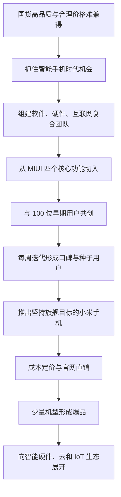
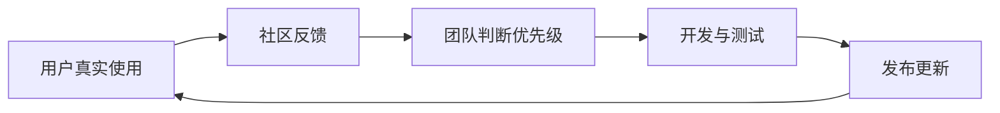

> 本章讲述小米从创业构想、MIUI 冷启动到第一代手机和生态链展开的过程。重点不是“奇迹”本身，而是一家资源有限的创业公司如何选方向、找切入口、组团队、与早期用户共创，并用一系列相互配合的选择建立全新商业模式。

---

## 一、本章主线

第一章可以分成五个阶段：

1. **梦想落地**：从“做一家伟大的公司”落到智能手机这个具体机会；
2. **从操作系统切入**：先做熟悉的软件，再逐步进入陌生的硬件；
3. **小米手机出世**：克服团队、供应链、产品和定价难题；
4. **赢得梦幻开局**：依靠种子用户、产品力和直销模式迅速放量；
5. **生态展开**：从手机扩展到智能生活、云服务和物联网平台。

贯穿全章的是一个朴素思路：**目标可以很大，但第一步必须足够具体；资源有限时，要集中力量在最关键的地方做到极致。**

---

## 二、梦想落地

### 2.1 创业不能只停在“想做伟大的公司”

雷军和团队最初想做一家伟大的公司，为社会作出贡献。但这种愿望本身无法指导产品选择，他们继续追问：中国当时最值得解决的消费问题是什么？

他们看到的矛盾是：

- 中国已经是世界工厂，制造基础很强；
- 许多国货品质和体验仍然不足；
- 少数品质好的商品，价格又常常过高；
- 大众缺少“品质好、价格又合理”的选择。

于是，小米把抽象使命落到一个具体目标：推动中国制造业升级，让更多人买得起高品质科技产品。

这里的方法是：

> 先明确自己希望创造的社会价值，再寻找能承载这种价值的行业机会。

使命不能代替商业判断，但它可以帮助公司在众多机会中选择长期值得做的事情。

### 2.2 为什么选择智能手机

当时有几个重要变化同时发生：

- 2007 年 iPhone 发布，智能手机开始重新定义个人计算；
- 2009 年安卓系统和首款安卓手机出现；
- 开源系统降低了新公司进入手机操作系统的门槛；
- 移动互联网即将进入快速普及期。

智能手机既是巨大的市场机会，也是连接软件、硬件和互联网服务的核心设备。它能承载小米想做的“互联网加制造”，因此成为梦想落地的最佳载体。

### 2.3 为什么看好安卓与开源

安卓当时体验并不成熟，但开源意味着更多厂商、开发者和用户可以参与建设。对一家没有能力从头开发操作系统的创业公司来说，开源提供了三项关键条件：

1. 可以站在已有系统基础上创新；
2. 能把有限资源集中到用户最需要的体验上；
3. 可以借助全球开发者和设备生态快速成长。

开源并不保证成功。它只是降低起点，真正的竞争仍取决于产品定义、工程质量和生态组织能力。

### 2.4 小米梦想的原点

雷军把目标表述为：“做全球最好的手机，只卖一半的价钱，让每个人都能买得起。”

这句话同时包含三个约束：

- **品质不能降**：目标是最好，不是做便宜的低端产品；
- **价格必须低**：不能沿用高品质必然高溢价的旧模式；
- **覆盖要广**：希望科技进步能被普通大众使用。

这三个目标放在一起，迫使小米重新设计研发、营销、渠道、库存和利润方式。若只砍物料成本，最终只能得到便宜但体验差的产品，无法实现原始梦想。

### 2.5 “铁人三项”带来的差异化

当时主要手机厂商大多以硬件能力见长。小米认为，如果把软件、硬件和互联网服务结合起来，就可能形成不同于传统手机公司的竞争方式：

| 能力 | 解决的问题 |
|---|---|
| 软件 | 系统体验和持续更新 |
| 硬件 | 性能、设计、制造和质量 |
| 互联网 | 直接连接用户、快速反馈和持续服务 |

三项能力不是简单并列。软件让硬件持续改善，互联网让团队了解用户，硬件又为软件和服务提供稳定入口。

这种复合模式的代价也很明显：每个领域都很难，组织需要协调不同专业、节奏和文化。它不是所有创业公司的必选模式。

### 2.6 用人才弥补能力缺口

小米没有硬件经验，因此没有选择慢慢从零培养所有能力，而是从微软、谷歌、摩托罗拉和金山等公司寻找合伙人和核心人才。

创始团队的设计有几个特点：

- 软件、硬件、互联网能力互补；
- 既有国际公司的专业经验，也有本土公司“打硬仗”的经验；
- 8 位创始人中有 6 位工程师和 2 位设计师；
- 从开始就把设计和用户体验放在与技术同等重要的位置。

所谓“捷径”不是绕过困难，而是找到已经具备关键能力的人，缩短组织学习时间。

### 2.7 为什么招聘要投入如此多精力

雷军反复拜访候选人，有时谈十几次；即便招聘实习生，也会安排多轮面试。背后的考虑不是追求仪式，而是早期团队中每个人都会显著影响公司：

- 关键岗位招错人，可能直接改变产品方向和团队标准；
- 创新模式缺少成熟流程，必须依赖个人判断和责任心；
- 复合业务无法靠管理者盯住每个细节，需要高度自驱；
- 公司愿意充分信任员工，就必须在进入团队前认真选择。

早期招聘要同时看能力、愿景、责任心和自驱力。能力强但不认同目标的人，可能在高压和不确定环境中迅速离开或制造冲突。

不过，多轮面试并非越多越好。公司规模扩大后，应建立更清楚的标准和专业流程，避免把创始期的极端投入机械复制到所有岗位。

### 2.8 梦想落地的方法总结

1. 从社会问题中寻找值得长期投入的方向；
2. 用行业趋势判断机会是否正在形成；
3. 把宏大梦想变成清楚的产品目标；
4. 找到不同于现有竞争者的能力组合；
5. 对无法短期自建的能力，用顶尖人才快速补齐；
6. 创业早期优先保证团队质量，而不是先追求人数。

---

## 三、从操作系统做起

### 3.1 面对复杂目标，先找“第一把扳手”

做手机需要系统、硬件、供应链、渠道和售后。小米既没有硬件经验，也没有供应链信用。如果同时启动所有环节，资源一定会被摊薄。

团队选择从最熟悉的软件开始；操作系统仍然太复杂，就基于安卓；完整定制安卓仍然太大，就只做最重要的几个功能。

这就是雷军所说的“第一把扳手”：找到一个足够小、能立即开始，又能带动后续工作的切入口。

好的切入口通常具有四个特点：

- 与最终目标直接相关；
- 团队已有能力可以胜任；
- 能在较短时间产生可见成果；
- 成果能带来用户、数据、口碑或下一步资源。

### 3.2 专注做好四个核心功能

MIUI 第一版没有试图全面改造安卓，而是集中做好：

- 电话；
- 短信；
- 通讯录；
- 桌面。

选择它们的原因很直接：使用频率高、用户感受明显、当时安卓体验还有很大改善空间。小团队只要把这四项做得足够好，就能让用户感受到产品差异。

这里的“专注”不是少做事情本身，而是主动放弃次要功能，把最好的人和时间集中在最能决定用户体验的地方。

### 3.3 两个月发布第一版说明了什么

目标缩小后，团队只用两个月就完成第一版 MIUI。快速发布不是为了制造速度感，而是为了尽早让真实用户使用：

- 内部讨论无法替代真实反馈；
- 越早发布，越早知道产品判断是否正确；
- 早期版本范围小，修改方向的成本更低；
- 用户参与可以帮助团队发现自己看不到的问题。

前提是明确早期用户愿意承担一定风险。面向大众的稳定产品不能用“快速”作为忽视质量和安全的借口。

---

## 四、100 个梦想的赞助商

### 4.1 MIUI 面临的冷启动问题

小米没有自己的手机，也没有品牌。用户若要体验 MIUI，必须把系统刷进已有手机，还要承担操作失败、手机“变砖”的风险。

普通用户不愿意冒险，因此团队没有一开始追求大众用户，而是寻找手机发烧友。这些人：

- 对系统体验更敏感；
- 乐于尝试新技术；
- 掌握刷机和恢复设备的能力；
- 愿意提供详细反馈；
- 会在技术社区主动分享体验。

冷启动的关键不是立即获得最多用户，而是找到**最需要产品、最能理解产品、也最愿意帮助产品成长的人**。

### 4.2 最朴素的社区招募

团队规定不使用雷军过去的资源和名气，而是到各种社交平台和技术社区认真发帖。雷军提到自己在卓越网时期每天发 300 个帖子，每篇都要有内容并适应不同社区的风格。

这个案例说明，早期获客没有神秘捷径：

- 先到目标用户已经聚集的地方；
- 用他们熟悉的语言说明产品价值；
- 内容要对社区有用，不能只是广告；
- 创始团队要亲自了解用户反应。

### 4.3 为什么把 100 位用户写进开机画面

第一批愿意冒险的用户被称为“100 个梦想的赞助商”，他们的账号被放进 MIUI 开机画面。

这个动作的价值在于：

- 明确感谢早期用户承担的风险；
- 让用户从测试者变成共同创造者；
- 建立身份认同和荣誉感；
- 向团队强调用户不是抽象数字，而是具体的人。

用户参与感不是通过口号产生的，而是要让用户看到自己的贡献被采用、被承认。
> **原书图示**：MIUI 第一版开机画面的 100 个梦想赞助商
### 4.4 为什么早期 400 位用户已经足够重要

MIUI 用户从第一周 100 人、第二周 200 人增长到第三周 400 人。数字不大，却足以支持产品打磨。

创业早期盲目追求大规模用户，可能带来三个问题：

- 产品尚不成熟，负面体验被快速放大；
- 团队处理不过来，反馈无法真正进入产品；
- 表面增长掩盖了核心价值还未成立。

这时更重要的不是用户总量，而是用户是否真正使用、是否愿意反馈、产品是否持续改善。核心用户价值密度往往高于泛流量。

---

## 五、互联网开发模式

### 5.1 每周更新的真正意义

MIUI 采用每周更新的方式，团队每天在论坛收集用户意见，再决定下一步改进。

“快”在这里不是让开发人员不停赶工，而是缩短一个完整循环：

循环越短，错误越早暴露，正确方向越快被加强。快速迭代的基础是反馈质量、工程能力、测试体系和清楚的优先级，而不是单纯提高发布频率。

### 5.2 用户怎样参与产品开发

社区用户可以：

- 报告问题；
- 提出建议；
- 对功能优先级投票；
- 评价每周更新；
- 参与主题和个性化内容创作；
- 向其他用户传播产品。

团队则必须做到：

- 真正阅读反馈；
- 解释哪些意见会做、哪些暂时不做；
- 让用户能看到建议被实现；
- 对问题快速回应；
- 不把社区当成免费的客服和宣传渠道。

用户参与能提供需求和痛点，但不能替代产品经理的判断。活跃发烧友也不代表所有普通用户，团队仍需防止样本偏差。

### 5.3 爆米花与“猪头”奖励

被用户称赞最多的功能会得到爆米花，被批评最多的功能会挂上《愤怒的小鸟》里的“猪头”。这种轻量仪式把外部用户评价直接带进团队内部。

它有效的原因是：

- 工作结果与真实用户感受相连；
- 反馈周期短，团队能及时修正；
- 奖励有趣、可见，容易形成共同记忆。

但这种做法只适合轻松、信任度高的团队。若演变成公开羞辱或只看短期评价，就会让员工回避高风险创新。

### 5.4 三级版本怎样兼顾速度与稳定

MIUI 后来形成三类版本：

| 版本 | 面向用户 | 主要作用 |
|---|---|---|
| 内测版 | 专业度高、贡献多的核心用户 | 尽早发现问题，验证新功能 |
| 开发版 | 发烧友和数码爱好者 | 每周体验新功能，扩大反馈范围 |
| 稳定版 | 普通大众用户 | 以稳定可靠为首要目标 |

这是一种风险分层：愿意尝鲜的人先使用，大众用户获得经过多轮验证的版本。它避免了“快速迭代”和“稳定体验”只能二选一。

### 5.5 “10 万人产品团队”应怎样理解

大量用户参与测试和反馈，确实显著扩大了团队发现问题和理解场景的能力。但用户不是企业员工，也不承担最终责任。

企业仍然需要：

- 判断反馈是否具有代表性；
- 处理互相冲突的需求；
- 负责架构、质量、安全和隐私；
- 保护用户参与者的权益；
- 对最终产品决策负责。

因此，更准确的说法是：小米建立了一个规模巨大的外部共创和测试网络。

### 5.6 用户参与产生的具体创新

原书举了三个例子：

- 通话过程中直接记录信息和录音；
- 不方便接听时，一键发送预设短信；
- 用户可以自由组合锁屏、图标和铃声的“百变主题”。

这些功能都来自日常使用中的细小不便。它们说明，用户洞察不一定来自宏大的市场研究，长期观察高频场景同样能产生有价值的创新。

---

## 六、小米国际化的第一颗种子

### 6.1 产品先于公司走向海外

MIUI 发布一个多月后，被海外开发者推荐到 XDA 论坛。随后，各国用户自发建立社区、制作语言包、适配机型和传播产品。

这不是传统意义上先设海外机构、投广告、铺渠道的国际化，而是优秀产品先在全球专业用户中形成口碑。

### 6.2 为什么技术社区能帮助早期国际化

- 开发者愿意尝试不成熟但有创新的产品；
- 技术能力使他们能解决适配和刷机问题；
- 社区跨越国界，信息传播快；
- 参与翻译和适配会增强归属感；
- 专业用户的评价对同类人群有较强影响力。

一年后 MIUI 用户超过 30 万，这批用户不仅是软件用户，也成为小米手机发布时最宝贵的种子用户。
> **原书图示**：MIUI 在全球发烧友中形成早期口碑
### 6.3 MIUI 对互联网七字诀的第一次验证

原书把 MIUI 的方法总结为：

| 原则 | MIUI 中的做法 |
|---|---|
| 专注 | 第一版只集中做好四个核心功能 |
| 极致 | 在关键体验和个性化上做到明显不同 |
| 口碑 | 全员泡社区，与用户沟通并依靠用户传播 |
| 快 | 每周更新，用短反馈循环持续改进 |

四个原则必须组合使用。只有快而没有专注，会造成混乱；只有极致而远离用户，容易自我感动；只有口碑诉求而产品不够好，传播只会加速失败。

---

## 七、小米手机出世

### 7.1 从软件进入硬件，难度发生了什么变化

软件可以快速更新，硬件一旦量产，设计错误、物料采购和库存很难撤回。手机还涉及供应商、工厂、测试、质量、认证、物流和售后。

小米发现，做手机比预想中困难得多。MIUI 积累了用户和软件能力，却不能替代硬件基本功。

### 7.2 用顶级供应链保证旗舰目标

小米当时制定了“非苹果供应链不用”的简单规则，甚至螺丝也选择苹果供应商。它要解决的是创业公司缺少判断经验的问题：先借用行业顶尖公司的供应商筛选结果，尽量避免基础品质出错。

为了获得夏普等供应商支持，雷军亲自拜访，并在日本大地震后前往大阪总部谈判。作为没有信用记录的小公司，小米还付出了高于正常水平的价格，这被视为进入行业的“入场费”。

这个做法的启示是：

- 顶级资源不是有钱就能买到，供应商还会评估订单可信度和长期合作价值；
- 创始人在关键合作初期需要亲自提供信用；
- 新企业建立履约记录前，常要付出额外成本。

它的边界也很清楚：“苹果供应商”只是早期筛选办法，不代表所有合作方都最适合小米。公司积累行业能力后，应建立自己的质量、成本和创新评价体系。

### 7.3 产品目标决不妥协：处理器换代

小米原本订购了 15 万片双核 1.2G 处理器，并已支付 600 多万美元。几个月后，高通发布更好的双核 1.5G 处理器。若继续使用旧芯片，可以避免库存损失；若切换新方案，则需要承受已经发生的损失和重新开发的压力。

雷军决定旧芯片先放下，立即改用新芯片。理由是：小米的产品定义是“做性能最强的旗舰手机”，旧方案已经无法满足这个目标。

这个决策体现了一个重要原则：已经付出的成本无法通过继续错误选择挽回。决定下一步时，应看哪个方案更符合未来目标，而不是为了证明过去的投入没有浪费。

但“不妥协”不能变成无条件追逐最新技术。若新方案改善很小，却造成严重延期、质量风险或成本失控，就应重新权衡。判断标准始终是用户价值和产品目标。

### 7.4 成本失控带来的定价选择

小米最初预计单台成本 1500 元，计划定价 1499 元；重新核算后，实际成本接近 2000 元。公司面临三种选择：

1. 仍卖 1499 元，预计承担约 2 亿元亏损；
2. 降低配置或品质，把成本压回去；
3. 保持产品定义，把价格调到接近成本的 1999 元。

最终选择第三种。

### 7.5 为什么不选择长期亏损补贴

互联网行业常用低价甚至免费获取用户，再通过其他服务赚钱。雷军认为，小米不应从一开始就依赖巨额亏损和交叉补贴：

- 不是所有行业都有后续服务收入；
- 亏损可能掩盖产品本身的真实经济性；
- 公司需要持续融资才能维持，抗风险能力弱；
- 小米希望验证的是更普遍的效率模式，而不是只有资本充足时才成立的补贴战术。

“成本定价”意味着尽量贴近真实成本并保留企业持续经营的空间，不等于每件产品必须零利润，更不等于忽视研发、售后和运营费用。

### 7.6 为什么不降低产品品质

若为了维持 1499 元而降低配置，小米就会从“高品质、合理价格”退回普通低价手机。这样既失去差异化，也破坏最初承诺。

在三个目标中，小米选择守住产品定义和经营健康，调整价格。1999 元虽然明显高于当时约 700 元的国产手机均价，但与同等性能的国际旗舰相比仍有很强性价比。

这个案例说明，价格厚道不等于永远坚持最初报价。成本和条件变化后，企业应诚实调整，而不是通过降低品质或隐藏亏损维持表面承诺。

---

## 八、赢得梦幻开局

### 8.1 为什么行业普遍不看好

小米进入手机行业时：

- 没有硬件历史；
- 品牌刚成立；
- 面对众多国际和国内巨头；
- 1999 元高于国产手机主流价格；
- 软件、硬件、互联网融合模式尚未被验证。

行业观察者预计第一代手机全生命周期只能卖 5 万到 10 万台。这样的怀疑在当时并不荒唐，因为传统经验看不到小米已有的 30 万 MIUI 种子用户和社区信任。

### 8.2 为什么 MIUI 用户愿意相信

MIUI 用户与团队已经持续互动一年多，每周都能看到更新和承诺兑现。他们了解小米的工作方式，也期待一款与 MIUI 更深结合的手机。

信任不是发布会上说服出来的，而是由长期可观察的行动积累起来的：

- 持续更新；
- 认真回应问题；
- 让用户参与；
- 在关键体验上不断改善；
- 不辜负早期用户承担的风险。
> **原书图示**：小米手机第一代发布会现场
### 8.3 需求远超预期

小米原本按 30 万台准备供应链，首次开放预订后，22 小时内全部订完，网站在线人数达到百万级，甚至出现宕机。最终第一代小米手机销售 790 多万台。

这既证明产品和模式有强烈需求，也暴露出预测和产能不足。创业公司低估需求看似是“幸福的烦恼”，但用户长期买不到产品会损害信任，也会引发“饥饿营销”的质疑。

应区分两种情况：

- 因缺少行业信用和历史数据，供应链无法一次准备足够产能；
- 企业故意制造稀缺，长期用抢购刺激关注。

前者是能力问题，需要尽快补课；后者是营销策略，不能把两者混为一谈。

### 8.4 官网独家电商为何适合当时的小米

小米一边提升产能，一边通过官网直接销售，并用社区和微博保持沟通。这种模式有几项优势：

- 减少总代、区域代理和零售等多层加价；
- 用户订单直接进入公司，需求信息更准确；
- 降低渠道库存和压货风险；
- 直接掌握用户关系与售后反馈；
- 与小米已有互联网团队和种子用户匹配。

但直销不是任何时期都最优。它要求用户愿意在线购买、品牌已有信任、物流能够覆盖，而且品类不太依赖线下体验。后来小米建设线下渠道，正是因为用户和市场环境发生了变化。

### 8.5 三年五款，款款爆品

小米手机业务前三年只做了 5 款主要产品：

| 产品 | 原书记载销量 |
|---|---:|
| 小米手机第一代 | 790 万台 |
| 小米手机第二代 | 1752 万台 |
| 小米手机第三代 | 1441 万台 |
| 红米手机第一代 | 4460 万台 |
| 红米 Note | 2743 万台 |

少量机型带来几项重要好处：

- 研发和设计更集中；
- 单款采购量大，更容易改善成本和供应；
- 营销信息清楚；
- 库存、备件和售后更简单；
- 每款产品都有足够资源打磨。

爆品不是单纯销量大，而是产品价值、资源集中、供应能力和市场需求共同形成的结果。
> **原书图示**：小米手机面世三年发布五款手机，款款成为爆品
### 8.6 红米为什么重要

2013 年第一代红米使用国产供应链，定价 799 元并取得巨大成功。它把原先主要由山寨手机满足的低价需求，转向有品牌、系统、品质和售后保障的产品。

红米的意义不只是更低价格：

- 国产供应链能力已经能够支持规模化产品；
- 小米把旗舰产品积累的系统、渠道和品牌能力带到大众价位；
- 正规品牌通过效率提高，而不是偷工减料参与低价竞争。

### 8.7 梦幻开局的真实原因

雷军把成功归因于前所未见的产品力和颠覆性的用户体验。更完整地看，几个条件共同作用：

- 智能手机快速普及的时代机会；
- 安卓开源生态；
- 复合型创始团队；
- MIUI 提前积累的用户和口碑；
- 顶级配置与成本定价；
- 官网直销和新媒体沟通；
- 少机型、大单品的资源集中；
- 中国成熟制造业和电商物流基础。

“奇迹”并非无法解释的好运，而是长期准备与时代机会在某个时点相遇。不过，这些条件也不能保证持续成功，下一章的低谷正说明早期优势仍会遇到能力上限。

---

## 九、生态展开

### 9.1 小米真正想做的是个人移动计算中心

小米从一开始就没有把自己只定义为手机公司。它认为手机是当时的个人移动计算中心，可以连接未来的智能生活。

这种定义会改变战略边界：若只把自己定义为手机制造商，机会主要在手机型号和市场份额；若定义为智能生活平台，就会自然关注屏幕、家庭网络、智能设备、云和数据服务。

定义过窄会错过能力延伸，定义过宽则容易失去专注。新业务必须与核心用户、技术或渠道形成真实协同。

### 9.2 电视和小米盒子

2012 年，小米把电视理解为手机屏幕的延伸，把手机看作电视遥控器，由此推出小米盒子和小米电视。

这是一种从用户场景出发的扩展：不是因为电视市场很大就进入，而是因为手机和大屏之间存在内容、控制和账号连接。

判断能力能否迁移时，应看：

- 用户是否重合；
- 软件和内容能力是否能复用；
- 品牌是否有可信度；
- 供应链和售后差异是否可控。

### 9.3 路由器与家庭连接中心

小米认为路由器是家庭中长期在线的设备，可能成为智能设备连接节点，因此在 2013 年推出小米路由器。

这个判断抓住了“持续在线”和“家庭网络入口”，但一个设备具备技术上的中心位置，不代表用户会把它当作服务中心。真正的平台地位还取决于易用性、兼容性、生态规模和开发者支持。

这说明战略推理即使方向合理，最终结果仍要由用户行为验证。

### 9.4 生态链计划

2013 年底，小米启动生态链计划，随后出现移动电源、手环、空气净化器等爆品。

生态链的作用包括：

- 把小米的产品、设计、供应链和渠道方法复制到更多品类；
- 增加用户使用小米产品的场景和频次；
- 为商城和门店提供丰富商品；
- 支撑未来智能生活和物联网平台；
- 帮助优秀创业团队更快完成产品化和规模化。

生态扩张也有风险：品类过多会增加质量、售后、库存和品牌管理难度。任何生态产品的问题都可能被用户归因于小米，因此扩张速度必须受质量能力约束。

### 9.5 云服务、大数据和 IoT 平台

小米同时建设贯穿各类设备的技术平台：

- 2012 年成立云平台团队，从照片、电话、短信、联系人和便签同步做起；
- 2013 年开启大数据业务；
- 2014 年发布 IoT 模组并启动物联网平台。

这些平台让设备不再是彼此孤立的硬件：用户可以在不同设备间共享账号、数据和服务，产品也能持续获得更新和协同能力。

所谓“护城河”不能只理解为提高用户离开成本。更健康的护城河是：用户因为跨设备体验更方便、服务持续改善而愿意留下，而不是因为数据难迁移或设备故意不兼容而被迫留下。

---

## 十、本章方法论总结

### 10.1 从零开始建立新业务的步骤

1. **从真实问题出发**：明确希望为哪类用户创造什么价值；
2. **判断时代机会**：选择技术和需求正在快速变化的切入口；
3. **建立差异化能力组合**：不要在巨头最擅长的旧规则里正面竞争；
4. **组建互补且自驱的团队**：用人才快速补齐关键能力；
5. **找到第一把扳手**：把复杂工程缩小到可以快速做好的核心部分；
6. **寻找高价值早期用户**：先和最懂产品的人共同打磨；
7. **建立快速反馈循环**：让用户意见真正进入研发和组织激励；
8. **守住产品定义**：面对成本和沉没投入时，以未来用户价值做判断；
9. **让渠道配合商业目标**：减少无效环节，同时保障体验和覆盖；
10. **在核心业务成立后再扩展**：新业务必须复用用户、技术或渠道能力。

### 10.2 最值得记住的六个概念

| 概念 | 本章中的含义 |
|---|---|
| 梦想落地 | 把社会理想变成明确行业机会和产品目标 |
| 第一把扳手 | 面对复杂系统时，先找能启动全局的小切口 |
| 种子用户 | 最需要产品、最能反馈、也最愿意传播的早期用户 |
| 互联网开发模式 | 使用、反馈、开发、发布不断循环，而非闭门造车 |
| 成本定价 | 在不牺牲产品的前提下克制利润，并保证经营可持续 |
| 爆品 | 集中资源打造少量高价值产品，以规模提升全链路效率 |

### 10.3 不能机械照搬的做法

- 多轮面试适合创始期关键岗位，不适合所有规模和职位；
- 每周发布适合可分层的软件，不适合未经充分验证的安全关键产品；
- 只用顶级公司供应商是早期降低判断风险的办法，不是长期采购标准；
- 官网独家直销依赖用户信任、线上购买习惯和物流基础；
- 低利润定价需要规模、成本控制和现金流支持；
- 生态扩张必须有共享能力，不能把多元化误当成协同。

### 10.4 为下一章埋下的伏笔

第一章的成功也产生了新的风险：

- 销量增长太快，交付能力能否跟上；
- 机型和业务扩张后，专注是否还能保持；
- 软件快速迭代的方法能否直接适用于硬件质量；
- 供应链和组织是否已建立真正的行业能力；
- 依靠早期用户形成的口碑，能否扩展到大众市场；
- 生态越来越大后，管理复杂度是否会吞噬效率。

这些问题在“奇迹时代”被高速增长暂时遮住，最终会在第二章《低谷》中集中暴露。

### 10.5 一页速记

> **使命**：让更多人以合理价格获得高品质科技产品。 
+> **机会**：智能手机兴起，安卓开源降低进入门槛。 
+> **团队**：软件、硬件、互联网加设计的复合能力。 
+> **切入口**：基于安卓，先做好电话、短信、通讯录和桌面。 
+> **冷启动**：找到 100 位愿意共创的发烧友，而非先追求大众流量。 
+> **开发方式**：社区反馈、每周更新、分层版本。 
+> **产品原则**：旗舰目标不妥协，成本变化时诚实调整价格。 
+> **渠道**：官网直销，让产品和用户之间的链路更短。 
+> **增长方式**：少量机型形成爆品，以产品力和口碑获得规模。 
+> **生态方向**：从个人移动计算中心扩展到智能生活、云和 IoT。 
+> **核心启示**：宏大梦想要靠具体切口启动，早期奇迹来自一组相互支持的选择，而不是某一个孤立秘诀。
