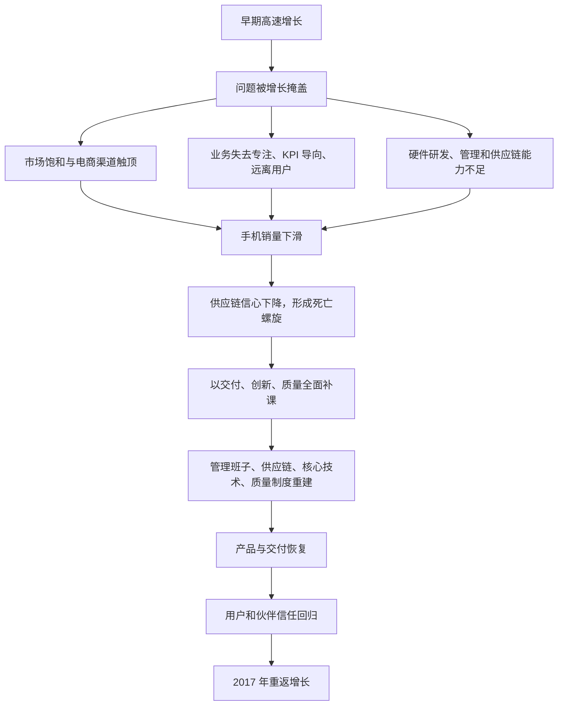

> 本章复盘小米从 2014 年高光时刻进入两年低谷，再通过交付、创新和质量补课实现逆转的过程。最值得学习的不是“如何翻盘”的传奇，而是高速增长怎样掩盖问题、企业如何面对内因，以及信任、能力和文化怎样共同支撑危机中的自救。

---

## 一、本章主线

2014 年，小米用三年时间成为中国第一、世界第三，估值达到 460 亿美元。高光之后，2015 年手机销量未完成目标，随后进入两年低谷。

雷军对危机的解释可以概括为：

本章最核心的认识是：**增长可以暂时遮住能力缺口，却不能消除它。环境改变以后，过去欠下的课会集中出现。**

---

## 二、从高光时刻到危机

### 2.1 2014 年的高光

小米在 2014 年第三季度成为中国第一、世界第三，登上《时代》周刊，并成为当时全球估值最高的未上市科技公司之一。
> **原书图示**：2014 年《时代》周刊报道小米的成功
高估值和行业地位代表外界认可，也会带来新的压力：

- 市场开始期待公司持续高速增长；
- 竞争者更重视并研究小米；
- 员工容易把阶段性成功当作能力已经成熟；
- 公司更容易扩张业务、组织和目标；
- 管理层可能不再敏感于早期的小问题。

因此，高光时刻不只是奖励，也是最需要保持清醒的时刻。

### 2.2 为什么雷军只“隐约感觉到”危机

高速增长时，许多问题会被好结果掩盖：

- 产品卖得快，质量和售后问题在总增长中不显眼；
- 订单增加，供应链愿意优先支持；
- 用户不断涌入，老用户流失暂时不明显；
- 部门都能完成增长目标，组织协同问题不容易暴露；
- 融资和现金充足，低效率也可以被资源填补。

管理层可能知道局部有问题，却很难判断哪些会发展成系统危机。等到市场增速放缓，原本被增长覆盖的问题就会同时出现。

### 2.3 为什么只看营收会低估危机

小米十年营收曲线中，低谷只表现为一段相对平缓的曲线；手机出货量曲线却出现明显缺口。

原因是集团营收可能受到多个业务、价格和产品组合影响。其他业务增长或产品均价变化，会遮住核心手机业务销量下滑。
> **原书图示**：小米集团手机业务出货量成长曲线
企业不能只看一个总指标，还要识别自己的核心引擎：

- 哪项业务决定用户规模；
- 哪项产品支撑品牌和渠道；
- 哪项能力一旦恶化，会拖累整个系统；
- 哪些早期指标会先于收入发出警报。

对小米而言，手机是商业模式的核心入口，出货量、产品口碑、激活、复购和供应链支持度都比集团总营收更早反映健康状况。

---

## 三、“死亡螺旋”是什么

### 3.1 手机销量为什么越跌越难恢复

手机行业高度依赖供应链。销量上升时：

- 供应商愿意优先提供新技术和产能；
- 大订单带来更好的采购条件；
- 产品更容易按时交付；
- 市场和渠道信心增强；
- 规模进一步扩大。

销量下降时，以上过程会反向运行：

- 供应商担心订单继续减少；
- 新器件、产能和账期支持变弱；
- 供货、成本和产品节奏恶化；
- 用户和渠道信心继续下降；
- 销量进一步下滑。

这就是原书所说的“死亡螺旋”。爱立信、摩托罗拉、诺基亚和 HTC 等昔日巨头，都曾在销量下滑后快速失去行业位置。

### 3.2 为什么供应商关注趋势而不只看现有规模

供应商要提前投资设备、材料和产能。如果客户正在增长，未来订单可能更大，供应商愿意投入；如果客户正在下滑，即使当前规模仍然可观，供应商也会担心专用投入无法回收。

因此，合作伙伴判断的不只是“你今天有多大”，还包括：

- 未来订单是否稳定；
- 产品计划是否可信；
- 付款和履约记录是否良好；
- 双方是否愿意长期共同投入；
- 客户是否有能力恢复增长。

供应链关系不能只在顺境中靠订单维持，逆境中的透明沟通和长期信用更重要。

### 3.3 小米早期优势为什么也会反向放大

第一章中的爆品和高效率模式，在增长时非常强：少量产品获得大销量，研发、采购、营销和渠道更高效。

但当爆品销量下降时，同样的依赖会变成脆弱点：

- 核心产品下滑会迅速影响整体业务；
- 规模优势减弱，成本和供应条件恶化；
- 低利润模式缺少厚利润缓冲；
- 线上渠道接近上限后，没有成熟线下体系接力；
- 高速增长形成的组织习惯来不及适应存量竞争。

任何优势都有成立条件。企业不仅要知道自己的飞轮如何正向转动，也要提前理解它会怎样反转。

---

## 四、先做正确归因：最关键的是自身能力不够

### 4.1 外因真实存在，但不能止步于外因

小米确实遭遇了市场饱和、渠道变化和行业竞争加剧。雷军仍把最关键原因归结为自身能力不足。

这种归因有两个好处：

- 外部环境无法控制，内部能力可以改变；
- 只有承认问题属于自己，组织才会真正投入整改。

但“都怪自己”也不能成为姿态。有效复盘必须把内外因素分开，明确哪些变化无法避免，哪些能力本应提前建设。

### 4.2 增长怎样掩盖问题

高速增长不仅遮住问题，有时还会制造新问题：

- 为满足增长目标，产品和业务迅速增加；
- 招聘和晋升速度超过人才培养速度；
- 部门增多后，协作越来越依赖指标和流程；
- 供应链只顾追产量，质量和长期能力建设被挤压；
- 用户数量快速上升，团队不再有能力保持早期的紧密互动。

因此，增长期也要建设与下一阶段匹配的系统能力。否则，公司越成功，积累的问题可能越大。

---

## 五、外部环境的两个变化

### 5.1 智能手机市场趋于饱和

小米创立时，大量用户正从功能机转向智能手机。市场快速扩大，优秀产品可以在不直接抢夺对手用户的情况下增长。

五年后，智能手机普及度大幅提高，竞争进入存量阶段：

- 新增用户减少；
- 换机周期和品牌转换更重要；
- 各家要从竞争者手中争夺份额；
- 品牌、渠道、售后和技术积累的重要性上升；
- 单靠早期口碑和线上流量难以持续增长。

同一种打法在市场早期有效，不代表在成熟期仍然有效。战略必须随行业阶段变化。

### 5.2 电商渠道遇到天花板

原书提到，当时电商只占商品零售市场约 20%，多数商品仍在线下流通。小米几乎完全依赖电商，因此只能触达愿意在线购买手机的人群。

拓展线下又会遇到矛盾：

- 传统多层渠道需要较高利润；
- 提价会破坏“价格厚道”；
- 降低出厂价格又会压缩本已很低的利润；
- 线下门店还需要选址、库存、人员和服务能力。

小米已经看到渠道问题，却因为没有找到兼顾效率与价格的线下模式而犹豫。这说明看见趋势不等于拥有行动方案，战略变化最终要靠能力创新落地。

### 5.3 手机市场进入寡头竞争

经过几年淘汰，全球手机市场主要由少数大型公司占据。竞争从单款产品对抗，变成体系之间的对抗：

- 核心技术与长期研发；
- 全球供应链和产能；
- 品牌和多层渠道；
- 操作系统、服务与生态；
- 质量、售后和全球合规；
- 资金和组织管理。

创业早期可以用一个突出长板打开市场，成熟期却不能存在致命短板。小米需要从“善于做爆品的创业团队”升级为“具备完整系统能力的大型科技企业”。

---

## 六、内部问题之一：心态和动作变形

### 6.1 高速成长带来的膨胀

雷军没有把心态问题只归咎于员工，而是说“包括我在内”。管理层对形势判断过于乐观，容易出现：

- 认为过去成功的方法可以自动延续；
- 低估硬件行业的长期积累；
- 同时进入更多业务和产品；
- 把增长结果误认为组织已经成熟；
- 对用户和一线问题失去敏感。

创始人承认自己的责任，能避免组织把复盘变成向下追责。

### 6.2 失去专注，不再克制

早期小米三年只做五款手机。后来业务和产品增多，资源开始分散：

- 每款产品得到的研发和管理注意力减少；
- 物料、库存和质量管理更加复杂；
- 产品之间定位容易重叠；
- 团队忙于协调，难以在关键体验上做到极致。

产品数量增加并非一定错误，问题在于扩张速度超过系统能力。每增加一个产品，都应问它是否满足清楚的用户需求，是否有足够团队负责，是否会削弱核心产品。

### 6.3 销售额和 KPI 与集团目标脱节

部门开始以销售额和局部 KPI 为导向，可能出现“每个部门都完成任务，集团却越来越差”的情况。例如：

- 为完成销量增加低价值机型；
- 为短期收入牺牲价格体系和用户体验；
- 为按时发布减少测试；
- 为部门成绩隐藏跨部门问题；
- 只优化可量化结果，忽略信任和口碑。

KPI 不是天然有害。问题在于指标只是目标的替代物，环境变化后，指标与真实目标可能分离。管理者需要持续检查：完成这个数字是否真的改善了用户价值和长期竞争力。

### 6.4 与用户的联系变弱

小米最早依靠社区和用户共同打磨产品，后来一些沟通阵地被荒废，用户声音无法有效进入团队。

失去用户联系会产生连锁反应：

- 团队不知道真实痛点；
- 产品优先级更多来自内部判断；
- 问题发现更晚；
- 用户觉得意见不再被重视；
- 社区参与和口碑下降；
- 公司进一步依赖销售和流量指标。

“用户导向”不能只靠创始期文化，要通过持续的社区运营、研究机制、客服闭环和管理层参与来维持。

---

## 七、内部问题之二：能力没有跟上规模

### 7.1 点状创新与系统能力的区别

小米早期做出过许多创新和亮点，但雷军承认尚未形成系统级能力。

- **点状创新**：依靠少数优秀个人，在某个产品或功能上取得突破；
- **系统能力**：通过人才、流程、技术平台、标准和组织，使多个产品能稳定达到高水平。

点状创新可以创造惊喜，却难以保证每款产品、每个批次和每个地区都可靠。公司从几款产品扩张到多品类后，必须把个人经验变成组织能力。

### 7.2 300 人与一两万人的差距怎样理解

当时小米硬件研发团队不到 300 人，而竞争者有一两万人。人数多不自动代表效率高，但有些工作确实需要足够规模：

- 核心器件研究；
- 相机、屏幕、充电和通信技术；
- 多机型并行开发；
- 大量测试和可靠性验证；
- 全球认证、专利和标准；
- 长期技术预研。

专注可以放大有限资源，却不能凭空替代基础投入。行业进入体系竞争后，小团队的灵活性必须与更深的专业能力结合。

### 7.3 严重低估硬件工业的难度

硬件问题往往跨越很长链条：设计、器件、模具、试产、量产、物流、售后。任何一环出错都可能影响交付和口碑，而且量产后很难像软件一样快速修复。

小米需要补的不只是某个技术点，而是：

- 产品开发流程；
- 项目和供应链管理；
- 质量标准和验证体系；
- 专业人才梯队；
- 风险识别和异常处理；
- 与供应商共同开发的能力。

对陌生行业保持敬畏，是跨界创新者必须补上的一课。

---

## 八、补课：交付、创新和质量

### 8.1 为什么雷军亲自接管手机部

2016 年 5 月，雷军亲自接管手机部，说明问题已经跨部门且关系公司生存。CEO 介入可以：

- 统一目标和优先级；
- 快速调动集团资源；
- 打破部门之间的责任推诿；
- 向员工和合作伙伴传递整改决心；
- 直接了解一线真实情况。

雷军曾一天开 23 个会，反映危机程度，也说明原有管理系统无法自行解决问题。CEO 亲自救火只能是阶段性措施，长期仍要建立能独立运转的组织。

### 8.2 为什么选择交付、创新和质量

三项分别对应当时最短的能力：

| 补课方向 | 当时的问题 | 目标 |
|---|---|---|
| 交付 | 产品经常缺货，供应链和预测能力不足 | 让承诺的产品稳定到达用户 |
| 创新 | 产品增多但不再“酷”，自研能力薄弱 | 形成持续而非偶然的产品突破 |
| 质量 | 快速扩张中品质控制不足 | 建立用户可以长期信任的底线 |

三者不能相互替代。只提高交付，会把普通或有缺陷的产品更快送到用户手中；只做创新，无法稳定量产；只强调质量而没有创新，产品会可靠但缺乏竞争力。

### 8.3 “交付”不只是提高产量

到 2016 年，小米才真正理解交付的含义。它包含：

- 准确预测需求；
- 提前锁定关键器件和产能；
- 让研发、采购和生产计划一致；
- 控制试产、良率和量产节奏；
- 管理库存和物流；
- 对异常准备替代方案；
- 按承诺的时间、数量和质量把产品送到用户手中。

用户只看最终能否买到好产品，不会替企业区分问题属于芯片、工厂还是物流。交付能力就是把复杂内部协作变成可靠外部承诺的能力。

### 8.4 缺货与“饥饿营销”

米粉长期买不到产品，容易认为小米故意制造稀缺。雷军解释，真正原因是交付能力不足。

这件事提醒企业：主观动机不能代替用户体验。即使不是故意，长期缺货仍然伤害用户，也说明公司承诺超过了自身能力。企业需要透明说明问题，并用实际改善恢复信任，而不是只争论外界误解。

---

## 九、四项具体整改

### 9.1 重建管理班子

小米从三个方向补充管理者：

- 内部提拔年轻、可靠的工程师；
- 从集团其他部门转岗干部；
- 从外部招聘成熟人才。

三种来源各有价值：内部人才理解文化和业务，集团转岗能促进跨部门协同，外部人才带来行业经验。危机中的组织调整不能只“空降”或只“内部提拔”，需要兼顾连续性和新能力。

### 9.2 成立专门供应链团队

由紫米科技创始人张峰负责，专项解决手机供货问题。

成立专门团队意味着：

- 交付有明确负责人；
- 供应问题不再分散在多个部门；
- 能系统管理预测、采购、制造和合作伙伴；
- 供应链获得与产品研发相匹配的组织地位。

专项团队适合危机突破，问题稳定后仍要把能力沉淀到常规流程，不能永远依赖少数救火者。

### 9.3 加大核心技术投入

小米成立核心器件部、相机部等部门，持续投入屏幕、拍照和充电技术。

这些方向直接影响用户对手机的高频体验，也是头部厂商拉开差距的关键。小米需要从“选择和整合优秀通用器件”转向：

- 更早参与器件定义；
- 与供应商联合研发；
- 建立自己的算法、调校和工程能力；
- 提前储备下一代技术；
- 让创新能够跨产品持续复用。

核心技术投资见效慢，危机中却不能全部砍掉。若只保留能立即带来销量的项目，公司恢复后仍会缺少长期竞争力。

### 9.4 成立质量委员会并实行一票否决

雷军亲自担任手机部质量委员会主席，确立质量一票否决制。

质量容易在进度、成本和销量压力下被牺牲。所谓一票否决，是把质量从“众多考核项之一”提升为不能交换的底线：即使发布节点重要、销售目标紧张，只要质量不达标，就不能继续。

制度要有效，需要：

- 质量标准清楚且可验证；
- 质量部门有独立判断权；
- 重大问题能直达最高负责人；
- 复盘追求改进系统，而不是只处罚个人；
- 供应商也进入统一质量体系。

一票否决不能变成无限拖延或部门权力工具，仍需明确风险等级和决策规则。

---

## 十、为什么小米能够逆转

### 10.1 整改到结果需要时间

2016 年开始全面补课，2017 年第二季度手机出货量才出现明显反弹，到第四季度重返全球前四。

交付、技术和质量都不是开几次会就能改变的：

- 新团队需要磨合；
- 供应计划和产品周期需要数月；
- 技术投入要经过研发和量产；
- 质量体系要在多批产品中验证；
- 用户信任也需要通过新产品逐步恢复。

面对系统问题，管理层既要有紧迫行动，也要接受结果存在时滞，不能因为短期数字未改善就频繁改变方向。

### 10.2 用户信任提供了恢复窗口

雷军认为，小米能够逃离死亡螺旋，最重要的基础是用户仍然相信小米会重新做好产品。

这种信任来自长期坚持“感动人心、价格厚道”，也来自早期与用户共同成长的关系。它在危机中带来：

- 用户愿意等待产品改善；
- 新产品仍能获得关注和尝试；
- 社区愿意提供反馈；
- 公司不必用过度降价或欺骗性营销换取短期销量；
- 团队相信自己的工作仍有人期待。

信任不是免除责任。若企业反复消耗而不兑现，耐心终会消失。信任的价值在于给公司一次修正机会，而不是保证必然翻盘。

### 10.3 坚守价值观具有现实经营价值

危机时最容易做的事情包括降品质、清库存、过度促销、夸大宣传或把成本转嫁给伙伴。这些动作可能短期改善数字，却会消耗仅剩的用户和供应链信任。

小米选择继续坚持产品和价格原则，使用户相信低谷是能力问题而不是公司放弃承诺。价值观在这里不是装饰，而是危机中决定哪些动作不能做的决策边界。

### 10.4 反思、复盘、学习和迭代怎样落到行动

这几个词必须对应实际改变：

- **反思**：承认关键原因在自身能力；
- **复盘**：找出市场、渠道、心态和能力的具体问题；
- **学习**：引入硬件、供应链和管理人才；
- **迭代**：用新组织、新技术和新制度持续改善产品。

若只有会议和口号，没有负责人、资源和制度变化，就不算真正复盘。

---

## 十一、MIX：危机中仍然坚持探索

### 11.1 为什么 MIX 项目很容易被砍

第一代 MIX 是一款不考虑大规模量产的探索性产品，立项于小米早期成功的顶峰。后来公司进入生死危机，继续投入一个商业回报不确定的项目，看起来很不理性：

- 资源紧张；
- 量产难度大；
- 未必贡献销量；
- 研发失败概率高；
- 当期更需要解决供货和主力产品问题。

团队仍然坚持项目，说明小米没有把“补课”理解成只修补眼前问题。

### 11.2 MIX 的价值不只在销量

MIX 的全面屏设计向三类对象发出信号：

- **用户**：小米仍有能力做令人惊艳的产品；
- **员工**：公司没有放弃工程师文化和技术理想；
- **供应链与行业**：小米仍值得共同投入未来技术。

它也探索了屏幕、结构、材料和交互的未来方向。探索项目的价值常常是打开新可能、培养能力和改变认知，不能只用当期销量评价。

### 11.3 危机中保留探索项目的边界

不是所有长期项目都应在危机中保留。至少要满足：

- 与公司核心方向高度相关；
- 能形成关键技术或人才能力；
- 即使不成功，也能留下有价值的学习；
- 投入规模不会威胁基本生存；
- 有清楚的阶段目标和停止条件。

坚持创新不等于拒绝取舍。真正重要的是不要为了短期安全，把未来能力全部砍掉。

---

## 十二、供应链、质量与创新是一体的

### 12.1 从交易关系变成伙伴关系

MIX 和后来的产品创新不只依赖小米研发，也依赖供应商共同开发、试产和量产。

若企业只在采购时压价，在困难时转嫁库存，供应商不会愿意为高风险创新投入。伙伴关系需要：

- 真实分享产品计划和风险；
- 尊重合作伙伴的合理利益；
- 按承诺付款和履约；
- 出现问题时共同解决而非单方面追责；
- 让效率提升的收益被产业链共同分享。

供应链信任既是交付基础，也是创新基础。

### 12.2 质量既是底线，也是上限

质量是底线，因为用户购买的每台产品都必须安全、可靠、符合承诺。

质量也是上限，因为越激进的设计、越新的器件和越复杂的结构，越需要强大的验证和量产控制。没有质量能力，创新只能停留在样机，不能稳定交给大规模用户。

因此，创新与质量不是冲突关系：

- 创新决定产品能走多远；
- 质量决定创新能否真正落地；
- 交付决定用户能否按时获得它。

### 12.3 对硬件工业重建敬畏

小米低谷的重要收获，是从早期的“互联网方法可以改变一切”，转向理解硬件工业需要长期积累。

敬畏不等于保守，而是承认：

- 物理世界的错误代价更高；
- 供应链和制造需要长期信用；
- 质量来自系统而非口号；
- 核心技术不能完全依赖外部；
- 创新必须经得起量产和用户长期使用。

只有尊重这些规律，互联网方法才能真正提高制造业效率。

---

## 十三、文化为什么能支撑危机

### 13.1 “钢铁军团”与共同目标

雷军把小米团队描述为有共同使命愿景、团结一致的“钢铁军团”，而不是只为报酬工作的雇佣兵。

危机中，共同目标能够：

- 让员工理解为什么要承担艰难调整；
- 在短期数字不好时维持行动方向；
- 降低部门之间的相互推诿；
- 保留对创新和用户承诺的投入；
- 增强团队面对不确定性的韧性。

### 13.2 文化不能替代制度和专业能力

只有热情和忠诚，不足以解决供应链、研发和质量问题。小米真正实现逆转，是因为文化与具体措施结合：重建管理班子、成立供应链团队、投资核心技术、建立质量否决制度。

成熟组织需要两者：

- 文化回答为什么做、遇到冲突时坚持什么；
- 制度回答由谁做、怎样做、如何检查和纠正。

把员工要求成“钢铁军团”也不能成为无限加班或忽视个体权益的理由。长期战斗力来自合理组织、专业能力和共同信任。

---

## 十四、本章方法论总结

### 14.1 危机处理的完整步骤

1. **识别核心引擎**：不要让总量指标掩盖关键业务恶化；
2. **理解负向循环**：找出销量、供应、成本和信心如何互相影响；
3. **区分内因与外因**：承认环境变化，更要找到可改变的内部问题；
4. **管理层承担责任**：避免复盘变成向下追责；
5. **找出最短能力板**：小米选择交付、创新和质量；
6. **建立明确抓手**：负责人、团队、资源和制度必须同时改变；
7. **保留用户与伙伴信任**：不以短期动作消耗恢复基础；
8. **保留必要的长期探索**：危机整改不能只剩眼前生存；
9. **接受能力建设的时滞**：保持方向稳定，用阶段成果检查进展；
10. **把个人救火变成组织能力**：最终让系统不再依赖 CEO 亲自推动。

### 14.2 本章最重要的概念

| 概念 | 通俗理解 |
|---|---|
| 增长掩盖问题 | 好结果会让组织误以为能力已经成熟 |
| 死亡螺旋 | 销量下滑导致供应支持下降，进而加速销量下滑 |
| 动作变形 | 规模扩张后，原有原则在部门行为中逐渐走样 |
| 点状创新 | 依赖个人做出亮点，难以稳定复制 |
| 系统能力 | 通过人才、流程、技术和标准持续交付高水平产品 |
| 交付 | 把产品按承诺的时间、数量和质量送到用户手中 |
| 质量一票否决 | 质量是不能用进度、成本或销量交换的底线 |
| 信任窗口 | 用户和伙伴的长期信任为企业整改争取时间 |

### 14.3 不能简单照搬的地方

- CEO 亲自接管适合生存危机，不是常态管理方式；
- 一票否决需要清楚标准，否则可能导致决策僵化；
- 大规模增加研发人员必须配合组织和技术规划；
- 保留探索项目要有生存边界和停止条件；
- 强调使命不能替代合理激励、劳动保障和专业制度；
- 小米的逆转依赖庞大忠实用户基础，新公司未必拥有同样缓冲。

### 14.4 第一章优势的另一面

| 第一章的优势 | 低谷中暴露的风险 |
|---|---|
| 少机型、爆品 | 核心产品下滑会迅速影响全局 |
| 线上直销 | 线下市场难以覆盖 |
| 快速迭代 | 硬件质量不能靠发布后快速修复 |
| 小团队、自驱 | 规模扩大后缺少管理系统 |
| 顶级供应链 | 没有长期信用时支持容易波动 |
| 用户口碑 | 远离社区后，信任和反馈会下降 |

真正成熟的方法论，不只会解释成功，还能说明成功条件失效时会发生什么。

### 14.5 一页速记

> **危机起点**：2015 年手机销售未达目标，核心业务开始下滑。 
+> **外部变化**：市场从增量转向存量，电商渠道触顶，行业进入寡头竞争。 
+> **内部心态**：膨胀、失去专注、KPI 导向、远离用户。 
+> **内部能力**：硬件研发、管理、供应链和质量体系没有跟上规模。 
+> **三项补课**：交付、创新、质量。 
+> **四项措施**：重建管理班子、成立供应链团队、投入核心技术、实行质量一票否决。 
+> **恢复基础**：用户信任、伙伴支持、工程师文化和真正的组织改变。 
+> **代表产品**：MIX 证明公司在危机中没有放弃长期创新。 
+> **核心教训**：增长不是能力本身；当环境改变，企业必须把早期依赖个人和机会的成功，升级为可持续的系统能力。
