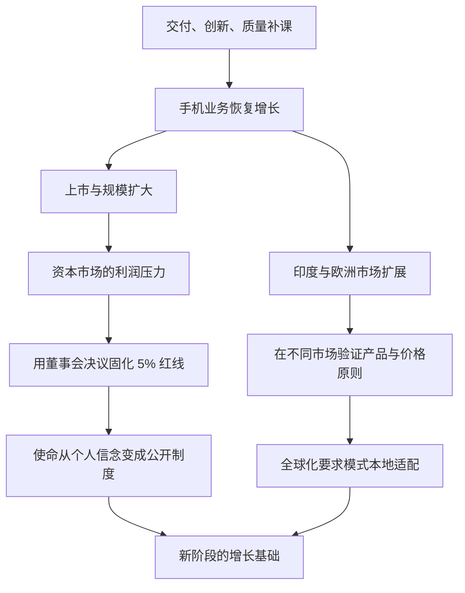

> 本章讲述小米走出低谷后取得的两项重要成果：成为上市公司并进入世界 500 强，以及把业务扩展到印度、欧洲等全球市场。核心问题是：企业规模和利益相关者变化后，怎样守住创业使命；一种在中国形成的商业模式，又怎样接受不同市场的检验。

---

## 一、本章主线

经过两年补课，小米从 2017 年开始恢复高速增长，随后迎来几个里程碑：

- 2018 年在香港上市；
- 2019 年成为当时最年轻的《财富》世界 500 强企业；
- 2020 年手机业务重回世界前三；
- 全球市场快速扩展，海外收入占集团收入的一半。

这些成绩不是第二章整改的终点，而是带来两个新问题：

1. 上市后，资本市场要求利润增长，小米怎样继续坚持价格厚道？
2. 进入不同国家后，小米模式能否超越中国特定环境？

---

## 二、从低谷重回增长意味着什么

### 2.1 逆转不是回到原来的状态

小米恢复增长，并不是简单重复第一章的创业打法。经过低谷，公司已经认识到：

- 互联网方法不能代替硬件工业基本功；
- 高速增长必须有交付、创新和质量体系支撑；
- 单一线上渠道存在覆盖上限；
- 点状创新必须升级为持续的技术能力；
- 用户和供应链信任需要长期经营。

因此，“重回增长”更重要的含义，是增长开始建立在更完整的能力上。

### 2.2 “没有手机公司能逆转”应怎样理解

原书把小米称为手机行业销量下滑后实现逆转的罕见案例。这种说法强调行业死亡螺旋的严重性，不必把它理解为经过完整统计证明的绝对定律。

小米能够恢复，至少依赖几个特殊条件：

- 仍有数以千万计的忠实用户；
- 品牌和社区信任尚未耗尽；
- 公司有资金和时间补课；
- 创始人能直接推动跨部门调整；
- MIX、小米 6 等产品重新证明创新能力；
- 供应链伙伴愿意重新投入支持。

这些条件说明，小米案例值得借鉴，但不能让任何下滑企业都认为自己必然可以翻盘。

---

## 三、上市带来的新问题

### 3.1 上市不只是融资和荣誉

2018 年 7 月 9 日，小米在香港上市，成为港股第一家同股不同权的上市公司，并成为当时全球规模最大的科技公司 IPO 之一。

上市会给公司带来资本、知名度、人才激励和公开市场监督，同时也改变经营环境：

- 股东数量和类型增加；
- 财务结果需要定期披露；
- 管理层承受季度和年度业绩压力；
- 股价会影响员工、投资者和合作伙伴信心；
- 公司决策需要兼顾更多利益相关者。

创业期依靠创始人信念维持的原则，上市后必须经得起资本市场和管理层更替。

### 3.2 什么是“同股不同权”

同股不同权是指不同类别股份拥有不同投票权。它让创始团队在持股比例下降后，仍能保持较强的公司控制力，从而坚持长期战略。

它要解决的是科技公司长期投入与资本市场短期压力之间的冲突。但它也有风险：控制权过于集中，普通股东纠正错误决策的能力会变弱。

因此，同股不同权不能代替治理。公司仍需要独立董事、信息披露、审计、股东监督和明确的责任机制。

### 3.3 雷军真正担心的是什么

雷军相信自己能抵抗追求高利润的压力，却担心未来不再担任 CEO 时，后来的管理层是否仍会坚持“感动人心、价格厚道”。

这揭示了一个普遍问题：

> 只存在于创始人头脑中的价值观，无法保证跨越管理层和时间。

如果一种商业模式依赖某个人始终克制，随着管理层更替、股权变化或经营压力增加，承诺很容易改变。长期使命需要从个人选择转化为组织制度。

---

## 四、把使命写进制度：硬件综合净利润率 5% 红线

### 4.1 这项承诺是什么

2018 年 4 月 25 日，小米上市前夕，董事会通过决议：

> 小米硬件综合净利润率永远不会超过 5%；如有超出，将以合理方式全部返还给用户。

这项承诺把“价格厚道”从品牌口号变成公开、可监督的经营约束。
> **原书图示**：小米在 IPO 前夕向用户作出硬件综合净利润率承诺
### 4.2 为什么要在上市前完成

上市前，现有股东可以共同决定公司的长期原则，并把它写入对未来投资者公开的文件。新投资者买入股票时，已经知道这一约束。

如果上市后再突然限制利润，会面临更大问题：

- 可能改变投资者购买时的预期；
- 更容易被认为损害股东利益；
- 股东数量更多，达成共识更难；
- 管理层承受的短期市场压力更强。

因此，重要原则最好在利益结构发生巨大变化之前制度化。

### 4.3 投资人为什么强烈反对

原书记录了三类担忧：

- 限制利润是否会影响上市和估值；
- 这是否改变了投资人最初投资时理解的商业模式；
- 临近上市再加入重大承诺，是否增加执行风险。

这些担心并不只是投资人“贪婪”。资本投入需要合理回报，临时改变重要规则也会影响信任。决策难点在于：小米承认短期成本，仍然相信长期用户信任比提高硬件利润更有价值。

最终投资人被“优秀的公司赚取利润，伟大的公司赢得人心”说服。真正支撑这句话的，不是情绪，而是小米相信：

- 低利润能保持产品价格竞争力；
- 价格厚道能扩大用户规模；
- 用户信任能降低获客成本并提高复购；
- 公司还可通过互联网服务、新零售和生态业务获得合理利润；
- 长期品牌价值可能超过短期放弃的硬件利润。

### 4.4 为什么是 5%，而不是最初设想的 3%

雷军最初考虑 3%，董事会最终选择 5%，主要是为了给国际化经营中的汇率等波动留出空间。

利润约束如果过紧，企业在原材料涨价、汇率变化、关税调整、产品召回或需求波动时，很容易转为亏损。长期承诺必须既有约束力，也能承受正常经营风险。

这里有一个重要原则：

> 好的红线不是看起来最激进的数字，而是能够长期坚持、同时真正约束行为的数字。

### 4.5 5% 红线约束的准确范围

这项承诺容易被误解，需要分清：

- 它约束的是**硬件综合净利润率**；
- 不是单款产品的毛利率；
- 不是所有硬件都必须恰好赚 5%；
- 不是集团全部业务净利润率不能超过 5%；
- 互联网服务、零售等业务有不同成本和利润结构。

“综合”意味着不同硬件产品放在一起核算，“净利润”意味着还要考虑研发、销售、管理等费用。理解口径，才能正确监督承诺。

### 4.6 “超出部分返还用户”如何理解

承诺保留了“以合理方式”返还的空间，可能通过降价、优惠、提升配置、增加服务等方式实现。

这也留下需要持续说明的问题：

- 超出部分如何计算；
- 哪些用户获得返还；
- 返还发生在什么时间；
- 是现金、价格还是产品价值；
- 外部如何验证。

公开承诺只有配合清楚披露和可检查做法，才能长期维持可信度。

---

## 五、从个人信念到组织承诺

### 5.1 制度化的三层作用

5% 红线至少有三层作用：

1. **约束管理层**：面对利润压力时，不能轻易通过提高硬件利润解决问题；
2. **稳定用户预期**：用户相信价格厚道不是临时促销；
3. **倒逼效率提升**：利润空间有限，公司必须从产品、规模、渠道和周转中寻找效率。

限制一个容易获得的选项，反而迫使组织建设更困难但更长期的能力。

### 5.2 公开监督为什么重要

小米上市后的财报连续披露硬件综合净利润率低于 5%。公开披露让承诺不再只由公司自己解释：

- 投资者可以查看；
- 媒体和用户可以比较；
- 管理层违背承诺会付出品牌和信用代价；
- 员工做产品和定价时有清楚边界。

制度真正有效，需要明确口径、持续披露和足够高的违约成本。

### 5.3 四年数据能够说明什么

原书指出，2018 至 2021 年财报均显示硬件综合净利润率低于 5%，同时公司营收和利润总额继续增长。

这至少说明，在那几年中：

- 低硬件利润与企业总体盈利可以同时存在；
- 公司不必只靠提高硬件加价获得增长；
- 用户规模、产品结构、运营效率和其他业务能够支持模式。

但四年数据不能证明这种模式在任何行业、国家和经济周期中都必然有效。长期可持续性仍需继续观察。

### 5.4 平均售价上升是否违背价格厚道

手机平均售价和公司利润提升，不一定表示同样产品被卖得更贵。平均售价也可能因为用户购买了配置更高、成本更高的产品而上升。

需要区分：

- **合理高端化**：投入更多技术、材料和服务，产品价值与成本同时提高；
- **单纯品牌溢价**：产品改善有限，主要依靠品牌把价格抬高。

价格厚道不是所有产品都低价，而是在每个价位段提供与价格相称、甚至超出价格的价值。

---

## 六、最年轻的世界 500 强

### 6.1 这一里程碑说明什么

2019 年，小米创立九年后进入《财富》世界 500 强，排名第 468 位，成为当时最年轻的世界 500 强企业。

它说明小米在较短时间建立了巨大的业务规模，也证明低硬件利润模式可以支持大规模经营。

### 6.2 不能把榜单当成最终目标

世界 500 强主要按营业收入排序，反映规模，不直接代表：

- 利润质量；
- 技术领先程度；
- 用户满意度；
- 组织健康；
- 环境和社会责任；
- 长期竞争力。

低利润、大销量的企业更容易形成巨大营收。因此，入榜是阶段性成果，不是“小米模式已经全面成功”的充分证明。

“最年轻”更有意义的地方，在于显示公司增长速度和模式扩张能力；同时也提醒，小米仍然年轻，许多能力和治理需要继续建设。

---

## 七、走向全球

### 7.1 全球化要验证什么

小米模式诞生于中国特定环境：成熟制造供应链、移动互联网快速普及、电商增长和价格敏感的大众市场。

走向全球是在检验：

- 不同文化的用户是否也重视高品质和合理价格；
- 直销、零售和社区方法能否迁移；
- 供应链效率能否支撑不同地区；
- 品牌是否能跨越语言和认知差异；
- 公司能否处理当地法规、渠道、售后和数据要求。

只有在差异明显的市场中仍能创造用户价值，方法才具有更强的普遍意义。

### 7.2 为什么先进入印度

小米 2014 年正式进入印度，2017 年第三季度登顶当地市场。

印度与小米早期中国市场有一些相似条件：

- 智能手机处于快速普及阶段；
- 大量消费者重视价格和配置；
- 安卓生态成熟；
- 线上销售快速发展；
- 年轻用户愿意接受新品牌。

这些条件让小米的高性价比和线上渠道优势比较容易发挥。

但相似不代表照搬。印度市场仍需要当地生产、渠道、售后、语言、内容和合规能力。全球化成功依赖本地团队，而不只是把中国产品翻译后出售。

### 7.3 为什么欧洲更晚

小米从 2019 年开始系统发力欧洲市场，一年内在西班牙公开市场取得第一，随后进入法国和德国。

欧洲市场更成熟，用户换机为主，运营商渠道、隐私规则、专利、品牌和售后要求也更复杂。小米需要先积累：

- 更完整的全球渠道能力；
- 高端产品和品牌认知；
- 当地认证和合规经验；
- 本地团队与零售网络；
- 更稳定的质量和服务体系。

进入顺序体现了一个原则：全球化不是哪里市场大就同时进入，而应选择与当前能力匹配的市场，逐步增加难度。

### 7.4 “公开市场第一”的口径

公开市场通常指非运营商合约渠道。西班牙公开市场第一，说明小米在零售和电商渠道表现突出，但不一定等于包含全部运营商渠道后的整体市场第一。

商业数据需要保留口径。限定词不是细节，它决定结论能说明什么、不能说明什么。

### 7.5 “小米模式具有普适性”应怎样理解

印度和欧洲的成绩支持一个重要判断：不同地区的消费者普遍希望产品既好又价格合理。

但“普适”不表示每个国家都能使用同样产品、价格和渠道。更准确的理解是：

- 用户价值原则可以跨市场；
- 具体产品必须适应当地需求；
- 渠道要符合当地购买习惯；
- 服务、内容和法规需要本地化；
- 品牌、专利和售后能力要随市场成熟度升级。

普适的是“感动人心、价格厚道”的方向，不是某套固定操作流程。

### 7.6 全球化成果与时间边界

截至原书记载的 2021 年第二季度：

- 小米为全球 100 多个市场提供产品和服务；
- 手机业务在印度保持领先；
- 在欧洲排名第二；
- 在全球 62 个国家和地区进入市场份额前五；
- 海外市场收入约占集团收入一半。

这些数字反映的是特定时点。手机市场变化快，排名会受到新品周期、供应、政策和竞争影响，不能把书中数据当作长期不变的现状。

---

## 八、全球化中的效率与责任

### 8.1 全球规模可以带来什么

- 更大的采购规模；
- 研发成果服务更多用户；
- 品牌和产品经验跨市场复用；
- 不同市场周期互相补充；
- 为互联网服务和 IoT 生态扩大基础。

规模只有与本地价值结合，才能转化为真正效率。若产品不适合当地用户，规模只会带来库存和管理负担。

### 8.2 全球化不能只追求市场份额

企业还要处理：

- 当地员工与合作伙伴利益；
- 数据、隐私和网络安全；
- 税务、专利与监管；
- 产品安全和售后；
- 不同国家的政治和供应风险；
- 本地社会对中国品牌的信任。

价格优势可以帮助进入市场，长期地位仍由产品、服务、合规和品牌共同决定。

### 8.3 海外收入占一半意味着什么

这说明小米已经不再主要依赖中国单一市场，模式具备较强扩展能力；同时也意味着汇率、关税、地缘风险和多地区管理会显著影响公司。

这也解释了为什么 5% 红线需要保留经营余量：国际化越深，企业面对的外部波动越多。

---

## 九、本章方法论总结

### 9.1 把价值观变成长期制度

一个希望跨越创始人任期的原则，需要做到：

1. **定义清楚**：约束什么指标和范围；
2. **正式确认**：由有权机构写入决议或规则；
3. **公开透明**：利益相关者事先知道；
4. **持续披露**：外部能够检查是否兑现；
5. **留有余量**：能承受正常经营波动；
6. **设置后果**：违反承诺会承担真实成本；
7. **配套商业模式**：约束不能让公司失去生存能力。

制度化不是把口号写在墙上，而是主动限制未来更容易但违背使命的选择。

### 9.2 全球化的正确顺序

1. 先明确哪些价值原则可以跨市场；
2. 选择与现有能力最匹配的首批市场；
3. 建立本地团队、渠道、服务和合规能力；
4. 用一个市场积累经验，再进入更复杂市场；
5. 区分可复用的核心能力与必须本地化的部分；
6. 不只看销量，也看用户满意、品牌、合规和长期经营质量。

### 9.3 本章最重要的概念

| 概念 | 通俗理解 |
|---|---|
| 使命制度化 | 把依赖个人坚持的原则变成组织长期约束 |
| 5% 红线 | 限制硬件综合净利润，确保效率红利更多回到用户 |
| 经营余量 | 规则既要有约束力，也要能承受汇率和市场波动 |
| 公众监督 | 持续披露，让承诺能够被外部检查 |
| 模式普适性 | 核心价值能跨市场，但产品和做法必须本地化 |
| 能力匹配 | 按组织当前能力选择进入市场的顺序和速度 |

### 9.4 需要保留的边界

- 5% 红线是小米的战略选择，不是所有企业的统一标准；
- 低硬件利润需要规模、效率和其他合理利润来源支持；
- 董事会决议仍需要清楚披露和长期执行；
- 世界 500 强衡量规模，不代表企业所有方面都领先；
- 海外市场排名有渠道和时间口径；
- 印度、欧洲的成功不能证明每个国家都会同样成功；
- “全球用户都喜欢好产品和合理价格”方向正确，但用户对品牌、设计、服务和价格的权重并不完全相同。

### 9.5 与前两章的连接

- 第一章通过产品、社区和直销建立高性价比模式；
- 第二章补齐交付、创新和质量，让模式从创业打法升级为系统能力；
- 第三章把价格原则制度化，并开始检验模式能否跨地区扩展。

三个阶段说明，一套商业方法要长期成立，需要依次解决：**从零验证、危机补课、制度固化和规模扩展。**

### 9.6 一页速记

> **恢复增长**：两年补课后，小米从 2017 年重新进入增长。 
+> **上市新问题**：资本市场可能推动公司追求更高的短期硬件利润。 
+> **制度解法**：上市前由董事会确定硬件综合净利润率不超过 5%。 
+> **为什么不是 3%**：为汇率和国际经营波动保留合理余量。 
+> **承诺范围**：硬件综合净利润率，不是集团全部利润，也不是单品毛利率。 
+> **长期逻辑**：克制硬件利润，以用户信任、规模、效率和持续服务获得合理回报。 
+> **全球化路径**：先进入条件相似的印度，再进入更成熟复杂的欧洲。 
+> **普适与本地化**：高品质和合理价格是共同方向，产品、渠道、服务与合规必须因地制宜。 
+> **核心启示**：企业变大后，使命要从创始人的信念变成可执行、可监督、能长期坚持的制度。
