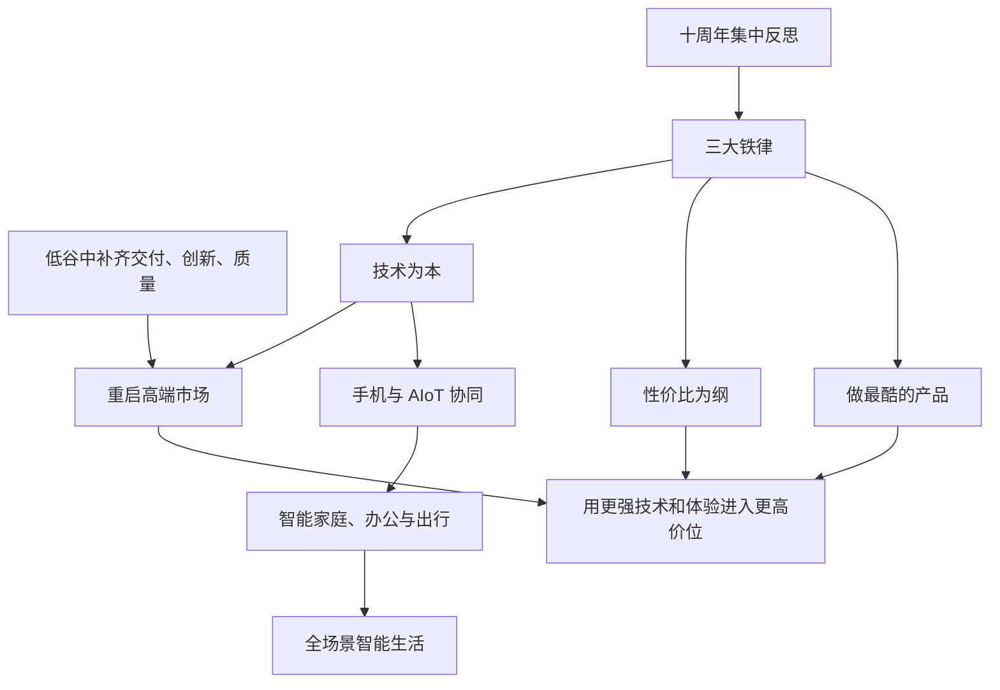
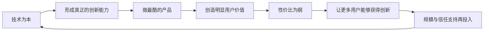

> 本章是小米前十二年创业历程的阶段总结，也是从创业故事进入方法论部分的桥梁。全章围绕三个问题展开：怎样重启高端市场，怎样用“三大铁律”稳定长期方向，以及怎样从手机扩展到全场景智能生活。

---

## 一、本章主线

走出低谷并重新增长后，小米不再只需要解决“活下来”，而要回答下一阶段往哪里走：

1. **产品层**：在成熟手机市场中，怎样建立高端技术和品牌能力；
2. **原则层**：公司规模扩大后，哪些东西不能随环境改变；
3. **生态层**：手机、智能设备、云和人工智能怎样形成统一体验；
4. **组织层**：怎样让大公司重新保持创业精神和长期投入。

本章的核心不是“业务越做越多”，而是用稳定原则判断哪些新方向值得做，以及如何让它们围绕同一用户价值协同。

---

## 二、重启高端市场

### 2.1 为什么用“重启”而不是“进入”

第一代小米手机定价 1999 元，在 2011 年高于当时国产手机平均价格，目标也是顶级旗舰。小米不是从低端起家，而是用接近成本的价格做旗舰产品。

后来红米和极致性价比深入人心，小米品牌逐渐被大量用户理解为“价格便宜”。随着行业旗舰价格不断上升，小米在高端市场的话语权反而减弱。因此，2019 年以后做高端，是重新回到创业时的旗舰目标。

### 2.2 为什么成熟手机市场必须做高端

#### 技术竞争需要更高投入

头部手机厂商都能获得主流芯片和器件，仅靠采购通用方案越来越难形成差异。相机、屏幕、充电、材料、结构、算法和系统体验都需要长期自研和联合研发。

若公司始终只在低价格段竞争，研发投入很难获得足够空间，也难以吸引顶尖人才和供应链共同探索前沿技术。

#### 高端产品能建立品牌上限

消费者通常用旗舰产品判断一家科技公司的最高能力。高端产品即使销量不是最大，也会影响：

- 整体品牌认知；
- 用户对中端产品的信任；
- 渠道和运营商合作；
- 供应商对联合创新的意愿；
- 优秀人才对公司的判断。

#### 用户需求已经分层

小米用户规模扩大后，一部分早期用户收入和需求升级，希望获得更先进的技术、设计和服务。若小米不能提供，他们只能转向其他品牌。

高端化不是放弃大众市场，而是补齐用户从入门到高端的完整选择。

### 2.3 高端化不等于提高品牌溢价

真正的高端化应当先提高产品价值：

- 更强的核心技术；
- 更好的材料、工艺和设计；
- 更可靠的质量；
- 更完整的软件和服务；
- 更专业的渠道与售后体验。

价格上升应当是研发、物料、制造和服务升级的结果，而不是把原有产品换个名字卖得更贵。

这与性价比并不冲突。性价比不是绝对低价，而是在任何价位都提供有竞争力的价值。

### 2.4 小米高端化为什么特别困难

小米长期以价格厚道著称，这既是优势，也是认知限制。用户可能会问：“同一个品牌为什么突然卖得更贵？”

高端市场还要求：

- 有难以替代的技术特点；
- 设计、材料和细节没有明显短板；
- 量产质量稳定；
- 售后和线下体验匹配高价产品；
- 品牌在多个产品周期持续兑现，而不是偶尔成功一次。

高端品牌信任无法靠广告一次建立，需要连续几代产品证明。

### 2.5 小米与 Redmi 品牌分工

2019 年，小米和 Redmi 分拆：

| 品牌 | 主要任务 |
|---|---|
| Redmi | 继续承担极致性价比，服务大众市场 |
| 小米 | 追求极致技术、体验和高端突破 |

品牌分工解决了一个定位冲突：同一品牌若同时强调最低价格和最高端体验，用户很难形成清楚认知。

但分拆本身不会自动成功，还需要：

- 两个品牌有清楚而稳定的产品边界；
- 避免价格带和产品功能互相挤压；
- 共享技术和供应链时仍保持体验差异；
- 让 Redmi 不等于低质量，让小米不等于高溢价。

### 2.6 为什么要逐级进入更高价格段

小米用一系列产品逐步上探：

- 2020 年小米 10 进入 4000 元价格段；
- 小米 10 Pro 和小米 10 Ultra 进入 5000 元价格段；
- 小米 11 系列进入 6000 至 7000 元价格段；
- 首款折叠屏小米 MIX Fold 进入万元市场。

逐级提升有三个作用：

1. 每一代产品积累技术和量产经验；
2. 用户逐步更新对品牌能力和价格范围的认识；
3. 渠道、服务和组织有时间同步升级。

一步跨到最高价位，容易因技术、质量或品牌承接不足而失败。高端化要看能否在多个产品周期中站稳，而不是是否发布过一款高价产品。

### 2.7 怎样理解高端手机出货量

原书提到，2021 年第一季度小米高端手机出货量超过 400 万台。它说明高端战略获得初步市场回应，但雷军的表述是“迈出了成功的第一步”，并未声称已经完成高端化。

判断高端化是否真正成功，还应长期观察：

- 高端产品销量和份额能否持续；
- 用户满意度、复购和品牌偏好；
- 核心技术是否形成稳定差异；
- 售后与渠道体验是否匹配；
- 是否减少对单次促销和市场空缺的依赖。

### 2.8 高端化为什么可能带动全线增长

- 旗舰技术可以逐步下放到中端产品；
- 高端产品提升品牌可信度；
- 更完整的产品线能留住升级用户；
- 高端能力帮助进入更强的渠道；
- 更大收入和利润空间支持研发再投入。

原书记录，小米在 2020 年第三季度重返全球前三，2021 年第二季度首次成为全球第二。雷军同时承认排名会反复，说明“短期站上”和“长期站稳”是两件事。

---

## 三、明确“三大铁律”

### 3.1 为什么十周年需要重新立规矩

2020 年，小米用半年多时间集中反思创业十年，并明确“三大铁律”和“三大策略”。

此时立规矩有几个原因：

- 公司经历过高速增长和低谷，已经知道哪些问题关系生死；
- 业务和员工规模扩大，需要统一决策标准；
- 全球化、高端化和 AIoT 带来更多机会，容易再次分散；
- 创始期依赖默契的原则，需要转为全公司共同语言；
- 新十年战略不能只由短期市场机会决定。

铁律不是针对某一款产品的策略，而是环境变化后仍然坚持的基本原则。

### 3.2 铁律与策略有什么区别

| 类型 | 回答的问题 | 是否随环境改变 |
|---|---|---|
| 铁律 | 什么是公司不能放弃的根本 | 应保持长期稳定 |
| 策略 | 在当前阶段选择什么路径 | 可以根据环境调整 |
| 计划 | 谁在什么时间完成什么事 | 需要不断更新 |

如果把策略当成铁律，公司会僵化；如果把铁律当成可随时调整的策略，公司会失去长期一致性。

---

## 四、铁律一：技术为本

### 4.1 为什么技术成为根本

第二章的低谷证明，当行业进入寡头竞争后，只靠选择优秀器件、快速整合和互联网营销已经不够。真正决定高端产品和长期差异的，是自己的核心技术能力。

技术为本意味着：

- 研发不是销量不好时首先削减的费用；
- 产品路线要由用户价值和技术判断共同决定；
- 关键领域要形成长期团队和积累；
- 允许一部分探索暂时没有直接收入；
- 技术成果最终必须转化为可量产的产品体验。

### 4.2 研发投入与人才建设

原书记载：

- 2017 年后研发投入持续快速增长；
- 2020 年研发投入接近百亿元；
- 2021 年达到 132 亿元；
- 计划从 2022 年起在未来五年投入超过 1000 亿元；
- 2021 年工程师团队约 16000 人；
- 2022 年计划再招聘约 5000 名青年工程师。

这些数字表明技术投入优先级，但投入金额和人数不等于创新结果。还要看：

- 研发方向是否聚焦关键问题；
- 团队是否有优秀技术领导者；
- 跨部门能否把技术变成产品；
- 知识是否能跨代积累和复用；
- 是否产生用户真正需要的体验；
- 失败项目是否及时复盘和停止。

### 4.3 产业基金的作用

小米产业基金投资芯片、自动驾驶、自动控制、装备制造、5G 和人工智能等公司，并与部分企业联合研发。

投资可以：

- 提前接触多条技术路线；
- 加强与关键供应商的长期合作；
- 支持国内硬核科技和先进制造；
- 分散单一自研路线的风险；
- 加快新技术进入产品。

投资不能替代核心自研。真正关系产品差异和用户数据的能力，仍需公司自己掌握；同时要避免利用投资关系不公平地控制供应商。

---

## 五、铁律二：性价比为纲

### 5.1 性价比不是低价标签

性价比强调的是用户付出的价格与获得的价值之间的关系。一款高端产品只要技术、材料、设计和服务显著提升，也可以具有很高性价比。

将性价比误解为低价，会导致：

- 不敢投入核心技术；
- 过度削减材料和服务；
- 品牌被锁在低价市场；
- 用户升级需求无法满足；
- 供应链与人才缺乏长期空间。

### 5.2 技术与性价比怎样互相支持

技术投入短期增加成本，长期却能通过更好的产品、规模和复用提高效率：

- 自研能力减少对通用方案的同质化依赖；
- 同一技术可以用于多代、多款产品；
- 更好的工程能力提高质量和良率；
- 高端产品投入可逐步下放到大众产品；
- 用户规模让研发成果服务更多人。

因此，真正可持续的性价比不是少做研发，而是让高水平研发被更大规模、更长周期地使用。

### 5.3 性价比原则的边界

- 不能用低价掩盖质量不足；
- 不能依赖长期亏损和补贴制造虚假便宜；
- 不能把成本转嫁给员工、供应商和环境；
- 不能通过侵犯隐私或过度广告补回利润；
- 必须给售后、风险和未来研发保留空间。

价格厚道只有与企业可持续经营结合，才能成为长期战略。

---

## 六、铁律三：做最酷的产品

### 6.1 “酷”解决什么问题

技术为本容易变成内部指标，性价比容易变成价格比较。“做最酷的产品”要求技术最终转化为用户能感知、愿意分享的体验。

“酷”通常具有几个特点：

- 解决真实问题；
- 有明显新意而非参数堆叠；
- 体验简单、直观；
- 设计和工程完成度高；
- 让用户看到未来生活的一种可能。

CyberDog 仿生四足机器人和透明电视被原书用作例子，因为它们把前沿技术转化为强烈、可见的产品体验。

### 6.2 “酷”不能变成自我感动

容易被媒体报道的概念不一定有长期价值。判断产品是否真的酷，要看：

- 用户是否愿意持续使用；
- 创新是否改善核心体验；
- 是否能够稳定制造和交付；
- 成本是否与价值匹配；
- 是否能沉淀技术并支持后续产品。

探索性产品可以不追求立即大规模销售，但必须有清楚的学习目标。

### 6.3 三大铁律怎样形成闭环

- 只有技术，没有产品转化，研发容易脱离用户；
- 只有酷，没有性价比，创新只能服务少数人；
- 只有性价比，没有技术，最终会退化成低价竞争。

三大铁律不是三句并列口号，而是相互制约的系统。

---

## 七、新十年的三大策略与组织建设

### 7.1 三大策略

原书列出的三大策略是：

- **重新创业**：用创业心态面对新阶段，不被已有规模和流程束缚；
- **互联网加制造**：继续把连接用户、快速反馈和数字化能力带入制造业；
- **行稳致远**：在追求速度和创新时，更重视质量、治理、风险和长期能力。

“重新创业”和“行稳致远”看似相反，实际分别防止两种问题：大公司失去活力，以及创业冲动忽视基本规律。

### 7.2 为什么要同时引进外部高管和提拔年轻人

- 外部高管带来成熟行业经验和新视角；
- 内部年轻管理者理解小米文化和业务历史；
- 两者结合，可以避免组织完全封闭或完全失去连续性。

管理者来源不是关键，关键是能否认同使命、补充能力并对结果负责。

### 7.3 新合伙人团队和创业者计划

小米在十周年确立新十年合伙人团队，并通过创业者计划选拔核心年轻干部，给予接近创业者的长期回报。

它要解决的是大公司常见问题：员工只对短期岗位和年度指标负责，缺少对长期公司价值的主人意识。

长期激励要有效，还需：

- 选拔标准透明；
- 权责与回报匹配；
- 不把核心圈层固化成特权；
- 给年轻干部真实决策空间；
- 用长期用户价值而非短期规模评价。

---

## 八、构建全场景智能生活

### 8.1 从手机走向 AIoT

小米在手机业务恢复和高端化的同时，持续推进人工智能和物联网：

- 2017 年发布人工智能音箱；
- 当时消费级 IoT 平台连接设备超过 1 亿台，不含手机、电脑和平板；
- 截至 2022 年 3 月 31 日，连接设备达到 4.78 亿台；
- “小爱同学”依托设备平台，成为高活跃度的语音助手。

设备数量说明生态规模，但不能单独代表体验质量。还要看活跃设备、跨设备使用、连接稳定性、用户留存和隐私安全。

### 8.2 “手机 × AIoT”的含义

2020 年，小米提出面向未来十年的核心战略“手机 × AIoT”。这里的“×”不是数学公式，而是在强调手机与智能设备之间不只是并列关系，而要通过共享能力产生协同。

- **手机**：手机硬件、系统软件和互联网体验；
- **AIoT**：手机之外的智能设备和各场景服务；
- **连接层**：人工智能、云、大数据、账号、互联协议、商业服务、新零售和品牌能力。

一个简单例子是：手机发现设备、完成设置并作为移动控制中心；音箱提供家庭语音入口；云和账号保存状态；不同设备根据同一用户和场景协同工作。

### 8.3 为什么手机仍然是核心

手机是使用时间长、交互频繁、计算能力强、市场规模大的个人设备。它还拥有屏幕、账号、网络和支付能力，适合作为智能生活的主要入口。

把手机明确为核心，可以避免生态业务无限扩张：AIoT 新业务应当增强手机体验、增加用户场景，或复用小米核心能力。

不过，未来入口可能更加多样。汽车、音箱、电视、可穿戴设备都可能在特定场景成为中心，因此“手机为核心”应是当前战略判断，而不是永远不变的技术定律。

### 8.4 AIoT 怎样成为护城河和价值放大器

#### 护城河

用户拥有多个体验一致、能互联的设备后，更容易继续选择同一生态。健康的护城河来自便利、兼容和持续服务，而不是故意阻止数据迁移或排斥其他品牌。

#### 价值放大器

手机能力可以扩展到家庭、办公和出行；智能设备也会增加手机的使用场景和品牌接触。渠道、账号、云和人工智能被多个产品共同使用，单项投入产生更广泛价值。

### 8.5 全场景协同的风险

- 设备过多导致体验不一致；
- 生态链产品质量影响整个品牌；
- 数据集中增加隐私和安全风险；
- 封闭生态限制用户选择；
- 业务扩张再次损害专注；
- 连接数量增长但真实使用不足；
- 各品类售后和生命周期差异很大。

全场景不是把所有设备都做一遍，而是优先解决真正高频、能形成协同的场景。

---

## 九、智能汽车：生态边界再次扩大

### 9.1 小米为什么进入汽车

2021 年 3 月，小米宣布进入智能电动汽车领域，成立全资子公司，计划十年投入 100 亿美元，首期投入 100 亿元人民币。

从小米的战略看，汽车同时具备：

- 智能出行场景；
- 大型移动计算和交互平台；
- 与手机、家庭、云和人工智能连接的机会；
- 软件持续更新和服务空间；
- 巨大的制造业升级价值。

因此，汽车被视为从个人设备、智能家庭和办公向智能出行的延伸。

### 9.2 为什么选择全资子公司

全资意味着小米希望掌握产品定义、技术路线、用户体验和长期投入，而不是只做品牌授权或财务投资。

这种选择也意味着承担完整风险：资金、研发、制造、安全、法规、售后和长周期经营都不能交给合作方。

### 9.3 造车不是手机经验的简单复制

汽车与手机有巨大差异：

- 安全责任更高；
- 研发和验证周期更长；
- 单位成本和资本投入更大；
- 制造、供应和售后更复杂；
- 法规和地域差异更多；
- 产品使用寿命远长于手机。

互联网、软件、用户和生态能力可以迁移，但必须重新建设汽车工程和制造能力。第二章“对硬件工业保持敬畏”的教训，在汽车领域更加重要。

### 9.4 判断造车是否符合专注原则

可以从四个问题检查：

1. 是否服务同一批用户的智能生活；
2. 是否能复用软件、人工智能、云、供应链或零售能力；
3. 是否有足够独立资源，不拖垮手机核心业务；
4. 是否建立了汽车行业必需的新能力和长期责任体系。

业务边界大幅扩大后，只有真实协同超过新增复杂度，战略才成立。

---

## 十、使命、愿景和价值观仍是原点

本章最后回到小米的使命、愿景和价值观。无论高端化、AIoT 还是汽车，都应接受同一组问题检验：

- 是否让更多人享受科技带来的美好生活；
- 是否坚持和用户交朋友；
- 是否做感动人心、价格厚道的好产品；
- 是否提高产品和商业社会的效率；
- 是否长期尊重用户、伙伴和社会。
> **原书图示**：小米的使命、愿景、价值观
小米业务看起来横跨手机、互联网、零售、智能硬件和汽车，容易被不同标签误解。理解这些行动的关键，不是先问“小米属于什么行业”，而是看它们是否围绕同一用户、同一使命和一组共享能力展开。

---

## 十一、本章方法论总结

### 11.1 从创业公司进入新阶段的四层框架

| 层次 | 小米的选择 | 要解决的问题 |
|---|---|---|
| 产品 | 重启高端市场 | 技术投入和品牌上限 |
| 原则 | 三大铁律 | 规模扩大后方向不漂移 |
| 策略 | 重新创业、互联网加制造、行稳致远 | 平衡活力、创新与稳健 |
| 生态 | 手机与 AIoT 协同、进入汽车 | 扩展用户场景与共享能力 |

### 11.2 制定企业“铁律”的方法

1. 从成功和失败中找出真正关系生死的原则；
2. 数量要少，员工能够记住并用于决策；
3. 每条都应对应清楚的行为，而不是抽象美德；
4. 原则之间要能互相约束；
5. 与阶段性策略明确区分；
6. 管理层用资源、组织和考核证明它们真实有效；
7. 定期检查执行方式，但不轻易改变原则本身。

### 11.3 新业务是否值得进入的检查清单

- 是否与使命和用户需求相关；
- 是否复用已有技术、品牌、渠道或数据能力；
- 是否能增强核心业务，而非只增加收入；
- 是否有独立资源和负责人；
- 是否理解新行业的基本规律；
- 是否能承担质量、安全和长期服务责任；
- 协同价值是否大于管理复杂度；
- 失败时是否有清楚的退出或收缩机制。

### 11.4 本章最重要的概念

| 概念 | 通俗理解 |
|---|---|
| 高端化 | 用更强技术和完整体验进入高价位，不是单纯涨价 |
| 品牌分工 | 用小米和 Redmi 分别承担技术高端与极致性价比 |
| 铁律 | 环境变化后仍不能放弃的根本原则 |
| 技术为本 | 以长期自研和工程能力形成差异 |
| 性价比为纲 | 在每个价位提供有竞争力的真实价值 |
| 最酷产品 | 把技术变成用户可感知、愿意使用和分享的体验 |
| 手机与 AIoT 协同 | 通过账号、云、人工智能和互联体验连接多设备场景 |
| 全场景智能生活 | 从个人设备扩展到家庭、办公和出行的统一体验 |

### 11.5 需要保留的边界

- 高端销量取得突破，不等于品牌已经长期站稳；
- 研发投入大，不自动等于技术成果好；
- “酷”不能替代真实需求、质量和商业可持续性；
- IoT 连接数量不等于活跃使用和良好体验；
- 生态协同不能以锁定用户和侵犯隐私实现；
- 手机作为核心是阶段性战略判断；
- 汽车与手机差异巨大，不能低估安全和制造难度；
- 书中投入、销量和连接数均为原书记载时点，不代表当前状态。

### 11.6 第一部分四章合起来讲了什么

1. **第一章**：抓住时代机会，以专注、用户共创和高性价比完成从零验证；
2. **第二章**：高速增长掩盖能力缺口，必须补交付、创新和质量的课；
3. **第三章**：恢复增长后，把价格原则制度化，并走向全球；
4. **第四章**：用三大铁律稳定长期方向，向高端和全场景智能生活扩展。

这条路径说明，创业方法会随公司阶段不断升级：早期靠尖锐突破，中期靠系统补课，成熟期靠原则、组织和长期技术能力。

### 11.7 一页速记

> **高端化**：提高技术、设计、质量和服务，不是依靠品牌加价。 
+> **品牌分工**：Redmi 坚持极致性价比，小米追求极致技术和体验。 
+> **三大铁律**：技术为本、性价比为纲、做最酷的产品。 
+> **三大策略**：重新创业、互联网加制造、行稳致远。 
+> **技术投入**：长期研发、工程师人才和产业链联合创新。 
+> **手机与 AIoT**：手机是主要入口，智能设备通过共享能力形成协同。 
+> **汽车**：把智能生活延伸到出行，同时必须重新建设汽车工业能力。 
+> **判断标准**：所有新业务都要回到使命、用户价值和共享能力。 
+> **核心启示**：公司进入新阶段后，既要通过技术和产品突破上限，也要用少数稳定原则防止规模和机会让方向再次失控。
