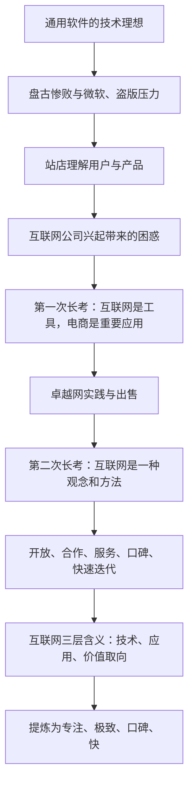
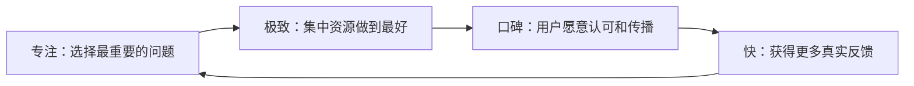

> 本章不是单纯介绍互联网历史，而是回顾雷军怎样从程序员、通用软件经营者和电商创业者的反复挫折中，逐步理解互联网。全章最终回答：互联网不仅是技术和应用，更是一种连接用户、组织生产和提高效率的方法。

---

## 一、本章要回答的问题

金山曾两次尝试互联网转型：1999 年建立卓越事业部，2005 年推动公司全面互联网化，但最初都没有达到预期。

这段经历迫使雷军区分三件事：

- 做一个互联网业务；
- 使用互联网工具；
- 真正按互联网方式理解用户、设计产品和组织公司。

本章的认知路径如下：

这条路径说明：**真正的方法论往往不是从成功中直接得到，而是从“明明很努力，为什么仍然不对”这种长期困惑中形成。**

---

## 二、互联网创世记：连接是起点

### 2.1 阿帕网与资源共享

1969 年，美国国防部启用阿帕网，最早只连接四所大学的四台大型计算机。它的目标不是建立今天的商业互联网，而是让不同计算中心之间能够交换信息和共享资源。

这件事确立了互联网最基本的价值：

- 原本孤立的设备可以合作；
- 信息不再受单台机器和地点限制；
- 稀缺计算资源可以被更多人使用；
- 连接为后来的协作和效率提升提供基础。

没有连接，资源只能局部使用；有了连接，还需要统一协议、信任和组织规则，才能真正形成价值。

### 2.2 TCP/IP 为什么重要

1974 年出现的 TCP/IP 协议，让不同设备、不同网络和不同类型终端能够按照共同规则通信。

它的意义不在于用户必须理解技术细节，而在于开放标准降低了协作门槛：参与者不用事先属于同一家公司、购买同一种设备，也能接入网络。

开放标准带来的启示是：

- 统一接口能减少重复适配；
- 新参与者更容易加入；
- 创新可以发生在网络不同层次；
- 生态价值可能大于单个公司的封闭利益。

开放也需要安全和治理。任何人都能连接，并不意味着任何行为都应被允许。

### 2.3 万维网让普通人能够使用互联网

蒂姆·伯纳斯－李在 1990 年前后发明万维网、网页语言和浏览器等基础设施并开放使用。网页让不同计算机和程序产生的信息能够以相对统一的方式展示。

对普通用户来说，互联网从专业网络变成“打开浏览器就能获取信息”。这一步大幅降低了使用门槛，也为门户、搜索、电商和其他现代互联网商业应用创造条件。

技术创新真正改变社会，往往不只因为功能先进，还因为它把复杂能力变得容易使用。

### 2.4 中国互联网的早期连接

1987 年 9 月 20 日，中国向海外发出第一封电子邮件：“越过长城，走向世界。”学术机构成为中国接触互联网的先锋。

1992 年，雷军在中科院高能物理研究所第一次连接国际互联网。他通过网络下载技术资料和软件，也把自己的代码上传到海外服务器与全球程序员分享。

这次体验让他第一次直观感受到：一个人可以跨越地域获取世界知识，也可以把自己的能力贡献给世界。

### 2.5 CFIDO 社区带来的早期互联网体验

当时中国网络接入困难，用户通过电话线路连接 BBS，下载其他人的信息，再上传回复。雷军在 CFIDO 的“西点”站管理“程序人生”板块，马化腾、丁磊等也曾活跃其中。

这个规模很小、技术条件有限的社区却产生了高价值交流：

- 程序员分享技术和作品；
- 用户形成稳定身份和关系；
- 版主通过话题和活动组织互动；
- 一些参与者开始思考网络寻呼、电子邮件等创业方向。

它说明互联网社区的价值不只取决于人数，也取决于参与者质量、互动深度和共同兴趣。

### 2.6 从信息网络走向商业网络

1990 年代，民用互联网迅速发展：网景、Windows 95、门户网站和接入服务相继出现。1995 年亚马逊成立，意味着互联网开始从线上信息、通信和娱乐进入实体商品交易。

电子商务的重要性在于，它不仅传递信息，还重组：

- 商品发现；
- 价格比较；
- 下单和支付；
- 库存与物流；
- 用户反馈；
- 商家与消费者关系。

互联网由此开始直接改变实体经济，而不只是形成一个独立线上行业。

### 2.7 四本书提供的认知启发

原书提到《数字化生存》《注意力经济》《免费》和《长尾理论》。它们分别帮助早期互联网从业者理解：

- 数字技术会怎样改变生活和社会；
- 信息过剩后，人的注意力成为稀缺资源；
- 免费产品可以通过其他环节获得收入；
- 互联网降低展示和分发成本后，小众需求也可能被服务。

这些书提供的是观察框架，不是自动正确的经营答案。免费、流量和长尾都必须有真实价值、成本控制和可持续收入支持。

---

## 三、一个程序员的求索

### 3.1 软件的界限在哪里

传统软件通常卖出一份拷贝，用户获得一组功能；交易完成后，公司与用户关系相对有限。互联网服务则持续连接用户，按使用过程不断更新、提供服务并获得反馈。

区别不只是收费方式：

| 传统软件产品 | 互联网服务 |
|---|---|
| 主要在发布前完成开发 | 发布后持续迭代 |
| 一次性销售为主 | 持续使用和付费为主 |
| 用户反馈较慢 | 使用数据和反馈持续进入产品 |
| 渠道隔开公司与用户 | 服务提供者可直接连接用户 |
| 新版本才带来明显更新 | 产品可以不断改进 |

今天软件也可以订阅和持续服务，两者边界已经融合。雷军长期困惑的实质是：同样写代码，为什么一次性交付工具和持续提供服务会形成完全不同的增长方式。

### 3.2 从热爱程序到加入金山

雷军原本喜欢化学，因为朋友报考计算机而选择了计算机专业。进入武汉大学后，他发现写程序需要想象力、简洁表达和构建完整世界的能力，并把它形容为写诗。

大学期间，他参与开发《免疫 90》、BITLOK 等软件。后来，他对 WPS 进行反编译和改良，被求伯君发现并邀请加入金山，成为第 6 号员工。
> **原书图示**：雷军早年的 BITLOK 超级软件加密系统
这段经历解释了雷军早期的核心信念：优秀技术和优秀程序应当自然带来好产品与商业成功。后来的挫折正是对这一信念的修正。

### 3.3 盘古失败：好技术为什么卖不动

1995 年，金山投入三年和上千万元开发的办公套件“盘古”上市。团队预计半年销售 5000 套，最终整个生命周期都没有达到 2000 套，金山接近生存危机。

团队技术能力很强，投入也很大，产品仍然失败，说明：

- 研发投入不等于用户需求；
- 功能丰富不等于使用价值；
- 工程师认为重要的特性，用户未必愿意付费；
- 市场、渠道、竞争和使用习惯同样决定产品结果；
- 大项目投入越多，越容易因不愿承认错误而继续追加。

技术是产品的基础，却不能替代产品定义和商业判断。

### 3.4 站店七天：从讲功能转向理解需求

雷军最初认为盘古卖不动是销售问题，于是亲自去店里卖软件。前三天一套也没卖出去。观察老销售员后，他发现：优秀销售不会先讲所有技术特性，而是先问用户想解决什么问题，再推荐适合的产品和功能。

到第七天，雷军成为当天销售冠军。这个结果的真正价值不在销售技巧，而在于他第一次直接看到：

- 用户购买的是任务结果，不是代码本身；
- 同一个功能对不同用户价值不同；
- 用户表达会暴露研发阶段忽略的场景；
- 一线接触能纠正报表和内部讨论形成的假设。

管理者不必长期亲自卖货，但应建立稳定机制，让研发和决策者持续接触真实用户。

### 3.5 《电脑入门》：需求比技术炫技更重要

很多顾客询问有没有教人使用电脑的软件。雷军最初认为看书就可以，后来发现反复出现的询问本身就是明确需求。团队迅速开发《电脑入门》，技术难度不高，却进入畅销榜。

随后，金山又推出满足 VCD 播放需求的《金山影霸》，同样取得成功。

这两个案例说明：

> 产品价值不由技术难度决定，而由问题是否真实、普遍，以及解决方案是否方便决定。

“技术含量不高”不能成为忽视需求的理由；同样，短期好卖也不代表可以放弃长期核心技术。企业需要用贴近需求的产品维持经营，同时继续投资战略能力。

### 3.6 半年社区生活的两个收获

盘古失败后，雷军暂时离开工作，近半年每天投入 CFIDO 社区管理。他得到两项认识：

#### 社区运营是一种具体能力

需要理解：

- 什么话题能引发参与；
- 如何组织活动；
- 用户为什么留下；
- 怎样处理冲突和建立规则；
- 一篇帖子怎样获得阅读和互动。

这段经验后来成为 MIUI 社区和用户参与模式的重要基础。

#### 技术、产品和销售是不同能力

金山拥有一流研发，却不够理解用户需要什么，也不擅长让市场认识产品。企业不能因为技术强就默认产品和销售自然成立。

- 技术回答能不能做；
- 产品回答该做什么、为谁做；
- 销售和市场回答怎样让目标用户理解并获得它。

三者需要共同服务用户，而不是彼此轻视。

### 3.7 WPS 97 与“以战养战”

1997 年，WPS 97 两个月卖出 13000 套，帮助金山活下来，但没有根本改变“前有微软、后有盗版”的处境。

金山通过打字教学、影碟播放、游戏等产品获得收入，继续支持 WPS。这是一种现实的生存选择：用可赚钱业务供养长期战略业务。

它的风险在于，辅助业务越来越多后，组织可能分散，核心业务也可能长期依赖输血。企业应明确：哪些业务负责现金流，哪些业务代表未来，它们之间的支持关系何时需要调整。

### 3.8 为什么互联网公司让雷军困惑

1998 至 2000 年，中国互联网公司快速成立、融资和上市。许多公司还不清楚如何赚钱，估值却远高于传统软件公司，程序员跳到互联网公司后也可能获得巨大回报。

雷军没有简单把这一切归结为泡沫。他意识到，互联网公司可能创造了传统软件没有捕捉到的价值：

- 持续用户关系；
- 大规模连接；
- 快速增长；
- 服务收入；
- 数据和网络形成的长期机会。

他后来总结：软件是工具，互联网提供持续服务；软件也可以借助互联网，从一次性交付变为长期服务。这成为金山后来在移动互联网时代重新增长的关键。

---

## 四、第一次长考：从下载站到卓越网

### 4.1 想不清楚时，先建立试验田

1999 年，面对互联网热潮，雷军仍不明白互联网公司怎样赚钱，决定在金山内部建立十几人的事业部，做软件下载网站卓越网。

这个选择的方法价值在于：

- 试验范围小，不必让整个公司立即转型；
- 团队能通过真实用户和成本获得认识；
- 实践会暴露纸面分析看不到的问题；
- 结果可以决定继续、转型或停止。

面对新技术，既不要盲目全押，也不能永远旁观。小规模、目标清楚的试验是学习工具。

### 4.2 下载做到第一，为什么仍然没有前途

卓越网很快成为软件下载第一，但下载业务需要大量服务器和带宽，用户又不愿付费。用户多反而意味着成本增加，却没有相应收入。

这说明“流量第一”和“商业成立”是两回事。评估新业务至少要问：

- 用户获得什么价值；
- 谁愿意为这种价值付费；
- 用户增长时，收入是否能跟上成本；
- 有没有不伤害用户体验的收入方式；
- 所需资金能否支撑到模式成熟。

没有收入不一定必须立即停止，但必须清楚它在为哪个未来能力积累用户、数据或入口。

### 4.3 第一次思考的两个结论

雷军在 1999 年形成两项认识：

1. 互联网是一种工具，未来所有公司都会不同程度成为互联网公司；
2. 电子商务是传统企业使用互联网改造交易和交付的直接方式。

他因此放弃下载业务，把卓越网转向电商。

这里的关键不是追逐当时热门概念，而是承认已有试验的商业问题，及时改变方向。

### 4.4 为什么让卓越网独立运作

金山董事会当时希望关闭互联网尝试，雷军说服董事会将卓越网拆分出来。

独立运作可以：

- 使用不同于软件公司的决策速度和人才制度；
- 单独核算投入和经营结果；
- 减少成熟业务对新模式的排斥；
- 形成清楚责任和创业团队。

但独立也会失去母公司部分资源，并增加融资、治理和协作难度。是否拆分，应看新旧业务在节奏、能力和商业模式上差异有多大。

### 4.5 不融资带来的长期限制

雷军当时非常自信，坚持不引入风险投资，由金山股东投资启动卓越网。

这样做可以保持控制权，避免外部资本干扰；但电商需要长期投入库存、物流、技术和市场。业务越大，资金需求越高。金山自身仍在艰难生存，最终无法支持卓越网继续扩张。

教训不是“必须融资”，而是融资方式要与业务资金特点匹配。重资金、长回收周期的模式，不能只靠短期利润和有限自有资金。

### 4.6 精选电商：主动替用户做选择

卓越网请陈年负责图书音像选品，从他的大量藏书中挑选管理团队真正认可的商品，成为早期精选电商。

精选模式解决的是信息过多和质量不确定：

- 减少用户挑选时间；
- 用专业判断建立信任；
- 集中销量和库存；
- 让商品介绍更有内容。

它的边界是选择权集中在平台，可能忽略小众需求或带入编辑偏好。精选需要明确标准、持续反馈和适当丰富度。
> **原书图示**：卓越网团队合影
### 4.7 自建物流、货到付款与四小时到货

早期电商面临的主要障碍不是网页不够漂亮，而是用户不信任在线交易：担心商品不真、付款不安全、送货太慢。

卓越网通过：

- 自建物流控制履约体验；
- 货到付款降低支付风险；
- 在主要城市实现快速送达；
- 推动正版图书和音像制品；
- 让部分正版商品比盗版更便宜。

这些做法逐项消除用户采用电商的阻力。商业创新往往不是发明一个全新需求，而是把影响用户行动的摩擦逐个解决。

### 4.8 每晚复盘与数据驱动

雷军每天深夜与卓越网管理层复盘，从选品、页面位置到经营数据逐项讨论。

电商的优势是用户行为和交易过程更容易被记录，团队可以快速观察调整结果。但数据驱动不等于只看点击和销售：

- 数据告诉团队发生了什么；
- 用户研究帮助理解为什么；
- 价值判断决定是否应该追求某个数字；
- 长期品牌和信任不能完全用短期转化率衡量。

### 4.9 B2C 第一为什么仍然被出售

卓越网成为中国 B2C 电商第一，却因资金不足，无法支持持续扩张。2004 年 9 月，金山股东以 7500 万美元将其出售给亚马逊。

这件事说明：

- 市场领先不等于商业模式已经稳固；
- 增长型业务可能在盈利前需要大量资金；
- 融资周期与市场周期会影响公司命运；
- 母公司资源与新业务需求不匹配时，第一也可能无法独立走下去。

出售带来财务回报，却让创始人失去继续建设公司的机会。它既不能简单归为成功，也不能只看作失败。

---

## 五、第二次长考：互联网是一种观念

### 5.1 2004 年互联网发生了什么

此时中国互联网开始找到多种商业方式：

- 门户通过增值电信服务度过生存期；
- 淘宝和支付宝推动电商平台发展；
- 腾讯建立即时通信优势；
- 网络游戏通过免费使用、增值付费实现变现；
- 百度通过搜索连接需求与商业信息；
- 谷歌成为全球互联网商业典范。

互联网已经从邮箱、门户和工具，发展到流量变现、交易和持续服务。雷军因此再次追问：互联网公司究竟与软件公司有什么根本不同？

### 5.2 出售卓越网后的复盘

卖掉亲手创办的企业后，雷军重新梳理卓越网的决策，并带领团队学习“谷歌十诫”。他没有只问“下一次做什么业务”，而是追问：

- 为什么互联网公司增长快；
- 为什么能获得高毛利；
- 用户关系有什么不同；
- 哪些方法可以进入其他行业；
- 未来最重要的终端是什么。

从模仿互联网公司的具体业务，转向理解背后的机制，是第二次长考最重要的变化。

### 5.3 “互联网是一种观念”是什么意思

它不是否认技术的重要性，而是说仅仅部署网络、网站和信息系统，不会自动获得互联网优势。企业还需要改变：

- 怎样连接用户；
- 怎样看待开放与合作；
- 怎样发布和改进产品；
- 怎样用数据反馈决策；
- 怎样从一次销售转向持续服务；
- 怎样组织内部协作。

技术是基础，观念和组织方式决定技术被用来维持旧流程，还是重新设计价值创造方式。

### 5.4 雷军当时总结的七点认识

#### 第一，开放和合作

互联网是一张连接网络，封闭系统会限制参与者、内容和创新。企业可以通过开放标准、接口、平台和合作伙伴扩大价值。

开放不等于放弃安全、隐私、质量和商业边界。开放程度应与治理能力匹配。

#### 第二，“靠机器赚钱”

雷军所说的重点是：产品研发完成后，服务更多用户不必按相同比例增加门店和人员，系统可以全天候自动运行。

这并不意味着没有人的工作。研发、运维、客服、内容、安全和合规仍然需要大量投入，服务器和带宽也有成本。真正优势是规模增长时，部分成本不会同步增长。

#### 第三，口碑营销和网盟

互联网公司直接面对用户，好产品可以通过用户分享传播；与拥有目标用户的平台合作，也能降低推广成本。

口碑的前提是产品值得推荐。网盟和流量合作若只追求点击，也可能带来虚假流量和不匹配用户。

#### 第四，管理更容易量化

线上业务和内部系统会自动记录大量过程，管理者更容易查看用户、交易和运营数据，知识也更容易留在系统中。

但数据丰富不等于管理简单：创新、文化、人才和跨部门协作仍依赖人。若把可记录的行为当成全部工作，还会诱发指标导向和短期优化。

#### 第五，从卖产品转向提供服务

软件卖出拷贝后，收入关系容易中断；持续服务可以在长期使用中更新产品、理解用户并获得收入。

服务模式要求公司持续兑现价值。若停止改善、增加退出障碍或只追求续费，订阅也会变成用户负担。

#### 第六，快

互联网产品可以先发布阶段成果，根据用户反馈继续改进。快速循环降低闭门开发多年后方向错误的风险。

快必须建立在工程质量和风险分层上。涉及安全、医疗、金融、硬件量产等领域，不能把未经充分验证的产品直接交给大众。

#### 第七，移动互联网是未来十年的热点

雷军判断手机上网会成为趋势，并在 2006 年投资乐讯、UCWeb，亲自担任 UCWeb 董事长。这一判断最终成为创办小米的重要准备。

趋势判断只有转化为提前投入、人才和实践，才具有实际价值。

### 5.5 为什么 2005 年全面互联网化仍然不顺利

金山发布转型动员令后，并没有立即成为理想中的互联网公司。原因是成熟组织的改变不只靠宣布：

- 原有收入仍来自软件销售；
- 人才和考核围绕旧业务建立；
- 研发、渠道和服务流程难以迅速重构；
- 管理层对新模式理解不同；
- 新业务会与旧业务争夺资源，甚至冲击原有收入。

数字化转型最难的不是安装系统，而是改变利益结构、能力和日常决策。

### 5.6 为什么上市后雷军仍然离开金山

2007 年金山终于上市，但雷军仍觉得没有找到“用技术和互联网真正改变人们生活”的答案，因此辞去 CEO 职务。

这说明外部里程碑与个人使命并不相同。上市解决了公司的阶段性生存和资本问题，却没有自动回答未来方向。

离开给了雷军重新思考的空间，也使他有机会面向移动互联网时代重新选择创业起点。

---

## 六、雷军对互联网思维的完整理解

### 6.1 互联网有三层含义

| 层次 | 内容 | 作用 |
|---|---|---|
| 技术基础 | 协议、网络、操作系统和信息通信技术 | 让设备和人能够连接 |
| 应用形态 | 通信、社交、媒体、生活服务和电商 | 把连接转化为具体服务 |
| 价值取向 | 高效、透明、公平、普惠 | 判断技术和商业应服务什么 |

只看技术，会忽略组织和用户；只看应用，会把互联网等同于几个行业；只讲价值观而没有技术和产品，又容易变成口号。

### 6.2 互联网还是新的组织机制

互联网让企业能够：

- 直接面对大量用户；
- 快速获得分散反馈；
- 让不同机构在共同标准上合作；
- 用数字记录和协调复杂流程；
- 把个人知识和能力连接到更大网络；
- 让生产者与消费者更接近。

因此，互联网不只是改造营销渠道，也会改变产品开发、供应链、服务和组织边界。

### 6.3 “彼此赋能”怎样理解

赋能不是平台单方面“赐予”能力，而是连接后各参与者都能做原本难以完成的事：

- 个人获取全球知识，也能公开贡献作品；
- 用户获得更多选择，也能参与产品反馈；
- 小企业低成本触达用户；
- 平台因参与者增加而获得更多服务和内容；
- 制造企业更快知道需求，用户更快获得产品。

好的赋能关系应让各方共同受益，而不是平台利用信息和规则占有大部分价值。

### 6.4 高效、透明、公平、普惠

#### 高效

信息传递更快，层级更少，服务者能直接收到用户反馈。

#### 透明

产品、价格和评价更容易比较，信息差缩小。透明也需要防止虚假评价和算法操纵。

#### 公平

普通人获得表达和参与机会。现实中设备、教育、算法和平台权力仍会制造新不平等，公平不会自动实现。

#### 普惠

同一技术和服务能够以较低成本覆盖更多人。普惠必须包括可负担、可使用、可访问和受保护，而不只是免费。

### 6.5 低成本赋能与“小费模式”

雷军把互联网服务理想描述为“先予后取、厚予薄取”：先让大量用户获得价值，用户觉得服务好，再自愿支付少量费用。

开市客以低商品毛利吸引会员，主要通过会员费获得稳定收入，是他常用的类比。小米也曾讨论会员费，但认为综合服务尚未达到足以自豪地收费的水平，因此没有急于推出。

“小费模式”成立需要：

- 免费或低价部分本身可持续；
- 付费服务提供真实增量价值；
- 用户有清楚选择，不被强迫；
- 不用过度广告和数据侵犯补偿收入；
- 大规模用户中有足够付费或其他合理收入。

### 6.6 互联网思维并非互联网原创

原书强调，许多原则在互联网出现前就存在：

- 大工业已经利用规模降低成本；
- 剃刀与刀片等模式早已使用交叉补贴；
- 广告业早已经营注意力；
- 零售和服务业一直重视口碑与复购。

互联网的作用，是通过数字连接把这些方法的速度、范围和可测量性大幅提高。

### 6.7 哪些环境更适合发挥互联网效率

原书认为，以下条件越强，互联网方法越容易产生明显效果：

- 大工业生产能力成熟；
- 产品和接口可以标准化；
- 经营过程能被数据记录；
- 市场足够大；
- 用户愿意直接在线互动；
- 服务可以快速更新和复制。

高度定制、低频、安全风险高或必须依赖线下专业服务的行业，也能使用互联网工具，但不能照搬消费互联网的速度和免费模式。

---

## 七、两版“七字诀”

### 7.1 第一版：互联、全天候、快速

这版形成于卓越网出售前后，主要描述互联网业务的外在特征：

- **互联**：连接上下游、用户和推广资源；
- **全天候**：服务持续运行，任何时间都能使用；
- **快速**：开发、推广、反馈和增长速度高。

它能帮助传统企业识别互联网业务，却还没有解释怎样做出用户真正需要的好产品。

### 7.2 第二版：专注、极致、口碑、快

经过进一步提炼，雷军形成更通用的版本：

- **专注**：把有限资源集中在最重要的问题；
- **极致**：在关键体验上做到能力范围内最好；
- **口碑**：用真实产品价值赢得用户主动传播；
- **快**：缩短从想法、产品到反馈和改善的循环。

这四个词不只适用于互联网公司，也可以进入制造、零售和服务业。

### 7.3 四个词怎样互相配合

- 没有专注，资源分散，难以极致；
- 没有极致，口碑缺少基础；
- 没有口碑，企业只能持续高成本获客；
- 没有快，产品不能及时吸收用户反馈；
- 只追求快，会牺牲方向和质量。

雷军认为，这套方法的核心是提高效率，长期结果则是用户信任。

---

## 八、本章方法论总结

### 8.1 雷军的认知形成过程

| 经历 | 得到的认识 |
|---|---|
| 盘古失败 | 技术强不等于产品和商业成功 |
| 亲自站店 | 用户购买问题的解决，不是技术清单 |
| 《电脑入门》《金山影霸》 | 真实需求有时比技术难度更重要 |
| CFIDO 社区 | 用户关系和社区运营是可建设的能力 |
| 下载站第一却无收入 | 流量规模不等于商业模式成立 |
| 卓越网电商实践 | 互联网能重组交易、物流和用户关系 |
| 因资金不足出售卓越网 | 增长模式必须匹配融资和现金需求 |
| 第二次长考 | 互联网是一种观念、方法和组织机制 |
| 移动互联网投资 | 趋势判断要提前变成行动和能力 |

### 8.2 学习新技术的方法

1. 先理解技术改变了什么基本条件；
2. 不懂时建立范围可控的真实试验；
3. 区分用户增长、用户价值和商业可持续性；
4. 到一线观察用户怎样实际选择；
5. 从成败中提取机制，而不是只记做法；
6. 检查组织、考核和利益是否支持新方式；
7. 把适用于一个业务的经验进一步抽象；
8. 明确哪些原则可以迁移，哪些依赖时代和行业。

### 8.3 本章最重要的概念

| 概念 | 通俗理解 |
|---|---|
| 连接 | 让原本孤立的人、信息和资源能够协作 |
| 开放标准 | 用共同规则降低参与和创新门槛 |
| 产品与服务 | 从一次性交付功能，转向持续提供价值 |
| 一线观察 | 直接看用户怎样选择，修正内部假设 |
| 试验田 | 用小范围真实业务学习陌生模式 |
| 互联网观念 | 改变用户连接、产品迭代和组织协作方式 |
| 彼此赋能 | 参与者通过连接都获得新的能力和价值 |
| 七字诀 | 专注、极致、口碑、快 |

### 8.4 需要保留的边界

- 互联网历史中的部分节点是原书的概括，不是完整技术史；
- 开放不等于无边界，仍需安全、隐私和治理；
- 用户多、流量大不代表能够持续经营；
- “靠机器赚钱”不表示边际成本为零或不需要人；
- 量化管理不能覆盖创新、文化和长期信任；
- 快速发布要与质量和风险相匹配；
- 服务模式也可能产生锁定、过度续费和隐私问题；
- 互联网方法能进入各行业，但不能忽视行业基本规律。

### 8.5 与后续章节的连接

第五章说明七字诀从哪里来，第六章将逐项解释专注、极致、口碑和快；之后的章节再把这些原则落到技术、用户、爆品、高效率、新零售、生态链和智能制造。

因此，这一章是全书方法论的源头：它不是告诉读者复制卓越网或小米，而是展示一个经营者怎样把多次失败和跨行业实践，整理成可以继续验证的方法。

### 8.6 一页速记

> **互联网起点**：连接与资源共享。 
+> **万维网价值**：把复杂网络变成普通人可使用的统一界面。 
+> **盘古教训**：技术水平不能替代用户需求、产品和销售。 
+> **站店教训**：用户购买的是问题的解决，而不是功能数量。 
+> **第一次长考**：互联网是工具，电商是传统产业的重要应用。 
+> **卓越网教训**：领先仍需可持续收入、履约和匹配的资金。 
+> **第二次长考**：互联网更是一种观念、方法和组织机制。 
+> **三层含义**：技术基础、应用形态、价值取向。 
+> **价值方向**：高效、透明、公平、普惠。 
+> **最终提炼**：专注、极致、口碑、快。 
+> **核心启示**：使用新技术不等于完成转型，真正变化发生在用户关系、产品方式、组织机制和价值取向上。
