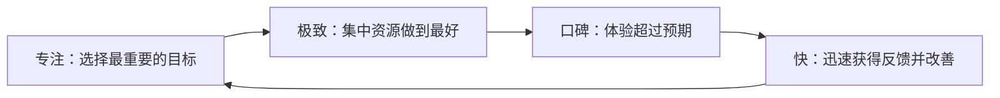

> “专注、极致、口碑、快”是雷军对互联网思维的高度概括。本章逐项解释这四个词，并通过小米、苹果、任天堂等案例说明它们怎样用于业务选择、产品开发、用户经营和组织管理。

---

## 一、七字诀是一套完整方法

四个词不是彼此独立的口号，而是一条连续链路：

- 专注决定力气用在哪里；
- 极致决定产品能否形成明显差异；
- 口碑检验用户是否真正感受到价值；
- 快让团队及时修正方向，进入下一轮改善。

七字诀的核心结果是效率，长期沉淀则是信任。使用时必须避免四种误解：

| 误解 | 正确理解 |
|---|---|
| 专注就是永远只做一个业务 | 围绕一元核心有顺序地扩展 |
| 极致就是不计成本 | 把资源投入用户真正重视的地方 |
| 口碑就是营销和舆论管理 | 用户在全部触点形成的真实体验 |
| 快就是赶进度 | 洞察、响应、决策和改善的系统能力 |

---

> **第一部分：专注**

## 二、为什么商业必须专注

### 2.1 有限资源必须集中

任何公司拥有的资金、人才、时间和品牌注意力都有限。如果同时进入太多方向，每项业务都可能停留在“做了但做不好”的状态。

专注不是因为其他机会没有价值，而是为了让最重要的方向获得足够资源，形成真正竞争力。

### 2.2 三色公司的失败

雷军大学时与同学创办“三色公司”。团队懂技术，也有一些行业关系，却从一开始就没想清楚究竟做什么。他们做过装机、软件开发、电子元件倒卖，甚至承接打印业务，最后很快失败。

问题不是业务种类本身，而是：

- 没有清楚目标客户；
- 每个订单都需要重新组织能力；
- 团队不知道应积累哪种优势；
- 资源被短期机会牵着走；
- 什么都能接，反而什么都做不深。

这个案例让雷军形成一个基本认识：**只有先确定做什么，才知道怎样组织、寻找什么资源、建立什么能力。**

### 2.3 专注的四个核心命题

原书把专注概括为：

1. 清晰的使命和愿景；
2. 深刻理解行业与用户，找到机会；
3. 建立明确目标和与之匹配的能力；
4. 克制贪婪，少就是多。

四项缺一不可。只有使命，没有洞察，容易停留在口号；看到机会却没有能力，只会追逐热点；目标很多又不克制，资源仍会分散。

---

## 三、使命和愿景划定边界

### 3.1 使命与愿景的区别

- **使命**：企业为什么存在，要为社会和用户创造什么价值；
- **愿景**：基于这项使命，企业希望最终成为怎样的组织。

“追求卓越”“用户第一”等更像价值原则，不能单独回答公司为何存在、要去哪儿。

### 3.2 为什么再小的组织也需要方向

街边超市可能以方便社区邻里为使命，小饭馆也可能坚持真材实料、童叟无欺。使命不取决于公司规模，而取决于是否清楚自己长期服务谁、创造什么价值。

创业早期，方向常存在于创始人直觉中；团队扩大后，必须把这种共识清楚表达，否则部门会用各自指标解释公司方向。

### 3.3 小米使命愿景的演化

2014 年，小米提出：

- 使命：“让每个人都能享受科技带来的乐趣”；
- 愿景：“做用户心中最酷的公司”。

2018 年，随着用户从发烧友扩展到全球大众、业务从手机扩展到智能生活，使命和愿景被修订为：

- 使命：坚持做“感动人心、价格厚道”的好产品，让全球每个人都能享受科技带来的美好生活；
- 愿景：坚持和用户交朋友，做用户心中最酷的公司。
> **原书图示**：小米的使命和愿景
使命愿景可以随认识深化而完善，但不能因短期机会频繁改变。修改应来自长期实践，而不是品牌文案更新。

---

## 四、克制贪婪，寻找最小切口

### 4.1 少就是多

切口越小，有限资源越容易集中。无论公司布局还是单款产品，都应先找到最迫切、最能形成差异的一个问题。

“最小切口”不是做一个功能残缺的产品，而是把范围缩小后，对核心问题给出完整、出色的解决方案。

### 4.2 好切口的四个条件

1. 用户需求明确而迫切，目标人群清楚；
2. 需求具有一定普遍性，市场空间足够；
3. 问题范围较小，开发成本和风险可控；
4. 一句话能说清价值，用户容易理解和传播。

小米充电宝的定义就是：大容量、质量可靠又便宜。清楚的定义会帮助研发做取舍，也让营销不必解释复杂概念。

### 4.3 空气净化器案例

2013 年北京雾霾严重，用户迫切需要空气净化器；进口产品通常价格很高，正规国产产品也不便宜，市场供给不足。

小米孵化生态链公司，把目标集中在净化性能、可靠设计、足量供给和合理价格上，没有增加“离子香氛”等边缘功能。产品以 899 元上市后快速获得市场。

这个案例的关键不是低价本身，而是：

- 需求非常迫切；
- 既有供给价格和能力明显不足；
- 产品定义克制；
- 供应链能支持大规模交付；
- 性能、设计与价格同时有优势。

### 4.4 功能多不等于竞争力强

索尼 PSP 不只想做游戏机，还试图成为多媒体娱乐终端；任天堂则长期聚焦游戏和乐趣。智能手机兴起后，严守游戏体验的任天堂掌机仍有生命力，其他泛娱乐掌机逐渐退出。

这不说明多功能一定失败，而是提醒：附加功能若不能增强核心任务，反而会增加成本、复杂度并模糊产品认知。

---

## 五、决定不做什么同样重要

### 5.1 乔布斯的四象限

1997 年乔布斯重返苹果时，公司产品线混乱，连内部人员都难以回答该推荐哪款产品。他砍掉大量型号，只保留四个象限：

- 消费级台式；
- 消费级便携；
- 专业级台式；
- 专业级便携。
> **原书图示**：乔布斯重返苹果后划定的产品规划四象限
这个方法的价值是让团队、用户和渠道都能理解产品结构，并把研发集中到少数关键产品。

苹果从亏损走向盈利不只由专注造成，还包括产品创新、成本调整和市场环境；但砍掉混乱项目为后续改变释放了资源。

### 5.2 “我该让朋友买哪款”是一个好问题

如果团队无法清楚推荐某款产品，通常意味着：

- 产品定位重叠；
- 差异只存在于细小参数；
- 团队没有统一判断；
- 选择成本被转嫁给用户。

简化产品线不是追求形式上的少，而是让每款产品都有明确人群和不可替代的理由。

---

## 六、扩张与专注并不天然矛盾

### 6.1 新业务的四项检查

原书提出四个标准：

1. 是否符合使命、愿景和战略；
2. 能否与核心业务形成显著强协同和闭环；
3. 能否为用户提供一致的价值和体验；
4. 公司资源是否支持。

有用户、有资金、有渠道，只说明“可以做”，不说明“应该做”。房地产公司进入饮用水等跨界失败，常见原因就是能力和业务无法形成闭环。

### 6.2 小米为什么不认为自己是“杂货铺”

小米的解释是：

- 所有产品围绕科技消费和智能生活；
- 多数品类由生态链公司承担，小米核心仍是手机；
- 新业务共享用户、品牌、渠道、供应链和 IoT 平台；
- 生态链在手机业务站稳后启动，IoT 又建立在生态链基础上。

这个解释是否成立，要看真实协同，而不是公司自己的分类。若某个品类只增加销售额，却没有增强用户体验和核心业务，它仍可能是不专注。

### 6.3 业务要有阶段顺序

一项业务尚未建立稳定产品、团队和模式时，同时开更多方向会分散注意力。更稳妥的顺序是：

1. 先让核心业务成立；
2. 将关键经验沉淀为组织能力；
3. 再进入具有强协同的新方向；
4. 新业务稳定后，才继续扩展。

“逐步放大”比同时铺开更容易发现错误和控制风险。

---

## 七、全局对表，防止局部增长带偏公司

### 7.1 为什么部门会自然扩张

团队成立后，会希望获得更多项目、人力、预算和收入。部门自己的增长可能看起来合理，却未必增强公司整体价值。

例如，大家电团队为追求规模推出 799 元非智能波轮洗衣机。产品本身并不差，但它没有明显智能体验，也未增强小米科技生态，反而消耗开发、库存、售后和品牌资源。

局部看，团队增加了销售；全局看，这项增长可能稀释战略。

### 7.2 从“手机加 AIoT”改为“手机 × AIoT”

2019 年的“手机加 AIoT 双引擎”把两个业务写成并列核心，导致一些 AIoT 团队独立追求用户数、连接数和成交金额，忽略了共同构建智能生活体验。

2020 年，小米把战略改为“手机 × AIoT”：

- 手机继续是核心；
- AIoT 围绕手机和用户场景展开；
- 重点不是两边各自做大，而是互联体验和相互促进。
> **原书图示**：小米升级新十年战略“手机 × AIoT”
公司核心方向必须一元。多个业务可以存在，但应服务同一个中心，而不是各自成为新的中心。

### 7.3 每项业务都要反问三个问题

1. 业务增长为公司核心战略贡献了什么价值？
2. 它是否带动核心业务和其他业务持续增长？
3. 它消耗了哪些资金、人才、品牌和管理资源？

只看收入会忽略成本和品牌损耗；只讲协同也可能掩盖业务没有独立价值。三问应同时回答。

### 7.4 关键进展目标与 OKR

宏大目标需要拆成阶段性进展，团队才能持续检查是否偏航。小米在第十一年引入 OKR，让上级关键成果与下级目标相互连接，也让跨团队能够“对表”。

OKR 能帮助对齐和沟通，却不能替代战略判断：

- 错误方向可以被非常高效地分解；
- 过多关键结果会重新造成失焦；
- 指标完成不等于用户价值实现；
- 没有共同认识时，工具只会增加文档工作。

### 7.5 专注边缘要有灰度

专注是目标一致，不是把所有探索都禁止。核心资源应投入主线，同时给边缘创新留出小范围试验空间。

完全没有探索，企业会错过技术变化；探索没有边界，又会重新分散。灰度需要依靠价值观、资源上限和阶段检查来管理。

---

> **第二部分：极致**

## 八、极致的准确含义

### 8.1 极致既是产品观，也是经营策略

雷军把极致定义为：做到自身能力的极限，做到别人做不到的高度。它有两层含义：

1. 心智上不轻易满足，愿意持续投入和打磨；
2. 不只更努力，还要寻找当时对用户最好的解决方式。

极致不是所有指标都最高，也不是无限增加成本。它必须建立在专注的正确方向上。

### 8.2 先发现那些“不该忍受”的问题

很多产品缺陷存在太久后，人们会习惯。极致首先要求对丑、难用和不合理保持敏感，并愿意追问能否改变。

雷军长期不理解为什么笔记本充电器笨重难看。小米进入笔记本业务后，提出在性能、安全、可靠前提下，把充电器做小、做轻、做好看。

### 8.3 GaN 充电器

材料技术进步让氮化镓充电器在更小体积中提供高功率。小米与上游伙伴长期合作，最终推出 65W 充电器，可为手机、平板和笔记本充电，让用户出差只带一个充电器。
> **原书图示**：传统笔记本充电器和 GaN 充电器对比
这个案例说明：

- 极致先来自对旧体验的不满；
- 新材料打开新的解决空间；
- 工程团队要把技术变成可量产产品；
- 真正价值是减少用户携带和选择负担；
- 创新扩散后还能推动行业整体进步。

---

## 九、哪怕只好一点，也愿意付出更多

### 9.1 气泡水与赤藓糖醇

新兴气泡水品牌为改善零糖饮料口感，选择成本远高于常见人工甜味剂的赤藓糖醇，并投入工艺和口味调试。

高成本原料值得使用的前提是：用户确实能感知差异，这项差异决定产品选择，并能形成长期能力。若只是为了宣传稀有材料，就不是极致。

### 9.2 小米 4 不锈钢中框

2014 年小米 4 首次采用不锈钢中框。相比塑料和铝合金，它强度、耐腐蚀和质感更好，但加工难度和成本大幅增加。小米与富士康联合研发复杂工艺，还投入大量设备，后续又转到比亚迪继续优化成本。
> **原书图示**：小米 4 率先采用高难度不锈钢中框工艺
这项投入的价值不只在一代手机：

- 产品获得独特质感和结构品质；
- 团队积累材料与制造经验；
- 供应链掌握新工艺；
- 能力后来继续用于高端产品。

极致投入若能跨代复用，就从单品成本变成长期技术资产。

### 9.3 看不见的地方也要好

乔布斯强调，即使用户看不到电路板，也应排列整齐、质量可靠。其价值不只是视觉，而是体现工程纪律，并可能改善可靠性、装配和维护。

但“看不见也要好”不能被理解为任何隐藏细节都要昂贵。判断标准是：这项投入是否通过质量、可靠性、维护性或团队标准回到用户。

---

## 十、极致来自反复打磨

### 10.1 “改改改改再改改”

黎万强的设计团队习惯拿方案到处找人测试，不断获取反馈。极致不是天才一次命中，而是在明确方向上持续发现差距、修改和验证。
> **原书图示**：小米内部强调反复打磨的“改改改改再改改”海报
### 10.2 小米手机包装盒

团队用六个月进行三十多轮结构修改、上百次打样，制作大量样品，最终形成简洁、坚固的包装盒。

包装不只是装饰，它要保护产品、适应运输、方便开启并传达品牌。大量样品只有在每轮都验证明确问题时才有价值；若没有判断标准，反复修改也可能成为浪费。

### 10.3 最后一刻修改的利弊

小米有时直到发布会当天仍调整内容、运营甚至价格。优点是团队不因时间接近就停止思考；风险是：

- 执行错误增加；
- 上下游准备被打乱；
- 团队长期处于高压；
- 临时决策缺少充分验证。

软件和发布内容可在较晚阶段修改，硬件设计、质量和安全则必须设置冻结点。极致需要与项目纪律配合。

### 10.4 发布不是用户关系的终点

互联网方法把产品售出看作关系开始：团队继续收集反馈、更新软件、改进服务，并把经验带到下一代产品。

硬件不能像软件一样无限发布后修补。凡涉及结构、可靠性和安全的问题，应尽量在发布前解决。

---

## 十一、全身心投入与资源约束

### 11.1 资源太多为什么可能拖累创业

有成功经验的团队二次创业时，容易先考虑可借用的品牌、渠道和资本，而不是从产品本身出发。资源充足可能让团队同时做太多方案，延迟真实检验。

小米创办初期隐去雷军身份，禁止使用过往资源，希望团队只能靠产品赢得用户。这是一种主动去除外部光环的试验。

但资源少并非天然优势。硬件研发、质量、安全和供应链都需要足够投入。正确理解是：不要用资源掩盖产品问题，也不要为了制造紧迫感而让团队缺少基本保障。

### 11.2 第一代手机只做一款

小米把有限资金、团队和供应链资源集中到一款旗舰，选择顶级芯片、大内存和优秀供应商。只做一款能集中力量，也把风险集中在一次产品判断上。

“一局定生死”适合资源极少、窗口明确的创业期，不应成为成熟公司的常态。成熟企业要保留风险管理和可持续节奏。

### 11.3 不给产品目标留妥协，不等于把人逼到失控

“把自己逼疯，把竞争对手逼死”表达了全力投入，却过度强调竞争和牺牲。更健康的原则是：

- 对核心用户价值不轻易妥协；
- 对质量和安全坚持底线；
- 对人员、时间和风险保留合理余量；
- 不把长期过劳当成极致文化。

真正可持续的极致来自能力、热情和组织支持，而不是透支团队。

---

## 十二、无限追求当下的最优解

### 12.1 什么是产品最优解

最优解不是某个参数最高，而是在当时技术、成本和用户需求下，用更简单或更集成的方式创造最大整体价值。

雷军认为极致产品应当：

- 设计和体验令人惊艳；
- 成本与价格同样有竞争力；
- 超出用户预期；
- 让竞争者难以用简单堆参数复制。

### 12.2 简化操作就是创新

小米团队研究过 652 种解锁方案，仍认为当时苹果滑动解锁更好；MIUI 把发送短信从通常的六步简化为三步。

这些案例说明，最优解常来自减少用户动作和认知负担，而不是增加功能。

### 12.3 集成复杂需求

MIUI“百变主题”让用户自由组合桌面、图标、解锁、铃声和音效，以统一架构满足大量个性化需求。
> **原书图示**：MIUI 百变主题
好的集成不是把所有功能塞在一起，而是先梳理需求结构，再提供清楚、可扩展的体系。

### 12.4 再小的产品也有改进空间

MIUI 计算器不只做加减乘除，还提供过程回看、数字复制修改、汇率和单位换算、个税房贷及亲戚称呼计算。团队把它从单一工具变成数字计算和换算服务入口。
> **原书图示**：MIUI 计算器应用
小产品的极致同样来自高频场景和结构化设计，不需要依靠炫目的技术。

### 12.5 没有永恒的最优解

索尼特丽珑是显像管时代的顶峰，却在平板显示时代失去优势；滑动解锁也被指纹和人脸识别替代。

领先者最危险的时刻，是把上一代的完美方案当作永恒标准。后来者则可以绕开旧路线，用新技术重写问题。

追求极致必须同时追问：用户需求是否变化，技术基础是否换代，旧优势是否正在变成包袱。

---

## 十三、认知领先才是极致的最高层次

### 13.1 任天堂的“玩者之心”

任天堂认为游戏本质是创意和乐趣，员工首先要理解玩家。它不把主要敌人定义为其他公司，而是“不关心玩家的思想”。

这种认识帮助任天堂持续创造十字键、平台跳跃、三维视角、Wii 体感和 Switch 融合形态等新体验。

任天堂硬件性能常弱于竞争者，仍能通过玩法和使用场景取胜，说明性能只是手段，核心任务是创造乐趣。

### 13.2 深入成为用户，而不只研究用户

“玩者之心”要求团队自身热爱和使用产品。深度体验能发现问卷难以表达的需求。

不过，团队不能只代表自己。核心爱好者的需求可能与大众不同，仍需通过多样用户研究校验。

---

## 十四、极致不是自嗨和噱头

### 14.1 昂贵螺丝钉与卡针

小米曾使用比同行贵数倍、还刻有品牌标识的螺丝；手机卡针也用高成本不锈钢加工，即使低价入门机也一样。

这些细节用户几乎感知不到，也没有显著改善质量。销量达到数千万后，微小浪费会变成巨大成本。

与整齐可靠的电路板相比，区别在于：前者主要满足内部自豪感，后者体现整体质量纪律并能间接服务用户。

### 14.2 宝石机身、“哥窑瓷”和 MD

若普通产品只靠宝石、稀有工艺或复杂机械结构制造奢华感，却没有改善核心体验，就是把噱头当极致。索尼 MD 机械设计再精巧，也无法阻止更符合数字时代需求的 MP3 替代它。

### 14.3 三个校验问题

1. 这项极致是不是用户真正需要的？
2. 它能否成为产品或服务的核心竞争力？
3. 它能否形成长期可持续的能力或壁垒？

三个问题中若多数回答不清楚，投入越大，可能离用户越远。

---

## 十五、极致是对未来能力的投资

### 15.1 陶瓷机身为什么不是噱头

手机是每天长时间握持的设备，材质直接影响手感、耐磨和外观。陶瓷有独特价值，却存在硬度高、成型难、良率低和成本高等问题。

小米在早期失败后继续投入试验，最终从小米 5 陶瓷背壳发展到 MIX 系列一体化和彩色、轻量化陶瓷，形成可持续工艺能力。

区别在于：陶瓷不是遮盖普通产品的装饰，而是建立在旗舰性能基础上的真实体验创新，并通过多代产品不断进化。

### 15.2 iPhone 多点触控

苹果与供应商历时多年、多次濒临放弃，最终把多点触控电容屏变成可量产的自然交互方式。触摸屏早已存在，真正突破是重新定义手指操作体验并坚持工程实现。

长期极致项目的回报包括：

- 产品差异；
- 团队经验和信心；
- 供应链新能力；
- 后续产品的更多选择；
- 对行业方向的影响。

投入未来仍需阶段目标。不能用“长期主义”保护没有进展、与战略无关的项目。

---

> **第三部分：口碑**

## 十六、口碑从哪里来

### 16.1 超预期才会产生口碑

好、便宜，甚至又好又便宜，都未必让用户主动传播。口碑来自实际体验明显超过购买前预期。

这意味着口碑是相对的：

- 普通餐厅提供意外周到服务，容易让人惊喜；
- 顶级酒店即使绝对服务很好，若低于极高预期，也会失望；
- 高端产品比大众产品更难超预期。

企业不能故意降低承诺制造惊喜。长期口碑依赖诚实预期和持续比较优势。

### 16.2 口碑的四个命题

1. 与用户交朋友、倾听意见，才能理解真实需求；
2. 口碑既是品牌策略，也是增长策略，能自传播、自转化；
3. 产品、服务和沟通等所有触点共同决定口碑；
4. 用户预期持续上升，口碑标准也会不断提高。

---

## 十七、销量第二，口碑第一

### 17.1 为什么口碑领先销量一步

销量和利润是重要结果，却可能由促销、渠道压货、市场窗口或短期广告推动。口碑更早反映用户是否愿意继续购买和推荐。

良性循环是：理解用户，做出超预期产品，形成推荐，带来更低成本的传播和转化，再获得更多反馈。

口碑不是 KOC 投放或私域运营的替代说法。付费推广可以放大信息，不能制造真实满意。

### 17.2 叫好不叫座怎样判断

某些艺术性或探索性产品本来就不面向大众，销量小不代表失败。但大众产品长期有口碑却没有销量，通常要检查：

- 定位和目标用户是否过窄；
- 价格、渠道或交付是否有问题；
- 好评是否只来自少数专业人群；
- 口碑是否真的转化为购买意愿。

口碑第一不等于忽略商业结果，而是不要为了短期销量毁掉未来需求。

### 17.3 小米 MIX 的公司级价值

第一代 MIX 研发成本高，销量约 40 万台，单款项目可能无法摊平投入，却以全面屏和全陶瓷机身震动行业，建立了小米高端探索形象。

它的价值包括品牌、技术方向、团队能力、供应链经验和后续产品线，不能只看单款利润。

探索产品可以接受有限销量，但要明确它为公司留下了什么。

---

## 十八、“用户口碑永远是对的”怎样理解

用户对自己是否满意的感受一定真实，企业不能用投入很多、技术先进或同行也这样来反驳。

但用户对问题原因的解释可能不完整，单条评价也不代表所有用户。团队应当：

- 接受感受；
- 分析原因；
- 用多渠道和数据判断范围；
- 选择真正有效的改进方式。

### 18.1 高端空调案例

一家生态链公司在小米平台销售约 4000 元的自有品牌高端空调。团队认为产品投入大、利润不高，却遭到用户批评。

问题在于：新品牌尚未证明自身价值，产品定价又超出用户对小米平台“厚道”的预期。团队讲的成本事实无法改变用户形成的整体印象。

品牌信任会在平台和产品之间外溢。一款产品突破既有价格认知，需要先用连续价值获得用户许可。

---

## 十九、超预期与全栈口碑

### 19.1 海底捞与帆船酒店

帆船酒店绝对条件顶级，但过高预期可能让用户挑剔；海底捞在普通场景中提供意外周到服务，更容易形成传播。

口碑不是追求夸张服务，而是准确理解目标用户在该价位、场景和品牌下的预期，并在重要处明显超过它。

### 19.2 所有触点共同决定口碑

用户接触公司的环节包括：

- 产品性能、设计、质量和定价；
- 购买、支付、物流和安装；
- 客服、维修和退换；
- 广告、发布会和社交沟通；
- 隐私、更新和长期服务。

任何严重短板都可能覆盖产品本身的优点。全栈口碑不要求每个触点都豪华，而要求与品牌承诺一致、没有明显伤害用户的断点。

### 19.3 补寄发票案例

第一代手机销量远超税务部门预期，小米一度缺少足够发票，遭到用户质疑。后来公司打印数十万张发票，用快递补寄，并附致歉卡和贴膜。

问题本身仍然说明准备不足；及时承担责任、完整补救和提供额外关怀，则能修复信任。

### 19.4 让一线拥有关怀决策权

许多服务补救由一线员工提出并快速执行。若所有小额补偿都需层层审批，最需要帮助用户的时刻会被错过。

授权要有清楚边界、预算和复盘，既让听见用户声音的人能行动，也防止标准不一和滥用。

---

## 二十、口碑标准会不断变化

### 20.1 产品升级后，旧质量标准可能不再够用

一家企业产品进入高端后，原材料和生产标准没有下降，用户满意度却下滑。原因恰恰是标准“没有变化”：价格和定位提高后，用户开始关注过去可以接受的细节。

产品定位升级，质量、服务和沟通标准必须同步升级。

### 20.2 用户群变化也会改变标准

MIX Fold 面向高端商务用户。团队原计划在发布后通过更新交付 PC 模式，这种做法早期发烧友能够接受，商务用户却认为发布时承诺的功能应立即完整可用。

同一种开发方式，在不同人群中可能得到相反评价。企业不能把核心用户习惯当作所有用户习惯。

### 20.3 行业进步会抬高基准

竞争者持续改善后，过去领先的体验会变成基本要求。保持原标准看似稳定，实际相对位置正在下降。

口碑迫使企业不断提升用户价值，不能依靠一次成功长期吃老本。

---

## 二十一、小心信息茧房和虚假口碑

### 21.1 信息更多不等于更接近真相

算法可能反复推荐相似观点，企业官方账号的互动也常来自固定活跃用户。核心用户声音清楚，却未必代表沉默的大多数。

规模扩大后，单一社区、微博评论或管理者身边的用户都不能独立代表全体。

### 21.2 提高行业透明度

小米早期公开手机配置、性能参数和工艺，并支持评测机构与基准测试，希望用户像购买电脑一样清楚比较手机。

跑分可以帮助比较基础性能，却不能覆盖系统、拍照、续航、质量和服务。评测机构若与厂商存在投资关系，也需要披露并保持独立。

透明度需要多种信息共同构成：参数、独立评测、真实用户体验、质量和长期使用数据。

### 21.3 水军会主动污染反馈

水军和过度公关会制造虚假好评或恶意攻击，使公司误判产品，也误导用户。若团队只观察最关注的平台，甚至可能被自己的公关结果欺骗。

治理虚假口碑需要平台规则、证据保全、法律手段和内部多渠道验证，不能以另一批水军对抗。

---

## 二十二、口碑验证的三条原则

### 22.1 多路交叉验证

管理者应直接进入社区、社交平台、线下门店和售后场景，同时汇总：

- 产品团队反馈；
- 市场与公关观察；
- 客服和售后问题；
- 质量数据；
- 销售、退货与维修；
- 用户访谈和调研；
- 净推荐值与满意度。

不同来源互相印证，才能减少单一渠道失真。

### 22.2 核心用户看“意见点”，大众用户看“印象面”

核心用户熟悉产品和竞品，适合发现具体功能、参数和体验问题；但他们的整体偏好未必代表大众。

大众用户表达不一定专业，却更能反映品牌整体认知和价值是否被理解。大众意见高度集中到某个具体问题时，应高度重视。

### 22.3 直面真实口碑

负面反馈不可怕，可怕的是用户已经不愿反馈。团队应准备接受批评，快速行动并公开说明改进。

真诚和改进速度本身也会形成口碑，但不能用态度代替解决问题。

### 22.4 口碑是衡量结果，不是替代战略

口碑可以告诉公司产品表现如何，不能让每条舆论直接指挥产品方向。管理层仍需结合使命、技术趋势和不同用户的长期需求做判断。

---

## 二十三、品牌是口碑的沉淀

### 23.1 品牌不是传播战术

品牌是用户对企业产品、服务、渠道和沟通的综合认知。它让分散、流动的口碑形成长期记忆和信任。

品牌强能提高新品接受度和业务扩展效率；品牌承诺被破坏，也会让多个业务同时受损。

### 23.2 技术产品、用户经营与品牌必须统一

小米早期团队是发烧友，产品是发烧级旗舰，用户也是发烧友，三者高度一致。用户扩展到大众和高端人群后，原有体系需要重建。

如果品牌说高端，产品和服务仍停留在旧水平；或技术很强，沟通却只强调便宜，都会造成认知错位。

### 23.3 小米与 Redmi 分拆

- 小米品牌聚焦前沿技术、旗舰体验和高端市场；
- Redmi 聚焦极致性价比和电商市场。

分拆帮助两个品牌各自形成清楚口碑，避免“高端探索”和“最低价格”在同一认知中冲突。

### 23.4 品牌委员会、IPD、NPS 与 BHT

小米更新品牌标识，成立品牌管理委员会，并引入集成产品开发体系，把品牌主张、产品定义和目标用户连接起来。

- NPS 主要衡量用户是否愿意推荐，并帮助定位满意和不满环节；
- BHT 关注品牌认知、偏好和第一提及等心智状态。

指标是观察工具，不能用提升分数替代真实体验。品牌涉及全公司行为，因此必须由最高管理层长期推动，而不是只交给市场部门。

---

> **第四部分：快**

## 二十四、快是成长效率

### 24.1 本章讨论的“快”是什么

这里重点不是单纯研发周期、库存或资金回笼，而是公司面对环境和用户时的：

- 洞察速度；
- 响应速度；
- 决策速度；
- 改善速度。

这些底层能力提高后，研发、周转和经营结果才会相应变快。

### 24.2 米聊与微信：窗口期中的速度

小米成立初期曾开发即时通信产品米聊。雷军判断，腾讯若一年内没有反应，米聊有较大机会；腾讯却在一个月内推出微信，并利用社交关系、技术和集团资源快速赶上。

小米无法同时投入即时通信和智能手机两个巨大市场，最终放弃米聊，集中做手机。

这个案例同时说明：

- 新市场窗口可能很短；
- 速度必须与已有能力结合；
- 先发不等于必胜；
- 资源不足时，及时放弃也是专注。

### 24.3 用户为什么重视改善速度

用户可以容忍早期产品不完美，前提是团队认真回应并持续改进。尤其在迁移成本低的互联网服务中，长期没有改善，用户会迅速离开。

硬件周期更长、选择成本更高，不能实时更新所有问题，但仍可通过提前研究、软件升级、服务响应和下一代产品尽快改善。

---

## 二十五、快的四种能力

### 25.1 洞察快

能及时看见技术、行业和用户需求变化，不被旧成功遮住视线。

### 25.2 响应快

用户或一线发现问题后，信息能迅速进入负责团队，而不是在层级中停留。

### 25.3 决策快

责任人和判断标准清楚，关键问题无需反复等待多部门审批。

### 25.4 改善快

决定后能调动研发、供应链、客服和渠道真正完成修正，并把结果反馈给用户。

某手机巨头的高管认真记录雷军提出的问题，两年后却几乎没有改善，说明个人诚意无法弥补系统失灵。组织快必须让四种能力连成闭环。

### 25.5 MIUI 双系统分区

微软高管曾不理解 MIUI 怎样每周更新。小米通过双系统分区，使更新失败时可以回退旧版本，并配合内测版、开发版、稳定版、社区反馈和高自驱团队。

技术工具只是其中一环。快来自架构、用户分层、测试、社区和团队共同设计。

---

## 二十六、98 英寸电视：从洞察到规模化

2019 年，丁磊向雷军提出办公室需要价格合理的百英寸电视。小米电视团队已有预研，五个月后推出 98 英寸 Redmi 电视，定价 19999 元。

随后疫情推动远程会议需求，产品迅速打开超大屏市场。大订单促进面板厂调整产线，配送安装成本也随规模下降，最终实现成本改善并带动行业跟进。
> **原书图示**：98 英寸巨屏电视的市场份额变化
案例中四种快都存在：

- 从一个具体需求判断更大趋势；
- 立即向已有预研团队确认可行性；
- 快速立项；
- 与供应链共同改善成本和交付。

成功还包含疫情带来的需求变化，不能把全部结果只归因于速度。

---

## 二十七、面对用户要响应快、解决快

### 27.1 “100 分钟必有回应”

小米客服要求用户在微博反馈后 100 分钟内获得首次回应，并设置异常问题、接起率、结案率、满意度和社交媒体回复等指标。

首次回应的价值是让用户知道问题已被看到，但回应不等于解决。企业还要跟踪：

- 是否找到责任团队；
- 多久提供可行方案；
- 用户是否真正满意；
- 同类问题是否进入产品改进；
- 是否公开解释大范围问题。

### 27.2 为什么早期 15 分钟后来改成 100 分钟

小米业务扩大后，用户咨询类型和沟通量增加。若只追求极快首次回复，可能把大量用户挤到同一渠道，后续沟通质量下降。

团队选择适当放慢首次回应，改善全平台服务质量。这说明速度指标要服务整体体验，不能为了漂亮数字牺牲真正解决率。

---

## 二十八、有时局部慢才是全局快

### 28.1 红米项目推倒重来

早期红米项目已经投入 4000 多万元，内部测试体验仍不理想。团队决定把投入当作学费，整个项目重做。后来上市的第一代红米实际是第二套方案，并取得巨大销量。

若为了赶节点发布不成熟产品，可能损害品牌、用户和后续市场。停止错误方案虽然局部变慢，却让长期增长更快。

### 28.2 不能用战术勤奋掩盖战略懒惰

小米早期片面追求速度，没有及时调整硬件研发管理，最终造成产品规划和交付能力落后。

团队每天忙、项目推进快，不代表公司方向正确。重大战略节点需要充分思考：

- 能力是否支持；
- 用户和市场是否变化；
- 选择会怎样影响数年后的道路；
- 是否在消耗难以恢复的品牌和组织资产。

### 28.3 红米命名的长期影响

红米使用“小米体系内的米字命名”，在短期借用了小米品牌迅速增长，却让大众把小米整体认知拉向低价，也引发大量生态产品继续使用类似命名，造成品牌边界混乱。

2019 年，红米改为 Redmi 独立品牌，小米也限制生态产品继续消耗主品牌。

这说明借用核心品牌是最快的启动方式，却可能产生长期认知成本。品牌架构应在扩张前想清楚。

### 28.4 “战略积累快不得，战术演进慢不得”

- 战略、技术基础、品牌和组织能力需要耐心；
- 一旦方向明确，产品、反馈和改善应快速推进；
- 在错误方向上越快，损失越大；
- 为了长期正确而暂停，是更高层次的快。

---

## 二十九、七字诀的整体应用

### 29.1 四个词怎样防止彼此走偏

| 原则 | 容易走偏 | 由什么纠正 |
|---|---|---|
| 专注 | 变成僵化、拒绝探索 | 快速试验与用户反馈 |
| 极致 | 变成自嗨和过度投入 | 口碑检验真实价值 |
| 口碑 | 变成迎合舆论 | 使命和专注确定方向 |
| 快 | 变成草率和透支 | 极致、质量与长期战略 |

### 29.2 使用七字诀的基本步骤

1. 用使命和用户洞察确定一个清楚目标；
2. 主动砍掉不增强核心价值的事项；
3. 在关键体验上集中技术、设计和供应链；
4. 用真实用户全部触点检验是否超预期；
5. 通过社区、客服、数据和一线多路获得反馈；
6. 快速响应和改善；
7. 定期重新检查技术、用户和口碑标准是否变化；
8. 在战略节点宁可放慢，避免把错误高效放大。

### 29.3 从方法论到小米实践

七字诀将在后续章节中分别落到四个领域：

- **技术**：技术为本和工程师文化；
- **用户**：和用户交朋友，一切以用户为中心；
- **产品**：爆品模式；
- **效率**：软硬件与互联网融合、全链路提效。

它们不是新增的独立理论，而是专注、极致、口碑、快在制造业和商业模式中的具体化。

### 29.4 一页速记

> **专注**：使命定边界，洞察找机会，目标配能力，克制贪婪。 
+> **最小切口**：先完整解决一个迫切、普遍、可说明的问题。 
+> **业务扩张**：符合使命、强协同、体验一致、资源支持。 
+> **全局对表**：局部收入增长不等于公司整体变强。 
+> **极致**：在正确方向做到能力极限，并寻找当下最优解。 
+> **反对自嗨**：投入必须形成用户价值、核心竞争力和长期能力。 
+> **口碑**：真实体验超过预期，并覆盖产品、服务和沟通全部触点。 
+> **口碑验证**：多路交叉，核心用户看意见点，大众用户看印象面，直面负面反馈。 
+> **品牌**：把流动口碑沉淀为长期综合认知。 
+> **快**：洞察快、响应快、决策快、改善快。 
+> **局部慢**：质量、战略和长期能力不能为表面速度让路。 
+> **核心关系**：专注产生资源密度，极致创造超预期，口碑带来信任，快推动持续进化。
