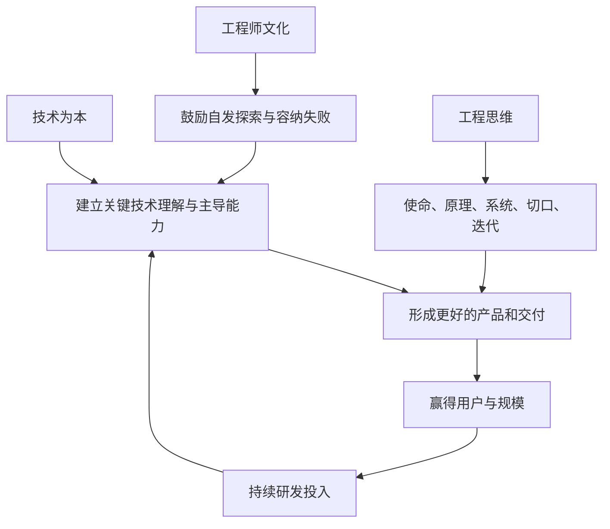
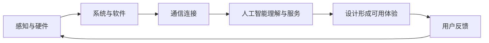

> 本章从三个层次解释小米为什么把技术放在第一位：技术如何成为科技公司的长期驱动力，工程师文化如何让创新持续发生，以及工程思维如何帮助整个组织解决复杂问题。

---

## 一、本章主线

小米把自己定义为“以手机、智能硬件和 IoT 平台为核心的消费电子及智能制造公司”。这一定义决定了技术不是辅助部门，而是公司长期存在的基础。

全章需要分清三件事：

- **技术投入**：资金、人才、实验室和研发项目；
- **技术能力**：理解、定义、实现、验证和演进关键技术；
- **技术文化**：专业人员拥有空间、权力和回报，愿意主动创新。

投入是必要条件，不能自动变成能力；文化能激发创新，也不能替代专业治理。

---

## 二、科技公司的本质属性

### 2.1 小米既做科技产品，也强调高效率交付

小米同时做硬件、软件、互联网和新零售，容易被理解为零售或商业模式公司。雷军认为，这两种属性并不冲突：

- 技术创造产品和体验；
- 高效率让技术以更合理价格到达更多用户；
- 没有技术，效率只能帮助销售同质化产品；
- 没有效率，优秀技术可能只服务少数人。

因此，小米最终仍是一家科技公司，只是把交付效率也纳入技术价值实现过程。

### 2.2 什么是科技公司

科技公司以技术创新为先导，以技术进步驱动产品与服务，并通过技术持续赢得用户。

渠道、供应链、内容、品牌和创意都很重要，但技术公司不能长期只依赖这些能力。它必须能够：

- 判断技术方向；
- 定义自己需要的方案；
- 掌握关键细节；
- 独立实现或主导合作实现；
- 验证技术是否真正改善体验；
- 让能力跨产品和时间积累。

### 2.3 为什么技术是根本驱动力

技术会改变企业能够提供什么：

- 新芯片和系统优化提高性能与续航；
- 新材料和工艺改变外观、结构和手感；
- 人工智能创造新的交互方式；
- 通信技术连接更多设备；
- 隐私与安全技术保护用户；
- 制造技术提高质量和效率。

商业模式可以提高已有产品的传播和交付效率，技术则能创造过去不存在的产品价值。

---

## 三、小米早期增长背后的技术

### 3.1 硬件和软件团队的起点

小米早期硬件团队主要来自摩托罗拉，具备驾驭旗舰芯片和整机开发的能力，并在高通总部所在地派驻团队联合调试。来自微软、谷歌和金山的团队则建立了 MIUI 软件能力。

创业团队并不是因为采用互联网营销就突然会做手机。能够首发旗舰芯片、开发操作系统并持续更新，仍然需要扎实工程能力。

### 3.2 MIUI 不只是界面美化

MIUI 除了设计和交互，也做系统底层优化。例如“对齐唤醒”控制应用互相唤醒，减少后台活动对耗电、内存和流畅度的影响。

这类创新用户看不到代码，却能直接感受到续航和性能。技术价值最终应落到体验，而不是只显示在专利和参数中。

### 3.3 技术怎样推动产品成长

原书列举小米推动或较早应用的多项技术，包括：

- 5G Wi-Fi、Wi-Fi 6、NFC 及公交卡等应用；
- Type-C、高精度双频 GPS；
- 人脸识别、快充、无线充电和反向充电；
- 不锈钢、曲面玻璃和陶瓷工艺；
- MIX 全面屏与屏下摄像头；
- 跨设备人工智能语音体验。

这些案例不表示每项技术都由小米单独发明，而是说明技术采用、联合研发、系统整合和规模普及同样需要工程能力。事实边界应区分“率先研发”“率先量产”“推动普及”和“参与应用”。

---

## 四、五大技术板块

### 4.1 硬件及驱动

包括相机、显示触控、快充、无线充电、芯片和底层系统软件优化。

小米发布澎湃 C1 影像芯片和澎湃 P1 充电芯片，并加强芯片调校。使用同样芯片的产品，仍可能因调度、功耗、散热和系统配合不同而表现差异。科技公司不能把关键器件当作完全不可理解的黑箱。

### 4.2 系统及基础软件

MIUI 是小米第一款产品。此后，公司建立大型操作系统团队，并推出 Xiaomi Vela 物联网嵌入式平台和快应用框架。

基础软件的价值在于：

- 统一多个设备的开发和体验；
- 让同一能力被大量产品复用；
- 降低生态伙伴接入成本；
- 使设备在售出后仍能更新和服务。

平台必须保持兼容、稳定和开放，不能只服务内部组织便利。

### 4.3 通信技术

包括 5G、6G 预研，Wi-Fi、蓝牙、NFC 和 Mesh 网络。通信决定设备能否稳定连接、互操作和协同。

对于 AIoT 公司，连接不是附加功能，而是全场景体验的基础。连接数量再大，如果配网困难、延迟高或互不兼容，也不能形成生态价值。

### 4.4 人工智能

小爱同学综合使用声学、语音、自然语言处理、搜索推荐和知识图谱，并覆盖手机、音箱、电视等设备。

人工智能的价值不在于模型名词，而在于能否：

- 准确理解用户意图；
- 在不同设备和场景中完成任务；
- 保护数据与隐私；
- 持续从错误中改进；
- 在成本和延迟可控的条件下提供服务。

### 4.5 设计

原书把结构、外观工艺、工业设计和交互设计也视为技术板块。设计不是研发完成后的装饰，而是把技术能力组织成用户能理解和使用的产品。

好设计需要同时理解材料、制造、软件、人的行为和审美，因此应从产品定义初期就参与。

### 4.6 五大板块的共同逻辑

真正竞争力不只是每个板块强，而是板块之间能否形成完整产品。

---

## 五、技术大奖中的创新案例

### 5.1 MIX Alpha：探索不等于一定量产

第一届“百万美金技术大奖”授予 MIX Alpha 环绕屏项目。它涉及屏幕贴合、5G 天线、系统框架、触控和结构等大量跨专业创新。

产品最终没有大规模量产，说明技术样机与可制造商品之间仍有距离。但项目留下了：

- 显示与结构技术；
- 天线和系统经验；
- 近百项专利；
- 对屏幕形态和折叠方向的认识；
- 跨团队解决未知问题的能力。

探索项目不能只用量产销量评价，也不能因为“探索”就不设目标。应在阶段节点检查技术成果、可复用性和继续投入价值。

### 5.2 MIUI 隐私保护

MIUI 12 通过“照明弹”展示应用敏感行为，通过权限控制和隐匿功能把知情、选择和管理权交给用户；MIUI 12.5 又引入模糊定位和隐私隔离。

这个案例说明：

- 透明本身需要系统技术；
- 权限不应只是安装时一次同意；
- 用户需要理解应用何时、为何使用数据；
- 保护隐私与提供服务要在最少必要数据上平衡；
- 技术创新也可以用于约束平台和应用，而不只是增加功能。

### 5.3 120W 秒充

快充不是单纯把功率数字提高，而是电池、充电芯片、双电芯结构、材料、充电器、算法和安全控制的系统创新。

用户真正关心的是：充得快、温度可控、电池寿命可靠、不同场景安全。单一参数只有在整体体验成立时才有价值。

### 5.4 CyberDog：工程师自发项目

CyberDog 四足机器人由工程师自发组织，年轻工程师通过长篇技术论证推动团队采用更先进、可扩展的 ROS 2 架构。

项目的视觉追踪技术后来进入手机“万物追焦”功能，说明探索项目中的能力可以回流核心业务。

这个案例体现：

- 年轻工程师可以影响架构决策；
- 技术选择要看长期扩展而非只看短期工作量；
- 小团队也能完成高密度探索；
- 新项目最好能留下可复用技术和人才。

---

## 六、研发投入、专利和实验室怎样看

原书记载，小米 2021 年研发投入 132 亿元，研发团队约 1.5 万人，占员工总数约 44%；在多国多城市建设研发中心，使用和在建实验室超过 430 间。
> **原书图示**：小米研发费用持续增长> **原书图示**：小米稳定性实验室内部
这些是技术建设的基础，但不能独立证明创新质量：

- 研发金额会受公司规模影响；
- 人数增长过快可能稀释导师和项目资源；
- 专利数量不能区分核心、普通和防御性专利；
- 实验室设备需要高水平人员和流程使用；
- 获奖和论文不等于用户产品成功。

更完整的评价应观察技术是否进入产品、改善体验、形成复用、降低风险，并建立长期独立判断能力。

---

## 七、三类技术创新

### 7.1 集成式创新

把已有技术重新组合，形成新产品或新工艺。它不是简单拼装，而是需要系统设计、接口协同和整体优化。

创业公司常从集成式创新起步，因为能够利用成熟产业链，快速验证用户价值。

### 7.2 自主技术创新

掌握独特核心技术和知识产权，并以此创造产品差异。例如自研算法、芯片、材料工艺或系统能力。

自主不等于所有部件都自己生产，而是对关键问题有自己的理解和实现能力。

### 7.3 面向未来的颠覆式创新

探索可能改变产品形态和行业路线的技术，例如全面屏、全新交互或机器人形态。它通常依赖集成和自主能力长期积累，风险和不确定性更高。

三类创新不是简单的高低等级。成熟第三方技术若能更好解决用户问题，就没有必要为了“自研”重复造轮子；关键领域若长期只靠采购，又难以形成主动权。

---

## 八、产品与技术双向驱动

### 8.1 产品驱动技术

产品先提出用户需求，技术团队寻找解决方案。时间紧、内部积累不足时，可以集成第三方方案或与供应商合作。

优点是目标清楚、容易落地；风险是只处理当前需求，缺少未来积累。

### 8.2 技术驱动产品

技术团队预研新能力，再反向提出过去无法实现的产品。例如新材料、新传感器和人工智能可能创造全新场景。

优点是可能建立领先；风险是技术团队脱离用户，做出没有真实需求的炫技。

### 8.3 最好的状态是双向循环

产品问题指导技术投入，技术突破扩展产品想象，用户反馈再校验两者。组织需要让技术和产品团队长期共同工作，而不是研发被动接单或独立研究。

---

## 九、吃透并主导关键技术

### 9.1 关键不在是否自产所有零件

三星采用较多垂直整合，苹果则深度整合全球供应链，两者都可以掌握产品技术。

判断企业是否有技术主导力，应看它能否：

- 明确自己需要什么；
- 理解技术原理和取舍；
- 提出领先的方案和指标；
- 独立验证合作伙伴成果；
- 在异常时定位和解决问题；
- 影响下一代技术路线；
- 在必要时拥有替代方案。

自产不等于掌握，外购也不等于没有技术。

### 9.2 深度合作不同于普通采购

普通采购是供应商提供什么，企业选择什么；深度合作则由企业和供应商共同定义器件、算法、调校和制造标准。

这种合作需要双方长期投入和利益共享。买方若只压价、不尊重伙伴知识，很难获得真正联合创新。

---

## 十、关键赛道重点突破

### 10.1 为什么不能平均投入所有方向

技术版图巨大，没有公司能同时在每项底层技术领先。应选择：

- 对核心用户体验影响大；
- 与公司战略高度相关；
- 能跨产品复用；
- 有能力和伙伴基础；
- 未来变化足以带来差异的赛道。

集中投入不是忽略其他基础能力，而是在保障底线后形成几个能牵引全局的技术高地。

### 10.2 影像战略

小米早期更关注性能和工艺，对影像投入不足。2016 年开始重点投入，先在核心器件部设相机团队，后来成立独立相机部，从一名调校工程师发展到约 2000 人，并与三星、索尼等伙伴联合研发。

能力范围包括：

- 光学设计和镜头模组；
- 传感器定制；
- 色彩和影调；
- 计算摄影；
- 夜景、人像和抓拍；
- 自研影像芯片。

DXOMARK 排名可以作为部分参考，却不能完整代表真实拍摄体验。榜单应与用户反馈、盲测、长期稳定性和不同场景结合。

### 10.3 徕卡合作

与徕卡合作既有品牌价值，也有影像技术和审美价值。合作是否成功，应看双方是否共同形成光学、色彩、影调和产品能力，而不是只增加标识。

“超越人眼、感知人心”等愿景表达方向，最终仍需用用户可感知的成像结果检验。

### 10.4 原色屏

小米从小米 9 开始推动高色准屏幕，与供应商共同制定方案并对每块屏幕校准。它说明企业可以通过标准、调校和量产验证主导外部器件，而不必自己生产面板。

专业参数重要，但用户还会感知亮度、功耗、户外可读性、护眼和一致性，不能只优化单项指标。

### 10.5 AI 实验室

小米 AI 实验室覆盖视觉、声学、语音、自然语言、知识图谱和机器学习，既做论文、竞赛和专利，也向手机、AIoT、新零售等业务交付算法。

它既是“试验田”，探索未来能力；也是“弹药库”，把成熟技术提供给业务。研究组织必须同时避免两种偏差：只追论文不落地，以及只接短期项目没有技术积累。

---

## 十一、志存高远，但不能好高骛远

### 11.1 早期手机 SoC 项目的教训

2014 年，小米从不到 20 人起步，直接挑战以 CPU 为核心的手机 SoC。三年投入约 10 亿元、团队发展到 200 多人，推出澎湃 S1 并搭载小米 5C，但后续产品陷入僵局。

问题不是目标没有价值，而是：

- 对芯片复杂度理解不足；
- 起步团队与攻顶任务不匹配；
- 芯片需要长期架构、软件、制造和生态积累；
- 单代产品成功不等于完整路线成立；
- 研发节奏与手机主业需求难以匹配。

目标越高，越要尊重技术积累和组织规律。

### 11.2 从影像和充电芯片重新起步

小米没有完全放弃芯片，而是转向 ISP 影像芯片、充电芯片等更聚焦、与产品需求紧密的方向。

这种路径能让团队：

- 在可控范围完成量产闭环；
- 直接改善核心产品体验；
- 积累设计、验证和供应链经验；
- 用实际产品支持持续投入；
- 逐步扩大芯片能力边界。

改道不是缺乏定力。发现原路径与能力不匹配后，保留长期目标、调整实现顺序，才是更务实的坚持。

### 11.3 三层研发组合

| 层次 | 时间范围 | 主要目标 |
|---|---|---|
| 当前产品研发 | 当下 | 按时、高质量交付 |
| 中期预研 | 未来一至三年 | 建立下一代产品差异 |
| 长期预研 | 三至五年及以后 | 探索颠覆性自主创新 |

只做当前交付，公司没有未来；只做长期探索，公司可能失去今天。资源、团队和评价方式应分层，避免短期项目不断挤压预研，也防止长期项目没有阶段成果。

---

## 十二、统一技术架构与能力复用

小米把技术能力整理为六层：

| 层次 | 主要内容 |
|---|---|
| 感知层 | 光学、声学、雷达和各类传感器 |
| 通信层 | 5G、6G、Wi-Fi、蓝牙、NFC 和互联协议 |
| AI 层 | 统一人工智能能力和算力支持 |
| 系统层 | 手机、IoT、汽车座舱、家庭系统和云 |
| 计算层 | 合作伙伴芯片与自研芯片 |
| 输出层 | 屏幕、声学、机械臂和自动控制 |

统一架构要解决的是各业务重复研发和无法复用。机器人视觉可以进入手机追焦和汽车感知，机械臂技术也可进入清洁设备。

架构也可能过度集中。统一平台若无法满足不同业务节奏，会成为瓶颈。因此应统一基础能力和接口，同时允许场景团队保留必要自主空间。

小米希望从“万物互联”进一步走向“以人为中心，连接人与万物”：用户通过任一入口调用整个生态能力。方向很宏大，仍需长期解决一致体验、隐私、安全和跨品牌兼容。

---

## 十三、工程师文化就是鼓励创新

### 13.1 工程师文化是什么

工程师文化不是鼓励加班，也不是认为技术人员永远正确，而是：

- 尊重专业判断；
- 让最了解问题的人拥有相应话语权；
- 支持探索未知；
- 容纳经过认真治理的失败；
- 给工程师设备、时间、导师和成长空间；
- 让技术贡献获得公开荣誉和长期回报。

技术最终由人实现。没有合适环境，再大的投入也难产生持续创新。

### 13.2 “程序员是老大”的文化来源

金山创始团队以程序员为主，长期强调技术立业，工程师比例很高，并让技术人才获得尊重。很多人愿意继续走专业道路，而不是只有成为经理才能得到认可。

成熟公司需要管理和技术双通道。若薪酬、权力和荣誉只属于管理岗，优秀工程师会被迫离开专业工作。

### 13.3 “MIUI 能否发版，雷总说了不算”

这句话表示发布质量应由真正掌握工程事实的负责人判断，而不是最高领导凭职位决定。

专业权力也必须配合责任：工程师要对质量、风险和用户结果负责，重大商业取舍仍需跨专业共同决策。

---

## 十四、相信工程师，给创新空间

### 14.1 创新为什么容易失败

创新是做别人没做过的事，或做别人做过却没做成的事，本来就高度不确定。若只奖励成功，员工会选择安全项目，不愿暴露困难和提出大胆方案。

容纳失败不等于容纳失职。可以接受的是：

- 假设合理；
- 风险和阶段目标清楚；
- 过程认真；
- 及时汇报问题；
- 失败留下知识和能力。

不能接受的是隐瞒、重复低级错误、无边界消耗和忽视质量安全。

### 14.2 MIX 的自发探索

2014 年，工程师讨论“未来手机正面全是屏幕”，雷军允许团队不考虑短期量产和投入，持续探索三年。项目穿越小米低谷，最终以 MIX 开启全面屏方向，也在危机中重新建立市场和团队信心。

自发创新能量强，但公司仍需把个人想法转化为正式项目，提供跨部门资源、评审和风险管理。

### 14.3 夜枭算法

雷军周日晚在园区看到相机工程师调试夜景算法。这个故事体现热爱和自驱，但不应被解读为优秀工程师必须长期在休息时间工作。

组织真正要学习的是：让热爱某个问题的人有设备、数据、伙伴和正式项目空间，把个人探索转为团队能力。

### 14.4 年轻工程师与快充温控

一位应届工程师听到司机认为小米快充发热后，主动研究新的温控方法，提出把工业控制领域的 PID 思路用于手机快充。经过导师、伙伴和部门资源支持，技术进入 MIX 4，提供恒温和极速两种充电模式。

这个案例不是个人英雄主义。创新能够落地，是因为：

- 一线反馈触发真实问题；
- 年轻人有主动研究空间；
- 导师帮助判断；
- 团队共同开发；
- 部门正式立项并提供工程资源；
- 最终经过多场景和兼容验证。

“老板要求做”和“我主动想做”能量不同，组织应把主动性接入可靠工程体系。

---

## 十五、投资工程师就是投资未来

### 15.1 集团技术委员会

2019 年成立的集团技术委员会负责：

- 梳理技术资源和路线；
- 协调跨业务研发；
- 推动技术复用；
- 培养工程师；
- 建立技术荣誉和氛围。

委员会不能替代一线判断，也不能变成审批层。它的价值应是减少重复、解决跨部门问题和保护长期技术投入。

### 15.2 百万美金技术大奖

大奖通过高额物质激励和最高规格仪式，让工程师从幕后走到台前。它传递：技术贡献与经营贡献同样重要，专业路线也能获得最高荣誉。

奖项可能产生争抢和短期化，需要透明评审，并重视长期基础工作、团队协作和未必立即成功的探索。

### 15.3 工程师需要“可以作为的空间”

薪酬之外，优秀工程师还重视：

- 有意义、足够困难的问题；
- 清楚的专业成长路径；
- 好导师和强同行；
- 实验设备与预研预算；
- 跨领域转岗和学习机会；
- 对方案的真实决定权；
- 技术成果被用户使用。

小米通过培训、竞赛、转岗、预研和公益项目扩大这种空间。招聘人数增长必须与导师、项目和文化承载能力匹配，否则会降低人均成长和效率。

### 15.4 技术公益

无障碍应用、地震预警等项目不一定有直接商业回报，却能用技术改善弱势群体和公共安全，也强化工程师对使命的认同。

公益技术仍需长期维护、可靠性和责任边界，不能只作为品牌展示。

---

## 十六、工程思维不是工程师专属

### 16.1 什么是工程思维

雷军把它概括为：创造性运用科学原理，系统化解决问题。

它与单纯工匠式重复打磨不同，更强调：

- 理解基本原理和约束；
- 看清系统中各部分关系；
- 在有限资源下创造可行方案；
- 用实验验证；
- 根据结果不断改进。

工程思维可以用于产品、组织、商业模式和创意工作，但不能把人和社会当成完全可预测的机器。

### 16.2 五项工程思维

原书列出：

1. 找到一个使命；
2. 从第一性原理出发；
3. 理解并重构系统；
4. 找到第一把扳手；
5. 反复验证、快速迭代。

本章重点解释前三项中的使命、第一性原理和第一把扳手，并在结尾联系系统与迭代。

---

## 十七、工程思维之一：找到使命

### 17.1 使命帮助个人和组织不迷航

雷军大学时读《硅谷之火》，立下创办伟大公司的梦想；四十岁时再次创业，使命帮助他在巨大风险中确定方向。

使命对个人的作用是让长期努力有意义，对组织则能：

- 聚集认同目标的人才；
- 在规则覆盖不到时提供判断；
- 让团队愿意承担困难和延迟回报；
- 与用户和合作伙伴形成共鸣。

### 17.2 使命不能成为牺牲个体的理由

共同愿景可以提高凝聚力，但不能替代薪酬、劳动保障、专业管理和不同意见。真正认同必须建立在知情、自愿和公司持续兑现价值之上。

---

## 十八、工程思维之二：从第一性原理出发

### 18.1 什么是第一性原理

不是直接模仿别人怎样做，而是回到最基本事实：用户真正需要什么，物理和经济约束是什么，哪些旧规则只是历史习惯。

马斯克分析电池成本时，不接受“电池一直很贵”这个行业结论，而是拆到材料和制造，寻找价格差距来自哪里。

### 18.2 小米的第一性问题

雷军追问：用户对商品最本质的期望是什么？他的答案是“感动人心、价格厚道”。继而追问商业需要解决什么，小米把核心放在提高效率。

这促使团队重新审视：

- 哪些成本真正进入产品；
- 哪些来自低效渠道和营销；
- 怎样提高规模和周转；
- 怎样把效率收益传给用户。

### 18.3 第一性原理的风险

- 自以为回到底层，实际遗漏重要行业知识；
- 用简单原理低估制造、法规和人的复杂性；
- 把创始人个人判断包装成不可质疑的真理；
- 为追求“颠覆”忽视成熟实践中积累的经验。

第一性思考应与专家知识、数据和小规模验证结合。

---

## 十九、工程思维之三：找到第一把扳手

### 19.1 复杂问题必须从可行动处开始

资源有限、问题复杂时，等待所有条件齐备只会失去窗口。第一把扳手是当前能使用、能产生进展，并能为下一步创造条件的切口。

《火星救援》中的宇航员不断使用手边资源解决氧气、食物和通信问题，体现的正是先处理最关键约束，再逐步重建系统。

### 19.2 小米为什么先做操作系统

创业初期只有几十人，不可能同时建好系统、硬件、供应链和电商。团队最熟悉软件，因此先基于安卓开发 MIUI；MIUI 又带来用户、反馈、口碑和手机种子需求。

第一把扳手不是最容易的工作，而是最能撬动后续系统的可行起点。

### 19.3 “一元抢可乐”测试电商

没有电商经验的团队先在公司内部建立“大卖部”，让员工一元抢可乐。工程师自己进货、把会议室当仓库、在楼道配送。

这个小测试验证了：

- 下单和库存是否同步；
- 高并发和支付流程是否可靠；
- 仓储、拣货和配送信息怎样流动；
- 异常订单怎样处理；
- 技术系统与实际履约如何连接。

内部员工样本不能证明外部用户需求，却足以低成本发现系统和流程问题。一个月后，电商系统支持了手机首销。

---

## 二十、理解系统、反复验证和快速迭代

### 20.1 理解并重构系统

工程思维不是只优化一个零件，而是看清产品设计、制造、流通和服务怎样互相影响。小米把这些环节重新组织为硬件、互联网和新零售的复合模式。

局部效率可能伤害全局。例如采购压价会损害供应商创新，快速发布会增加质量风险，部门销量增长会稀释品牌。系统思维要求同时看反馈和长期后果。

### 20.2 反复验证、快速迭代

方案只是待验证的假设。团队需要：

1. 明确问题和成功标准；
2. 用尽量低成本的方式测试关键风险；
3. 收集真实数据和用户反馈；
4. 判断是改进、转向还是停止；
5. 把学习沉淀为规范和平台能力。

涉及硬件、安全和长期基础设施时，迭代仍要遵守充分验证和责任边界。

---

## 二十一、本章方法论总结

### 21.1 技术为本的完整含义

技术为本不是：

- 所有零件都自己生产；
- 研发投入越多越好；
- 工程师可以忽视用户和商业；
- 每个项目都追求颠覆；
- 失败永远无需负责。

它是持续建立对关键技术的理解、定义、实现、验证、演进和复用能力，让技术真正转化为产品与用户价值。

### 21.2 建立技术公司的步骤

1. 根据使命和核心产品确定关键技术赛道；
2. 同时建设当前研发、中期预研和长期探索；
3. 区分必须自研、可以联合研发和适合采购的能力；
4. 让产品与技术双向驱动；
5. 建立统一架构，促进跨业务复用；
6. 给专业人员话语权、资源和成长路径；
7. 容纳认真探索的失败，治理失职和无边界投入；
8. 用用户体验、量产质量和长期能力评价研发；
9. 发现路径不匹配时，调整顺序而非执着沉没成本；
10. 承认差距，以长期积累替代夸大宣传。

### 21.3 本章最重要的概念

| 概念 | 通俗理解 |
|---|---|
| 科技公司 | 以技术进步持续创造产品和服务价值 |
| 技术主导力 | 知道要什么、怎样实现，并能验证和推动路线 |
| 集成式创新 | 把现有技术组织成新的完整解决方案 |
| 自主创新 | 掌握关键核心技术并形成独特价值 |
| 颠覆式创新 | 探索可能改变产品形态和行业路径的技术 |
| 关键赛道 | 对核心体验和未来竞争影响最大的技术方向 |
| 三层研发 | 当前交付、中期差异、长期探索同时存在 |
| 工程师文化 | 以专业权力、容错边界、资源和回报支持创新 |
| 工程思维 | 从使命与原理出发，重构系统、找到切口、验证迭代 |

### 21.4 事实与适用边界

- 原书列举的技术领先与专利、榜单数据有时间和口径限制；
- 概念产品没有量产，不能等同商业成功；
- 技术奖项和论文只是能力证据的一部分；
- 大企业的研发规模不适合初创公司照搬；
- 消费电子可以快速迭代，安全关键行业需要更严格验证；
- 自发加班案例不应被制度化为对工程师的要求；
- 第一性原理不能替代行业知识；
- 统一技术架构要避免成为中央审批瓶颈。

### 21.5 一页速记

> **科技公司本质**：用技术创新驱动产品、交付和长期发展。 
+> **技术板块**：硬件驱动、系统软件、通信、人工智能、设计。 
+> **评价投入**：不只看钱、人和专利，更看产品落地、复用和用户价值。 
+> **三类创新**：集成式、自主式、面向未来的颠覆式创新。 
+> **关键能力**：吃透并主导关键技术，不等于所有零件自产。 
+> **重点突破**：资源有限时选择影像、屏幕、充电、AI 等关键赛道。 
+> **路径纠偏**：手机 SoC 攻顶受挫后，从影像和充电芯片逐步积累。 
+> **研发分层**：当前交付、中期预研、长期探索。 
+> **工程师文化**：尊重专业、鼓励主动探索、容纳认真失败、提供成长空间。 
+> **工程思维**：使命、第一性原理、系统重构、第一把扳手、验证迭代。 
+> **核心启示**：技术为本不是技术崇拜，而是让组织长期拥有理解未来、创造方案并把它可靠交给用户的能力。
