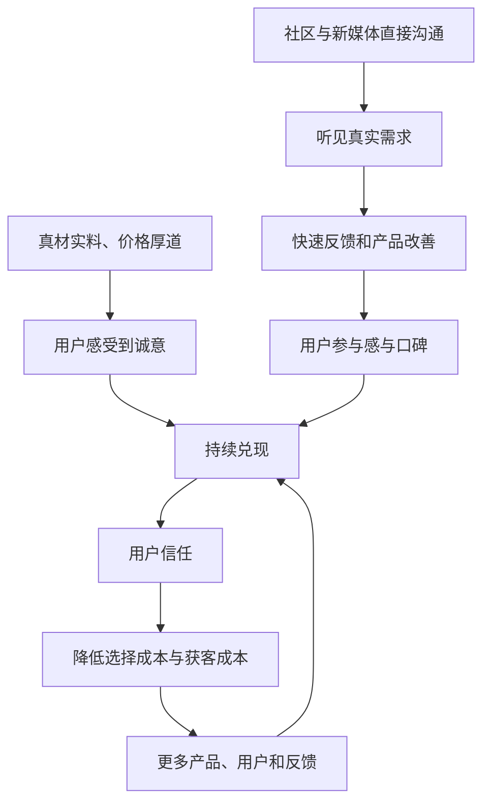

> 本章讨论小米方法论的第二个关键词：用户。雷军认为，“以用户为中心”最终要落实为一种长期关系，让用户相信企业不会利用信息优势占便宜，并愿意持续听取意见、改进产品和兑现承诺。

---

## 一、本章主线

“和用户交朋友”不是把用户称为朋友，也不是依靠粉丝崇拜获得销量，而是通过一整套经营选择逐步建立信任：

本章可以归纳为五层：

1. 重新定义企业与用户的关系；
2. 用性价比表达商业诚意；
3. 用新媒体倾听，而不只是营销；
4. 让用户参与产品和业务讨论；
5. 将长期兑现沉淀成“闭着眼睛买”的信任。

---

## 二、从“顾客是上帝”到“用户是朋友”

### 2.1 为什么“以用户为中心”容易成为空话

几乎所有企业都会说重视用户，但真正决策时，销售、利润、进度和部门指标往往更具体、更紧迫。若没有产品、定价、沟通和考核机制，“用户第一”很容易在冲突中让位。

判断企业是否真的以用户为中心，应看：

- 产品定义是否从真实需求出发；
- 质量、价格和隐私是否尊重用户；
- 负面反馈能否进入决策；
- 发生问题时是否承担责任；
- 短期利润与长期信任冲突时怎样选择。

### 2.2 “顾客是上帝”有什么问题

雷军不喜欢这个说法，因为它过于抽象，也制造了不真实的高低关系。商家在墙上写“上帝”，不代表用户会得到透明价格和可靠产品。

“朋友”这个比喻更具体：

- 不利用信息差欺骗；
- 真心推荐适合对方的东西；
- 有问题愿意说清楚并帮助解决；
- 尊重对方意见，不把对方当流量；
- 双方长期相处，而不是做完一次买卖就结束。

朋友只是经营关系的比喻，不能替代消费者权益、合同、质量和售后责任。越强调亲近，企业越不能用情感要求用户宽容问题。

### 2.3 “内部价”反映了什么

即使小米手机价格已经很低，朋友仍会询问雷军有没有“内部价”。这反映两种普遍心理：

1. 用户担心公开价格包含很高利润或对不同人价格不同；
2. 用户相信朋友不会坑自己，会给出更真实的价格和建议。

“内部价”不只是贪便宜，而是市场信任不足的表现。用户无法看清产品真实成本、质量和利润，只能依赖关系判断是否被占便宜。

### 2.4 互联网怎样帮助建立新关系

互联网让价格、参数、评价和企业行为更容易传播，也让用户可以直接公开反馈。企业欺骗用户的长期代价变高，同时有机会用持续透明建立信任。

但互联网不会自动带来诚信。它也可能放大虚假宣传、算法操纵和水军。真正的新商业秩序仍需企业主动克制、平台治理和消费者保护制度。

### 2.5 “赚点小费”的含义

雷军希望企业提供真材实料的产品，只获取合理、透明的利润，让用户感觉像为满意服务支付一点“小费”。

这不是要求企业不赚钱，而是：

- 利润来自真实价值和效率；
- 不依赖用户不知情制造不合理溢价；
- 不为了短期利润损害长期关系；
- 企业和合作伙伴都能持续经营。

---

## 三、和用户交朋友不等于粉丝经济

### 3.1 粉丝经济的关系

“一千个铁粉”理论主要适合创作者：少量高度认同的粉丝持续付费，就能支持创作。粉丝关系通常围绕特定人物、作品和认同形成。

### 3.2 大众品牌不能只依赖粉丝

小米面对的是大众消费市场，需要服务数亿不同背景、偏好和价格需求的用户。若把粉丝热情当成整体市场，会产生：

- 高估少数活跃用户的代表性；
- 把批评者视为不忠诚；
- 依赖创始人个人魅力；
- 忽视普通用户的质量和服务要求；
- 用情感认同掩盖产品问题。

### 3.3 朋友关系的核心是尊重和行动

粉丝经济更容易强调关注、崇拜和引领；“和用户交朋友”强调平等、倾听、透明和互惠。

原书将其比作互联网时代的群众路线：一切为了用户，依靠用户，从用户中来，再把改善后的产品交给用户。用户不是被动接受者，也不是企业可以免费调用的劳动力，而是产品和经营的重要参与者。

---

## 四、性价比是最大的诚意

### 4.1 为什么“谈钱会伤感情”

商业本来就要谈钱。真正伤害关系的是一方利用信息优势，让另一方事后发现自己付出了不合理价格。

雷军曾接触一位自称能“把稻草卖成金条”的高管，认为这种能力与小米价值观冲突。小米想要的是像农民种地一样，通过真实劳动和价值获得合理利润，而不是靠包装把普通东西卖出高价。

这个判断并非否定品牌、设计和营销价值。它反对的是价值没有明显提升，却利用信息差和话术索取高溢价。

### 4.2 “感动人心、价格厚道”是一体两面

- **感动人心**：产品品质和体验超出用户预期；
- **价格厚道**：价格与真实成本、价值和合理利润相称。

只有便宜但产品差，用户不会长期喜欢；只有产品好但定价过高，普通用户无法获得。两者共同表达企业诚意。

### 4.3 性价比不是绝对低价

性价比要在相近价格和性能之间比较：

- 同等价格，产品体验更好；
- 同等体验，价格更合理。

Redmi 98 英寸电视发布价 19999 元，绝对价格很高，但当时同尺寸产品价格远高于此，因此仍可称为高性价比。

高端产品也可以有性价比，前提是高价来自更强技术、材料、工艺和服务，而不是单纯品牌加价。

---

## 五、向 Costco 学习克制贪婪

### 5.1 Costco 做了什么

雷军研究 Costco 后，总结出几条规则：

- 商品经过严格筛选；
- 每个品类只保留少数选择；
- 商品加价受到严格限制；
- 主要通过会员费等长期关系获得利润。

它的核心是帮助用户精选并克制商品利润，让消费者相信平台上的商品不需要反复比价。

### 5.2 少 SKU 为什么提高效率

- 采购集中，单品规模大；
- 选品和质量管理更深入；
- 库存和仓储更简单；
- 用户选择成本更低；
- 平台可以与供应商共同改善商品。

选择少也有边界：平台判断可能不适合所有人，小众需求容易被忽略，老板亲自试用也不能替代专业测试和多样用户研究。

### 5.3 克制利润为什么很难

低商品利润意味着经营没有太多缓冲。只要选品、库存、费用或会员留存出现问题，公司就可能亏损。

因此，性价比不是简单降价，而是要求：

- 精准选品；
- 高周转；
- 低运营费用；
- 大规模采购；
- 稳定会员关系；
- 严格质量和服务。

越克制单件利润，越需要强大的整体经营能力。

### 5.4 MIX 定价争议

第一代 MIX 是划时代产品，内部有人建议定价六千甚至八千元，用高价快速建立高端形象。雷军仍按成本逻辑定价 3499 元。

他的理由是：高端化应靠产品价值和连续兑现建立，而不是用高价制造高端信号。若用户后来发现产品价值与价格不符，短期品牌提升会变成长期不信任。

这不意味着 MIX 的定价是唯一正确答案，而是说明小米愿意为长期性价比承诺放弃一次提高利润的机会。

### 5.5 5% 红线把克制变成制度

小米承诺硬件综合净利润率不超过 5%，原书记载当时实际约为 1%。这一制度避免性价比只依赖创始人的个人克制。

低利润仍需有可持续前提：规模、周转、研发效率、互联网服务、新零售和生态业务。若长期亏损、拖欠伙伴或削减质量，低价就不是真正厚道。

---

## 六、新媒体不等于营销

### 6.1 新媒体首先是沟通工具

小米确实因微博、社区等新媒体传播而知名，但雷军强调，首要目的不是营销，而是高效连接用户。

传统媒体主要是企业单向发布信息，新媒体让用户即时回应、质疑和参与。企业从“说服者”变成关系中的一方，必须接受持续监督。

### 6.2 用户资料不等于用户关系

传统企业可能拥有大量用户姓名、地址和电话，却只在投诉发生时被动沟通。数据库记录的是用户信息，不代表企业理解用户。

真正的用户关系需要：

- 持续双向沟通；
- 用户能方便提出意见；
- 企业能回应并采取行动；
- 产品团队看到真实场景；
- 用户知道反馈去了哪里。

### 6.3 为什么工程师也要直接面对用户

小米早期要求合伙人、产品经理和工程师都进入论坛和微博。一些工程师觉得聊天浪费开发时间，雷军认为，少量直接沟通可以避免长期闭门造车。

直接接触有几项价值：

- 减少反馈经过多层转述后的失真；
- 让开发者感受问题的真实影响；
- 发现用户表达背后的场景；
- 提高解决问题的责任感。

工程师不能把所有时间都用于沟通，客服、研究和产品团队仍需整理信息。关键是不能让专业分工彻底隔断开发者与用户。

---

## 七、尊重用户最终要靠行动

### 7.1 听见不等于解决

雷军曾向国际手机公司高管提出大量建议，对方认真记录，却两年没有明显改善。个人诚意若无法进入组织流程，就不会产生价值。

有效反馈闭环应包括：

1. 收到并确认；
2. 判断问题范围和优先级；
3. 指定责任团队；
4. 开发或服务改善；
5. 验证结果；
6. 向用户说明进展。

即使暂时不能做，也应解释原因，而不是让意见消失。

### 7.2 小米社区与用户共创

小米社区让用户投票决定部分功能方案，核心用户还参与内测。开发版周更之外，内测版可以按天更新。
> **原书图示**：发烧友在 MIUI 论坛投票决定产品方案
用户共创能提供：

- 多场景测试；
- 具体功能建议；
- 快速问题发现；
- 产品优先级参考；
- 参与感和归属感。

企业仍要负责架构、安全、隐私和最终决策，也应尊重用户贡献，避免把社区当作免费劳动力。

### 7.3 “先锋小组”周报

MIUI 12.5 优化受到用户批评后，团队组建先锋小组，将整改计划和每周进展公开在社区，接受监督。

公开周报的价值不是平息舆论，而是让承诺、负责人和进度可见。若内容只有宣传，没有问题、延期和验证结果，公开也会失去信任。

### 7.4 群众路线为什么看似慢、实际快

邀请用户参与会增加沟通和协调，但能减少方向错误和反复返工。关起门来开发看似决策快，若产品不符合需求，整个周期反而更长。

共创适合需求不确定、可以迭代的领域；涉及安全、专业责任和机密时，需要设置参与范围和风险边界。

### 7.5 “自来水”与付费推广

用户因真实满意主动传播，被称为“自来水”；付费制造热度或控制舆论，则无法替代口碑。

企业不必拒绝广告，但顺序应是：先把产品和服务做好，服务好首批用户，再用传播扩大真实价值。广告可以加速好产品，也会加速暴露坏体验。

---

## 八、坚守新媒体阵地

### 8.1 雷军为什么自己发微博

从 2011 年起，雷军累计发布上万条微博，强调账号由自己使用。亲自沟通使他能：

- 直接观察用户语言和兴趣；
- 快速了解产品问题；
- 展示真实判断和个性；
- 减少公关文案造成的距离；
- 建立长期、连续的关系。

创始人亲自使用不代表每家公司都需高频发言。关键是最高管理层不能只通过过滤后的报告理解用户。

### 8.2 为什么不建立全面事前审查

员工直接沟通难免偶尔失言。公关团队曾建议暂停或事前审核，雷军拒绝，选择培训、咨询和事后纠正。

理由是：若为避免一切风险而让员工闭嘴，公司会失去最直接的用户联系和真实感。

这个做法有边界。涉及财务信息、用户隐私、法律承诺、安全事件和未发布产品时，仍需明确授权与审查。开放沟通不是忽视合规。

### 8.3 对偶然错误与系统错误区别处理

- 偶然表达不当：及时道歉、解释、学习；
- 反复失言或恶意行为：需要问责；
- 产品质量和改善缓慢：不能用“沟通真实”转移责任；
- 组织压制真实问题：比一次表达错误更危险。

用户最终会“听其言、观其行”。长期产品和行动比一次文案更决定信任。

---

## 九、永远离用户更近一点

### 9.1 直播首先是交流，不只是带货

团队曾认为企业家直播有损高端形象。2020 年，雷军坚持尝试，并明确首要目标是与用户交流、讲小米十年和产品心得，而不是销售指标。

首场直播获得大量观看和销售，证明直接互动并不天然“低端”。真正低端的是虚假、套路和只把观众当成交对象。

### 9.2 用户在哪里，企业就去哪里

社区、微博、公众号、视频和直播不断变化。企业不必追逐每个热点，但应评估：

- 目标用户是否迁移到新平台；
- 平台适合哪种沟通；
- 是否能形成真实双向互动；
- 团队能否长期投入；
- 数据、内容和合规风险是否可控。

中国互联网、通信和物流基础设施，是小米能低成本直连大量用户的重要外部条件，不能把全部效果只归因于企业方法。

---

## 十、用真诚形成情感连接

### 10.1 在线连接不等于情感连接

注册账号、回复评论很容易，十年如一日认真沟通和兑现才困难。若社区只用于收集产品意见，用户与企业仍主要是合作关系。

小米通过米粉俱乐部、“爆米花”活动、米粉家宴等线下方式，让高管与用户共同交流，试图建立更长期的情感联系。

### 10.2 无门槛现金券

2017 年利润超出预期后，小米拿出 1.5 亿元，以无门槛、无品类限制、可抵邮费的现金券回馈用户。

口碑强烈的原因是规则简单、没有常见满减套路，用户能直接感受到收益。

回馈活动不能替代日常产品和服务，也不能通过先提高价格再发券制造虚假优惠。真正价值在于分享超额经营成果并兑现厚道承诺。

### 10.3 “休休奋斗”与共同信念

疫情期间，米粉“休休奋斗”在防护服上写下“永远相信美好的事情即将发生”。这让雷军看到，公司口号已经进入用户个人生活。
> **原书图示**：米粉“休休奋斗”参与武汉抗疫
这种认同是长期关系的结果，企业不应主动利用用户情感逃避产品责任或制造非理性消费。

### 10.4 “R U OK”与平等互动

雷军在海外发布会的英语被用户制作成网络视频。他没有试图压制调侃，而是进入 B 站回应，让“R U OK”成为长期互动梗。

它并非精心策划的营销，而是放下身份包袱、顺应用户表达方式。自然互动很难复制，企业若刻意制造“接地气”，反而容易显得表演。

---

## 十一、让用户参与业务讨论

### 11.1 米粉代表质询会

2020 年春节前，小米遴选 9 位不同类型用户代表，与雷军和高管进行半天质询和讨论，并公开直播。用户代表调研、整理文件，涉及技术、新业务和组织等问题；会后公司分发部门处理，并公开书面回应。
> **原书图示**：米粉代表与小米管理层交流
这个机制的价值在于：

- 管理层直接接触未经内部过滤的问题；
- 用户能看到公司如何解释和行动；
- 讨论从产品功能延伸到业务和组织；
- 公开回应形成责任压力。

### 11.2 用户参与不等于法定治理权

9 位代表不能统计代表数亿用户，也不拥有董事会或股东权利。更准确地说，这是用户咨询和监督机制。

设计类似机制时应：

- 让代表背景多样；
- 公开遴选和议题规则；
- 同时使用大样本调研；
- 保护个人信息；
- 跟踪建议是否处理；
- 区分建议权、知情权和正式决策权。

用户意见重要，管理层仍要承担最终责任，不能把困难决策推给用户投票。

---

## 十二、“闭着眼睛买”：信任是最终结果

### 12.1 为什么很多公司学动作却学不会

建立社区、做直播、请用户投票、发优惠券都容易模仿。若产品不可靠、定价不透明、反馈没有行动，这些动作只会成为营销表演。

小米最在乎两个结果：

1. 能否做出用户主动想买的产品；
2. 用户使用后是否愿意推荐给朋友。

这两项分别检验产品吸引力和实际兑现。

### 12.2 信任怎样形成

信任来自多次一致体验：

- 产品达到承诺；
- 价格长期合理；
- 问题能得到负责处理；
- 企业愿意公开信息；
- 用户意见能推动改善；
- 顺境和逆境中都不轻易改变原则。

信任积累很慢，严重欺骗一次就可能快速坍塌。

### 12.3 “闭着眼睛买”不是真的停止判断

这句话指用户相信小米会筛选质量、控制价格，从而降低比较和防骗成本。它不表示：

- 每款产品都客观最优；
- 用户不需要看自己的需求；
- 企业可以免于监督；
- 不同品类的质量和服务完全一致。

企业越获得这种信任，责任越大，更应帮助用户理性选择。

### 12.4 信任怎样成为双方财富

对企业：

- 新品获客成本更低；
- 用户更愿意尝试新类别；
- 口碑和复购增强；
- 危机中获得整改时间；
- 合作伙伴更愿意投入。

对用户：

- 降低选择和比较成本；
- 更容易获得可靠产品；
- 意见更容易进入产品；
- 售后和长期服务更可预期。

信任不是利润和环境“都不重要”，企业仍需可持续盈利并管理风险。它只是提供了更稳定的长期关系基础。

---

## 十三、信任能否迁移到汽车

### 13.1 “你若敢造，我就必买”是什么信号

米粉的这句话让雷军相信，小米进入汽车行业拥有一批愿意关注和尝试的早期用户。庞大的手机和智能设备用户基础，确实能降低初期品牌和获客难度。

但这是一种强烈信任信号，不是完整市场研究。汽车与手机在价格、安全、使用寿命、售后和法规上差异巨大。

### 13.2 跨品类信任的边界

信任更容易迁移到相近品类，如手机配件和智能设备；迁移到汽车时，用户会重新评估：

- 安全与可靠性；
- 驾驶和乘坐体验；
- 制造与供应能力；
- 维修、保险和残值；
- 长期软件服务；
- 企业是否具备汽车专业能力。

手机用户基础是优势，不是汽车产品合格的替代证明。企业必须在新行业重新兑现信任。

---

## 十四、本章方法论总结

### 14.1 从用户关系到信任的步骤

1. 不把用户当流量、粉丝或被说服对象；
2. 用真材实料和合理价格表达诚意；
3. 建立直接、持续、双向的沟通渠道；
4. 让产品和工程团队接触真实用户；
5. 把反馈变成负责人、进度和改进结果；
6. 允许合适用户参与测试、共创和业务讨论；
7. 在产品、服务、沟通和售后全部触点保持一致；
8. 出现问题时公开承担并快速修复；
9. 用制度约束利润、质量、隐私和信息披露；
10. 通过长期重复兑现积累信任。

### 14.2 本章最重要的概念

| 概念 | 通俗理解 |
|---|---|
| 用户是朋友 | 平等、透明、尊重、互惠并长期负责 |
| 粉丝经济 | 依赖少量高度认同者持续支持，不能代表大众品牌关系 |
| 性价比 | 同等价格体验更好，或同等体验价格更合理 |
| 克制贪婪 | 不利用信息差索取不合理利润 |
| 新媒体 | 双向沟通和监督基础设施，不只是广告渠道 |
| 用户共创 | 用户参与测试和建议，企业承担最终决策责任 |
| 参与感 | 用户看到贡献被尊重和采用后形成的归属感 |
| 信任 | 用户相信企业将继续提供可靠产品、合理价格和负责服务 |

### 14.3 需要保留的边界

- “朋友”不能替代消费者权利和法律责任；
- 低利润模式需要高效率和可持续收入；
- 活跃社区用户不代表所有用户；
- 用户参与应得到尊重，不能成为免费劳动剥削；
- 员工直接发言仍需隐私、财务和法律边界；
- 直播和社交互动不能取代产品；
- 情感认同不能用于操纵消费；
- 用户代表参与不是正式公司治理权；
- 手机领域的信任不能自动证明汽车能力；
- 书中用户规模、利润率和市场数据均为原书记载时点。

### 14.4 与前后章节的连接

- 第七章说明工程师和技术怎样创造产品价值；
- 第八章说明这些价值怎样在用户参与和长期兑现中变成信任；
- 第九章将进一步说明怎样把技术、用户洞察和资源集中转化为爆品。

技术、用户和产品不是三条独立路线：技术创造可能，用户关系校验价值，产品把两者交付到现实。

### 14.5 一页速记

> **关系目标**：不是把用户叫作上帝，而是像朋友一样诚实、尊重并长期负责。 
+> **区别粉丝经济**：朋友关系强调平等和倾听，不依赖崇拜。 
+> **最大诚意**：感动人心的产品加价格厚道。 
+> **性价比**：比较优势，不等于绝对低价。 
+> **Costco 启示**：精选商品、减少选择、克制单品利润。 
+> **新媒体本质**：直接倾听、反馈和监督，不只是营销。 
+> **共创要求**：意见必须进入行动闭环，企业仍对最终结果负责。 
+> **离用户更近**：线上线下持续互动，但不把每个触点都变成销售。 
+> **治理参与**：让用户提出专业质询，公司公开回应和改善。 
+> **最终结果**：持续兑现后，用户愿意推荐，并降低选择成本。 
+> **核心启示**：信任不是沟通技巧，而是产品、价格、行动和制度多年保持一致的结果。
