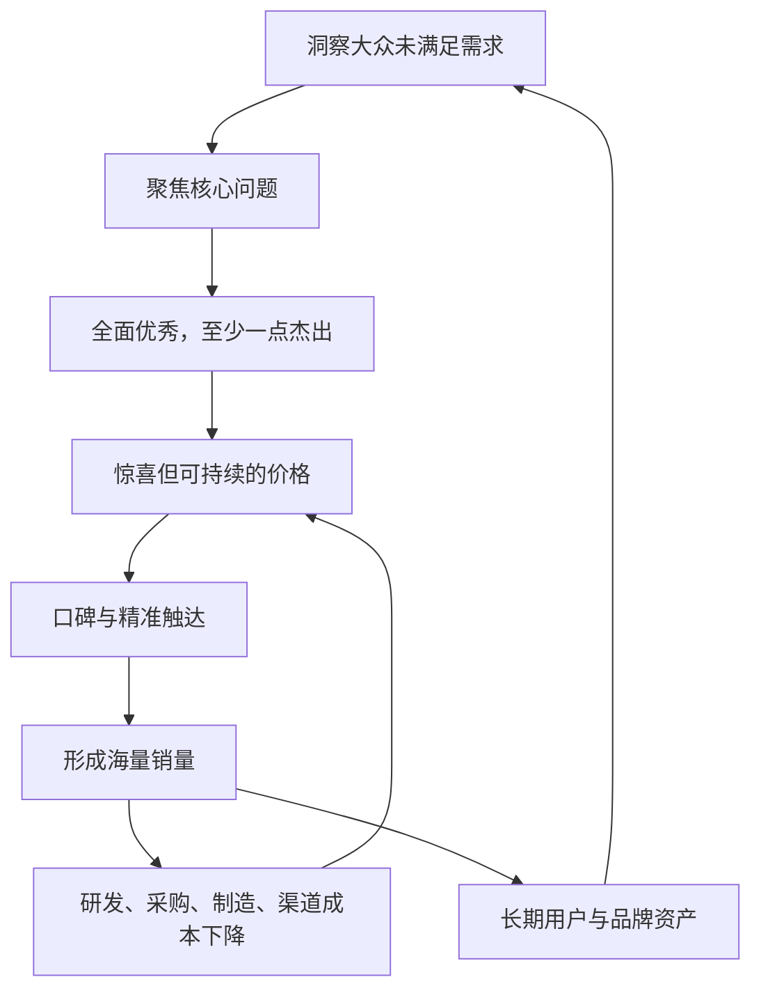

> 本章讨论小米方法论的第三个关键词：产品。雷军强调，“爆”只是产品成功后的结果，真正值得研究的是如何通过需求洞察、产品定义、定价和效率，持续打造产品力强、口碑好、海量长销的产品。

---

## 一、本章主线

爆品不是营销制造出的短期热点，而是一套完整经营模式的结果：

全章要区分三层：

- **产生条件**：工业能力、大众消费能力、体验导向创新；
- **打造能力**：找需求、做产品、定价格、提效率；
- **观察结果**：单款、精品、海量、长周期。

把结果当方法，容易误以为少做几个 SKU、压低价格就能得到爆品；真正困难的是让需求、产品和商业效率同时成立。

---

## 二、爆品不是营销出来的

### 2.1 “爆”为什么不能作为起点

销量突然增长可能来自：

- 大规模广告；
- 促销和补贴；
- 渠道压货；
- 社交热点；
- 暂时稀缺；
- 市场风口；
- 竞争者短期缺位。

这些因素能制造热卖，却不能保证用户使用后满意、愿意推荐和持续复购。营销停止后销量迅速消失的产品，只是短期爆款，不是本章所说的爆品。

### 2.2 为什么偶然做出一款不够

一款产品成功可能包含正确判断、执行、市场时机和运气。持续做出爆品，才说明企业拥有可重复能力：

- 能持续发现需求；
- 能稳定做好产品；
- 能控制成本和质量；
- 能准确触达目标用户；
- 能从上一款产品积累能力，而不是每次重新下注。

因此，爆品模式研究的对象是企业系统，不是某个网红产品。

---

## 三、爆品产生的历史条件

### 3.1 福特 T 型车：工业化大生产

雷军把福特 T 型车视为现代商业史上的早期爆品。标准化和流水作业使汽车能够海量生产，成本和价格持续下降，最终累计销售约 1500 万辆。

工业化不只是使用机器，而是一整套体系：

- 标准化设计和零件；
- 稳定生产流程；
- 质量控制；
- 供应链协同；
- 产能规划；
- 工人培训和管理；
- 大规模交付与服务。

产品再受欢迎，若无法稳定生产和交付，也不能形成海量爆品。长期缺货还会损害原本的性价比和用户信任。

### 3.2 大众消费能力

T 型车最初价格较高，后来逐步降低到工薪阶层几个月工资可以负担。爆品不仅需要生产能力，也需要足够多人有购买和使用能力。

“价格不断下降”与“消费能力提高”并不冲突：技术和规模使产品更便宜，社会收入增长又让更多人能够购买，两者共同扩大市场。

### 3.3 可口可乐与标准化消费体验

可口可乐让不同身份的人以相同价格获得相同体验。它的全球流行与战后消费社会发展有关：当基本生活得到满足后，人们愿意为方便、娱乐和享受付费。

可口可乐进入中国后也没有立即普及。早期一瓶两元对许多家庭并不便宜，随着收入提高才逐渐成为大众饮料。

这说明性价比高不等于绝对便宜。价格必须放在当时收入、替代品和使用价值中理解。

### 3.4 产品体验导向的创新

爆品的第三个条件是创新从“能实现功能”进一步走向“怎样让用户体验更好”。

索尼随身听没有发明音乐播放，却解决了“随时随地听音乐”的需求。工程师通过轻量化把固定设备变成随身产品，创造了新场景和新品类。

技术只有与用户任务匹配，才会成为爆品创新。先进但昂贵、复杂或不解决大众问题的技术，不会自然转化为商业成功。

### 3.5 三项条件缺一不可

| 条件 | 缺少后的结果 |
|---|---|
| 高效工业能力 | 产品受欢迎却供不上，质量和成本失控 |
| 大众消费能力 | 产品优秀但市场太小，难以形成海量销量 |
| 体验导向创新 | 只能依赖低价和渠道，缺少口碑与长期差异 |

改革开放后的中国逐步具备完整制造体系、庞大消费市场和活跃创新环境，因此有形成大量爆品的基础。

原书说“每个行业、每个产品都值得用爆品模式再做一遍”，应理解为鼓励重新审视用户价值和效率，不是说所有行业都适合海量标准化产品。高度定制、奢侈品、专业设备和小众服务有不同规律。

---

## 四、常见的爆品认知误区

### 4.1 误区一：出货量大就是爆品

前互联网时代，电视广告“标王”可以借助媒体信任迅速推动销量。有些品牌产品扎实，借传播扩大市场后长期发展；有些产品质量不足，放量后问题反而更快暴露。

大销量可能由渠道和广告推动。只有产品本身被用户主动选择、使用后形成口碑，销量才是爆品结果。

### 4.2 圆珠笔案例：被动购买不等于口碑选择

批发市场里廉价圆珠笔出货很多，但用户往往只是没有更好选择，并不关心品牌或推荐给朋友。

若一支圆珠笔在书写、耐用、墨量和设计上明显更好，同时价格仍然合理，才具有成为爆品的可能。

爆品需要主动偏好，不只是市场充斥。

### 4.3 误区二：越便宜越好

只压低价格而不提高技术、设计和体验，会让企业陷入低水平竞争：

- 材料和质量不断下降；
- 供应商利润被压缩；
- 用户只能在相似低质产品中选择；
- 企业没有资金研发；
- 社会资源被重复浪费。

性价比的前提是高品质。低价只有来自真实效率，才可能长期成立。

### 4.4 误区三：技术和工艺领先就是爆品

摩托罗拉铱星计划用卫星建立全球通信网，技术和覆盖能力先进，但设备、运营和服务成本过高，无法成为大众通信方案。

Segway 发明电动平衡车后十年销量有限；被九号机器人收购后，产品形态和价格更贴近大众，较快打开市场。

技术价值若超出目标用户愿意支付和实际需要的范围，就会成为“溢出技术”。技术先进必须与场景、成本、易用性和市场成熟度结合。

### 4.5 误区四：阶段热卖就是成功

补贴、热点和新品效应可能产生短期高销量，却没有形成：

- 稳定口碑；
- 成本改善；
- 技术和供应链积累；
- 品牌信任；
- 下一代产品能力。

爆品模式追求企业长期正循环，而不是一次销售高峰。一家企业只能偶尔做出爆款，说明模式尚未建立。

---

## 五、爆品的定义

### 5.1 正式定义

雷军把爆品定义为：产品定义、性能、品质或价格与现有产品明显不同，大幅超出用户期望，并引发口碑传播和热销的现象级产品。

更简洁地说：**产品力超群、口碑一流，最终海量长销。**

这个定义包含四个判断：

1. 与现有选择有明显差异；
2. 差异被用户真实感知；
3. 使用后愿意推荐；
4. 企业能长期、大规模交付。

### 5.2 四个可观察特征

| 特征 | 含义 |
|---|---|
| 单款 | 资源集中在少数清楚产品，而非大量重叠型号 |
| 精品 | 产品整体优秀，核心体验有突出优势 |
| 海量 | 大量用户主动选择，供应链能够交付 |
| 长周期 | 不是昙花一现，生命周期和口碑持续 |

四项是“体检指标”，不是原因。刻意只做一款、追求出货量或延长清库存时间，都不会自动产生爆品。

### 5.3 爆品定义的边界

- 艺术品和奢侈品强调稀缺，不追求海量；
- 企业级设备销量小，但单个客户价值高；
- 定制服务不能形成单一标准产品；
- 公共产品成功不能只看销量；
- 数字产品“海量”还要看活跃、留存和真实价值。

应借鉴爆品的用户洞察、资源聚焦和产品力，而不是机械复制销量标准。

---

## 六、建立爆品模式

原书提出四项基础：

1. 找准用户需求；
2. 做出超预期产品；
3. 给出惊喜定价；
4. 以效率支持长期经营。

### 6.1 找准未满足的需求

爆品要直击普遍且尚未被很好解决的“痛点”。痛点不是用户抱怨次数多就一定重要，还要看：

- 影响多少人；
- 发生频率和严重程度；
- 现有方案为什么不足；
- 用户是否愿意改变行为或付费；
- 团队是否有能力提供明显更好的解法。

### 6.2 从用户痛点看到行业和社会痛点

福特没有发明汽车，却解决了汽车无法大规模、低成本供给的问题。小米空气净化器也不只解决某个功能，而是回应空气污染、产品昂贵和供给不足的社会性痛点。

痛点层次越高，潜在影响越大，但解决难度和责任也越高。企业不能只靠宏大叙事，必须落到具体产品和可验证体验。

### 6.3 “想在用户前面”不等于替用户做主

用户通常能描述问题，却不一定知道最佳技术方案。团队要比用户多想一步，发现未被明确表达的需求，同时用原型、访谈和真实使用验证。

以“用户不知道自己要什么”为理由忽略反馈，容易变成创始人自我中心；完全按投票做产品，又会失去系统判断和未来洞察。

---

## 七、超预期产品

### 7.1 便宜和好用都不够

便宜可能来自质量下降，好用则是用户购买产品的基本要求。用户在购买前已经比较过同类产品，仅仅达到行业平均不会产生强烈口碑。

原书给出的标准是：

> **全面优秀，外加至少一方面杰出。**

### 7.2 全面优秀

产品不能有破坏信任的明显短板，例如：

- 核心功能不可靠；
- 质量和安全不足；
- 售后困难；
- 设计和使用逻辑混乱；
- 承诺功能不完整。

“全面”不是每项参数第一，而是重要体验都超过基本合格线。

### 7.3 至少一点杰出

产品还需要一个清楚、可感知、能被记住的选择理由：

- 随身听让音乐可以随身携带；
- 初代 iPhone 重构触屏智能手机；
- 小米移动电源在设计、容量、质量和价格上形成显著综合优势；
- 全面屏改变手机正面形态。

只有无短板，产品会“不错”却缺少传播动力；只有一点炫目而整体糟糕，又会在使用中崩塌。

### 7.4 “酷”是用户感知，不是内部评价

雷军用“酷”形容远超预期的产品。酷可能来自技术、设计、简化、材料或新场景，但必须被用户感受到。

安全、可靠、隐私等不能被当作惊喜项，它们首先是底线。不能为了制造“酷”牺牲基本责任。

---

## 八、惊喜定价

### 8.1 惊喜与绝对价格无关

高价也可以令人惊喜，低价也可能不值。用户会把价格与同类产品、产品价值和自己的能力比较。

定价需要让目标用户觉得：在这个价值水平上，价格明显比预期合理。

### 8.2 为什么酷但太贵难以海量

产品体验再强，若价格超出大众支付能力，就只能成为小众产品。爆品追求让更多人享受创新，因此价格既是增长手段，也是普惠目标的一部分。

### 8.3 “好东西越做越便宜”的条件

随着销量、工艺和供应链成熟，企业有机会降低成本，把技术逐步带到更低价位。但这不是每代产品必须降价：原材料、法规、服务和研发要求也会增加。

更准确的目标是：

- 相同价格提供更多价值；
- 相同价值逐步降低价格；
- 不用降质和外部成本转嫁制造便宜。

### 8.4 定价不能只看成本

成本决定企业能否持续经营，用户价值和替代品决定愿意支付多少。定价过低也可能造成：

- 无法支撑质量、售后和研发；
- 供应伙伴没有合理收益；
- 用户误以为产品低质；
- 需求远超交付能力；
- 长期依赖补贴。

惊喜价格必须同时对用户厚道、对企业和伙伴可持续。

---

## 九、效率制胜

### 9.1 为什么高投入与高性价比可以共存

爆品需要研发、设计、材料和制造投入，又要价格厚道。解法不是少投入，而是让每笔必要投入服务更多产品和用户。

### 9.2 精简 SKU

少量产品可以：

- 集中研发、设计和测试；
- 提高单款采购规模；
- 减少物料和库存复杂度；
- 简化营销、售后和备件；
- 让用户更容易选择。

精简不能减少必要的人群覆盖，也不能让单一产品承担互相冲突的需求。SKU 数量应由用户差异和运营能力决定。

### 9.3 海量销量

大规模销量能：

- 分摊研发、模具和认证；
- 提高采购和生产效率；
- 帮助工艺学习与良率改善；
- 摊薄渠道、仓储和服务基础设施。

海量的前提是单位产品仍有合理收益、市场容量足够、质量稳定。亏一台卖得越多亏得越多，不是效率。

### 9.4 长产品周期

产品生命周期长，可以让研发、制造和供应链持续改善，也减少频繁换代造成的库存、备件和用户选择负担。

长周期不是停止创新。软件和服务可以持续更新，硬件则应在真正有价值时换代。

### 9.5 新媒体和高效渠道

用户口碑和直接沟通降低营销成本，电商和新零售减少多层渠道和库存。爆品自带流量后，又能帮助平台和其他产品获得用户。

线上并非天然低成本，数字广告、退货、物流和平台费用也可能很高。应比较完整交易成本和用户体验。

### 9.6 “对内拧紧毛巾”的边界

企业应减少浪费、流程和不必要费用，但不能压缩研发、质量、员工健康和供应商合理利润。

真正的爆品效率来自模式和能力，而不是把压力转嫁给产业链。

### 9.7 高性价比不是临时定价策略

许多团队可以靠补贴做一两款便宜产品，却无法长期维持。持续性价比需要：

- 稳定产品定义能力；
- 技术和供应链积累；
- 质量与交付体系；
- 低成本用户触达；
- 库存和资金周转；
- 克制利润的制度。

因此，性价比是产品战略和企业能力的综合结果。

---

## 十、爆品的杠杆效应

一款成功爆品可以同时撬动：

- 供应商愿意共同开发和提供产能；
- 团队获得经验与信心；
- 用户和媒体主动传播；
- 渠道获得自然流量；
- 品牌进入更多人的选择范围；
- 新产品获得更低的启动成本。

杠杆也会反向运行。爆品质量问题会大规模伤害用户和品牌；核心产品销量下滑也会削弱供应链支持。企业需要把爆品产生的势能转化为系统能力，而不是依赖下一次运气。

---

## 十一、打造爆品的四项关键能力

原书进一步把方法总结为：

1. 洞察未来；
2. 洞察用户；
3. 创新实现；
4. 精准触达。

四项分别回答：方向是什么、取舍什么、怎样做出来、怎样送到用户面前。

---

## 十二、能力一：洞察未来

### 12.1 什么是“明天属性”

产品给用户代表先进趋势、令人向往的新体验，使用后不愿回到旧方式，就具有明天属性。

例如：

- 智能手机取代功能机；
- 智能门锁减少钥匙依赖；
- 智能照明提供自动化场景；
- 扫地机器人减少重复劳动；
- 更符合人体工程学、墨量更持久的中性笔改善日常书写。

明天属性不一定是宏大技术，小产品也能通过更自然、更方便的体验体现未来方向。

### 12.2 “用过就回不去”为什么重要

它说明新方案不是短暂新奇，而是持续降低用户成本或增加价值。强烈使用差异会产生自然展示和传播，就像早期邻居买电视后吸引大家观看。

### 12.3 明天属性与噱头的区别

- 是否解决长期真实问题；
- 使用后价值能否持续；
- 技术和成本是否会逐步成熟；
- 是否有足够用户愿意迁移；
- 是否形成新的行为方式，而不是一次围观。

未来洞察不是讲一个宏大趋势故事。团队应通过技术发展、用户行为、原型试用和成本路径不断验证。

---

## 十三、能力二：洞察用户并精准取舍

### 13.1 爆品第一法则是做减法

每项功能都会增加开发、测试、学习、成本和故障风险。团队应把最关键需求做到透，而不是用功能数量制造安全感。

第一款小米扫地机器人只聚焦“扫得快、扫得干净”，暂时不做拖地。这样能把导航、路径和清扫能力集中做到高水平。

### 13.2 “满足 80% 用户的 80% 需求”

这条法则帮助生态链产品过滤低频和少数需求：

- 先满足大多数人的核心场景；
- 避免为少量功能增加所有用户的成本和复杂度；
- 用标准化支持规模和可靠性。

它不是忽视残障、小众或专业用户。安全、可访问性和法定要求不能因比例低被删除；重要小众需求也可以由不同型号、附件或服务满足。

### 13.3 聚焦与全面优秀不矛盾

聚焦决定杰出点，全面优秀保障重要基础体验。扫地机器人可以不做拖地，但导航、清扫、可靠性、噪声和安全都必须合格。

精准取舍不是只做一个功能，而是清楚哪些必须优秀、哪些形成突破、哪些暂时不做。

---

## 十四、能力三：重组技术和供应链实现创新

### 14.1 创新不一定从零发明

许多爆品创新来自把其他行业成熟技术带到新场景：

- 移动电源采用笔记本常用电芯和铝合金一体外壳；
- 扫地机器人借鉴工业扫描原理开发激光测距和路径规划；
- 台灯改良笔记本转轴工艺，改善阻尼和寿命；
- MIX 把牙科陶瓷工艺发展为手机机身工艺。

创新价值在于新的组合解决了过去未解决的问题，而不要求每个零件都原创。

### 14.2 供应链是创新伙伴

团队需要了解供应商的工艺边界、成本曲线、产能和未来路线，才能共同定义前所未有的产品。

若只在采购环节比价，很难推动材料、结构和制造创新。深度合作还要求合理利益、知识产权边界和风险共担。

### 14.3 “有十足把握的产品不是好产品”怎样理解

爆品要明显超预期，必然包含一定未知和工程挑战。但不确定性应被管理：

- 核心假设先做原型；
- 安全和质量底线不冒险；
- 分阶段投入；
- 准备替代方案；
- 设定停止条件；
- 让创新风险与公司承受能力匹配。

高风险本身不是创新价值。

---

## 十五、能力四：精准触达目标用户

### 15.1 好产品也需要被看见和买到

团队找到需求、做好产品、给出好价格后，仍需要：

- 用目标用户听得懂的方式说明价值；
- 在他们所在的渠道展示；
- 提供方便可信的购买和交付；
- 收集使用反馈；
- 让口碑进一步传播。

小米通过社区和新媒体直接传递信息，再以电商和新零售缩短交付链路。

### 15.2 精准不是追踪越细越好

精准触达应建立在用户自愿、内容相关和隐私保护上。过度采集数据、频繁广告和算法操纵会损害信任。

产品若真正面向大众，也不能只在狭窄核心圈传播，需要逐步进入大众渠道和语言体系。

---

## 十六、“小白模式”

### 16.1 两层含义

- 代入没有专业知识的普通用户，理解最自然的使用方式；
- 不被行业旧方案限制，回到最基本需求重新设计。

“小白”不是团队真的无知，而是专家主动放下习惯，使用专业能力创造无需专业知识的体验。

### 16.2 小米电视界面

传统 IPTV 和点播系统沿用电脑门户的密集导航，适合鼠标，不适合远距离用遥控器。小米电视使用大按钮和更清楚层级，让用户凭方向键完成选择。

### 16.3 11 键遥控器

传统遥控器按钮很多，大多数用户不知道用途。小米第一代遥控器只保留 11 个核心按钮，把低频功能放进清楚的系统菜单。
> **原书图示**：小米电视遥控器与传统遥控器
简化不是删除能力，而是：

- 高频操作直接可见；
- 低频功能按需要进入；
- 用户无需记忆复杂符号；
- 硬件和软件共同承担交互。

### 16.4 小白视角也需要专业校验

普通用户可能不知道专业功能、无障碍、安全和极端场景。产品既要易用，也要让专业需求可访问。

正确方式是专家先理解完整系统，再为不同用户设计清楚层级，而不是用“用户不懂”删除必要能力。

---

## 十七、爆品冰河期与 GMV 迷恋

小米也经历过一段爆品产出减少的时期。原因之一是团队过度追求成交金额和规模，快速增加产品，却减少了精雕细琢的时间。

GMV 上升可能来自：

- 增加更多普通产品；
- 促销和补贴；
- 扩大渠道压货；
- 消耗主品牌流量；
- 进入缺少协同的品类。

这些动作能增长数字，却可能让产品不再超预期，最终消耗口碑和效率。

高质量增长应当同时改善：

- 用户价值和口碑；
- 产品与核心业务协同；
- 单位经济和现金流；
- 技术、供应链和组织能力；
- 长期品牌资产。

放下 GMV 迷恋，不是不要增长，而是不让增长指标替代产品目标。

---

## 十八、本章方法论总结

### 18.1 爆品模式的完整步骤

1. 判断行业是否具备标准化、规模化和大众消费条件；
2. 寻找普遍、迫切、未被满足的用户问题；
3. 从行业和社会变化中判断“明天属性”；
4. 聚焦核心需求，主动删除低价值功能；
5. 做到重要方面全面合格，并形成至少一个杰出体验；
6. 重组技术、设计和供应链把创新量产；
7. 给出相对价值明显、又能持续经营的价格；
8. 用少 SKU、规模、长周期和高效渠道降低全链路成本；
9. 直接触达目标用户，靠真实体验形成口碑；
10. 把单款成功沉淀为下一款可复用的能力。

### 18.2 爆品模式与七字诀

| 七字诀 | 爆品模式中的体现 |
|---|---|
| 专注 | 少 SKU，聚焦一个迫切需求 |
| 极致 | 全面优秀，至少一点杰出 |
| 口碑 | 超预期体验带来自传播和转化 |
| 快 | 快速洞察、验证、交付和改善 |

### 18.3 本章最重要的概念

| 概念 | 通俗理解 |
|---|---|
| 爆品 | 产品力超群、口碑一流、海量长销的产品 |
| 单款、精品、海量、长周期 | 识别爆品的结果指标，不是直接原因 |
| 痛点 | 普遍、迫切且现有方案没有很好解决的问题 |
| 超预期 | 全面优秀，并在关键体验上明显超越同类 |
| 惊喜定价 | 相对产品价值和同类选择明显厚道的价格 |
| 明天属性 | 使用后不愿回到旧方式的先进体验 |
| 精准取舍 | 做透核心需求，删除低价值复杂度 |
| 重组创新 | 把不同技术和供应链能力组合成新体验 |
| 小白模式 | 用普通用户视角和第一性思考重新设计 |
| 高质量增长 | 增长同时增强用户价值、能力和长期经营质量 |

### 18.4 需要保留的边界

- T 型车、可口可乐等历史案例是说明性案例，不构成普遍证明；
- 不同品类的爆品规模和周期不能用同一数字判断；
- 少 SKU 不适合所有差异化需求；
- 大众需求原则不能忽略无障碍、安全和重要小众用户；
- 技术重组要尊重知识产权和合作伙伴利益；
- 低价不能依赖亏损、降质或成本转嫁；
- 爆品自带流量不能替代渠道和售后；
- “有十足把握不是好产品”不能成为不负责任冒险的理由；
- 爆品模式会集中风险，需求判断错误时损失也更大；
- 原书中的销量、价格和市场地位均有历史时点限制。

### 18.5 与下一章的连接

第九章说明爆品怎样通过产品力和规模形成效率；第十章将继续拆解：产品价格由哪些成本构成，低硬件利润怎样与企业盈利共存，硬件、新零售和互联网服务又如何组成完整商业模型。

爆品不是高效率模型的全部，却是重要发动机：没有足够产品力和规模，研发、供应链、渠道和服务都难以摊薄。

### 18.6 一页速记

> **爆不是起点**：营销能制造热卖，不能替代产品力和长期口碑。 
+> **三个历史条件**：高效工业生产、大众消费能力、体验导向创新。 
+> **正式定义**：明显超预期、形成口碑，并海量长销的产品。 
+> **四个结果**：单款、精品、海量、长周期。 
+> **四项基础**：找准需求、超预期产品、惊喜定价、效率制胜。 
+> **四项能力**：洞察未来、洞察用户、创新实现、精准触达。 
+> **产品标准**：全面优秀，至少一点杰出。 
+> **定价标准**：不求绝对最低，而求相对价值明显且长期可持续。 
+> **小白模式**：专家放下行业惯性，让普通用户无需学习即可使用。 
+> **警惕 GMV**：容易实现的规模增长，可能稀释产品与品牌。 
+> **核心启示**：爆品不是一次灵感或传播事件，而是用户洞察、技术实现、供应链、定价和全链路效率共同工作的结果。
