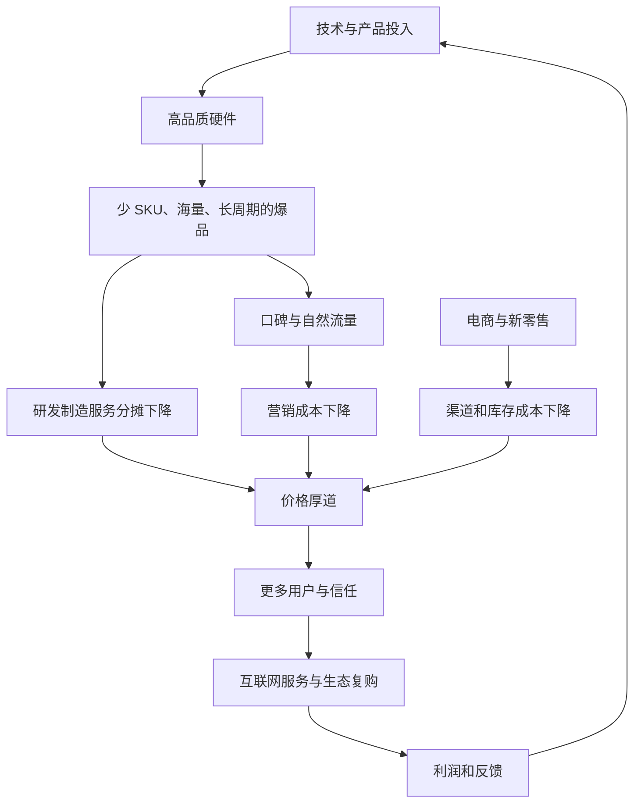
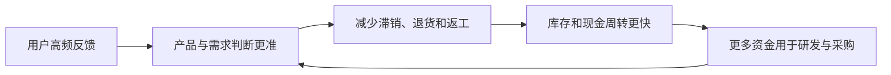
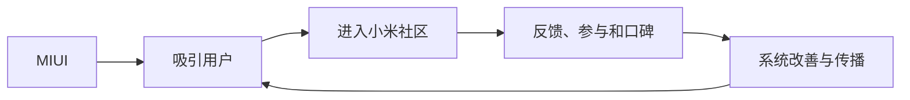
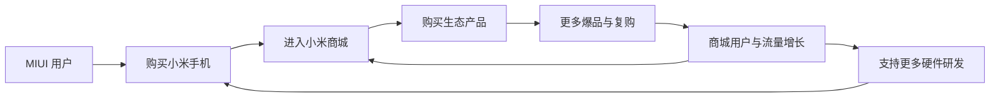
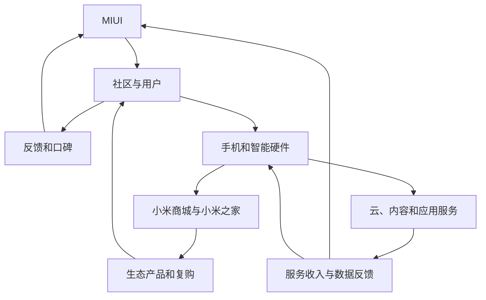
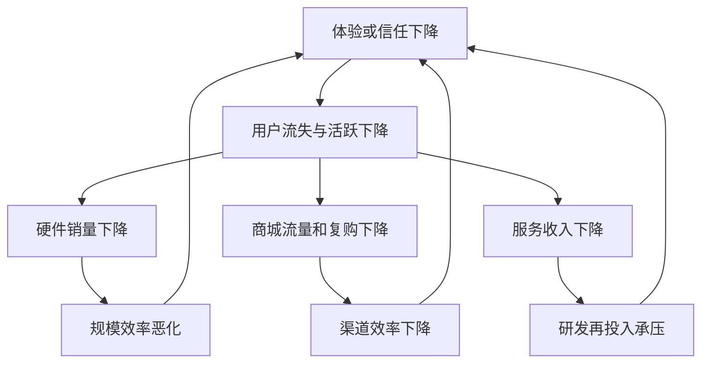

> 本章用“效率”解释完整的小米商业模式：怎样让好产品价格更合理，怎样在硬件低利润下保持企业盈利，以及硬件、新零售、互联网服务和用户关系如何组成持续增长的闭环。

---

## 一、效率是理解小米模式的主轴

小米同时做手机和智能硬件、操作系统、互联网服务、电商、线下门店和生态链，看起来像多种公司叠在一起。

若从效率观察，各模块在做同一件事：

- 爆品降低研发、制造和服务的单件分摊；
- 口碑和新媒体降低营销成本；
- 电商和新零售缩短交付链条；
- 快速反馈和周转减少库存与资金占用；
- 低硬件利润把效率收益更多交给用户；
- 互联网服务和生态复购提供持续利润；
- 利润再次投入技术和产品。

因此，低价不是起点。若没有产品、规模、渠道和周转效率，低价只能来自亏损或降低质量。小米想要的是：**先提高全链路效率，再克制利润，让高品质产品以合理价格到达更多用户。**

---

## 二、小米模式要解决的两个矛盾

### 2.1 矛盾一：“好”与“便宜”

雷军观察到一个怪圈：

- 便宜国货往往质量差或不稳定；
- 少数高质量商品价格又很贵；
- 消费者因此形成“便宜没好货”的印象；
- 企业为了建立信任，继续增加广告和渠道投入；
- 这些成本又进一步推高价格。

中国制造能力很强，不代表自主品牌一定能把好商品高效送到用户手中。制造之外还需要产品定义、设计、研发、品牌、渠道、库存、售后和用户关系。

### 2.2 衬衫案例与“定倍率”

原书举例：成本约 100 元的衬衫，在商店可能卖到 1000 元。“定倍率”就是零售价是所选成本的多少倍。

高倍率不表示 900 元全部是品牌净利润。售价中可能包含：

- 设计和研发；
- 品牌和营销；
- 批发、代理与零售利润；
- 商场租金和扣点；
- 库存、折扣和滞销损失；
- 物流、退换与售后；
- 税费和企业利润。

真正要分析的是：哪些环节为用户创造了必要价值，哪些只是低效结构造成的损耗。

### 2.3 为什么低价商品容易偷工减料

如果营销和渠道费用不变，企业想降低终端价格，最容易压缩的是产品本体：减少材料、缩短尺寸、降低工艺。

结果是渠道和交易结构没有改变，降价压力全部落到商品质量上。用户买到低价低质产品，又进一步相信“便宜没好货”。

小米希望先减少无效交易成本，而不是先削减进入产品的材料、研发和设计。

### 2.4 “一分货一分价钱”

雷军认同“一分价钱一分货”大体正确，但更希望它反过来：商品用什么材料、投入多少研发、设计和制造，就对应怎样的价格。

这并不表示渠道、售后和品牌都没有价值。好的门店能提供体验，品牌能降低选择风险，售后能保障长期使用。应减少的是与用户价值不相称的层层加价和信息不透明。

### 2.5 行业倍率数字怎样看

原书给出服装、鞋和化妆品的经验倍率。这些数字会随成本口径、吊牌价或成交价、渠道、品牌和地区明显变化，应理解为说明商业链条可能很长，而不是适用于所有企业的严格行业定律。

原书“10% 生产成本、90% 交易成本”的说法同样适合用来提醒经营者关注交易损耗，不应当作所有行业的统一统计结论。芯片、汽车、服装和数字服务的成本结构完全不同。

### 2.6 如何同时做到好与便宜

小米采用一组相互配合的做法：

1. 少 SKU 和爆品集中研发；
2. 大销量提高采购和制造效率；
3. 长周期分摊研发、模具和认证；
4. 口碑与新媒体减少广告依赖；
5. 电商和新零售减少渠道层级；
6. 快周转减少库存和资金成本；
7. 硬件利润受到 5% 红线约束。

这些做法的共同目标，是减少不创造用户价值的成本，同时保护产品本身的投入。

### 2.7 效率革命的社会意义

更高效率能让同样的材料、技术和劳动服务更多人，也能减少库存、重复营销和低效流通。

但效率不能通过污染、低工资、过度劳动、拖欠供应商或削减售后实现。把成本从公司转移给社会和伙伴，只是账面好看，不是效率革命。

---

## 三、矛盾二：低硬件利润与企业盈利

### 3.1 为什么“按成本卖”不够

硬件利润很低时，企业抵抗原材料涨价、汇率变化、库存跌价、质量事故和研发失败的空间也小。Costco 的性价比模式曾一度陷入困难，说明低利润经营对能力要求很高。

企业若不能盈利：

- 股东不愿继续投入；
- 员工和伙伴缺少合理回报；
- 研发、质量和服务无法持续；
- 最终用户也会受损。

价格厚道与企业盈利不是道德二选一，而是需要重新设计整个商业系统。

### 3.2 “不可能三角”

小米希望同时实现：

- 产品感动人心；
- 价格极其厚道；
- 企业有合理利润。
> **原书图示**：小米模式试图把“不可能三角”变成可能
在传统结构中，提高体验会增加成本，降低价格会减少利润，因此三者很难同时满足。

小米的解法是动态的：高品质和低价吸引更多用户；大规模降低分摊成本；快周转提高资金利用；互联网服务和生态复购增加长期收入。硬件不再独自承担全部利润目标。

### 3.3 三角成立的条件

- 产品价值和价格能带来足够规模；
- 规模确实能降低采购和固定成本；
- 单台产品不能长期亏损；
- 库存、现金和交付可控；
- 后续服务提供真实用户价值；
- 服务收入不以伤害体验和隐私为代价；
- 员工、供应商和渠道能获得合理回报。

缺少任何一项，低利润都可能变成不可持续的补贴。

### 3.4 复合模式为什么难

小米用不同模块承担不同目标：

| 目标 | 主要承担模块 |
|---|---|
| 好产品 | 技术、产品、硬件和供应链 |
| 厚道价格 | 爆品效率、短渠道和低利润约束 |
| 合理盈利 | 规模、周转、互联网服务和生态复购 |

三个模块都处于激烈竞争行业，节奏和能力也不同。复合模式并不是“多做几个业务就能多赚钱”，而是要求模块之间真正共享用户和能力。

---

## 四、商品定价里的效率密码
> **原书图示**：小米商品定价模型
### 4.1 商品价格的五个部分

原书把商品定价拆成：

1. 制造和服务分摊成本；
2. 研发分摊成本；
3. 市场推广及广告分摊成本；
4. 销售及渠道分摊成本；
5. 企业利润。

这是理解价格的管理框架，不完全等同于财务报表分类。它的价值是提醒经营者：用户最终支付的不只是材料和工厂成本。

### 4.2 制造与服务成本

除了物料和组装，还可能包括：

- 设备、工厂和良率损失；
- 包装、物流和仓储；
- 质保、维修和备件；
- 客服和退换货；
- 云服务等随产品长期发生的成本。

因此，“售价接近 BOM”不等于企业已经覆盖全部成本。只按物料表定价而没有其他效率和收入，企业可能每卖一台都亏损。

### 4.3 为什么强调“分摊成本”

一款产品的研发、模具、认证和系统投入，在销量很小时，每台承担很多；销量扩大后，同一笔投入可以由更多商品共同承担。

例如，同样一亿元研发投入：

- 卖十万台，每台要承担很高研发投入；
- 卖一百万台，单台承担明显下降；
- 卖一千万台，单台研发负担更低。

这不表示小米少做研发。它希望一方面增加绝对研发投入，另一方面用爆品和规模提高每笔研发的利用率。

### 4.4 分摊低不等于研发一定有效

销量大可以降低单件分摊，但若研发方向错误、成果不能复用，投入仍可能浪费。

研发效率还要看：

- 是否解决关键用户问题；
- 是否形成可复用技术；
- 是否进入多代产品；
- 是否提高质量和差异；
- 是否推动后续创新。

大公司投入多不必然创新强，小公司也可能靠集中和正确方向实现突破；但长期基础技术仍需要足够资源。

### 4.5 爆品怎样降低全链路分摊

| 爆品特征 | 主要效率作用 |
|---|---|
| 单款、少 SKU | 减少重复研发、模具、测试、备件和传播复杂度 |
| 海量 | 提高采购、制造、物流和平台利用率 |
| 长周期 | 让良率持续改善，研发认证和口碑使用时间更长 |

硬件材料和制造的每台成本不会因为规模而消失。能被大幅摊薄的主要是固定投入，单位变动成本仍然存在。

### 4.6 物流密度与包邮区

线路、仓库、车辆和站点需要固定投入。同一区域订单越密集，车辆和末端配送利用率越高，单票物流成本越低。

江浙沪“包邮”还与电商商家集中、距离、竞争和平台补贴有关，不只是人口密度。偏远地区订单少、距离长、返程空载和末端成本高，统一包邮往往需要其他用户或商家补贴。

这个例子说明，效率与规模之外还受地理和网络密度影响。

### 4.7 市场推广和广告分摊

爆品本身有话题和口碑，可以减少广告投入；销量越大，同一场发布和内容的单台分摊也越低。

早期小米几乎不做传统广告，但社区、新媒体、创始人时间和用户传播仍有成本。口碑不是免费资源，它依赖产品、服务和长期关系。

### 4.8 销售和渠道分摊

传统多层渠道包含代理、零售、租金、库存、坏账和人员成本。电商和直供减少层级，却会增加平台佣金、数字获客、仓储、快递和退货。

不能简单说线上天然比线下高效，应比较完整成本和用户体验。需要体验、安装和售后的品类，线下门店可能是必要价值环节。

### 4.9 “前店后厂”

用户订单和销售数据直接进入采购与生产，能减少层层预测和渠道压货。它成立需要柔性供应链、较短补货周期和准确数据，否则仍会缺货或让用户等待。

小米第一代手机接近物料成本定价，还依赖 MIUI 用户、直销渠道、规模预期、融资和后续服务。新创业公司不能只看到 1999 元价格，就照搬亏本定价。

### 4.10 综合运营成本怎样看

原书指出小米综合运营成本长期约占收入 10%，其中研发占较大部分，并用行业图表说明运营效率。
> **原书图示**：科技行业综合运营成本对比
跨公司比较需注意：研发是否资本化、物流和售后怎样分类、业务是硬件还是服务、自营零售还是平台，以及收入规模差异。图表能说明方向，不能独立证明绝对领先。

### 4.11 品牌溢价并非都没有价值

可靠质量、优秀设计、长期服务和降低选择风险，都可能构成用户愿意支付的品牌价值。

小米反对的是与真实用户价值不相称的溢价，以及利用信息不透明抬高价格，而不是否认品牌本身。

---

## 五、隐藏要素：流速

### 5.1 资金为什么有成本

研发、采购、库存和门店都要提前占用资金。资金被一批库存占用越久，就越晚用于下一轮产品，也会承担利息、机会成本和跌价风险。

因此，经营效率不仅看一件商品赚多少，还要看一年内资金能完成多少次销售和回收。

### 5.2 低利润为何可能有合理回报

一种商品单次利润较低，但若库存卖得快、现金回得快，同一笔资金一年可以多次循环，总体回报可能高于高利润但长期滞销的商品。

这就是原书公式想表达的直觉：**企业回报同时取决于利润率和周转速度。**

不需要记住公式，只需记住两个问题：

1. 每次交易真正赚多少；
2. 完成一次从投入到回款需要多久。

### 5.3 手机库存为什么特别危险

电子产品更新快，旧器件和整机价格会下降。库存停留越久：

- 占用现金；
- 面临跌价；
- 可能需要促销清理；
- 渠道不愿接新货；
- 新产品发布节奏被拖累。

少 SKU、准确需求、短渠道和快速补货能减少库存风险，但库存过低也会造成缺货。目标是在供应韧性和周转之间平衡。

### 5.4 用户反馈也影响资金流速

高频互动让企业更早知道产品问题和需求变化，可以改善预测、减少滞销和退货。互联网的反馈速度最终会转化为库存和现金效率。

### 5.5 不能把资金压力转嫁给供应商

企业延长供应商账期，可以让自己的现金数字变好，却增加伙伴资金压力。这只是成本和风险转移。

真正全链路效率来自更准预测、更快生产、更好良率、更短物流和更快销售，让产业链总体资金占用下降。

### 5.6 小米在定价上主要做的三件事

1. 打造爆品，降低研发、制造和服务分摊；
2. 使用互联网、新媒体、电商和新零售，降低推广和渠道成本；
3. 用 5% 红线限制硬件综合净利润。

看似三件事，本质都是提高效率并分享效率收益。

---

## 六、提高效率：拧毛巾还是优化模式

### 6.1 “拧毛巾”

压缩差旅、管理、人力和营销费用可以减少浪费，但空间有限。过度压缩会伤害：

- 研发和技术积累；
- 产品质量；
- 售后服务；
- 员工成长与健康；
- 供应商关系；
- 企业长期韧性。

短期费用降低，可能以未来产品力下降为代价。

### 6.2 模式优化

雷军更重视减少商业流通中的中间环节，用优秀团队、工具和流程把复杂事情简化。

“少做事”指减少不创造用户价值的活动：

- 少 SKU；
- 少渠道层级；
- 少重复审批；
- 少无效广告；
- 少跨部门转述；
- 少库存和返工。

模式优化比简单砍费用困难，因为它需要重新设计组织、渠道和利益关系，但长期空间更大。

---

## 七、铁人三项：硬件、新零售、互联网
> **原书图示**：铁人三项：硬件、新零售、互联网
### 7.1 第一模块：硬件

硬件负责创造和承载用户价值：

- 用爆品建立明显产品体验；
- 成为操作系统和服务入口；
- 形成长期使用关系；
- 带来规模和品牌信任。

硬件体验差，低价只能短期获客，无法支持复购和服务。

### 7.2 为什么核心是手机

2010 年移动互联网处于快速上升期，手机又是高频个人计算平台，能够连接软件、服务和用户。电视或路由器也可跑通联网模式，但频次、规模和平台作用较弱。

风口只提高机会，不替代产品、团队、供应链和资本。同期进入手机行业的许多公司仍然失败。

### 7.3 从手机扩展其他硬件

扩展应看能力复用：

- 是否服务相同用户；
- 是否共享品牌和渠道；
- 是否复用系统、账号、云和连接协议；
- 是否共用供应链、设计和售后；
- 是否增强智能生活体验。

若协同不足，品类越多，管理、库存和质量风险越高。

### 7.4 第二模块：新零售

新零售要用尽可能高效的方式，把产品通过较短链条交给用户，同时满足体验和覆盖。

小米的渠道路径包括：

1. 自有电商小米网；
2. 天猫、京东等旗舰店；
3. 线下小米之家；
4. 有品商城等精选平台。

渠道变化不表示放弃效率。用户和品类变化后，最优交付方式也会变化。

### 7.5 最短链条不等于删除所有门店

门店会增加租金和人员，但也能：

- 让用户体验复杂硬件；
- 提供即时购买和售后；
- 降低信任和决策成本；
- 覆盖不习惯线上购物的人群。

若门店创造的价值高于成本，它就是有效环节。应减少的是不必要的信息和加价层级，而不是机械追求环节最少。

### 7.6 第三模块：互联网服务

硬件和新零售解决好产品与合理价格，却不能独自保证足够利润。互联网服务把一次硬件交易变成长期用户关系，例如：

- 应用分发；
- 游戏和阅读；
- 云服务；
- 内容与其他增值服务。

硬件低利润吸引用户，持续服务在用户获得价值时贡献收入。

---

## 八、“小费模式”

### 8.1 吸引用户和获得利润分两步

传统商品通常希望在一次销售中完成获客和盈利。小费模式先用高性价比硬件建立用户关系，再在长期使用中提供自愿选择的增值服务。

称为“小费”强调：

- 单位金额相对小；
- 依赖用户满意和持续使用；
- 不以硬件一次性高加价为主；
- 大量用户共同形成可观收入。

### 8.2 小费不是自动产生的利润

它需要：

- 足够多的活跃设备和用户；
- 服务确实有用；
- 用户愿意使用或付费；
- 内容、带宽、云和运营成本可控；
- 长期留存；
- 不伤害硬件体验和信任。

硬件卖得多但用户不用服务，模式仍然不成立。

### 8.3 2021 年互联网收入 282 亿元怎样看

原书给出的 282 亿元是互联网业务**收入**，不是净利润。它说明服务达到显著规模；要判断“提供绝大多数利润”，还需结合分部毛利、费用分摊和财报口径。

数据只代表原书记载的 2021 年，不能直接推断以后每年和所有地区。

### 8.4 服务变现必须尊重用户

广告、预装和通知可以提高短期收入，却可能降低体验和长期留存。小费模式的边界是：

- 用户有清楚选择；
- 服务提供真实价值；
- 隐私得到保护；
- 广告和收费透明；
- 不使用高退出成本锁定用户；
- 不购买服务的硬件用户仍获得完整合理体验。

交叉补贴应透明，不能先用低价锁定用户，再通过侵扰性服务收回成本。

### 8.5 Costco 的相似与不同

Costco 以低商品加价吸引用户，通过会员费、信用卡和加油等互补服务获得利润。与小米共同点是核心商品克制定价、依赖长期用户关系。

差异在于 Costco 会员费直接清楚，小米互联网收入包括广告、分成、内容和付费服务，结构更复杂，对隐私和体验的挑战也更大。

### 8.6 “互联网属性”不取决于线上线下

一家传统企业若能直接连接用户、快速反馈、数据改善、低成本提供持续服务，也具备互联网属性。线下零售若效率高、用户信任强，并不会因电商存在就必然消失。

原书说亚马逊“丝毫影响不到”Costco 是强调模式差异，现实中电商仍会影响价格透明、品类和消费习惯。更稳妥的结论是：高效率、强会员价值的线下模式不容易被简单替代。

---

## 九、三模块为什么极难

### 9.1 能力与节奏不同

| 模块 | 主要能力 | 典型节奏 |
|---|---|---|
| 硬件 | 工业设计、研发、供应链、质量 | 月到年 |
| 新零售 | 选品、库存、门店、物流和服务 | 天到月 |
| 互联网 | 软件、内容、数据和运营 | 小时到周 |

任何一项都竞争激烈，组合后还会互相影响：硬件延期影响库存和服务用户，广告体验又会反过来影响硬件口碑。

### 9.2 如何判断协同还是业务拼盘

真实协同应当能被观察：

- 同一用户在不同模块间自然流动；
- 新业务降低整体获客或渠道成本；
- 复购和留存提高；
- 技术、账号、数据和品牌得到复用；
- 新模块增强核心产品，而不是只增加收入；
- 协同收益大于新增管理复杂度。

业务都在增长，不代表它们彼此有价值。

### 9.3 “最优解、唯一解”的边界

雷军认为铁人三项是小米目标下找到的最优甚至唯一解。其他公司还可以选择高硬件利润、订阅、开放平台、企业服务或只做单一环节。

最优模式取决于用户、能力、资本、行业结构和价值观，不存在脱离条件的统一答案。

---

## 十、以用户为中心的增长飞轮

### 10.1 用户为什么是三模块的连接点

若没有同一批用户在各模块之间流动：

- 硬件只是低利润制造；
- 零售只是低利润渠道；
- 互联网服务需要重新花钱获客。

共享用户让硬件、新零售和服务互相降低成本、提高留存并传递反馈。

### 10.2 闭环与飞轮的区别

- **闭环**：用户、信息或资金能够回到起点；
- **飞轮**：每次循环都会积累用户、数据、技术、品牌和规模，让下一轮更容易。

若循环只维持现状，或协调损耗大于新增价值，就不是增长飞轮。

---

## 十一、第一个闭环：MIUI—社区—用户

MIUI 吸引用户进入社区，用户反馈帮助系统改善，用户口碑又带来更多用户。

这个闭环在创业早期同时承担：

- 找到种子用户；
- 研究需求；
- 测试和报告问题；
- 用户教育；
- 口碑传播；
- 建立参与感。

它降低的不只是广告成本，还降低做错产品的风险。

活跃社区不能代表所有大众用户。用户能描述痛点，也不一定能设计方案；企业仍需产品判断、统计研究和专业责任。
> **原书图示**：MIUI、小米社区与用户形成的闭环
---

## 十二、第二个闭环：硬件—商城—用户

MIUI 用户购买手机，进入小米商城；商城推荐生态产品；更多爆品带来流量和复购，又支持商城、手机和生态继续发展。

手机购买频率低，生态产品能增加商城和门店的使用频次，并分摊渠道、仓储和用户获取成本。

品类不是越多越好。过度扩张会增加库存、选品、质控和售后风险。用户会把生态产品问题归因于小米品牌，因此平台必须管理统一质量和服务边界。
> **原书图示**：硬件、小米商城与用户形成的闭环
---

## 十三、两个闭环怎样组成增长飞轮

第一个闭环积累软件用户、反馈和口碑；第二个把用户关系扩展到硬件、零售和生态交易；互联网服务又从活跃设备获得持续收入和反馈。

### 13.1 三个增长维度

| 维度 | 原书记载的业务演化 |
|---|---|
| 互联网 | MIUI、云服务、大数据、人工智能 |
| 新零售 | 小米商城、全网电商、小米之家、有品商城 |
| 硬件 | 手机、智能硬件、生态链、大家电、智能汽车 |

### 13.2 什么是内生增长

新业务不是因为总部想增加收入而硬加，而是已有用户、技术、渠道和品牌自然降低了进入成本；新业务又反过来增强原有业务。

判断是否内生，可以看：

- 新业务有多少用户来自已有体系；
- 获客、渠道或研发是否真实复用；
- 新业务是否提高旧业务留存和价值；
- 离开内部导流后，产品本身是否仍有用户价值。

只使用共同品牌，不足以证明协同。

### 13.3 每个环节都不能有致命短板

硬件差则没有用户，新零售差则无法高效交付，服务差则无法留存和盈利。并不要求每项都成为行业第一，但每一模块都要超过闭环正常运转所需的能力门槛。

系统总价值比单项排名重要。

---

## 十四、用户信任是飞轮基石

信任会降低：

- 新品获客和说服成本；
- 用户尝试新类别的风险；
- 跨品类转换阻力；
- 社区反馈摩擦；
- 服务付费阻力。

若用户流失，正飞轮会反转：

因此，判断模型健康不能只看设备出货或服务收入，还应观察：

- 活跃和留存；
- 复购和交叉购买；
- 质量、投诉和退货；
- 社区参与和推荐；
- 库存与现金周转；
- 服务渗透和广告负担；
- 用户对品牌的长期信任。

---

## 十五、高度简化的小米模式

原书将小米模式简化为四步：

1. 用爆品降低各类固定成本的单件分摊；
2. 用新媒体和新零售降低推广、销售和库存成本；
3. 围绕同一用户布局产品和服务，形成高频互动；
4. 让业务互相引流、转化和合理交叉补贴，形成闭环。

### 15.1 哪些企业可以借鉴

- 产品可以标准化和规模化；
- 固定投入能够被销量摊薄；
- 企业能直接连接用户并持续反馈；
- 合理低价能明显扩大需求；
- 有真实后续服务或复购；
- 供应链、现金和质量支持快速增长；
- 数据、隐私和交叉补贴边界清楚。

### 15.2 哪些场景不宜照搬

- 极度定制、销量天然很小；
- 用户低频且没有持续服务；
- 产品失败后果极高，不能快速试错；
- 渠道必须提供复杂专业服务；
- 企业没有现金承受前端低利润；
- 品牌价值主要来自稀缺而非大众规模；
- 监管不允许跨业务使用数据和交叉补贴。

### 15.3 从产品公司到数字经济公司

原书提出企业可能经历：

- 产品公司：定义和交付好产品；
- 科技公司：用技术建立差异和复用；
- 数字经济公司：直接连接用户，用数据和网络持续改善。

这不是改名字，而是能力、组织、收入和决策方式发生变化。开网店、做公众号或装数据看板，只是使用工具，不等于完成跃迁。

---

## 十六、本章方法论总结

### 16.1 四层效率

| 层次 | 核心问题 | 主要机制 |
|---|---|---|
| 产品效率 | 投入是否变成用户价值 | 技术、爆品、品质 |
| 交易效率 | 产品能否低损耗交付 | 新媒体、短渠道、新零售 |
| 资本效率 | 库存和资金是否快速循环 | 预测、周转、现金管理 |
| 关系效率 | 用户关系能否持续增值 | 社区、服务、信任、飞轮 |

### 16.2 分析高效率模式的步骤

1. 明确用户真正获得什么价值；
2. 拆解制造、研发、营销、渠道、服务和利润；
3. 区分必要成本与低效损耗；
4. 判断哪些固定投入能被规模摊薄；
5. 检查周转能否支持低单次利润；
6. 识别企业长期利润来自哪里；
7. 判断多个业务是否共享用户并真实协同；
8. 检查低成本是否被转嫁给员工、伙伴、环境或隐私；
9. 用留存、现金流、质量和再投入验证长期闭环；
10. 在行业和条件变化后重新评估模式。

### 16.3 最容易混淆的判断

- 售价低，不等于成本低，也可能是亏损补贴；
- 毛利低，不等于企业总体回报一定低，还要看费用和周转；
- 单件研发分摊低，不等于研发投入少；
- 业务多，不等于形成飞轮；
- 线上渠道，不一定比线下总成本低；
- 品牌价格高，不一定全部是不合理溢价；
- 用户多，不等于服务一定能盈利；
- 自己现金周转快，不等于产业链总体效率高。

### 16.4 原书论证的边界

本章主要提供创始人视角、案例和若干财务数据，足以说明小米模式怎样设计，但要严格验证长期效果，还需持续观察：

- 同口径同行比较；
- 多年分部利润和现金流；
- 用户留存、复购和服务渗透；
- 库存与资产周转；
- 产品质量和售后；
- 供应商和员工可持续性；
- 不同国家和经济周期中的表现。

应区分“模型设计逻辑”与“模型在所有时期都已成功”。

### 16.5 与前文和下一章的连接

- 第六章七字诀提供专注、极致、口碑和快；
- 第七章技术为本创造产品能力；
- 第八章用户关系积累信任；
- 第九章爆品形成规模；
- 第十章把这些能力组合成商业和财务闭环；
- 第十一章将具体讨论如何把电商效率延伸到线下新零售。

### 16.6 一页速记

> **效率目标**：减少不创造用户价值的损耗，而不是偷工减料或转移成本。 
+> **两个矛盾**：好与便宜；低硬件利润与企业盈利。 
+> **五项价格构成**：制造服务、研发、营销广告、销售渠道、利润。 
+> **分摊关键**：爆品规模让同一研发和基础投入服务更多商品。 
+> **流速关键**：单次赚得少，也要看库存和资金一年循环多快。 
+> **三项动作**：爆品降分摊、互联网和新零售降交易成本、5% 红线限制硬件利润。 
+> **铁人三项**：硬件创造价值，新零售交付价值，互联网服务延续关系并贡献利润。 
+> **小费模式**：先以高性价比硬件获得用户，再提供自愿、有价值的持续服务。 
+> **两个闭环**：MIUI—社区—用户；硬件—商城—用户。 
+> **飞轮核心**：同一批用户的信任、反馈、购买和持续使用。 
+> **最大风险**：低价变亏损，流速变转嫁，服务变侵扰，多业务变拼盘。 
+> **核心启示**：小米模式不是某个低价技巧，而是产品、交易、资金和用户关系四层效率共同工作的结果。
