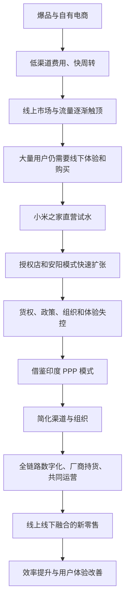

> 本章讲述小米怎样从纯电商走向线上线下融合的新零售。重点不是门店数量，而是渠道选择背后的用户需求、效率逻辑，以及小米如何经过直营试水、授权扩张受挫和海外模式借鉴，逐步建立扁平、数字化、合作共营的小米之家体系。

---

## 一、本章主线

第十章介绍了小米高效率模型，第十一章进一步回答：**高品质、价格厚道的产品，最终怎样以足够低的成本和良好体验交到用户手中？**

小米的渠道演进大致经历了五个阶段：

1. 创业早期依靠爆品和自有电商，形成极短交付链路；
2. 线上流量红利减弱，竞争者通过线下渠道扩大市场；
3. 小米之家从售后服务点转为零售门店，验证线下可行性；
4. 安阳模式快速扩张后暴露货权、组织和管理问题；
5. 吸收印度 PPP 模式经验，重建扁平、数字化的新零售体系。

本章最重要的认识是：**线上和线下不是价值立场，而是服务用户的不同方式。真正应该坚持的不是某种渠道形态，而是效率与体验。**

---

## 二、小米模式与零售的关系

### 2.1 小米模式有本质和具体形态两层

雷军区分了两种“小米模式”：

- **本质层**：以高效率创造用户价值；
- **业务层**：硬件、互联网服务、新零售和用户关系组成的具体模型。

本质相对稳定，具体形态需要随市场和用户变化。早期电商是当时最有效的渠道，不代表小米必须永远只做电商。

### 2.2 为什么零售是效率革命的最后一环

技术、产品和制造解决“做出好产品”，零售解决“把产品交给用户”。如果渠道层级多、库存慢、信息失真，即使制造效率很高，终端价格和体验仍会变差。

零售环节同时影响：

- 用户能否看见和理解产品；
- 用户能否体验、购买和获得服务；
- 商品从工厂到用户要经过多少层；
- 库存和资金周转速度；
- 厂商能否直接获得销售与需求数据；
- 渠道伙伴能否得到合理、可持续的回报。

因此，小米之家不是电商之外的补充店面，而是小米效率模型在线下的完整推导。

---

## 三、从电商走向新零售

### 3.1 小米为什么最初坚持电商

雷军长期是坚定的“电商派”。当小米拥有产品关注度和用户流量时，自有电商可以用很短的链路完成销售：

- 用户直接向小米下单；
- 商品不经过多层代理；
- 需求数据即时进入公司；
- 渠道库存较少；
- 除仓储和物流外，不必承担高额渠道加价；
- 公司直接掌握用户关系与售后反馈。

对早期小米而言，这种渠道与爆品高度匹配。产品力和性价比带来大量关注，用户主动排队购买，媒体也愿意报道，因此获客和渠道成本都很低。

### 3.2 爆品是纯电商模型的基础

自有电商不是建一个网站就会有效。它需要用户主动访问，而主动访问来自强产品力和口碑。

爆品带来的作用包括：

- 用户主动搜索和传播；
- 媒体愿意报道；
- 电商不必持续购买昂贵流量；
- 运营商和渠道愿意主动合作；
- 订单集中，库存和资金周转更快。

当企业无法持续产出爆品，自有电商的自然流量就会减弱，渠道模型也会承受压力。

### 3.3 电商让用户与小米同时受益

对用户而言，多层渠道费用减少，产品价格更接近制造、研发和服务成本。

对小米而言，渠道建设和库存成本较低，资金回笼快，还能直接获得订单和用户反馈。

2011 至 2014 年，这套组合帮助小米快速成为中国手机市场第一。但一种模式在特定阶段成功，不代表外部条件不会改变。

---

## 四、纯电商模型遇到的外部变化

### 4.1 线上零售进入阶段性平衡

经过十多年快速发展，电商对线下零售的替代速度开始放缓。线上和线下逐渐形成互补，而不是线上无限制取代线下。

电商巨头开始投资线下，本身就是一个信号：

- 容易转移到线上的用户已经大量完成迁移；
- 新增线上流量越来越贵；
- 线下仍拥有庞大用户、场景和服务价值；
- 线上企业需要寻找新的流量和体验入口。

小米网成长为中国主要电商平台之一后，也开始感受到流量增长上限。

### 4.2 社交媒体的流量结构发生变化

小米创业早期，微博等平台聚集大量一、二线城市科技用户和公共话题，小米很容易直接接触目标用户。

后来平台用户和内容中心发生变化，娱乐流量、明星和网红内容比重提高。平台仍然重要，但不再天然为消费电子新品提供大量低成本流量。

这说明企业不能把某个外部平台的早期红利当成永久能力。用户在哪里、平台规则怎样变化，都需要持续观察。

### 4.3 竞争者从线下侧翼进攻

原来在线上落后于小米的厂商，开始集中建设运营商和线下渠道：

- 运营商渠道向更多公开市场品牌开放；
- 线下厂商通过较高产品毛利吸引经销商；
- 大量门店深入三线以下城市；
- 有通信设备和渠道基础的厂商承接了中高端市场与既有渠道；
- 面向小米的子品牌在线上同步竞争。

竞争不再只是同一电商平台上的产品比较，而是产品、渠道、品牌、供应链和服务体系的全面对抗。

---

## 五、纯电商模型遇到的内部瓶颈

### 5.1 爆品供给不再稳定

小米渠道效率高度依赖爆品。当公司进入低谷、产品和交付能力出现问题时，自然关注和购买流量下降，自有电商也难以维持原有增长。

这再次说明：渠道不能弥补产品，渠道效率也不能脱离爆品能力单独存在。

### 5.2 中国市场和用户习惯并不均一

一、二线城市的科技用户熟悉参数、网购和线上评价；更广泛的下沉市场则存在不同需求：

- 用户希望亲手体验产品；
- 对参数不熟悉，需要导购解释；
- 更信任本地门店和熟人推荐；
- 即时购买、安装和售后更重要；
- 线上信息难以完整呈现材质、尺寸和场景体验。

电商擅长“卖图片和参数”，却无法完全替代触摸、演示和面对面服务。

### 5.3 严格闭环带来流量焦虑

小米网既是品牌自有渠道，也与大型综合电商平台争夺用户时间。随着流量集中到少数大型平台，单一品牌电商获取新用户越来越难。

小米从 2013 至 2015 年陆续进入天猫、京东，说明严格闭环早已开始打开。渠道选择应服务覆盖和效率，而不是为了形式上的“全部自有”。

---

## 六、没有选择的重大选择

### 6.1 为什么线下一度成为“信仰问题”

一些小米员工把纯电商看作小米模式的根本，担心进入线下意味着增加中间环节、提高价格和背离互联网精神。

这种担心有合理性：传统线下渠道确实可能依赖层层加价、压货和信息不透明。但它把一种历史上有效的实现方式误当成了不可改变的原则。

小米真正应坚持的是：

- 价格厚道；
- 渠道高效；
- 直接理解用户；
- 库存和信息透明；
- 合作伙伴获得合理回报。

只要这些原则不变，线上或线下都可以成为小米模式的载体。

### 6.2 为什么手机行业很难“小而美”

手机是高度标准化、技术密集且规模要求很高的产业。若规模太小：

- 无法长期支撑巨额研发；
- 很难获得关键供应商优先支持；
- 固定成本无法充分分摊；
- 品牌、售后和系统服务难以持续；
- 技术换代时抗风险能力弱。

对某些定制、艺术或专业品类，小而美可以成立；对智能手机，规模是技术与供应链能力的重要基础。

### 6.3 线上份额决定了增长上限

原书记载，当时电商约占手机零售总量的三成。即使小米在线上拥有很高份额，放到整个市场中仍然有限。

若公司只等待所有用户改变购买习惯，就会主动放弃大量线下需求。要服务更广泛用户，小米必须到用户已经存在的地方去。

### 6.4 真正难题不是要不要线下

现实已经使“进入线下”几乎没有选择。真正需要解决的是：

> 怎样让线下零售保持接近电商的效率，同时提供线上无法完成的体验？

这要求重新设计货权、渠道层级、数字系统、门店商品组合、合作关系和组织责任，而不是简单加入传统代理体系。

---

## 七、起步前的三项重新认识

### 7.1 不能因为焦虑而否定电商

线上增速放缓不表示电商会倒退。笔记本等品类已经证明，电商仍可能占据很高比例。

小米需要增加线下，不是放弃线上，而是建立线上线下相互补充的完整渠道。

### 7.2 必须承认线下创造的真实价值

线下门店可以：

- 展示材质、设计和实际尺寸；
- 让用户体验复杂硬件；
- 提供导购、安装和即时服务；
- 建立品牌形象和本地信任；
- 覆盖不习惯线上购物的人群；
- 成为社区活动和售后的场所。

认为线下只是落后和低效，是脱离用户现实的“互联网傲慢”。

### 7.3 线下早已有小米需求

纯电商时期，市场上已经存在“野生”小米渠道：商家从运营商或黄牛手中找货，再卖给主动询问小米的用户。

这说明：

1. 线下存在明确的小米用户；
2. 用户有在线下购买和体验的需求；
3. 小米品牌和爆品也能为渠道带来客流。

非官方渠道同时带来加价、刷机、预装、假货和售后风险，进一步说明官方线下体系具有保护用户的必要性。

### 7.4 线下流量不一定比线上昂贵

随着线上流量集中和价格上涨，线下商场、门店和本地关系的获客成本可能反而更低。

渠道效率不能按“线上先进、线下落后”预设，而要比较完整成本、转化、复购和服务价值。

### 7.5 Costco 提供的信心

Costco 是纯线下零售，却能长期保持较低费用率和高运营效率。这说明互联网思维不取决于是否在线，而取决于：

- 商品是否精选；
- 流程是否简洁；
- 库存是否快速周转；
- 价格是否透明；
- 用户关系是否长期；
- 组织是否数据驱动。

小米因此相信，线下同样可以实现“电商效率”。

---

## 八、小米之家从售后走向零售

### 8.1 小米之家最初是服务网点

小米之家诞生于 2011 年，最初负责线下维修养护、用户活动和新品展示，不销售商品，很多门店甚至位于写字楼。

到 2015 年，小米在多个城市拥有 24 家官方店，承担约四成线下服务工单，另有两百多家授权服务店。

这支团队直接接触用户、理解服务和门店运营，因此成为小米试水零售的自然起点。

### 8.2 小米 Note 首发提供了早期信号

2015 年小米 Note 首发时，小米之家临时承担销售，有米粉提前到门口扎帐篷等待。

这次试验说明：

- 用户愿意到线下购买小米；
- 门店能承接新品发布流量；
- 服务网点已有品牌信任；
- 直营团队可以学习销售。
> **原书图示**：小米 Note 首发时米粉在小米之家门口等待
### 8.3 南京调研看到的渠道风险

2015 年，小米之家团队到南京溧水调研，发现友商门店密集，小米几乎没有正规份额。部分渠道还存在：

- 传播小米质量差等负面信息；
- 收购手机后刷机并预装来源不明的应用；
- 销售假货；
- 利用用户对品牌的点名需求进行加价。

渠道空白不只是少卖产品，还会让用户在非官方体系中遭受损害，并把问题归因于小米品牌。

---

## 九、直营门店初战告捷

### 9.1 第一家零售门店为什么选在普通位置

2015 年 9 月，小米在北京当代商城六楼开设第一家小米之家零售店。位置并不理想，周围主要是服装柜面。

小米没有等待完美旗舰店，而是用较低成本快速开始，验证真正未知的问题。

### 9.2 开店后才发现的具体问题

团队需要重新学习：

- 动线怎样让用户自然走遍门店；
- 商品怎样摆放和组合；
- 电商使用的牛皮纸包装是否适合货架展示；
- 怎样把商场和线上用户引到六楼；
- 商场外立面广告应怎样设计；
- 导购怎样解释产品而不进行高压推销；
- 门店怎样处理库存、结算和服务。

这些问题无法完全通过会议推演，必须在真实门店中观察和改进。

### 9.3 两家门店验证线下可行性

第一家门店经过数月试水，月销售额达到数百万元，并为商场六楼带来大量客流。

第二年开设的北京五彩城店位置同样不算优越，团队不到十人，稳定后月销售额达到较高水平，并对购物中心整体销售产生显著贡献。

两家店基本实现盈亏平衡，随着生态链产品增加，盈利能力继续改善。小米由此先回答了“能不能开线下店”。

### 9.4 挑战接近电商的费用率

雷军要求线下店尝试挑战约 5% 的费用率。团队主要优化三个变量：

- 进店客流；
- 购买转化；
- 客单价。

在多个城市和门店试验中，部分地区接近这一目标。这里的重点不是所有门店永远保持同一个数字，而是用明确效率目标倒逼选址、人员、商品和运营设计。

费用率过低也可能损害服务和员工，需要同时观察用户体验、人员负荷、门店质量和长期经营。

### 9.5 购物中心成为重要形态

团队逐步确认，消费电子进入购物中心有明显优势：

- 用户可以在生活场景中自然体验产品；
- 商场本身提供稳定客流；
- 丰富品类提高门店吸引力；
- 科技门店能增强商场内容；
- 品牌体验比通信街更完整。

2017 年，小米在深圳万象天地开设两层、六百多平方米的全球旗舰店，并成为商圈的重要流量入口。
> **原书图示**：深圳万象天地小米之家全球旗舰店
旗舰店承担品牌和体验作用，不能简单用普通销售门店的短期收益评价；同时也要防止把昂贵装修误当成高端体验。

---

## 十、先学习传统渠道，再谈改造

### 10.1 不合理现象背后可能有现实原因

雷军调研时发现，某县一条通信街上近二十家友商门店属于同一老板。对方不仅靠卖手机，还获得运营商、品牌方的装修、促销和业务返点。

这种现象说明：

- 本地渠道商拥有长期积累的门店和关系资源；
- 手机销售只是多种收益的一部分；
- 门店数量未必由单店零售需求决定；
- 厂商补贴和运营商政策塑造了渠道结构。

互联网企业若只从表面判断“这么多店一定低效”，就无法理解合作伙伴为何这样经营。

### 10.2 小米为什么坚持“真零售”

小米希望渠道收益来自真实商品与服务，而不是主要依靠补贴、返点、压货或信息差。

“真零售”的目标是：

- 用户愿意购买；
- 门店通过真实运营获得回报；
- 厂商不把库存风险强行推给渠道；
- 数据反映真实终端交易；
- 各方收益不以损害用户为代价。

先理解旧模式的形成原因，再保留合理部分、改变低效部分，比带着优越感直接推翻更可靠。

### 10.3 新零售的“新”是什么

“新”不等于线下、线上、无人店或更炫的技术。它指的是：

- 渠道层级更少；
- 信息更透明；
- 数据更实时；
- 库存和资金周转更快；
- 线上线下统一管理；
- 用户体验更完整；
- 厂商与渠道从博弈转向合作。

新零售的本质仍然是零售，只是通过互联网思维和数字技术提高效率。

---

## 十一、从直营走向授权合作

### 11.1 为什么不能只靠自建门店

中国市场地域广、城市层级多，竞争者拥有数以十万计的门店。若全部由小米投资建设：

- 资本和管理压力巨大；
- 本地选址、人员和关系能力不足；
- 扩张速度难以覆盖需求；
- 总部很难理解每个区域细节。

小米需要借助本地合作伙伴，同时保持效率、品牌和数据标准。

### 11.2 传统渠道商为什么拒绝

2016 年，小米尝试加盟授权。习惯较高利润空间的渠道商认为小米约 5% 的费用目标无法支撑经营，几乎全部拒绝。

这不是渠道商一定贪婪，而是他们原有门店、人员、激励和库存模型建立在较高单品毛利上。要接受低毛利模式，必须同时改变费用、商品组合、周转和运营方式。

### 11.3 售后服务商成为早期伙伴

小米转向长期合作的售后服务商。他们更理解小米模式，也希望扩展零售业务。合同以较低费用率为基础，再通过奖励增加合理空间。

试点成功后，到 2017 年底授权店扩展到三百多家，覆盖二十多个省份。

早期伙伴的价值不只是愿意接受条件，还在于双方已有信任和共同语言。

---

## 十二、安阳模式：快速扩张后的教训

### 12.1 为什么选择河南试点

河南人口多、用户基础较好，传统渠道集中度相对较低，距离北京较近，适合集中进行县镇下沉试验。

团队以安阳为中心快速拓展“小米小店”，建设在线订货系统，短期内门店和市场份额明显上升。

### 12.2 试点为什么被过早复制

局部数据增长让团队迅速把“安阳模式”推广到全国，但试点时间不足，没有验证：

- 不同区域是否同样适用；
- 系统能否支撑大规模门店；
- 合作伙伴是否具备经营能力；
- 品牌、货品和价格怎样统一管理；
- 多个内部渠道团队怎样协调；
- 市场波动时库存和利益如何处理。

局部成功只证明模式在特定条件下可能有效，不等于已经具备全国复制能力。

### 12.3 问题一：货权交给渠道，管理能力不足

授权店取得商品所有权后，厂商难以实时控制陈列、价格和销售策略。小米当时又缺少强系统与组织，渠道一旦追求自身短期收益，品牌要求很容易落空。

### 12.4 问题二：鼓励米粉开店却缺少支持

“小米小店”鼓励有热情的米粉创业，初衷是引入没有传统渠道负担的新经营者。

问题在于：

- 零售需要选址、库存、人员和现金流经验；
- 新经营者缺少专业培训；
- 总部系统和运营支持不足；
- 热情无法替代持续经营能力；
- 失败成本由个人创业者承担。

鼓励用户创业却不给足能力和风险保障，是严重错误。少数成功者不能证明整体模式合理。

### 12.5 问题三：内部组织各自为战

小米之家、区域分公司、运营商和大客户等团队分别接触渠道，却没有统一政策和区域负责人。

结果包括：

- 同一渠道商利用不同政策套利；
- 各团队争夺销量和资源；
- 无人对一个区域整体结果负责；
- 用户体验和价格不一致；
- 总部难以判断真实问题。

数字化系统不能弥补权责不清。组织和数据必须同时统一。

### 12.6 问题四：渠道利益与用户利益不一致

低毛利的小米产品对部分渠道吸引力不足，导购更愿意推荐提成高的竞品；甚至挂着小米门头，也不积极陈列小米商品。

串货、飞货还扰乱电商和海外市场。小米再次面对一个根本问题：若渠道只能通过销售高毛利产品获利，它就没有动力帮助用户选择高性价比产品。

### 12.7 安阳模式的核心教训

> **扩张速度不能超过系统、组织和伙伴能力的建设速度。**

试点成功后，应先验证模式是否稳定、风险能否管理、能力能否复制，再决定全国推广。快速复制不完整模式，只会把局部缺陷放大成全国问题。

---

## 十三、印度 PPP 模式的启发

### 13.1 PPP 模式是什么

PPP 是“首选合作伙伴计划”。小米印度团队把城市划分为网格，在每个主要手机销售区域只选择一家认同小米模式的合作伙伴，并统一：

- 门店形象；
- 品牌展示；
- 商品与销售策略；
- 运营标准；
- 双方合作边界。

合作伙伴获得一定区域内的稳定客流和经营空间，小米则获得更可控的品牌、数据和服务体验。

### 13.2 为什么“少选伙伴”反而可能更有效

与大量无差别拓店相比，每个网格选择少量高认同伙伴，可以：

- 提高单店客流和收益；
- 减少渠道之间恶性竞争；
- 让伙伴愿意投入门店和服务；
- 便于小米培训、管理和支持；
- 建立长期合作而非一次进货关系。

独家合作也有风险，可能削弱竞争和覆盖，需要设置业绩、服务和退出条件。

### 13.3 海外经验为什么能反向帮助中国业务

印度团队在当地约束下独立探索，形成了比当时中国模式更清晰的合作路径。随后印尼等市场继续本地化演进。

这说明全球化组织不应只把总部模式向外复制。海外市场也可以成为创新试验场，成熟经验再反向输入总部。

### 13.4 本地化仍然不可省略

PPP 在印度有效，与当地市场结构、小米用户基础和渠道特点有关。中国市场的区域差异、运营商体系和竞争结构不同，不能原样照搬，只能借鉴：

- 网格化管理；
- 精选合作伙伴；
- 统一品牌与运营；
- 用稳定客流换取长期投入；
- 从交易转向共同经营。

---

## 十四、2020 年重启中国区线下变革

### 14.1 三个“简化”

经历 2018 年挫折并吸收 PPP 经验后，小米在 2020 年重启线下改革，核心是：

- 简化业务模型；
- 简化组织；
- 简化业务动作。

复杂模型给套利、冲突和失真留下空间。简化不是减少必要能力，而是让每个角色、政策和流程更清楚。

### 14.2 全品类、全店模式

小米不再走层层分销和层层分利，而是建设统一品牌店，展示手机与生态产品。

丰富品类可以：

- 增加进店和复购频率；
- 摊薄门店租金和人员成本；
- 让用户体验智能生活场景；
- 为低频手机业务补充高频商品；
- 提高客单价和门店经营稳定性。

全品类不能变成无边界杂货铺。商品必须符合品牌、质量和智能生活方向。

### 14.3 从十四种渠道归并为三种

小米将原来复杂的渠道归并为：

1. 直营店；
2. 授权店；
3. 运营商渠道。

渠道减少后，政策、价格、库存和责任更容易统一，也降低内部团队之间的冲突。

### 14.4 强化省级市场责任

省分公司统一管理区域内各类渠道，并对总体结果负责。这解决了过去“每个团队负责一段，却没有人负责全局”的问题。

区域负责人需要同时关注：

- 销量和市场份额；
- 门店质量和伙伴收益；
- 库存与周转；
- 用户体验和售后；
- 品牌、价格和政策一致性。

### 14.5 县域覆盖与“养店”

原书记载，2021 年小米之家覆盖全国县域，门店总数超过一万家。

门店数量只是“开店”结果，下一阶段更重要的是“养店”：

- 单店是否健康；
- 伙伴是否获得合理回报；
- 店员是否专业稳定；
- 库存是否匹配本地需求；
- 用户体验是否一致；
- 门店是否真正服务智能生活场景。

覆盖率不能代替经营质量。高速开店后更需要防止低效门店和伙伴亏损。

---

## 十五、小米之家与传统线下模式的区别

### 15.1 传统模式 A：多层代理

原书描述的第一类模式中，厂商和用户之间存在省级代理、地区代理和多层零售商，中间费用较高。
> **原书图示**：传统线下渠道模式 A
其主要问题是：

- 每层都需要利润；
- 厂商与终端用户距离远；
- 销售和库存数据层层延迟；
- 价格和品牌体验难以统一；
- 厂商主要管理代理，难以直接运营零售。

代理层并非都没有价值。它们可能提供资金、仓储、物流和本地关系。要判断的是这些价值是否值得相应成本，以及能否用更高效方式完成。

### 15.2 传统模式 B：厂商介入更深

第二类模式仍有全国、省级代理和零售商，但厂商承担更多零售业务，代理主要提供资金和物流平台。
> **原书图示**：传统线下渠道模式 B
这种方式比纯多层分销更可控，终端数据仍可能存在延迟，渠道费用也较高。

### 15.3 小米之家模式 C：只有一层零售伙伴

小米与用户之间主要保留一层零售商，不设全国和省级代理。
> **原书图示**：小米之家线下渠道模式 C
角色分工是：

- 小米负责品牌、商品、系统、管理和主要业务运营；
- 零售伙伴投入门店、本地资源并共同经营；
- 交易、库存和用户数据实时进入统一系统；
- 双方通过提高门店效率获得回报。

原书给出的渠道费用比例是特定时期、特定统计口径下的经验数据，适合说明结构差异，不应当作所有门店和品牌永久不变的行业数字。

### 15.4 “交易即数据”

商品成交时，价格、门店、库存和时间等信息直接进入系统，不再等待代理层层报表。

实时数据可以帮助：

- 调整门店商品组合；
- 预测补货；
- 发现滞销和缺货；
- 比较不同区域需求；
- 计算真实周转和伙伴收益；
- 快速发现异常交易。

数据真实比数据数量更重要。若门店为了指标虚报、拆单或引导错误交易，再先进的系统也会产生错误决策。

---

## 十六、不是博弈，而是合作

### 16.1 货物属于谁为什么重要

在传统分销中，厂商把商品卖给代理和渠道后，提前收到资金，库存和销售风险则转给渠道。渠道获得货权后，会优先处置对自己最有利的商品。

在小米之家核心模式中，货物主要由小米持有，渠道伙伴以门店、本地资源和押金等方式参与经营。

货权安排影响双方目标：

- 厂商持货，就要对库存和终端销售负责；
- 渠道不必承担过高压货风险；
- 双方更愿意共同提高真实销售和周转；
- 厂商能实时调整商品与价格；
- 渠道难以通过囤货、串货获利。

### 16.2 传统压货模式的问题

压货能让厂商提前确认收入和回收资金，渠道则通过返点和价差获得收益。但它可能造成：

- 终端没有真实需求，库存却不断增加；
- 厂商看到的是出厂数据，不是真实用户销售；
- 渠道为清库存而降价、串货或强推；
- 用户承担更高加价；
- 市场变化时风险集中爆发。

“卖给渠道”不等于“卖给用户”。以终端真实交易为经营依据，才能减少虚假繁荣。

### 16.3 合作不是让渠道少赚钱

小米不希望渠道靠单笔高加价获利，而是通过低费用、快周转和稳定客流获得长期回报。

合作关系要求小米也承担责任：

- 提供有竞争力的产品；
- 保证合理商品供给；
- 建设系统和培训；
- 帮助门店提高运营；
- 不随意改变政策；
- 在每单收益有限时，让渠道伙伴优先获得合理回报。

若厂商只用“高效率”要求渠道接受低收益，却没有提供流量、系统和周转能力，合作仍然无法持续。

### 16.4 厂商持货的风险

厂商掌握货权也意味着：

- 承担更大库存和跌价风险；
- 需要更强预测和资金能力；
- 总部决策错误会影响全部门店；
- 系统中断会波及整个网络；
- 过度统一可能忽略本地差异。

这一模式不是免费获得控制力，而是把渠道风险重新收回厂商，要求更高的系统和运营能力。

---

## 十七、破除单品毛利率迷信

### 17.1 为什么渠道认为“卖小米不赚钱”

传统渠道习惯较高单品毛利和促销提成，而小米希望把总体渠道费用控制在较低水平。从单台手机看，小米给导购和门店留下的利润明显较少。

若仍用原有高租金、高人员成本、慢库存的经营方式，低单品毛利当然无法生存。小米模式要求同时改变整个门店模型。

### 17.2 单品毛利不是最终经营结果

门店最终赚不赚钱，还取决于：

- 一年能卖出多少商品；
- 库存能周转多少次；
- 租金、人员和运营费用；
- 手机之外的商品组合；
- 客流、转化率和客单价；
- 滞销、折扣和资金占用；
- 售后与退货成本。

高毛利商品若一年卖得很少、库存长期占用资金，实际回报可能不高；低毛利商品若快速周转、费用低，全年回报仍可能可观。

### 17.3 高提成为什么可能伤害用户

传统门店按单品提成激励导购，导购会优先推荐佣金高的产品，而不是最适合用户的产品。用户不懂参数时，信息优势更容易被利用。

门店激励应兼顾：

- 用户满意和退货；
- 长期复购；
- 专业、真实介绍；
- 整体门店收益；
- 品牌与用户信任。

完全取消激励也未必合理，关键是不要让员工收入与误导用户绑定。

### 17.4 周转带来的实际结果

原书记载，2021 年中国区小米之家模式年周转达到 17 次，投资回报率约 30%。这些数字用于说明低单品利润与合理门店回报可以共存。

它们具有时间、门店范围和统计口径限制，不能保证每家店都达到相同水平。评估加盟或合作模式时，应查看单店分布、失败门店、伙伴现金流和长期数据，而不只看平均值。

### 17.5 为什么数字化是低毛利模式的前提

利润空间很薄时，库存、费用和异常稍有失控，就会吞掉全部收益。实时数据让厂商和伙伴能够：

- 看清每家店真实收入与费用；
- 及时调货和补货；
- 降低滞销库存；
- 发现单店问题；
- 计算伙伴真实回报；
- 持续优化商品和人员安排。

低毛利不是靠信念坚持，而要靠精细运营支撑。

---

## 十八、零售的本质：效率与体验

### 18.1 效率是手段

小米把零售效率理解为：用更少层级、更快信息、更低库存和更准确运营，把产品交到用户手中。

主要抓手包括：

- 全链路数字化；
- 线上线下统一商品和数据；
- 扁平渠道；
- 实时库存；
- 精准补货；
- 统一组织责任；
- 多品类提高门店使用效率。

### 18.2 体验是目的

门店不是为了证明线下效率，而是让用户更好地：

- 看见、触摸和试用产品；
- 理解产品之间怎样协同；
- 获得专业、诚实的建议；
- 方便购买、提货和售后；
- 感受品牌设计和服务；
- 在真实场景中理解科技价值。

效率若导致门店人员不足、体验仓促和售后下降，就偏离了目的。

### 18.3 “多一分浪费，少一分不完整”

这句话表达了效率与体验之间的平衡：

- 多做一项用户不需要的活动，就是浪费；
- 少做一项保障完整体验的必要服务，就是缺失。

新零售不是一味削减，而是准确判断哪些投入创造用户价值。

---

## 十九、全链路数字化

### 19.1 数字化不只是管账

小米的“零售通”最初用于管理账目，后来逐步深入门店日常业务。最终目标是连接：

- 财务；
- 研发和产品；
- 生产；
- 仓储物流；
- 门店库存；
- 用户和售后；
- 合作伙伴运营。

当信息贯通后，销售变化可以更快影响生产和补货，用户反馈也可以进入产品和服务改善。

### 19.2 数据颗粒度为什么重要

只看全国销售总额，无法知道：

- 哪个地区缺货；
- 哪类门店商品组合不合理；
- 哪款产品只靠促销；
- 哪个伙伴回报不足；
- 哪些用户问题集中出现。

颗粒度足够细，才能定位问题；同时要避免过度收集用户数据。经营需要的数据应限定用途、保护隐私并控制访问。

### 19.3 从数据驱动走向智能运营

原书设想用大数据和人工智能建立运营控制平台，进行需求预测、商品调度和全产品生命周期管理。

智能算法可以辅助：

- 需求预测；
- 选址；
- 补货和调拨；
- 商品组合；
- 排班和服务；
- 异常识别。

算法不能代替一线观察和责任判断。历史数据可能延续地区偏差，突发市场变化也会让模型失效，需要人工复核和纠正机制。

---

## 二十、小米之家模式的五项优势

### 20.1 结构扁平

厂商与终端零售伙伴之间层级少，信息、商品和决策传递更快，层层加价和库存失真减少。

### 20.2 数据真实、实时

终端交易直接进入系统，经营者看到的更接近用户实际购买，而不是渠道进货。

### 20.3 线上线下融合

用户、商品、库存、流量和服务不再被渠道分割。用户可以在线了解、到店体验，也可以在不同渠道获得统一服务。

真正融合不只是价格相同，还包括会员、库存、售后、数据和体验一致。

### 20.4 更容易连接外部流量平台

数字化门店可以与地图、内容、电商、即时零售等平台灵活合作，增加用户触达和履约方式。

依赖外部平台仍会产生佣金、流量和规则风险，应保持用户关系和经营数据的自主性。

### 20.5 服务更容易标准化和产品化

统一商品、流程、培训和系统，有助于不同地区提供较一致的体验，也能支持品牌高端化。

标准化不能消灭本地差异。门店面积、品类、服务语言和活动仍需适应当地需求。

---

## 二十一、从低频手机到高频智能生活

手机购买频率低，仅靠手机很难支撑高密度门店。生态链和多品类使门店可以提供：

- 手机和配件；
- 可穿戴设备；
- 家庭网络；
- 智能家电；
- 清洁、照明和生活产品；
- 跨设备智能场景。

丰富品类提高用户到店和复购频率，也摊薄门店成本。更重要的是，线下场景能展示设备如何协同，帮助用户理解“智能生活”而不只是单件参数。

风险在于品类扩张过快会增加库存、质量和售后复杂度。多品类必须建立在统一标准和真实协同上。

---

## 二十二、新零售模式的适用条件和风险

### 22.1 适用条件

这种模式更适合：

- 品牌有较强产品力和用户需求；
- 商品可以标准化管理；
- 多品类能共享门店和用户；
- 厂商有资金承担库存；
- 交易数据可以实时进入系统；
- 总部有能力管理商品、价格和供应；
- 合作伙伴接受低毛利、快周转逻辑；
- 门店体验能创造线上没有的价值。

### 22.2 主要风险

- 门店扩张快于单店经营能力；
- 厂商持货造成库存和资金压力；
- 总部决策错误被全网放大；
- 数字系统故障影响所有门店；
- 过度统一忽略本地需求；
- 伙伴平均回报不错，但部分门店长期亏损；
- 低费用目标压缩员工和服务；
- 为增加频次引入与品牌无关的商品；
- 数据收集侵犯用户隐私；
- 线上线下内部争夺订单和业绩。

### 22.3 直营、授权和运营商各有作用

- **直营店**适合品牌标杆、模式试验和核心商圈；
- **授权店**借助本地资本和运营能力扩大覆盖；
- **运营商渠道**能服务合约、通信和特定用户需求。

渠道简化不表示只保留一种形态，而是让每种形态的角色、政策和责任清楚，并由统一目标协调。

---

## 二十三、本章方法论总结

### 23.1 渠道转型的完整步骤

1. 识别原渠道依赖的外部红利是否正在变化；
2. 区分不可改变的原则与可以改变的渠道形态；
3. 直接研究未被覆盖用户的购买和服务需求；
4. 承认传统渠道创造的合理价值，避免傲慢；
5. 用小规模直营店验证真实运营问题；
6. 把试点学习沉淀为商品、门店、数据和组织能力；
7. 引入伙伴前，先设计清楚收益、货权和责任；
8. 不在系统和组织未成熟时全国复制；
9. 统一渠道政策和区域责任；
10. 用实时终端交易而非进货量指导经营；
11. 同时评价用户体验、伙伴回报和公司效率；
12. 开店后从追求数量转向长期“养店”。

### 23.2 本章最重要的概念

| 概念 | 通俗理解 |
|---|---|
| 渠道选择 | 选择最适合用户、产品和阶段的交付方式，不是站队线上或线下 |
| 新零售 | 用数字化和扁平结构提高零售效率，同时改善线下体验 |
| 真零售 | 收益来自真实用户交易和服务，而非压货、补贴和信息差 |
| 交易即数据 | 终端成交实时进入系统，直接指导库存和运营 |
| 厂商持货 | 厂商承担库存并实时管理，伙伴共同运营门店 |
| PPP 模式 | 网格内精选认同模式的伙伴，进行统一、长期合作 |
| 全品类全店 | 用相关多品类提高门店频次并展示智能生活场景 |
| 破除毛利迷信 | 门店回报取决于利润、费用和周转的共同结果 |
| 养店 | 开店之后持续改善单店商品、人员、体验和伙伴收益 |

### 23.3 本章最重要的几个判断

- 电商是小米早期高效率的实现方式，不是不可改变的信仰；
- 线下门店只要创造真实体验，也可以比购买线上流量更高效；
- 门店数量增长不等于模式成熟；
- 低单品毛利不等于渠道伙伴不赚钱；
- 厂商与渠道目标一致，必须通过货权、数据和利益设计实现；
- 数字化与组织责任缺一不可；
- 新零售的效率是手段，用户体验才是目的。

### 23.4 事实与数据边界

原书中的线上比例、渠道费用、门店数量、周转和投资回报等数据，均来自特定年份和小米统计口径。市场、租金、产品结构和渠道政策变化后，数字会随之变化。

这些数字的主要价值是解释模式差异，不能直接用来预测任何一家门店的回报，也不构成加盟或投资承诺。

### 23.5 与前后章节的连接

- 第九章说明爆品怎样产生用户需求和渠道流量；
- 第十章说明分摊、流速和铁人三项的效率逻辑；
- 第十一章把高效率具体落实到线上线下交付；
- 第十二章将解释生态链怎样提供丰富的爆品组合，支撑小米之家和 AIoT 生态。

爆品、零售和生态链相互依赖：好产品带来门店流量，多品类提高门店频次，高效渠道又帮助更多产品以合理价格触达用户。

### 23.6 一页速记

> **早期选择**：爆品加自有电商，以短链路获得低成本和快周转。 
+> **变化信号**：线上流量红利减弱，线下需求仍大，竞争者依靠渠道扩张。 
+> **重大转变**：坚持效率原则，但放弃“只能做电商”的渠道教条。 
+> **直营试水**：小米之家从售后网点转为零售店，在真实门店中学习动线、展陈和运营。 
+> **安阳教训**：试点验证不足、货权失控、米粉开店支持不足、内部渠道各自为战。 
+> **PPP 启发**：网格内精选伙伴，以统一政策和稳定客流建立长期合作。 
+> **模式重建**：简化业务、组织和动作，将十四类渠道归并为三类。 
+> **核心结构**：厂商持货、一层零售伙伴、全链路数字化、交易即数据。 
+> **伙伴收益**：不依赖单品高毛利，而依靠低费用、快周转和丰富商品组合。 
+> **零售本质**：以极致效率实现极致用户体验。 
+> **核心教训**：不要忠于某种渠道形式，要忠于用户价值；模式扩张之前，必须先建好系统、组织和伙伴能力。
