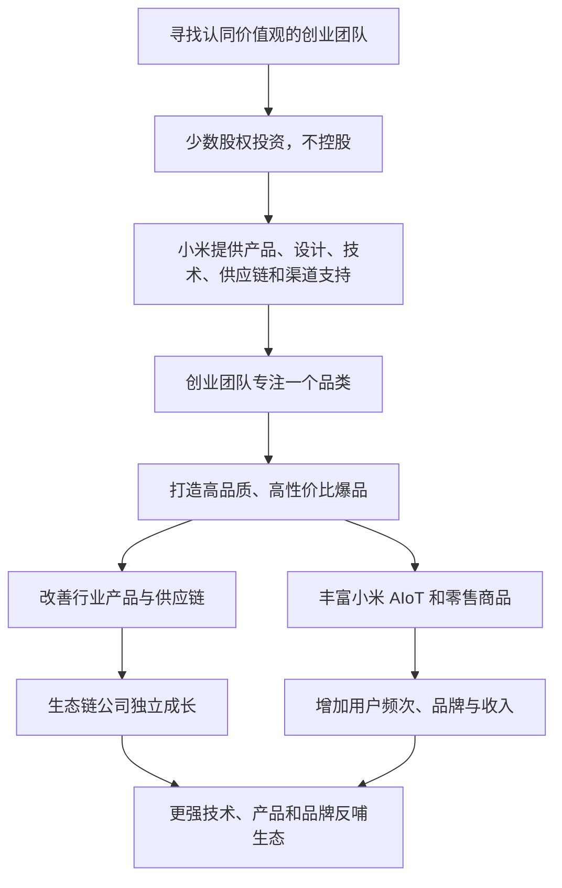

> 本章讲述小米如何通过“不控股的投资 + 全方位孵化”，与独立创业团队共同打造智能硬件和生活消费品。重点包括生态链的三项目的、六款代表性爆品的打造过程、小米的新质量观与设计观，以及生态链从广泛验证模式走向聚焦技术和爆品体系的 2.0 阶段。

---

## 一、本章主线

2014 年，小米正式启动生态链模式。它的基本做法是：

- 寻找认同小米价值观和方法论的创业者；
- 以少数股权投资建立长期关系，但不控股；
- 在产品定义、设计、研发、供应链、品牌和销售等方面提供支持；
- 由创业团队保持独立经营和专业专注；
- 共同打造高品质、高性价比的爆品；
- 鼓励生态链公司建立自己的品牌和长期能力。

生态链并不是小米建立大量子公司，也不是简单贴牌采购，而是希望在小米与独立创业公司之间形成一种“能力共享、各自成长”的长期关系。

---

## 二、生态链模式是什么

### 2.1 “投资 + 孵化”分别解决什么问题

**投资**建立长期利益关系，让小米愿意持续帮助创业团队，也分享企业成长的收益。

**孵化**解决创业公司早期最缺乏的能力：

- 产品应该怎样定义；
- 设计和体验怎样达到统一标准；
- 技术方案怎样选择；
- 怎样找到合适供应商；
- 怎样控制质量与成本；
- 怎样获得第一批用户；
- 怎样进入电商和线下渠道。

只投资不给能力，生态链会变成财务投资组合；只提供渠道不分享长期利益，又容易形成短期供应关系。

### 2.2 为什么坚持不控股

小米的原则是“投资不控股，帮忙不添乱”。不控股主要希望：

- 创始人保持主人意识和决策动力；
- 团队专注自己的品类和长期公司价值；
- 避免小米庞大组织直接管理所有业务；
- 让生态链公司能够建立独立品牌和能力；
- 创业成功的收益主要归属于创业团队。

不控股不等于小米完全没有影响力。小米品牌、渠道、投资和产品审核仍可能带来很强的话语权，因此双方需要把决策权、品牌责任、数据和利益边界写清楚。

### 2.3 生态链公司不是小米子公司

生态链公司是独立经营实体，与小米是合作和投资关系。它们可能：

- 为小米或米家品牌开发产品；
- 同时经营自己的品牌；
- 与其他客户合作；
- 在某些领域与其他生态链公司甚至小米产品竞争；
- 独立融资、上市或调整业务。

判断生态链是否成功，不应只看小米卖了多少商品，还要看合作公司是否建立独立生存和发展的能力。

---

## 三、小米为什么做生态链

原书给出三个主要目的：

1. 把小米模式带到更多行业，推动中国制造升级；
2. 为 AIoT 提前布局足够丰富的智能设备；
3. 为小米电商和新零售引流、建立品牌，并贡献合理收入。

三项目标分别对应产业、技术生态和商业模式。

---

## 四、目的之一：改变一百个行业的面貌

### 4.1 从开放方法到共同实践

小米早期愿意向制造企业介绍自己的方法，却发现许多企业认为小米模式只适合手机，或者缺少能力亲自应用。

生态链将方法传播进一步变成共同实践：小米不只讲理念，还与创业团队一起定义产品、解决制造问题并承担市场检验。

### 4.2 为什么选择创业团队

成熟企业拥有供应链、客户和组织优势，但也可能受到旧产品、旧渠道和既有利润的限制。创业团队更容易：

- 从用户问题重新定义产品；
- 放弃旧行业惯例；
- 集中全部资源做一个品类；
- 接受低利润、海量、长周期的爆品方式；
- 快速使用新技术和新渠道。

创业团队的短板是缺少硬件、供应链和品牌经验，恰好可以由小米能力平台补充。

### 4.3 插线板怎样影响整个行业

第一代小米插线板把高安全标准、USB 接口、极简外观和合理价格放在一起，迅速形成爆品。随后，多个行业厂商改进外观、接口和内部结构。

生态链的产业价值不只是一款商品卖得多，而是通过明确的新标准迫使行业整体升级。竞争者跟进并不必然是坏事；若更多消费者因此获得更好产品，正符合小米推动制造业进步的初衷。

### 4.4 生态链公司的成长

原书记载，生态链中已有百余家硬件公司，并产生华米、云米、石头科技和九号机器人等上市企业。

这些结果说明小米能够帮助创业团队快速进入市场，但上市和估值只是阶段性结果。更应长期观察：

- 产品是否仍有口碑；
- 公司能否独立研发和获客；
- 是否过度依赖小米订单；
- 创始团队和治理是否健康；
- 是否真正推动所在行业进步。

---

## 五、目的之二：成为 AIoT 的先遣队

### 5.1 从个人计算机到万物互联

雷军把互联网发展概括为三个阶段：

- 个人计算机互联网：电脑成为主要终端；
- 移动互联网：手机成为个人计算中心；
- AIoT：大量日常设备能够连接、感知和协同。

小米在 2013 年判断智能生活即将发展，但市场上成熟智能设备和团队还很少。只有手机和平台，没有足够设备，IoT 生态无法形成。

### 5.2 为什么小米不能自己做所有设备

智能生活涉及耳机、手环、电视、路由器、家电、照明、清洁等大量品类。若小米内部逐一组建团队：

- 手机核心业务会被分散；
- 每个品类都难以获得足够专注；
- 组织管理复杂度急剧上升；
- 进入市场速度太慢；
- 难以吸引每个行业最优秀的创业者。

生态链通过“每家公司专注一件事、小米共享能力”的方式，在保持专注的同时获得品类广度。

### 5.3 快速布局不是粗糙铺货

多家公司并行探索，确实能提高布局速度，但每家公司仍应使用专注、极致、口碑、快的方法打造产品。

生态扩张若只追求设备和 SKU 数量，就会变成贴牌杂货铺。速度必须建立在产品定义、质量和统一体验上。

### 5.4 “1 + 4 + X”策略

原书介绍的早期策略是：

- **1 个核心**：智能手机，并包含平板和可穿戴设备；
- **4 个关键节点**：电视、路由器、智能音箱、笔记本电脑；
- **X 类广泛设备**：由生态链公司和其他伙伴完成。

小米把最影响生态入口和体验的设备掌握在核心范围，将品类广、专业差异大的设备交给伙伴。

这是一种边界设计：平台公司不是什么都做，而是确定哪些必须自己负责，哪些适合开放合作。

### 5.5 顺为与生态链团队的互补

顺为投资帮助完成创业团队寻找、尽职调查、财务评估、投资协议和投后治理；小米生态链团队则由工程师、产品经理和设计师组成，重点评估产品、技术、设计和供应链。

两类能力互补：

| 能力 | 主要关注 |
|---|---|
| 投资与治理 | 团队、股权、财务、风险和长期公司发展 |
| 产品与工程 | 用户需求、产品定义、技术、质量、设计和量产 |

只懂投资可能看不懂产品，只懂产品也可能忽略公司治理和资本风险。

---

## 六、目的之三：引流、树品牌，顺便赚点钱

### 6.1 手机消费频率太低

手机虽然重要，用户过去一年甚至更长时间才买一次，后来换机周期进一步延长。只靠手机，小米商城和小米之家难以维持高频访问与购买。

生态链产品可以覆盖每天、每周和每月出现的生活需求，使用户更频繁接触小米渠道。

### 6.2 用产品组合维持零售效率

小米早期希望持续推出新的爆品，让不同用户因为耳机、移动电源、手环、家电和生活产品进入商城。

多品类带来的价值包括：

- 增加访问和购买频率；
- 摊薄电商和门店固定成本；
- 提高仓储、物流和会员体系利用率；
- 让手机带来的流量不被浪费；
- 为新产品提供低成本首发渠道。

品类增加也会带来库存、质量和售后复杂度，必须由统一标准和真实需求约束。

### 6.3 生态链怎样建立小米品牌

当多个品类持续呈现高品质、高颜值和高性价比，用户会把这些特征归纳为对小米平台的整体认识：不知道选什么品牌时，可以先看小米。

这种信任能降低新产品获客成本，也意味着一款生态产品出现质量或定价问题，会伤害整个品牌。

### 6.4 “顺便赚钱”表达什么

生态链产品坚持价格厚道，单品利润有限，但市场品类足够宽、销量和周转足够高，仍可贡献收入和利润。

“顺便”不是利润不重要，而是强调优先级：先创造用户价值、完善生态和建立品牌，再以高效率获得合理回报。

原书记载，2021 年小米 IoT 与生活消费品收入达到 850 亿元，占集团总收入 25.9%。这是特定年度的业务规模，不代表所有生态链产品都盈利，也不能替代分品类的经营质量分析。

### 6.5 生态链是小米模式的放大器

生态链把小米产品方法从手机带到多个行业，也为 AIoT、商城和小米之家提供商品。它同时验证：

- 爆品方法能否跨品类；
- 价格厚道能否与合理利润共存；
- 小米能力能否帮助独立团队成长；
- 用户信任能否跨品类迁移。

接下来的六个案例，展示这些原则怎样变成具体产品。

---

## 七、小米移动电源：奔向唯一最优解

### 7.1 机会来自明确需求与糟糕供给

智能手机快速增长，但续航不足，移动电源需求旺盛。市场上的产品却常见：

- 价格高；
- 电芯和保护不可靠；
- 外观粗糙；
- 品质难以判断。

小米最初想推荐现有产品，找不到合适选择后，才通过紫米科技进入这一品类。

### 7.2 为什么不做高低两条产品线

紫米最初考虑：进口电芯版本卖 99 元，国产电芯版本卖 69 元。小米认为，创业团队不应把资源分散在两个各有妥协的方案上，而应集中做一个最优产品：使用更高标准电芯，同时努力把价格做到 69 元。

这体现了爆品原则：

- 不用低品质版本迎合低价；
- 不因高品质就接受高售价；
- 把“好”和“便宜”的冲突交给工程与规模解决；
- 用一个清楚产品建立品类认知。

### 7.3 安全保护为什么不能省

小米移动电源使用高质量电芯，并增加独立的电池保护、充电保护和软件保护。

安全部件不容易被用户直接感知，却是电池产品的底线。性价比不能通过减少保护和测试实现。

### 7.4 外观与内部结构一起设计

圆柱形电芯决定内部布局。团队采用两侧弧形、跑道型筋条和一体铝合金外壳，使产品：

- 更适合握持；
- 减少材料浪费；
- 固定电芯；
- 形成简洁、坚固的外观。

外观不是后加的壳，而是与电芯、材料和制造共同定义。

### 7.5 工艺怎样被逼出来

连续曲面、铝材挤出、阳极喷砂都会产生纹理和暗印。紫米团队走访多个城市、反复开模，最终解决量产问题。

这说明设计图只是开始。爆品需要把审美要求转化为可大规模、稳定、低成本生产的工艺。
> **原书图示**：小米移动电源实现多项产品与工艺最优解
### 7.6 初期售价低于成本怎样理解

原书记载，首发前成本一度达到 77 元，定价却是 69 元。团队依赖海量销量、工艺成熟和采购规模降低后续成本。

这是一项高风险判断，不是所有创业公司都能照搬。它需要：

- 需求确定性很高；
- 单位成本确实能随规模下降；
- 有资金承受初期亏损；
- 品质不会因降本下降；
- 渠道和供应链能承接海量销量。

若成本下降路径不明确，低于成本定价只是在扩大亏损。

### 7.7 爆品结果

产品发布后销量快速增长，第一年突破千万只，成为生态链第一款千万级爆品。

销量证明需求和产品定义成立，也反过来支持成本下降。但真正可迁移的不是“69 元”，而是高标准、安全、设计、工艺和规模成本被放在同一个产品目标中解决。

---

## 八、小米手环：用减法打开大众市场

### 8.1 早期智能手环的三大痛点

当时手环通常：

- 只能续航五至七天；
- 防水能力不足；
- 售价较高；
- 功能很多，却缺少持续使用价值。

高价格、短续航和复杂功能互相影响，使手环长期停留在小众市场。

### 8.2 为什么第一代砍掉屏幕

屏幕能看时间，却显著增加耗电、成本和交互复杂度；用户本来已经拥有手机屏幕。

团队最终保留计步、来电提醒、睡眠监测等核心功能，放弃屏幕。这里的减法不是追求简陋，而是用取舍守住最重要目标：低功耗、长期佩戴和大众价格。

### 8.3 跳出手机供应链寻找低功耗方案

团队没有沿用既有手环和手机器件，而是：

- 选择有电源管理经验的 Dialog 开发的低功耗蓝牙芯片；
- 从军用头盔等不同场景寻找低功耗传感器；
- 重新设计软件和电路系统。

跨行业寻找成熟能力，是生态链重组技术和供应链的典型做法。

### 8.4 续航是形成习惯的基础

手环要持续产生价值，首先必须让用户愿意一直佩戴。频繁充电会打断习惯，因此团队把续航作为核心体验。

发布时承诺 30 天，实际使用往往更长，形成超预期口碑。这种“低承诺、高兑现”应来自真实工程余量，不能通过含糊规格误导用户。

### 8.5 手机解锁形成设备协同

在指纹解锁尚未普及时，手环靠近手机即可自动解锁，减少每天反复输入密码的麻烦。

这项功能让手环不只是独立计步工具，也成为手机体验的一部分，是生态链设备与核心产品互相增强的早期例子。

### 8.6 亲肤材料也是质量

手环需要长时间接触皮肤。即使只有少数用户过敏，海量销量下也会影响大量人。团队选择成本更高的亲肤材料，并推动行业把佩戴安全和舒适纳入标准。

大众爆品更需要重视低概率风险，因为用户基数会放大任何问题。
> **原书图示**：小米手环以续航、减法和大众定价打开行业未来
### 8.7 79 元不是单纯亏本抢市场

小米的设想是通过精简功能、低功耗设计、规模采购和海量销量实现合理利润，而不是长期补贴。

产品上市后迅速达到千万级销量，推动手环从小众尝鲜品变成大众设备，也让供应链和行业共同受益。

### 8.8 小米模式加速了什么

传统市场可能需要多年才能完成价格下降、功能取舍和供应链成熟。小米手环通过一次完整产品定义把这些变化集中发生，加速了行业发展。

它没有取消商业规律，而是利用技术判断、规模和渠道缩短演进时间。

---

## 九、小米空气净化器：打穿“蚂蚁市场”

### 9.1 什么是“蚂蚁市场”

行业参与者众多、规模小、产品同质且标准不清，像大量蚂蚁分散存在。空气净化器早期市场的典型问题是：

- 各种材料和功能名词制造噱头；
- 核心净化效果并不突出；
- 缺少统一国家标准；
- 大量公版产品没有设计；
- 用户难以判断什么真正有效。

这种市场看似竞争激烈，实际给重新定义产品留下巨大空间。

### 9.2 回到最核心任务

智米团队决定先只解决 PM2.5：

- 使用三层滤芯；
- 提高颗粒物过滤能力；
- 暂不加入甲醛检测、香氛等边缘功能；
- 用清楚指标解释净化性能。

产品定义不是功能越多越好，而是先把用户最迫切的问题解决到位。

### 9.3 从板式改为塔式结构

传统板式结构只有一个进风面，过滤面积利用不足，也难以形成房间空气循环。

智米采用塔式结构、柱状环形滤芯、底部进风和顶部出风，再通过双风机与风道设计，让空气在室内形成较大循环。

这是一项系统级产品重构：结构、滤芯、风机、气流和外观共同服务净化效果。

### 9.4 用手机制造标准反向提升家电

塔式结构无法使用既有公版，团队必须自行设计模具、风道和外壳，并反复调整进风孔径等细节。

把手机行业对结构、外观和精度的要求带到传统家电，是生态链跨行业提升产品水准的重要方式。

### 9.5 打破信息不对称

发布会用“风扇加过滤网”解释净化器核心原理，并公开完整拆机图。用户理解风机、滤网和空气循环后，就能判断高价产品的价值是否合理。
> **原书图示**：小米空气净化器完整拆解
透明不仅是营销方式，也会倒逼企业在内部用料、结构和成本上经得起检查。

### 9.6 899 元怎样击穿市场

产品同时提供明确净化效果、小体积、完整设计和显著低于既有品牌的价格，迅速形成预约、销量和口碑。

价格只是最后一步。没有结构创新、制造能力和信息透明，单纯 899 元只会成为低价产品，而不是改变行业的爆品。

---

## 十、小米插线板：品类反差红利

### 10.1 普通品类为什么也能产生爆品

传统插线板长期被视为没有创新空间的低关注产品，外观粗大，功能和内部结构变化有限。

行业平均体验越低，一款真正重视设计、安全和使用的产品越容易形成强烈反差。这就是“品类反差红利”。

### 10.2 产品定义

小米与突破合作成立青米科技，目标是打造千万级产品。定义包括：

- 强电产品必须高安全；
- 三个电源插口与三个 USB 接口；
- 体积小；
- 外观简洁美观；
- 价格适合大众。

产品目标不是先问行业已有方案，而是从用户桌面和充电场景重新思考。

### 10.3 美不是一句主观要求

团队经历多轮设计和长时间打磨，把“美轮美奂”逐步转化为具体要求：尺寸、比例、排列、表面和每个毫米的细节都恰到好处。

设计不能完全量化，但可以通过对比、样品、场景和制造边界不断逼近共识。

### 10.4 外观极简增加了内部难度

为了均匀排列强电与 USB 接口，内部强弱电布局变得复杂；产品又要小而薄，安全距离更加难保证。

团队先后考虑绝缘片和点胶，发现存在脱落或量产不稳定风险，最后利用注塑加强筋增加电气隔离距离。

这说明好设计不是让工程为外观无条件让路，而是通过工程创新同时实现美观与安全。

### 10.5 安全是不能妥协的底线

点胶方案小批量可行，却无法保证百万级产品一致性，因此被放弃。强电产品即使只有极低不良率，也可能造成严重后果。

爆品海量生产时，必须按大规模风险而非样品表现评价方案。

### 10.6 内部结构也应经得起展示

小米在发布会上公开内部元器件，展示扎实用料和规整布线。
> **原书图示**：小米插线板兼顾外观、内部结构与安全
内部精美的价值不是装饰，而是反映电气安全、装配纪律和可制造性。

### 10.7 为什么值得投入

一款售价不高的插线板投入长时间和大量研发，看似难以回收；海量销量可以摊薄投入，更重要的是形成了新行业标准，验证小米模式能进入传统品类。

投入是否值得，仍要看核心体验、规模可能和长期能力，不能用“改变行业”合理化所有高成本项目。

---

## 十一、米家扫地机器人：产品定义第一

### 11.1 为什么选择高难度品类

扫地机器人同时涉及结构、电机、传感器、算法、路径规划、清扫和家庭复杂环境，硬件难度很高。

石头科技团队没有硬件经验，却有互联网产品和软件能力。外行视角帮助团队不受旧方案限制，小米则补充硬件、供应链和产品方法。

### 11.2 新兴市场的两个机会

当时中国扫地机器人渗透率低，技术又从随机碰撞转向路径规划：

- 市场尚未成熟，用户品牌认知未固定；
- 技术路线变化给后来者超越机会。

进入新兴市场不能只看增速，还要判断新技术能否显著改善核心体验。

### 11.3 早期样品验证团队能力

石头团队用现有扫地机器人加装平板电脑运行路径算法，虽然速度很慢，却验证了核心软件能力。

原型的作用不是展示完整产品，而是低成本证明最关键、最不确定的部分能否成立。

### 11.4 成熟技术优先与必须自研的边界

初代产品尽量采用被大规模验证的成熟技术，以降低硬件量产风险。但路径规划所需的激光测距传感器价格过高，现有方案无法满足大众定价，只能重新寻找或自研。

正确策略不是凡事自研，而是：成熟方案能满足目标就使用，关键瓶颈没有可用方案时再集中攻关。

### 11.5 跨行业寻找图像传感器

激光测距需要高速、持续扫描，消费电子中很少有相同需求。团队最终从工业照相和装配检测领域寻找合适供应商，大幅降低核心部件成本。

跨行业重组再次成为创新实现的关键。

### 11.6 只求扫得干净、扫得快

团队砍掉拖地、空气净化、杀菌和摄像等功能，把资源集中在清扫和路径规划，并用领先竞品设定时间目标，持续超越。
> **原书图示**：米家扫地机器人以精准定义和路径规划形成爆品
产品成功来自清楚取舍和完整实现，而不是功能数量。

### 11.7 “投资不控股，帮忙不添乱”怎样落地

石头科技保持独立，由创始团队负责公司经营；小米提供方法、资源和渠道。石头后来上市并发展自有品牌，符合生态链成就独立创业者的目标。

小米品牌产品与石头自有品牌并存，也会产生合作和竞争。双方需要明确产品、渠道、技术和数据边界，避免品牌冲突和不公平依赖。

---

## 十二、米家台灯：设计就是核心产品力

### 12.1 Mi-Look 的统一语言

米家台灯用暖白、极简结构和一根红色电线形成鲜明识别。所谓 Mi-Look，不是所有产品外观完全相同，而是：

- 视觉克制；
- 结构清楚；
- 易于融入家庭；
- 产品之间相互协调；
- 设计服务功能和体验。

### 12.2 “五个一”体现结构简化

一根灯臂、一根红线、一根立杆、一个底座和一个按钮，几乎概括全部可见结构。

极简不是删掉必要功能，而是让产品每个元素都有明确作用，没有多余装饰和认知负担。

### 12.3 红线为什么有效

大面积暖白传递安静、理性，一根红线提供视觉活力，同时诚实表达不可避免的电气连接。

设计没有把技术约束藏起来，而是把约束转化为产品个性。
> **原书图示**：米家台灯体现设计驱动的产品力
### 12.4 设计驱动产品

台灯的纤薄结构、转轴阻尼、照明体验和外观不是彼此独立。设计提出要求，工程和制造必须共同寻找实现方式。

设计驱动不是设计师决定一切，而是用户体验目标在产品定义阶段就牵引技术、结构和供应链。

---

## 十三、好看、好用才是好质量

### 13.1 传统质量观与新质量观

传统质量主要关注：

- 功能是否正常；
- 产品是否结实；
- 使用寿命是否足够；
- 安全是否合格。

这些是“硬质量”，决定产品下限。

小米进一步强调“软质量”：

- 是否容易理解和使用；
- 是否美观、舒适；
- 是否适合真实场景；
- 交互是否自然；
- 服务是否完整。

软质量决定体验上限。它不能替代硬质量，漂亮但不安全、易用但不耐用的产品仍然不合格。

### 13.2 质量最终由用户综合体验检验

设计、功能、可靠性和服务共同决定用户是否觉得产品“好”。质量部门不能只检查出厂缺陷，还要把长期使用场景纳入标准。

当产品达到预期，用户认为可靠；超过预期，才可能形成口碑。

---

## 十四、好用也是质量的一部分

### 14.1 行业通病仍然是质量问题

火车、机场、地铁、电梯和地库中信号差，可能是全行业共同问题，用户也理解环境困难。但小米仍把它视为质量命题，因为它影响真实使用。

团队通过位置识别、信号策略、天线与系统优化，改善弱信号保持和恢复速度。

“大家都这样”不能成为停止改进的理由。

### 14.2 手机扬声器的场景问题

手机即使采用双扬声器，若内核不同或横握时容易堵住出声孔，游戏和视频体验仍然不好。

团队通过重新安排堆叠、使用更小内核和新材料工艺，实现更对称且横握不易堵孔的设计。

质量改进来自观察具体场景，而不只是让规格表出现“立体声”。

### 14.3 插头大小也属于体验质量

粗大插头会占据相邻插孔，既不美观也不方便。通过更好材料、结构和工艺缩小插头，同时保障电气安全，才是把软质量和硬质量结合。

---

## 十五、重视设计

### 15.1 为什么高颜值是用户价值

产品长期出现在用户家中，外观、材质、比例和环境协调会持续影响体验。审美不是与功能无关的装饰，而是日常生活质量的一部分。

小米获得多项国际设计奖，说明设计能力得到专业认可；奖项仍只是外部证据，最终要看产品是否长期好用、耐看并适合用户。

### 15.2 极简和暖白为什么适合生态产品

小米产品种类多，会共同出现在家庭中。统一的暖白和极简风格可以：

- 降低不同品类之间的视觉冲突；
- 适应多种家居环境；
- 减少强烈流行元素带来的过时感；
- 让生态形成家族识别。

统一调性不能压制所有个性。特定用户和场景仍可使用更鲜明设计，但应与品牌整体逻辑一致。
> **原书图示**：Mi-Look 贯穿小米生态链产品体系
### 15.3 向无印良品学习什么

小米学习无印良品，不是简单模仿白色和极简外观，而是学习：

- 去除不必要装饰和品牌溢价；
- 让产品本身证明品质；
- 建立清楚统一的设计理念；
- 让设计顺应人的直觉和环境；
- 以高品质、高性价比和高颜值共同吸引用户。

若只复制颜色和形式，就会把设计方法退化成视觉模板。

### 15.4 “没有设计就是最好的设计”的澄清

雷军原意是“没有刻意的设计”，即设计应自然融入功能和使用，不让用户感到为了炫技而增加复杂度。

真正优秀的“看似没有设计”，往往需要大量研究和取舍，并非不重视设计。

---

## 十六、设计的四种价值

### 16.1 为审美而设计

先进审美本身能提升生活体验，也能让产品长期耐看、融入环境。

### 16.2 为体验而设计

MIX 为提高屏占比和沉浸感，推动屏幕发声、摄像头小型化和陶瓷结构等技术。设计目标牵引了工程创新。

### 16.3 为效率而设计

98 英寸电视送装困难，小米研究住宅电梯尺寸后推出更适合进电梯的 86 英寸电视，并重新设计切角包装，减少拆箱和磕碰，缩短搬运时间。

这说明包装和尺寸设计也能改善物流与服务效率。

### 16.4 为社会公共价值而设计

小米持续投入：

- 视障用户无障碍功能；
- 系统级地震预警；
- 手机与智能设备适老化；
- 更广泛人群的可访问体验。
> **原书图示**：小米率先支持系统级地震预警
公共价值设计不能只做展示功能，需要稳定覆盖、长期维护、隐私保护和真实可用性。

### 16.5 设计工作的五项建议

原书将设计方法总结为：

1. 明确为什么设计；
2. 建立统一设计理念；
3. 把设计当作解决方案和业务牵引力；
4. 建设人才培养和设计文化；
5. 给设计师足够创造空间。

小米成立集团设计委员会，负责设计理念、资产、文化和人才培养。统一管理的价值在于一致性，风险是审批僵化，应让一线设计团队保留创造力。

---

## 十七、生态链 1.0 的价值与问题

### 17.1 1.0 阶段完成了什么

生态链早期承担：

- 验证小米方法能否跨行业；
- 改善大量传统品类；
- 寻找和成就创业者；
- 快速丰富 AIoT 设备；
- 为商城和门店提供商品；
- 建立高品质、高颜值、高性价比认知。

为了广泛验证，早期业务边界相对开放，从智能设备扩展到箱包、服饰、毛巾和床垫等生活品类。

### 17.2 边界过宽带来的问题

后期出现 SKU 过多、资源分散和效率下降迹象：

- 小米团队难以深入每个行业；
- 产品与手机和 AIoT 协同较弱；
- 品牌科技属性被稀释；
- 质量与设计管理复杂；
- 生态公司之间定位重叠；
- 渠道库存和用户选择成本增加。

广泛试验完成后，继续无边界扩张就不再符合专注原则。

---

## 十八、生态链 2.0 的明确边界

### 18.1 两个边界维度

生态链 2.0 的业务和产品至少要满足以下一个方向，并尽量同时满足：

- 紧密围绕“手机 × AIoT”战略，对手机、智能生态或智能生活有明显贡献；
- 在用户感知中具有清楚的科技和创新属性。

非智能产品并非绝对不能做，但必须通过材料、设计、制造或体验体现科技创新，而不是只借用渠道销售普通商品。

### 18.2 聚焦不等于简单收缩

设立边界的目标是把资源集中到更有战略价值、更需要能力突破的方向，建设更强平台，抬升行业上限。

退出或减少弱协同品类，是为了给关键技术、产品和伙伴提供更多深度支持，而非否定 1.0 阶段的探索。

### 18.3 1.0 与 2.0 的任务差异

| 阶段 | 主要任务 |
|---|---|
| 生态链 1.0 | 广泛验证方法，改变多个行业，寻找并扶持创业者 |
| 生态链 2.0 | 聚焦科技生态，建设技术平台，提升行业技术和体验上限 |

从拓荒到精耕，评价标准也应从合作公司和品类数量，转向技术深度、体验协同和生态健康。

---

## 十九、关键问题一：与生态链公司的关系会变化吗

### 19.1 兄弟关系和独立发展不变

小米继续坚持少数股权、不控股和帮助创业者。生态链公司建立自有品牌，不是“去小米化”，而是生态链成功的必要结果。

若公司只能依靠小米订单生存，没有独立产品、品牌和客户，反而说明孵化没有真正完成。

### 19.2 合作与竞争可以同时存在

生态成熟后，同一品类可能出现：

- 小米品牌产品；
- 一家生态公司的自有品牌；
- 多家生态公司共同参与；
- 双方既联合研发又在部分市场竞争。

竞争本身不是生态失败。只要规则公平、用户获益、创新和行业能力提高，就可以成为生态活力的一部分。

### 19.3 小米角色从输出者转向协调者

1.0 阶段，小米更多输出理念、产品定义、供应链和渠道；2.0 阶段，生态公司已经成长，小米需要：

- 与伙伴共同探索前沿技术；
- 维护公平合作规则；
- 促进跨产品和跨公司的协同；
- 处理品牌、数据和标准冲突；
- 建设整个生态可共用的能力。

平台不能既当裁判又在规则上偏袒自己的业务，否则会损害伙伴信任。

---

## 二十、关键问题二：小米生态链自身怎样变化

### 20.1 为什么要“有限下场”

只做方法和渠道输出，难以深入掌握各行业专有技术，也无法持续提高质量、交付和成本。

小米因此决定在关键技术研发和验证中亲自参与，但不是把所有产品收回内部自己做。

“有限下场”意味着：

- 对跨品类关键技术建立自研；
- 对高风险方案提供验证；
- 复用集团技术资源；
- 建立标准、工具和实验平台；
- 具体品类仍由最专业的生态团队负责。

### 20.2 从单项目支持升级为能力平台

1.0 阶段主要逐家公司提供产品、设计、选型、供应链和销售帮助；2.0 阶段需要建设可供多个团队复用的技术平台。

原书提到的方向包括：

- 智能硬件研发；
- 智能办公研发；
- 清洁电器研发；
- 通用技术研发。

平台化可以减少重复研发，提高接口和体验一致性，并让小团队使用原本难以承担的技术能力。

### 20.3 平台化的风险

- 中央团队脱离具体用户和品类；
- 平台要求压制创业团队速度；
- 强制统一导致产品同质化；
- 权责不清，出现问题互相推诿；
- 生态公司担心核心技术和数据被平台掌握。

能力平台应提供可复用基础和质量底线，而不是替代一线产品责任。

---

## 二十一、关键问题三：能否持续产出爆品

### 21.1 为什么早期爆品看起来更震撼

当一个大行业的产品普遍只有较低体验时，提高到明显优秀水平就能形成巨大反差。经过小米和行业共同升级后，从优秀再进一步，难度自然更高。

爆品减少不一定说明方法失效，也可能说明显而易见的改良空间已被填补，行业进入平台期。

### 21.2 爆品机会来自技术和需求变化

新的爆品通常来自两种变化：

- 新技术使过去做不到的体验成为可能；
- 用户生活变化产生新的高频需求。

例如：

- 多种出行设备普及，带来便携充气和胎压检测需求；
- 电竞发展和面板进步，带来高刷新、大视野显示器；
- 居家和办公体验升级，带来显示器挂灯；
- 智能家居发展，带来智能晾衣机等新品类。

### 21.3 不能只凭“炫不炫”判断爆品

有些新产品话题性不如早期移动电源或手环，却在所属品类拥有很高销量和份额。

判断机会应看真实需求、产品提升和市场容量，而不是媒体声量或个人直觉。

### 21.4 平台期应该做什么

技术和需求变化存在周期，企业不能要求每年都有划时代爆品。平台期应持续：

- 研究用户场景；
- 积累关键技术；
- 建设供应链和质量；
- 小规模验证新需求；
- 等待技术与需求共同成熟。

没有日常积累，就无法在窗口出现时快速突破。

---

## 二十二、从单品走向爆品矩阵

### 22.1 为什么单一爆品不再总是最优

创业早期资源少、市场未验证，单点突破最有效。品类成熟或公司服务人群扩大后，单款产品难以覆盖不同价格、场景和专业需求。

产品线可以增加，但应从已经站稳的爆品有节制展开，而不是一开始铺满所有档位。

### 22.2 爆品矩阵的三个阶段

#### 第一阶段：单点突破

打造一款极致单品，先证明产品力、口碑和基本市场份额。未通过验证，不急于增加型号。

#### 第二阶段：有节制地覆盖更多人群

围绕首款爆品增加少量产品，形成简洁矩阵。此时同时观察：

- 扩大人群后口碑是否保持；
- 多型号是否仍然高效；
- 市场容量是否足够；
- 中国和全球市场是否有机会；
- 规模下能否获得合理利润。

#### 第三阶段：形成行业影响力

调整人群和产品结构，建立完整矩阵与行业定义能力，推动整个品类的技术和体验提高。

### 22.3 矩阵不是 SKU 膨胀

爆品矩阵仍要求：

- 每款产品有清楚目标用户；
- 型号之间差异有实际价值；
- 共享技术、供应链和服务；
- 没有为了价格填空而制造重复产品；
- 总体口碑和效率不因产品增多下降。

若产品数量增加只为 GMV，就是第六章和第九章所批评的失焦。

---

## 二十三、从爆品矩阵走向爆品体系

### 23.1 单品成功与体系能力的区别

单品爆品是某一时点的产品成功；爆品体系则让不同产品共享技术、设计、质量和用户体验，并能持续产生新产品。

苹果即使产品线增加，仍通过芯片、系统、设计和生态提供统一体验，这就是体系能力。

### 23.2 体系化爆品的三个特点

#### 互联互通

单品之间产生新场景和组合价值，而不只是分别联网。例如手机与路由器共同优化网络，手机、电视、音箱和电脑之间传输内容与控制。

#### 体验一致

从顶层用户场景指导单品定义，使账号、交互、服务、质量和设计相互协调。用户不必在每个设备上重新学习。

#### 技术与未来属性

长期投资平台技术，使设备持续演进，让用户使用后明显感到旧方式不便。

### 23.3 “手机 × AIoT”的产品层含义

从“手机加 AIoT”转为“手机乘 AIoT”，强调：

- 手机仍是核心；
- AIoT 产品要增强手机和智能生活；
- 手机用户和技术也要帮助 AIoT；
- 产品之间的组合价值要高于各自独立价值。

例如，小米手机与 Wi-Fi 6 路由器可以共同做专项优化；小米妙享支持跨设备投屏、文件传输和控制。

### 23.4 组织怎样支持爆品体系

小米组建软件与体验相关部门，把手机、电视、笔记本、音箱、相册和云等能力拉通，后来进一步强化手机核心业务的引领作用；集团质量、技术等委员会则统一底线与平台能力。

组织调整是否有效，应看跨设备体验是否真正改善，而不是部门是否合并。集中管理若增加审批、削弱品类责任，也可能产生反效果。

### 23.5 从产品集合到以人为中心的生态

爆品体系的最终目标，不是让用户购买尽可能多的小米设备，而是让设备围绕人的场景协同：

- 回家时环境自动调整；
- 内容在设备间自然流动；
- 不同入口都能调用服务；
- 用户数据和权限清楚可控；
- 设备失效时仍有基本可用性；
- 用户可以自由选择，而不是被封闭生态锁定。

用户黏性应来自体验价值，而不是高退出成本。

---

## 二十四、生态链模式的核心张力

### 24.1 专注与广度

小米需要丰富设备，创业团队又要专注单品。解决方式是平台负责共性、各公司负责专有品类，并用明确边界控制总体扩张。

### 24.2 统一与独立

统一品牌、设计和技术能提高体验；生态公司独立才能保持创业动力。双方应统一用户底线和接口，保留经营与创新自主权。

### 24.3 合作与竞争

生态伙伴会在部分市场竞争。健康竞争可提高产品，平台偏袒和规则不透明则会破坏信任。

### 24.4 低价与长期投入

价格厚道有利于用户和规模，但新技术、质量和服务需要利润。效率必须支持合理回报，不能靠长期亏损和压价。

### 24.5 快速布局与质量一致

多团队并行可以加快 AIoT 布局，也会放大质量和品牌风险。扩张速度不能超过测试、供应链、售后和平台能力。

---

## 二十五、生态链模式的适用条件

这种模式更适合：

- 市场中存在大量体验一般、信息不透明的品类；
- 产品可以标准化并形成规模；
- 平台拥有真实用户、品牌和渠道能力；
- 合作团队有强专业能力和创业动力；
- 平台能提供产品、技术、设计和供应链支持；
- 产品之间能形成渠道或智能生态协同；
- 双方能明确品牌、数据、知识产权和利益边界。

不适合简单照搬的场景包括：

- 高度定制、市场很小的专业产品；
- 平台只有流量，没有产品和技术能力；
- 产品涉及重大安全责任，却缺乏统一质量体系；
- 投资方要求全面控制，创业团队没有自主权；
- 低价只能依赖亏损或压榨供应商；
- 品类之间没有用户与能力协同。

---

## 二十六、本章方法论总结

### 26.1 建立生态型产品平台的步骤

1. 明确生态要解决的用户与战略问题；
2. 划分平台必须自营的核心与适合伙伴完成的品类；
3. 寻找价值观一致、专业互补且有独立雄心的创业团队；
4. 用少数股权建立长期关系，明确治理和决策边界；
5. 提供产品、设计、技术、供应链、渠道和资本支持；
6. 从一款清楚爆品开始，不急于铺产品线；
7. 用真实口碑、质量、销量和经营结果验证；
8. 鼓励伙伴建立自有品牌和独立能力；
9. 把跨项目经验沉淀为平台技术和标准；
10. 生态成熟后收紧边界，从广泛验证转向深度技术；
11. 从单品扩展到简洁矩阵，再形成互联的爆品体系；
12. 持续检查平台是否真正成就用户与伙伴，而非只扩大自身控制。

### 26.2 六个爆品案例的共同方法

| 产品 | 核心问题 | 关键方法 |
|---|---|---|
| 移动电源 | 贵、品质差、设计粗糙 | 高标准电芯、安全保护、金属一体工艺、海量降本 |
| 手环 | 续航短、功能多、价格高 | 砍屏幕、跨行业找低功耗器件、长期佩戴、手机协同 |
| 空气净化器 | 噱头多、效果差、信息不透明 | 聚焦 PM2.5、重构风道滤芯、公开拆解 |
| 插线板 | 外观粗糙、接口不便 | 极简设计、强弱电创新布局、安全量产 |
| 扫地机器人 | 随机碰撞、清扫慢、核心器件贵 | 聚焦清扫与路径规划、软件原型、跨行业传感器 |
| 台灯 | 普通产品缺少体验与识别 | 极简结构、功能与审美统一、设计驱动工程 |

### 26.3 本章最重要的概念

| 概念 | 通俗理解 |
|---|---|
| 生态链 | 小米投资并赋能独立创业团队，共同打造产品与智能生态 |
| 投资不控股 | 建立长期利益关系，同时保留创业团队自主性 |
| 帮忙不添乱 | 平台提供能力，不以管理负担削弱团队活力 |
| 1 + 4 + X | 核心设备自营，广泛智能设备开放合作 |
| 品类反差红利 | 行业平均体验低时，完整好产品会产生强烈差异 |
| 新质量观 | 硬质量保证能用耐用，软质量决定好看好用 |
| Mi-Look | 以暖白、极简、协调和功能性形成生态设计语言 |
| 生态链 2.0 | 聚焦手机与 AIoT、科技属性和通用技术平台 |
| 爆品矩阵 | 从一款爆品有节制地扩展人群和型号 |
| 爆品体系 | 单品共享技术、设计和体验，并通过互联产生组合价值 |

### 26.4 事实与边界

- 原书的销量、收入、市场份额、上市和奖项数据都有特定时间点；
- 小米投资但不控股，不代表对生态企业没有实际影响；
- 产品成为爆品不能证明所在公司长期经营一定成功；
- 低于成本首发等做法风险很高，不是普遍定价建议；
- 国际设计奖和市场排名是外部证据，不替代长期用户体验；
- 生态公司自有品牌与小米合作的冲突需要持续治理；
- 爆品体系若形成封闭锁定，会损害用户选择和生态开放；
- 生态链模式依赖小米已有用户、品牌、供应链和渠道，普通企业不能只复制投资形式。

### 26.5 与前后章节的连接

- 第九章提出爆品方法；
- 第十章解释高效率模型；
- 第十一章建立线上线下的新零售；
- 第十二章用独立创业团队批量实践爆品，为零售和 AIoT 提供产品；
- 第十三章将进一步进入生产端，讨论智能制造怎样继续提高效率。

小米生态链把“产品、效率、零售、用户”连接起来：爆品丰富渠道，渠道帮助爆品触达用户，用户反馈改善产品，规模又支持技术与制造升级。

### 26.6 一页速记

> **生态链模式**：少数股权投资独立创业团队，并提供产品、技术、设计、供应链和渠道支持。 
+> **基本原则**：投资不控股，帮忙不添乱；生态公司应形成独立品牌和能力。 
+> **三项目的**：改变行业、提前布局 AIoT、为小米零售引流树品牌并贡献合理收入。 
+> **业务分工**：小米负责核心设备和平台，广泛品类由专注的伙伴完成。 
+> **移动电源**：高标准、安全、设计与海量降本共同求解。 
+> **小米手环**：通过功能减法和低功耗，把小众产品做成大众产品。 
+> **空气净化器**：聚焦真正净化，重构结构，并用透明打破信息差。 
+> **小米插线板**：在普通品类中同时做到美观、安全和大众价格。 
+> **扫地机器人**：精准定义核心任务，跨行业重组传感器和算法。 
+> **米家台灯**：设计不是装饰，而是牵引功能和制造的产品力。 
+> **新质量观**：既要结实耐用，也要好看、好用。 
+> **生态链 2.0**：收紧到手机与 AIoT、科技属性，建设通用技术平台。 
+> **未来产品形态**：从单品爆品，到简洁矩阵，再到互联互通的爆品体系。 
+> **核心启示**：平台真正的成功不是控制更多公司，而是让专业创业团队、用户和行业都因共享能力而变得更强。
