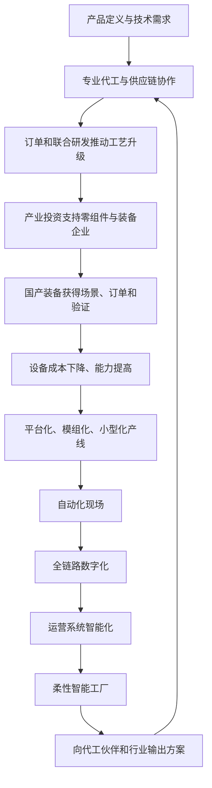
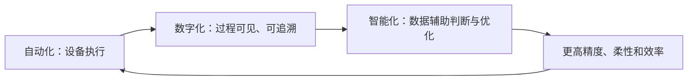

> 本章把小米的效率革命从产品定义、研发和零售进一步推进到生产端。雷军先解释代工与社会化分工的价值，再说明小米如何通过产业投资、装备研发和实验工厂，尝试解决自动化设备昂贵、产线缺乏柔性、国产装备缺少验证环境等问题，最终向制造伙伴输出智能工厂解决方案。

---

## 一、本章主线

前几章讨论了怎样定义爆品、组织生态链和建立高效率零售。第十三章继续追问：**产品进入工厂以后，生产环节还能怎样提高质量、速度和资源利用率？**

小米的探索路径可以概括为：

1. 借助专业代工体系完成早期手机生产；
2. 以订单、产品要求和联合研发推动代工伙伴升级；
3. 通过产业投资支持国产零组件和先进装备企业；
4. 找出装备成本高、产线不灵活、验证环境不足三道难题；
5. 从机械臂等关键装备入手，拆分软硬件并降低成本；
6. 建设实验性质的智能工厂，验证自动化、数字化和智能化系统；
7. 将成熟设备、产线和运营方案输出给制造伙伴。

本章最重要的认识是：**智能制造不是买一批机器人，也不是有没有自有工厂的问题，而是装备、产线、数据、软件、组织与产业协作共同构成的系统能力。**

---

## 二、制造为什么是效率革命的深水区

### 2.1 制造同时决定质量与效率

产品设计得再好，如果工厂不能稳定实现，最终用户仍然得不到好产品。制造环节影响：

- 材料和工艺能否达到设计要求；
- 不同批次是否保持一致；
- 缺陷能否及时发现和追溯；
- 产量能否随需求变化；
- 新产品能否快速试产和量产；
- 设备、人员和能源是否被高效利用；
- 单位生产成本能否持续下降。

所以，制造不是接收图纸后机械执行的末端，而是产品创新能否真正落地的关键部分。

### 2.2 为什么称为“深水区”

小米早期主要改造：

- 产品定义；
- 软件与用户反馈；
- 研发和供应链协同；
- 新媒体和渠道；
- 库存与资金周转。

这些环节的效率提升遇到瓶颈后，必须进入更重、更慢、更专业的生产现场。设备投资、工艺积累和工厂系统无法像互联网产品一样低成本快速试错，因此是难度更高的“深水区”。

### 2.3 改善工人环境也是制造效率的一部分

原书提到，小米驻场人员曾推动生产车间和员工宿舍安装空调，以改善产线工人的身心状态。

这个例子提醒我们：制造效率不能只理解为减少人工。工作环境、技能、安全和尊严会直接影响：

- 操作稳定性；
- 缺陷率；
- 员工流动；
- 培训成本；
- 生产安全；
- 长期组织能力。

把恶劣条件和过度劳动当作低成本，只是把代价转移给员工，并不是真正效率。

---

## 三、代工不等于没有技术

### 3.1 社会化大生产依赖专业分工

现代产品越来越复杂，很少有公司能够独立完成全部环节。芯片就包含设计、制造、封装、测试和设备等众多专业领域，光刻机本身也需要多国企业协作。

代工模式的本质是：品牌方专注产品、技术和用户，专业制造商专注工艺、产线和生产管理，双方通过协作完成交付。

### 3.2 自有工厂与代工只是组织方式

是否拥有工厂，不能直接判断企业有没有技术。更重要的是企业能否：

- 定义产品和工艺要求；
- 理解关键制造技术；
- 选择并管理合适伙伴；
- 验证产品质量；
- 参与设备和工艺改进；
- 保护知识产权与数据；
- 对最终产品承担责任。

同样，拥有工厂也不等于制造先进。工厂若设备落后、管理低效、缺少订单，反而会成为负担。

### 3.3 代工模式的优势

- 使用专业制造商已有设备、人才和管理经验；
- 避免每个品牌重复建设相同产能；
- 根据产品和需求灵活选择伙伴；
- 制造商服务多个客户，更容易积累工艺经验；
- 品牌公司可以把资源集中到用户、产品和核心技术；
- 大规模订单有机会推动先进工艺普及。

### 3.4 代工模式的风险

- 品牌方可能不理解生产，只会向工厂压价；
- 关键工艺和交付能力受制于伙伴；
- 多客户共线可能带来排产和保密问题；
- 质量责任容易在品牌与工厂之间推诿；
- 供应中断会影响整个产品计划；
- 过度分工会造成知识和数据割裂；
- 低价竞争可能把压力转嫁给工人和环境。

先进分工需要品牌方和工厂都有专业能力，并建立透明、长期、可追责的合作关系。

### 3.5 赛格威案例怎样理解

原书以赛格威希望自建工厂、乔布斯建议代工为例，说明消费品公司的核心能力首先是理解用户和打造产品，而不是把所有制造环节都收进公司。

赛格威后来的经营结果有多种原因，不能只归因于自建工厂。更稳妥的结论是：**企业决定自制或外包前，应明确自身核心能力、知识产权风险、产量、资本和供应市场，而不是把垂直整合天然视为护城河。**

---

## 四、品牌方与代工伙伴怎样联合创新

### 4.1 代工不是把图纸扔给工厂

品牌方掌握用户需求和产品方向，制造商掌握生产组织和工艺。真正高水平的合作应当双向：

- 品牌提出新的产品与质量要求；
- 工厂判断可制造性和成本；
- 双方共同修改材料、结构和流程；
- 新设备与工艺通过试产验证；
- 量产数据反过来改善下一代设计。

### 4.2 小米推动制造升级的三个阶段

#### 第一阶段：采用更高效的现有生产方式

小米第一代手机在相机和音频等环节采用自动化测试，减少人工检测的不稳定性。

采用成熟先进设备，是进入制造业时最直接的学习方式。

#### 第二阶段：通过产品与订单推动供应商提高能力

小米移动电源的一体铝合金外壳超出多数型材厂能力。最终合作厂商完成工艺后，不仅服务移动电源，也扩大了自身精密加工业务。

稳定订单给供应商提供了投资和学习的回报基础。

#### 第三阶段：联合研发并共同投入新设备

MIX 陶瓷工艺需要反复试验才能量产；小米 4 不锈钢中框也需要与富士康联合研发并投入新设备。

此时品牌方不只是买方，而是技术、资金和风险的共同承担者。

### 4.3 联合创新怎样形成双赢

对品牌方：

- 产品创意可以真正量产；
- 建立难以快速复制的工艺；
- 获得更稳定的质量和交付。

对制造伙伴：

- 获得订单与设备投资；
- 提升工艺和人才能力；
- 扩大可服务产品和客户；
- 在新技术成熟后分享更大市场。

### 4.4 防止合作变成单方面转嫁

品牌方不能只提出极端要求，却让工厂承担全部设备、良率和库存风险。健康合作需要明确：

- 谁承担研发费用；
- 新设备归谁所有；
- 工艺知识怎样使用；
- 需求变化如何补偿；
- 质量问题怎样追责；
- 订单承诺和付款周期；
- 员工、环境和安全标准。

效率收益应在用户、品牌、工厂与员工之间合理分配。

---

## 五、为什么还要进一步进入智能制造

小米与代工伙伴长期改进后，仍然遇到效率上限：

- 大量设备是针对单个产品定制；
- 产品变化就要重新换线；
- 装备核心部件依赖进口，价格高；
- 工厂数据分散，难以实时优化；
- 设备维护和校准仍依赖大量人员；
- 装备制造商没有足够场景验证产品；
- 不同品类的制造知识无法复用。

只优化一道工序已经不够，需要同时改变装备、产线结构和工厂运营系统。小米选择的两个切入口是产业投资和智能制造实验工厂。

---

## 六、带动国产供应链发展的必要性

### 6.1 产品升级依赖上游能力

生态链可以改善产品定义，但产品要持续进步，还需要：

- 芯片和核心元器件；
- 新材料；
- 精密加工；
- 自动化设备；
- 传感器和控制器；
- 高质量产能。

如果上游能力不足，品牌公司再好的构想也无法落地，或者只能依赖昂贵、受限的海外供应。

### 6.2 国产供应链早期缺少什么

原书认为，许多企业不是没有研发能力，而是缺少：

- 头部品牌的信任；
- 进入供应商名单的机会；
- 大规模订单；
- 真实量产验证场景；
- 与产品团队共同改进的经验；
- 长期资本支持。

供应链是强实践行业。没有真实订单，实验室方案难以经过质量、成本和交付检验；没有验证记录，又更难获得订单，形成循环困境。

### 6.3 红米的供应链意义

红米立项时就考虑使用和扶持国产供应链。海量销量为供应商提供验证和成长机会，也帮助国产器件进入更广市场。

品牌支持国产供应链不能降低质量标准。真正帮助是提供严格验证、改进机会和稳定订单，而不是为了“国产”接受不成熟产品并让用户承担风险。

---

## 七、产业投资不是单纯财务投资

### 7.1 小米为什么建立产业基金

2017 年后，小米希望以更系统方式支持先进制造、通信、集成电路和 AIoT 企业。产业基金把三类能力结合：

- 小米的产品、技术与订单场景；
- 政府引导基金等长期资金；
- 专业投资团队的尽调和治理能力。

它的重点是产业协同和供应链成长，而不只是寻找短期高回报项目。

### 7.2 供应商为什么最初不愿接受投资

供应链企业通常服务多个品牌。如果接受某一家客户投资，可能担心：

- 被其他客户视为“站队”；
- 商业秘密和产能分配受到质疑；
- 经营独立性下降；
- 投资方要求优先供货或排他合作；
- 未来融资和客户拓展受限。

这些顾虑合理。产业投资若破坏供应商的中立性，反而可能限制其成长。

### 7.3 “投资不控股，帮忙不添乱”

小米只持少数股份，并帮助被投企业获得第三方订单，希望证明投资不是控制和排他。

这一原则要可信，需要落实为：

- 不强制供应商只服务小米；
- 不不公平占用产能和技术；
- 保护其他客户信息；
- 不干预日常经营；
- 通过董事会和合同明确边界；
- 尊重创始团队和后续投资者。

### 7.4 长周期怎样理解

雷军提出产业投资要以十年起步的周期思考，因为芯片、材料和装备能力需要多轮研发、认证和客户验证。

长期主义不是永远追加资金。投资仍应设置：

- 技术与产品里程碑；
- 治理和财务要求；
- 客户与量产验证；
- 风险和退出机制；
- 对产业协同的定期评估。

### 7.5 原书记载的阶段成果

原书记载，小米长江产业基金规模达到 120 亿元，投资超过一百家企业，覆盖先进制造、5G、集成电路和 AIoT；部分企业后来进入资本市场。
> **原书图示**：小米通过产业投资支持先进制造与上游供应链
这些数字说明投资覆盖和阶段性成长，不代表所有项目成功，也不能单独证明产业效益。还要看技术国产化、量产质量、第三方客户和长期竞争力。

---

## 八、制造产业链中的三个角色

### 8.1 装备制造商

为工厂提供机械臂、测试设备、视觉系统、生产线和核心器件，是制造能力的源头之一。

### 8.2 生产制造商

包括专业代工厂和品牌自有工厂，负责组织设备、工艺、人员和质量，完成实际生产。

### 8.3 品牌商

定义产品，提出生产需求，掌握用户和市场，并最终对产品承担责任。

### 8.4 为什么三方必须协同

- 品牌知道未来产品需要什么；
- 工厂知道现有生产过程的问题；
- 装备企业知道设备和控制技术怎样实现。

若三方各自封闭：装备没有场景、工厂只能被动响应、品牌重复承担试错，自动化就难以标准化和规模化。

---

## 九、智能制造的三道待解难题

### 9.1 难题一：先进装备价格过高

机械臂、视觉系统和自动化设备初期价格高，一条产线若需要大量设备，投资非常可观。

工厂会比较：

- 设备能节省多少人工和时间；
- 产品生命周期有多长；
- 订单是否稳定；
- 设备能否用于下一款产品；
- 维护、软件升级和停机成本；
- 多久能够收回投资。

如果设备只能服务单一短周期产品，即使单次效率高，工厂也未必愿意购买。

### 9.2 难题二：非标准自动化缺乏柔性

非标设备针对特定产品快速定制，短期响应快，但产品尺寸、结构或工艺变化后，改造成本很高。

手机从普通直板变为折叠形态，原有设备可能无法继续使用。设备越专有，生命周期结束后的闲置风险越高。

### 9.3 难题三：国产装备企业缺少订单和验证

先进设备核心部件依赖进口会推高成本，而国产装备企业规模小，又缺少大量真实场景验证。

品牌和工厂不愿率先承担新设备试错，国产厂商没有订单就无法成熟；设备不成熟，又更难获得订单。

### 9.4 三道难题为什么互相纠缠

- 订单少，设备和软件成本无法摊薄；
- 设备昂贵，工厂不愿采购；
- 每条线都定制，装备无法规模生产；
- 没有规模场景，国产核心部件缺少验证；
- 缺少成熟设备，产线继续依赖人工或进口方案。

解决其中一个表面问题不够，需要同时创造场景、标准、订单、软件平台和验证环境。

---

## 十、看不见的差距：制造业生态

### 10.1 技术能力不等于产业成熟

一家企业能做出设备样机，不代表它能稳定供货。产业成熟还需要：

- 多客户、多场景验证；
- 供应链和质量体系；
- 安装、维护与培训；
- 软件持续升级；
- 标准和接口；
- 融资和现金流；
- 与工厂共同改进的网络。

技术差距容易被看到，生态中缺少场景、信任和合作机制则更隐蔽。

### 10.2 为什么生产制造商缺少前瞻性

代工厂要响应多个品牌的不同要求，主要精力在交付当前订单，很难要求客户统一未来标准。没有稳定需求时，提前投资新设备风险很高。

所以，品牌商作为需求发起者，需要更早提供产品路线和验证场景，帮助制造商从被动响应走向共同规划。

### 10.3 为什么不同品类设备难以复用

手机、手环、音箱和扫地机器人的尺寸、工艺和测试不同，设备往往各自独立。行业专有知识不互通，数据和软件系统也缺少统一接口。

平台化不能消灭品类差异，但可以把搬运、视觉、控制、数据、测试和设备管理中的共性抽出来，减少重复建设。

### 10.4 开放为何困难

品牌担心把工艺和知识输出给装备伙伴后，竞争者也会受益。这种担心会促使各品牌建立封闭体系，却让装备商无法形成规模，整个行业成本居高不下。

开放需要明确知识产权、保密期限、通用技术和专有技术边界。不是所有知识都应公开，但共性基础能力可以通过标准和商业授权扩大使用。

---

## 十一、小米为什么认为自己能参与破局

### 11.1 产品与场景广度

“手机 × AIoT”覆盖手机、可穿戴、家电、清洁、办公和出行等多类产品。跨品类制造数据和工艺经验，使小米有机会识别共性设备和标准。

### 11.2 规模化订单

小米及生态链拥有较大出货规模，可以给国产装备和器件提供真实订单，让新方案经过量产验证。

### 11.3 软硬件结合能力

智能制造不仅是机械设备，还包括：

- 控制算法；
- 机器视觉；
- 数据采集；
- 云与边缘计算；
- 仿真；
- 人工智能；
- 工厂运营软件。

小米的互联网、软件、硬件和 AI 经验可以补充传统装备企业的软件短板。

### 11.4 产业投资和伙伴网络

投资能帮助关键装备和核心器件企业获得资本、订单和协作关系，实验工厂则提供验证环境。

### 11.5 需要保持的边界

拥有场景和资本不意味着小米天然懂工厂。生产管理、安全、设备可靠性和工业软件都有长期专业积累。小米必须与装备商和代工厂共同学习，而不能以消费互联网经验替代制造规律。

---

## 十二、“做制造的制造”是什么意思

小米没有把目标限定为自己多生产手机，而是希望制造：

- 工厂使用的先进设备；
- 可灵活组合的生产线；
- 全链路数字系统；
- 智能工厂运营方案。

也就是为制造业提供“生产资料和生产系统”，因此称为“制造的制造”。

### 12.1 为什么先从装备企业入手

装备制造商和核心器件商是自动化的源头。只有设备质量提高、价格下降、供给稳定，更多工厂才有能力采用智能制造。

小米选择联合研发和投资支持，帮助这些企业缩短积累时间，并通过自身工厂和代工伙伴提供验证。

### 12.2 这与自建工厂是否矛盾

不矛盾。小米建设实验工厂，不表示放弃代工，而是为了亲自理解和验证新设备、产线与系统，再输出给代工伙伴。

自建实验能力与社会化生产可以共存：前者负责探索和验证，后者负责大规模专业生产。

---

## 十三、机械臂为什么是重要切口

### 13.1 机械臂是软硬件一体产品

机械臂不只是金属结构，还需要：

- 核心控制器；
- 运动算法；
- 相机和光源；
- 视觉识别；
- 末端操作头；
- 安全与校准；
- 与产线系统连接的软件。

传统装备企业可能擅长本体，却依赖外购控制器和算法，软件升级还需额外付费，整体价格因而较高。

### 13.2 小米的三项拆分方案

1. 投资专注机械臂本体的企业，提升硬件质量和成本；
2. 投资相机、光源等附属器件企业；
3. 由小米研发控制器、视觉算法等核心软件，再提供给伙伴。

这种分工让各团队专注强项，再通过统一系统集成。

### 13.3 为什么软件平台能降低成本

软件研发前期投入大，但可以在多个机械臂、工序和工厂复用。若每个设备都购买封闭专用控制器，重复成本高，升级也受限。

统一控制和视觉平台可以：

- 复用算法；
- 统一接口；
- 降低授权成本；
- 持续在线升级；
- 利用更多场景数据改进；
- 减少对单一海外供应商依赖。

### 13.4 十年降到十分之一的目标怎样看

雷军提出到 2030 年把机械臂价格降到 2020 年的十分之一。原书还称实验产线使用的机械臂已低于同类市场价格。

这是战略目标和作者判断，不是已实现的事实。能否达成取决于：

- 国产核心器件成熟；
- 软件平台大规模复用；
- 订单增长；
- 可靠性和维护成本；
- 市场竞争；
- 原材料和供应链变化。

降低采购价不能以牺牲精度、安全、寿命和售后为代价，应比较完整生命周期成本。

---

## 十四、从单点自动化开始验证

### 14.1 为什么不先改造整座工厂

智能工厂范围大、投入高。先选择板级测试等明确工序，可以：

- 限定问题范围；
- 比较改造前后；
- 验证设备稳定性；
- 训练供应商和工程团队；
- 计算真实成本；
- 为后续产线标准化积累模块。

这符合“找到第一把扳手”的工程思维。

### 14.2 板级测试案例

原书记载，传统测试线较长且需要多名人员操作；采用自动化设备后，线体缩短、人工减少，每小时产量提高。

这个结果体现了空间、人员和产出的综合改善。但评价自动化还应包括：

- 设备购买和折旧；
- 调试和维护；
- 停机损失；
- 缺陷检出率；
- 产品换型能力；
- 员工培训和岗位转型。

只看每小时产出，可能高估真实收益。

### 14.3 国产装备获得验证后的扩散

经过小米场景验证的相机、音频、机械臂和视觉算法方案，可以更容易被其他工厂采用。首个大客户的认证降低了市场不确定性。

品牌方帮助供应商获得行业客户，比将能力排他锁在自己体系中，更有利于设备形成规模、继续降本。

---

## 十五、平台化、模组化、小型化

非标自动化的核心问题，是一款产品对应一套专用设备。小米提出三个产线设计理念。

### 15.1 平台化

建立统一机械、电气、软件和数据基础，让不同产品尽量使用同一产线框架。

平台应定义：

- 设备接口；
- 数据格式；
- 控制协议；
- 安全规则；
- 校准方式；
- 模组尺寸与连接。

### 15.2 模组化

把工序能力拆成可替换模块。产品或工艺改变时，只更换相关模块，而不是推倒整线。

模组边界必须合理。拆得太大，换型成本仍高；拆得太细，接口、调试和可靠性会变复杂。

### 15.3 小型化

缩小设备与操作头，可以：

- 降低更换成本；
- 节省产线空间；
- 提高模块组合灵活性；
- 减少材料和能耗；
- 加快安装与调试。

小型化必须保持刚度、精度、散热、安全和维护便利，不能只追求体积。

### 15.4 三者怎样共同形成柔性

- 平台化提供共同底座；
- 模组化让功能可替换；
- 小型化让替换更快、更便宜。

最终目标是同一生产系统可以适应不同型号、小批量试产和快速工艺变化。

---

## 十六、智能工厂的三项核心要素

### 16.1 现场自动化

零组件加工、装配、测试、包装和搬运尽量由设备稳定完成。

自动化的价值包括一致性、精度、可追溯和危险工作替代，不只是减少员工。

### 16.2 全链路数字化

设备、材料、工序、质量、库存和订单状态都形成实时数据，支持：

- 进度监控；
- 缺陷追溯；
- 设备维护；
- 工艺优化；
- 物料调度；
- 经营决策。

数字化不是在墙上增加看板，而是让数据真实、连贯并进入业务决策。

### 16.3 运营系统智能化

在数字基础上，用算法辅助：

- 排产；
- 参数调整；
- 异常预测；
- 质量判断；
- 设备校准；
- 资源调度。

智能化不能跳过自动化和数字化基础。数据不完整、设备不稳定时，人工智能只会放大错误。

### 16.4 三层关系

---

## 十七、亦庄智能工厂的定位

### 17.1 为什么先建实验工厂

2018 年时，行业缺少小米设想的完整案例。若只要求代工厂投资未经验证的方案，对方很难承担风险。

小米因此自己建设样板，用于：

- 验证自研和投资企业的设备；
- 测试平台化产线；
- 试产高端和创新产品；
- 积累真实数据；
- 培养智能制造团队；
- 向伙伴展示可运行方案。

### 17.2 产能不是一期工厂的首要目标

2020 年投产的亦庄工厂具备一定高端手机产能，但原书强调它主要是实验工厂，而不是取代代工伙伴的大规模生产基地。

评价实验工厂不能只看产量和利润，还要看：

- 验证了多少设备与工艺；
- 缩短了多少研发和试产时间；
- 形成了哪些标准；
- 有多少方案被外部工厂采用；
- 技术能否稳定扩展到更大产能。

### 17.3 高度自动化不等于完全无人

原书称除上下料和部分质检外，多数环节可以无人运行。即使生产现场人员减少，工厂仍需要：

- 设备研发和维护；
- 软件与数据工程；
- 工艺和质量工程；
- 安全管理；
- 异常处置；
- 供应链计划；
- 员工培训。

“黑灯工厂”不意味着不需要人，而是人的工作从重复操作转向设计、维护、判断和改善。

---

## 十八、柔性生产为什么重要

### 18.1 什么是柔性生产

工厂能够快速改变生产的型号和数量，从大批量切换到小批量，或从 A 产品切换到 B 产品，而不需要长时间重建产线。

### 18.2 柔性解决什么问题

消费电子有以下特点：

- 产品周期短；
- 需求预测不确定；
- 高端创新产品初期销量难判断；
- 多型号和区域版本并存；
- 技术变化可能要求快速改款。

刚性大产线适合长期稳定海量产品，却容易在需求变化时积压或闲置。柔性使试产、定制和快速调整更可行。

### 18.3 快速换线的实现

原书称亦庄工厂通过“天地轨”等自研结构自动拆装设备，能够较快切换生产线；操作头小型化后，工艺改变只需替换局部模块。

换线速度不能只看机械替换，还要验证：

- 软件参数；
- 物料防错；
- 设备校准；
- 首件质量；
- 工人和安全确认；
- 数据与追溯切换。

### 18.4 柔性与效率并不天然一致

高度专用产线在单一产品海量生产时可能更快、更便宜；柔性产线则为变化支付额外成本。

选择应根据产品寿命、需求波动、型号数量和创新频率，而不是认为柔性越高永远越好。

---

## 十九、“三自”原则

小米提出设备的三项自主运行能力：

### 19.1 自诊断

设备能够监测状态、识别异常并给出故障位置，减少人工逐项排查。

### 19.2 自校准

设备自动确认位置、精度和参数，减少换线与维护时的人工标定。

### 19.3 自适应

根据材料、环境和工艺变化调整运行参数，在允许范围内保持稳定质量。

### 19.4 三自不能取消人的责任

软件判断可能错误，传感器也会失效。关键设备需要：

- 人工接管机制；
- 安全联锁；
- 审计日志；
- 定期验证；
- 异常升级；
- 网络与数据安全。

自动决策越多，系统安全和责任边界越重要。

---

## 二十、智能工厂怎样加快研发

### 20.1 传统样机周期为什么长

新产品从立项到样机，需要：

- 设计制造设备或治具；
- 搭建试验产线；
- 调试工艺；
- 生产样品；
- 测试并修改；
- 重新调整设备。

专用设备和人工验证使每轮都耗时很长。

### 20.2 智能工厂的加速方式

- 模组化设备快速搭建试验线；
- 软件仿真提前发现部分问题；
- 数字记录减少重复排查；
- 柔性产线快速生产少量样品；
- 自动测试提高验证速度；
- 同一平台复用上一代工艺。

原书提出将传统较长周期显著缩短的目标。这是方向性目标，具体周期仍取决于产品复杂度、法规和可靠性测试，不能为了速度压缩必要验证。

---

## 二十一、自研设备比例怎样理解

原书称亦庄一期工厂大部分设备来自小米或被投企业。

这个比例主要说明小米希望验证国产装备和自身系统整合能力，但不能仅凭“自研比例高”判断工厂先进。还应比较：

- 设备精度和稳定性；
- 生命周期成本；
- 维护和备件；
- 产出质量；
- 柔性与换型；
- 对外部供应商的兼容；
- 规模扩展表现。

自主可控的目标应是掌握关键能力和保障供应，不是为追求国产或自研比例排斥更优方案。

---

## 二十二、从一期实验到二期规模化

原书记载，亦庄一期承担小米高端和探索性手机生产；二期在北京昌平规划更大高端旗舰手机产能。

从实验工厂到规模工厂，难度会显著增加：

- 设备数量和接口更多；
- 偶发故障会被放大；
- 供应计划更复杂；
- 产品节奏要求更高；
- 投资回收压力更大；
- 软件系统需要高可用；
- 人员和组织必须标准化。

样板成功只是第一步。智能制造方案只有在大规模、长周期和多产品环境下稳定运行，才算真正成熟。
> **原书图示**：北京亦庄小米智能工厂一期
---

## 二十三、为全行业提供整体解决方案

### 23.1 为什么要向代工伙伴输出

若小米只在自有工厂使用新设备，规模有限，设备成本难以快速下降，也无法提升整体供应链。

向龙旗、蓝思等伙伴输出，可以：

- 在更大产能中验证方案；
- 让装备企业获得更多订单；
- 降低代工伙伴采用新技术的风险；
- 统一部分质量和数据标准；
- 提高小米产品整体交付效率；
- 推动行业共同升级。

### 23.2 板测线案例

原书记载，龙旗南昌园区采用小米智能工厂板测线后，每小时产出高于行业同类设备。

这种比较需要统一产品、质量、设备利用率和统计周期。单项产能提高是有力信号，但仍需观察长期稳定性和完整成本。

### 23.3 标准化模块产线案例

蓝思湘潭园区使用标准化模块搭建自动组装线，并采用国产机械臂和“一键标定”。产品变更时，过去逐台调试需要较长时间，统一标定可以显著缩短切换。
> **原书图示**：制造伙伴导入小米智能产线方案
它体现平台价值：一项软件和标准能力可以跨越多台设备与工厂复用。

### 23.4 输出的不只是设备

完整方案应包括：

- 核心器件与设备；
- 平台化、模组化产线；
- 控制和视觉软件；
- 数据标准；
- 工厂运营系统；
- 调试、培训和维护；
- 安全与质量规则；
- 持续升级机制。

只卖设备而不提供运营能力，很难实现智能制造。

### 23.5 商业模式需要回答的问题

面向行业输出还需明确：

- 设备和软件怎样收费；
- 谁承担定制和升级成本；
- 生产数据属于谁；
- 如何保护客户知识产权；
- 是否兼容不同品牌与工厂；
- 故障和质量责任怎样划分；
- 如何避免小米既是客户又是方案提供者造成利益冲突。

开放行业方案必须让非小米客户也能放心使用。

---

## 二十四、智能制造不是简单“机器换人”

### 24.1 自动化替代的是任务，不必然是所有岗位

重复、危险和高精度任务适合设备完成；人转向：

- 设备设计；
- 维护与异常处理；
- 工艺改善；
- 数据和软件；
- 质量与安全；
- 多品种生产组织。

### 24.2 员工转型需要企业投入

若企业只减少人数，不提供培训和岗位转型，会把效率收益建立在失业和技能淘汰上。

负责任的自动化应包括：

- 提前沟通；
- 技能培训；
- 新岗位通道；
- 安全和劳动保障；
- 对受影响员工的合理安排。

### 24.3 有些工序仍需要人

复杂判断、柔性操作、低频异常和最终责任在相当长时间内仍需要人。完全无人化不是目的，最合适的人机分工才是目标。

---

## 二十五、智能制造的安全与韧性

### 25.1 系统越集中，故障影响越大

统一控制、数据和算法提高效率，也可能形成单点故障。网络中断、软件缺陷或错误参数会影响整条产线。

需要：

- 分层隔离；
- 离线和降级模式；
- 数据备份；
- 手动接管；
- 灾难恢复；
- 关键设备冗余。

### 25.2 工业网络安全

设备联网后可能面临：

- 非法远程控制；
- 工艺和产品数据泄露；
- 勒索软件；
- 供应链软件攻击；
- 参数篡改导致质量和安全事故。

智能工厂必须把身份、权限、加密、补丁、审计和网络分区纳入设计，而不是投产后补救。

### 25.3 数据质量

传感器错误、设备时钟不一致、标签不准确都会误导算法。数据驱动之前必须建立校准、清洗、追溯和责任机制。

### 25.4 供应链韧性

极致效率容易把库存和冗余压得过低。面对疫情、自然灾害、地缘风险和关键器件短缺，工厂还需保留：

- 多供应商；
- 安全库存；
- 替代工艺；
- 弹性产能；
- 区域分散；
- 应急计划。

最高效率不是平时成本最低，而是在变化中仍能稳定交付。

---

## 二十六、智能制造的环境价值

自动化和数字化有机会降低：

- 材料浪费；
- 返工和报废；
- 能源消耗；
- 过量生产；
- 库存与物流；
- 设备闲置。

但新设备制造、数据中心和快速换代本身也消耗能源与材料。评价智能制造应观察完整生命周期，而不只看工厂内单位产出。

平台化和模组化还能延长设备寿命：工艺变化时更换模块，而不是报废整线，这是重要的环境与经济价值。

---

## 二十七、小米智能制造模式的核心边界

### 27.1 实验工厂不等于所有工厂

高端手机、百万级产能与其他品类、超大规模工厂差异明显。方案输出前需要在不同产品、地区和合作伙伴中验证。

### 27.2 书中数据具有时间和口径

设备价格、国产比例、产能、效率提升和建成计划都来自原书记载时点。后续市场、建设和技术进展可能变化，不能当作当前状态或普遍行业基准。

### 27.3 智能制造不是唯一路径

订单小、工艺变化频繁、人工灵巧性占优势的工序，全面自动化可能不经济。精益管理、员工技能、工艺改良和简单工具也能显著提高效率。

### 27.4 开放输出与竞争优势的矛盾

小米希望行业共享方案，又需要保持产品竞争力。应区分：

- 可开放的共性装备和标准；
- 可授权的平台技术；
- 与伙伴联合拥有的工艺；
- 必须保护的产品专有技术。

边界不清会导致伙伴不愿合作，或公司不愿真正开放。

### 27.5 产业投资存在利益冲突

小米既是投资者、客户，也是方案提供者，可能影响采购公平和供应商竞争。需要独立评审、关联交易披露和多供应商机制，避免投资关系替代技术与质量判断。

---

## 二十八、本章方法论总结

### 28.1 推进智能制造的步骤

1. 明确制造要改善的质量、交付或成本问题；
2. 区分品牌、工厂和装备企业的核心能力；
3. 先使用成熟先进方案，理解真实生产过程；
4. 用订单和联合研发推动关键工艺升级；
5. 识别影响普及的设备、柔性和生态瓶颈；
6. 从一项高价值工序做自动化试点；
7. 为国产装备提供资金、订单和真实验证；
8. 把设备做成软硬件一体系统；
9. 用平台化、模组化和小型化提高复用与换型能力；
10. 依次建设现场自动化、全链路数字化和运营智能化；
11. 在实验工厂验证设备、产线和运营系统；
12. 从小规模试产验证走向大规模稳定运行；
13. 将成熟方案开放给制造伙伴，形成行业规模；
14. 同时管理员工转型、安全、韧性、隐私和环境影响。

### 28.2 本章最重要的概念

| 概念 | 通俗理解 |
|---|---|
| 社会化大生产 | 企业发挥各自专业优势，通过紧密分工完成复杂产品 |
| 联合创新 | 品牌与工厂共同定义、研发和验证工艺与设备 |
| 产业投资 | 以长期资本、场景和订单帮助上游技术企业成长 |
| 制造业生态 | 技术之外的订单、验证、标准、人才和合作网络 |
| 制造的制造 | 制造先进装备、产线平台和智能工厂系统 |
| 平台化 | 用共同底座和接口支持不同产品与工序 |
| 模组化 | 将产线能力拆成可替换、可组合的模块 |
| 小型化 | 缩小设备与操作头，降低换型成本并提高灵活性 |
| 自动化 | 设备稳定执行加工、装配、测试和搬运 |
| 数字化 | 生产过程真实、实时、可追溯 |
| 智能化 | 基于数据辅助排产、质量、维护和资源决策 |
| 柔性生产 | 快速切换产品和批量，适应不确定需求 |
| 三自原则 | 设备能够自诊断、自校准和自适应 |

### 28.3 三道难题与对应方向

| 难题 | 对应方向 |
|---|---|
| 先进装备价格高 | 国产核心器件、软硬件拆分、规模复用和产业投资 |
| 非标产线换型困难 | 平台化、模组化、小型化与统一软件接口 |
| 装备企业缺少订单和验证 | 品牌提供场景、实验工厂验证、向代工伙伴推广 |

### 28.4 小米模式在制造端的角色

小米希望同时扮演：

- 产品与未来需求的定义者；
- 新工艺的联合研发者；
- 国产供应链的订单与投资支持者；
- 通用软件和算法的开发者；
- 实验工厂的验证者；
- 行业解决方案的输出者。

角色越多，能力要求和利益冲突也越多，必须依靠专业团队、透明规则和伙伴共赢来维持。

### 28.5 与前后章节的连接

- 第十章提出全链路效率；
- 第十一章改造零售交付；
- 第十二章通过生态链提升产品供给；
- 第十三章继续进入装备、产线和生产系统；
- 第十四章将反思公司规模扩大后，方法论怎样避免失焦并继续演进。

这条路径从用户端逐步深入产业上游：先理解用户、做好产品、提高零售效率，再通过供应链和智能制造继续推动生产端进步。

### 28.6 一页速记

> **制造的地位**：既保障产品质量，也是全链路效率的关键战场。 
+> **代工本质**：专业分工，不代表品牌没有技术；关键是能否定义、主导和验证。 
+> **联合创新**：品牌提供产品方向和技术前瞻，工厂提供工艺与生产能力。 
+> **产业投资**：重点在产业，不在短期财务回报；为上游提供资本、订单和验证。 
+> **三道难题**：装备太贵、非标产线不灵活、国产装备缺少订单与验证。 
+> **制造的制造**：从生产商品进一步走向制造设备、产线和工厂系统。 
+> **机械臂思路**：本体、附属器件和核心软件分工，再统一整合。 
+> **柔性基础**：平台化、模组化、小型化。 
+> **智能工厂三层**：现场自动化、全链路数字化、运营系统智能化。 
+> **实验工厂**：先验证设备、工艺和系统，不以一期产量为首要目标。 
+> **三自原则**：自诊断、自校准、自适应。 
+> **行业输出**：把验证后的装备、产线和软件提供给代工伙伴，形成更大规模。 
+> **核心边界**：智能制造不是机器换人，也不是自动化越多越好；必须同时考虑完整成本、柔性、员工、安全、韧性和环境。 
+> **核心启示**：真正的制造升级不是品牌独占能力，而是让装备商、工厂、品牌和员工在开放协作中共同提高。
