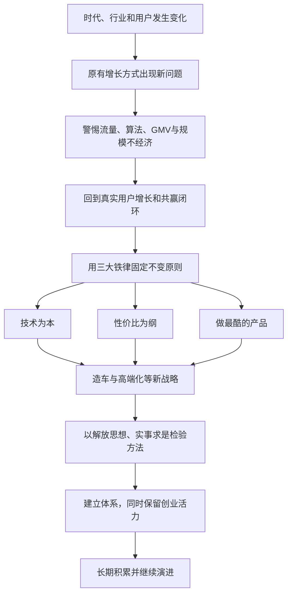
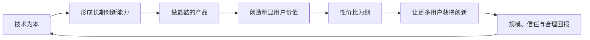

> 本章讨论小米进入第二个十年后，原有方法论怎样面对规模扩大、流量红利消退、用户变化和新业务挑战。核心内容包括警惕“规模不经济”、用三大铁律稳定方向、以终局意识决定造车、重新理解高端化，以及在体系化与创业活力之间继续完善小米方法论。

---

## 一、本章主线

小米的方法论形成于移动互联网快速兴起的 2010 年前后。十二年后，市场和小米自身都发生了巨大变化：

- 个人计算机互联网转向移动互联网和 5G；
- 电商从早期低渗透变成日常基础设施；
- 线上流量从红利变成昂贵资源；
- 智能手机从增量市场进入存量竞争；
- 小米从少数发烧友走向全球大众和高端用户；
- 产品从一款手机扩展到智能家居、办公和出行；
- 公司从创业团队成长为大型公众公司。

旧方法不能机械照搬，但使命和核心价值也不能随环境漂移。本章的演进逻辑是：

本章最重要的问题不是“小米过去的方法是否正确”，而是：**哪些是必须坚持的根本，哪些只是特定阶段的做法；公司怎样在变化中继续实现使命。**

---

## 二、为什么方法论必须持续演进

### 2.1 方法来自具体时代

小米早期成功依赖一组特定条件：

- 智能手机高速普及；
- 安卓开源生态成熟；
- 中国供应链具备强大制造能力；
- 社交媒体和电商拥有低成本流量；
- 发烧友用户愿意参与产品开发；
- 传统手机渠道和产品存在明显低效。

这些条件变化后，即使使命不变，产品、渠道、组织和增长方式也必须改变。

### 2.2 企业本身也改变了

小团队可以依靠创始人和核心成员直接沟通，大公司则面对：

- 更多业务和产品；
- 更多层级与地区；
- 不同用户群；
- 更复杂的监管和社会责任；
- 资本市场监督；
- 跨部门资源冲突；
- 对系统、流程和治理的需求。

适合几十人的工作方式，不能原样支撑数万人的全球公司。

### 2.3 演进不等于否定初心

方法论演进应当区分三个层次：

| 层次 | 内容 | 变化方式 |
|---|---|---|
| 使命和价值 | 为什么存在、为用户创造什么 | 长期稳定，慎重完善 |
| 原则和铁律 | 决策不能越过的边界 | 保持一致，用新实践深化理解 |
| 策略和战术 | 当前采用的产品、渠道和组织方式 | 随市场、技术和能力调整 |

只守旧做法，会变成教条；只追逐环境变化，又会失去方向。

### 2.4 书中宏观数据怎样看

原书用 2010 至 2021 年的经济、通信、电商和手机数据说明时代变化。这些数字服务于作者的时代判断，具有出版时点和统计口径。

真正要掌握的是趋势：市场成熟、用户分层、流量变贵、线上线下融合，以及技术生态扩大，而不是把具体数字当作当前状态。

---

## 三、警惕“规模不经济”

### 3.1 什么是规模不经济

规模通常能分摊成本、提高采购能力和扩大品牌影响，但超过组织与系统承载能力后，也可能出现：

- 管理层级增加；
- 信息传递变慢和失真；
- 部门目标互相冲突；
- 产品线膨胀；
- 用户关系变远；
- 研发和品牌资源分散；
- 外部流量依赖变强；
- 总收入增加，单位效率却下降。

公司“更大”不等于“更强”。规模只有沉淀为技术、用户、品牌、渠道和组织能力，才产生长期价值。

### 3.2 互联网为什么容易放大规模

爆品、口碑和平台推荐能迅速聚集注意力，把细分用户扩展为大规模流量。早期流量增长会带来：

- 更低的单位获客成本；
- 更多销量和数据；
- 更强供应链支持；
- 更多媒体和合作机会；
- 进一步增长。

正反馈很强时，组织容易把增长当成一切正确的证明，忽视增长质量和内部损耗。

### 3.3 多元用户增加了什么难度

从发烧友扩展到大众、女性、商务和高端用户后，不同人群在意的内容不同：

- 发烧友重视参数、可玩性和快速更新；
- 大众用户重视可靠、易用和服务；
- 商务用户重视完整交付、稳定和隐私；
- 高端用户关注综合体验、设计、品牌和渠道。

继续只听早期核心用户，可能误判更大市场；试图同时满足所有人，又容易失去清楚产品定义。

---

## 四、流量陷阱

### 4.1 流量不是用户

流量只是企业有机会影响的人。只有当一个人：

- 真正理解产品价值；
- 购买并使用；
- 获得满意体验；
- 愿意复购、互动或推荐；
- 与品牌形成持续关系；

流量才转化为用户价值。

曝光、点击和观看可以增长，却不表示用户资产增长。

### 4.2 流量红利终会消失

新平台早期为了吸引创作者和商家，会提供较低成本的自然流量。参与者增多后：

- 竞争加剧；
- 推荐规则变化；
- 付费投放增加；
- 获客成本上升；
- 企业越来越依赖平台。

小米早期受益于微博、QQ 空间和电商红利，后来也面对流量成本增加。企业可以使用红利，却不能把红利当作永久商业模式。

### 4.3 依赖外部平台的风险

- 用户关系主要属于平台；
- 推荐规则变化会影响触达；
- 流量价格不由企业控制；
- 数据和反馈不完整；
- 为迎合平台而改变内容和产品；
- 多平台运营增加成本；
- 平台与品牌可能进入同一业务竞争。

外部平台可以高效获客，但企业仍需建立自己的产品、服务、社区和用户关系。

### 4.4 公域和私域都不是免费午餐

把平台用户引入企业社区或会员体系，仍需提供持续价值。所谓私域并不意味着企业可以无限触达或绕开用户同意。

维护自有用户关系需要：

- 内容和服务；
- 社区运营；
- 客服和反馈；
- 数据安全；
- 用户退出与选择权；
- 长期产品价值。

若私域只用于反复促销，同样会耗尽信任。

---

## 五、算法陷阱

### 5.1 算法带来的机会

推荐算法可以更准确地匹配内容和潜在用户，帮助企业：

- 发现不同兴趣人群；
- 测试内容和商品；
- 提高传播和转化效率；
- 快速获得行为反馈；
- 降低部分无效曝光。

### 5.2 迎合算法会产生什么问题

当团队以获得推荐为最高目标，可能出现：

- 标题和内容夸张；
- 只做容易传播的产品卖点；
- 忽视不能被快速量化的长期价值；
- 不断重复用户已有偏好；
- 把平台热度误认为真实需求；
- 形成短期内容爆款，却没有产品和用户沉淀。

算法应帮助理解和服务用户，而不是让企业转而服务算法。

### 5.3 信息茧房怎样伤害企业

算法会反复强化相似观点。企业管理者看到的评论和内容可能来自一小群活跃用户，从而误以为这就是市场全貌。

需要通过：

- 社区与公开平台；
- 客服和售后；
- 线下门店；
- 用户访谈；
- 大样本调研；
- 使用、复购和退货数据；

进行交叉验证，尤其要听到沉默用户和流失用户。

### 5.4 算法效率必须受到用户利益约束

更高点击率不代表更好体验。推荐还应考虑：

- 隐私和数据最小化；
- 用户是否能控制推荐；
- 是否制造沉迷和焦虑；
- 是否歧视某些人群；
- 商业内容是否清楚标识；
- 长期满意和信任。

---

## 六、GMV 陷阱

### 6.1 GMV 能说明什么

GMV 即商品交易总额，能反映平台或渠道在一定时期内发生了多少交易，但不能直接说明：

- 企业获得多少收入和利润；
- 退货和补贴是多少；
- 用户是否满意；
- 库存和现金流是否健康；
- 产品是否符合公司战略；
- 品牌和技术是否增强。

### 6.2 799 元非智能洗衣机为何成为反例

这款产品本身可能质量不错、价格合理，也可能带来销售额。但它缺少智能和独特体验，对手机与 AIoT 战略帮助有限。

问题不在产品能不能卖，而在于：

- 占用研发、渠道和售后资源；
- 没有沉淀目标用户；
- 稀释科技品牌；
- 鼓励团队继续以 SKU 和交易额增长；
- 局部成功可能伤害全局专注。

### 6.3 快速扩张 SKU 的连锁风险

- 每款产品投入不足；
- 质量和体验不稳定；
- 库存种类增加；
- 供应链与售后复杂；
- 用户难以理解品牌；
- 部门只关心自己的收入；
- 主品牌流量被消耗；
- 爆品能力逐渐减弱。

砍 SKU 不是反对增长，而是迫使团队用更少产品创造更高用户价值和更强协同。

---

## 七、关注用户，而不是流量

### 7.1 小米早期的用户闭环

小米最初形成了两条相互连接的路径：

- MIUI、社区和用户之间持续反馈与口碑传播；
- 手机、商城、生态产品和用户之间持续购买与复购。

硬件、新零售和互联网服务都围绕同一批用户，增长可以沉淀在体系内部。

### 7.2 为什么闭环后来出现缺口

小米进入大型电商和更多新媒体平台后，获得更多外部流量，却相对放松了自有社区：

- 新用户未必进入小米自己的关系体系；
- 用户只在交易时出现；
- 反馈被平台隔开；
- 外部流量越来越贵；
- 企业难以形成长期互动。

外部渠道扩张必要，但不能以丢失自有用户关系为代价。

### 7.3 什么是真正有效的转化

转化不应只看购买，还应看：

- 用户是否持续关注；
- 是否愿意进入社区和服务；
- 是否复购不同产品；
- 是否提供反馈；
- 是否主动推荐；
- 是否在出现问题时仍愿意沟通。

一次成交是交易，持续关系才是用户沉淀。

### 7.4 重建小米社区

2021 年小米启动社区重建，调整产品、运营和团队，拉通内部业务，为米粉和用户提供沟通、问题解决和参与平台。

社区重建不能只恢复发帖量，还要检查：

- 问题是否得到解决；
- 不同用户群是否有代表；
- 产品团队是否真正参与；
- 反馈是否形成闭环；
- 社区规则是否公平；
- 用户数据是否得到保护。

### 7.5 用户活动也要产品化

小米顾问计划、米粉家宴、开放日等活动被视为用户沟通产品，需要明确目标、流程、反馈和持续改善。

活动不能只服务少数忠实粉丝或成为品牌表演，还要把获得的认识带回更广泛用户和业务。

---

## 八、追求闭环，而不是封闭

### 8.1 闭环的真正含义

闭环意味着产品、用户、反馈、交易和改善能持续循环，不表示所有环节都必须由一家公司拥有。

完全自营看似控制力强，却可能：

- 与所有渠道和伙伴竞争；
- 重复建设专业能力；
- 扩大资本和组织负担；
- 限制生态规模；
- 失去外部创新。

### 8.2 共赢闭环

更成熟的闭环应让：

- 上游供应商因订单、投资和技术合作成长；
- 生态链创业公司建立独立能力；
- 零售伙伴通过高周转获得合理回报；
- 平台和内容伙伴得到公平收益；
- 用户获得更好产品、价格和服务；
- 小米通过效率、规模和服务持续经营。

### 8.3 从“出圈”到更大生态

小米向上游推进产业投资、供应链金融和智能制造，向下游开放新零售能力，试图把原来的公司内部闭环扩大为产业协作闭环。

开放不等于没有规则。需要处理：

- 数据与知识产权；
- 质量和品牌责任；
- 合作伙伴公平性；
- 利润和风险分配；
- 平台是否滥用控制权。

### 8.4 高质量增长的判断

增长至少应同时带来：

- 更多真实用户；
- 更高用户价值和信任；
- 核心业务与生态协同；
- 更强技术、产品和组织能力；
- 合作伙伴可持续收益；
- 健康现金流和合理利润。

只有交易额增加而其他方面恶化，是规模膨胀，不是高质量增长。

---

## 九、为什么需要“三大铁律”

小米方法论内容复杂，员工在日常决策中不可能每次重读整套理论。公司需要少数清楚原则，帮助团队在新情况中快速判断。

三大铁律是：

1. 技术为本；
2. 性价比为纲；
3. 做最酷的产品。

它们分别回答企业的立足之本、发展道路和竞争优势。

三大铁律不能只写在制度里，还要通过研发预算、产品决策、利润约束和管理者行为得到验证。

---

## 十、铁律一：技术为本

### 10.1 技术决定生存

小米身处手机、智能硬件和汽车等高竞争科技领域，对手拥有长期技术、供应链和品牌积累。没有自己的关键技术理解和创新能力，只靠渠道和性价比很容易被复制或淘汰。

### 10.2 技术怎样支撑整套模式

- 技术创造产品差异；
- 工程师文化推动持续创新；
- 好产品形成爆品和口碑；
- 爆品支撑规模和全链路效率；
- 效率让性价比长期成立；
- 性价比与持续兑现建立用户信任。

技术不是孤立研发指标，而是小米模式的起点。

### 10.3 技术为本不等于技术至上

技术仍需接受用户、质量、成本和社会责任的检验：

- 用户不需要的炫技不是价值；
- 未经验证的技术不能牺牲安全；
- 自研不是目的；
- 研发投入需要方向和复用；
- 技术人员也要理解产品和商业。

---

## 十一、铁律二：性价比为纲

### 11.1 性价比决定发展道路

科技企业可以通过稀缺技术与品牌获得高溢价，也可以提高效率，将创新以更合理价格交给大众。小米选择后者。

“为纲”表示性价比不是促销技巧，而是连接产品、效率和用户关系的长期路径。

### 11.2 性价比的三重作用

- 是爆品惊喜定价的条件；
- 是高效率模型最终给用户的结果；
- 是和用户交朋友时最直接的诚意。

### 11.3 对“溢价模型”的判断边界

原书认为溢价模型难以持续，这属于雷军的价值判断。现实中，品牌、设计、服务、稀缺性和风险保障也能创造真实用户价值，不能把所有高价格都视为不合理。

更可靠的判断标准是：价格增加是否对应用户认可的真实价值，还是主要来自信息不透明、锁定和市场控制。

### 11.4 性价比不等于中低端

高端产品也可以坚持性价比。关键不是绝对价格，而是：

- 技术与体验是否足以支撑价格；
- 相比同类是否提供更多价值；
- 利润是否合理；
- 用户是否获得完整服务；
- 企业能否持续研发与经营。

---

## 十二、铁律三：做最酷的产品

### 12.1 “酷”是竞争优势

商业模式和方法可以被研究和模仿，最终差异仍要由产品实现。酷意味着：

- 有创新和独特性；
- 解决真实问题；
- 用户体验超出预期；
- 体现鲜明产品态度；
- 能被稳定制造和服务。

### 12.2 为什么不怕公开方法论

雷军认为商业模式难以保密，同行学习还会推动行业进步。小米不能依靠别人不知道方法取胜，而要在技术和产品上不断领先。

公开也有边界。用户方法和价值原则可以分享，未发布产品、用户数据、关键技术和合作伙伴机密仍需保护。

### 12.3 酷与性价比必须同时成立

只酷不考虑价格，创新难以普惠；只追求低价而不酷，产品会陷入同质化。

小米要用技术创造独特体验，再用效率降低用户获得体验的成本。

---

## 十三、四个持续考问

原书用四个问题推动复盘：

1. 过去哪些成绩来自正确方法，哪些错误需要重来？
2. 新局面中，哪些认识、战略和战术要改变，哪些绝不能变？
3. 未来怎样继续实现使命？
4. 用什么心态面对新挑战？

这四问可以作为企业年度或战略复盘框架：

- 第一问建立事实和因果；
- 第二问区分原则与路径；
- 第三问确定新阶段选择；
- 第四问约束组织心态和行为。

复盘不能只得到口号，应落实到资源、组织、负责人和阶段验证。

---

## 十四、新十年的三大策略

### 14.1 重新创业

公司已经很大，仍要用创业团队的心态面对新领域：

- 承认自己不知道；
- 从用户和行业重新学习；
- 小范围验证；
- 不依赖既有地位；
- 保持责任心和行动速度。

重新创业不表示否定现有体系，而是避免成功经验变成傲慢。

### 14.2 互联网加制造

继续把用户连接、快速反馈、数字化和高效率带入产品、供应链、零售和智能制造。

互联网方法必须尊重制造业的质量、安全、资本和周期规律，不能用软件迭代逻辑替代硬件验证。

### 14.3 行稳致远

在宏观周期、产业竞争和大规模投入中，既不能盲目激进，也不能因害怕风险停止行动。

行稳致远要求：

- 长期方向清楚；
- 重大投资分阶段；
- 现金与风险可承受；
- 建立质量、合规和治理；
- 根据证据调整；
- 保留未来选择。

---

## 十五、小米为什么决定造车

### 15.1 这是第二个十年的首项全新主干业务

小米前十年的手机、互联网服务、AIoT 和新零售在创办前已有规划。汽车是 2021 年正式决定的全新重大扩张，投入大、周期长、风险高，也可能改变公司未来。

### 15.2 为什么过去不讨论

- 手机与既有业务还有巨大提升空间；
- 汽车本身是庞大复杂产业；
- 过早进入会违反专注；
- 2015 年后手机业务处于低谷和补课期；
- 公司当时没有足够能力和资源同时承担。

机会存在不等于当时就应进入。战略时机取决于核心业务、组织能力、资本和行业阶段。

### 15.3 调研先寻找“不做的理由”

确认性偏差会让团队只搜集支持进入新市场的信息。雷军要求主动寻找反对证据，目的是检验：

- 新业务是否真的必要；
- 风险是否不可承受；
- 是否存在更好的合作或投资方式；
- 公司优势是否被高估；
- 进入是否伤害核心业务。

重大决策应让反方观点获得充分表达，而不是把讨论变成支持领导结论。

---

## 十六、造车的三层终局推演

### 16.1 第一层：对公司未来业务的影响

原书的判断是：

- 手机进入成熟存量竞争；
- 智能汽车是巨大的个人消费品和新技术机会；
- 汽车将连接个人设备、家庭和出行；
- 多家消费电子巨头开始布局汽车；
- 不进入可能让小米未来缺少新的成长空间。

这构成“为什么要认真考虑造车”，但不能单独证明必须自建汽车业务。

### 16.2 第二层：智能汽车行业的未来形态

小米判断电动化、模组化和软件发展会使汽车更接近智能终端：

- 软件在功能和体验中的比重提高；
- 硬件、软件和服务共同形成收入；
- 汽车进入智能生态；
- 行业最终可能高度集中。

汽车仍然不同于手机：安全责任、法规、研发验证、使用寿命、制造和售后都更复杂。“消费电子化”是一种趋势判断，不表示汽车已经变成大号手机。

### 16.3 第三层：小米能否取得长期位置

原书推测成熟汽车行业会高度集中，因此进入的目标不能只是做出一款车，而要争取全球头部位置。

这是作者的战略假设，不是已验证的行业定律。区域法规、供应链、品牌和车型差异可能使汽车市场结构与手机不同。

真正需要回答的是：小米是否有能力持续提供安全、有竞争力的产品，并在长期投入中生存。

### 16.4 用户信任提供起点

米粉“你们敢造，我就必买”增强了雷军信心。用户基础可以提供：

- 首批关注和订单；
- 产品反馈；
- 品牌传播；
- 生态协同；
- 较低启动获客成本。

但口头支持不是购买承诺，手机信任也不能替代汽车安全、质量和服务验证。它是进入优势，不是成功保证。

---

## 十七、小米认为自身有哪些造车优势

原书列举六项：

1. 对硬件结合互联网服务的商业模式有经验；
2. 具有软硬件融合和制造业经验；
3. 拥有大规模智能生态；
4. 多项技术可以复用；
5. 品牌、用户和米粉信任；
6. 有较充足现金支持长期投入。

这些优势主要来自消费电子和生态平台。进入汽车后仍需新建：

- 整车与底盘工程；
- 安全与可靠性；
- 供应链和工厂；
- 法规认证；
- 销售、交付与维修；
- 保险、残值和长期服务；
- 自动驾驶安全治理。

可迁移能力和必须新建能力要分别评估。

### 17.1 为什么放在集团内部并全资起步

小米希望：

- 统一手机、AIoT 与汽车生态；
- 统一文化和长期目标；
- 避免独立融资追逐短期估值；
- 共享集团技术、用户和渠道；
- 保持产品决策控制力。

全资也意味着集团承担全部资金和失败风险。内部协同若演变成资源争夺，仍可能影响手机主业，因此需要独立责任和清楚预算边界。

### 17.2 决策过程说明什么

原书记载，团队在较短时期进行了大量行业访谈、内部讨论和董事会审议。

访谈数量可以说明投入程度，不能替代信息质量。重大决策还应持续使用：

- 技术和市场验证；
- 情景分析；
- 分阶段投资；
- 失败与退出条件；
- 外部独立意见；
- 投产后的事实校正。

决策不是宣布进入后就结束，而是贯穿整个项目生命周期。

---

## 十八、大公司做新业务的三个大坑

### 18.1 认知错位

大公司员工容易把平台积累形成的成绩全部归因于个人和团队能力，从而：

- 高估品牌影响力；
- 低估新行业复杂度；
- 认为供应商会自动支持；
- 把原有用户等同于新业务用户；
- 缺少生存压力和敬畏。

解决方法是把平台优势、团队能力和行业新能力分别列出，用真实项目验证。

### 18.2 惯性思维

认知错位会导致把旧行业经验直接搬到新行业：

- 一开始就组建大团队和大预算；
- 使用原有产品流程；
- 以强势甲方姿态对待新伙伴；
- 用熟悉指标衡量陌生业务；
- 忽略新行业安全与法规。

经验可以提供假设，不能直接充当答案。

### 18.3 偶像包袱

大公司担心第一款产品不够震撼，试图一次全面领先；面对行业伙伴时又不愿低头学习。

结果可能是：

- 产品定义过度复杂；
- 技术和供应链风险集中；
- 延期和成本失控；
- 团队不愿暴露不足；
- 无法先完成一款可靠产品。

### 18.4 怎样避开三个坑

- 大胆提出愿景，小心验证假设；
- 保持创业团队心态；
- 从基本产品和核心用户开始；
- 主动寻找行业导师和反对意见；
- 阶段性增加团队和预算；
- 先做到同级优秀，再选择少数真正颠覆点；
- 公开承认差距，保留对生存风险的敏感。

### 18.5 “创业心态”不能成为管理缺失

汽车安全和资本投入不允许草率试错。创业心态应指谦逊、专注、自驱和快速学习，而不是缺少流程、质量和合规。

---

## 十九、小米高端化战略

### 19.1 高端化为何是方法论的重要演进

小米长期与性价比和发烧性能联系在一起。用户扩大后，只强调参数和价格无法覆盖综合体验需求。

高端化要求小米证明：性价比不是只能做中低价产品，也能在高价格段提供领先技术、完整体验和合理价值。

### 19.2 原书提出的目标

2022 年，小米明确高端化为重要战略，并提出手机和体验对标行业领先产品、争取国产高端市场领先位置。

这是当时的战略目标，不是本章已经证明的结果。判断进展需要看多代产品、市场份额、用户认知、质量和复购。

### 19.3 小米 10 提供的早期验证

5G 时代旗舰成本提高，团队担心高价格产品需要较大销量才能支撑。雷军要求先服务小米核心用户，打磨性能和综合体验。

原书记载，小米 10 系列销量显著超过最初打平预期，为后续高端化提供信心。

案例说明核心用户可以支持品牌升级的第一步，但真正站稳还需要获得其他品牌用户和更广高端人群。

---

## 二十、性价比与高端化并不冲突

### 20.1 常见误解：高端等于高溢价

传统观点认为，品牌做高端就是获得更高加价能力。小米则把问题改为：在继续坚持性价比的同时，怎样做好高端。

### 20.2 高价是结果，不是手段

高端产品会使用更先进技术、材料、设计和服务，成本与价格自然提高。若只是先定高价，再依靠宣传赋予高端形象，用户最终会通过体验识别。

### 20.3 品牌、用户和产品必须统一

- 品牌表达的价值与形象要一致；
- 产品要用技术、体验和设计兑现；
- 目标用户要真实认可并使用。

品牌部门单独宣布高端，或仅推出一款高价产品，都不能完成高端化。

### 20.4 高端化是集团整体战略

手机高端化还需要：

- IoT 和生态产品体验一致；
- 小米之家提供匹配的购物环境；
- 售后与服务更加专业；
- 软件、隐私和长期更新可靠；
- 品牌传播和用户沟通统一。

任何触点明显短板都会削弱整体高端认知。

---

## 二十一、高端化的三个核心要素

### 21.1 品牌

需要完整、统一、由价值观驱动的形象。高端品牌不是制造距离，而是让用户相信公司在技术、设计、质量和服务上有稳定标准。

### 21.2 用户

要获得高端用户群实际认可，理解他们对综合体验、稳定、隐私、服务和身份表达的需求。

不能只用原有发烧友偏好代替高端用户研究。

### 21.3 产品

原书概括为：技术领先、体验为先、独特设计。

- 技术领先提供能力；
- 体验为先决定技术怎样使用；
- 独特设计形成可感知、可记忆的产品价值。

---

## 二十二、高端化的三项支撑

### 22.1 价格

要在高价格区间持续有产品和销量，同时保持价格稳定。频繁大幅促销会伤害早期用户和品牌预期。

价格仍需与产品价值相称，不能把稳定价格变成拒绝纠正错误定价。

### 22.2 渠道

进入核心商圈，提供良好展示、体验和购买环境。高端产品的材质、影像、屏幕和生态协同往往需要线下体验。

昂贵选址不是高端本身，门店专业服务和运营效率同样重要。

### 22.3 服务

售前咨询、交付、售后、维修、软件更新和用户沟通都要体现专业与尊重。

服务升级不应只给高端用户基本权利，所有用户都应获得可靠底线；高端服务增加的是更完整、更便利的价值。

---

## 二十三、高端化的三项指标

### 23.1 销售指标

观察高端价位市场份额、持续销量、复购和用户来源，而不是发布会热度或首销。

### 23.2 心智指标

观察用户对品牌的认知、偏好、第一提及和换机考虑。心智变化通常慢于单款销量，需要连续产品兑现。

### 23.3 体验指标

观察净推荐值、质量满意度、公开评价、售后、退货和长期使用反馈。

任何单一指标都可能失真，应将销售、心智和体验交叉验证。

### 23.4 从性能领先到体验优先

性能仍是旗舰基础，但高端用户感受来自系统整体：

- 性能与功耗；
- 影像和屏幕；
- 材料与设计；
- 软件稳定和更新；
- 隐私与安全；
- 渠道与售后；
- 设备协同。

参数突出但综合体验有短板，难以支撑长期高端。

---

## 二十四、高端化为何被称为生死之战

### 24.1 高端对品牌有向下带动作用

旗舰产品展示公司技术上限，能吸引换机用户，也提高整个产品线的品牌认知。缺少高端能力，中低端优势可能随着竞争和成本变化逐渐失去。

### 24.2 高端倒逼系统能力

高端用户容忍度低，产品需要技术、质量、设计、渠道和服务全面升级。高端市场因此成为检验公司系统能力的高压场。

### 24.3 “别无选择”仍应保留判断边界

原书认为小米必须做高端，这是基于手机市场和小米战略的判断，并非所有公司都必须进入高端。企业可以在大众、专业或细分市场建立长期优势。

对小米而言，是否必须高端，应由其技术公司定位、用户升级、研发投入和全球竞争共同判断。

### 24.4 高端化不是短期商业战术

它要求改变：

- 用户研究；
- 产品定义；
- 技术路线；
- 质量标准；
- 品牌架构；
- 渠道与服务；
- 组织协同。

因此需要多年连续投入，不能靠一代产品或一次营销完成。

---

## 二十五、小米方法论的成长考验

造车、高端化和新零售把小米方法带入不同场景：

- 新零售检验高效率是否只能在线上实现；
- 高端化检验性价比是否只能服务中低价市场；
- 造车检验软件、硬件、生态和用户信任能否进入更复杂产业；
- 智能制造检验轻资产和社会化分工是否能与重投入能力建设结合。

这些新实践不是简单复制旧方法，而是为方法论增加新的条件、边界和能力。

---

## 二十六、解放思想，实事求是

### 26.1 破除电商原教旨主义

小米早期把电商效率误认为只能坚持纯线上。小米之家证明，线下若经过扁平结构和数字化改造，也能实现高效率，并提供线上没有的体验。

### 26.2 破除性价比只能做低价的理解

性价比是相对价值和价格，不等于绝对便宜。高端化要求在更高成本和价格区间仍提供有竞争力的用户价值。

### 26.3 破除高效率等于轻资产

研发、门店、工厂和汽车都可能需要重投入。资产轻重与效率不是同一问题：只要投入服务关键能力、利用率高、长期回报合理，重资产也可以高效。

### 26.4 实事求是的操作含义

- 多调研；
- 多听反对意见；
- 小范围验证；
- 区分观点和事实；
- 不因成功经验跳过行业学习；
- 不因短期挫折否定长期方向；
- 用规模实践检验；
- 根据证据修正策略。

---

## 二十七、成长中的四项启发

### 27.1 高效率与重资产可以共存

关键战场确认后，持续投入能形成：

- 技术积累；
- 渠道覆盖；
- 智能制造；
- 服务网络；
- 品牌和生态壁垒。

投入必须经过利用率、现金流和用户价值检验，不能把“重资产护城河”当作无边界扩张理由。

### 27.2 成长意味着直面痛苦挑战

线下转型、渠道挫折、外部制裁、造车和高端化都迫使公司走出舒适区。

痛苦不自动表示方向正确。它的价值在于暴露认知和能力缺口，团队仍需判断应该坚持、调整还是停止。

### 27.3 避免教条和轻率结论

互联网方法不等于只做电商；性价比不等于低价；快不等于草率；专注不等于拒绝战略新业务。

同时，“方法要进化”也不能成为频繁改方向的借口。改变应有清楚问题、证据和验证。

### 27.4 用户在哪里，就去哪里

新媒体、线下零售、高端市场和智能汽车都体现这一原则。

去用户所在之处，不只是增加销售渠道，还要理解当地场景、需求和反馈，并提供匹配的产品与服务。

---

## 二十八、小米仍处于初期积累阶段

### 28.1 为什么十二年仍然很年轻

全球科技公司往往经历数十年，才建立：

- 多代工程师和技术体系；
- 稳定供应链影响力；
- 全球品牌和渠道；
- 穿越周期的组织能力；
- 成熟文化和治理；
- 对行业标准的长期影响。

小米早期增长速度快，却不能压缩所有积累所需的时间。

### 28.2 性价比模式使积累更艰难

主动限制硬件利润，意味着公司不能依靠高毛利快速积累资金，只能通过：

- 更高效率；
- 更大规模；
- 更快周转；
- 精干研发；
- 准确产品定义；
- 较低交易成本；
- 持续服务收入；

逐步积累。

这种模式给错误留下的利润缓冲较少，因此更依赖运营和风险能力。

### 28.3 快动作与慢心态

雷军强调“动作要快，心态要缓”：

- 用户问题和战术改善不能拖延；
- 技术、品牌、组织和战略积累不能急于求成；
- 短期成果不应改变长期判断；
- 过度焦虑容易导致动作变形。

它与“战略积累快不得，战术演进慢不得”一致。

---

## 二十九、大公司为什么需要体系化

### 29.1 小团队方式为何不再够用

小团队人才密度高、沟通直接、共识快，容易保持效率。规模扩大后，若仍只靠个人和口头协调，会出现：

- 各自为战；
- 重复建设；
- 目标冲突；
- 质量不一致；
- 决策依赖少数高管；
- 经验无法沉淀；
- 地区和业务失控。

### 29.2 体系化要建立“根据地”

原书把持续能力比作根据地，包括：

- 技术积累体系；
- 用户增长体系；
- 组织与人才体系；
- 品牌和产品体系；
- 渠道运营体系；
- 质量和供应链体系。

没有体系，企业每到一个市场都从头作战，项目结束后也不留下能力，形成“商业流寇”。

### 29.3 体系怎样帮助积累

- 统一目标和语言；
- 明确角色与流程；
- 沉淀标准、数据和知识；
- 复用技术与平台；
- 提前识别风险；
- 让经验不依赖某个人；
- 支持多地区和多产品协同。

### 29.4 体系化的风险

流程会带来：

- 审批变慢；
- 部门维护自身权力；
- 指标替代目标；
- 员工不愿承担责任；
- 创新被标准拒绝；
- 一线信息被层层过滤；
- 管理成本不断上升。

体系可以减少显性错误，不能自动产生创新。

---

## 三十、大兵团与小组战术怎样共存

### 30.1 大兵团能力

适合：

- 大规模研发；
- 全球供应链；
- 品牌与渠道；
- 基础平台；
- 质量和合规；
- 长期重大项目。

需要统一标准、资源协调和长期投入。

### 30.2 小组战术

适合：

- 新产品探索；
- 技术预研；
- 用户问题快速响应；
- 新市场试点；
- 跨部门突破项目。

需要清楚目标、较大自主权和直接责任。

### 30.3 组织设计原则

- 基础能力平台化；
- 产品小团队端到端负责；
- 决策权靠近信息；
- 重大风险统一治理；
- 试点与规模化分开；
- 专业和管理双通道；
- 用使命和铁律处理规则未覆盖的问题。

### 30.4 不要体系未成，创业精神先丢

大公司学习流程时最危险的是：标准还没有真正提高质量，员工却先学会等待审批和规避责任。

体系的目标是帮助人更有效行动，而不是让人用流程证明自己没有责任。

---

## 三十一、怎样形成持续积累

### 31.1 战术点成功不等于战略进步

一个技术获奖、一款产品热销、一次活动有流量，都可能是孤立成功。要判断是否积累，应问：

- 技术能否复用；
- 用户是否留下；
- 组织是否学会；
- 品牌是否增强；
- 供应链是否升级；
- 下一次是否更容易、更好。

### 31.2 战略路线需要广泛共识

从当前状态到目标状态，需要：

- 清楚起点；
- 明确目标；
- 关键路径和取舍；
- 阶段路标；
- 负责人和资源；
- 可观察验证；
- 调整和停止条件。

若团队只知道宏大愿景，不知道下一阶段怎样判断进展，投入会散落成“东一榔头西一棒子”。

### 31.3 “狗熊掰棒子”的警示

不断启动新项目，却丢掉旧项目形成的用户、技术和经验，会让公司永远很忙却没有积累。

停止项目不等于全部浪费，应主动提取：

- 技术和代码；
- 用户认识；
- 供应商和工艺；
- 人才经验；
- 失败原因；
- 可复用工具和标准。

---

## 三十二、方法论能否长期有效

### 32.1 原书的回答

雷军认为“专注、极致、口碑、快”和小米模式的核心要素已在不同企业与阶段中得到验证，小米穿越低谷也证明一定韧性。

### 32.2 仍需继续验证什么

- 在成熟存量市场能否增长；
- 高端化能否持续成立；
- 汽车等新业务能否复制而不拖累核心；
- 组织扩大后能否保持效率；
- 低硬件利润能否穿越供应和宏观周期；
- 全球市场和不同监管下能否适用；
- 用户、员工、伙伴和社会能否共同受益。

十二年实践提供了重要案例，仍不足以证明长期普遍有效。

### 32.3 方法论的正确使用方式

把它当作一组待持续验证的原则：

- 明确问题；
- 检查条件；
- 选择做法；
- 小规模验证；
- 观察用户与经营结果；
- 识别副作用；
- 修正边界；
- 沉淀能力。

不要把小米案例当成直接复制的标准答案。

---

## 三十三、创业是在秩序与混沌之间找平衡

企业需要秩序来保证质量、规模和协同，也需要一定混沌来产生探索、突破和新方向。

| 过度秩序 | 过度混沌 |
|---|---|
| 官僚、僵化、只按流程 | 重复试错、方向混乱、无法积累 |
| 风险可控但创新不足 | 创意很多但交付不稳定 |
| 信息逐层过滤 | 权责不清、依赖个人英雄 |
| 维护现状 | 频繁改变目标 |

持续创业的任务不是消灭某一侧，而是根据业务阶段配置：成熟核心业务更强调稳定与体系，新探索业务更强调小团队与验证。

---

## 三十四、本章方法论总结

### 34.1 方法论演进的完整步骤

1. 定期检查时代、用户、技术和竞争发生了什么变化；
2. 识别原有模式依赖的红利和条件是否消失；
3. 区分真实用户增长与流量、GMV 等表面规模；
4. 砍掉不能沉淀用户、能力和战略协同的扩张；
5. 建立自有用户关系，同时开放共赢伙伴生态；
6. 用少数铁律固定不可交易的根本原则；
7. 对重大新业务先寻找反对理由，再做终局推演；
8. 区分可迁移优势和必须从零建设的能力；
9. 防止认知错位、惯性思维和偶像包袱；
10. 用产品、用户、品牌、渠道和服务共同推进高端化；
11. 解放思想，但每项变化都经过调研和规模验证；
12. 建立技术、用户、组织和渠道体系化“根据地”；
13. 让大平台与小团队同时存在；
14. 把每次项目结果转化为可持续积累；
15. 保持动作快、心态缓，以长期耐心继续验证方法。

### 34.2 本章最重要的概念

| 概念 | 通俗理解 |
|---|---|
| 规模不经济 | 公司变大后，协调和复杂度使单位效率下降 |
| 流量陷阱 | 把平台曝光误当作自己的长期用户 |
| 算法陷阱 | 为获得推荐而偏离真实用户价值 |
| GMV 陷阱 | 交易额增长掩盖产品、利润和战略质量下降 |
| 用户闭环 | 用户、产品、反馈和复购能持续沉淀和改善 |
| 共赢闭环 | 伙伴也能在高效体系中获得长期价值 |
| 三大铁律 | 技术为本、性价比为纲、做最酷的产品 |
| 终局意识 | 从长期行业和公司格局反推当前重大选择 |
| 三个大坑 | 认知错位、惯性思维、偶像包袱 |
| 高端化 | 用技术领先、体验优先和独特设计服务更高需求 |
| 解放思想、实事求是 | 坚持根本目标，依据事实改变实现方式 |
| 初期积累 | 技术、品牌、组织和产业能力仍需数十年沉淀 |
| 根据地 | 能跨项目、跨周期复用的体系化能力 |
| 商业流寇 | 只追逐短期机会，不留下用户与组织积累 |

### 34.3 五条主线的对应关系

| 主线 | 要解决的问题 |
|---|---|
| 警惕规模不经济 | 大公司怎样避免越大越低效 |
| 三大铁律 | 环境变化时什么绝不能变 |
| 造车 | 怎样决定是否进入全新重大业务 |
| 高端化 | 怎样突破性价比等于低价的认知限制 |
| 长期初期积累 | 怎样在体系化与创业活力中持续成长 |

### 34.4 关键事实与观点边界

- 本章宏观经济、用户、市场、投入和销量数据均有历史时点；
- 汽车消费电子化、行业高度集中等属于战略判断，不是确定事实；
- 米粉支持是需求信号，不等同实际汽车订单；
- 高端化是小米的战略选择，不是所有企业的必经道路；
- 原书对溢价模型的否定带有作者价值立场，应区分合理价值与不合理溢价；
- 重资产可能形成能力，也可能造成巨大沉没成本；
- 小米方法论是否能长期、跨行业普适，仍需更多周期和实践验证；
- 体系化并不自动提高效率，必须持续防止官僚化。

### 34.5 与全书的连接

- 前言提出商业的核心是效率；
- 第一至四章展示创业、低谷、恢复和新方向；
- 第五、六章提炼互联网思维和七字诀；
- 第七至十三章把方法落到技术、用户、产品、效率、零售、生态链和制造；
- 第十四章回到方法本身，讨论在新时代、大规模和新业务中怎样继续演进。

因此，第十四章不是增加一套新理论，而是对全书方法的压力测试：**真正成熟的方法必须知道自己何时有效、何时会失效，以及怎样在不失去根本的情况下改变。**

### 34.6 一页速记

> **演进原因**：时代、市场、用户和公司规模都已变化，旧做法不能机械照搬。 
+> **规模不经济**：流量、SKU 和组织增加后，收入可能增长，效率和用户价值反而下降。 
+> **三类陷阱**：流量不是用户，算法热度不是需求，GMV 不是经营质量。 
+> **增长原则**：关注真实用户沉淀，追求开放、共赢的业务闭环。 
+> **三大铁律**：技术为本、性价比为纲、做最酷的产品。 
+> **造车方法**：先找不做的理由，再从公司、行业和竞争终局反推选择。 
+> **大公司三坑**：高估自己、照搬旧经验、背负第一款就全面胜出的偶像包袱。 
+> **高端化**：高价是价值提升的结果；品牌、用户、产品、渠道和服务必须统一。 
+> **方法演进**：新零售打破纯电商教条，高端化打破性价比等于低价，造车检验生态能力。 
+> **长期阶段**：小米仍处于技术、品牌、组织和产业能力的初期积累。 
+> **组织挑战**：建立大公司体系化能力，又不能丢掉小团队的责任、速度和创造力。 
+> **核心启示**：使命与原则给变化划定边界，实事求是让策略不断更新；持续创业就是在秩序与活力、确定与未知之间不断找到新的平衡。
