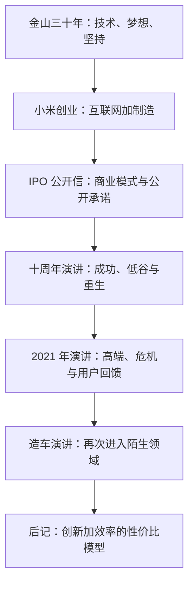
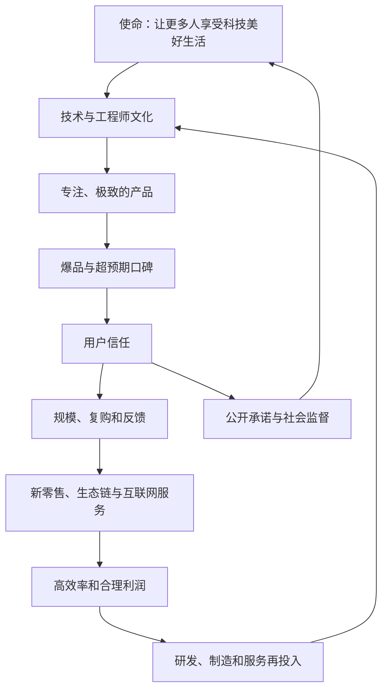

> 范围：后记《什么是小米模式》、附录“对小米影响最为深远的 5 篇文章”及版权页。 
> 阅读目标：理解后记怎样总结小米模式的价值主张；结合五篇形成于 2018—2021 年的演讲与文章，观察使命、方法、危机决策和战略选择在真实语境中的表达；区分历史材料、作者观点和可迁移的方法。

---

## 一、后记与附录有什么阅读价值

正文是小米十二年实践的系统复盘，后记和附录则提供两类不同材料：

| 材料 | 功能 |
|---|---|
| 后记《什么是小米模式》 | 将全书压缩为“创新、效率、性价比和用户信任”的价值主张 |
| 2018 年 IPO 公开信 | 向投资者说明公司身份、商业模式和 5% 利润承诺 |
| 2020 年十周年演讲 | 从梦想、创业、低谷、国际化到三大铁律的完整时间线 |
| 2021 年年度演讲 | 通过上市、高端、诉讼、情义和用户回馈讲艰难选择 |
| 2021 年造车演讲 | 记录决定进入智能汽车时的个人与公司判断 |
| 2018 年金山三十周年演讲 | 追溯工程师文化、梦想、坚持和长期组织关系的源头 |
| 版权页 | 记录版本、作者、出版和分类等书目信息 |

这些材料多数形成于事件当时或离事件较近的阶段。它们的价值不只是补充故事，还能用于对照正文：哪些认识当时已经形成，哪些是后来复盘才提炼出来的。

---

> **第一部分：后记《什么是小米模式》**

## 二、后记的核心问题

雷军再次回到创业初衷：什么样的公司才算伟大，它怎样对社会产生长期价值？

他的回答不是单看收入、利润或市值，而是看企业能否：

- 用创新持续改善产品；
- 用效率降低无价值损耗；
- 让技术成果被更多人获得；
- 建立企业与用户的合作关系；
- 在自身经营可持续的同时改善产业和社会资源利用。

后记把小米模式概括为一种由创新和效率共同驱动的性价比模型。

---

## 三、溢价模型与性价比模型

### 3.1 作者怎样区分两种模式

雷军把企业大体分为两类：

- 依靠高溢价获得利润；
- 依靠性价比和效率获得规模、信任与合理利润。

在他的论述中，高溢价容易带来：

- 利用信息不透明；
- 运营费用不断上升；
- 企业把注意力放在维持价格而非提高效率；
- 创新成果只服务少数用户；
- 既有利润反而阻碍自我颠覆。

性价比模式则要求企业主动克制利润，以更高效率支撑产品、价格和长期经营。

### 3.2 性价比模式为什么更难

- 单件利润薄，错误缓冲小；
- 库存、费用或质量稍有失控就可能亏损；
- 必须长期维持产品和运营效率；
- 需要规模和快速周转；
- 要忍受较慢的原始积累；
- 不能轻易通过涨价掩盖能力问题；
- 用户对价格和品质承诺有更高期待。

所以，性价比不是一种容易获得销量的低价技巧，而是一种对组织能力要求更高的经营选择。

### 3.3 对“品牌溢价”的必要辨析

后记对品牌溢价持强烈批评态度，这是雷军明确的价值立场。阅读时仍需区分：

- 设计、质量保证、售后、审美、文化和降低选择风险，可以创造真实用户价值；
- 利用信息不对称、虚假稀缺、锁定和市场控制抬高价格，则更接近不合理溢价。

问题不在于价格高，而在于价格增加是否对应用户认可的价值。

---

## 四、创新加效率的“加强型”性价比

### 4.1 为什么只有低价还不够

只降低价格而缺少创新，会陷入低质量竞争。小米模式希望同时：

- 用技术和设计创造明显产品价值；
- 用爆品、规模和制造降低分摊；
- 用新媒体和用户口碑降低沟通成本；
- 用新零售缩短交付链路；
- 用互联网服务和生态提供长期收入；
- 把效率红利更多交给用户。

### 4.2 为什么更容易产生破坏性创新

既有企业若依赖某类高利润产品，可能不愿推出更便宜、更简单的新方案，因为新产品会损害旧利润。

坚持性价比的企业没有同样的利润包袱，更愿意用新技术、供应链和渠道重新定义品类。

这并不意味着低利润企业天然创新。破坏性创新仍需要技术、产品判断、资本和组织能力。

### 4.3 “成熟加速器与孵化器”怎样理解

小米移动电源、手环、净化器等案例显示，一些产品原本需要多年才能完成的成本下降、供应链成熟和大众普及，被集中产品定义与海量需求加速。

小米没有取消行业规律，而是让需求、技术、规模和供应链更快进入正循环。

---

## 五、不合理溢价的粉碎机

### 5.1 要解决的是企业与用户之间的不信任

用户看不清成本、质量和利润，企业又可能利用信息优势提高价格，双方容易陷入互不信任。

小米试图通过：

- 公开参数和成本逻辑；
- 高品质产品；
- 克制定价；
- 5% 硬件利润红线；
- 直接沟通和用户参与；
- 长期售后与服务；

降低信息差，让一次性交易变成可重复合作。

### 5.2 “祛魅”是什么意思

在充满复杂术语、功能噱头和高价的品类中，重新解释核心原理，并以更简单产品证明实际成本和价值。

空气净化器公开风机、滤网和拆机结构，就是典型做法。祛魅不是贬低专业技术，而是让用户知道真正决定体验的是什么。

### 5.3 低价不是最终目的

性价比追求的是价值回归：产品应该更好看、更好用，价格又与真实价值和合理利润相称。

如果低价来自偷工减料、补贴倾销、供应商压榨或员工过度劳动，就没有解决社会效率问题。

---

## 六、“幸福方程式”的商业解释

后记引用一个关于幸福感的简化观点：当人获得的实际效用更多、欲望更简洁准确时，主观幸福更容易提高。

在小米模式中，这被解释为：

- 同样收入可以买到更好的产品；
- 用户不必为信息差和层层加价付费；
- 简洁、实用、长期耐看的产品减少无效消费；
- 品牌信任降低反复比较和防骗成本；
- 科技改善能被更多人共享。

这里的“效用”是用户从商品和服务获得的满意与价值，不只是功能数量。

### 6.1 质朴消费不等于消费降级

后记推崇无印良品、优衣库等代表的简洁、实用消费观。它反对的是浮华、浪费和不必要欲望，不是要求所有人选择最低价格或放弃审美。

更健康的消费是把资源投入真正重要、使用频率高和长期有价值的事物。

### 6.2 这一观点的边界

幸福无法由商品价格单独决定。健康、关系、安全、公平、环境和个人选择同样重要。商业可以降低生活成本、改善产品，却不能把消费增加直接等同于幸福增加。

---

## 七、小米模式的长期意义

### 7.1 供给升级与需求扩展

当企业提高效率、降低不合理价格，消费者可以用相同收入获得更多或更好的产品，节省的资源还能用于其他消费和投资。

作者进一步认为，这可能带动：

- 更多有效需求；
- 新投资和生产；
- 就业和产业升级；
- 供应链规模与创新；
- 更快资金和库存周转。

### 7.2 宏观推论需要谨慎

从个别企业的效率提升推到整个经济增长，中间还受收入分配、竞争结构、储蓄、进口、环境和政策等因素影响。

后记提供的是一种方向性经济直觉，不是经过本书数据验证的宏观定律。

### 7.3 三层意义

| 视角 | 小米模式的意义 |
|---|---|
| 企业经营 | 创新产品、缩短链路、提高效率并获得合理利润 |
| 消费文化 | 倡导质朴、适用、透明和价格厚道 |
| 社会经济 | 希望提高生产、流通和消费之间的资源利用效率 |

### 7.4 后记的最终态度

雷军再次强调，这些思考仍然粗浅、有局限，需要更多企业和实践者参与讨论与修正。

这与前言首尾呼应：本书不是最终理论，而是一份阶段性复盘。

---

> **第二部分：附录的五篇历史材料**

## 八、怎样阅读附录

附录文章形成时间、受众和目的不同：

- 写给投资者的公开信强调商业模式和承诺；
- 周年演讲强调共同记忆和组织士气；
- 年度演讲强调艰难选择与个人感受；
- 造车演讲需要解释重大新业务；
- 金山庆典演讲强调长期文化和传承。

因此，它们带有公开传播和动员属性。适合用于理解当时立场和叙事，不应把所有修辞、预测与自我评价当作已证明事实。

---

> **第三部分：2018 年 IPO 公开信**

## 九、《小米是谁，小米为什么而奋斗》的历史语境

这篇文章位于小米 IPO 招股书首页，面对潜在投资者。它要回答：

- 小米是什么公司；
- 为什么硬件利润低；
- 公司怎样获得长期利润；
- 用户信任为何构成商业价值；
- 上市后是否会改变使命。

它既是公司介绍，也是对未来股东的公开承诺。

---

## 十、小米的公司身份

### 10.1 不只是硬件公司

公开信把小米定义为创新驱动的互联网公司，手机和智能硬件是产品与用户入口，软件、互联网服务、新零售和生态链共同组成商业系统。

这种定义强调：

- 硬件不是唯一利润来源；
- 设备售出后仍有服务关系；
- 用户、账号和设备组成长期平台；
- 渠道效率是产品价值实现的一部分。

### 10.2 科技公司属性不能被商业模式掩盖

“互联网公司”不应被理解为小米只重流量和变现。公开信同时强调工程师、创新、设计和产品。

若硬件缺少核心技术和质量，再好的互联网服务也无法维持用户入口。

### 10.3 历史数字的边界

公开信使用 2018 年前后的全球排名、用户和 IoT 连接数。这些数据只反映上市时状态，不代表今天的市场位置。

---

## 十一、低谷为何被用来证明模式

公开信回顾 2016 年市场下滑和 2017 年恢复，将“创新、质量、交付”补课视为公司成熟的过程。

它希望向投资者说明：

- 公司经历过严重危机；
- 失败原因来自内部能力；
- 整改改善了管理、技术和供应链；
- 用户信任帮助公司恢复；
- 商业模式不是只在顺境中有效。

“充分验证”仍是作者判断。一次恢复不能证明模式在所有周期都成立，但比只经历高速增长提供了更强证据。

---

## 十二、铁人三项的投资者表达

公开信将小米模式概括为：

1. 提供设计和品质出众的硬件；
2. 通过高效线上线下渠道直接交付；
3. 持续提供互联网服务。

硬件获取和服务用户，新零售降低渠道损耗，互联网服务提供长期收入。三个模块都围绕同一用户，才能形成闭环。

投资者需要特别关注：

- 低硬件利润是否有足够服务利润支撑；
- 用户是否真正活跃；
- 不同地区服务变现能力是否相同；
- 广告和服务是否损害设备体验；
- 多模块协同是否超过组织复杂度。

---

## 十三、5% 利润红线的公开承诺

### 13.1 承诺内容

小米宣布硬件综合净利润率不超过 5%，超出部分以合理方式回馈用户。

它的作用是把“价格厚道”从创始人信念变成公开制度，让用户、员工和投资者都能据此监督。

### 13.2 为什么写给投资者尤其重要

限制硬件利润可能影响短期财务预期。上市前公开，意味着投资者购买股票时已知晓这项约束，减少上市后目标冲突。

### 13.3 不能误读承诺范围

- 约束硬件综合净利润，不是单品毛利；
- 不限制互联网服务和集团全部利润；
- 不表示所有硬件都必须以成本价销售；
- 仍需覆盖研发、质量、售后和风险；
- “合理方式回馈”需要持续披露和解释。

### 13.4 用户价值与投资价值的关系

公开信主张，公司长期价值只能来自用户价值持续扩大。这个观点要求管理层不把股东和用户简单对立，而是通过规模、效率和服务让双方长期获益。

它成立的前提是商业模型能持续盈利，不能只依赖承诺和情怀。

---

## 十四、全球化开放生态

公开信认为，只靠一家小米无法完成普惠科技使命，需要生态链创业者、供应商、渠道和全球伙伴共同参与。

开放生态应当：

- 让伙伴保持独立；
- 共享技术、渠道和用户价值；
- 允许不同公司获得合理收益；
- 尊重数据和知识产权；
- 避免以平台权力排斥竞争；
- 根据不同国家本地化。

全球化不是把中国模式原样复制，而是让核心价值与当地产品、渠道、服务和法规结合。

---

> **第四部分：2020 年小米十周年演讲**

## 十五、《小米从哪里来，又将往哪里去》的结构
> **原书图示**：小米十周年主题演讲
这篇演讲以十周年为节点，分为：

1. 梦想与团队；
2. MIUI、手机和生态链创业；
3. 膨胀、低谷、MIX 和质量补课；
4. 国际化危机与意外机会；
5. 上市、科技园和世界 500 强；
6. 三大铁律和新十年策略。

它把正文前四章和第十四章的核心内容放在一条个人叙事时间线上。

---

## 十六、焦虑时先改变可控制的事

演讲开场讲疫情期间通过每天走路缓解焦虑。它传达一个简单方法：外部环境不可控时，从可执行的小行动开始恢复秩序感。

可迁移做法是：

- 选择自己能控制的行动；
- 设定明确、可持续目标；
- 通过每日完成获得反馈；
- 先恢复状态，再处理复杂决策。

个人经验不能替代专业心理和医疗支持，严重焦虑仍应寻求帮助。

---

## 十七、梦想与找人

### 17.1 原始梦想

小米希望做接近世界最好水平的手机，同时让普通人买得起。实现路径是把软件、硬件和互联网结合起来。

### 17.2 找人占据创始人主要时间

雷军通过林斌、洪锋等故事说明：新公司没有品牌和确定性，优秀人才也在反向面试创始人。

创始人需要反复讲清：

- 为什么值得做；
- 自己知道什么、不知道什么；
- 团队怎样互补；
- 风险和机会；
- 候选人能承担什么关键责任。

“三十顾茅庐”强调投入，不意味着骚扰候选人或忽视自主选择。

---

## 十八、MIUI：复杂目标从最小切口开始
> **原书图示**：小米创业团队从 MIUI 起步
团队没有硬件和自己的手机，就基于开源安卓先做好电话、短信、通讯录和桌面四项核心功能。

100 位刷机用户、每周更新、XDA 推荐和全球社区再次验证：

- 复杂工程可以先找到第一把扳手；
- 早期用户质量比数量重要；
- 口碑来自真实产品；
- 用户参与能加快学习；
- 国际化有时从产品社区先发生。

---

## 十九、做手机的三次艰难选择

### 19.1 争取夏普供应

日本地震后，创始团队仍按计划赴大阪洽谈，向顶级供应商证明诚意。
> **原书图示**：小米创始团队拜访夏普
案例说明初创公司获得供应链信任需要创始人背书、长期承诺和承担风险。它不意味着所有情况下都应忽视人身安全；决策必须基于真实风险评估。

### 19.2 从 1499 元调整到 1999 元

实际成本高于计划后，小米没有长期亏本销售，也没有降低旗舰定义，而是调整价格。

核心原则是：价格厚道不等于维持错误报价，企业健康和产品品质都是长期用户价值的一部分。

### 19.3 推倒第一版红米

第一套产品体验不达标后，团队放弃已有研发投入，重新开发最终上市版本。
> **原书图示**：红米计划推动国产供应链
已经花掉的成本不应迫使企业交付不合格产品。用户只面对最终产品，不会因企业投入很多而降低要求。

---

## 二十、生态链故事的简化表达

演讲用电饭煲案例说明：生态链通过专业创业团队、小米产品方法和渠道，把中国制造能力转化为更高品质、更合理价格的产品。

街头盲测等故事具有传播性，不能替代系统质量数据。真正需要观察的是长期使用、售后、销量和独立品牌能力。

---

## 二十一、膨胀、“十亿赌局”与低谷

### 21.1 公开赌局的反思

小米与格力的营收赌局最初用于活跃节目，后来成为长期社会话题。雷军将其归因于成功后的信心膨胀，并承认制造业积累值得学习。

公开目标可以激励组织，也可能：

- 简化复杂竞争；
- 让团队追逐单一规模；
- 增加不必要舆论压力；
- 造成对伙伴和行业的不尊重。

### 21.2 低谷暴露能力缺口
> **原书图示**：小米手机业务陷入低谷
高速成长掩盖的研发、交付、质量和管理问题在 2015 年集中爆发。雷军亲自接管手机部，进入长期补课。

### 21.3 MIX 与工程师文化

MIX 从工程师对未来手机形态的讨论出发，穿越低谷并成为全面屏代表产品。
> **原书图示**：MIX 代表小米低谷中的技术探索
它说明危机中不能把所有长期创新砍掉；探索项目也需要与核心技术方向相关，并留下可复用能力。

### 21.4 创新和质量的关系

演讲总结：创新决定产品能达到的高度，质量决定企业能走多远。

创新没有质量只能停在样机；质量没有创新则难以形成竞争力。

---

## 二十二、国际化中的十亿元库存

小米进入印度初期，对品牌和渠道准备过度乐观，一次安排大量 3G 旗舰手机，最终形成巨额库存。

### 22.1 错误来自哪里

- 以中国热销推断印度需求；
- 品牌认知不足；
- 渠道尚未建立；
- 订单规模过大；
- 3G 向 4G 切换降低了退回中国销售的可能；
- 缺少分阶段验证。

### 22.2 救火为什么反而产生新能力

三人团队到多个地区寻找仍有 3G 需求的市场，与新贸易商和代理合作，最终建立一批国际渠道。
> **原书图示**：库存危机推动国际渠道开拓
危机可以逼出能力，但损失仍然真实。不能用意外收获合理化前期错误；更好的方法是小批量试点、本地研究和逐步加单。

---

## 二十三、“R U OK”与平等沟通

印度发布会的即兴英语被制作成网络视频。雷军选择接受调侃并进入 B 站回应，让意外成为长期互动符号。

方法不是主动制造失误，而是放下身份负担，理解用户表达，区分善意玩笑和恶意攻击。

---

## 二十四、三个高光时刻

### 24.1 上市与 5% 红线

上市前，小米以董事会决议约束硬件综合净利润率。股东担心影响上市和估值，最终接受长期用户信任逻辑。
> **原书图示**：上市前公布硬件利润红线
### 24.2 小米科技园

自有园区象征公司从创业团队走向长期组织，也为研发和协作提供基础设施。
> **原书图示**：小米科技园
园区规模是阶段成果，不直接代表效率和创新；真正价值仍由团队和产品决定。

### 24.3 世界 500 强

进入榜单说明收入规模和成长速度，不能单独衡量技术、利润、用户和组织质量。演讲同时引用创新与品牌榜单，用来补充规模之外的观察。

---

## 二十五、小米十年改变了什么

演讲把影响概括为：

- 与同行共同推动智能手机普及；
- 为移动互联网用户基础作出贡献；
- 通过生态链改变多个产品行业；
- 帮助创业者成长；
- 在海外生产与经营中创造就业；
- 推动品质、设计和性价比成为行业标准。

这些是公司视角的贡献叙事。严格评价还应考虑同行、政策、供应链和时代共同作用，避免把行业进步全部归因于单一企业。

---

## 二十六、三大铁律与未来策略
> **原书图示**：三大铁律对应的十周年产品
演讲用三款产品对应：

- 技术为本；
- 性价比为纲；
- 做最酷的产品。

并提出：

- 重新创业；
- 互联网加制造；
- 行稳致远。

十周年材料显示，这些原则并非写书时才出现，而是 2020 年已成为公司新十年的公开表达。

---

> **第五部分：2021 年年度演讲**

## 二十七、《我的梦想，我的选择》的核心
> **原书图示**：雷军 2021 年度演讲
演讲以“选择”为线索，讲述：

- 小米全球排名上升后的冷静；
- 上市破发与公司回购；
- 高端化的两款代表产品；
- 起诉美国政府；
- 重返金山担任董事长；
- 米粉长期支持；
- 首批手机用户十周年回馈。

相比十周年演讲，它更关注决策者在不确定、压力和情感中的选择。

---

## 二十八、全球第二后的冷静
> **原书图示**：小米手机首次进入全球第二
小米取得阶段排名后，雷军提醒不要低估世界级巨头，当前任务是先站稳位置。

这与早期公开喊出全球第一形成对照：

- 目标可以远大；
- 对外表达要尊重差距；
- 短期排名受新品和供应周期影响；
- 站上一次不等于建立长期能力。

---

## 二十九、上市破发与股票回购

### 29.1 选择最低发行价仍然破发

小米希望股票也“价格厚道”，采用发行区间低端，上市首日仍跌破发行价。

资本市场价格受到行业、宏观环境、公司预期和市场情绪影响，不能用产品定价逻辑简单类比股票。

### 29.2 面对投资者批评

投资者直接批评战略、产品和管理，使雷军反思资本市场为何不认可公司。

管理者应听取股东意见，也不能为了短期股价改变长期产品和用户价值。

### 29.3 回购的决策

公司在股价低迷时使用资金回购，表达对自身价值的信心，后来股价恢复。

回购是否正确不能只由事后上涨判断。决策时应考虑：

- 现金是否足够；
- 是否优于研发、并购和债务等用途；
- 公司估值是否被低估；
- 是否影响长期投资；
- 信息披露和治理是否合规。

这段历史不是投资建议，股票后续表现也不能保证未来结果。

---

## 三十、高端之路：小米 10

小米 10 面临成本上升、首次进入更高价格和销量门槛的压力。团队一度思考联名、破圈等复杂手段，最终回到核心用户与产品本身。

疫情初期，小米仍采用纯线上方式按计划发布。
> **原书图示**：疫情期间线上发布小米 10
案例体现：

- 高端化先服务已有核心用户升级需求；
- 产品价值比制造高端形象更重要；
- 特殊环境可以迫使发布方式创新；
- 一代成功只是高端化起点。

---

## 三十一、高端之路：小米 11 Ultra

产品以影像为核心突破，使用大型传感器和明显相机模组，追求极致拍摄体验。
> **原书图示**：小米 11 Ultra 的影像与外观探索
### 31.1 为什么允许产品“不完美”

面向摄影发烧友，团队愿意接受厚重和外观争议，换取影像能力。这是一种清楚人群下的极致取舍。

### 31.2 用户批评说明什么

首发表现和专业排名很好，部分基础体验仍未达到高预期，团队后来持续优化。

高端产品不能只靠一个长板。价格和品牌抬高后，用户会要求性能、软件、质量、设计和服务都没有明显短板。

### 31.3 事后优化的边界

软件问题可以更新，硬件和发布时承诺的核心体验应尽量完整。不能把互联网快速迭代当作交付不成熟高端产品的理由。

---

## 三十二、起诉美国政府

小米被列入美国国防部相关清单后，股价和全球经营受到影响。公司在咨询律师与专家后选择诉讼，并最终获胜。
> **原书图示**：小米通过法律行动维护公司权益
这项决策体现：

- 公众公司要保护股东和业务合法权益；
- 面对强大对手仍可使用制度与法律；
- 决策前要评估胜算、报复风险和证据；
- 透明治理可以成为法律保护基础。

这是特定司法和事实条件下的案例，不能简单推广为任何企业面对监管冲突都应诉讼。

---

## 三十三、情义无价：重返金山

小米创业关键期，金山陷入危机，雷军在联合创始人支持下兼任金山董事长。
> **原书图示**：金山与小米两段创业关系
理性上，这会分散创始人时间；情感上，它关系老伙伴和员工前途。最终结果较好，不表示兼任永远正确。

可迁移判断包括：

- 是否有可靠团队分担；
- 核心业务是否受影响；
- 责任和时间边界是否清楚；
- 选择是否来自长期承诺而非短期情绪；
- 是否具备治理和授权机制。

---

## 三十四、一路同行：用户信任的个人化表达

演讲展示从小米 1 到小米 11 和 MIX 系列的产品历史，并讲述在云南遇到长期使用小米的工程师。
> **原书图示**：小米手机十年代表产品
这类用户故事让抽象的“用户信任”变成具体关系。单个忠实用户不能代表整个市场，却能帮助管理者理解品牌为何被选择。

---

## 三十五、首批用户十周年回馈

小米决定向首批完成付款的手机用户提供等额商城红包，感谢他们在创业最困难时提供第一笔收入。
> **原书图示**：小米向首批手机用户提供十周年回馈
### 35.1 这项行动的意义

- 承认早期用户承担的信任和等待风险；
- 把公司成长与具体用户联系起来；
- 形成强烈的感恩和品牌信号；
- 证明用户关系不只在需要销量时存在。

### 35.2 需要注意的边界

红包在商城使用，与现金退款不同；活动也会带来传播价值。它既是感谢，也是品牌经营，不必把两者对立。

上市公司进行大额回馈还需遵守财务、披露和股东治理要求。

---

> **第六部分：为小米汽车而战**

## 三十六、演讲的定位
> **原书图示**：小米正式宣布进军智能电动汽车
这篇演讲记录 2021 年 3 月正式宣布造车时的思考。它比第十四章更强调雷军个人的职业蜕变、米粉支持和再次创业的情感动因。

---

## 三十七、三次人生蜕变

### 37.1 从程序员到管理者

因意外丢失多年代码，雷军不得不放下程序员身份，专注管理、市场和销售。

故事的意义不在数据丢失本身，而在于外部事件迫使个人重新建立能力结构。

### 37.2 从创业者到天使投资人

出售卓越网后，雷军理解创业者融资和经营的艰难，希望以投资帮助创业者。

### 37.3 从互联网进入硬件

2016 年接管手机部后，他系统学习硬件、制造、交付和质量，使个人和公司同时补课。

### 37.4 蜕变需要什么

- 承认旧经验不再够用；
- 接受声望和能力局部清零；
- 长期学习；
- 忍受不熟练和失败；
- 保持意志与韧性；
- 重新建立专业团队。

蜕变不是不断换赛道，而是在使命需要时重建能力。

---

## 三十八、决定造车的矛盾

支持理由包括软硬件经验、智能生态、用户信任和公司资源；反对理由包括行业复杂、百亿投入、周期长、起步晚和对手机业务的分心。

雷军在较短时间内反复摇摆，说明重大决策不存在只看一面就能得出的答案。

### 38.1 米粉支持的作用

用户送来的长期购物记录和“只要小米造车就会买”的表达，证明品牌拥有高度信任。
> **原书图示**：米粉以长期购买记录表达信任
它能提供早期需求信号和决策信心，却不是安全、产品和真实订单的证明。

### 38.2 资源基础

演讲列举研发团队、手机业务、智能生态和现金储备，说明公司比十年前更有条件进入新行业。

资源多也会带来第十四章所说的大公司三坑，因此必须保持创业心态和行业敬畏。

### 38.3 调研与治理程序

管理层进行了大量行业访谈、内部会议和董事会审议，最终确定长期投入。

数量说明重视程度，决策质量仍取决于观点多样性、反对意见、数据和持续验证。

---

## 三十九、造车初心与长期承诺

演讲把汽车放入个人设备、智能家庭、办公和出行组成的全场景生活，目标是提供高品质智能电动汽车。
> **原书图示**：雷军宣布亲自带队投入小米汽车
“押上声誉”和“最后一次重大创业”表达个人决心，也会形成强烈组织动员。企业项目最终仍应靠团队、制度、质量和治理，不应依赖创始人个人承诺。

汽车安全责任极高，勇气只能支持开始，不能替代敬畏、验证和耐心。

---

> **第七部分：金山为什么能活三十年**

## 四十、这篇文章在附录中的作用
> **原书图示**：金山集团三十周年
前四篇材料主要讲小米，这篇追溯雷军方法论更早的文化源头：

- 尊重技术和程序员；
- 因梦想聚集人才；
- 在失败后长期坚持；
- 不断转型和突破；
- 以兄弟情谊维持长期合作；
- 让年轻人不断成为组织主体。

---

## 四十一、程序员文化

### 41.1 “程序员是老大”是什么意思

不是技术人员拥有无限权力，而是公司尊重专业人才和技术贡献，让工程师可以选择长期专业发展，而不必成为经理才获得地位。

### 41.2 雷军从程序员转向管理

他曾尝试白天管理、晚上编程，最终因数据意外丢失彻底转入管理。这段经历让他既理解技术人员，也理解组织经营。

### 41.3 技术文化为何支撑长期生存

金山在微软、盗版和互联网转型压力下仍持续研发 WPS、安全、游戏和云服务。技术文化使公司能在旧业务受冲击时寻找新战场。

文化仍需配套：

- 技术和管理双通道；
- 用户与产品意识；
- 商业和市场能力；
- 质量与治理；
- 对失败项目的取舍。

第五章盘古失败已经说明，只有技术热情并不足够。

---

## 四十二、梦想与长期坚持

### 42.1 剑网 3 的故事

郭炜炜放弃海外机会，加入资源有限的西山居，坚持武侠游戏梦想。项目首发不及预期后，团队继续修改多年，后来成为重要业务和文化品牌。

### 42.2 坚持为什么不是固执

有效坚持包含：

- 目标仍有用户和文化价值；
- 团队不断修改而非重复旧方案；
- 有负责人承担；
- 公司愿意提供时间；
- 产品结果逐步改善。

若需求已消失、团队不学习或长期没有进展，继续投入可能只是沉没成本。

### 42.3 WPS 等长期业务

金山对 WPS、安全和游戏长期投入，在不同技术时代调整产品和服务形态。这说明长期坚持的是使命与用户价值，不是永远坚持同一技术和商业模式。

---

## 四十三、金山三十年的组织答案

### 43.1 永远让年轻人成为主力

雷军看到大量年轻员工，认为组织年龄增长不代表精神老化。长期公司需要持续给新一代人才责任、空间和回报。

### 43.2 抱团走得更远

创始人与伙伴合作三十年，依赖包容、共同目标和长期关系。

一个人可能决策快，一群人能提供互补能力、纠错和传承。长期合作仍需要清楚治理，而不只是兄弟情谊。

### 43.3 三条干部原则

原文提出：

- 管自己要以身作则；
- 管团队要将心比心；
- 管业务要身先士卒。

它们分别强调自我约束、理解员工和深入业务。

管理者亲自参与不能演变成越级控制。身先士卒的目标是理解问题和承担责任，仍要授权团队。

### 43.4 金山长期生存的综合原因

- 技术立业；
- 尊重人才；
- 使命和梦想；
- 面对失败长期改进；
- 根据时代不断转型；
- 伙伴与团队关系稳定；
- 新一代人才持续接棒；
- 在多个业务中建立生存基础。

这些是演讲中的自我总结，仍需结合金山不同业务历史和外部环境理解。

---

> **第八部分：五篇材料的共同主题**

## 四十四、共同主题一：梦想必须落到产品和能力

五篇材料都强调梦想，但每次都通过具体行动表达：

- 招募人才；
- 做出 MIUI 和手机；
- 调整错误定价；
- 推倒不合格产品；
- 补交付、质量和创新；
- 决定进入高端和汽车；
- 长期坚持 WPS 与游戏。

梦想若没有产品、团队和阶段成果，只是动员语言。

---

## 四十五、共同主题二：信任来自公开承诺与兑现

- IPO 公开信承诺硬件利润红线；
- 低谷中继续坚持价格与产品价值；
- 面对库存和国际化危机承担责任；
- 上市破发后以经营和回购表达信心；
- 向首批用户回馈；
- 米粉信任支持高端和造车。

信任不能靠一次大动作建立。它来自长期重复兑现，也可能因一次严重欺骗快速失去。

---

## 四十六、共同主题三：危机是能力建设的入口

| 危机 | 形成的能力或认识 |
|---|---|
| 盘古失败 | 理解用户、产品和销售 |
| 小米手机低谷 | 交付、创新、质量与管理补课 |
| 印度库存 | 全球渠道和本地化教训 |
| 股票低迷 | 面对投资者与长期价值选择 |
| 高端产品问题 | 从参数领先走向综合体验 |
| 外部制裁 | 法律、合规和全球治理能力 |
| 剑网 3 首发失败 | 长期迭代和文化品牌 |

危机有可能产生学习，不代表危机越多越好。只有诚实复盘并改变系统，损失才可能转化为能力。

---

## 四十七、共同主题四：创始人的作用与边界

附录大量采用第一人称，创始人亲自：

- 找人；
- 见供应商；
- 接管业务；
- 说服股东；
- 决定回购；
- 推动诉讼；
- 宣布造车；
- 维系金山关系。

创始人在关键阶段能提供使命、信用和快速决策。但公司要长期存在，必须把个人能力转化为：

- 管理团队；
- 董事会治理；
- 技术与质量体系；
- 用户反馈机制；
- 公开制度；
- 人才传承。

否则，创始人会成为组织瓶颈。

---

## 四十八、共同主题五：厚道与敬畏

“厚道”指不利用信息差占用户便宜，也包括尊重员工、投资者和伙伴。

“敬畏”指承认新行业、制造、质量、资本和全球规则的复杂性。

只有厚道而没有能力，企业无法兑现；只有能力而缺少厚道，效率收益可能被企业独占。两者共同构成书中理想的商业人格。

---

## 四十九、五篇材料与正文的差异

### 49.1 附录更强调个人叙事

演讲使用紧张、痛苦、感动、勇气等情绪连接听众，正文则更多整理成经营方法。

### 49.2 附录更接近当时认知

例如造车演讲记录进入决策时的信心与不确定；第十四章则加入终局推演和大公司三坑等后来整理。

### 49.3 附录有更强动员目标

IPO 信面对投资者，周年演讲面对员工和米粉，造车演讲需要凝聚新业务信心。因此，其中的强判断和预测应与后续事实分开评价。

### 49.4 正文对附录进行了方法化加工

大量故事被提炼为：

- 第一把扳手；
- 专注、极致、口碑、快；
- 技术为本；
- 和用户交朋友；
- 爆品与高效率；
- 三大铁律；
- 解放思想、实事求是。

读者可以用附录检查这些方法是否真实来自长期实践，而不是写书时临时发明。

---

> **第九部分：事实与阅读边界**

## 五十、历史数据都有时点

附录涉及市场排名、股价、市值、用户数、连接设备数、库存、销量、现金和研发投入。这些均来自文章发表时，不代表当前状态。

尤其是市场排名和股票价格，受统计机构、时间窗口和外部环境影响，不应脱离日期引用。

## 五十一、成功叙事存在事后偏差

知道后来成功后，过去的风险选择容易被讲成必然正确。应同时问：

- 当时有哪些失败可能；
- 是否有其他可行方案；
- 类似选择失败的企业有哪些；
- 结果中有多少时代和运气；
- 若结果相反，是否仍认为过程合理。

## 五十二、用户故事不能代替市场研究

米粉支持和个人故事能说明情感与信任，不能代表全部用户。汽车、高端等重大决策仍需大样本需求、技术和财务验证。

## 五十三、榜单与奖项不能代替完整能力

世界 500 强、影像排名、设计奖和市场份额各自衡量不同侧面。应结合产品质量、用户、利润、技术、组织和社会影响。

## 五十四、公开演讲中的预测不是承诺结果

全球第一、汽车终局、行业集中等属于目标或判断，应在后续事实中检验，不应当作已经发生的结果。

## 五十五、投资与股票内容不是投资建议

公开信、破发和回购故事用于说明公司决策。任何投资仍需独立分析风险、估值、治理和个人承受能力。

---

> **第十部分：版权页与版本信息**

## 五十六、书目信息

- 书名：《小米创业思考》；
- 口述：雷军；
- 整理：徐洁云；
- 出版：中信出版集团；
- 初版时间：2022 年 8 月；
- ISBN：978-7-5217-4527-6；
- 字数：约 346 千字；
- 分类主题：通信企业、工业企业管理和中国经验。

版权页不包含方法论内容，但对引用和判断数据时点很重要。本书反映的是截至 2022 年前后的复盘与认识。

---

> **第十一部分：综合复盘**

## 五十七、后记与附录建立的完整时间线

| 时间 | 材料或事件 | 主要认识 |
|---|---|---|
| 1988—2018 | 金山三十年 | 技术、梦想、坚持与团队传承 |
| 2018 年 5 月 | IPO 公开信 | 公司身份、铁人三项、5% 承诺和开放生态 |
| 2020 年 8 月 | 小米十周年演讲 | 梦想、风险、低谷、国际化和三大铁律 |
| 2021 年 3 月 | 造车演讲 | 蜕变、用户信任和再次创业 |
| 2021 年 8 月 | 年度演讲 | 上市、高端、诉讼、情义与感恩用户 |
| 2022 年成书 | 后记 | 创新加效率的性价比模式及长期意义 |

## 五十八、附录材料对应的核心方法

| 材料 | 最值得提取的方法 |
|---|---|
| IPO 公开信 | 在利益结构变化前，把使命变成公开、可监督的制度 |
| 十周年演讲 | 从梦想到能力，从成功与失败中提炼铁律 |
| 年度演讲 | 艰难时期用事实、责任和长期价值做选择 |
| 造车演讲 | 进入陌生领域前充分调研，并为长期投入做好准备 |
| 金山三十年演讲 | 技术文化、梦想、坚持与代际传承支持长期组织 |
| 后记 | 用创新和效率服务大众，同时承认方法仍需验证 |

## 五十九、全书最终形成的经营闭环

## 六十、阅读整本书后可使用的检查清单

面对一个商业方法或重大决策，可以依次问：

1. 它服务哪个用户和真实问题？
2. 是否符合使命与长期原则？
3. 企业拥有哪些能力，缺少哪些能力？
4. 价值来自产品创新，还是信息不透明？
5. 价格是否覆盖质量、服务和长期研发？
6. 增长带来真实用户，还是只有流量和交易额？
7. 合作伙伴和员工是否获得合理收益？
8. 试点是否充分，能否安全复制？
9. 失败会留下什么知识与能力？
10. 哪些数据是事实，哪些只是预测和作者判断？
11. 公开承诺能否被验证和长期执行？
12. 方法是否适合自己的行业、阶段和资源？

## 六十一、一页速记

> **后记结论**：小米模式是创新与效率共同驱动的性价比模型。 
> **反对对象**：不是所有高价格，而是依赖信息差、锁定和低效率的不合理溢价。 
> **用户关系**：通过透明、克制利润和长期兑现，从非合作走向信任与合作。 
> **幸福观**：用更少无效成本获得更多真实价值，并倡导质朴、适用的消费。 
> **IPO 公开信**：向投资者说明铁人三项，并用 5% 红线制度化价格厚道。 
> **十周年演讲**：梦想与团队启动小米，风险选择和低谷补课让方法成熟。 
> **国际化教训**：十亿元库存源于对品牌、渠道和需求过度乐观，救火又意外形成全球渠道。 
> **2021 年演讲**：破发、高端、诉讼和用户回馈体现压力中的长期选择。 
> **造车演讲**：用户信任提供起点，行业能力、安全和长期投入决定能否兑现。 
> **金山三十年**：尊重技术、坚持梦想、持续转型和伙伴关系构成长寿组织。 
> **阅读边界**：演讲有动员与叙事属性，数据有时点，目标和预测不等于结果。 
> **最终启示**：一家公司的方法不是口号，而是它在顺境、低谷和重大选择中反复使用，并愿意公开接受检验的原则。
