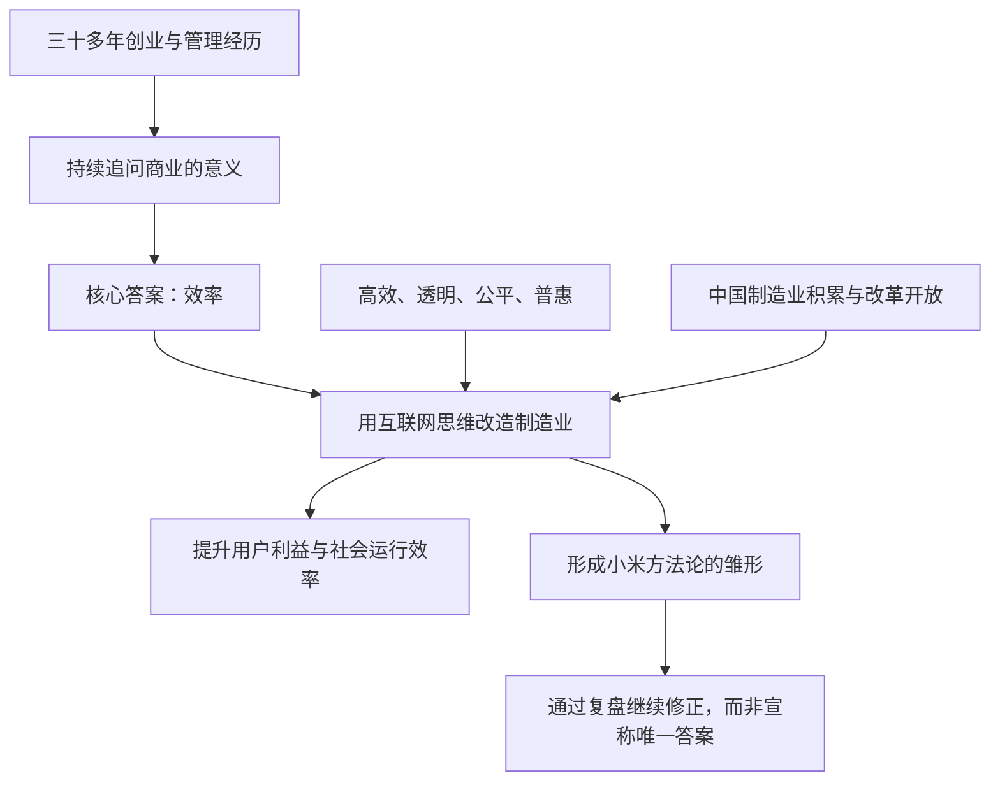

> 书名：《小米创业思考》 
> 作者：雷军 口述，徐洁云 整理 
> 范围：题记“永远相信美好的事情即将发生”与前言全文 
> 阅读目标：理解这本书为什么而写、雷军如何看待商业效率、互联网与制造业的关系，以及阅读全书时应把握的方法和边界。

---

## 一、前言在全书中的作用

前言篇幅不长，却集中交代了全书最重要的几件事：

1. 这本书不是抽象的商业理论，而是小米创业十二年的复盘；
2. 雷军对商业的核心判断是“效率”；
3. 小米长期在做的事，是用互联网思维改造传统制造业；
4. 互联网不只是工具，还应当追求高效、透明、公平和普惠；
5. 书中的方法来自小米的具体实践，不是唯一答案，也不能脱离条件照搬。

前言的阅读重点，不是记住几个响亮的词，而是看清这些词之间的关系：**效率是目标，互联网思维是方法，制造业是实践场景，用户利益是检验结果。**

---

## 二、“这是一本复盘之书”

### 2.1 复盘不是回忆成功故事

雷军首先说明，本书的核心内容来自小米十周年总结。2020 年上半年，他和同事们用了大约半年时间，重新讨论小米创业以来的经历，并形成一系列结论。

这里的“复盘”不是按时间讲一遍发生过什么，而是要回答：

- 当时想解决什么问题；
- 为什么选择这种做法；
- 最后得到了什么结果；
- 哪些结果来自正确的方法，哪些带有时代和运气因素；
- 哪些做法以后还能用，哪些需要修正。

对企业而言，经历本身不会自动变成能力。只有把经验整理成可以被团队理解、讨论和重复使用的方法，经历才有长期价值。

### 2.2 为什么十周年适合做深度复盘

小米的前十年不只有高速增长，也经历了增长放缓和后来的恢复。这样的完整过程比单纯的成功故事更有分析价值：

- 顺境能看出公司抓住了什么机会；
- 低谷能暴露原有模式和能力的缺口；
- 恢复增长能检验公司是否真正找到了问题并完成修正。

因此，读这本书不能只找“小米为什么成功”，还要特别关注“小米为什么失速”以及“它怎样补课”。失败和调整往往比高光时刻更能说明方法是否可靠。

### 2.3 怎样看待创业者自己的复盘

创始人复盘有独特价值，因为他知道许多外部观察者看不到的决策背景、组织矛盾和取舍过程。但它也有明显局限：

- 知道结果后，容易把当年的尝试讲得过于顺理成章；
- 成功者容易高估自身能力，低估时代机会和外部支持；
- 同一种方法在其他行业、公司和阶段未必有效。

阅读时应把书中的结论当作**来自小米实践的经验总结**，而不是普遍适用的商业定律。最有价值的做法，是理解方法解决了什么问题，再判断自己的条件是否相似。

---

## 三、三十多年经历与“答案在风中飘荡”

### 3.1 跨行业经历带来的共同问题

雷军回顾了自己在软件、电商、游戏、移动互联网、云服务、消费电子、物联网和智能汽车等领域的经历。这些行业差异很大：

| 业务 | 经营中的突出问题 |
|---|---|
| 软件 | 研发、复制、授权和渠道 |
| 电商 | 商品、库存、物流和周转 |
| 游戏与互联网服务 | 用户活跃、留存和持续运营 |
| 消费电子 | 研发、供应链、制造、质量和库存 |
| 物联网 | 多品类连接与生态协同 |
| 智能汽车 | 长研发周期、重投入、安全和法规 |

正因为这些业务很不一样，雷军才会追问：撇开行业表面的差异，商业活动中有没有一个共同的重要问题？他的答案是效率。

### 3.2 “答案在风中飘荡”的含义

这句话强调的不是答案神秘，而是商业认识需要长期形成。人在不同阶段会得到不同答案，新的行业和新的失败又会迫使人修正旧认识。

这也提醒读者：本书不是雷军一次性发现的“终极真理”，而是三十多年经验不断碰撞后形成的阶段性认识。

---

## 四、核心判断：商业的目的是效率

### 4.1 这里的效率是什么

效率最直观的意思是：

- 用更少的资源，提供同样的价值；
- 用同样的资源，提供更多或更好的价值；
- 减少信息、渠道、库存和组织中的无效损耗；
- 让技术、产品和服务更快地到达更多用户。

雷军关心的不是单个部门少花了多少钱，而是整个商业链条是否更有效。若企业只是压低供应商价格、削减售后或让员工长期超负荷，自己的账面成本可能下降，但社会总成本没有减少。这属于成本转移，不是真正的效率提升。

### 4.2 为什么效率能让更多人受益

当企业减少了不必要的营销、渠道和库存成本，同时提高研发、制造和交付能力，就有机会做到两件事：

1. 产品品质更好；
2. 产品价格更容易被大众接受。

价格下降后，原来买不起或觉得不值得的用户也能使用产品。这就是雷军所说的“给最多的人带来最大化的美好幸福感”。它不是单纯追求便宜，而是希望更多人用合理价格得到高品质产品。

### 4.3 效率红利必须真正交给用户

企业提升效率后，可以选择把节省下来的成本变成更高利润，也可以选择降低价格、提高品质和服务。只有后一种选择，效率才会明显转化为用户利益。

因此，小米后来提出高性价比、低硬件利润和硬件综合净利润率不超过 5% 等约束。它们的作用，是避免企业在效率提高后把全部收益留给自己。

### 4.4 效率不等于一味压缩

商业中至少有几种不同的效率：

| 效率方向 | 主要问题 | 小米方法中的体现 |
|---|---|---|
| 产品效率 | 投入能否变成用户真正需要的价值 | 专注、爆品、技术和品质 |
| 交易效率 | 商品能否以较短链路到达用户 | 电商、新零售、减少中间环节 |
| 组织效率 | 信息和决策能否快速流动 | 扁平沟通、快速反馈 |
| 创新效率 | 能否更快发现问题并改进产品 | 用户参与、快速迭代 |

这些效率有时会冲突。例如，库存压得过低会增加缺货风险，团队压得过紧会损害创新，渠道层级过少也可能让售后和体验不足。真正的效率是在保障产品、用户和长期发展的前提下减少浪费，而不是把任何一项成本压到最低。

### 4.5 这一判断的适用边界

效率非常重要，但不能单独回答所有商业问题。企业还需要考虑：

- 产品是否安全可靠；
- 员工、供应商和合作伙伴是否得到合理回报；
- 用户数据与隐私是否被尊重；
- 企业行为是否造成环境和社会成本；
- 公司是否保留应对风险和长期研发的能力。

如果只追求短期速度和低价，反而可能破坏长期价值。效率应当服务于人，而不是把人变成效率指标的附属品。

---

## 五、小米十二年“只干了一件事”

### 5.1 这件事是什么

雷军将小米十二年的工作概括为：**用互联网的思维和方法改造传统制造业，实践和丰富“互联网+制造”。**

这个概括包含三个层次：

1. 制造业负责把技术变成真实产品；
2. 互联网方法帮助企业直接连接用户、快速获得反馈；
3. 两者结合，降低从产品定义到交付使用的整体成本。

### 5.2 互联网方法能改变制造业的哪些环节

| 制造业中的传统问题 | 互联网方法带来的改变 |
|---|---|
| 产品远离真实用户 | 社区和线上渠道直接收集反馈 |
| 研发周期长、反馈慢 | 持续迭代，缩短发现和修正问题的时间 |
| 产品型号过多、资源分散 | 聚焦少数爆品，提高单品规模 |
| 营销依赖大规模广告 | 依靠产品体验、用户参与和口碑传播 |
| 渠道层级多、价格高 | 电商与新零售缩短交付链条 |
| 库存信息传递慢 | 用销售和用户数据改善预测与周转 |

这套方法的重点不是“在网上卖货”，而是让用户更早进入产品开发和经营过程，让信息更快地流动。

### 5.3 互联网方法不能替代制造能力

小米创业时对制造业“一知半解”，互联网经验帮助它找到新的切入方式，却不能直接解决硬件研发、供应链、交付、质量和售后问题。

小米后来的低谷说明，互联网方法只能放大已有能力，不能凭空创造制造能力。产品卖得越快，供应链和质量问题也可能被放得越大。企业最终仍要补齐行业基本功。

### 5.4 “只干了一件事”应怎样理解

小米实际经营的业务很多，“只干一件事”不是说业务单一，而是说这些业务围绕同一条主线展开：通过技术、产品、渠道和服务的配合，提高用户获得科技产品的效率。

判断一项新业务是否仍在这条主线上，可以问：

- 它是否服务同一批用户；
- 是否复用了已有技术、品牌、渠道或供应链；
- 是否改善了产品体验或交付效率；
- 是否让整个系统更强，而不是只增加规模和复杂度。

---

## 六、从“互联网工具”到“互联网精神”

### 6.1 工具本身没有固定立场

雷军说，互联网作为技术工具没有善恶对错。相同的连接、数据和算法能力，既可以用来提升服务，也可能被用于操纵用户、制造信息壁垒或过度收集数据。

因此，技术能力不能自动保证好的结果。决定结果的还有企业的价值观、制度约束和利益模式。

### 6.2 雷军理解的互联网精神

前言用四个词概括互联网理想：

| 原则 | 通俗理解 | 对企业的要求 |
|---|---|---|
| 高效 | 信息更快流动，协作和交易损耗更少 | 缩短反馈、决策和交付链条 |
| 透明 | 用户更容易了解产品、价格和规则 | 少依赖信息差，清楚说明服务与收费 |
| 公平 | 不利用平台地位设置不合理门槛 | 尊重选择权，避免强制和歧视 |
| 普惠 | 技术成果能服务更广泛的人群 | 降低使用成本，让好产品不只属于少数人 |

这四个词既是对互联网早期理想的概括，也是雷军评价商业模式的价值标准。

### 6.3 理想不会自动成为现实

现实中的互联网也会出现平台垄断、信息封闭、算法诱导、隐私侵犯和数字鸿沟。开放的技术可以产生封闭的商业生态，免费的服务也可能以用户注意力和数据作为代价。

所以，前言使用了很多“应该”，是在表达互联网应当走向什么方向，而不是声称现实已经如此。企业必须通过产品规则、治理方式和外部监管，让技术尽量朝这些目标发展。

---

## 七、互联网不是只属于互联网公司

### 7.1 为什么雷军不赞同“互联网下半场”

所谓“互联网下半场”，通常是指网民增长放缓、流量红利消失，互联网行业从争夺新增用户转向争夺存量用户。

雷军不完全赞同，是因为他关注的范围更大。他认为，消费互联网的用户增长可能放慢了，但互联网对制造、零售、农业、教育、医疗和公共服务的改造才刚刚深入。

两种说法观察的是不同问题：

- 若看网民和移动应用数量，早期高速增长确实会结束；
- 若看数字技术进入实体经济的深度，新的阶段才刚开始。

### 7.2 从幼儿期走向青春期

“青春期”这个比喻强调，互联网开始离开纯线上场景，进入更加复杂的现实世界。进入实体经济后，它必须面对：

- 真实的生产和物流；
- 质量、安全与法规；
- 不同地区和人群的差异；
- 长周期投入和组织协作；
- 技术产生的社会影响。

这时，互联网企业不能只追求流量和增长，还要承担更成熟的责任。

---

## 八、四组“应该”构成的价值坐标

### 8.1 尊重人，而不是束缚人

技术应帮助人获得信息、表达意见、提高能力和自由选择，而不是通过上瘾设计、强制授权或高转换成本把用户锁在系统里。

判断标准很简单：用户是否知道发生了什么，是否有真实选择，是否能方便退出。

### 8.2 解放生产力，而不是制造割裂

互联网应降低跨组织协作和信息流动的成本。若平台各自建立封闭规则、数据不能合理流动、用户被迫重复建设关系，整个社会的协作效率反而下降。

开放不代表毫无边界。安全、隐私、商业机密和监管都需要边界，但边界应当服务于保护，而不是成为排斥竞争和锁定用户的借口。

### 8.3 推动开放共享，而不是扩大数字鸿沟

技术可能让掌握设备、知识和数据的人获得更多机会，也可能让缺少这些条件的人被进一步落下。因此，普惠不仅是降低价格，还包括：

- 产品是否容易使用；
- 老年人和残障人士是否能正常使用；
- 不同地区是否能获得基本服务；
- 普通用户是否理解自己的数据权利。

### 8.4 创造社会财富，而不是只吸收流量和财富

平台若只把用户、商家和内容聚集起来收取费用，却没有持续改善生产、交易和服务，它创造的新增价值就有限。

雷军希望互联网成为“耕耘者”：通过技术和组织创新扩大整体价值，再从新增价值中获得合理回报，而不是主要依靠控制入口重新分配已有利益。

### 8.5 四组主张的共同点

四组对照都在回答同一个问题：**企业拥有技术和平台能力之后，应当怎样使用这种能力。**

它们要求企业把人的利益放在流量之前，把长期社会价值放在短期控制力之前。这也是“效率必须服务于人”的进一步说明。

---

## 九、“互联网应该成为公共服务”

### 9.1 这里的公共服务不是指免费或国有化

雷军强调的是基础设施属性：互联网应像一种普遍可用的能力，稳定、透明地服务个人、企业和公共机构。商业公司仍可以提供服务并获得利润，但不能忽视公共影响。

### 9.2 四项具体要求

#### 透明服务于人

产品规则、收费方式、推荐逻辑和数据使用方式应尽量清楚，避免利用复杂条款和信息差让用户被动接受。

#### 方法公布于众

这是对开放、共享和行业共同进步的期待。企业不可能公开全部商业机密，但可以通过开放标准、开发接口、开源项目和最佳实践减少重复建设。

#### 数据属于用户

用户应对个人数据拥有知情、授权、访问、更正、删除和迁移等基本权利。企业保管和处理数据，不等于可以无限制占有和使用数据。

#### 在授权和保护下共享使用

数据流动能提高服务效率，但前提必须是用途明确、授权真实、安全可控。不能用“提升效率”替代隐私保护。

### 9.3 互联网与实体经济结合的三项优势

前言特别提到：

1. **信息汇集能力**：更快了解市场、生产和用户需求；
2. **交互反馈能力**：问题更快被发现，产品和服务更快调整；
3. **数字化管理能力**：过程可记录、可追踪、可分析，复杂协作更容易管理。

当这些能力进入研发、制造、零售和服务，互联网才从一个线上工具变成推动产业升级的引擎。

### 9.4 这项主张面临的现实难题

- 商业秘密与方法开放怎样平衡；
- 数据权利怎样在用户、平台和公共利益之间划分；
- 小企业如何承担安全与合规成本；
- 不同平台怎样建立共同标准；
- 效率、隐私、公平和创新发生冲突时如何取舍。

前言给出了方向，没有提供全部制度答案。读者应把它看作小米方法论的价值原则，而不是已经完成的解决方案。

---

## 十、方法论形成的时代条件

### 10.1 从 2005 年酝酿到小米实践

雷军说，这些思考从 2005 年开始在脑中盘旋，到 2010 年创办小米，再经过十二年探索，才逐步形成方法论雏形。

这个时间过程说明，方法不是先在书斋中设计完整，再交给公司执行，而是在经营中不断形成：先有问题和信念，再通过产品、供应链、渠道和组织实践验证，遇到失败后继续修改。

### 10.2 小米模式依赖的外部基础

雷军主动提到两个重要条件：

- 中国制造业几十年的积累；
- 改革开放和经济发展的时代机会。

还可以从书中看到其他基础：智能手机兴起、移动互联网普及、成熟供应链、电商和物流发展，以及庞大的国内市场。

因此，小米的成功不能只归因于内部方法。方法之所以能发挥作用，是因为团队能力与时代、产业和市场条件形成了配合。

### 10.3 借鉴时不能忽略条件

其他企业学习小米模式时，应先检查：

- 行业是否能形成规模化产品；
- 用户是否愿意在线互动和反馈；
- 供应链能否支持快速增长；
- 低价格是否能明显扩大市场；
- 企业是否有足够资金承担前期投入；
- 后续服务和复购是否能支持长期经营。

如果这些条件不同，就应借鉴原则，而不是照搬做法。

---

## 十一、“我不是经济学家”：作者的方法边界

### 11.1 工程师和创业者视角的优势

这种视角重视具体问题、实施步骤、反馈和改进。书中的方法通常来自真实产品和经营难题，因此贴近实践，也包含许多外部观察者难以获得的细节。

### 11.2 这种视角的局限

- 主要样本是小米一家企业；
- 经验集中在中国科技、制造和零售环境；
- 作者既是参与者，也是解释者；
- 一些价值判断和因果解释仍需要更多外部证据。

雷军明确说这些思考“不完美”“非常简陋”“不是唯一解”，是在提醒读者把方法拿去讨论和验证，而不是把它当作标准答案。

### 11.3 阅读全书的正确方式

遇到书中的一个方法，可以依次问：

1. 它当时要解决什么具体问题；
2. 小米具备哪些前提条件；
3. 实际做法是什么；
4. 如何判断做法有效；
5. 它带来了哪些新问题；
6. 自己的行业与小米有哪些关键差异；
7. 应借鉴原则，还是可以借鉴具体做法。

这样读，得到的是分析和解决问题的方法，而不是一套等待模仿的口号。

---

## 十二、这是一部集体作品

雷军特别说明，本书很大程度上是小米创始团队、管理层和员工的集体作品。

商业方法不是创始人独自在头脑中产生的。它来自不同岗位对产品、技术、供应链、渠道、用户和组织问题的长期处理。创始人可以概括方法，但方法的有效性依赖整个组织的实践。

这也说明企业复盘不能只是管理层总结。应让接近问题的人提供事实和不同视角，才能减少单一叙事造成的偏差。

---

## 十三、小米仍年轻，方法要继续生长

前言最后同时表达了两个目标：希望小米成为百年企业，也希望小米形成的方法比公司本身产生更深远的影响。

这两个目标要求方法保持开放：

- 企业环境变化后，旧方法需要更新；
- 公司规模扩大后，要警惕原有高效率被组织复杂度吞噬；
- 技术能力增强后，要承担更大的用户和社会责任；
- 方法对外传播后，要接受其他行业实践的检验和修正。

“百年企业”不意味着永远坚持同一种做法，而是保持使命和价值原则的同时，持续改变实现方式。

---

## 十四、题记：“永远相信美好的事情即将发生”

这句话表达的是一种面向未来的创业心态。创业需要在信息不完整、结果不确定时投入长期努力，因此信念很重要。

但信念不能代替判断和行动。结合前言全文，它更完整的含义应是：

- 相信技术和商业可以创造更普惠的价值；
- 愿意为这种可能性长期投入；
- 通过实践和反馈不断修正方法；
- 承认失败和不确定性，仍然继续行动。

它不是“只要相信就会成功”，而是“因为相信值得做，所以愿意认真把它做成”。

---

## 十五、前言一页速记

### 15.1 核心概念

| 概念 | 最简理解 |
|---|---|
| 复盘 | 从真实经历中找出可重复的方法，也正视失败和偶然因素 |
| 效率 | 用更少社会资源创造更多真实用户价值，而非转移成本 |
| 互联网思维 | 直接连接用户、快速反馈、开放协作和数字化管理 |
| 互联网+制造 | 用互联网方法改善产品定义、研发、制造、销售和服务 |
| 高效、透明、公平、普惠 | 互联网应追求的价值方向 |
| 公共服务 | 互联网应成为普遍可用、尊重用户权利的基础能力 |
| 方法论边界 | 来自小米的阶段性实践，不是唯一答案，借鉴时必须看条件 |

### 15.2 全篇主线

雷军从三十多年跨行业经历中得出“商业的目的是效率”这一核心判断。小米据此尝试把互联网的连接、反馈和数字化能力带入制造业，让高品质科技产品以更合理的价格服务更多用户。同时，效率必须受到高效、透明、公平、普惠等价值原则约束，否则可能沦为压缩成本、控制用户或转移风险的工具。

这本书的价值，不在于提供一套可以照搬的小米答案，而在于展示一家企业如何从使命出发，在成功、低谷和恢复中不断复盘，逐步形成自己的经营方法。

### 15.3 阅读后续章节时抓住四个问题

1. 这个方法解决了小米当时的什么问题？
2. 它怎样提升了产品、交易、组织或创新效率？
3. 效率提升是否真正转化为用户价值？
4. 它依赖哪些条件，又带来了哪些新的风险？

带着这四个问题阅读后续章节，就能把零散案例连回前言确立的主轴：**用互联网方法提高制造业和商业社会的效率，让技术进步服务更多人。**
