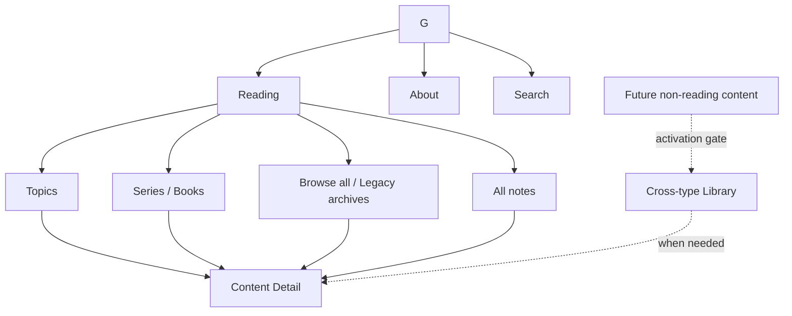

# Jingze's Garden 2.0 产品与体验改版 PRD

| 项目 | 内容 |
| --- | --- |
| 文档状态 | Draft v1.1（已按线上站点校准） |
| 创建日期 | 2026-08-04 |
| 产品形态 | 个人网站 / Digital Garden / 长文知识库 |
| 目标平台 | Desktop、Tablet、Mobile Web |
| 当前技术栈 | Jekyll 4、Chirpy、Liquid、SCSS、原生 JavaScript |
| 主要语言 | 英文界面、中文与英文内容 |
| 关联规范 | `docs/POST_GUIDE.md` |

## 1. 文档目的

本文档定义 Jingze's Garden 下一阶段的产品定位、信息架构、视觉系统、页面结构、交互规则、响应式行为、质量标准和实施顺序，用于指导设计、开发、内容维护与验收。

本次改版不是一次单纯的主题换肤。核心任务是将目前已经形成的“数字花园”内容模型，转化为一套统一、鲜明且易于阅读和探索的产品体验：

- 保留现有网站安静、温暖、具有编辑感的基础气质。
- 通过真实内容关系、精确排版和数据化交互建立科技感，而不是采用霓虹、玻璃拟态或装饰性电路纹理。
- 让 194 篇以上的阅读笔记从“可浏览的文章列表”升级为“可检索、可分组、可连续阅读的个人知识库”。
- 让首页、列表页、归档页、分类页和文章页看起来属于同一个独立品牌，而不是定制首页与默认主题页面的组合。

## 2. 执行摘要

### 2.1 产品定位

> Jingze's Garden 是一个公开生长的个人知识系统：以阅读、工程实践和长期思考为核心，让访客能够快速找到可信的入口，理解知识之间的关系，并舒适地阅读长篇内容。

当前发布阶段应更诚实地表达为 **Reading-first Digital Garden**：先把 194 篇读书笔记和约 14 个系列组织好，再随真实内容增长逐步开放 Notes、Essays、Projects 等路径。界面不提前展示尚不存在的产品形态。

### 2.2 目标体验关键词

- 编辑感：像一本持续修订的独立刊物，而不是新闻流或营销网站。
- 系统感：信息结构、状态、关系和数据表达清楚、精确、一致。
- 温度：保留纸张、墨色、宋体与克制的自然色彩。
- 个性：体现“Garden × Engineering”的个人识别，不依赖通用科技视觉符号。
- 可读：优先保障中文长文、代码、图表和系列文章的阅读体验。

### 2.3 核心策略

1. 先校正内容承诺与元数据质量，隐藏空路径、重复摘要和无区分度筛选。
2. 以 Series 重构 Reading，并优先修复前言到章节、附录的连续阅读顺序。
3. 保留当前合理的正文阅读列，重点治理超长目录、Focus Mode 和搜索摘要。
4. 等第二种内容类型真正形成后再启用跨类型 Library，最后引入真实知识关系可视化。

## 3. 背景与现状

### 3.1 已有资产

当前网站已经具备以下适合继续发展的基础：

- 明确的品牌名称：Jingze's Garden。
- 首页已有独立的 Garden 布局，而非完全沿用主题默认首页。
- 已建立 `type`、`status`、`topics`、`series`、`updated`、`related` 等知识节点元数据。
- 已区分 `seedling`、`growing`、`evergreen` 三种内容成熟度。
- 已有系列上一篇/下一篇、关联笔记、参考资料、目录和专注模式能力。
- 已形成温暖纸色、墨色、铁锈橙、苔藓绿和钢蓝的基础色彩方向。
- 静态站点架构具有良好的性能、SEO、部署和长期维护优势。

### 3.2 当前主要问题

| 编号 | 问题 | 当前表现 | 用户影响 | 优先级 |
| --- | --- | --- | --- | --- |
| P-01 | 全站体验割裂 | 首页与 Reading 使用 Garden 定制布局，Archives、Categories 和 Post 主体仍保留较强的 Chirpy 默认结构 | 品牌识别不连续，内页完成度显著低于首页 | P0 |
| P-02 | Focus Mode 破坏阅读尺度 | 常规正文实测约 746px，已经合理；但专注模式在宽屏可扩张到约 1000px | 开启“专注”后反而增加视线回扫距离 | P0 |
| P-03 | 内容发现能力不足 | Reading 一次渲染 194 篇并按时间倒序排列，没有以约 14 个 Series 作为首要入口 | 新访客难以选书，系列读者首先看到末章 | P0 |
| P-04 | 空栏目暴露 | 首页与导航直接展示数量为 0 的 Notes、Essays、Journal、Projects、Ideas | 削弱网站成熟度，并制造无结果点击 | P0 |
| P-05 | 导航状态不清 | 侧栏选中态与悬停态视觉接近，可能同时出现两个近似高亮项 | 用户难以确认当前位置 | P0 |
| P-06 | 三栏挤压内容 | Archives 和分类页同时使用左侧导航、中央内容和右侧 Recently Updated / Trending Tags | 中央信息密度失衡，中文标题更容易截断 | P1 |
| P-07 | Knowledge Map 名实不符 | 首页称为 Knowledge Map，但当前主要是主题名称与数量组成的静态网格 | 科技感与知识关系没有真正建立 | P1 |
| P-08 | 视觉语义不完全统一 | 橙、绿、蓝、紫色图表和主题默认控件并存，部分颜色角色不明确 | 页面细节显得来自不同系统 | P1 |
| P-09 | 中英文规则不明确 | 英文导航、英文状态、中文分类和中英混合标题同时出现 | 可接受的双语内容变成不稳定的界面语言 | P1 |
| P-10 | 辅助信息重复 | Recently Updated 与主列表重复，Trending Tags 长期占用右栏 | 降低有效内容占比 | P2 |
| P-11 | 元数据缺少区分度 | 171 篇模板摘要、194 篇均为 `growing`、`books` 覆盖全部内容 | 摘要、状态和主题控件看似丰富，实际不帮助决策 | P0 |
| P-12 | 超长目录失控 | 93 分钟文章生成约 191 个 TOC 项 | 目录难以扫描，移动端几乎无法定位章节 | P0 |
| P-13 | 搜索摘要失控 | 搜索结果可包含大段正文、代码和 Mermaid 源文本 | 正确结果被冗长片段淹没，比较成本高 | P0 |

### 3.3 根因判断

现有问题并非缺少样式，而是缺少一套覆盖所有页面的产品级规则：

- Garden 样式主要作用于 `.garden-home` 和 `.garden-index`，默认页面继续使用主题网格。
- 内容 schema 已建立，但展示层未充分利用 `series`，而 `topics`、`status`、`description` 的实际取值仍需治理。
- 页面以单篇文章为基本单位构建，而当前内容规模需要“书籍、系列、主题、状态”多级浏览能力。
- 科技感尚未绑定真实数据和交互，因此只能依靠文字内容表达。

### 3.4 线上走查基线（2026-08-04）

本轮 PRD 校准直接走查了线上首页、Reading、Archives、Category、About、Search 和 93 分钟长文，并在 1440 × 900、390 × 844 与浏览器 150% 缩放场景下检查布局。以下数据作为改版验收的真实基线：

| 维度 | 线上实测 | 产品含义 |
| --- | --- | --- |
| 内容构成 | 194 篇公开内容全部为 `reading`，其他 5 个 Type 均为 0 | 当前产品首先是阅读知识库，不能按成熟的多类型花园设计一级导航 |
| Series | 可从标题与元数据识别约 14 个系列 | Series 是当前最有价值的首要浏览维度 |
| Status | 194 篇全部为 `growing` | Status 暂无区分度，不适合现在占据列表和筛选主位置 |
| Description | 171 / 194 篇使用同一“梳理核心概念、论证结构、适用边界与实践要点”模板 | 摘要目前制造重复噪声，必须先治理或条件隐藏 |
| Topics | `books` 出现在 194 / 194 篇，其余主题为 7 至 44 篇 | `books` 是冗余公共标签，不应进入关系图或默认筛选 |
| Reading 列表 | 首次渲染全部 194 条；页面高度约 29,395px（Desktop）和 43,426px（Mobile） | 单一长列表不可继续作为默认视图 |
| 索引重叠 | Reading、Archives 和名为 Library 的 Categories 页都在组织同一批 194 篇内容 | 应合并职责，不继续增加第四套并列索引 |
| Category 顺序 | AI Engineering 在线顺序为第 10 章到前言 | 时间倒序与系列阅读顺序冲突，章节顺序必须优先修复 |
| 长文结构 | 93 分钟文章含 32 个 H2、145 个 H3、15 个 H4、64 个代码块和 34 个表格 | 普通 TOC 和通用文章尾部不足以承载超长技术笔记 |
| 长文 TOC | 1440px 下生成约 191 个目录链接 | TOC 必须按当前章节渐进展开，不能平铺完整标题树 |
| 正文宽度 | 1440px 常规文章正文约 746px，移动端无页面级横向溢出 | 常规阅读列已经合理，应保留；重点修复 Focus Mode 与超长文导航 |
| Search | 标题匹配准确，但结果可直接包含大段正文、Mermaid 文本和代码内容 | 搜索首要问题是摘要裁剪与结果结构，而不是召回能力 |
| 内容承诺 | Sidebar 和 About 描述 5 个空栏目，并引导用户使用尚不可交互的“知识地图” | 导航、文案和真实可用内容之间需要建立一致性 |

本基线不是永久产品约束。随着 Notes、Essays、Projects 等内容真正发布，信息架构可以按本文定义的触发条件渐进扩展。

## 4. 产品目标与非目标

### 4.1 产品目标

| 编号 | 目标 | 目标说明 |
| --- | --- | --- |
| G-01 | 建立统一品牌体验 | 首页、列表、归档、分类、搜索与文章页使用同一视觉和交互语言 |
| G-02 | 提升长文可读性 | 保持合理阅读列，优化超长目录、章节进度与专注模式 |
| G-03 | 提升内容发现效率 | 当前优先支持按 Series 和 Topic 查找，其他维度按数据成熟度启用 |
| G-04 | 支持连续阅读 | 让用户能从系列入口自然进入章节，并继续上一篇或下一篇 |
| G-05 | 建立独特科技感 | 使用真实知识图谱、等宽元数据、精确网格和状态反馈表达工程气质 |
| G-06 | 保持静态站点优势 | 不引入不必要的后端、账户系统或大型运行时依赖 |
| G-07 | 提升移动端质量 | 保证导航、搜索、目录、代码和图表在小屏上完整可用 |
| G-08 | 建立可维护设计系统 | 将颜色、字体、间距、状态和组件收敛为稳定 token 与规则 |

### 4.2 非目标

- 不把网站改造成社交网络、论坛或内容平台。
- 不在本阶段增加登录、评论账户、收藏同步或跨设备阅读历史。
- 不通过大面积渐变、霓虹色、玻璃拟态、3D 装饰或循环动画营造科技感。
- 不改变现有文章 URL、`uid` 或公开内容目录规则。
- 不一次性重写全部 Chirpy 主题代码。
- 不为了视觉效果牺牲静态生成、首屏性能、SEO 或无障碍能力。
- 不要求为尚未存在内容的栏目编造占位文章。

## 5. 目标用户与核心任务

### 5.1 用户类型

| 用户 | 特征 | 首要需求 |
| --- | --- | --- |
| 搜索到达的读者 | 从搜索引擎或外部链接直接进入某篇文章，对作者和网站不了解 | 快速判断内容是否相关、理解文章结构、舒适阅读 |
| 主题探索者 | 对 AI、软件架构、机器学习、产品或个人成长中的某一主题感兴趣 | 找到该主题下高质量入口和相关内容 |
| 系列阅读者 | 正在按章节阅读一本书或一个专题系列 | 识别顺序、查看进度、继续上一篇或下一篇 |
| 回访读者 | 已经读过部分内容，希望查看最近更新或继续阅读 | 快速定位新增内容、最近维护内容和熟悉的系列 |
| 网站作者 | 持续新增和维护大量笔记 | 不增加过重维护成本，元数据能自动驱动页面 |

### 5.2 Jobs to Be Done

- 当我第一次到达首页时，我希望在 10 秒内理解这个网站是谁的、主要写什么，以及从哪里开始。
- 当我从搜索引擎进入长文时，我希望快速了解文章结构、成熟度、更新时间和预计阅读成本。
- 当我对某个主题感兴趣时，我希望看到该主题下的推荐入口、系列和全部笔记，而不是只看到按时间排序的列表。
- 当我阅读章节笔记时，我希望知道它属于哪本书、位于第几章，以及下一篇在哪里。
- 当我回访时，我希望区分“新发布”和“内容被重新整理”，而不是只看到大量相同日期。
- 当我使用手机阅读时，我希望目录、代码块、图表和导航不会挤压正文或产生横向页面滚动。

## 6. 成功指标

### 6.1 产品指标

上线前先采集不少于 14 天的基线数据。若当前没有分析工具，则第一阶段只接入隐私友好的匿名事件统计，不记录搜索原文或个人信息。

| 指标 | 定义 | 第一阶段目标 |
| --- | --- | --- |
| 首页内容进入率 | 首页会话中点击任意内容详情的比例 | 相对基线提升 15% |
| 搜索成功率 | 打开搜索后点击结果的会话数 / 发起搜索的会话数 | 不低于 65% |
| 列表筛选成功率 | 使用筛选后点击内容的会话数 / 使用筛选的会话数 | 不低于 55% |
| 系列继续阅读率 | 系列文章中点击上一篇、下一篇或章节目录的会话比例 | 相对基线提升 20% |
| 关联内容点击率 | 文章页点击 Related Notes、主题或系列入口的比例 | 相对基线提升 15% |
| 空结果率 | 搜索和筛选产生零结果的次数 / 总查询次数 | 低于 15% |

以上目标用于判断方向，不作为缺少流量样本时的硬性上线门槛。

### 6.2 体验与工程指标

| 指标 | 目标 |
| --- | --- |
| Lighthouse Performance | 移动端与桌面端均不低于 90，目标 95 |
| Lighthouse Accessibility | 不低于 95，关键流程无严重错误 |
| LCP | 第 75 百分位不高于 2.5 秒 |
| CLS | 不高于 0.1 |
| INP | 第 75 百分位不高于 200ms |
| WCAG | 核心页面满足 WCAG 2.2 AA |
| 键盘可达性 | 导航、搜索、筛选、目录、专注模式和返回顶部均可完整操作 |
| 横向溢出 | 320px 宽度下页面主体不得产生非预期横向滚动 |
| URL 稳定性 | 现有公开文章 URL 100% 保持有效 |
| 构建可靠性 | 生产 Jekyll 构建通过，无新增 Liquid 或链接错误 |

## 7. 设计原则

### 7.1 内容先于界面

所有页面首先服务于标题、摘要、正文和知识关系。装饰不得抢占首屏、降低对比度或压缩正文宽度。

### 7.2 编辑温度，计算精度

标题、纸色和留白提供编辑感；状态、时间、编号、筛选和关系图提供工程精度。两者必须同时存在，而不是在“文学博客”和“开发者控制台”之间切换。

### 7.3 真实数据形成科技感

科技感优先来自以下真实信息：

- 内容成熟度。
- 主题之间的连接。
- 系列与章节顺序。
- 最近维护时间。
- 阅读数量与内容增长。
- 搜索、过滤和即时反馈。

### 7.4 渐进式展示复杂度

首页只提供明确入口；列表页提供筛选和分组；主题、系列和文章页再展示完整关系。避免在每个页面同时出现所有导航维度。

### 7.5 状态不可只依赖颜色

`seedling`、`growing`、`evergreen` 必须同时使用文字和形状标记，颜色只作为辅助信号。

### 7.6 动效必须解释变化

只允许用于页面进入、筛选结果更新、搜索展开、目录定位和知识关系响应。所有动效遵循 `prefers-reduced-motion`。

## 8. 信息架构

### 8.1 顶层结构

### 8.2 导航规则

- `Garden`、`Reading` 和 `About` 始终显示。
- `Notes`、`Essays`、`Journal`、`Projects`、`Ideas` 仅在存在公开内容时显示。
- 当前不增加独立的 `Library` 一级入口。`/archives/` 与 `/categories/` 保留为兼容路径，从 Reading 中以 `Browse all` 或 `Browse by subject` 进入。
- 当至少两个 Content Type 有真实公开内容、各自落地页不再为空且确实出现跨类型查找需求时，才启用 Cross-type Library。
- `Topics`、`Categories`、`Tags` 不进入一级侧栏，作为 Reading、Search 和文章关系区中的二级入口。
- About 的“如何阅读这里”只描述当前存在的内容类型；新 Type 上线后自动或同步更新，不提前承诺空栏目。
- 桌面端侧栏最多显示 8 个一级入口；超过时使用 `More` 菜单，不继续纵向堆叠。
- 移动端使用抽屉导航，打开后焦点进入抽屉，关闭后回到触发按钮。

### 8.3 内容维度定义

| 维度 | 作用 | 展示位置 | 规则 |
| --- | --- | --- | --- |
| `type` | 内容形式 | 一级导航、列表筛选、文章元数据 | 只允许固定值；一级入口仅在该 Type 有内容时出现 |
| `status` | 内容成熟度 | 文章页；条件满足后进入列表和筛选 | 至少两种状态有可信内容后才启用筛选；当前不重复展示 194 个 `growing` |
| `topics` | 稳定知识主题 | Themes、主题页、搜索 | 通常每篇 1 至 3 个；全量公共值 `books` 不进入默认 UI |
| `series` | 连续阅读关系 | Reading、系列页、文章导航 | 当前首要浏览维度；同一系列使用稳定 slug 和显式顺序 |
| `categories` | 传统层级归档 | Reading 兼容视图 | 复用现有领域/书籍层级，逐步映射到 Topic 与 Series |
| `tags` | 细粒度关键词 | 搜索、文章尾部 | 不直接全部展示在首页 |
| `updated` | 内容最后整理日期 | 文章元数据；数据可信后进入 Latest Changes | 与首次发布时间明确区分，批量导入日期不驱动首页推荐 |
| `featured` | 编辑推荐 | 首页 Selected Writing | 保持 2 至 5 篇，目标稳定维护 3 篇以上 |

### 8.4 命名与语言规则

- 品牌和全局界面使用英文，例如 Garden、Reading、Search；未来启用 Library 时沿用同一规则。
- 文章标题、摘要、正文和书名保持作者原始语言。
- 同一个控件内不混合语言，例如不要出现“Full archive 归档”。
- Topic 与 Series 使用英文 slug，展示名称通过映射文件提供，允许中文或正式英文名称。
- 状态在界面中显示英文，辅助说明可在首次出现处提供中文 `aria-label` 或 tooltip。
- 日期统一使用 `Aug 4, 2026` 或 `2026-08-04` 其中一种展示格式；同一页面不得混用。

## 9. 全局布局规格

### 9.1 响应式断点

| 视口 | 侧栏 | 主内容 | 辅助栏 |
| --- | --- | --- | --- |
| `>= 1440px` | 固定 248px | 最大 1160px，居中 | 按页面需要显示，最大 272px |
| `1200–1439px` | 固定 232px | 最大 1040px | 最大 248px |
| `992–1199px` | 固定 220px | 占剩余空间 | 文章目录改为弹出层或窄栏 |
| `768–991px` | 抽屉导航 | 100% | 不常驻 |
| `< 768px` | 抽屉导航 | 单列，左右 20px 内边距 | 不常驻 |
| `< 420px` | 抽屉导航 | 单列，左右 16px 内边距 | 不常驻 |

断点以有效 CSS 视口为准，而不是设备物理像素。浏览器缩放后若 `window.innerWidth < 992px`，Sidebar 必须切换为抽屉；在线上实测的 1280px 窗口、150% 缩放场景中，不应继续用 260px 常驻侧栏将正文压缩到约 500px。

### 9.2 网格与间距

- 使用 8px 基础间距系统；允许 4px 用于图标与文字的紧密关系。
- 页面级垂直间距使用 `48 / 64 / 80px`，不得随意出现多个近似值。
- 页面主体采用 12 列逻辑网格；文章正文采用固定阅读列，不随大屏无限扩张。
- 组件边界优先通过留白建立；分隔线只用于列表、主要章节和结构转折。
- 固定格式元素必须有稳定尺寸，悬停、标签和异步结果不得导致布局跳动。

### 9.3 全局外壳

#### Sidebar

- 品牌区包含 `Jingze's Garden` 和一句副标题。
- 品牌标题在 248px 侧栏内保持一行；小屏抽屉中可保持相同字号。
- 导航使用统一线性图标，图标尺寸 18px，文字使用 Title Case。
- 当前项使用左侧 2px 强调线、深色文字和轻底色共同表达。
- Hover 只使用更浅底色，不得与当前项相同。
- Focus 使用清晰的 2px 外轮廓，不能只依赖背景变化。
- 社交入口固定在底部，但移动端进入抽屉正常文档流。
- 每个纯图标按钮提供可访问名称和 tooltip。

#### Topbar

- 桌面高度建议 56 至 60px，滚动时保持粘性。
- 左侧显示最多三级面包屑；超出时折叠中间层，不截断当前页面名称。
- 右侧为 Search；文章页额外显示 Focus Mode。
- 顶部边缘可承载 2px 阅读进度，不额外增加悬浮组件。
- 首页不重复显示无信息价值的单独 `Garden` 标题，可显示简化品牌标识或留空。

#### Footer

- 保留版权、RSS、社交链接和必要许可信息。
- 主题 attribution 若许可证允许则从主视觉中移除；若必须保留，降低为次要文本。
- 不在每个页面重复展示 Trending Tags 或 Recently Updated。

## 10. 视觉设计系统

### 10.1 视觉方向

视觉概念定义为：**Field Notes for Engineered Ideas**。

“Field Notes”对应纸张、阅读、持续维护和户外兴趣；“Engineered Ideas”对应结构化知识、状态、关系、数据和软件工程背景。

### 10.2 颜色 token

以下颜色为建议起点，实施时必须通过对比度测试后微调：

| Token | 建议值 | 用途 |
| --- | --- | --- |
| `--garden-paper` | `#F8F7F2` | 主背景 |
| `--garden-paper-raised` | `#FCFBF7` | 弹层、搜索面板 |
| `--garden-sidebar` | `#EFEEE7` | 侧栏背景 |
| `--garden-ink` | `#252720` | 标题与主文本 |
| `--garden-ink-soft` | `#50534C` | 摘要与次级正文 |
| `--garden-muted` | `#6B6E66` | 日期、数量、辅助信息 |
| `--garden-line` | `#D8D8CF` | 结构分隔线 |
| `--garden-rust` | `#8F5338` | Kicker、重点与品牌强调 |
| `--garden-moss` | `#54705A` | Evergreen、关系节点 |
| `--garden-ochre` | `#80683E` | Growing、阅读状态 |
| `--garden-blue` | `#315F76` | 链接、当前目录、交互状态 |
| `--garden-focus` | `#1F6C8C` | 键盘焦点环 |

颜色约束：

- 主页面不使用大面积单一强调色。
- 链接、状态和品牌强调必须承担固定角色。
- Mermaid、代码高亮、提示框和图表必须从同一 token 系统派生。
- 正文链接不能只依靠颜色，默认提供可识别的下划线或其他文本装饰。

### 10.3 字体系统

建议组合：

- 英文展示字体：`Newsreader`。
- 中文展示字体：`Source Han Serif SC` 或兼容的思源宋体。
- 英文界面与正文：`IBM Plex Sans`。
- 中文界面与正文：`Source Han Sans SC` 或兼容的思源黑体。
- 代码与数据：`JetBrains Mono`，失败时回退至 `Consolas`。

字体规则：

- 全站最多同时加载两个可变字体文件和一个等宽字体文件。
- 中文正文不使用手写体或过细字重。
- 不使用视口宽度驱动字号缩放。
- Letter spacing 默认 `0`；仅英文全大写 Kicker 可使用不超过 `0.08em` 的正字距。

### 10.4 字号与行高

| 元素 | Desktop | Mobile |
| --- | --- | --- |
| 首页 H1 | 54px / 1.04 | 42px / 1.08 |
| 页面 H1 | 48px / 1.08 | 38px / 1.15 |
| 文章 H1 | 40–44px / 1.25 | 32–36px / 1.3 |
| Section H2 | 32px / 1.2 | 28px / 1.25 |
| 文章 H2 | 30px / 1.4 | 26px / 1.45 |
| 文章 H3 | 23px / 1.5 | 21px / 1.5 |
| 中文正文 | 18px / 1.8–1.9 | 17px / 1.8 |
| 列表摘要 | 15–16px / 1.65 | 15px / 1.65 |
| 元数据 | 12–13px / 1.4 | 12px / 1.4 |

### 10.5 表面、边框与圆角

- 页面区段不使用悬浮卡片式容器。
- 卡片只用于搜索弹层、对话框和可重复的独立内容项。
- 常规圆角使用 4px；弹层最大 8px；搜索输入和标签可使用胶囊形。
- 横向纸张纹理透明度控制在 1% 至 1.5%，优先限制在正文或主要内容区域。
- 不允许背景纹理穿过搜索弹层、代码块、图表或高密度控件。

### 10.6 图标

- 统一使用单一图标库和一致的 stroke width。
- 熟悉操作优先使用图标，例如搜索、关闭、上一章、下一章、复制、返回顶部。
- 不熟悉或不可逆操作使用“图标 + 文本”。
- 不手工混用 Font Awesome 的实心、品牌和不同视觉重量图标作为同级导航。

### 10.7 动效

- 页面首次进入：`180–260ms` 的淡入与最大 8px 位移，每页只执行一次。
- 搜索面板：`160–220ms` 展开，不使用弹跳曲线。
- 筛选结果：旧内容轻微淡出，新内容淡入，总时长不超过 200ms。
- 关系图：Hover 或 Focus 时仅高亮一层直接关系，不持续自动运动。
- `prefers-reduced-motion: reduce` 下移除位移和连续动画。

## 11. 页面需求

### 11.1 Garden 首页

#### 页面目标

- 在首屏说明“作者是谁、关注什么、为什么值得继续浏览”。
- 为初次访问者提供 2 至 4 个高质量起点。
- 为回访者展示真正有意义的最近维护内容。
- 通过真实主题关系建立网站个性。

#### 页面结构

1. Masthead。
2. Latest Changes。
3. Selected Writing。
4. Browse by Form。
5. Recent Reading / Projects 条件区。
6. Knowledge Map 或 Themes。
7. Footer。

#### HOME-01 Masthead

- 左侧包含 Kicker、姓名和不超过 3 行的简介。
- 右侧 `Currently Exploring` 最多 3 项，每项不超过 2 行。
- 首屏底部必须露出下一节标题或内容，避免形成封闭 Hero。
- 不使用 Hero 卡片、插画占位或装饰性大渐变。

#### HOME-02 Latest Changes

- 本模块为条件模块：只有当 `updated` 能代表真实内容修订、且最近 30 天存在跨系列的有效更新时才显示。
- 当前批量日期阶段改为 `Continue by series` 或 `Recently added books`，展示 3 至 5 个 Series，不连续展示同一本书的多个章节。
- `updated` 用于排序；若缺失则回退到 `date`。
- 每条展示 Type、Updated、Title、Description。
- 元数据列桌面宽度固定为 136 至 160px，避免占用过多正文空间。
- 移动端元数据改为横向一行，位于标题上方。
- 必须区分 `Published` 和 `Updated` 的语义，不把批量迁移日期伪装成新发布。

#### HOME-03 Selected Writing

- 推荐数量保持 2 至 5 篇，目标稳定维护 3 篇以上；内容质量优先于凑数。
- Desktop 使用“一篇主推荐 + 两篇紧凑推荐”的非对称编辑结构。
- 主推荐可增加一句 `Why start here`，但不引入封面图要求。
- 所有推荐项整体可点击，同时保留可见标题链接和键盘焦点。
- 当没有 `featured` 内容时整节隐藏，不显示空状态。

#### HOME-04 Browse by Form

- 只展示至少包含 1 篇公开内容的 Type。
- 每项展示名称和数量。
- 不展示 `0`，也不显示“Coming soon”占位。
- 不得通过隐藏链接破坏已有 URL；路径仍可直接访问并显示规范空状态。

#### HOME-05 Recent Reading / Projects

- 某一类型为 0 时隐藏对应分栏，并让已有分栏占满宽度。
- Reading 优先显示 3 个 Series 入口，不连续显示同一 Series 的末尾章节。
- Projects 存在时优先展示项目目标和最新状态，而不是通用文章摘要。

#### HOME-06 Knowledge Map

MVP 允许使用可访问的主题矩阵，但标题必须命名为 `Themes`，不得称为 Map。

- MVP 中每个主题名称必须是可点击链接，而不是不可交互的普通文字。
- `books` 等覆盖全部内容的公共值不参与主题数量、排序或关系计算。
- 在真实边关系生成之前，不使用“connected themes”文案。

完整版本要求：

- 节点代表 Topic，尺寸仅在有限范围内反映内容数量。
- 连线代表至少一篇内容同时包含两个 Topic。
- 默认展示最多 12 个主要 Topic，防止图形过密。
- Hover、Focus 或点击节点时高亮直接关系并显示文章数量。
- 点击节点进入对应 Topic 页面。
- 图形旁始终提供等价的文本列表，供移动端、键盘和屏幕阅读器使用。
- 图形不得自动漂移、旋转或持续播放。

### 11.2 Reading 页面

#### 页面目标

将单一文章流升级为按书籍、主题和时间都能使用的阅读资料库。

#### READ-01 页面标题区

- 保留 Kicker、标题和一句定位说明。
- 显示总笔记数、书籍或系列数、最近维护日期。
- 统计信息保持一行紧凑展示，不使用独立数据卡片。

#### READ-02 视图切换

- 提供 `By Series`、`By Topic`、`All Notes` 三段式控制。
- 默认使用 `By Series`；线上约 14 个 Series 可以将默认页面从 194 条压缩为约 14 个高质量入口。
- 当前视图写入 URL query，例如 `?view=series`，刷新和分享后保持状态。
- 切换视图不滚动回页面顶部。
- `Recently Updated` 暂作为 All Notes 的排序方式，只有更新时间通过审计后才提升为独立视图。

#### READ-03 筛选

- 当前支持 Topic、Series 和语言筛选。
- Status 仅在至少两种状态具有经过抽样确认的内容后出现；只有单一 `growing` 时完全隐藏。
- Desktop 使用紧凑菜单或选择器；Mobile 使用底部抽屉。
- 已选筛选在控件旁显示数量，并提供 `Clear all`。
- 筛选更新结果数量，并通过 `aria-live="polite"` 宣告。
- 无结果时解释当前条件，并提供清除筛选操作。

#### READ-04 Series 视图

- 每个系列显示正式名称、笔记数、主题、最近更新日期和一句说明。
- 默认按最近维护排序，可切换为名称排序。
- 点击进入 Series 页面，不在列表中直接展开全部 20 章以上内容。
- 没有 Series 的 Reading 内容归入 `Standalone Notes`。
- Series 内严格按“前言 / 引言 → 第 1 章至第 N 章 → 后记 / 附录”排列，不使用发布时间倒序。

#### READ-05 Topic 视图

- 展示主要 Topic 及文章数量。
- 每个 Topic 下预览最多 3 篇内容，并提供 `View all`。
- Topic 的显示名称由映射数据提供，不直接将 slug 简单替换连字符。

#### READ-06 All Notes 视图

- 使用紧凑内容行，每页 20 至 30 条，首个 HTML 响应不得一次渲染全部 194 条内容行。
- 每条显示 Title、Series、Topics 和 Published / Updated；Status 与 Description 按数据质量条件显示。
- 使用静态分页或显式 `Load more`，不使用无法定位页尾的无限滚动。
- 171 条模板 Description 在完成内容治理前不进入列表；缺少有效摘要时直接省略，不展示重复占位文案。

### 11.3 Archives 兼容页与未来 Library

#### LIB-01 当前职责

- `/archives/` 与 `/categories/` 保持现有 URL，用于兼容外部链接和提供无 JavaScript 的完整浏览路径。
- 当前阶段不让 Archives、Categories 与 Reading 同时争夺“书籍入口”职责；Reading 是主入口，Archives 只提供按领域和书籍的紧凑索引。
- 叶级 Category 与 Series 一一对应时，优先增强现有 Category URL 为 Series 页面，避免创建内容重复的新 URL。

#### LIB-02 布局

- 移除默认常驻的 Recently Updated 和 Trending Tags 右栏。
- 主区域使用完整可用宽度，最大 1040 至 1160px。
- 当前顶部只提供 Series / Subject 浏览和总数量，不展示无区分度的 Type、Status、Year 筛选。
- Desktop 可使用左侧局部筛选栏加右侧结果；不得同时再增加第三栏。
- Mobile 使用单列和筛选抽屉。

#### LIB-03 未来 Library 启用条件

- 至少两个 Content Type 已有真实内容和可用落地页。
- 用户需要跨类型按 Topic 或时间查找，而 Reading 无法满足该任务。
- 启用后默认按 Type 分组，并支持 Topic、Series、Year；在此之前不实施复杂的跨类型筛选 UI。

#### LIB-04 空间效率

- 避免当前两列分类数量不一致造成的大面积空洞。
- 使用按内容自然增长的 Masonry 式视觉结果时不得改变键盘阅读顺序；优先使用规则 CSS Grid 或单列分组。
- 中文长标题允许自然换行，不使用单行省略号作为主要展示方式。

### 11.4 Topic、Category 与 Series 页面

#### TAX-01 统一页头

- 面包屑、图标、名称、数量和描述使用统一结构。
- 只在存在描述时展示描述，不生成模板化占位文字。

#### TAX-02 Series 页面

- 展示书籍或系列名称、作者、主题、笔记数量和系列简介。
- 章节按明确顺序排列，优先读取显式序号，而不是依赖发布日期。
- 现有叶级 Category 与 `series` slug 一致时复用其 URL 和 SEO 权重；不得同时生成内容相同的 Category 页与 Series 页。
- 当前阅读文章在章节列表中具有清晰状态。
- 允许显示章节覆盖情况，但不使用“完成百分比”暗示作者必须覆盖整本书。
- 章节行展示序号、标题、状态和最后维护日期。

#### TAX-03 Topic 页面

- 顶部展示 Topic 定义和相关 Topic。
- 内容优先按 Type 分组，再按 Updated 排序。
- 推荐 1 至 3 篇 `Start here` 内容；没有推荐时不显示该模块。

#### TAX-04 Category 兼容

- 保留现有 Category URL 和层级关系。
- 视觉上使用新的统一页头与内容行。
- 不再附加重复的默认右侧栏。

### 11.5 文章页

#### 页面目标

支持 5 至 100 分钟的中文与英文技术内容阅读，并让用户随时理解当前位置、文章状态和知识关系。

#### POST-01 阅读列

- 保持当前约 746px 的常规正文宽度；允许范围为 720 至 780px。
- 包含固定目录时，文章加目录总宽度不超过 1120px。
- 无目录时正文仍保持阅读列宽，不扩张到整个页面。
- 普通中文段落目标每行约 32 至 42 个汉字，代码和表格除外。

#### POST-02 文章页头

- 标题下依次展示 Description、Garden Meta、Publication Meta。
- Garden Meta 包含 Type、Status、Last Tended。
- Publication Meta 包含 Published、Author、Read Time。
- 两组信息在视觉上明确但保持紧凑，避免左右两端距离过大。
- 文章标题在 Desktop 最大 44px，超长标题自然换行。

#### POST-03 阅读进度

- 顶部 Topbar 边缘显示 2px 阅读进度。
- 进度只按 `.content` 主体计算，不包含文章尾部推荐和 Footer。
- 进度组件不得引起布局位移。
- 屏幕阅读器无需持续播报百分比。

#### POST-04 目录

- Desktop 宽屏显示粘性目录，宽度 248 至 272px。
- 普通文章支持两级视觉层次；H4 及以下不进入常驻目录。
- 超长文章默认只展示 H2，展开当前 H2 下的 H3；切换章节时收起上一组，避免一次平铺约 191 项。
- 超过 20 个 H2 时显示当前位置，例如 `7 / 32`，并提供目录内快速筛选或跳转。
- 当前章节同时使用文字强调和左侧标记。
- 标题默认最多显示两行；仍截断时提供完整 tooltip。
- Tablet 和 Mobile 使用弹出目录，不挤压正文。
- 目录打开后应锁定背景滚动并管理焦点。

#### POST-05 Focus Mode

- Desktop 下隐藏主侧栏、非目录辅助信息和 Footer 干扰项。
- 正文仍保持 720 至 780px，不得扩张到 1000px 以上。
- 有目录时保留目录；无目录时正文居中。
- 退出按钮使用熟悉图标加简短标签，状态文案与全站语言规则一致。
- `Esc` 可退出，状态允许保存在本地，但不得跨设备假定同步。

#### POST-06 正文排版

- H2 前保留明显章节间距，H3 与所属内容保持紧密。
- 段落、列表、引用、图表和代码块使用统一垂直节奏。
- 链接具有可见下划线；标题锚点只在 Hover 或 Focus 时出现。
- 有序列表的多行内容与正文起始位置对齐。
- 中英文混排时，英文和数字不使用不自然的额外字距。

#### POST-07 代码、表格与图表

- 代码块提供语言名称和复制按钮。
- 代码行不得撑开整个页面；小屏允许代码块内部横向滚动。
- 表格在小屏使用内部滚动容器，并提供可感知的溢出提示。
- Mermaid 主题从 Garden token 派生，移除与主色板无关的默认紫色。
- 图表必须具有标题或替代说明。

#### POST-08 长文支持

- 阅读时间超过 30 分钟时，在页头显示更明显但克制的阅读成本。
- 系列文章在正文前提供系列名称与当前位置，例如 `10 of 14`。
- 阅读时间超过 60 分钟或目录项超过 80 个时标记为 Ultra-long：正文前增加章节概览，移动端提供当前 H2 与上一节 / 下一节导航。
- 目录项超过 120 个时必须进行编辑复核：优先合并过细标题；若拆分不会破坏单章论证，再拆成多个稳定子页面。
- 正文结尾顺序为：Series Navigation、Related Notes、References、Tags / Categories、License / Share。
- Related Notes 最多展示 4 条，避免长尾区域失控。

### 11.6 Search

#### SEARCH-01 入口

- Desktop 显示搜索图标、`Search` 和快捷键提示。
- Mobile 显示图标按钮，点击后进入全屏搜索层。
- `/` 或平台约定快捷键打开搜索，但输入框聚焦时不得抢占按键。

#### SEARCH-02 搜索范围

搜索索引至少包含：

- Title。
- Description。
- Topics。
- Series display name。
- Type。
- Tags。
- 正文可作为低权重字段，但不得让长文词频淹没标题匹配。

#### SEARCH-03 结果

- 每条显示 Type、Title、命中摘要、Series 或 Topics。
- 摘要限制为 2 至 3 行或约 160 至 220 个字符；不得直接输出完整段落。
- Mermaid 源文本、代码、表格序列和纯导航标题不进入结果摘要。
- 标题命中优先于正文词频；同一 Series 的大量章节命中时仍应保留系列上下文，便于比较。
- 匹配词使用可访问高亮，不改变文字宽度造成明显跳动。
- 支持键盘上下选择、Enter 打开、Esc 关闭。
- 初始状态展示最近维护内容或推荐入口，不显示空白面板。
- 零结果时提供清晰提示和可选的 Topic 入口。

## 12. 核心组件规格

### 12.1 Content Row

- 最小点击高度 76px，紧凑模式不得低于 60px。
- Desktop 由固定元数据列和弹性内容列组成。
- 标题最多自然换行两至三行，不使用强制单行截断。
- Description 缺失时不保留空白区域。
- 整行 Hover 可以变化背景，但标题必须保留独立链接语义。

### 12.2 Status Marker

- 由圆点或环形图形加状态文字组成。
- `seedling`、`growing`、`evergreen` 使用不同文字和辅助颜色。
- 标记不可使用填满背景的胶囊标签，以避免列表产生大量视觉噪声。
- 当结果集合只有一种 Status 时，列表和筛选器不重复展示 Marker；文章详情仍可保留一次状态说明。

### 12.3 Topic Link

- 默认表现为轻量文本链接，不把所有 Topic 渲染成描边胶囊。
- 搜索筛选器中的已选 Topic 可以使用可移除的紧凑 Chip。
- Topic display name 必须来自映射，不直接依赖 slug 格式化。

### 12.4 Segmented Control

- 用于 Reading 的三种视图，不用于普通导航。
- 控件具有固定高度和稳定宽度，切换时布局不移动。
- 当前项具备背景、文字和 `aria-pressed` 或对应语义。
- Mobile 可横向滚动，但必须露出下一项的一部分提示可滚动性。

### 12.5 Icon Button

- Desktop 可见目标不小于 36 × 36px，Mobile 触控目标不小于 44 × 44px。
- 未配文字时必须有 `aria-label` 和 tooltip。
- Hover、Focus、Pressed、Disabled 四种状态均需定义。

### 12.6 Empty State

- 只用于用户主动进入无内容路径、筛选无结果或搜索无结果。
- 说明发生了什么，并提供一个最相关的下一步。
- 首页不得展示栏目级空状态。
- 不使用插画填充空白。

## 13. 响应式与移动端要求

### 13.1 Mobile 导航

- Topbar 保留品牌返回入口、搜索和菜单。
- 侧栏作为左侧抽屉或全屏菜单，不在正文上永久占宽。
- 抽屉打开时背景不可滚动，支持 Esc 和遮罩关闭。

### 13.2 Mobile 首页

- Masthead 改为单列，Currently Exploring 位于简介下方。
- Selected Writing 全部改为纵向，不保留桌面分隔结构造成嵌套卡片感。
- Browse by Form 在 421 至 767px 使用两列，在 420px 以下使用一列。
- Knowledge Map 默认使用文本关系列表，图形作为可选增强。

### 13.3 Mobile 列表

- 元数据位于标题上方并横向排列。
- 摘要最多显示 3 至 4 行，但不能裁剪标题。
- 筛选器固定在页面标题下方时必须避免遮挡锚点定位。

### 13.4 Mobile 文章

- 正文左右内边距：小于 420px 为 16px，其余移动端为 20px。
- 目录使用全屏或接近全屏 Dialog。
- 代码与表格只允许自身横向滚动，页面主体不得横向滚动。
- 标题、长 URL、英文长单词和文件路径必须可安全换行。
- 返回顶部按钮不得遮挡正文、脚注、分享或下一篇入口。

### 13.5 横屏与 Tablet

- Tablet 不显示三栏结构。
- 横屏设备优先保留正文宽度，目录使用弹层，不通过缩小字号硬塞入一行。
- 150% 与 200% 浏览器缩放按有效视口执行同样的 Reflow 规则；不得保留桌面侧栏后再压缩正文。

## 14. 无障碍要求

### 14.1 语义结构

- 每页只有一个主 `h1`。
- 页面区段使用连续标题层级，不为视觉尺寸跳级。
- 导航、搜索、目录、筛选、正文和 Footer 使用正确 landmark。
- 提供可见于 Focus 时的 Skip to Content。

### 14.2 键盘与焦点

- 所有交互可仅使用键盘完成。
- Focus 顺序与视觉阅读顺序一致。
- Dialog 打开后焦点进入，关闭后回到触发元素。
- 不移除浏览器焦点环而不提供替代样式。

### 14.3 对比度

- 正常文字与背景对比度至少 4.5:1。
- 大文字至少 3:1。
- 图标、边界和必要状态信息至少 3:1。
- Muted 文本若承载日期、状态或导航信息，仍需满足正常文字标准。

### 14.4 触控与缩放

- 主要触控目标不小于 44 × 44px。
- 页面在 200% 缩放下仍可完成所有操作。
- 不禁用浏览器缩放。

### 14.5 图形与动态内容

- Knowledge Map 必须提供文本等价内容。
- 筛选结果数量使用克制的 `aria-live` 更新。
- 阅读进度不高频向辅助技术播报。
- 动画遵循 Reduced Motion。

## 15. 内容与编辑规范补充

### 15.1 首页推荐维护

- 始终维护 2 至 5 篇 `featured: true` 内容，目标稳定达到 3 篇以上。
- 推荐内容应覆盖不同主题或内容形态，避免全部来自同一本书。
- 每季度至少复核一次入口是否仍代表作者当前关注方向。

### 15.2 Description

- 列表中的 Description 应说明文章解决的问题或读者会获得什么。
- 不使用“围绕某某梳理核心概念、论证结构、适用边界与实践要点”之类高度重复模板。
- 建议长度为中文 35 至 80 字或英文 90 至 180 个字符。

### 15.3 更新时间

- `date` 表示首次公开时间。
- `updated` 表示内容层面的最后整理时间。
- 只修改标点、错别字或样式时不更新 `updated`。
- 批量迁移不得让所有文章在 Latest Changes 中同时表现为刚刚更新。

### 15.4 Series 数据

完整 Series 页面至少需要以下可推导或可选数据：

- 稳定的 `series` slug。
- 展示名称。
- 简短说明。
- 章节顺序。
- 可选作者、封面、外部书籍链接。

若当前 Front Matter 缺少显式章节顺序，应优先增加向后兼容的可选字段，而不是从中文标题中解析数字。

### 15.5 上线前数据治理门槛

| 数据问题 | 当前基线 | 首发处理 | 后续治理 |
| --- | --- | --- | --- |
| 模板 Description | 0 / 194；治理前为 171 / 194 | 列表与搜索不把模板文案当有效摘要 | 已逐篇改写并加入构建门禁，保持模板与重复摘要为 0 |
| 单一 Status | 194 / 194 为 `growing` | 隐藏列表 Marker 与 Status 筛选 | 内容状态经过复核且至少两种状态有可信内容后启用 |
| 公共 Topic | 0 / 194；治理前 `books` 为 194 / 194 | 从 Themes、筛选和关系图中排除 | 已从 Front Matter 移除并加入构建门禁，由 `type: reading` 表达同一语义 |
| 批量日期 | 发布与维护时间高度聚集 | 首页不使用逐章 Latest Changes | 建立真实维护历史后再启用 Recently Updated |
| 空 Type | 5 个 Type 为 0 | Sidebar、首页与 About 不展示为现有路径 | 首篇内容及有效落地页上线后自动出现 |

以上处理优先采用条件展示和集中数据映射，避免为了改版一次机械修改 194 篇正文。

## 16. 数据与分析

### 16.1 建议事件

| 事件 | 触发时机 | 建议属性 |
| --- | --- | --- |
| `garden_nav_click` | 点击一级导航 | `destination` |
| `home_featured_click` | 点击首页推荐 | `content_uid`, `position` |
| `search_open` | 打开搜索 | `source` |
| `search_result_click` | 点击搜索结果 | `content_uid`, `position` |
| `reading_filter_change` | 修改 Reading 筛选 | `filter_type`, `result_count` |
| `reading_view_change` | 切换 Reading 视图 | `view` |
| `series_navigation_click` | 点击章节或上一篇/下一篇 | `series`, `direction` |
| `toc_click` | 点击目录项 | `heading_level` |
| `focus_mode_toggle` | 开启或关闭专注模式 | `enabled`, `has_toc` |
| `related_content_click` | 点击关联内容 | `relationship_type` |

### 16.2 隐私要求

- 不记录搜索原文；如确需分析零结果词，应本地聚合或获得明确隐私评估。
- 不记录文章正文选区、复制内容或可识别个人的信息。
- 不为了指标增加阻塞页面加载的第三方脚本。
- 分析脚本加载失败不得影响任何核心功能。

## 17. SEO、性能与兼容性

### 17.1 SEO

- 保留现有 canonical、feed、sitemap 和文章 URL。
- Title、Description、Open Graph 和结构化数据继续由 Front Matter 驱动。
- Series 和 Topic 页面提供唯一标题与描述，避免薄内容索引页。
- 隐藏空栏目时，不删除已有合法页面；空页面可按内容策略选择 `noindex`。

### 17.2 性能预算

- 首屏不加载 Knowledge Map 的重型交互代码；进入视口或用户请求后再增强。
- 新增 JavaScript 建议控制在 30KB gzip 以内，不含已有搜索索引。
- 字体使用子集化、`font-display: swap`，避免加载整套不必要字重。
- 避免为了简单筛选引入大型前端框架。
- 动画只使用 `opacity` 和 `transform` 等低成本属性。

### 17.3 浏览器范围

- 最新两个稳定版本的 Chrome、Edge、Firefox 和 Safari。
- iOS Safari 与 Android Chrome 为移动端必测环境。
- 无 JavaScript 时仍可浏览导航、文章、系列和基础归档；搜索与即时筛选允许降级。

## 18. 技术实施边界

### 18.1 保留项

- Jekyll 静态生成流程。
- 现有 Front Matter 核心字段与内容目录。
- 现有公开 URL、Feed、Sitemap 和 SEO 逻辑。
- Chirpy 中仍有价值的 PWA、搜索、目录和构建能力。
- `garden-series-nav`、`garden-connections` 和 `focus-mode` 的现有基础能力。

### 18.2 主要改动面

| 范围 | 可能涉及文件 |
| --- | --- |
| 全局网格与辅助栏规则 | `_layouts/default.html`、`_sass/layout/` |
| 首页结构 | `_layouts/home.html`、`_sass/_garden.scss` |
| Type 列表 | `_layouts/garden-index.html`、`_tabs/*.md` |
| Reading / Archives / Categories | `_layouts/garden-index.html`、`_layouts/archives.html`、相关 include |
| Category / Topic / Series | 对应 layout、plugin 与 include |
| 文章阅读体验 | `_layouts/post.html`、`_sass/pages/_post.scss` |
| Sidebar / Topbar | `_includes/sidebar.html`、`_includes/topbar.html` |
| Search | `_includes/search-*`、`_javascript/` |
| 设计 token | `_sass/_garden.scss` 或拆分后的 abstracts/theme 文件 |

### 18.3 实施约束

- 不直接编辑 `_site/`、`assets/css/` 中的生成产物。
- 新组件优先复用现有 Liquid include，不在多个 layout 中复制逻辑。
- Topic display name、Series metadata 等结构化信息使用 YAML 数据文件或 Front Matter，不通过字符串拼接猜测。
- 任何依赖 JavaScript 的核心交互必须提供基础 HTML 降级。
- 每阶段都可独立发布，不允许长期维护新旧两套平行页面。

### 18.4 数据迁移策略

当前 `content-schema.rb` 只强制校验 `uid`、`type`、`status`、`topics` 和 `description`；`knowledge-links.rb` 已生成 Related、Backlinks 和 Series 上一篇/下一篇，其中 Series 暂时按文章 `date` 排序。改版应在这一基础上渐进增强：

1. Phase 1 不要求批量修改现有文章 Front Matter，先通过条件展示去除无效元数据噪声。
2. Phase 1 建立 Series-first 页面并确保页面呈现顺序正确；可先复用现有生成器的升序结果和日期回退。
3. Phase 2 新增集中式 Series 元数据，例如 `_data/series.yml`，保存展示名、说明、作者和可选外部链接。
4. 新增可选 `series_order` 后，生成器优先按显式顺序排序；缺失时继续回退到当前日期排序，确保旧文章兼容。
5. Schema 对同一 Series 内重复的显式顺序给出构建错误，但不要求所有旧内容立即补齐顺序。
6. Topic 展示名新增 `_data/topics.yml` 映射；未配置项继续回退为格式化 slug。
7. 逐系列迁移时先处理章节较多、访问价值最高的书籍，并为每个已迁移 Series 增加顺序测试。
8. `updated` 历史数据单独审计，不与视觉改版混在同一批机械修改中。

## 19. 分阶段范围

### Phase 0：基线与设计系统

目标：为后续改版建立可度量、可复用基础。

- 记录关键页面基线截图与 Lighthouse 数据。
- 统一颜色、字体、间距、圆角和 Focus token。
- 定义 Sidebar、Topbar、Content Row、Status Marker。
- 明确英文界面与内容语言规则。
- 建立 5 个目标视口的视觉回归检查。
- 建立线上数据质量报告：Type、Status、Topic、Series、Description 和 Updated 分布。
- 定义模板 Description、公共 Topic 和单一 Status 的条件隐藏规则。

### Phase 1：MVP 阅读与一致性

目标：优先解决截图中最明显、影响最大的体验问题。

- 统一首页、Garden Index、Archives、Category 和 Post 的主网格。
- 侧栏缩窄，并区分 Active、Hover、Focus。
- Sidebar、首页和 About 隐藏 0 内容入口及空分栏。
- Reading 默认改为约 14 个 Series 入口，并确保前言到附录正序。
- All Notes 首次只渲染 20 至 30 条，不再输出 194 条单页长列表。
- 保持常规正文 720 至 780px，修正 Focus Mode 约 992px 的过宽正文。
- 将 191 项级超长 TOC 改为 H2 默认层与当前 H3 渐进展开。
- 搜索摘要限制长度，并过滤 Mermaid、代码与表格文本。
- 重构文章页头元数据与目录。
- 移除 Archives / Category 的重复右侧栏。
- 明确 Reading、Archives、Categories 三者职责，避免重复入口。
- 统一 Mermaid、代码块、链接和 Muted 文本色彩。
- 保留现有功能与 URL。

### Phase 2：内容发现

目标：让近 200 篇内容能够被高效查找和连续阅读。

- Reading 完成 Series、Topic、All Notes 三视图与 URL 状态。
- 增加 Topic、Series、语言筛选；Status 继续由数据门槛控制。
- 完善 Series 元数据和显式章节顺序。
- 按优先级改写 Featured、Series 和高访问文章 Description。
- 改善 Search 索引、结果元数据和键盘操作。
- 增加阅读进度与更完整的长文导航。

### Phase 3：品牌深化

目标：在不牺牲阅读和性能的前提下建立独特识别。

- 将 Themes 升级为真实 Knowledge Map。
- Selected Writing 使用非对称编辑布局。
- 增加真实数据驱动的轻量状态反馈。
- 仅在至少两个 Content Type 形成后评估启用 Cross-type Library。
- 完善暗色或低光阅读主题，前提是所有图表、代码和对比度均完成适配。
- 进一步清理残余 Chirpy 默认视觉，但保留稳定底层能力。

### 实施状态（2026-08-04）

- Phase 1 已完成并上线。
- Phase 2 技术项已完成：三视图与 URL 状态、Topic / Series / 语言就绪筛选、显式 `series_order`、Topic 页面、字段加权搜索、阅读进度与 Ultra-long 导航。
- Phase 3 已完成非对称 Selected Writing；Themes 继续保持可访问文本矩阵。
- 194 篇内容治理已完成：171 条模板 Description 已逐篇改写，公共 Topic `books` 已全部移除；构建门禁阻止两者回归。
- 13 个 Series 已集中补齐作者并提供章节 `uid` 锚点；文章元数据和 Series 导航可定位当前章节。
- `tools/content-quality.rb` 提供可重复的数据盘点与启用门槛报告；当前 65 篇超过 120 个 TOC 项，已列入人工编辑复核清单。
- Knowledge Map 暂缓：当前排除公共值 `books` 后，194 篇内容的 Topic 共现边数量为 0，不满足真实关系图启用条件。
- Status 筛选、Latest Changes 和 Cross-type Library 暂缓：当前仍是单一 `growing`、批量更新时间、单一 Content Type。
- 低光主题与匿名分析等待产品决策；`updated` 历史审计属于后续编辑治理，不通过自动生成内容替代。

## 20. 优先级需求清单

| ID | 需求 | 优先级 | 阶段 | 工作量预估 |
| --- | --- | --- | --- | --- |
| R-001 | 隐藏空 Type 并同步 About 内容承诺 | P0 | Phase 1 | S |
| R-002 | Reading 默认 Series-first | P0 | Phase 1 | L |
| R-003 | Series 按前言、章节、附录正序 | P0 | Phase 1 | M |
| R-004 | All Notes 分页或显式加载 | P0 | Phase 1 | M |
| R-005 | 模板摘要、单一状态与公共 Topic 降噪 | P0 | Phase 1 | M |
| R-006 | 超长 TOC 渐进展开与章节定位 | P0 | Phase 1 | M |
| R-007 | 搜索摘要裁剪与内容过滤 | P0 | Phase 1 | M |
| R-008 | 修正 Focus Mode 阅读宽度 | P0 | Phase 1 | S |
| R-009 | 收敛 Reading / Archives / Categories 职责 | P0 | Phase 1 | M |
| R-010 | 移除归档和分类重复右栏 | P0 | Phase 1 | S |
| R-011 | Sidebar Active / Hover / Focus 与缩放 Reflow | P1 | Phase 1 | M |
| R-012 | 统一全站主网格 | P1 | Phase 1 | M |
| R-013 | Reading Topic / All Notes 视图与 URL 状态 | P1 | Phase 2 | L |
| R-014 | Series 元数据与显式顺序 | P1 | Phase 2 | L |
| R-015 | Topic display name 映射 | P1 | Phase 2 | M |
| R-016 | 重构 Post Header 与阅读进度 | P1 | Phase 1/2 | M |
| R-017 | Mermaid 与代码视觉统一 | P1 | Phase 1 | M |
| R-018 | 首页非对称 Selected Writing | P2 | Phase 3 | M |
| R-019 | 可访问 Knowledge Map | P2 | Phase 3 | L |
| R-020 | 条件启用 Cross-type Library | P2 | Phase 3 | L |
| R-021 | 低光阅读主题 | P2 | Phase 3 | L |
| R-022 | 匿名产品事件统计 | P2 | Phase 0/2 | M |

## 21. 验收标准

### 21.1 全局

- [ ] 首页、Reading、Archives、Category、Series 和 Post 使用统一的颜色、字体、内容宽度与交互状态。
- [ ] 1440px 视口下侧栏不超过 252px。
- [ ] Active、Hover 和 Keyboard Focus 三种导航状态可被视觉区分。
- [ ] 任何核心页面均不出现由布局造成的横向页面滚动。
- [ ] 150% 与 200% 缩放下按有效 CSS 视口折叠 Sidebar，正文不会被常驻侧栏压缩到约 500px。
- [ ] 所有现有文章 URL 在改版前后保持可访问。

### 21.2 首页

- [ ] 首屏能看到作者、定位、Currently Exploring 和下一节内容提示。
- [ ] 数量为 0 的 Type 不出现在 Browse by Form。
- [ ] Sidebar 与 About 不把 0 内容 Type 描述为当前可用路径。
- [ ] Project 为 0 时不展示项目空状态，Reading 自动占满可用宽度。
- [ ] Selected Writing 不存在时整节隐藏。
- [ ] 静态主题矩阵若仍存在，标题使用 Themes 而不是 Knowledge Map。
- [ ] Themes 中不显示公共值 `books`，主题名称可点击；没有真实边时不使用 `connected` 文案。

### 21.3 Reading、Archives 与 Series

- [ ] Reading 默认只展示约 14 个 Series 入口，并可切换到 Topic 与 All Notes。
- [ ] 视图和筛选状态刷新后保持。
- [ ] 筛选无结果时可以一键清除。
- [ ] All Notes 首个 HTML 响应包含不超过 30 个内容行，不一次渲染全部 194 篇。
- [ ] 每个 Series 按前言 / 引言、第 1 章至第 N 章、后记 / 附录正序展示。
- [ ] 只有单一 `growing` 时不显示 Status 筛选和重复 Marker。
- [ ] 模板 Description 不在列表中重复出现。
- [ ] Reading、Archives 与 Categories 有明确主次，不产生内容相同的并列 Series 页面。
- [ ] Archives 和 Category 页面不再同时出现两个全局侧栏和一个内容栏。

### 21.4 文章页

- [ ] Desktop 正文宽度保持在 720 至 780px。
- [ ] Focus Mode 下正文仍保持在 720 至 780px，不从实测 746px 扩张到约 992px。
- [ ] 目录在宽屏常驻，在 Tablet 和 Mobile 使用 Dialog。
- [ ] 目录项可使用键盘访问，当前章节状态不只依靠颜色。
- [ ] 191 项级目录默认只显示 H2 与当前 H2 的 H3，不在常驻目录显示 H4。
- [ ] 超过 20 个 H2 时可看到章节位置，并能直接跳转上一节或下一节。
- [ ] 代码块、表格和 Mermaid 在 375px 视口下不撑开页面。
- [ ] Series、Related、References 和 Tags 的尾部顺序一致。

### 21.5 Search

- [ ] `AI Engineering` 等标题查询优先返回相关 Series 章节。
- [ ] 每条摘要不超过 3 行或约 220 个字符。
- [ ] 搜索结果摘要不出现 Mermaid 源文本、长代码或表格序列。
- [ ] 结果显示 Series 上下文，并支持键盘选择、打开与关闭。

### 21.6 无障碍与质量

- [ ] 核心页面通过自动化无障碍扫描，无严重错误。
- [ ] 仅使用键盘可完成导航、搜索、筛选、目录和专注模式流程。
- [ ] 正文、导航、元数据和状态文本达到目标对比度。
- [ ] Reduced Motion 模式下不存在非必要位移动画。
- [ ] Production Jekyll Build、JavaScript Lint 和 SCSS Lint 通过。

## 22. 测试计划

### 22.1 必测页面

- Garden 首页。
- Reading 默认视图和每种筛选状态。
- Reading、Archives 与 Categories 三个现有索引入口。
- 内容较多的 Category。
- 10 篇以上内容的 Series。
- 93 分钟级长文章。
- 无 TOC 的短文章。
- 包含 Mermaid、代码块、表格和长英文路径的文章。
- 空 Type 页面与搜索零结果页。

### 22.2 必测视口

| 设备类型 | 视口 |
| --- | --- |
| Small Mobile | 320 × 568 |
| Standard Mobile | 375 × 812 |
| Tablet | 768 × 1024 |
| Laptop | 1280 × 800 |
| Desktop | 1440 × 900 |
| Wide Desktop | 1920 × 1080 |

### 22.3 验证方式

- 生产 Jekyll 构建。
- JavaScript 和 SCSS Lint。
- HTML 链接检查。
- Lighthouse Mobile / Desktop。
- Playwright 截图和关键交互测试。
- 键盘完整走查。
- 150% 与 200% 浏览器缩放及 Reflow 走查。
- Windows、macOS、iOS 和 Android 至少各一次真实设备或可靠模拟验证。

## 23. 风险与应对

| 风险 | 影响 | 应对 |
| --- | --- | --- |
| 中文字体文件过大 | LCP 与首屏文字闪动 | 使用子集、可变字体、合理 fallback，仅加载必要字重 |
| Chirpy 网格耦合较深 | 页面统一时出现回归 | 分阶段替换 layout，先建立视觉回归基线 |
| 现有 Series 缺少显式顺序 | 章节排序不可靠 | 增加可选顺序字段并提供兼容回退 |
| Topic slug 缺少展示名 | 中英文主题显示不自然 | 建立 `_data` 映射，缺失时才回退格式化 slug |
| Knowledge Map 节点过多 | 移动端和低性能设备卡顿 | 限制主要节点数、延迟加载、提供文本视图 |
| 隐藏空栏目降低未来可见性 | 新栏目发布后入口未出现 | 使用自动计数条件，首篇发布后自动显示 |
| 批量 Updated 日期失真 | Latest Changes 失去价值 | 明确编辑规范，必要时修正历史元数据 |
| 主题上游升级冲突 | 定制代码难合并 | 将定制集中在 layout/include/token，记录偏离点 |

## 24. 待决策项

以下问题不阻塞 Phase 1，但应在对应阶段开始前确认：

1. Archives 与 Categories 哪一个保留为 Reading 的主要兼容索引，另一个是否只做跳转或薄兼容页。
2. Series 元数据采用每篇 Front Matter 重复字段，还是新增 `_data/series.yml` 集中维护。
3. Topic display name 是否需要中英文双名称和独立描述。
4. Knowledge Map 的共现关系是否足以表达连接，还是后续使用 `related` 建立显式边。
5. 是否需要低光阅读主题，以及它是全站主题还是仅文章模式。
6. 匿名分析使用现有 provider、Plausible 类服务，还是仅依赖服务器日志。
7. 英文界面策略是否长期保持，还是未来按页面语言本地化全部元数据。

## 25. Definition of Done

一次阶段性交付只有同时满足以下条件才视为完成：

- 对应需求和验收项全部通过，未通过项有明确延期记录。
- Desktop、Tablet、Mobile 三类布局均完成视觉与交互验证。
- 键盘、对比度、缩放和 Reduced Motion 完成检查。
- 生产构建、Lint 和链接检查通过。
- 没有直接修改生成目录，也没有破坏现有 URL 与 Front Matter 兼容性。
- 关键设计决策已经沉淀为 token、组件或文档规则，而不是只存在于单个页面样式中。
- 上线前后截图和性能数据已归档，可用于下一阶段对比。

## 26. 推荐实施顺序

为了尽快获得明显且低风险的体验提升，建议按以下顺序实施：

1. 隐藏 0 内容 Type，并同步首页、Sidebar 与 About 的内容承诺。
2. 让 Reading 默认展示约 14 个 Series，并保证前言、章节、附录正序。
3. 为 All Notes 增加 20 至 30 条静态分页或显式加载，停止首屏输出 194 条。
4. 条件隐藏 171 条模板摘要、单一 Status 和公共 Topic `books`。
5. 将超长 TOC 改为 H2 默认层与当前 H3 渐进展开，增加章节位置与相邻章节导航。
6. 将搜索摘要限制到 2 至 3 行，并排除 Mermaid、代码和表格文本。
7. 保持常规正文约 746px，修正 Focus Mode 约 992px 的扩张和缩放时的 Sidebar Reflow。
8. 收敛 Reading、Archives、Categories 的职责，并移除默认重复右栏。
9. 再统一 Post Header、Mermaid、代码、表格、链接和全站视觉细节。
10. 数据成熟后启用 Recently Updated、Status 筛选；内容类型增长后再评估 Library 和 Knowledge Map。

该顺序先解决线上真实存在的内容发现和长文导航问题，再处理视觉深化与未来信息架构。每一步都可以独立发布和验证，也不会要求一次性改写 194 篇 Front Matter。