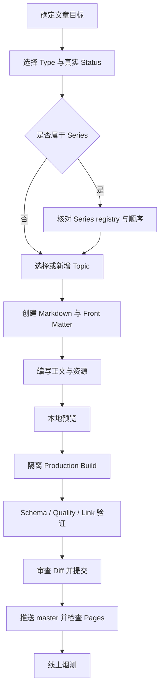

# 新增博客文章操作手册

本文档用于在本仓库中新增一篇公开 Post，并完成本地验证、提交、部署和线上复查。字段与排版的完整规则见 [POST_GUIDE.md](POST_GUIDE.md)；本文只保留日常操作所需的步骤和模板。

## 1. 总体流程



不要直接编辑以下内容：

- `_site/`：Jekyll 生成目录。
- `assets/css/jekyll-theme-chirpy.css`：编译后的 CSS。
- 仓库根目录的 `book-notes/`：被 Jekyll 排除的本地源笔记副本。

## 2. 开始前检查

在仓库根目录执行：

```powershell
Set-Location "C:\Users\jingzechen\projects\jingzechen.github.io"
$branch = git branch --show-current
if ($branch -ne "master") { throw "Expected master, current branch is $branch" }
git status --short --branch
```

如果工作树已有其他改动，不要覆盖或回退它们，也不要立即拉取。先提交或妥善隔离已有工作。确认工作树干净后再同步远端：

```powershell
git pull --ff-only origin master
if ($LASTEXITCODE -ne 0) { throw "Unable to fast-forward master" }
```

然后确认本次文章需要修改哪些文件，通常包括：

- `_posts/.../<post>.md`
- 可选：`_data/topics.yml`
- 可选：`_data/series.yml`
- 可选：`assets/img/posts/<uid>/...`
- 可选：需要增加反向正文链接的其他文章
- `docs/CONTENT_QUALITY_REPORT.md`：新增 Post 后必须重新生成

## 3. 选择内容类型与状态

### 3.1 Type

| `type` | 使用场景 | 推荐目录 |
| --- | --- | --- |
| `note` | 持续更新的知识节点 | `_posts/notes/<topic>/` |
| `essay` | 论证完整的长文章 | `_posts/essays/` |
| `journal` | 带日期语境的日志 | `_posts/journal/` |
| `reading` | 读书笔记或章节笔记；当前发布约定要求注册 Series 和显式顺序 | `_posts/reading/<series>/` |
| `project` | 项目设计、实现与复盘 | `_posts/projects/<project>/` |
| `idea` | 尚待展开的问题或想法 | `_posts/ideas/` |

现有读书笔记继续保留在 `_posts/book-notes/`。新阅读内容优先使用 `_posts/reading/`；目录只用于维护，不决定最终 URL。

### 3.2 Status

| `status` | 判断标准 |
| --- | --- |
| `seedling` | 早期记录，论据、结构或结论仍待验证和扩展 |
| `growing` | 已有完整主线，可以阅读，但仍计划持续修订 |
| `evergreen` | 已经过编辑复核，当前结构、论据与结论相对稳定 |

按文章真实成熟度选择，不要为了启用筛选或制造分布而机械分配状态。只有一个状态时，列表会自动隐藏重复 Marker；文章详情仍显示自己的状态。

## 4. 选择 Topic 与 Series

### 4.1 Topic

1. 先检查 [_data/topics.yml](../_data/topics.yml) 是否已有合适的 Topic。
2. 每篇通常使用 1 至 3 个稳定知识主题。
3. 使用小写 ASCII slug，例如 `machine-learning`。
4. 不要使用 `_config.yml` 中 `garden.hidden_topics` 列出的值；当前禁止写入 `books`。
5. 临时关键词放入 `tags`，不要为了单篇文章创建过细 Topic。

新增 Topic 时，在 `_data/topics.yml` 中补充：

```yaml
distributed-systems:
  title: Distributed Systems
  description: Coordination, consistency, replication, and failure handling across networked systems.
  related: [software-architecture, operating-systems]
  start_here: [consensus-basics]
```

要求：

- `related` 使用已存在的 Topic slug。
- `related` 不能包含当前 Topic 自己。
- `start_here` 使用文章 `uid`，只列真正适合入门的 1 至 3 篇。
- 每个 `start_here` 目标必须已经存在，并且该文章的 `topics` 必须包含当前 Topic。
- 如果首篇文章尚未发布，可以先使用空数组 `start_here: []`，文章通过构建后再补推荐入口。

### 4.2 Series

文章属于书籍、专题或项目系列时：

1. 选择稳定的 `series` slug。
2. 检查 [_data/series.yml](../_data/series.yml) 是否已有条目。
3. 新增或插入章节时，为整个 Series 维护从 1 开始、连续且不重复的 `series_order`。
4. 不从中文标题或发布时间推断章节顺序。

当前站点的 Reading 发布约定要求每篇 `type: reading` 文章都填写已注册的 `series` 和正整数 `series_order`。构建会拒绝未注册的非空 Series，并要求 Reading JSON 中存在 `series_order`；`series` 本身目前属于编辑约定，而非 schema 必填字段。不属于 Series 的独立知识文章优先使用 `note` 或 `essay`；不要仅为了通过构建填写虚假的 Series。

新 Series 示例：

```yaml
distributed-systems-reading:
  title: Designing Data-Intensive Applications
  author: Martin Kleppmann
  description: Notes on reliable, scalable, and maintainable data systems.
  url: /categories/designing-data-intensive-applications/
  topics: [distributed-systems]
```

其中 `title`、`description`、`url`、`topics` 必填，`author` 和 `external_url` 可选。Series URL 当前优先复用叶级 Category，因此文章的 `categories` 应与该 URL 对应的分类保持一致。

## 5. 创建文件

文件名必须是：

```text
YYYY-MM-DD-lowercase-ascii-slug.md
```

例如：

```text
_posts/notes/distributed-systems/2026-08-05-consensus-basics.md
_posts/reading/ddia/2026-08-05-ddia-ch01-reliable-scalable-maintainable.md
```

同时确定一个全站唯一、发布后不再修改的 `uid`。文件 slug 与 `uid` 可以相同；URL 默认由文件名中的 slug 生成：

```text
/posts/<file-slug>/
```

检查 UID 是否重复：

```powershell
$uid = "consensus-basics"
rg --crlf --glob "_posts/**/*.md" "^uid:\s*$([regex]::Escape($uid))$"
```

新文章在 `_drafts/` 中撰写时，文件名不需要日期。发布前再移动到 `_posts/` 并补齐日期。

如果 Draft 已被 Git 跟踪，使用 `git mv`，确保删除旧路径和新增目标路径同时进入暂存区：

```powershell
git mv "_drafts/consensus-basics.md" "_posts/notes/distributed-systems/2026-08-05-consensus-basics.md"
```

未跟踪的 Draft 可以使用 `Move-Item`，之后按第 12 节暂存目标文件。

## 6. Front Matter 模板

### 6.1 普通文章模板

```markdown
---
title: "共识问题的基本模型"
date: 2026-08-05 08:00:00 +0800
updated: 2026-08-05
uid: consensus-basics
type: note
content_lang: zh-CN
status: seedling
topics: [distributed-systems]
related: []
categories: [技术, 分布式系统]
tags: [distributed-systems, consensus]
description: "从故障模型、安全性与活性出发，解释分布式共识要解决的问题以及常见算法成立所需的假设。"
toc: true
---

## 问题背景

正文从二级标题开始。
```

### 6.2 Series 文章模板

```markdown
---
title: "《书名》第 1 章读书笔记：章节标题"
date: 2026-08-05 08:10:00 +0800
updated: 2026-08-05
uid: book-slug-ch01
type: reading
content_lang: zh-CN
status: growing
topics: [distributed-systems]
series: book-slug
series_order: 1
related: []
categories: [读书笔记, 分布式系统, 书名]
tags: [distributed-systems, reading-notes]
description: "说明本章具体解决的问题、核心推导和适用边界，不重复标题，也不使用通用模板摘要。"
toc: true
math: true
mermaid: true
---

## 本章目标

正文从这里开始。
```

只保留真实需要的可选字段。不含公式或 Mermaid 时，删除 `math` 或 `mermaid`，无需写成 `false`。

上面的 Series 模板可用于该 Series 的首篇文章。向现有 Series 插入文章时，应根据实际位置设置 `series_order`，同步重排后续文章，并且只把已经存在的 UID 加入 `related`。

### 6.3 字段检查表

构建强制字段：

- `uid`：全站唯一的小写 ASCII slug。
- `type`：只能使用站点配置允许的六种值。
- `status`：只能是 `seedling`、`growing`、`evergreen`。
- `topics`：YAML 数组，且不能包含隐藏 Topic。
- `description`：文章专属摘要，不能使用重复模板。
- `content_lang`：当前只能是 `zh-CN` 或 `en`。

规范发布还应填写：

- `title`
- `date`: `YYYY-MM-DD HH:MM:SS +0800`
- `updated`: `YYYY-MM-DD`
- `categories`
- `tags`

Description 建议中文 35 至 80 字、英文 90 至 180 个字符。质量门禁拒绝中文超过 100 字、英文超过 180 个字符的摘要，并拒绝重复摘要。

发布日期不能晚于实际构建时间，否则 production build 会静默跳过文章。同日发布多篇时，可使用递增分钟数。

## 7. 可选能力

### 7.1 Related 与 Backlinks

使用目标文章的 `uid`：

```yaml
related: [consensus-safety, consensus-liveness]
```

- 目标 UID 必须存在。
- 不允许自引用或重复 UID。
- Related 是当前文章主动声明的关系；目标文章的 Backlinks 由插件自动生成。
- 正文中的上下文链接仍优先使用 ``。

### 7.2 References

```yaml
references:
  - title: "In Search of an Understandable Consensus Algorithm"
    url: "https://raft.github.io/raft.pdf"
    note: "Raft 原始论文。"
```

每一项的 `title` 与 `url` 必填，`note` 可选。

### 7.3 Featured

只有确实适合作为首页入口时才设置：

```yaml
featured: true
why_start_here: "从这篇开始可以先建立后续文章共用的问题模型。"
```

全站必须保持 2 至 5 篇 Featured；新增前先检查现有数量：

```powershell
rg --crlf --glob "_posts/**/*.md" "^featured:\s*true$"
```

如果新增后超过 5 篇，应从不再代表当前重点的文章中移除 `featured: true`，不要提高门禁上限。

### 7.4 Math、Mermaid 与 Liquid

- 含 MathJax 公式时设置 `math: true`。
- 含 Mermaid 图时设置 `mermaid: true`。
- Mermaid 用于解释状态、时序、数据流或组件关系，不作装饰。
- 正文需要展示 Liquid 字面量时，使用 Liquid 的 `raw` 块包裹，防止 Jekyll 执行示例：

```liquid

{{ page.title }}

```

## 8. 正文编写

1. 不要在正文重复一级标题 `#`；页面标题由 Front Matter 生成。
2. 正文从 `##` 开始，标题层级不要跳级。
3. 开头尽快说明背景、问题和本文能得到的结论。
4. 长文按概念和推导组织，不要堆砌孤立摘录。
5. 技术示例说明前提、输入、输出与失败边界。
6. 链接使用有意义的文字，不写“点击这里”。
7. 引用过的外部资料加入 `references`。
8. 文章状态变化时才调整 `status`；内容观点或结构变化时更新 `updated`。

## 9. 图片和资源

文章专属资源放在：

```text
assets/img/posts/<uid>/
```

正文示例：

```markdown
{: width="1200" height="630" }
_图 1：正常选举阶段的消息流。_
```

上面的路径是格式示例；发布时必须先将对应文件加入 `assets/img/posts/consensus-basics/`。

要求：

- 文件名使用小写 ASCII slug。
- 提供准确替代文本。
- 尽量填写图片宽高，减少 CLS。
- 提交前压缩大图。
- 不使用本机绝对路径。
- 预览图在 Front Matter 中使用 `image.path` 与 `image.alt`。

## 10. 本地预览

### 10.1 普通预览

```powershell
bundle exec jekyll serve --host 127.0.0.1 --port 4000
```

草稿预览：

```powershell
bundle exec jekyll serve --drafts --host 127.0.0.1 --port 4000
```

浏览器重点检查：

- 文章 URL、标题、摘要和日期。
- 分类、标签、Topic 和 Series 链接。
- TOC 层级和长标题换行。
- Related、Backlinks、上一篇与下一篇。
- 公式、Mermaid、代码、表格和图片。
- 375px 移动端是否有横向页面溢出。
- 控制台是否有脚本错误或资源 404。

## 11. 发布前验证

本仓库在 Windows 上不要求执行 `npm install`。使用已有 Ruby、Bundler 和 Node 完成以下验证。

### 11.1 隔离 Production Build

不要依赖可能过期的 `_site/`。使用唯一临时目录：

```powershell
Set-Location "C:\Users\jingzechen\projects\jingzechen.github.io"
$env:JEKYLL_ENV = "production"
$site = Join-Path $env:TEMP ("garden-post-" + [guid]::NewGuid().ToString("N"))

bundle exec jekyll build --disable-disk-cache --destination $site
if ($LASTEXITCODE -ne 0) { throw "Production Jekyll build failed" }

bundle exec ruby tools/validate-garden.rb $site
if ($LASTEXITCODE -ne 0) { throw "Garden validation failed" }

bundle exec ruby tools/content-quality.rb `
  --markdown docs/CONTENT_QUALITY_REPORT.md `
  --check
if ($LASTEXITCODE -ne 0) { throw "Content quality validation failed" }
```

新增 Post 会改变文章总数、元数据分布或 TOC 复核清单，因此会使已跟踪的质量报告过期。上面的命令会重新生成并校验 [CONTENT_QUALITY_REPORT.md](CONTENT_QUALITY_REPORT.md)；必须审查并随文章一起提交该报告。

确认输出中的文章数比新增前增加了预期数量，并且没有：

- Schema 或 YAML 错误。
- 重复 UID、Description 或 `series_order`。
- 缺失 Topic/Series registry。
- 隐藏 Topic。
- future post 被跳过。
- Related UID 或 Reference 错误。

### 11.2 HTMLProofer

Windows 上 HTMLProofer 传入绝对临时路径可能静默扫描 0 个文件。必须进入生成目录后运行，并指向仓库 Gemfile：

```powershell
$repo = "C:\Users\jingzechen\projects\jingzechen.github.io"
$env:BUNDLE_GEMFILE = Join-Path $repo "Gemfile"
Push-Location $site

bundle exec htmlproofer . `
  --disable-external `
  --ignore-urls '/^http:\/\/127.0.0.1/,/^http:\/\/0.0.0.0/,/^http:\/\/localhost/'

$result = $LASTEXITCODE
Pop-Location
if ($result -ne 0) { throw "HTMLProofer failed with exit code $result" }
```

输出必须显示实际扫描的 HTML 文件和内部链接数量；`Ran on 0 files` 不算通过。

### 11.3 可选的 Bash 一键验证

在可用 Bash 的环境中：

```bash
./tools/test.sh
```

该命令会重建 `_site/`，因此不要与其他 Jekyll 构建并发运行。

## 12. 提交前审查

```powershell
git status --short
git diff --check
git diff --stat
git diff -- _posts _data assets/img docs
```

逐项确认：

- [ ] 新文章位于 `_posts/`，不是根目录 `book-notes/`。
- [ ] 文件名日期与 `date` 一致，发布时间不是未来时间。
- [ ] UID 唯一且使用小写 ASCII slug。
- [ ] Type、Status、Content Language 使用允许值。
- [ ] Topic 已注册，且未使用 `books`。
- [ ] Description 具体、唯一且长度合适。
- [ ] Categories 与 Tags 沿用现有命名。
- [ ] Series 条目存在，顺序连续且无重复。
- [ ] Related UID 和 References 均有效。
- [ ] 正文无重复 H1，标题层级连续。
- [ ] 公式、Mermaid 与资源标志正确。
- [ ] Production Build、Garden Validator、Quality Gate 和 HTMLProofer 通过。
- [ ] `docs/CONTENT_QUALITY_REPORT.md` 已重新生成、审查并暂存。
- [ ] 没有提交 `_site/`、缓存、临时报告或本地源副本。

只暂存本次内容：

```powershell
git add -- "_posts/path/to/new-post.md"
git add -- "_data/topics.yml"
git add -- "_data/series.yml"
git add -- "assets/img/posts/consensus-basics"
git add -- "docs/CONTENT_QUALITY_REPORT.md"
```

只执行本次确实改动且路径存在的行。暂存后检查：

```powershell
git diff --cached --check
git diff --cached --stat
git diff --cached -- _posts _data assets/img docs
```

最后一条必须实际显示本次暂存的文章、数据、资源和报告内容；不要只根据文件数量提交。

## 13. 提交、部署与线上复查

```powershell
git commit -m "Publish <article title>"
git push origin master
```

随后：

1. 打开 GitHub Actions 的 `Build and Deploy`。
2. 确认 run 的 `head_sha` 对应刚提交的 commit。
3. 等待 `build` 和 `deploy` 都为 `success`。
4. 打开公网文章并强制刷新。
5. 检查文章、Topic、Series、Category、Tag、Search 和 Feed 中是否出现。
6. 验证 Related/Backlinks、图片、公式、Mermaid 和内部锚点。
7. 在 375px 和桌面视口各检查一次页面溢出与可读性。
8. 确认工作树干净且本地分支与 `origin/master` 同步。

## 14. 常见失败与处理

| 失败 | 常见原因 | 处理方式 |
| --- | --- | --- |
| 文章未出现在 production build | `date` 晚于构建时间 | 校正 `date`，不要用 `--future` 代替生产验证 |
| `missing '<field>'` | 缺少 schema 必填字段 | 按第 6 节补字段 |
| `invalid type/status/content_lang` | 值不在 `_config.yml` 允许列表 | 使用已有值或先修改站点契约 |
| `duplicate uid` | UID 已被其他文章使用 | 发布前改为新的稳定 UID |
| `remove hidden topics books` | Front Matter 包含公共 Topic | 删除 `books`，由 `type: reading` 表达阅读内容 |
| Series registry 错误 | `_data/series.yml` 无对应 slug | 新增或修正 Series 条目 |
| Series 顺序错误 | `series_order` 重复、不连续或插入后未重排 | 统一重排该 Series 的全部顺序 |
| Related UID 不存在 | 使用了文件名、URL 或未发布 UID | 改为真实文章 UID |
| Description gate 失败 | 摘要重复、模板化或过长 | 按文章内容重新写具体摘要 |
| Quality report stale | 内容分布变化但报告未更新 | 运行 `bundle exec ruby tools/content-quality.rb --markdown docs/CONTENT_QUALITY_REPORT.md --check`，审查并暂存报告 |
| HTMLProofer 显示 0 files | Windows 绝对路径未被扫描 | 进入生成目录并对 `.` 运行 |
| 页面仍显示旧版本 | Service Worker 或浏览器缓存 | 确认 Pages SHA 后强制刷新或清除站点缓存 |

## 15. 最短发布路径

新增一篇不属于 Series、无图片、无公式的普通文章时，至少完成：

1. 在 `_posts/<type>/` 新建 `YYYY-MM-DD-slug.md`。
2. 使用第 6.1 节模板，填写真实 Type、Status、Topic 和 Description。
3. 确保 Topic 已存在、UID 唯一、日期不是未来时间。
4. 编写正文并本地预览。
5. 执行隔离 production build、两个 Ruby gate 和 HTMLProofer。
6. 审查并只暂存本次文件。
7. 提交、推送、等待 Pages 成功并在线复查。